# SpringCloud01

- [SpringCloud01](#springcloud01)
- [1.认识微服务](#1认识微服务)
  - [1.0.学习目标](#10学习目标)
  - [1.1.单体架构](#11单体架构)
  - [1.2.分布式架构](#12分布式架构)
  - [1.3.微服务](#13微服务)
    - [微服务结构](#微服务结构)
    - [技术对比](#技术对比)
  - [1.4.SpringCloud](#14springcloud)
  - [1.5.总结](#15总结)
- [2.服务拆分和远程调用](#2服务拆分和远程调用)
  - [2.1.服务拆分原则](#21服务拆分原则)
  - [2.2.服务拆分示例](#22服务拆分示例)
    - [2.2.1.导入Sql语句](#221导入sql语句)
    - [2.2.2.导入demo工程](#222导入demo工程)
  - [2.3.实现远程调用案例](#23实现远程调用案例)
    - [2.3.1.案例需求：](#231案例需求)
    - [2.3.2.注册RestTemplate](#232注册resttemplate)
    - [2.3.3.实现远程调用](#233实现远程调用)
    - [小结](#小结)
      - [常见微服务协议](#常见微服务协议)
  - [2.4.提供者与消费者](#24提供者与消费者)
  - [目前微服务调用方式的问题](#目前微服务调用方式的问题)
- [3.Eureka注册中心](#3eureka注册中心)
  - [3.1.Eureka的结构和作用](#31eureka的结构和作用)
  - [3.2.搭建eureka-server](#32搭建eureka-server)
    - [3.2.1.创建eureka-server服务](#321创建eureka-server服务)
    - [3.2.2.引入eureka依赖](#322引入eureka依赖)
    - [3.2.3.编写启动类](#323编写启动类)
    - [3.2.4.编写配置文件](#324编写配置文件)
    - [3.2.5.启动服务](#325启动服务)
  - [3.3.服务注册](#33服务注册)
    - [1）引入依赖](#1引入依赖)
    - [2）配置文件](#2配置文件)
    - [3）启动多个user-service实例](#3启动多个user-service实例)
  - [3.4.服务发现](#34服务发现)
    - [1）引入依赖](#1引入依赖-1)
    - [2）配置文件](#2配置文件-1)
    - [3）服务拉取和负载均衡](#3服务拉取和负载均衡)
- [4.Ribbon负载均衡](#4ribbon负载均衡)
  - [4.1.负载均衡原理](#41负载均衡原理)
  - [4.2.源码跟踪](#42源码跟踪)
    - [1）LoadBalancerIntercepor](#1loadbalancerintercepor)
    - [2）LoadBalancerClient](#2loadbalancerclient)
    - [3）负载均衡策略IRule](#3负载均衡策略irule)
    - [4）总结](#4总结)
  - [4.3.负载均衡策略](#43负载均衡策略)
    - [4.3.1.负载均衡策略](#431负载均衡策略)
    - [4.3.2.自定义负载均衡策略](#432自定义负载均衡策略)
  - [4.4.饥饿加载](#44饥饿加载)
  - [总结](#总结)
- [5.Nacos注册中心](#5nacos注册中心)
  - [5.1.认识和安装Nacos](#51认识和安装nacos)
  - [5.2.服务注册到nacos](#52服务注册到nacos)
    - [1）引入依赖](#1引入依赖-2)
    - [2）配置nacos地址](#2配置nacos地址)
    - [3）重启](#3重启)
  - [5.3.服务分级存储模型](#53服务分级存储模型)
    - [5.3.1.给user-service配置集群](#531给user-service配置集群)
    - [5.3.2.同集群优先的负载均衡](#532同集群优先的负载均衡)
    - [总结](#总结-1)
  - [5.4.权重配置](#54权重配置)
  - [5.5.环境隔离（重要）](#55环境隔离重要)
    - [5.5.1.创建namespace](#551创建namespace)
    - [5.5.2.给微服务配置namespace](#552给微服务配置namespace)
  - [5.6.Nacos与Eureka的区别](#56nacos与eureka的区别)
- [CAP定理](#cap定理)


# 1.认识微服务

随着互联网行业的发展，对服务的要求也越来越高，服务架构也从单体架构逐渐演变为现在流行的微服务架构。这些架构之间有怎样的差别呢？

## 1.0.学习目标

了解微服务架构的优缺点


## 1.1.单体架构

**单体架构**：将业务的所有功能集中在一个项目中开发，打成一个包部署。


单体架构的优缺点如下：

**优点：**

- 架构简单
- 部署成本低

**缺点：**

- 耦合度高（维护困难、升级困难）


## 1.2.分布式架构

**分布式架构**：根据业务功能对系统做拆分，每个业务功能模块作为独立项目开发，称为一个服务。

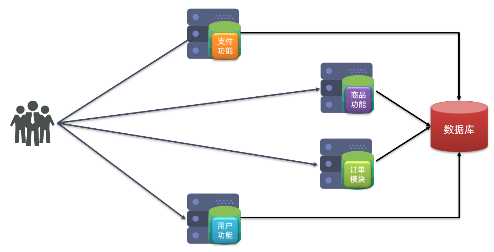


分布式架构的优缺点：

**优点：**

- 降低服务耦合
- 有利于服务升级和拓展

**缺点：**

- 服务调用关系错综复杂


分布式架构虽然降低了服务耦合，但是服务拆分时也有很多问题需要思考：

- 服务拆分的粒度如何界定？
- 服务之间如何调用？
- 服务的调用关系如何管理？

人们需要制定一套行之有效的标准来约束分布式架构。


## 1.3.微服务

微服务的架构特征：

- 单一职责：微服务拆分粒度更小，每一个服务都对应唯一的业务能力，做到单一职责
- 自治：团队独立、技术独立、数据独立，独立部署和交付
- 面向服务：服务暴漏提供统一标准的接口，与语言和技术无关
- 隔离性强：服务调用做好隔离、容错、降级，避免出现级联问题
- [补充]网关：通过统一的网关服务入口，自动转发到对应微服务，在网关处统一维护你的微服务映射关系
  - 用户不需要关心的你多个微服务的存在和不同域名列表，只需要调用统一的网关服务入口，网关服务再自动转发到对应微服务。
  - 微服务不能暴漏在公网，只能在内部网络中访问。只能通过统一的网关
  - 网关可以做负载均衡熔断降级等，也可以做权限校验、流量监控等。


微服务的上述特性其实是在给分布式架构制定一个标准，进一步降低服务之间的耦合度，提供服务的独立性和灵活性。做到高内聚，低耦合。

因此，可以认为**微服务**是一种经过良好架构设计的**分布式架构方案** 。

### 微服务结构

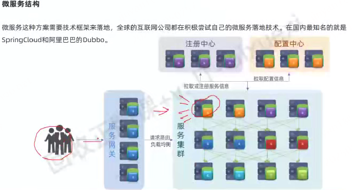


但方案该怎么落地？选用什么样的技术栈？全球的互联网公司都在积极尝试自己的微服务落地方案。

其中在Java领域最引人注目的就是SpringCloud提供的方案了。
### 技术对比
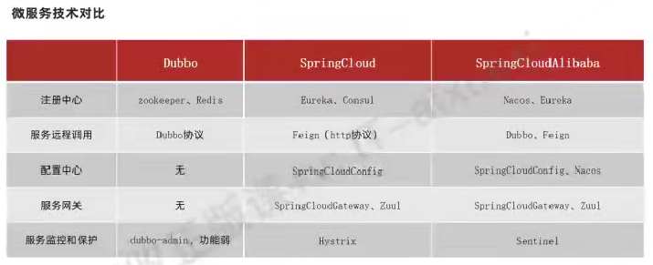

## 1.4.SpringCloud

SpringCloud是目前国内使用最广泛的微服务框架。官网地址：https://spring.io/projects/spring-cloud。

SpringCloud集成了各种微服务功能组件，并基于SpringBoot实现了这些组件的自动装配，从而提供了良好的开箱即用体验。

其中常见的组件包括：

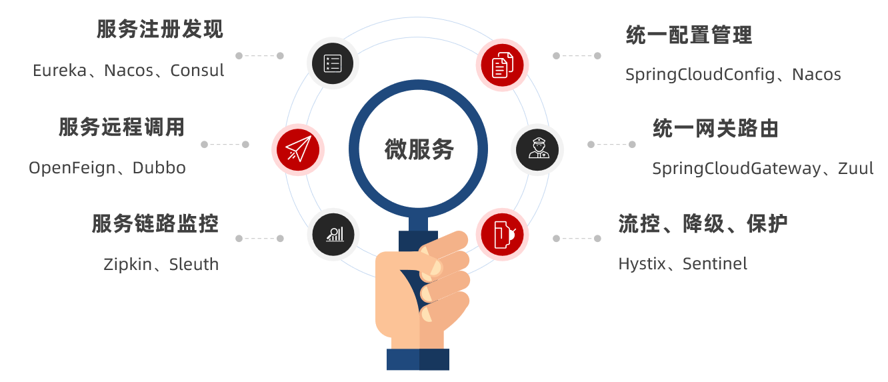


另外，SpringCloud底层是依赖于SpringBoot的，并且有版本的兼容关系，如下：


我们课堂学习的版本是 Hoxton.SR10，因此对应的SpringBoot版本是2.3.x版本。


## 1.5.总结

- 单体架构：简单方便，高度耦合，扩展性差，适合小型项目。例如：学生管理系统

- 分布式架构：松耦合，扩展性好，但架构复杂，难度大。适合大型互联网项目，例如：京东、淘宝

- 微服务：一种良好的分布式架构方案

  ①优点：拆分粒度更小、服务更独立、耦合度更低

  ②缺点：架构非常复杂，运维、监控、部署难度提高

- SpringCloud是微服务架构的一站式解决方案，集成了各种优秀微服务功能组件


# 2.服务拆分和远程调用

任何分布式架构都离不开服务的拆分，微服务也是一样。

## 2.1.服务拆分原则

这里我总结了微服务拆分时的几个原则：

- 单一职责：不同微服务，不要重复开发相同业务
- 数据独立：微服务数据独立，不要访问其它微服务的数据库
- 面向服务：微服务可以将自己的业务暴露为接口，供其它微服务调用


## 2.2.服务拆分示例

以课前资料中的微服务cloud-demo为例，其结构如下：


cloud-demo：父工程，管理依赖

- order-service：订单微服务，负责订单相关业务
- user-service：用户微服务，负责用户相关业务

要求：

- 订单微服务和用户微服务都必须有各自的数据库，相互独立
- 订单服务和用户服务都对外暴露Restful的接口
- 订单服务如果需要查询用户信息，只能调用用户服务的Restful接口，不能查询用户数据库


### 2.2.1.导入Sql语句

分别在mysql中创建 `cloud_order`订单库   `cloud_user` 用户库，并将课前资料提供的`cloud-order.sql`和`cloud-user.sql`导入到mysql中：


cloud-user表中初始数据如下：


cloud-order表中初始数据如下：

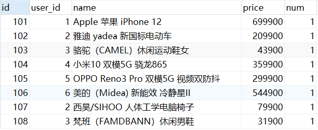


cloud-order表中持有cloud-user表中的id字段。


### 2.2.2.导入demo工程

用IDEA导入课前资料提供的Demo：

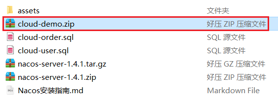


项目结构如下：


导入后，会在IDEA右下角出现弹窗：


点击弹窗，然后按下图选择：


会出现这样的菜单：


配置下项目使用的JDK：


## 2.3.实现远程调用案例


在order-service服务中，有一个根据id查询订单的接口：


根据id查询订单，返回值是Order对象，如图：

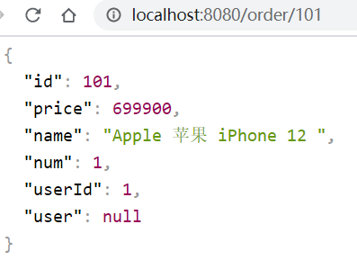

其中的user为null


在user-service中有一个根据id查询用户的接口：


查询的结果如图：


### 2.3.1.案例需求：

修改order-service中的根据id查询订单业务，要求在查询订单的同时，根据订单中包含的userId查询出用户信息，一起返回。


因此，我们需要在order-service中 向user-service发起一个http的请求，调用http://localhost:8081/user/{userId}这个接口。

大概的步骤是这样的：

- 注册一个RestTemplate的实例到Spring容器（在微服务中发起http请求）
  - RestTemplate 是 Spring 框架提供的一个同步 HTTP 客户端工具，主要用于在 Java 应用中发送 HTTP 请求并处理响应，简化了与 RESTful API 交互的代码编写
- 修改order-service服务中的OrderService类中的queryOrderById方法，根据Order对象中的userId查询User
- 将查询的User填充到Order对象，一起返回


### 2.3.2.注册RestTemplate

首先，我们在order-service服务中的OrderApplication启动类中，注册RestTemplate实例：

```java
package cn.itcast.order;

import org.mybatis.spring.annotation.MapperScan;
import org.springframework.boot.SpringApplication;
import org.springframework.boot.autoconfigure.SpringBootApplication;
import org.springframework.context.annotation.Bean;
import org.springframework.web.client.RestTemplate;

@MapperScan("cn.itcast.order.mapper")
@SpringBootApplication
public class OrderApplication {

    public static void main(String[] args) {
        SpringApplication.run(OrderApplication.class, args);
    }

    @Bean
    public RestTemplate restTemplate() {
        return new RestTemplate();
    }
}
```


### 2.3.3.实现远程调用

修改order-service服务中的cn.itcast.order.service包下的OrderService类中的queryOrderById方法：


### 小结

1. 当前微服务实现调用方式
   1. 基于RestTemplate发起的htt请求实现远程调用http请求做远程调用是与语言无关的调用，只要知道对方的ip、端口、接口路径、请求参数即可。
   2. 后续会学习微服务框架中的标准协议调用方式，比如：Feign、OpenFeign、RestTemplate+Ribbon、RestTemplate+LoadBalancer
   3. 调用方式的对比
      1. RestTemplate+Ribbon：基于RestTemplate发起的http请求，结合Ribbon实现负载均衡
      2. RestTemplate+LoadBalancer：基于RestTemplate发起的http请求，结合LoadBalancer实现负载均衡
      3. Feign：基于注解的声明式调用，不需要编写代码即可实现调用
      4. OpenFeign：Feign的增强版，支持负载均衡、熔断等功能
#### 常见微服务协议
```js
1. HTTP 协议（最常用，适合跨语言、轻量场景）

特点：基于 TCP，属于应用层协议，支持 JSON/XML 等文本格式，可读性强，实现简单。

优势：

跨语言兼容性好（任何语言都能轻松实现 HTTP 客户端）；
适合对外 API 或不同技术栈的微服务间通信（如 Java 服务调用 Node.js 服务）；
配合 RESTful 设计风格，语义清晰（GET/POST/PUT/DELETE 对应资源操作）。

劣势：
文本传输效率较低（相比二进制协议，额外开销大）；
性能不如二进制协议（序列化 / 反序列化耗时）。

典型工具：
Java：Spring Cloud 的 RestTemplate、WebClient；

跨语言：HTTP 客户端库（如 Python 的 requests、Node.js 的 axios）。

适用场景：中小规模微服务、跨语言通信、对性能要求不极致的场景（如后台管理系统、非核心业务）。

2. RPC 协议（适合同语言、高性能场景）
RPC（远程过程调用）是一类协议的统称，核心是 “像调用本地方法一样调用远程服务”，通常基于二进制协议，性能优于 HTTP。

特点：
二进制传输（如 Protobuf、Thrift 序列化），效率高；
紧密依赖特定语言的 SDK（如 Java 的 Dubbo、Golang 的 gRPC）；
支持同步 / 异步调用、负载均衡、熔断等高级特性。

常见实现：
gRPC：跨语言 RPC 框架，基于 HTTP/2 和 Protobuf，支持流式通信，性能优异，适合多语言微服务（如 Java 调用 Go 服务）；
Dubbo：阿里开源的 Java 微服务框架，默认使用 Dubbo 私有二进制协议，适合纯 Java 技术栈，性能极高；
Thrift：Facebook 开源的跨语言 RPC 框架，支持多种序列化格式和传输协议，适合数据密集型服务。

优势：性能远高于 HTTP（尤其高并发场景），调用方式更贴近本地方法。
劣势：跨语言支持需依赖框架（不如 HTTP 通用），协议细节较复杂（开发门槛稍高）。

适用场景：大规模微服务、高并发核心业务（如电商交易、支付）、同语言技术栈（如全 Java 或全 Go 架构）。

3. 消息队列协议（适合异步通信场景）
当微服务间需要异步解耦（如 “下单后通知物流”“支付后更新库存”），会使用消息队列传递消息，此时依赖的是消息队列的协议。

常见协议：
AMQP（如 RabbitMQ）：高级消息队列协议，支持复杂的路由规则、消息确认机制；
MQTT：轻量级协议，适合物联网（IoT）场景，带宽占用低；
Kafka 协议：Kafka 自定义的二进制协议，适合高吞吐、大数据量场景。

特点：异步通信，发送方无需等待接收方响应，通过 “消息” 传递数据，实现服务解耦。
适用场景：事件驱动架构、非实时依赖的业务（如日志收集、通知推送、异步任务）。

4. 其他特殊协议
WebSocket：全双工通信协议，适合需要实时交互的场景（如聊天服务、实时数据推送）；
GraphQL：一种查询语言（基于 HTTP），允许客户端按需获取数据，减少请求次数（适合前端灵活获取数据的场景）。

-- 总结：如何选择协议？
跨语言 / 轻量需求：优先 HTTP（RESTful 或 GraphQL）；
高性能 / 同语言：优先 RPC（gRPC 或 Dubbo）；
异步解耦：优先消息队列协议；
实时交互：优先 WebSocket。
```
## 2.4.提供者与消费者

在服务调用关系中，会有两个不同的角色：

**服务提供者**：一次业务中，被其它微服务调用的服务。（提供接口给其它微服务）

**服务消费者**：一次业务中，调用其它微服务的服务。（调用其它微服务提供的接口）


但是，服务提供者与服务消费者的角色并不是绝对的，而是相对于业务而言。

如果服务A调用了服务B，而服务B又调用了服务C，服务B的角色是什么？

- 对于A调用B的业务而言：A是服务消费者，B是服务提供者
- 对于B调用C的业务而言：B是服务消费者，C是服务提供者


因此，服务B既可以是服务提供者，也可以是服务消费者。


## 目前微服务调用方式的问题

1. 微服务url地址每个都不一样，每个都写死在代码里，难以维护管理，后续会用微服务框架统一调用协议，省去自己维护对应微服务的地址列表
2. 目前是单节点都调用的，为了高可用容错后面肯定都要上集群的，那多个地址咋维护？
   1. 集群的节点地址很多，我怎么知道用户服务当前一共有哪些节点ip，且集群中ip都是动态变化的，该如何负载均衡地进行链接？
   2. -----这就引出了服务地**注册中心**

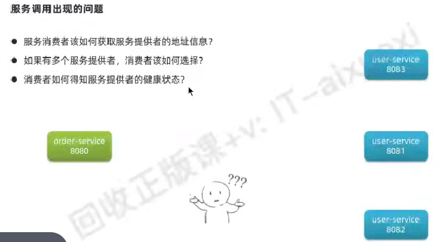


# 3.Eureka注册中心


假如我们的服务提供者user-service部署了多个实例，如图：


大家思考几个问题：

- order-service在发起远程调用的时候，该如何得知user-service实例的ip地址和端口？
- 有多个user-service实例地址，order-service调用时该如何选择？
- order-service如何得知某个user-service实例是否依然健康，是不是已经宕机？


## 3.1.Eureka的结构和作用

这些问题都需要利用SpringCloud中的注册中心来解决，其中最广为人知的注册中心就是Eureka，其结构如下：


回答之前的各个问题。

问题1：order-service如何得知user-service实例地址？

获取地址信息的流程如下：

- user-service服务实例启动后，将自己的信息注册到eureka-server（Eureka服务端）。这个叫服务注册
- eureka-server保存服务名称到服务实例地址列表的映射关系
- order-service根据服务名称，拉取实例地址列表。这个叫服务发现或服务拉取


问题2：order-service如何从多个user-service实例中选择具体的实例？

- order-service从实例列表中利用负载均衡算法选中一个实例地址
- 向该实例地址发起远程调用


问题3：order-service如何得知某个user-service实例是否依然健康，是不是已经宕机？

- user-service会每隔一段时间（默认30秒）向eureka-server发起请求，报告自己状态，称为心跳
- 当超过一定时间没有发送心跳时，eureka-server会认为微服务实例故障，将该实例从服务列表中剔除
- order-service拉取服务时，就能将故障实例排除了


> 注意：一个微服务，既可以是服务提供者，又可以是服务消费者，因此eureka将服务注册、服务发现等功能统一封装到了eureka-client端


因此，接下来我们动手实践的步骤包括：


- 最终可知，eureka 包括服务端和客户端
  - eureka-server：服务端，用来接收注册的服务
  - eureka-client：客户端，用来注册服务

## 3.2.搭建eureka-server

首先大家注册中心服务端：eureka-server，这必须是一个独立的微服务

### 3.2.1.创建eureka-server服务

在cloud-demo父工程下，创建一个子模块：


填写模块信息：


然后填写服务信息：


### 3.2.2.引入eureka依赖

引入SpringCloud为eureka提供的starter依赖：

```xml
<dependency>
    <groupId>org.springframework.cloud</groupId>
    <artifactId>spring-cloud-starter-netflix-eureka-server</artifactId>
</dependency>
```


### 3.2.3.编写启动类

给eureka-server服务编写一个启动类，一定要添加一个@EnableEurekaServer注解，开启eureka的注册中心功能：

```java
package cn.itcast.eureka;

import org.springframework.boot.SpringApplication;
import org.springframework.boot.autoconfigure.SpringBootApplication;
import org.springframework.cloud.netflix.eureka.server.EnableEurekaServer;

@SpringBootApplication
@EnableEurekaServer
public class EurekaApplication {
    public static void main(String[] args) {
        SpringApplication.run(EurekaApplication.class, args);
    }
}
```


### 3.2.4.编写配置文件

编写一个application.yml文件，内容如下：

```yaml
server:
  port: 10086
spring:
  application:
    name: eureka-server
eureka:
  client:
    service-url: 
      defaultZone: http://127.0.0.1:10086/eureka
    register-with-eureka: false # false表示不向注册中心注册自己。
    fetch-registry: false # false表示自己端就是注册中心，我的职责就是维护服务实例，并不需要去检索服务      
```


### 3.2.5.启动服务

启动微服务，然后在浏览器访问：http://127.0.0.1:10086

看到下面结果应该是成功了：


## 3.3.服务注册

下面，我们将user-service注册到eureka-server中去。

### 1）引入依赖

在user-service的pom文件中，引入下面的eureka-client依赖：

```xml
<dependency>
    <groupId>org.springframework.cloud</groupId>
    <artifactId>spring-cloud-starter-netflix-eureka-client</artifactId>
</dependency>
```


### 2）配置文件

在user-service中，修改application.yml文件，添加服务名称、eureka地址：

```yaml
server:
  port: 8081
  ...
# 上面的user-service配置省略不写
spring:
  application:
    name: userservice # 取个微服务的名字
eureka:
  client:
    service-url:
      defaultZone: http://127.0.0.1:10086/eureka
```


### 3）启动多个user-service实例
> 形成user-service这个微服务集群的效果

为了演示一个服务有多个实例的场景，我们添加一个SpringBoot的启动配置，再启动一个user-service。

首先，复制原来的user-service启动配置：

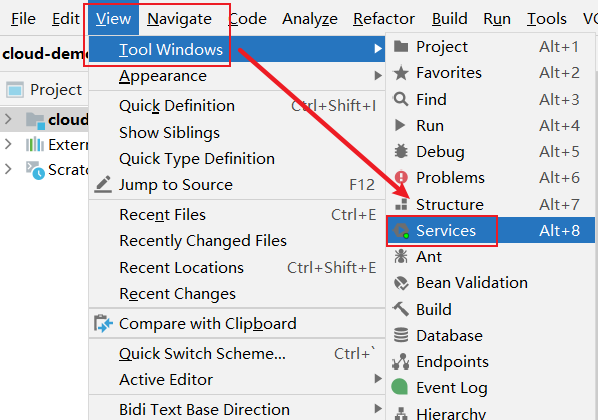

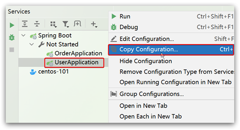

然后，在弹出的窗口中，填写信息：

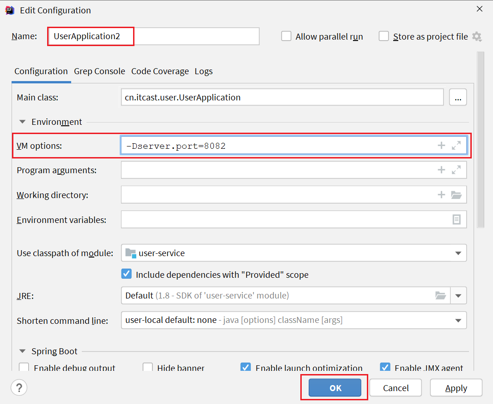


现在，SpringBoot窗口会出现两个user-service启动配置：

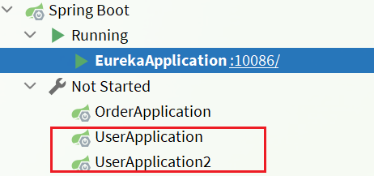

不过，第一个是8081端口，第二个是8082端口。

启动两个user-service实例：

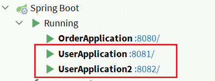

查看eureka-server管理页面：


## 3.4.服务发现

下面，我们将order-service的逻辑修改：向eureka-server拉取user-service的信息，实现服务发现。

### 1）引入依赖

之前说过，服务发现、服务注册统一都封装在eureka-client依赖，因此这一步与服务注册时一致。

在order-service的pom文件中，引入下面的eureka-client依赖：

```xml
<dependency>
    <groupId>org.springframework.cloud</groupId>
    <artifactId>spring-cloud-starter-netflix-eureka-client</artifactId>
</dependency>
```


### 2）配置文件

服务发现也需要知道eureka地址，因此第二步与服务注册一致，都是配置eureka信息：

在order-service中，修改application.yml文件，添加服务名称、eureka地址：

```yaml
spring:
  application:
    name: orderservice
eureka:
  client:
    service-url:
      defaultZone: http://127.0.0.1:10086/eureka
```


### 3）服务拉取和负载均衡

最后，我们要去eureka-server中拉取user-service服务的实例列表，并且实现负载均衡。

不过这些动作不用我们去做，只需要添加一些注解即可---分2步。


1. 在order-service的OrderApplication中，给RestTemplate这个Bean添加一个@LoadBalanced注解：
   1.  作用：就是要解析你的url路径的特殊写法，负责解析里面的微服务名字`.getForObject("http://userservice/user/`
   2.  进一步执行负载均衡逻辑


2. 修改order-service服务中的cn.itcast.order.service包下的OrderService类中的queryOrderById方法。修改访问的url路径，用服务名代替ip、端口：


```java
@RestController
@RequestMapping("order")
public class OrderController {
   @Autowired
   private OrderService orderService;
   @Autowired
   private RestTemplate restTemplate;
    @GetMapping("{orderId}")
    public Order queryOrderByUserId(@PathVariable("orderId") Long orderId) {
        // 根据id查询订单并返回
        Order order = orderService.queryOrderById(orderId);
        // 根据订单关联的用户id远程查询用户信息
        Long userId = order.getUserId();                  // 服务名称
        User user = restTemplate.getForObject("http://userservice/user/" + userId, User.class);
        // 1. 解析url地址，拿到被调用的微服务名称
        // 2. 去注册中心根据名称获取该微服务实例列表
        // 3. 基于负载均衡算法，从实例列表中选择一个
        // 4. 拼接url，发起调用

        order.setUser(user);
        return order;
    }
}
```

spring会自动帮助我们从eureka-server端，根据userservice这个服务名称，获取实例列表，而后完成负载均衡。


# 4.Ribbon负载均衡

上一节中，我们添加了@LoadBalanced注解，即可实现负载均衡功能，这是什么原理呢？

其实内部基于Ribbon实现的负载均衡


## 4.1.负载均衡原理

SpringCloud底层其实是利用了一个名为Ribbon的组件，来实现负载均衡功能的。


那么我们发出的请求明明是http://userservice/user/1，怎么变成了http://localhost:8081的呢？

## 4.2.源码跟踪

为什么我们只输入了service名称就可以访问了呢？之前还要获取ip和端口。

显然有人帮我们根据service名称，获取到了服务实例的ip和端口。它就是`LoadBalancerInterceptor`，这个类会在对RestTemplate的请求进行拦截，然后从Eureka根据服务id获取服务列表，随后利用负载均衡算法得到真实的服务地址信息，替换服务id。

我们进行源码跟踪：

### 1）LoadBalancerIntercepor


可以看到这里的intercept方法，拦截了用户的HttpRequest请求，然后做了几件事：

- `request.getURI()`：获取请求uri，本例中就是 http://user-service/user/8
- `originalUri.getHost()`：获取uri路径的主机名，其实就是服务id，`user-service`
- `this.loadBalancer.execute()`：处理服务id，和用户请求。

这里的`this.loadBalancer`是`LoadBalancerClient`类型，我们继续跟入。


### 2）LoadBalancerClient

继续跟入execute方法：


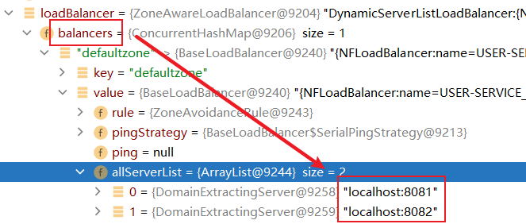

代码是这样的：

- getLoadBalancer(serviceId)：根据服务id获取ILoadBalancer，而ILoadBalancer会拿着服务id去eureka中获取服务列表并保存起来。
- getServer(loadBalancer)：利用内置的负载均衡算法，从服务列表中选择一个。本例中，可以看到获取了8082端口的服务


放行后，再次访问并跟踪，发现获取的是8081：

 

果然实现了负载均衡。


### 3）负载均衡策略IRule

在刚才的代码中，可以看到获取服务使通过一个`getServer`方法来做负载均衡:

 

我们继续跟入：


继续跟踪源码chooseServer方法，发现这么一段代码：

 

我们看看这个rule是谁：

 

这里的rule默认值是一个`RoundRobinRule`，看类的介绍：

 

这不就是轮询的意思嘛。

到这里，整个负载均衡的流程我们就清楚了。


### 4）总结

SpringCloudRibbon的底层采用了一个拦截器，拦截了RestTemplate发出的请求，对地址做了修改。用一幅图来总结一下：


基本流程如下：

- 拦截我们的RestTemplate请求http://userservice/user/1
- RibbonLoadBalancerClient会从请求url中获取服务名称，也就是user-service
- DynamicServerListLoadBalancer根据user-service到eureka拉取服务列表
- eureka返回列表，localhost:8081、localhost:8082
- IRule利用内置负载均衡规则，从列表中选择一个，例如localhost:8081
- RibbonLoadBalancerClient修改请求地址，用localhost:8081替代userservice，得到http://localhost:8081/user/1，发起真实请求


## 4.3.负载均衡策略


### 4.3.1.负载均衡策略

负载均衡的规则都定义在IRule接口中，而IRule有很多不同的实现类：


不同规则的含义如下：

| **内置负载均衡规则类**             | **规则描述**                                 |
| ------------------------- | ---------------------------------------- |
| RoundRobinRule            | 简单轮询服务列表来选择服务器。                          |
| AvailabilityFilteringRule | 对以下两种服务器进行忽略：   （1）在默认情况下，这台服务器如果3次连接失败，这台服务器就会被设置为“短路”状态。短路状态将持续30秒，如果再次连接失败，短路的持续时间就会几何级地增加-----也就是熔断机制。  （2）并发数过高的服务器。如果一个服务器的并发连接数过高，配置了AvailabilityFilteringRule规则的客户端也会将其忽略。并发连接数的上限，可以由客户端的<clientName>.<clientConfigNameSpace>.ActiveConnectionsLimit属性进行配置。 |
| WeightedResponseTimeRule  | 为每一个服务器赋予一个权重值。服务器响应时间越长，这个服务器的权重就越小。这个规则会随机选择服务器，这个权重值会影响服务器的选择。 |
| **ZoneAvoidanceRule**     | 以区域可用的服务器为基础进行服务器的选择。使用Zone对服务器进行分类，这个Zone可以理解为一个机房、一个机架等。而后再对Zone内的多个服务做轮询。 |
| BestAvailableRule         | 忽略那些短路的服务器，并选择并发数较低的服务器。                 |
| RandomRule                | 随机选择一个可用的服务器。                            |
| RetryRule                 | 重试机制的选择逻辑                                |

默认的实现就是ZoneAvoidanceRule，是一种轮询方案

轮询有两种方式：假如共4台机器，两台在北京，两台在上海，肯定是希望与调用方同城调度延迟最低
1. RoundRobinRule：简单轮询：就是所有机器挨个轮询

2. ZoneAvoidanceRule：时区内轮询：优先按照区域内的机器进行轮询。一个机房内就是一个区域内，
   1. 当与调用方同 Zone 的北京机房内，存在可用的服务实例（哪怕只有 1 个正常）时，ZoneAvoidanceRule 会严格遵循「区域亲和性」原则：
      1. 所有请求都会优先分配给北京机房内的实例（并在实例间轮询）；
      2. 上海机房的实例会被「闲置」，不会接收任何请求。
   2. 这是最常见的正常场景，目的是通过「同 Zone 调用」降低网络延迟、减少跨区域开销


### 4.3.2.自定义负载均衡策略

通过定义IRule实现可以修改负载均衡规则，有两种方式：

1. 代码方式：在order-service中的OrderApplication类中，定义一个新的IRule：

```java
@Bean
public IRule randomRule(){
    return new RandomRule();
}
```


2. 配置文件方式：在order-service的application.yml文件中，添加新的配置也可以修改规则：

```yaml
userservice: # 给某个微服务配置负载均衡规则，这里是userservice服务
  ribbon:
    NFLoadBalancerRuleClassName: com.netflix.loadbalancer.RandomRule # 负载均衡规则 
```

> **注意**，一般用默认的负载均衡规则，不做修改。

## 4.4.饥饿加载

Ribbon默认是采用懒加载，即第一次访问时才会去创建LoadBalanceClient，请求时间会很长。

而饥饿加载则会在项目启动时就立即创建，降低第一次访问的耗时，通过下面配置开启饥饿加载：
  - 饥饿加载就是立即加载
  - 懒加载就是第一次访问时再加载


```yaml
ribbon:
  eager-load:
    enabled: true
    clients: userservice # 指定被调用微服务饥渴加载
```
## 总结
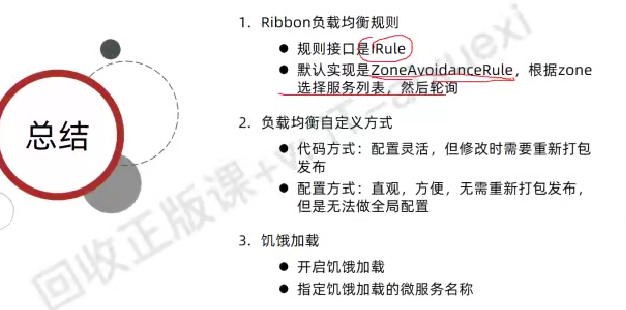

# 5.Nacos注册中心

国内公司一般都推崇阿里巴巴的技术，比如注册中心，SpringCloudAlibaba也推出了一个名为Nacos的注册中心。

## 5.1.认识和安装Nacos

[Nacos](https://nacos.io/)是阿里巴巴的产品，现在是[SpringCloud](https://spring.io/projects/spring-cloud)中的一个组件。相比[Eureka](https://github.com/Netflix/eureka)功能更加丰富，在国内受欢迎程度较高。

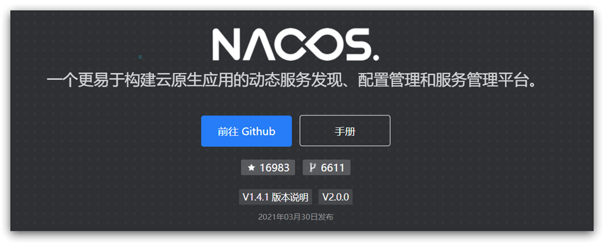

- 官网表明Nacos既能作服务发现，又能作配置中心，功能更加强大
- nacos默认端口号8848


安装方式可以参考课前资料《Nacos安装指南.md》

## 5.2.服务注册到nacos

Nacos是SpringCloudAlibaba的组件，而SpringCloudAlibaba也遵循SpringCloud中定义的服务注册、服务发现规范。因此使用Nacos和使用Eureka对于微服务来说，并没有太大区别。

主要差异在于：

- 依赖不同：因为Nacos是SpringCloudAlibaba的组件，所以要引入SpringCloudAlibaba依赖

- 服务地址不同

### 1）引入依赖

在cloud-demo父工程的pom文件中的`<dependencyManagement>`中引入SpringCloudAlibaba的依赖：

```xml
 <dependencyManagement>
<dependency>
    <groupId>com.alibaba.cloud</groupId>
    <artifactId>spring-cloud-alibaba-dependencies</artifactId>
    <version>2.2.6.RELEASE</version>
    <type>pom</type>
    <scope>import</scope>
</dependency>
```

然后在user-service和order-service中的pom文件中引入nacos-discovery依赖：

```xml
<dependency>
    <groupId>com.alibaba.cloud</groupId>
    <artifactId>spring-cloud-starter-alibaba-nacos-discovery</artifactId>
</dependency>
```


> **注意**：不要忘了注释掉eureka的依赖。


### 2）配置nacos地址

在user-service和order-service的application.yml中添加nacos地址：

```yaml
spring:
  cloud:
    nacos:
      server-addr: localhost:8848
```

> **注意**：不要忘了注释掉eureka的地址


### 3）重启

重启微服务后，登录nacos管理页面，可以看到微服务信息：


## 5.3.服务分级存储模型
Nacos中在处理服务注册与发现的底层实现中划分出了集群和服务实例的概念和相关配置

一个**服务**可以搭建集群，有多个**实例**，例如我们的user-service，可以有:

- 127.0.0.1:8081
- 127.0.0.1:8082
- 127.0.0.1:8083

假如这些实例分布于全国各地的不同机房（多机房部署），例如：

- 127.0.0.1:8081，在上海机房
- 127.0.0.1:8082，在上海机房
- 127.0.0.1:8083，在杭州机房

Nacos就将同一机房内的实例 划分为一个**集群**。

也就是说，user-service是服务，一个服务可以包含多个集群，如杭州、上海，每个集群下可以有多个实例，形成分级模型，如图：


微服务互相访问时，应该尽可能访问同集群实例，因为本地访问速度更快。当本集群内不可用时，才访问其它集群。例如：


杭州机房内的order-service应该优先访问同机房的user-service。


### 5.3.1.给user-service配置集群


修改user-service的application.yml文件，添加集群配置：

```yaml
spring:
  cloud:
    nacos:
      server-addr: localhost:8848
      discovery:
        cluster-name: HZ # 集群名称
```

重启两个user-service实例后，我们可以在nacos控制台看到下面结果：


我们再次复制一个user-service启动配置，添加属性：

```sh
-Dserver.port=8083 -Dspring.cloud.nacos.discovery.cluster-name=SH
```

配置如图所示：


启动UserApplication3后再次查看nacos控制台：


### 5.3.2.同集群优先的负载均衡

默认的`ZoneAvoidanceRule`并不能实现根据同集群优先来实现负载均衡。

因此Nacos中提供了一个`NacosRule`的实现，可以优先从同集群中挑选实例。

1）给order-service配置集群信息

修改order-service的application.yml文件，添加集群配置：

```sh
spring:
  cloud:
    nacos:
      server-addr: localhost:8848
      discovery:
        cluster-name: HZ # 集群名称
```


2）修改负载均衡规则

修改order-service的application.yml文件，修改负载均衡规则：

```yaml
userservice:
  ribbon:
    NFLoadBalancerRuleClassName: com.alibaba.cloud.nacos.ribbon.NacosRule # 负载均衡规则 
```
### 总结
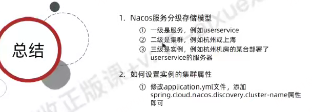


## 5.4.权重配置

实际部署中会出现这样的场景：

服务器设备性能有差异，部分实例所在机器性能较好，另一些较差，我们希望性能好的机器承担更多的用户请求。

但默认情况下NacosRule是同集群内随机挑选，不会考虑机器的性能问题。


因此，Nacos提供了权重配置来控制访问频率，权重越大则访问频率越高。


在nacos控制台，找到user-service的实例列表，点击编辑，即可修改权重：


在弹出的编辑窗口，修改权重：


> **注意**：如果权重修改为0，则该实例永远不会被访问


## 5.5.环境隔离（重要）

- 避免测试环境的服务调用到了生产环境的微服务

Nacos提供了namespace来实现环境隔离功能。----- 叫下图中那样的蛋壳理论

- nacos中可以有多个namespace
- namespace下可以有group、service等
- 不同namespace之间相互隔离，例如不同namespace的服务互相不可见


### 5.5.1.创建namespace

默认情况下，所有service、data、group都在同一个namespace，名为public：


我们可以点击页面新增按钮，添加一个namespace：


然后，填写表单：


就能在页面看到一个新的namespace：


### 5.5.2.给微服务配置namespace

给微服务配置namespace只能通过修改配置来实现。

例如，修改order-service的application.yml文件：

```yaml
spring:
  cloud:
    nacos:
      server-addr: localhost:8848
      discovery:
        cluster-name: HZ
        namespace: 492a7d5d-237b-46a1-a99a-fa8e98e4b0f9 # 命名空间，填ID
```


重启order-service后，访问控制台，可以看到下面的结果：


此时访问order-service，因为namespace不同，会导致找不到userservice，控制台会报错：


## 5.6.Nacos与Eureka的区别

Nacos的服务实例在健康心跳检测的角度分为两种l类型：

- 临时实例：如果实例宕机超过一定时间，会从服务列表剔除，默认的类型。
  - 保证可用性，牺牲了节点的一致性

- 非临时实例：如果实例宕机，不会从服务列表剔除，也可以叫永久实例。
  - 保证了节点的一致性，牺牲了可用性


配置一个服务实例为永久实例：

```yaml
spring:
  cloud:
    nacos:
      discovery:
        ephemeral: false # 设置为非临时实例
```


Nacos和Eureka整体结构类似，服务注册、服务拉取、心跳等待，但是也存在一些差异：


- Nacos与eureka的共同点
  - 都支持服务注册和服务拉取
  - 都支持服务提供者心跳方式做健康检测

- Nacos与Eureka的区别
  - Nacos支持服务端主动检测提供者状态：临时实例采用心跳模式，非临时实例采用主动检测模式
  - 临时实例心跳不正常会被剔除，非临时实例则不会被剔除保证拉取服务列表时的一致性
  - Nacos支持服务列表变更的消息推送模式，服务列表更新更及时
  - Nacos集群默认采用AP方式，当集群中存在非临时实例时，采用CP模式；Eureka采用AP方式


# CAP定理
在分布式系统设计中，CAP 定理（Consistency, Availability, Partition Tolerance Theorem） 是核心理论框架之一，它明确了分布式系统在面对网络分区时，无法同时满足 “一致性”“可用性” 和 “分区容错性” 三个核心需求，最多只能三者选其二。
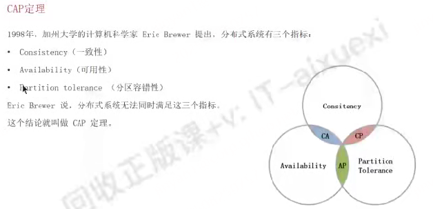
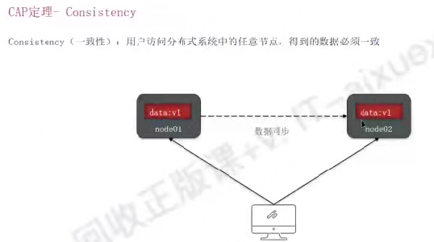
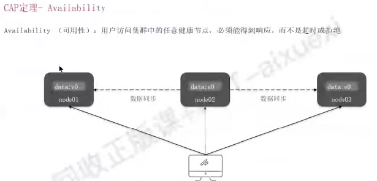
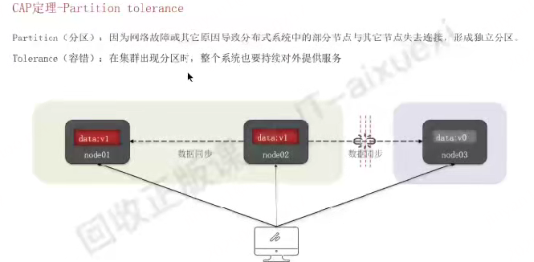

CAP 定理的核心价值，不是 “限制分布式系统的设计”，而是 “提供明确的权衡框架”—— 在设计分布式系统时，首先要明确业务的核心需求：

- 若数据不能错（如金融、支付），选CP 架构，接受短暂不可用；
  - 银行转账系统 —— 若北京机房与上海机房网络中断，为了避免 “北京用户转账后余额扣了但上海查询仍显示原余额”，系统会暂停上海机房的余额查询服务，直到网络恢复、两地数据同步一致后再开放，宁可不服务，也不返回错误数据
- 若服务不能停（如社交、电商），选AP 架构，接受数据短暂不一致。
  - 如微信朋友圈（你发布一条动态后，可能你自己先看到，几秒后朋友才能看到，数据短暂不一致，但保证任何时候打开朋友圈都能正常加载，不卡顿）、淘宝商品库存（大促时可能允许 “超卖”，后续通过退款 / 补货解决，优先保证下单流程不崩溃）

理解 CAP，是掌握分布式数据库、缓存、消息队列等组件选型的关键前提