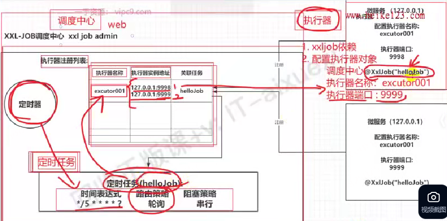
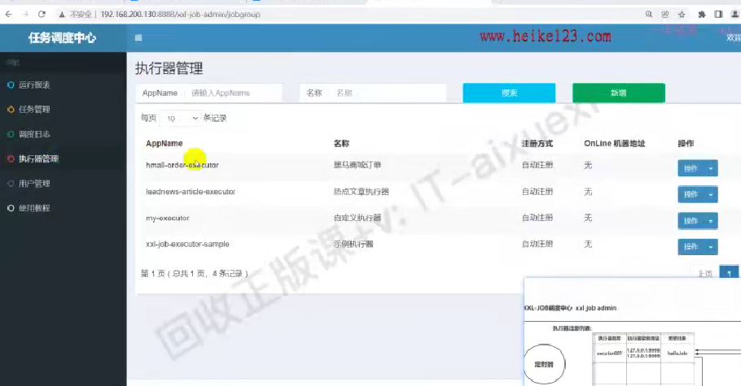

# biji

## XXL-JOB

> 博客链接：https://juejin.cn/post/6948397386926391333#heading-1

### 架构

1. 大体分为3部分：调度中心web界面，定时任务，执行器
2. 具体每个微服务这块才是执行器，一个执行器可以创建多个定时任务，调度中心就是维护执行器列表，维护定时任务，先创建执行器，创建任务时指定属于哪个执行器
   1. 调度中心还维护统一的定时器，负责下发任务路由到目标执行器中执行
3. 定时任务：
   1. 路由策略：根据什么样策略找到对应执行器
   2. 阻塞策略：一个执行器下多个定时任务时的执行策略

### 界面操作

