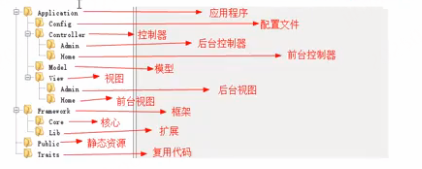

- [1.1  今日目标](#11--今日目标)
- [1.2  框架目录](#12--框架目录)
    - [1.2.1  创建目录结构](#121--创建目录结构)
    - [1.2.2 文件分类存放](#122-文件分类存放)
- [1.3  添加命名空间](#13--添加命名空间)
- [1.4  框架类实现](#14--框架类实现)
    - [1.4.1  定义路径常量](#141--定义路径常量)
    - [1.4.2  引入配置文件](#142--引入配置文件)
    - [1.4.3  确定路由](#143--确定路由)
    - [1.4.4  自动加载类](#144--自动加载类)
    - [1.4.5  请求分发](#145--请求分发)
    - [1.4.6  封装run()方法](#146--封装run方法)
    - [1.4.7  在入口中调用run()方法](#147--在入口中调用run方法)
- [1.5  运行项目](#15--运行项目)
- [1.6  traits代码复用](#16--traits代码复用)
- [1.7  删除功能](#17--删除功能)
- [1.8  作业](#18--作业)


## 1.1  今日目标

1. 了解基于MVC思想的项目单一入口概念；
2. 掌握项目单一入口的实际应用；
3. 掌握框架的核心架构；
4. 理解DAO类的作用，掌握DAO的封装；
5. 理解trait的作用；
6. 理解公共模型的作用，掌握公共模型的封装；
7. 理解MVC框架设计的目录结构和各个目录的作用；
8. 理解配置文件的作用；


## 1.2  框架目录

#### 1.2.1  创建目录结构




#### 1.2.2 文件分类存放

将上一讲的文件分类存放到不同的目录中


将文件存放到不同的目录以后，由于类文件地址发生了变化，所以无法完成自动加载类，那么今天的主要任务就是围绕如何实现类的自动加载展开。

由于每次都请求入口文件，所以”.“表示入口文件所在的目录，不是定义处所在目录！


## 1.3  添加命名空间

通过文件所在框架目录地址做命名空间，这样获取了命名空间就能知道文件存放的地址。

Model.class.php

```php
namespace Core;
// 基础模型
class Model {
    ...
```

MyPDO.class.php

```php
namespace Core;
class MyPDO{
    ...
```

ProductsModel.class.php

```php
<?php
namespace Model;
//products模型用来操作products表
class ProductsModel extends Model{
    ...
```

ProductsController.class.php

```php
<?php
namespace Controller\Admin;
//商品模块
class ProductsController {
    ...
```


## 1.4  框架类实现

> 新增Framework类

#### 1.4.1  定义路径常量

由于文件路径使用频率很高，而且路径比较长，所以将固定不变的路径定义成路径常量

知识点

```php
1、getcwd()：入口文件的绝对路径
2、windows下默认的目录分隔符是`\`，Linux下默认的目录分隔符是`/`。DIRECTORY_SEPARATOR(PHP的内置)常量根据不同的操作系统返回不同的目录分隔符。
    -- windows下:\/都支持，默认是\
3、define定义的常量没有命名空间的限制，所以可以在任何地方定义。

```

代码实现

在Core文件夹下创建Framework.class.php

```php
echo getcwd(); // F:\wamp\www 是当前文件所在目录

class Framework{
    // 定义路径常量
    private static function initConst(){
        // 定义常量不会被销毁
        define('DS', DIRECTORY_SEPARATOR);  //定义目录分隔符
        define('ROOT_PATH', getcwd().DS);  //入口文件所在的目录
        define('APP_PATH', ROOT_PATH.'Application'.DS);   //application目录
        define('CONFIG_PATH', APP_PATH.'Config'.DS); // 配置文件目录
        define('CONTROLLER_PATH', APP_PATH.'Controller'.DS);
        define('MODEL_PATH', APP_PATH.'Model'.DS);
        define('VIEW_PATH', APP_PATH.'View'.DS);
        define('FRAMEWORK_PATH', ROOT_PATH.'Framework'.DS);
        define('CORE_PATH', FRAMEWORK_PATH.'Core'.DS);
        define('LIB_PATH', FRAMEWORK_PATH.'Lib'.DS);
        define('TRAITS_PATH', ROOT_PATH.'Traits'.DS);
    }
}

// Framework::initConst(); 只要初始化常量就定义好了
```


#### 1.4.2  引入配置文件

1、在config目录下创建config.php


使用return语法，只要你一包含文件，就把值return出去了。

```php
<?php
return array(
    //数据库配置
    'database'=>array(),
    //应用程序配置
    'app'       =>array(
        'dp'    =>  'Admin',        //默认平台
        'dc'    =>  'Products',     //默认控制器
        'da'    =>  'list'          //默认方法
    ),
);
```

2、在框架类中引入配置文件

```php
class Framework{
    //.......
    // 引入配置文件
    private static function initConfig(){
    $GLOBALS['config']=require CONFIG_PATH.'config.php';
    }
}
```

思考：配置文件为什么不保存在常量中？

答：因为7.0之前，常量不能保存数组和对象。只能放在全局变量里


#### 1.4.3  确定路由

你得有三个请求参数才能确定路由。

p：【platform】平台

c：【controller】控制器

a：【action】方法


```php
// Framework类中
private static function initRoutes(){
    // ??也是7.0后才支持，之前可以用三目运算符
    $p=$_GET['p']??$GLOBALS['config']['app']['dp'];
    $c=$_GET['c']??$GLOBALS['config']['app']['dc'];
    $a=$_GET['a']??$GLOBALS['config']['app']['da'];
    $p=ucfirst(strtolower($p));
    $c=ucfirst(strtolower($c));		//首字母大写
    $a=strtolower($a);			//转成小写
    // 定义常量，上面的变量执行完会销毁，定义常量不会销毁，可以一直访问
    define('PLATFROM_NAME', $p);    //平台名常量
    define('CONTROLLER_NAME', $c);  //控制器名常量
    define('ACTION_NAME', $a);      //方法名常量
    define('__URL__', CONTROLLER_PATH.$p.DS);   //当前请求控制器的目录地址
    define('__VIEW__',VIEW_PATH.$p.DS);     //当前视图的目录地址
}
```

#### 1.4.4  自动加载类

```php
// 内置函数学习
$path='aa/bb/cc/tu.jpg';
echo dirname($path) // aa/bb/cc
echo basename($path) // tu.jpg

class Framework{
    // ........
    // 自动加载类
    private static function initAutoLoad(){
        // $class_name会把命名空间带上
        spl_autoload_register(function($class_name){
            $namespace= dirname($class_name);   //命名空间 Controller\Admin\ProductsController 自动拿出Controller\Admin。
            $class_name= basename($class_name); //类名
            if(in_array($namespace, array('Core','Lib')))   //命名空间在Core和Lib下
                $path= FRAMEWORK_PATH.$namespace.DS.$class_name.'.class.php';
            elseif($namespace=='Model')     //文件在Model下
                $path=MODEL_PATH.$class_name.'.class.php';
            elseif($namespace=='Traits')    //文件在Traits下
                $path=TRAITS_PATH.$class_name.'.class.php';
            else   //控制器
                $path=CONTROLLER_PATH.PLATFROM_NAME.DS.$class_name.'.class.php'; 
            if(file_exists($path) && is_file($path))
                require $path;
        });
    }
}
```

#### 1.4.5  请求分发

```php
class Framework {
    // 静态方法也可以用私有化
    private static function initDispatch(){
        // 引号有转义作用，需要加双斜杠
        $controller_name='\Controller\\'.PLATFROM_NAME.'\\'.CONTROLLER_NAME.'Controller';	//拼接控制器类名
        $action_name=ACTION_NAME.'Action';	//拼接方法名
        $obj=new $controller_name();
        $obj->$action_name();
    } 
}
```

#### 1.4.6  封装run()方法

```php
class Framework{
    //启动框架
    public static function run(){
        self::initConst();
        self::initConfig();
        self::initRoutes();
        self::initAutoLoad();
        self::initDispatch();
    }
    ...
}
```


#### 1.4.7  在入口中调用run()方法

```php
<?php
require './Framework/Core/Framework.class.php';
Framework::run();
```

run()方法调用后就启动了框架。


## 1.5  运行项目

1、连接数据库的参数从配置文件中获取

 ```php
class Model {
	...
	//连接数据库
	private function initMyPDO() {
       $this->mypdo= MyPDO::getInstance($GLOBALS['config']['database']);
	}
}
 ```

2、更改ProductsControleller控制器

```php
<?php
namespace Controller\Admin;
//商品模块
class ProductsController {
	//获取商品列表
	public function listAction() {
            //实例化模型
            $model=new \Model\ProductsModel();
            $list=$model->getList();
            //加载视图
            require __VIEW__.'products_list.html';
	}
	//删除商品
	public function delAction() {
		...
		$model=new \Model\ProductsModel();
		...
	}
}
```

3、更改ProductsModel类

```php
<?php
namespace Model;
class ProductsModel extends \Core\Model{
	
}
```

4、更改MyPDO类

```php
...
private function fetchType($type){
    switch ($type){
        case 'num':
            return \PDO::FETCH_NUM;
        case 'both':
            return \PDO::FETCH_BOTH;
        case 'obj':
            return \PDO::FETCH_OBJ;
        default:
             return \PDO::FETCH_ASSOC;
    }
}
...
//所有的内置类都在公共的命名空间下。需要加\开头
```

测试：成功


## 1.6  traits代码复用

有的控制器操作完毕后要跳转，有的不需要，

解决：将跳转的方法封装到traits中。

 代码实现

1、将准备好的图片拷贝到Public目录下


2、在Traits目录中创建Jump.class.php

```php
<?php
//跳转的插件
namespace Traits;
trait Jump{
    //封装成功的跳转
    public function success($url,$info='',$time=1){
        $this->redirect($url, $info, $time, 'success');
    }
    //封装失败跳转
    public function error($url,$info='',$time=3){
        $this->redirect($url, $info, $time, 'error');
    }
    /*
     * 作用：跳转的方法
     * @param $url string 跳转的地址
     * @param $info string 显示信息
     * @param $time int 停留时间
     * @param $flag string 显示模式  success|error
     */
    private function redirect($url,$info,$time,$flag){
        if($info=='')
            header ("location:{$url}");
        else{
          echo <<<str
<!DOCTYPE html>
<html lang="en">
<head>
	<meta charset="UTF-8">
    <!--
    <meta http-equiv="refresh" content="3;http://www.php.com"/>
    -->
	<title>Document</title>
<style>
body{
	text-align: center;
	font-family: '微软雅黑';
	font-size: 18px;
}
#success,#error{
	font-size: 36px;
	margin: 10px auto;
}
#success{
	color: #090;
}
#error{
	color: #F00;
}
</style>
</head>
<body> 
    <!-- 用的绝对路径 -->
	
	<div id='{$flag}'>{$info}</div>
	<div><span id='t'>{$time}</span>秒以后跳转</div>
</body>
</html>
<script>
window.onload=function(){
	var t={$time};
	setInterval(function(){
		document.getElementById('t').innerHTML=--t;
		if(t==0)
			location.href='index.php';
	},1000)
}
</script>
str;
        exit;
        }
    }
}
```

在ProductsController控制器中使用原型

```php
namespace Controller\Admin;
//商品模块
class ProductsController{
    use \Traits\Jump;   //复用代码
    ...
```


## 1.7  删除功能

入口

```html
<a href="index.php?p=Admin&c=Products&a=del&proid=<?=$rows['proID']?>" onclick="return confirm('确定要删除吗')">删除</a>
```

控制器（ProductsController）

 ```php
public function delAction() {
    $id=(int)$_GET['proid'];	//如果参数明确是整数，要强制转成整形
    $model=new \Model\ProductsModel();
    if($model->del($id))
        $this->success('index.php?p=Admin&c=Products&a=list', '删除成功');
    else 
        $this->error('index.php?p=admin&c=Products&a=list', '删除失败');
}
 ```

模型、视图

```
无改变
```


## 1.8  作业

1、修改

2、添加

