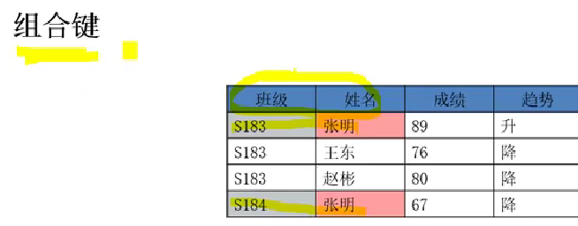
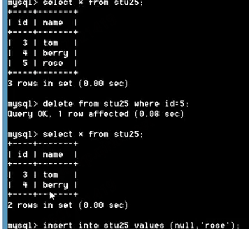
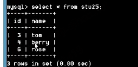
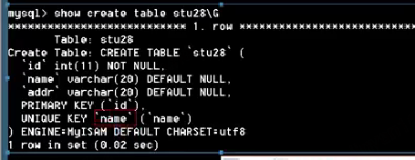
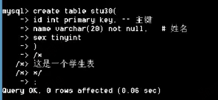
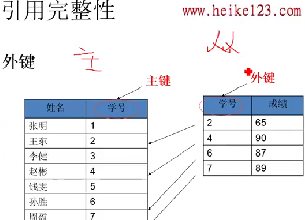
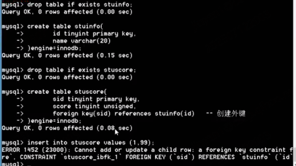
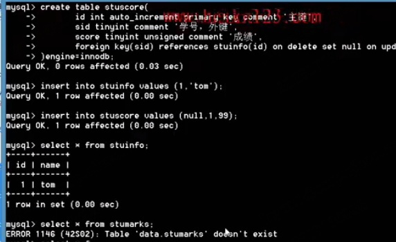
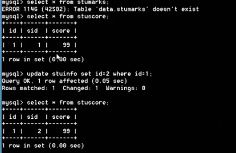

- [补充](#补充)
- [1.1  今日目标](#11--今日目标)
- [1.2  数据类型](#12--数据类型)
    - [1.2.1  数值型](#121--数值型)
    - [1.2.2  字符型](#122--字符型)
    - [1.2.3  枚举(enum)](#123--枚举enum)
    - [1.2.4  集合(set)](#124--集合set)
    - [1.2.5  日期时间型](#125--日期时间型)
    - [1.2.6  Boolean](#126--boolean)
    - [1.2.6  练习题](#126--练习题)
- [1.3  列属性](#13--列属性)
    - [1.3.1  是否为空（null|not null）](#131--是否为空nullnot-null)
    - [1.3.2  默认值（default）](#132--默认值default)
    - [1.3.3  自动增长（auto\_increment）](#133--自动增长auto_increment)
    - [1.3.4  主键（primary key）](#134--主键primary-key)
    - [1.3.5  唯一键（unique）](#135--唯一键unique)
    - [1.3.6  备注（comment）](#136--备注comment)
- [1.4  SQL注释](#14--sql注释)
- [1.5  数据完整性](#15--数据完整性)
    - [1.5.1  数据完整性包括](#151--数据完整性包括)
    - [1.5.2  主表和从表](#152--主表和从表)
    - [1.5.3  外键（foreign key）](#153--外键foreign-key)
    - [1.5.4  三种外键操作](#154--三种外键操作)
- [1.6  补充](#16--补充)


## 补充

phpstudy中Mysql默认不是严格模式,将Mysql配置成严格模式,严格模式有一点错都会报出来,如建表数据时插入中文会报错

打开my.ini中,在sql-mode字段中配置追加值:STRICT_TRANS_TABLES


## 1.1  今日目标

1. 掌握char和varchar的应用；
2. 了解text类型是用来存储长文本数据；
3. 了解字段属性的作用；
4. 掌握主键primary key的应用以及效果；
5. 掌握逻辑主键的自增长auto_increment应用；
6. 掌握唯一键与主键的区别；
7. 了解外键的约束作用；
8. 掌握主键冲突的两种解决方案；


## 1.2  数据类型

MySQL中的数据类型是强类型

#### 1.2.1  数值型

**字节计算**

> https://blog.csdn.net/m0_48011056/article/details/125153980

1. 1字节=8位,1KB=1024字节,1MB=1024KB,1GB=1024MB,1TB=1024GB,
2. 无符号的话,8位就是11111111,第一位是正常的数表示,最大值是2的8次方-1数,就是255,最小值00000000为0,==>(0-255共256个数),
3. 有符号整数就是为了表示负数,默认把8位的第一位用来表示符号,0负1正,实际数值范围就变成了7位,也就相当于1分为2了,数据库中整型类型默认是无符号整数
   1. 有符号的话就是一份为2就是-128到127之间(中间包括个0).这是人类的理解,实际上计算机规则是安装第一位补码来的,直接就是负数到正数范围


**1、  整型**

| 整形      | 占用字节数 | 范围                                     |
| --------- | ---------- | ---------------------------------------- |
| tinyint   | 1          | -128~127    (1百)                        |
| smallint  | 2          | -32768~32767      (3万)                  |
| mediumint | 3          | -8388608~8388607  (838万)                |
| int       | 4          | -2147483648~2147483647 (21亿)            |
| bigint    | 8          | -9223372036854775808~9223372036854775807 |

选择的范围尽可能小，范围越小占用资源越少

```mysql
mysql> create table stu1(
    -> id tinyint,      # 范围要尽可能小，范围越小，占用空间越少
    -> name varchar(20)
    -> );
Query OK, 0 rows affected (0.02 sec)

-- 超出范围会报错
mysql> insert into stu1 values (128,'tom');
ERROR 1264 (22003): Out of range value for column 'id' at row 1
```


**无符号整形（unsigned）** 无符号整形就是没有负数，无符号整数是整数的两倍,当数据整型类型业务中确定没有负数的话,可以改成无符号全正表示(默认是有符号类型存储)

```mysql
mysql> create table stu2(
    -> id tinyint unsigned    # 无符号整数就是把它默认的整形范围改成全部正数的范围(如-128到127变成0到255)
    -> );
Query OK, 0 rows affected (0.02 sec)

mysql> insert into stu2 values (128);
Query OK, 1 row affected (0.00 sec)
```


**整形支持显示宽度**，显示宽带是最小的显示位数，如int(11)表示整形最少用11位表示，如果不够位数用0填充。显示宽度默认不起作用，必须结合zerofill才起作用。


tinyint后面的3是代表的3位,3位数是显示宽度,启用显示宽度的话,会默认补0成003.那个3是可以创建表时用来指定的,默认不写就是最大tinyint的范围位数,你指定的位数别超过最大范围就行

```mysql
mysql> create table stu4(
    -> id int(5),   指定显示宽度5位
    -> num int(5) zerofill   # 添加前导0,int(5)显示宽带是5
    -> );
Query OK, 0 rows affected (0.05 sec)

mysql> insert into stu4 values (12,12);
Query OK, 1 row affected (0.00 sec)

mysql> select * from stu4;
+------+-------+
| id   | num   |
+------+-------+
|   12 | 00012 |
+------+-------+
1 row in set (0.00 sec)
```

小结：

```
1、范围要尽可能小，范围越小，占用空间越少
2、无符号整数是整数的两倍
3、整形支持显示宽度，显示宽带是最小的显示位数，必须结合zerofill才起作用
```


**2、浮点型**

浮点数在数据库中有2种:

| 浮点型             | 占用字节数 | 范围               |
| ------------------ | ---------- | ------------------ |
| float（单精度型）  | 4          | -3.4E+38~3.4E+38   |
| double（双精度型） | 8          | -1.8E+308~1.8E+308 |

浮点型的显示声明：float(M,D)   double(M,D)

```
不管输入多少位,在数据存储后显示时,都是按照M,D来近似显示的,

 M：总位数   D：小数后几位数
```

例题

```mysql
mysql> create table stu5(
    -> num1 float(5,2),   -- 浮点数 
    -> num2 double(6,1)	  -- 双精度数
    -> );
Query OK, 0 rows affected (0.05 sec)

mysql> insert into stu5 values (3.1415,12.96);
Query OK, 1 row affected (0.00 sec)

mysql> select * from stu5;
+------+------+
| num1 | num2 |
+------+------+
| 3.14 | 13.0 |
+------+------+
1 row in set (0.00 sec)
```


**MySQL浮点数支持科学计数法**

```mysql
mysql> create table stu6(
    -> num float   # 不指定位数，默认是小数点后面6位  double默认是17位
    -> );
Query OK, 0 rows affected (0.03 sec)

mysql> insert into stu6 values (5E2),(6E-2); # 插入科学计数法
Query OK, 2 rows affected (0.00 sec)
Records: 2  Duplicates: 0  Warnings: 0

mysql> select * from stu6;
+------+
| num  |
+------+
|  500 |
| 0.06 |
+------+
2 rows in set (0.00 sec)
```


浮点数精度会丢失

```mysql
mysql> insert into stu6 values(99.999999999);
Query OK, 1 row affected (0.00 sec)

mysql> select * from stu6;
+------+
| num  |
+------+
|  100 |
+------+
```

小结：

```
1、浮点数有单精度和双精度
2、浮点数支持科学计数法
3、浮点数精度会丢失会四舍五入
```


**3、小数（定点数）**

原理：将整数部分和小数部分分开存储

语法：

```
decimal(M,D)
```

例题：

```mysql
mysql> create table stu8(
    -> num decimal(20,9)   # 存放定点数
    -> );
Query OK, 0 rows affected (0.00 sec)

mysql> insert into stu8 values(12.999999999);
Query OK, 1 row affected (0.00 sec)

mysql> select * from stu8;
+--------------+
| num          |
+--------------+
| 12.999999999 |
+--------------+
1 row in set (0.00 sec)
```

小结：

```
0、前面的整型每种类型都是固定占几个字节的,那都是属于定长
1、decimal是变长的，到底占几个字节不确定,大致是每9个数字用4个字节存储，整数和小数分开计算。M最大是65,D最大是30，默认是（10,2）。
2、定点和浮点都支持无符号unset、zerofill显示宽度0填充。
```


#### 1.2.2  字符型

1. 强数据类型里面双引号是字符串,单引号是字符,在数据库中没有字符串概念，只有字符，所以数据库中只能用单引号,没有双引号

| 数据类型   | 描述 (字节数)        |
| ---------- | ------------ |
| char       | 定长字符，最大可以到255 |
| varchar    | 可变长度字符，最大可以到65535 |
| tinytext   | 2^8^–1 =255    |
| text       | 2^16^–1 =65535 |
| mediumtext | 2^24^–1        |
| longtext   | 2^32^–1        |

char(4)：存放4个字符，中英文一样。char最大可以到255个字节长度

varchar(L)实现变长机制，需要额外的空间来记录数据真实的长度。

L的理论长度是65535字节，但事实上达不到，因为有的字符是多字节字符，所以L达不到65535字节。

1. 定长和变长的区别: 
   1. char(4)代表字符4个字节长度,就不能存放5个字节长度,但是可以存放2个,剩下的2个空间还是会占用浪费
   2. varchar(4)也代表字符4个长度的,也不能存放5个长度,若存2个,剩下的空间就回收了,不会浪费空间
2. utf8下,1个字符大概3个字节,gbk下1个字符大概2个字节,所以varchar的长度达不到65535跟字符编码也有关系


一个记录的所有字段的总长度也不能超过65535个字节。
text,XXXXtext系列的类型由于在表中存储的是地址，占用大小大约10个字节,char和varchar存储的是4个字节,所以text类型值不会超过所有字段总长度的.


小结：

```
1、char是定长，var是变长
2、char最大值是255，varchar最大值是65535，具体要看字符编码
3、text系列在表中存储的是地址
4、一条记录的总长度不能超过65535
```


#### 1.2.3  枚举(enum)

从集合中选择一个值作为数据（单选）

```mysql
mysql> create table stu12(
    -> name varchar(20),
    -> sex enum('男','女','保密') # 枚举
    -> );
Query OK, 0 rows affected (0.06 sec)

-- 插入的枚举值只能是枚举中提供的选项
mysql> insert into stu12 values ('tom','男1');
Query OK, 1 row affected (0.00 sec)
-- 报错，只能插入男、女、保密
mysql> insert into stu12 values ('tom','不告诉你');
ERROR 1265 (01000): Data truncated for column 'sex' at row 1
```

枚举值是通过整形数字来管理的，第一个值是1，第二个值是2，以此类推，枚举值在数据库存储的是整形数字。

```mysql
mysql> insert into stu12 values ('berry',2);   -- 插入数字
Query OK, 1 row affected (0.00 sec)

mysql> select * from stu12;
+-------+------+
| name  | sex  |
+-------+------+
| tom   | 男     |
| berry | 女    |
+-------+------+

mysql> select * from stu12 where sex=2;   -- 2表示第二个枚举值
+-------+------+
| name  | sex  |
+-------+------+
| berry | 女    |
+-------+------+
1 row in set (0.00 sec)
```

枚举优点：

  ```
（1）、限制值
（2）、节省空间
（3）、运行速度快（整形比字符串运行速度快）
  ```

思考：已知枚举占用两个字节，所以最多可以有多少个枚举值？

答：2字节=16位，2^16^=65536，范围是（0-65535），由于枚举从1开始，所以枚举值最多有65535个


#### 1.2.4  集合(set)

从集合中选择一些值作为数据（多选）

```mysql
mysql> create table stu13(
    -> name varchar(20),
    -> hobby set('爬山','读书','游泳','烫头')  -- 集合
    -> );
Query OK, 0 rows affected (0.00 sec)

mysql> insert into stu13 values ('tom','爬山');

mysql> insert into stu13 values ('Berry','爬山,游泳');
Query OK, 1 row affected (0.00 sec)

mysql> insert into stu13 values ('Berry','游泳,爬山');   -- 插入的顺序不一样，但显示的顺序一样
Query OK, 1 row affected (0.00 sec)

mysql> select * from stu13;
+-------+-----------+
| name  | hobby     |
+-------+-----------+
| tom   | 爬山         |
| Berry | 爬山,游泳       |
| Berry | 爬山,游泳       |
+-------+-----------+
3 rows in set (0.00 sec)
```


集合和枚举一样，也为每个集合元素分配一个固定值，分配方式是从前往后按2的0、1、2、…次方，转换成二进制后只有一位是1，其他都是0。

```mysql
'爬山','读书','游泳','烫头'
  1		2		4	8
  
mysql> select hobby+0 from stu13; // hobby+0就是把它集合值转化成数字
+---------+
| hobby+0 |
+---------+
|       1 |
|       5 |         '爬山,游泳' ==> 爬山+游泳就是 1+4 = 5来代表
|       5 |
+---------+

mysql> insert into stu13 values ('rose',15); // 加15就是选择'爬山,读书,游泳,烫头'  都选上了
Query OK, 1 row affected (0.00 sec)
```


已知集合类型占8个字节，那么集合中最多有多少选项

答：有64个选项。


#### 1.2.5  日期时间型

| 数据类型  | 描述                  |
| --------- | --------------------- |
| datetime  | 日期时间，占用8个字节 |
| date      | 日期  占用3个字节     |
| time      | 时间 占用3个字节      |
| year      | 年份，占用1个字节     |
| timestamp | 时间戳，占用4个字节   |

1、datetime和date

datetime格式：年-月-日  小时:分钟:秒。支持的范围是'1000-01-01 00:00:00'到'9999-12-31 
23:59:59'。

```mysql
mysql> create table stu14(
    -> t1 datetime,    -- 日期时间
    -> t2 date				-- 日期
    -> );
Query OK, 0 rows affected (0.05 sec)
-- 插入测试数据
mysql> insert into stu14 values ('2019-01-15 12:12:12','2019-01-15 12:12:12');
Query OK, 1 row affected, 1 warning (0.00 sec)
-- 查询
mysql> select * from stu14;
+---------------------+------------+
| t1                  | t2         |
+---------------------+------------+
| 2019-01-15 12:12:12 | 2019-01-15 |
+---------------------+------------+
1 row in set (0.00 sec)
```


2、timestamp（时间戳）

datetime类型和timestamp类型表现上是一样的，他们的区别在于：

datetime从1000到9999，而timestamp从1970年~2038年（原因在于timestamp占用4个字节，和整形的范围一样，2038年01月19日11:14:07以后的秒数就超过了4个字节的长度）

```mysql
mysql> create table stu15(
    -> t1 timestamp
    -> );
Query OK, 0 rows affected (0.06 sec)

mysql> insert into stu15 values ('2038-01-19 11:14:07');
Query OK, 1 row affected (0.00 sec)
```


3、year

只能表示1901~2155之间的年份，因为只占用1个字节，只能表示255个数

```mysql
mysql> create table stu16(
    -> y1 year
    -> );
Query OK, 0 rows affected (0.08 sec)

mysql> insert into stu16 values (2155);
Query OK, 1 row affected (0.00 sec)
```


4、time

可以表示时间，也可以表示时间间隔。范围是：-838:59:59~838:59:59

```mysql
mysql> create table stu17(
    -> t1 time
    -> );
Query OK, 0 rows affected (0.02 sec)

mysql> insert into stu17 values ('12:12:12');
Query OK, 1 row affected (0.00 sec)

mysql> insert into stu17 values ('212:12:12');
Query OK, 1 row affected (0.00 sec)

mysql> insert into stu17 values ('-212:12:12');
Query OK, 1 row affected (0.00 sec)

mysql> insert into stu17 values ('839:00:00');   -- 报错
ERROR 1292 (22007): Incorrect time value: '839:00:00' for column 't1' at row 1

-- time支持以天的方式来表示时间间隔
mysql> insert into stu17 values ('10 10:25:25');   -- 10天10小时25分25秒
Query OK, 1 row affected (0.00 sec)

mysql> select * from stu17;
+------------+
| t1         |
+------------+
| 12:12:12   |
| 212:12:12  |
| -212:12:12 |
| 250:25:25  |
+------------+
4 rows in set (0.00 sec)
```


#### 1.2.6  Boolean

MySQL不支持布尔型，true和false在数据库中对应的是1和0

```mysql
mysql> create table stu18(
    -> flag boolean
    -> );
Query OK, 0 rows affected (0.05 sec)

mysql> desc stu18;
+-------+------------+------+-----+---------+-------+
| Field | Type       | Null | Key | Default | Extra |
+-------+------------+------+-----+---------+-------+
| flag  | tinyint(1) | YES  |     | NULL    |       |
+-------+------------+------+-----+---------+-------+
1 row in set (0.00 sec)

mysql> insert into stu18 values (true),(false);
Query OK, 2 rows affected (0.00 sec)
Records: 2  Duplicates: 0  Warnings: 0

mysql> select * from stu18;
+------+
| flag |
+------+
|    1 |
|    0 |
+------+
2 rows in set (0.00 sec
```

小结：

boolean型在MySQL中对应的是tinyint。


#### 1.2.6  练习题

```
电话号码一般使用什么数据类型存储?			 varchar
手机号码用什么数据类型						char
性别一般使用什么数据类型存储?				  char  tinyint  enum
年龄信息一般使用什么数据类型存储?			 tinyint
照片信息一般使用什么数据类型存储?		 	 binary
薪水一般使用什么数据类型存储?			      decimal绝对不能用浮点,必须要定点
```

1.  电话号码不是数字,起的是字符的作用
2.  用数字的特点是要用来运算的,电话号码是个字符的作用
3.  手机号码定长,字符串
4.  照片一般是存照片地址,不是把整个照片存进来二进制的形式,考试用


## 1.3  列属性

#### 1.3.1  是否为空（null|not null）

```
null表示字段值可以为null
not null字段值不能为空
```

练习

```
学员姓名允许为空吗?					not null
家庭地址允许为空吗?					not null
电子邮件信息允许为空吗?			   null
考试成绩允许为空吗?					null
```


#### 1.3.2  默认值（default）

如果一个字段没有插入值，可以默认插入一个指定的值

```mysql
mysql> create table stu19(
    -> name varchar(20) not null default '姓名不详',
    -> addr varchar(50) not null default '地址不详'
    -> );
Query OK, 0 rows affected (0.05 sec)

mysql> insert into stu19(name) values ('tom');
Query OK, 1 row affected (0.00 sec)

mysql> insert into stu19 values (default,default);
Query OK, 1 row affected (0.00 sec)

mysql> select * from stu19;
+----------+----------+
| name     | addr     |
+----------+----------+
| tom      | 地址不详        |
| 姓名不详         | 地址不详        |
+----------+----------+
2 rows in set (0.00 sec)
```

小结：

default关键字用来插入默认值


#### 1.3.3  自动增长（auto_increment）

字段值从1开始，每次递增1，自动增长的值就不会有重复，适合用来生成唯一的id。

在MySQL中只要是自动增长列必须是主键


#### 1.3.4  主键（primary key）

主键概念：唯一标识表中的记录的一个或一组列(一个字段或多个字段组合)称为主键。


特点：

```
1、不能重复、不能为空
2、一个表只能有一个主键。
```

作用：

```
1、保证数据完整性
2、加快查询速度
    加了主键就会自动创建索引
```

选择主键的原则

```
最少性：尽量选择单个键作为主键
稳定性：尽量选择数值更新少的列作为主键

比如：学号，姓名、地址  这三个字段都不重复，选哪个做主键
选学号，因为学号最稳定
```

练习

```mysql
-- 创建主键方法一
mysql> create table stu20(
    -> id int auto_increment primary key,
    -> name varchar(20)
    -> );
Query OK, 0 rows affected (0.04 sec)

-- 创建主键方法二
mysql> create table stu21(
    -> id int auto_increment,
    -> name varchar(20),
    -> primary key(id)
    -> );
Query OK, 0 rows affected (0.02 sec)
```

组合键: 组合起来作为唯一主键标识



```mysql
mysql> create table stu22(
    -> classname varchar(20),
    -> stuname varchar(20),
    -> primary key(classname,stuname)  -- 创建组合键
    -> );
Query OK, 0 rows affected (0.00 sec)

mysql> desc stu22;
+-----------+-------------+------+-----+---------+-------+
| Field     | Type        | Null | Key | Default | Extra |
+-----------+-------------+------+-----+---------+-------+
| classname | varchar(20) | NO   | PRI |         |       |
| stuname   | varchar(20) | NO   | PRI |         |       |
+-----------+-------------+------+-----+---------+-------+
2 rows in set (0.00 sec)
```


通过更改表添加主键

```mysql
mysql> create table stu23(
    -> id int,
    -> name varchar(20)
    -> );
Query OK, 0 rows affected (0.05 sec)

-- 添加主键
mysql> alter table stu23 add primary key(id);
Query OK, 0 rows affected (0.09 sec)
Records: 0  Duplicates: 0  Warnings: 0
```


删除主键

```mysql
mysql> alter table stu23 drop primary key;
Query OK, 0 rows affected (0.03 sec)
Records: 0  Duplicates: 0  Warnings: 0
```


插入数据: 指有主键时有auto_increment时怎么插入数据

```mysql
mysql> create table stu25(
    -> id tinyint unsigned auto_increment primary key,
    -> name varchar(20)
    -> );
Query OK, 0 rows affected (0.05 sec)

-- 插入数据
mysql> insert into stu25 values (3,'tom');   -- 可以直接插入数字
Query OK, 1 row affected (0.06 sec)

-- 自动增长列可以插入null,让列的值自动递增
mysql> insert into stu25 values (null,'berry');
Query OK, 1 row affected (0.00 sec)
```




删除一个值后,原来的主键5就被删了,再新增数据,递增就是6了,5不能再重复使用,因为为了后面恢复数据用,要是复用5,后面恢复时不知道以哪个5为基准


小结：

1、只要是auto_increment必须是主键，但是主键不一定是auto_increment

2、主键特点是不能重复不能为空

3、一个表只能有一个主键，但是一个主键可以有多个字段组成

4、自动增长列通过插入null值让其递增

5、自动增长列的数据被删除，默认不再重复使用。truncate table删除数据后，再次插入从1开始


练习

```
在主键列输入的数值，允许为空吗?		不可以
一个表可以有多个主键吗?				不可以
在一个学校数据库中，如果一个学校内允许重名的学员，但是一个班级内不允许学员重名，可以组合班级和姓名两个字段一起来作为主键吗？						对
标识列（自动增长列）允许为字符数据类型吗？	不允许
一个自动增长列中，插入3行，删除2行，插入3行，删除2行，插入3行，删除2行，再次插入是多少？  10
```


#### 1.3.5  唯一键（unique）

| 键     | 区别                                                 |
| ------ | ---------------------------------------------------- |
| 主键   | 1、不能重复，不能为空NULL<br />2、一个表只能有一个主键   |
| 唯一键 | 1、不能重刻，可以为空NULL(重复的NULL)<br />2、一个表可以有多个唯一键 |

例题

```mysql
-- 创建表的时候创建唯一键 
mysql> create table stu26(
    -> id int auto_increment primary key,
    -> name varchar(20) unique    -- 唯一键
    -> );
Query OK, 0 rows affected (0.05 sec)

-- 方法二 
mysql> create table stu27(
    -> id int primary key,
    -> name varchar(20),
    -> unique(name)
    -> );
Query OK, 0 rows affected (0.05 sec)

多学一招：
unique 或 unique key 是一样的
```

通过修改表添加唯一键

```mysql
-- 将name设为唯一键
mysql> alter table stu28 add unique(name);  

-- 将name,addr设为唯一键
mysql> alter table stu28 add unique(name),add unique(addr);
Query OK, 0 rows affected (0.00 sec)
Records: 0  Duplicates: 0  Warnings: 0

mysql> desc stu28;
+-------+-------------+------+-----+---------+-------+
| Field | Type        | Null | Key | Default | Extra |
+-------+-------------+------+-----+---------+-------+
| id    | int(11)     | NO   | PRI | NULL    |       |
| name  | varchar(20) | YES  | UNI | NULL    |       |
| addr  | varchar(20) | YES  | UNI | NULL    |       |
+-------+-------------+------+-----+---------+-------+
3 rows in set (0.02 sec)
```


通过show create table 查看唯一键的名字



通过唯一键的名字删除唯一键

```mysql
mysql> alter table stu28 drop index name;
Query OK, 0 rows affected (0.00 sec)
Records: 0  Duplicates: 0  Warnings: 0
```


#### 1.3.6  备注（comment）

说明性文本,给每个字段添加备注

```mysql
mysql> create table stu29(
    -> id int primary key comment '学号',
    -> name varchar(20) not null comment '姓名'
    -> );
Query OK, 0 rows affected (0.03 sec)
```

注意：备注属于SQL代码的一部分


## 1.4  SQL注释

单行注释 

```mysql
-- 单行注释
# 单行注释
多行注释  /*     */
```




## 1.5  数据完整性

正确性(数据类型准不准确)+准确性(范围准不准确)=完整型

#### 1.5.1  数据完整性包括

1、实体完整性(1条记录就是一个实体)

```
1、主键约束
2、唯一约束
3、标识列
```

如name字段有两个记录重名无法区分两条记录,就失去了实体完整性

2、 域完整性(记录没问题,数据类型写错了)

```
1、数据类型约束
2、非空约束
3、默认值约束
```

3、 引用完整性



保持2个表之间的引用,数据完整
```
外键约束
```

4、  自定义完整性

```
1、存储过程
2、触发器
```


#### 1.5.2  主表和从表

1. 主表中没有的记录，从表不允许插入
2. 从表中有的记录，主表中不允许删除
3. 删除主表前，先删子表


#### 1.5.3  外键（foreign key）

外键：从表中的公共字段(关联到主表)



下面可以看到，直接在从表中新增1号，主表中还没有1号数据，这时候从表就新增数据失败


```mysql
-- 创建表的时候添加外键
drop table if exists stuinfo; // 主表
create table stuinfo(
       id tinyint primary key,
       name varchar(20)
)engine=innodb;

drop table if exists stuscore; // 从表
create table stuscore(
       sid tinyint primary key,
       score tinyint unsigned,
       foreign key(sid) references stuinfo(id)   -- 创建外键,数据类型必须一样,名字可以不一样
)engine=innodb;

-- 通过修改表的时候添加外键
语法：alter table 从表 add foreign key(公共字段) references 主表(公共字段)

drop table if exists stuinfo;
create table stuinfo(
       id tinyint primary key,
       name varchar(20)
)engine=innodb;

drop table if exists stuscore;
create table stuscore(
       sid tinyint primary key,
       score tinyint unsigned
)engine=innodb;

alter table stusco dre add foreign key (sid) references stuinfo(id)
```


含引用关系时，直接删除主表是删除失败的。

删除外键

```
通过外键的名字删除外键，通过show create table 查看外键的名字

```


```mysql
-- 删除外键
mysql> alter table stuscore drop foreign key `stuscore_ibfk_1`;
Query OK, 0 rows affected (0.00 sec)
Records: 0  Duplicates: 0  Warnings: 0
```

小结：

```
1、只有innodb引擎才能支持外键.
2、公共字段的名字可以不一样，但是数据类型要一样
```


#### 1.5.4  三种外键操作

1、  严格限制（参见1.5.2 主表和从表）

2、  置空操作（set null）：如果主表记录删除，或关联字段更新，则从表外键字段被设置为null。

3、  级联操作（cascade）：如果主表记录删除，则从表记录也被删除。主表更新，从表外键字段也更新。

语法：foreign key (外键字段) references 主表名 (关联字段) [主表记录删除时的动作] [主表记录更新时的动作]。

**一般说删除时置空，更新时级联。**

```mysql
drop table if exists stuinfo; // 主表
create table stuinfo(
       id tinyint primary key comment '学号，主键',
       name varchar(20) comment '姓名'
)engine=innodb;

drop table if exists stuscore;  // 从表
create table stuscore(
       id int auto_increment primary key comment '主键',
       sid tinyint comment '学号，外键', //（外键不能作主键，作了主键就无法作级联和置空）
       score tinyint unsigned comment '成绩',
       foreign key(sid) references stuinfo(id) on delete set null on update cascade
)engine=innodb;
```





都级联改成2了


小结：

```
置空、级联操作中外键不能是从表的主键
```


## 1.6  补充

phpstudy中MySQL默认不是严格模式，将MySQL设置成严格模式

打开my.ini，在sql-mode的值中，添加STRICT_TRANS_TABLES

```mysql
sql-mode="NO_AUTO_CREATE_USER,NO_ENGINE_SUBSTITUTION,STRICT_TRANS_TABLES"
```

测试

 


单词

```
medium：中等的
small:小
tiny:微小
big:大
```

