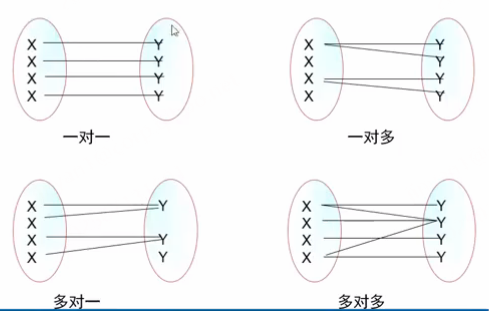

- [1.1  今日目标](#11--今日目标)
- [1.2  实体之间的关系](#12--实体之间的关系)
    - [1.2.1  一对多（1：N）](#121--一对多1n)
    - [1.2.2  多对一（N：1）](#122--多对一n1)
    - [1.2.3  一对一（1:1）](#123--一对一11)
    - [1.2.3  多对多（N：M）](#123--多对多nm)
- [1.3 数据库设计](#13-数据库设计)
    - [1.3.1  数据库设计的步骤](#131--数据库设计的步骤)
    - [1.3.2  例题](#132--例题)
    - [1.3.3  绘制E-R图](#133--绘制e-r图)
    - [1.3.4   将E-R图转成表](#134---将e-r图转成表)
- [1.4  数据规范化](#14--数据规范化)
    - [1.4.1  第一范式：确保每列原子性](#141--第一范式确保每列原子性)
    - [1.4.2  第二范式：非键字段必须依赖于键字段](#142--第二范式非键字段必须依赖于键字段)
    - [1.4.3  第三范式：消除传递依赖](#143--第三范式消除传递依赖)
    - [1.4.4  反3NF](#144--反3nf)
    - [1.4.5  例题](#145--例题)
- [1.5  查询语句](#15--查询语句)
    - [1.5.1   字段表达式](#151---字段表达式)
    - [1.5.2   from子句](#152---from子句)
    - [1.5.3   dual表](#153---dual表)
    - [1.5.4   where子句](#154---where子句)
    - [1.5.5  group by 【分组查询】](#155--group-by-分组查询)
    - [1.5.6 order by排序](#156-order-by排序)
    - [1.5.7  having条件](#157--having条件)
    - [1.5.8 limit](#158-limit)
    - [1.5.9 查询语句中的选项](#159-查询语句中的选项)
- [1.6 聚合函数](#16-聚合函数)
- [1.7   模糊查询](#17---模糊查询)
    - [1.7.1   通配符](#171---通配符)
    - [1.7.2   模糊查询（like）](#172---模糊查询like)
- [1.8  union（联合）](#18--union联合)
    - [1.8.1 union的使用](#181-union的使用)
    - [1.8.2   union的选项](#182---union的选项)
    - [1.8.3   union的注意事项](#183---union的注意事项)
- [1.9 补充](#19-补充)
    - [1.9.1  插入数据时主键冲突](#191--插入数据时主键冲突)


## 1.1  今日目标

1. 掌握一对多关系的数据表设计方案和原理；
2. 掌握多对多关系的数据表设计方案和原理；
3. 掌握where子句进行数据筛选；
4. 掌握group by子句进行数据分类统计；
5. 掌握order by子句进行数据排序；
6. 了解mysql数据库的设计规范；


## 1.2  实体之间的关系

4大关系



#### 1.2.1  一对多（1：N）

 主表中的一条记录对应从表中的多条记录


实现一对多的方式：主表的主键和从表的非主键建关系达成1对多

必须是从表非主键，因为从表的主键不能重复，必须是其他字段作主键，该非主键字段可以重复，达成1对多关系


问题：说出几个一对多的关系？

如班级表里1个班级，对应从表学生表内，2个学生记录的班级号都是一样的，就是2个学生对应一个班级

```
班主任表——学生表
品牌表——商品表
老师-学生：多对多，学生可以选多个老师，老师可以选多个学生
```


#### 1.2.2  多对一（N：1）

多对一就是一对多


#### 1.2.3  一对一（1:1）


如何实现一对一：主键和主键建关系

思考：一对一两个表完全可以用一个表实现，为什么还要分成两个表？

```
答：在字段数量很多情况下，数据量也就很大，每次查询都需要检索大量数据，这样效率低下。我们可以将所有字段分成两个部分，“常用字段”和“不常用字段”，这样对大部分查询者来说效率提高了。【表的垂直分割】
```

将来在表的数据优化中，我们会用到垂直分割。就是一对一分成2个表，就像在中间垂直切分一样，类似还有水平分割只拆分数据不拆分字段。


#### 1.2.3  多对多（N：M）

主表中的一条记录对应从表中的多条记录，从表中的一条记录，对应主表中的多条记录


第三张表含多个重复的班级和讲师


如何实现多对多：利用第三张关系表

问题：说出几个多对多的关系？

```
讲师表——学生表
课程表——学生表
商品表——订单表
```

小结：

```
如何实现一对一：主键和主键建关系
如果实现一对多：主键和非主键建关系
如何实现多对多：引入第三张关系表

项目中----1对1只在数据库的优化中做一般用来做垂直分割的，用的最多的是1对多和多对多
```


## 1.3 数据库设计

#### 1.3.1  数据库设计的步骤

1. 收集信息：与该系统有关人员进行交流、坐谈，充分理解数据库需要完成的任务

2. 标识对象（实体－Entity）：标识数据库要管理的关键对象或实体 
   1. 这个系统里有几个对象实体参与
   2. 后面1个对象就对应1个表

3. 标识每个实体的属性（Attribute）

4. 标识对象之间的关系（Relationship）
   1. 用ER图来表示关系（Entity Relationship 实体关系图）
   2. 

5. 将模型转换成数据库

6.  规范化

#### 1.3.2  例题

第一步：收集信息

```
BBS论坛的基本功能：
用户注册和登录，后台数据库需要存放用户的注册信息和在线状态信息；
用户发贴，后台数据库需要存放贴子相关信息，如贴子内容、标题等；
用户可以对发帖进行回复；
论坛版块管理：后台数据库需要存放各个版块信息，如版主、版块名称、贴子数等；
```

第二步：标识对象

```
实体一般是名词：
1、用户对象
2、板块对象
3、帖子对象（1个帖子可以多个跟帖，1对多）
4、跟帖对象
```


第三步：标识每个实体的属性


第四步：标识对象之间的关系


#### 1.3.3  绘制E-R图

E-R（Entity－Relationship）实体关系图）


完整的E-R图


#### 1.3.4   将E-R图转成表

1. 实体转成表，属性转成字段
2. 如果没有合适的字段做主键，给表添加一个自动增长列做主键。


## 1.4  数据规范化 

通过3个范式来规范化

#### 1.4.1  第一范式：确保每列原子性

第一范式：的目标是确保每列的原子性，一个字段表示一个含义


把中国北京市不够原子性，还能再拆分成中国和北京

思考如下表是否满足第一范式


思考：地址包含省、市、县、地区是否需要拆分？

答：如果仅仅起地址的作用，不需要统计，可以不拆分；如果有按地区统计的功能需要拆分。

在实际项目中，建议拆分。


#### 1.4.2  第二范式：非键字段必须依赖于键字段

第二范式：在满足第一范式的前提下，要求每个表只描述一件事情（不是主键的一定要跟主键有关系）----键就是主键，非键就是非主键

约束：的是主键与非主键的关系


思考：如下表设计是否合理


总结本质：1个表里的主键就是主题，非主键字段必须与主题相关，不i相关的不能放在1个表里，1个表只负责单一的任务事情


#### 1.4.3  第三范式：消除传递依赖

第三范式：在满足第二范式的前提下，除了主键以外的其他列消除传递依赖。

约束：主要约束的是非主键之间的关系


解释：顾客编号和顾客姓名有重复依赖从属关系，顾客编号订好了，顾客姓名其实就已经固定好了，这时可以分表

思考：如下表设计是否合理？


结论：不满足第三范式，因为语文和数学确定了，总分就确定了


总结本质：就是你的表里的字段，将来是由用户进行自由增删改查的，相互依赖的键，万一单方面被用户删除了，就会导致数据的不一致性。依赖的键不能给用户操作，所以不能在表里，必须得是自动计算出来的。如语文数学和总分，你能单方面改总分字段码？？？不能

#### 1.4.4  反3NF 

范式越高，数据冗余越少，但是效率有时就越地下，为了提高运行效率，可以适当让数据冗余。

| 学号 | 姓名 | 语文 | 数学 | 总分 |
| ---- | ---- | ---- | ---- | ---- |
| 1    | 李白 | 77   | 88   | 165  |

上面的设计不满足第三范式，但是高考分数表就是这样设计的，为什么？

答：高考分数峰值访问量非常大，这时候就是性能更重要。当性能和规范化冲突的时候，我们首选性能。这就是“反三范式”。


小结

1、第一范式约束的所有字段原子化。

2、第二范式约束的主键和非主键的关系必须要依赖（定义1张表首先要定调，整张表的主键，主要干的事）

3、第三范式约束的非主键之间的关系不能有依赖

4、范式越高，冗余越少，但表也越多。

5、规范化和性能的关系 ：性能比规范化更重要就是反三范式


#### 1.4.5  例题

需求

```
假设某建筑公司要设计一个数据库。公司的业务规
则概括说明如下：
公司承担多个工程项目，每一项工程有：工程号、工程名称、施工人员等
公司有多名职工，每一名职工有：职工号、姓名、性别、职务（工程师、技术员）等
公司按照工时和小时工资率支付工资，小时工资率由职工的职务决定（例如，技术员的小时工资率与工程师不同）
```

标识实体

```
1、工程
2、职工
3、工时
4、小时工资率
```


## 1.5  查询语句

```mysql
语法：select [选项] 列名 [as] [from 表名] [where 条件]  [group by 分组] [order by 排序][having 条件] [limit 限制]
```

#### 1.5.1   字段表达式

```mysql
-- 可以直接输出内容
mysql> select '锄禾日当午';
+------------+
| 锄禾日当午          |
+------------+
| 锄禾日当午          |
+------------+
1 row in set (0.00 sec)

-- 输出自定义表达式  （可以自定义表达式作为输出显示的自定义列值）
mysql> select 10*10;
+-------+
| 10*10 |
+-------+
|   100 |
+-------+
1 row in set (0.00 sec)

mysql> select ch,math,ch+math from stu;  // 可以自定义表达式作为输出显示的自定义列值

+------+------+---------+
| ch   | math | ch+math |
+------+------+---------+
|   80 | NULL |    NULL |
|   77 |   76 |     153 |
|   55 |   82 |     137 |
| NULL |   74 |    NULL |


-- 表达式部分可以用函数
mysql> select rand();
+--------------------+
| rand()             |
+--------------------+
| 0.6669325378415478 |
+--------------------+
1 row in set (0.00 sec)
```

通过as给字段取别名

```mysql
mysql> select '锄禾日当午' as '标题';   -- 取别名,值之间的as不能省略
+------------+
| 标题           |
+------------+
| 锄禾日当午          |
+------------+
1 row in set (0.00 sec)

mysql> select ch,math,ch+math as '总分' from stu;
+------+------+------+
| ch   | math | 总分    |
+------+------+------+
|   80 | NULL | NULL |
|   77 |   76 |  153 |
|   55 |   82 |  137 |
| NULL |   74 | NULL |

-- 多学一招：as可以省略
mysql> select ch,math,ch+math '总分' from stu;
+------+------+------+
| ch   | math | 总分    |
+------+------+------+
|   80 | NULL | NULL |
|   77 |   76 |  153 |
|   55 |   82 |  137 |
| NULL |   74 | NULL |
```


#### 1.5.2   from子句

from：来自，from后面跟的是数据源。数据源可以有多个。返回笛卡尔积。

插入测试表

```mysql
create table t1(
       str char(2)
);
insert into t1 values ('aa'),('bb');
create table t2(
       num int
);
insert into t2 values (10),(20);
```

测试

```mysql
-- from子句
mysql> select * from t1;
+------+
| str  |
+------+
| aa   |
| bb   |
+------+
2 rows in set (0.00 sec)

-- 多个数据源,返回笛卡尔积
mysql> select * from t1,t2;
+------+------+
| str  | num  |
+------+------+
| aa   |   10 |
| bb   |   10 |
| aa   |   20 |
| bb   |   20 |
+------+------+
4 rows in set (0.00 sec)
```


#### 1.5.3   dual表

dual表是一个伪表。在有些特定情况下，没有具体的表的参与，但是为了保证select语句的完整又必须要一个表名，这时候就使用伪表。

```mysql
mysql> select 10*10 as 结果 from dual;
+------+
| 结果     |
+------+
|  100 |
+------+
1 row in set (0.00 sec)
```


#### 1.5.4   where子句

where后面跟的是条件，在数据源中进行筛选。返回条件为真记录

查询原理：where是查询时候遍历数据，只要where后面的条件为真就返回出来

MySQL支持的运算符，运算符之间可以组合使用

```MySQL
-- 比较运算符
>	大于
<	小于
>=	大于等于
<=	小于等于
=	等于   （数据库中只有单等，没有双等）
!=	不等于
-- 逻辑运算符
and  与
or   或
not  非
-- 其他
in | not in	 		    字段的值在枚举范围内（sql的枚举用括号表示）
between…and|not between…and      字段的值在数字范围内
is null | is not null			 字段的值不为空
```

例题：

```mysql
-- 查找语文成绩及格的学生
mysql> select * from stu where ch>=60;
-- 查询语文和数学都及格的学生
mysql> select * from stu where ch>=60 and math>=60;
-- 查询语文或数学不及格的学生
mysql> select * from stu where ch<60 or math<60;
```

思考：如下语句输出什么？

结合查询原理，条件是否为真

```mysql
mysql> select * from stu where 1;		-- 输出所有数据
mysql> select * from stu where 0;		-- 不输出数据
```

思考：如何查找北京和上海的学生

- sql语句不区分大小写，所以stuaddress字段不区分大小写


```mysql
-- 通过or实现
mysql> select * from stu where stuaddress='北京' or stuaddress='上海';
+--------+----------+--------+--------+---------+------------+------+------+
| stuNo  | stuName  | stuSex | stuAge | stuSeat | stuAddress | ch   | math |
+--------+----------+--------+--------+---------+------------+------+------+
| s25301 | 张秋丽         | 男       |     18 |       1 | 北京           |   80 | NULL |
| s25304 | 欧阳俊雄        | 男       |     28 |       4 | 天津           | NULL |   74 |
+--------+----------+--------+--------+---------+------------+------+------+
2 rows in set (0.00 sec)

-- 通过in语句实现
mysql> select * from stu where stuaddress in ('北京','上海');

-- 查询不是北京和上海的学生
mysql> select * from stu where stuaddress not in ('北京','上海');
```


思考：查找年龄在20~25之间

```mysql
-- 方法一：
mysql> select * from stu where stuage>=20 and stuage<=25;

-- 方法二：
mysql> select * from stu where not(stuage<20 or stuage>25);

-- 方法三：between...and...
mysql> select * from stu where stuage between 20 and 25;

-- 年龄不在20~25之间
mysql> select * from stu where stuage not between 20 and 25;
```


思考：

```mysql
-- 查找缺考的学生
mysql> select * from stu where ch is null or math is null;
+--------+----------+--------+--------+---------+------------+------+------+
| stuNo  | stuName  | stuSex | stuAge | stuSeat | stuAddress | ch   | math |
+--------+----------+--------+--------+---------+------------+------+------+
| s25301 | 张秋丽         | 男       |     18 |       1 | 北京           |   80 | NULL |
| s25304 | 欧阳俊雄        | 男       |     28 |       4 | 天津           | NULL |   74 |
+--------+----------+--------+--------+---------+------------+------+------+

-- 查找没有缺考的学生
mysql> select * from stu where ch is not null and math is not null;
+--------+----------+--------+--------+---------+------------+------+------+
| stuNo  | stuName  | stuSex | stuAge | stuSeat | stuAddress | ch   | math |
+--------+----------+--------+--------+---------+------------+------+------+
| s25302 | 李文才        | 男       |     31 |       3 | 上海          |   77 |   76 |
| s25303 | 李斯文        | 女      |     22 |       2 | 北京           |   55 |   82 |
| s25305 | 诸葛丽丽         | 女      |     23 |       7 | 河南           |   72 |   56 |
| s25318 | 争青小子        | 男       |     26 |       6 | 天津           |   86 |   92 |
| s25319 | 梅超风        | 女      |     23 |       5 | 河北          |   74 |   67 |
| s25320 | Tom      | 男       |     24 |       8 | 北京           |   65 |   67 |
| s25321 | Tabm     | 女      |     23 |       9 | 河北          |   88 |   77 |
+--------+----------+--------+--------+---------+------------+------+------+
7 rows in set (0.00 sec)

-- 查找需要补考的学生
mysql> select * from stu where ch<60 or math<60 or ch is null or math is null;
+--------+----------+--------+--------+---------+------------+------+------+
| stuNo  | stuName  | stuSex | stuAge | stuSeat | stuAddress | ch   | math |
+--------+----------+--------+--------+---------+------------+------+------+
| s25301 | 张秋丽         | 男       |     18 |       1 | 北京           |   80 | NULL |
| s25303 | 李斯文        | 女      |     22 |       2 | 北京           |   55 |   82 |
| s25304 | 欧阳俊雄        | 男       |     28 |       4 | 天津           | NULL |   74 |
| s25305 | 诸葛丽丽         | 女      |     23 |       7 | 河南           |   72 |   56 |
+--------+----------+--------+--------+---------+------------+------+------+
4 rows in set (0.00 sec)
```


练习：

```mysql
-- 1、查找学号是s25301,s25302,s25303的学生
mysql> select * from stu where stuno in ('s25301','s25302','s25303');
+--------+---------+--------+--------+---------+------------+------+------+
| stuNo  | stuName | stuSex | stuAge | stuSeat | stuAddress | ch   | math |
+--------+---------+--------+--------+---------+------------+------+------+
| s25301 | 张秋丽        | 男       |     18 |       1 | 北京           |   80 | NULL |
| s25302 | 李文才       | 男       |     31 |       3 | 上海          |   77 |   76 |
| s25303 | 李斯文       | 女      |     22 |       2 | 北京           |   55 |   82 |
+--------+---------+--------+--------+---------+------------+------+------+
3 rows in set (0.00 sec)

-- 2、查找年龄是18~20的学生
mysql> select * from stu where stuage between 18 and 20;
+--------+---------+--------+--------+---------+------------+------+------+
| stuNo  | stuName | stuSex | stuAge | stuSeat | stuAddress | ch   | math |
+--------+---------+--------+--------+---------+------------+------+------+
| s25301 | 张秋丽        | 男       |     18 |       1 | 北京           |   80 | NULL |
+--------+---------+--------+--------+---------+------------+------+------+
1 row in set (0.00 sec)
```


#### 1.5.5  group by 【分组查询】

要想学分组就得先学几个聚合函数，i详见[1.6 聚合函数]

将查询的结果分组，分组查询目的在于统计数据。

**单列分组**

```mysql
-- 查询男生和女生的各自语文平均分
-- 如果你分组查询了，前面的字段只能是1分组字段和2聚合函数
mysql> select stusex,avg(ch) '平均分' from stu group by stusex;
+--------+---------+
| stusex | 平均分       |
+--------+---------+
| 女      | 72.2500 |
| 男       | 77.0000 |
+--------+---------+
2 rows in set (0.00 sec)

-- 查询男生和女生各自多少人
mysql> select stusex,count(*) 人数 from stu group by stusex;
+--------+------+
| stusex | 人数     |
+--------+------+
| 女      |    4 |
| 男       |    5 |
+--------+------+
2 rows in set (0.00 sec)

-- 查询每个地区多少人
mysql> select stuaddress,count(*) from stu group by stuaddress;
+------------+----------+
| stuaddress | count(*) |
+------------+----------+
| 上海          |        1 |
| 北京           |        3 |
| 天津           |        2 |
| 河北          |        2 |
| 河南           |        1 |
+------------+----------+
5 rows in set (0.00 sec)

-- 每个地区的数学平均分
mysql> select stuaddress,avg(math) from stu group by stuaddress;
+------------+-----------+
| stuaddress | avg(math) |
+------------+-----------+
| 上海          |   76.0000 |
| 北京           |   74.5000 |
| 天津           |   83.0000 |
| 河北          |   72.0000 |
| 河南           |   56.0000 |
+------------+-----------+
5 rows in set (0.00 sec)
```

-- 如果你前面写了查询字段是普通字段没写分组字段，只取第一个值


-- 通过group_concat()函数将同一组的值连接起来显示

```mysql
mysql> select group_concat(stuname),stusex,avg(math) from stu group by stusex;
+-------------------------------------+--------+-----------+
| group_concat(stuname)               | stusex | avg(math) |
+-------------------------------------+--------+-----------+
| 李斯文,诸葛丽丽,梅超风,Tabm             | 女      |   70.5000 |
| 张秋丽,李文才,欧阳俊雄,争青小子,Tom      | 男       |   77.2500 |
+-------------------------------------+--------+-----------+
2 rows in set (0.00 sec)
```


**多列分组**

```mysql
// 上海的男生平均分，北京的女生，北京的男生
mysql> select stuaddress,stusex,avg(math) from stu group by stuaddress,stusex;
+------------+--------+-----------+
| stuaddress | stusex | avg(math) |
+------------+--------+-----------+
| 上海          | 男       |   76.0000 |
| 北京           | 女      |   82.0000 |
| 北京           | 男       |   67.0000 |
| 天津           | 男       |   83.0000 |
| 河北          | 女      |   72.0000 |
| 河南           | 女      |   56.0000 |
+------------+--------+-----------+
6 rows in set (0.00 sec)
```

小结：

```
1、如果是分组查询，查询字段是分组字段和聚合函数。
2、查询字段是普通字段，只取第一个值
3、group_concat()将同一组的数据连接起来
```


#### 1.5.6 order by排序

asc：升序【默认】

desc：降序

```mysql
-- 按年龄的升序排列
mysql> select * from stu order by stuage asc;
mysql>  select * from stu order by stuage;       -- 默认是升序

-- 按总分降序
mysql> select *,ch+math '总分' from stu order by ch+math desc;
```

多列排序

```mysql
-- 年龄升序，如果年龄一样，按ch降序排列
mysql> select * from stu order by stuage asc,ch desc;
```

思考如下代码表示什么含义

```mysql
select * from stu order by stuage desc,ch desc;     #年龄降序，语文降序
select * from stu order by stuage desc,ch asc;		#年龄降序，语文升序
select * from stu order by stuage,ch desc;          #年龄升序、语文降序
select * from stu order by stuage,ch; 				#年龄升序、语文升序
```


#### 1.5.7  having条件

having：是在结果集上进行条件筛选（where条件是在原始表里进行一条条搜索，having是结果集里进行搜索）

- having是分2步的，先select XXX，拿到结果集，然后在结果集上进行条件查找

例题

```mysql
-- 查询女生
mysql> select * from stu where stusex='女';
+--------+----------+--------+--------+---------+------------+------+------+
| stuNo  | stuName  | stuSex | stuAge | stuSeat | stuAddress | ch   | math |
+--------+----------+--------+--------+---------+------------+------+------+
| s25303 | 李斯文        | 女      |     22 |       2 | 北京           |   55 |   82 |
| s25305 | 诸葛丽丽         | 女      |     23 |       7 | 河南           |   72 |   56 |
| s25319 | 梅超风        | 女      |     23 |       5 | 河北          |   74 |   67 |
| s25321 | Tabm     | 女      |     23 |       9 | 河北          |   88 |   77 |
+--------+----------+--------+--------+---------+------------+------+------+
4 rows in set (0.00 sec)

-- 查询女生
-- having是分2步的，先select*，拿到结果集，然后在结果集上进行条件查找
mysql> select * from stu having stusex='女';
+--------+----------+--------+--------+---------+------------+------+------+
| stuNo  | stuName  | stuSex | stuAge | stuSeat | stuAddress | ch   | math |
+--------+----------+--------+--------+---------+------------+------+------+
| s25303 | 李斯文        | 女      |     22 |       2 | 北京           |   55 |   82 |
| s25305 | 诸葛丽丽         | 女      |     23 |       7 | 河南           |   72 |   56 |
| s25319 | 梅超风        | 女      |     23 |       5 | 河北          |   74 |   67 |
| s25321 | Tabm     | 女      |     23 |       9 | 河北          |   88 |   77 |
+--------+----------+--------+--------+---------+------------+------+------+
4 rows in set (0.00 sec)

-- 查询女生姓名
mysql> select stuname from stu where stusex='女';
+----------+
| stuname  |
+----------+
| 李斯文        |
| 诸葛丽丽         |
| 梅超风        |
| Tabm     |
+----------+
4 rows in set (0.00 sec)

-- 使用having报错，因为结果集中没有stusex字段（它是先select stuname，得到stuname的结果集，然后条件查找stuname中没有stusex字段，所以报错）
mysql> select stuname from stu having stusex='女';
ERROR 1054 (42S22): Unknown column 'stusex' in 'having clause'
```

  

小结：having和where的区别：

where是对原始数据进行筛选，having是对结果集进行筛选。 


#### 1.5.8 limit

取出记录的限制数量

语法：limit [起始位置]，显示长度

```mysql
-- 从第0个位置开始取，取3条记录
mysql> select * from stu limit 0,3;

-- 从第2个位置开始取，取3条记录
mysql> select * from stu limit 2,3;
+--------+----------+--------+--------+---------+------------+------+------+
| stuNo  | stuName  | stuSex | stuAge | stuSeat | stuAddress | ch   | math |
+--------+----------+--------+--------+---------+------------+------+------+
| s25303 | 李斯文        | 女      |     22 |       2 | 北京           |   55 |   82 |
| s25304 | 欧阳俊雄        | 男       |     28 |       4 | 天津           | NULL |   74 |
| s25305 | 诸葛丽丽         | 女      |     23 |       7 | 河南           |   72 |   56 |
+--------+----------+--------+--------+---------+------------+------+------+
3 rows in set (0.00 sec)
```

起始位置可以省略，默认是从0开始

```mysql
mysql> select * from stu limit 3;
+--------+---------+--------+--------+---------+------------+------+------+
| stuNo  | stuName | stuSex | stuAge | stuSeat | stuAddress | ch   | math |
+--------+---------+--------+--------+---------+------------+------+------+
| s25301 | 张秋丽        | 男       |     18 |       1 | 北京           |   80 | NULL |
| s25302 | 李文才       | 男       |     31 |       3 | 上海          |   77 |   76 |
| s25303 | 李斯文       | 女      |     22 |       2 | 北京           |   55 |   82 |
+--------+---------+--------+--------+---------+------------+------+------+
3 rows in set (0.00 sec)
```

例题：找出班级总分前三名

```mysql
mysql> select *,ch+math total from stu order by (ch+math) desc limit 0,3;
+--------+----------+--------+--------+---------+------------+------+------+-------+
| stuNo  | stuName  | stuSex | stuAge | stuSeat | stuAddress | ch   | math | total |
+--------+----------+--------+--------+---------+------------+------+------+-------+
| s25318 | 争青小子   | 男       |     26 |       6 | 天津           |   86 |   92 |   178 |
| s25321 | Tabm     | 女      |     23 |       9 | 河北          |   88 |   77 |   165 |
| s25302 | 李文才    | 男       |     31 |       3 | 上海          |   77 |   76 |   153 |
+--------+----------+--------+--------+---------+------------+------+------+-------+
3 rows in set (0.00 sec)
```


多学一招：limit在update和delete语句中也是可以使用的。

```mysql
-- 	前3名语文成绩加1分
mysql> update stu set ch=ch+1 order by ch+math desc limit 3;
Query OK, 3 rows affected (0.00 sec)
Rows matched: 3  Changed: 3  Warnings: 0

-- 前3名删除
mysql> delete from stu order by ch+math desc limit 3;
Query OK, 3 rows affected (0.00 sec)
```


#### 1.5.9 查询语句中的选项

查询语句中的选项有两个：

1、     all：显示所有数据 【默认】

2、     distinct：去除结果集中重复的数据

```mysql
mysql> select all stuaddress from stu;
+------------+
| stuaddress |
+------------+
| 北京           |
| 北京           |
| 天津           |
| 河南           |
| 河北          |
| 北京           |
+------------+
6 rows in set (0.00 sec)

-- 去除重复的项
mysql> select distinct stuaddress from stu;
+------------+
| stuaddress |
+------------+
| 北京           |
| 天津           |
| 河南           |
| 河北          |
+------------+
4 rows in set (0.00 sec)
```


## 1.6 聚合函数

1. sum()  	   求和
2. avg()          求平均值
3. max()        求最大值
4. min()          求最小值
5. count()      求记录数

```mysql
# 语文最高分
mysql> select max(ch) '语文最大值' from stu; // as省略了，单引号也可以省略
+------------+
| 语文最大值          |
+------------+
|         88 |
+------------+
1 row in set (0.00 sec)

#求语文总分、语文平均分、语文最低分、总人数

mysql> select max(ch) 语文最高分,min(ch) 语文最低分,sum(ch) 语文总分,avg(ch) 语文平均分,count(*) 总人数 from stu;
+------------+------------+----------+------------+--------+
| 语文最高分  | 语文最低分   | 语文总分   | 语文平均分  | 总人数  |
+------------+------------+----------+------------+--------+
|         88 |         55 |      597 |    74.6250 |      9 |
+------------+------------+----------+------------+--------+
1 row in set (0.00 sec)
```


## 1.7   模糊查询

#### 1.7.1   通配符

1. _  [下划线]   表示任意一个字符
2. %  表示任意字符

练习

```
1、满足“T_m”的有（A、C）
A：Tom         B：Toom       C：Tam         D：Tm     E：Tmo

2、满足“T_m_”的有（ B C）
A:Tmom   B:Tmmm  C:T1m2    D:Tmm     E:Tm

3、满足“张%”的是（ABCD）
A:张三     B：张三丰     C：张牙舞爪      D：张      E：小张

4、满足“%诺基亚%”的是（ABCD）
A：诺基亚2100   B：2100诺基亚   C：把我的诺基亚拿过来   D：诺基亚
```


#### 1.7.2   模糊查询（like）

模糊查询的条件不能用'='，要使用like。

```mysql
mysql> select * from stu where stuname like 'T_m';
+--------+---------+--------+--------+---------+------------+------+------+
| stuNo  | stuName | stuSex | stuAge | stuSeat | stuAddress | ch   | math |
+--------+---------+--------+--------+---------+------------+------+------+
| s25320 | Tom     | 男       |     24 |       8 | 北京           |   65 |   67 |
+--------+---------+--------+--------+---------+------------+------+------+
1 row in set (0.00 sec)

-- 查询姓张的学生
mysql> select * from stu where stuname like '张%';
+--------+---------+--------+--------+---------+------------+------+------+
| stuNo  | stuName | stuSex | stuAge | stuSeat | stuAddress | ch   | math |
+--------+---------+--------+--------+---------+------------+------+------+
| s25301 | 张秋丽   | 男     |     18 |       1 | 北京        |   80 | NULL |
+--------+---------+--------+--------+---------+------------+------+------+
1 row in set (0.00 sec)
```


## 1.8  union（联合）

union：就是将多个select语句联合到一起（联合select），不管是多个表或同个表

```mysql
create table emp(
       id tinyint unsigned auto_increment primary key,
       name varchar(20) not null,
       skill set('PHP','mysql','java')
 );
 
insert into emp values (null,'李白',1),(null,'杜甫',2),(null,'白居易',4)
insert into emp values (null,'争青小子',3)
```

#### 1.8.1 union的使用

作用：将多个select语句结果集纵向联合起来，默认是去重的

```mysql
语法：select 语句 union [选项] select 语句 union [选项] select 语句
```

```mysql
-- 查询stu表中的姓名和emp表中姓名 结果自动合并的重复的记录
mysql> select stuname from stu union select name from emp;
```

例题：查询上海的男生和北京的女生

```mysql
-- 方法一：
mysql> select * from stu where (stuaddress='上海' and stusex='男') or (stuaddress='北京' and stusex='女');
+--------+---------+--------+--------+---------+------------+------+------+
| stuNo  | stuName | stuSex | stuAge | stuSeat | stuAddress | ch   | math |
+--------+---------+--------+--------+---------+------------+------+------+
| s25302 | 李文才       | 男       |     31 |       3 | 上海          |   77 |   76 |
| s25303 | 李斯文       | 女      |     22 |       2 | 北京           |   55 |   82 |
+--------+---------+--------+--------+---------+------------+------+------+
2 rows in set (0.00 sec)

-- 方法二：union
mysql> select * from stu where stuaddress='上海' and stusex='男' union select * from stu where stuaddress='北京' and stusex='女';
+--------+---------+--------+--------+---------+------------+------+------+
| stuNo  | stuName | stuSex | stuAge | stuSeat | stuAddress | ch   | math |
+--------+---------+--------+--------+---------+------------+------+------+
| s25302 | 李文才       | 男       |     31 |       3 | 上海          |   77 |   76 |
| s25303 | 李斯文       | 女      |     22 |       2 | 北京           |   55 |   82 |
+--------+---------+--------+--------+---------+------------+------+------+
2 rows in set (0.00 sec)

结论：union可以将一个复杂的条件转成两个简单的条件
```


#### 1.8.2   union的选项

union的选项有两个

1、     all：显示所有数据

2、     distinct：去除重复的数据【默认】

```mysql
mysql> select stuname from stu union all select name from emp;
```


#### 1.8.3   union的注意事项

1、     union两边的select语句的字段个数必须一致 

2、     union两边的select语句的字段名可以不一致，最终按第一个select语句的字段名。

 3、     union两边的select语句中的数据类型可以不一致。


## 1.9 补充

#### 1.9.1  插入数据时主键冲突

```mysql
-- 插入测试表
mysql> create table stu(
    -> id char(4) primary key,
    -> name varchar(20)
    -> )engine=innodb;
Query OK, 0 rows affected (0.06 sec)

-- 插入测试数据
mysql> insert into stu values ('s001','tom');
Query OK, 1 row affected (0.00 sec)
```

如果插入的主键重复会报错

解决方法：如果插入的主键重复就执行替换

语法一：

```mysql
mysql> replace into stu values('s002','ketty');
Query OK, 2 rows affected (0.00 sec)
# 原理：如果插入的主键不重复就直接插入，如果主键重复就替换（删除原来的记录，插入新记录）
```

语法二（推荐）：

```mysql
on duplicate key update # 当插入的值与主键或唯一键有冲突执行update操作
-- 例题
mysql> insert into stu values ('s002','李白') on duplicate key update name='李白';
Query OK, 2 rows affected (0.00 sec)
# 插入的数据和主键或唯一键起冲突，将s002的name字段改为‘李白’
```


 