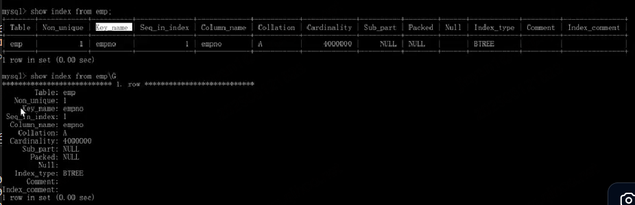

# 日常记录

- [日常记录](#日常记录)
  - [常识](#常识)
    - [与非关系型数据库的区别](#与非关系型数据库的区别)
      - [mongodb为什么适合水平扩展，mysql适合纵向扩展](#mongodb为什么适合水平扩展mysql适合纵向扩展)
  - [性能优化](#性能优化)
    - [数据页的概念](#数据页的概念)
      - [与存储引擎的关系](#与存储引擎的关系)


## 常识

1. MySQL 中的 SQL 关键字（如 SELECT、INSERT、WHERE）和内置函数名（如 COUNT()、SUM()）不区分大小写
2. 列名和查询中定义的别名，在任何操作系统中都不区分大小写
   1. `SELECT UserName AS un FROM users;` 等于 `SELECT username AS UN FROM users;`
3. 字符串值：区分大小写（取决于字符集和校对规则）
   1. 若校对规则包含 _ci（case insensitive，不区分大小写，如 utf8_general_ci），则字符串比较不区分大小写。例如：'Alice' 和 'alice' 会被视为相等。
   2. 若校对规则包含 _cs（case sensitive，区分大小写，如 utf8_bin），则字符串比较区分大小写。
例如：'Alice' 和 'alice' 会被视为不等
4. 数据库名、表名：是否区分大小写，取决于操作系统

    ```js
    1- Linux/Unix 系统：默认区分大小写（因为 Linux 文件系统大小写敏感，而 MySQL 表名对应磁盘上的文件）。
    例如：users 和 Users 会被视为两个不同的表。

    2- Windows 系统：默认不区分大小写（Windows 文件系统大小写不敏感）。
    例如：users 和 Users 会被视为同一个表。

    3- macOS：取决于文件系统格式，默认情况下（APFS）通常不区分大小写。

    4- 可以通过修改 MySQL 配置文件中的 lower_case_table_names 参数调整此行为（需重启服务生效）：
    lower_case_table_names=0：区分大小写（默认 Linux）
    lower_case_table_names=1：不区分大小写（表名存储为小写）
    lower_case_table_names=2：表名按输入存储，但比较时不区分大小写（不推荐）
    ```

5. 在 MySQL 中，SQL 语句通常以分号（;）结尾，但也可以使用 \G 替代分号作为语句结束符，两者的核心区别在于结果的展示格式
   1. 使用 \G 结尾时，查询结果会以垂直列的形式展示（每条记录的字段名和值分行显示），而不是默认的水平表格形式,适用于表的字段过多时,方便查看
   2. 

### 与非关系型数据库的区别


#### mongodb为什么适合水平扩展，mysql适合纵向扩展
一、数据模型的差异
1. MongoDB：文档型数据库（NoSQL）
数据模型：使用 BSON（Binary JSON）格式存储数据，数据以“文档”形式组织，结构灵活，支持嵌套。
无固定 Schema：每个文档可以有不同的字段，不需要预先定义表结构。
聚合能力强：支持内嵌数组、对象，适合复杂数据结构。
✅ 优势：天然适合分片（Sharding），因为每个文档是独立的、自包含的单元，可以很容易地根据某个字段（如 _id 或 user_id）进行拆分和分布到不同节点。

2. MySQL：关系型数据库（RDBMS）
数据模型：基于表格，强调规范化、外键、事务一致性。
强 Schema：需要预先定义表结构，字段类型严格。
多表关联：常通过 JOIN 操作连接多个表。
❌ 挑战：水平扩展时，JOIN 和外键约束会变得非常复杂，跨节点的事务和一致性难以保证。

🌐 场景：你开发了一个电商网站“好物商城”
初始阶段（用户少）
用户量：1万
商品数：5千
订单量：每天几百单
你用了：

一台 MySQL 数据库（存用户、订单、商品）
一台 MongoDB 数据库（存商品评论、日志、用户行为）
一切运行良好。

⚠️ 问题来了：双11大促！用户暴增！
现在：

用户量：500万
每天订单：50万单
每秒写入评论：5000条
服务器快撑不住了！
你该怎么办？两种数据库的应对方式完全不同。

✅ 一、MongoDB 的“水平扩展”实战
问题：评论系统写入太慢，用户发评论要等好几秒！
原始架构：

所有评论都写入一个 MongoDB 实例（比如按商品 ID 存）
解决方案：水平扩展（加机器）

你这么做：

把评论数据按 商品ID 分片（Sharding）
商品ID 00001-10000 → 存到 MongoDB 服务器 A
商品ID 10001-20000 → 存到 MongoDB 服务器 B
商品ID 20001-30000 → 存到 MongoDB 服务器 C
加个 Mongos 路由器：它知道每个商品评论该去哪台服务器

结果：

写入压力被分摊到 3 台机器
每台只处理 1/3 的请求
用户发评论瞬间完成！
✅ 这就是水平扩展：


二、MySQL 的“纵向扩展”实战
问题：订单查询太慢！用户查“我的订单”要等 10 秒！
原始架构：

所有订单存在一张 orders 表里
现在表里有 5000万条订单记录
解决方案：纵向扩展（升级机器）

你这么做：

把原来的数据库服务器换掉：
原来：4核CPU / 16GB内存 / 普通硬盘
现在：32核CPU / 128GB内存 / NVMe固态硬盘
给 user_id 字段加上索引，加速查询

结果：

单台机器性能变强了
查询“我的订单”从 10 秒 → 0.2 秒
✅ 这就是纵向扩展：

不增加机器数量，而是把现有的这台机器升级得更强。因为数据关系性太强，不适合水平拆


三、JOIN 是水平扩展的“天敌”
❌ MySQL 水平扩展的致命问题：跨库 JOIN 几乎不可行
假设你把数据按 user_id 分片：

user_id % 3 = 0 → DB A
user_id % 3 = 1 → DB B
user_id % 3 = 2 → DB C
现在用户 100（在 DB A）给用户 200（在 DB B）转账，要记录一笔订单。

你面临的问题：

users 表在 DB A 和 DB B
orders 表也在 DB A 和 DB B
要执行 JOIN 查询？必须：
分别去 DB A 和 DB B 查数据
在应用层合并结果
性能极差，代码复杂
👉 结论：

跨节点 JOIN 导致查询性能暴跌，开发复杂度飙升。

## 性能优化

> 主要参考Mysql优化文件夹

1. 磁盘 IO 是数据库性能的最大瓶颈，次数越多，速度越慢

### 数据页的概念

“数据页”（Data Page）是数据库存储数据的最小物理单位，理解它能帮你搞清楚为什么表结构设计会影响查询效率。以 MySQL 的 InnoDB 引擎为例，详细解释如下：

一、数据页是什么？

 数据页就是表文件里的 “多页的Word文档”—— 每页（数据页）有固定的容量，用来存放表中的记录。

固定大小：InnoDB 中，一个数据页默认大小是 16KB（可通过配置修改，但极少这么做）。

存储内容：一个数据页里会打包存储多条表记录（具体多少条，取决于单条记录的大小），同时包含一些管理信息（如页头、页尾、索引信息等）。

物理本质：数据页对应磁盘上的一块连续存储空间，当数据库读写数据时，最小单位是整个数据页（不会只读取一条记录的一部分，而是把整个页加载到内存）。

二、数据页的存储逻辑：“一页能装多少条记录？”

单条记录的大小，直接决定一个数据页能装多少条记录，这是影响效率的关键：

例 1：小字段表（无大字段）

假设有一个 user 表，字段都是小类型：

id（int，4 字节）、name（varchar (20)，约 20 字节）、age（tinyint，1 字节）
单条记录总大小约 30 字节（含必要的额外信息）。

计算：16KB = 16×1024 = 16384 字节
一个数据页可存储：16384 ÷ 30 ≈ 546 条记录。

例 2：包含大字段的表

同样的 user 表，增加一个大字段 introduction（text 类型，平均每条记录占用 5KB）：

单条记录总大小约 5KB + 30 字节 ≈ 5150 字节。

计算：16384 ÷ 5150 ≈ 3 条记录。
（即一个数据页只能装下 3 条记录）

三、数据页如何影响查询效率？

数据库查询时，无论你查多少条记录，都需要先把它们所在的 “数据页” 加载到内存。

因此：

1. 数据页越少，IO 效率越高
   1. 查 1000 条记录时：
   2. 小字段表：1000 ÷ 546 ≈ 2 个数据页 → 只需从磁盘读 2 次页。
   3. 大字段表：1000 ÷ 3 ≈ 334 个数据页 → 需从磁盘读 334 次页。
   4. （磁盘 IO 是数据库性能的最大瓶颈，次数越多，速度越慢）
2. 内存缓存利用率
   1. 数据库会把常用的数据页缓存到内存（如 InnoDB 的缓冲池）。小字段表的一个内存页能缓存 546 条记录，而大字段表只能缓存 3 条。同样的内存空间，能缓存的有效记录相差 180 倍，导致大字段表更容易触发磁盘 IO。
   2. 索引查询也受影响, 即使通过索引定位到记录，最终仍需访问数据页拿记录（除非用索引覆盖）。如果数据页分散，索引查询的效率也会下降。

四、数据页与 “垂直分割” 的关系

垂直分割的核心作用，就是让主表的单条记录变小，增加数据页的记录密度：

- 把 introduction 这样的大字段拆到独立表后，原 user 表的单条记录变回 30 字节，数据页能存 546 条记录。
- 此时查 1000 条用户的基础信息（id、name、age），只需加载 2 个数据页，效率提升 100 倍以上。

#### 与存储引擎的关系

在 InnoDB 存储引擎中，数据页是存储在 .ibd 文件中的（当使用独立表空间时）。

.ibd 文件是 InnoDB 表的独立表空间文件，它本质上是由一系列数据页（包括数据页、索引页、undo 页等）组成的物理文件。每个数据页（默认 16KB）是 .ibd 文件中的一个连续存储空间，数据库通过页号（每个页在文件中的唯一编号）来定位某个页的位置。

.ibd 文件就像一个 “容器”，里面按顺序存放着该表的所有数据页。例如，一个 16MB 的 .ibd 文件，刚好可以容纳 1024 个 16KB 的数据页（16MB = 16×1024KB = 1024×16KB），第 5 号数据页在 .ibd 文件中的位置是 5 × 16KB = 80KB 处，数据库读取时会直接定位到这个偏移量加载该页

数据页是 .ibd 文件的最小存储单位（16KB），.ibd 文件的大小一定是 16KB 的整数倍（因为每次新增页都会按 16KB 分配）

