# <a name="_toc531881583"></a>**网站优化-MySQL优化（一）**

- [**网站优化-MySQL优化（一）**](#网站优化-mysql优化一)
- [**一、mysql优化概述**](#一mysql优化概述)
- [**二、存储引擎的选择**](#二存储引擎的选择)
  - [**1、存储引擎介绍**](#1存储引擎介绍)
    - [**（1）什么是存储引擎？**](#1什么是存储引擎)
    - [**（2）存储引擎的理解：**](#2存储引擎的理解)
    - [**（3）存储引擎所处的位置：**](#3存储引擎所处的位置)
    - [**（4）常用存储引擎：**](#4常用存储引擎)
  - [**2、innodb存储引擎**](#2innodb存储引擎)
    - [**（1）存储格式：**](#1存储格式)
    - [**（2）数据是按照主键顺序存储。**](#2数据是按照主键顺序存储)
    - [**（3）并发处理：**](#3并发处理)
  - [**3、MyISAM存储引擎**](#3myisam存储引擎)
    - [**（1）存储方式：**](#1存储方式)
    - [**（2）数据的存储顺序为插入顺序。**](#2数据的存储顺序为插入顺序)
    - [**（3）并发性**](#3并发性)
  - [**4、memory**](#4memory)
- [**三、查找需要优化语句**](#三查找需要优化语句)
  - [**1、慢查询日志**](#1慢查询日志)
  - [**方式一、临时启动慢查询记录日志**](#方式一临时启动慢查询记录日志)
  - [**方式二：通过修改配置文件，添加如下语句**](#方式二通过修改配置文件添加如下语句)
  - [**2、精确记录查询时间**](#2精确记录查询时间)
- [**四、索引讲解**](#四索引讲解)
  - [**1、索引的基本介绍**](#1索引的基本介绍)
  - [**2、索引的类型：**](#2索引的类型)
  - [**3、索引管理语法**](#3索引管理语法)
    - [**（1）创建索引：**](#1创建索引)
    - [**（2）删除索引**](#2删除索引)
    - [**（3）查看索引**](#3查看索引)
    - [**（4）创建索引注意事项：**](#4创建索引注意事项)
- [**五、执行计划**](#五执行计划)
- [**六、索引的数据结构**](#六索引的数据结构)
  - [**1、myisam的存储引擎索引结构：**](#1myisam的存储引擎索引结构)
  - [**2、innodb的存储引擎的索引结构**](#2innodb的存储引擎的索引结构)
    - [聚簇索引：](#聚簇索引)
- [**七、索引覆盖**](#七索引覆盖)
- [**八、索引的使用原则**](#八索引的使用原则)
  - [**1、列独立**](#1列独立)
  - [**2、like查询**](#2like查询)
  - [**3、OR运算都具有索引**](#3or运算都具有索引)
  - [**4、复合索引使用**](#4复合索引使用)
  - [**4、mysql 智能选择**](#4mysql-智能选择)
  - [**5、优化group by语句。**](#5优化group-by语句)
- [**九、mysql中锁机制**](#九mysql中锁机制)
  - [**1、应用场合：**](#1应用场合)
  - [**2、mysql里面的锁的几种形式**](#2mysql里面的锁的几种形式)
  - [**3、表锁的演示，**](#3表锁的演示)
  - [**4、行锁的演示**](#4行锁的演示)
  - [**5、通过php代码来实现锁机制。**](#5通过php代码来实现锁机制)
    - [使用mysql里面锁机制缺点：](#使用mysql里面锁机制缺点)


# <a name="_toc484361254"></a><a name="_toc531881584"></a>**一、mysql优化概述**
前面我们讲页面静态化，memcache是通过减少对mysql 操作来提升访问速度，但是一个网站总是要操作数据库，我们如何提升对mysql的操作速度。

方针：

① 存储层：数据表”存储引擎”选取、字段类型选取、逆范式(3范式)

② 设计层：索引、分区/分表、存储过程，sql语句的优化

③ 架构层：分布式部署(集群)(读写分离)，需要增加硬件

④ sql语句层：结果一样的情况下，要选择效率高、速度快、节省资源的sql语句执行

# <a name="_toc484361255"></a><a name="_toc531881585"></a>**二、存储引擎的选择**

- 常用存储引擎：
  - innodb：行(记录)锁，支持事务(回滚)，支持外键
  - myisam：表锁，全文索引
  - memory：内存存储引擎，速度快，重启后数据丢失，支持索引

- mysql安装目录中：
  - 数据目录：data
    - data下目录data_01目录的为：各个建的数据库名字目录
    - data_01目录下的所有文件为：各个数据库下的表文件
  - 配置文件：my.ini
  - 日志文件：error.log、general.log、slow.log  

## <a name="_toc484361256"></a><a name="_toc531881586"></a>**1、存储引擎介绍**
熟悉的存储引擎：Myisam、innodb  memory
### <a name="_toc484361257"></a><a name="_toc531881587"></a>**（1）什么是存储引擎？**
数据表存储数据的一种格式。

数据存储在不同的格式里边，该格式体现的特性也是不一样的。例如innodb存储引擎的特性有支持事务、支持行级锁，mysiam支持的特性有压缩机制等。

MySQL中的数据是通过各种不同的技术(格式)存储在文件（或者内存）中的。技术和本身的特性就称为"存储引擎"。
### <a name="_toc484361258"></a><a name="_toc531881588"></a>**（2）存储引擎的理解：**
现实生活中，楼房、平房就是具体存储人的存储引擎，楼房、平房有自己独特的技术特性

例如楼房有楼梯、电梯、平房可以自己打井喝水等。


### <a name="_toc484361259"></a><a name="_toc531881589"></a>**（3）存储引擎所处的位置：**
存储引擎，处于MySql服务器的最底层，直接存储数据，导致上层的操作，依赖于存储引擎的选择。

客户端-》网络连接层-》业务逻辑层（编译，优化，执行SQL）-》存储引擎层

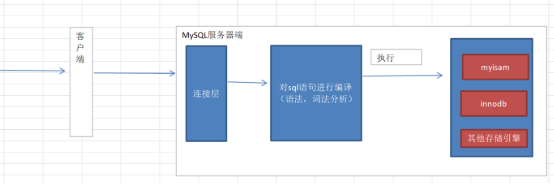

查看当前mysql支持的存储引擎列表：show engines

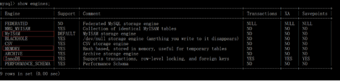
### <a name="_toc484361260"></a><a name="_toc531881590"></a>**（4）常用存储引擎：**
① Myisam：表锁，全文索引

② Innodb：行(记录)锁，事务（回滚），外键

③ Memory：内存存储引擎，速度快、数据容易丢失


1. 概念：
   1. 行级锁定：只锁定被更新、删除或查询的特定行，其他行可被其他事务正常读写，减少锁冲突。例如，当事务执行 UPDATE table SET ... WHERE ... 时，会锁定符合条件的行，防止其他事务同时修改这些行

## <a name="_toc484361261"></a><a name="_toc531881591"></a>**2、innodb存储引擎**
\>=5.5 版本中默认的存储引擎，MySql推荐使用的存储引擎。提供事务，行级锁定，存储引擎。

事务安全型存储引擎，更加注重数据的完整性和安全性。
### <a name="_toc484361262"></a><a name="_toc531881592"></a>**（1）存储格式：**
1. innodb存储引擎  
   1. 每个数据表有单独的“结构文件”  **\*.frm**
   2. **数据**和**索引**集中存储，存储于同一个**表空间文件**中**ibdata1**。
      1. 5.6版本之前默认情况下,innodb表所有的数据都共同存储在下面这个ibdata1文件如下

ibdata1就是InnoDB表的共享存储空间，默认innodb所有表的数据都在一个ibdata1里。

创建innodb表后，存在文件如下：

create table t1(id int,name varchar(32)) engine innodb charset utf8;


.frm表结构文件。


innodb表空间文件：存储innodb的数据和索引。

ibdata1

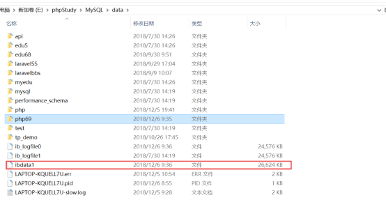

2. 【5.6版本】之前默认情况下,innodb表所有的数据都共同存储在下面这个ibdata1文件如下，所有的 innodb表的**数据**和**索引**在同一个表空间文件中，
3. 通过配置可以达到每个innodb的表对应一个表空间文件。
   1. 【5.6版本】之后，默认开启下面配置，每个innodb的表对应一个表空间文件。


show  variables   like ‘innodb\_file\_per\_table%’

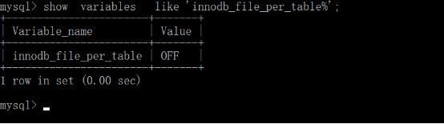

开启该配置：

`set  global  innodb_file_per_table=1;`

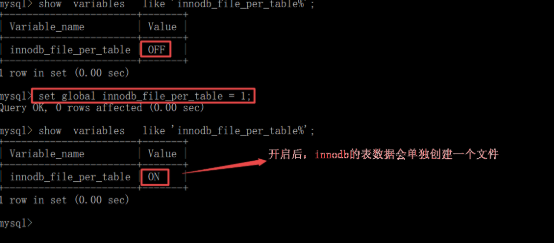

创建一个innodbd的表进行测试使用。


- 查看表对应的文件自己独立的“数据/索引”文件
  - 文件格式为xxx.ibd

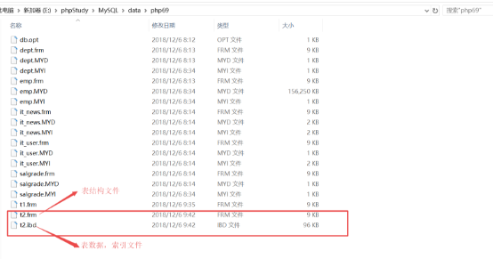

系统配置参数innodb\_file\_per\_table后期无论发生任何变化，t2都有自己独立的“数据/索引”文件。

**注意：相比较之下，使用独占表空间的效率以及性能会更高一点。**

注意：innodb数据表不能直接进行文件的复制/粘贴进行备份还原，可以使用如下指令：

备份数据库的指令

\> mysqldump  -uroot -p密码  数据库名字 > f:/文件名称.sql  [备份]

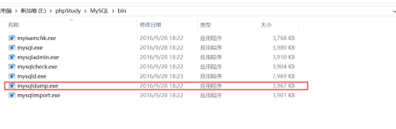


\> mysql -uroot  -p密码 数据库   <  f:/文件名称.sql  [还原]


### <a name="_toc484361263"></a><a name="_toc531881593"></a>**（2）数据是按照主键顺序存储。**
该innodb数据表，数据的写入顺序 与 存储的顺序不一致，需要按照主键的顺序把记录摆放到对应的位置上去，速度比Myisam的要稍慢。

create table t3(

id int primary key auto\_increment,

name varchar(32) not null

)engine innodb charset utf8;

insert into t3 values(223,'刘备'),(12,'张飞'),(162,'张聊'),(1892,'网飞');

给innodb数据表写入4条记录信息(主键id值顺序不同)

插入时做排序工作，效率低。

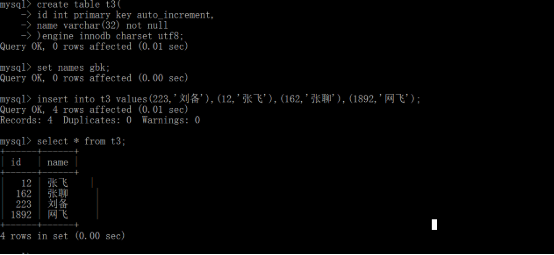
### <a name="_toc484361264"></a><a name="_toc531881594"></a>**（3）并发处理：**
擅长处理并发的。

行级锁定(row-level locking)，实现了行级锁定，在一定情况下，可以选择行级锁来提升并发性，也支持表级锁定，innodb根据操作选择。

**锁机制：**

当客户端操作表（记录）时，为了保证操作的隔离性（多个客户端操作不能相互影响），通过加锁来处理。

- 锁机制
  - 比如例子：下订单场景，库存仅剩1个，两个人同时购买，不加锁会导致库存超卖，两个人都购买成功
  - 解决办法：加锁，比如行级锁

**操作方面：**

**读锁**：读操作时增加的锁，也叫共享锁，S-lock。特征是所有人都只可以读，只有释放锁之后才可以写。

**写锁**：写操作时增加的锁，也叫独占锁或排他锁，X-lock。特征，只有锁表的客户可以操作（读写）这个表，其他客户读都不能读。

办公室开会锁上门。

**锁定粒度（范围）**

表级锁：开销小，加锁快，发生锁冲突的概率最高，并发度最低。myisam和innodb都支持。

行级锁：开销大，加锁慢，发生锁冲突的概率最低，并发度也最高。innodb支持 

## <a name="_toc484361265"></a><a name="_toc531881595"></a>**3、MyISAM存储引擎**
<=5.5mysql默认的存储引擎。

（ISAM——索引顺序访问方法）是Indexed Sequential Access Method(索引顺序[存取方法](http://baike.baidu.com/view/3401818.htm))的缩写 

它是一种索引机制，用于高效访问文件中的数据行，擅长与处理高速读与写。
### <a name="_toc484361266"></a><a name="_toc531881596"></a>**（1）存储方式：**
数据，索引，结构分别存储于不同的文件中。

create table t4(id int,name varchar(32)) engine myisam charset utf8;

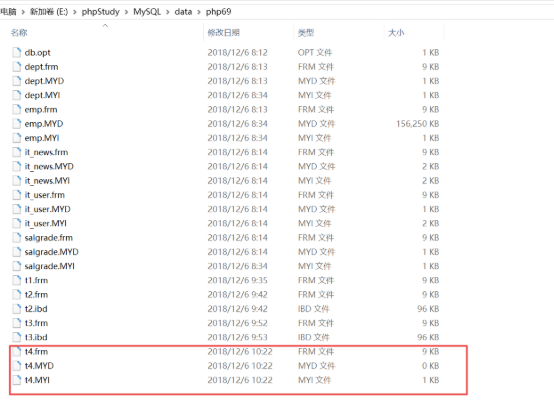

mysiam存储引擎数据表，每个数据表都有三个文件\*.frm（结构文件） \*.MYD(数据文件)  \*.MYI(索引文件)

这三个文件支持物理复制、粘贴操作(直接备份还原)。

### <a name="_toc484361267"></a><a name="_toc531881597"></a>**（2）数据的存储顺序为插入顺序。**
```js
create table t5(

id int primary key auto\_increment,

name varchar(32) not null

)engine myisam  charset utf8;

insert into t5 values(2223,'刘备'),(12,'张飞'),(162,'张聊'),(1892,'网飞');
```
数据查询的顺序，与写入的顺序一致。

数据写入时候，没有按照主键id值给予排序存储，该特点导致数据写入的速度非常快。

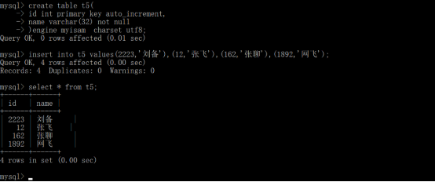
### <a name="_toc484361268"></a><a name="_toc531881598"></a>**（3）并发性**
1. mysiam的并发性较比innodb要稍逊色 ------> 因为数据表是“表锁”
2. mysiam也不支持事务

<a name="_toc484361270"></a>myisam和innodb的取舍

如果表对事务的要求不高，同时是以查询和添加为主，我们考虑使用MyISAM存储引擎，比如bbs中的发帖表，回复表。

INNODB存储引擎：

对事务要求高，保存的数据都是重要数据，我们建议使用INNODB，比如订单表，库存表，商品表，账号表等等。

购买成功了库存 -1，

产生订单，操作表

## <a name="_toc484361271"></a><a name="_toc531881599"></a>**4、memory**
内存存储引擎，	

特点：内部数据运行速度非常快，临时存储一些信息

缺点：服务器如果断电，重启，就会清空该存储引擎的全部数据

create table t6(id int,name varchar(32)) engine memory charset utf8;

mysql服务，重启后，数据丢失。

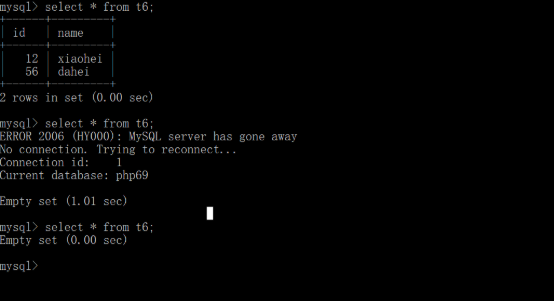
# <a name="_toc484361272"></a><a name="_toc531881600"></a>**三、查找需要优化语句**
## <a name="_toc484361273"></a><a name="_toc531881601"></a>**1、慢查询日志**
是一种mysql提供的日志，记录所有执行时间超过某个时间界限的sql的语句。这个时间界限，我们可以指定。在mysql中默认没有开启慢查询，即使开启了，只会记录执行的sql语句超过10秒的语句。

- 开启此功能：自动记录查询比较慢的语句

## <a name="_toc484361274"></a><a name="_toc531881602"></a>**方式一、临时启动慢查询记录日志**
（1）{mysql程序所在的目录}>bin/mysqld.exe   --safe-mode  --slow-query-log 


注意：先把mysql关闭后，再执行以上指令启动。


进入cmd开始启动；

\>bin/mysqld.exe   --safe-mode  --slow-query-log

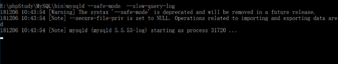

通过慢查询日志定位执行效率较低的SQL语句。慢查询日志记录了所有执行时间超过long\_query\_time所设置的SQL语句。


（2）在默认情况下，慢查询日志是存储到data目录下面的。根据配置文件里面的配置，找到data的存储路径。

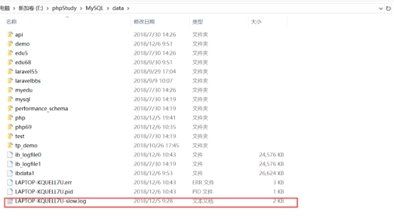


（3）可以通过命令查看慢查询日志的时间

show variables like ‘long\_query\_time’;


修改慢查询日志时间：set  long\_query\_time=0.5;


（4）测试查询：

查看慢查询日志 

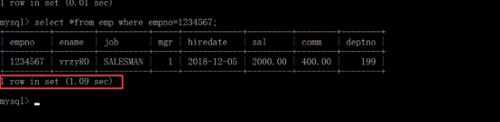


上面操作查询第1234567条记录，达到1.09秒超过前面设下的时间了，下面的慢日志就记录下来了：

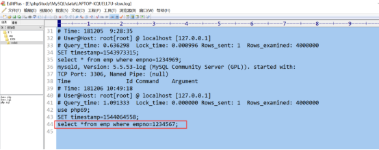

```js
// 测试工具函数：如果你没有上面的大表，可以通过下面函数模拟测试执行时间

-- 测试字符串拼接性能
SELECT BENCHMARK(100000, CONCAT('test', 'string', 123));

-- 测试函数执行性能
SELECT BENCHMARK(1000000, MD5('password'));
```

（5）一般情况下，一个sql语句执行比较慢，原因是没有索引

添加索引之前,索引文件大小如下；

没有添加索引之前查询时间如下：

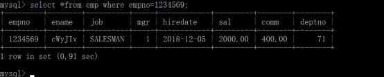

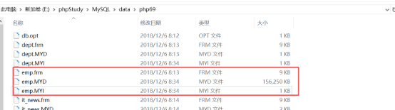

添加索引之后：`alter  table  emp add index(empno)`
：给 emp 表的 empno 字段创建一个普通索引


添加索引后，索引文件变大。

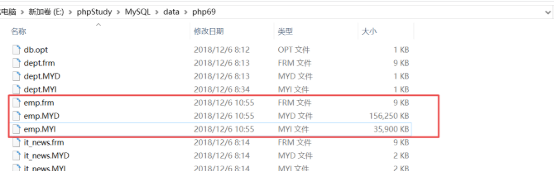

添加索引之后需要的时间；变成毫秒级了

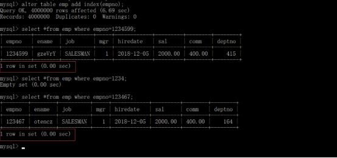

结论：创建完索引后，索引文件会变大，添加索引会明显的提高查询速度。

## <a name="_toc397265904"></a><a name="_toc484361275"></a><a name="_toc531881603"></a>**方式二：通过修改配置文件，添加如下语句**
在配置文件中指定：（1）开启（2）时间界限


log-slow-queries="d:/slow-log"

慢查询日志文件存储的路径，当前是把慢查询日志存储到d:盘下面，文件名为slow-log

long\_query\_time=1

指定慢查询的时间，默认是10秒，我们自定义成**1或0.05**秒，也就是说当一个sql语句的执行速度超过1秒时，会把该语句添加到慢查询日志里面，

通过配置文件是永远的开启慢查询日志

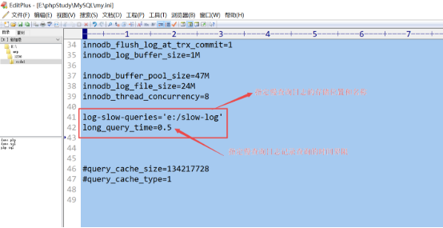
## <a name="_toc484361276"></a><a name="_toc531881604"></a>**2、精确记录查询时间**
使用mysql提供profile机制完成。

profile记录每次执行的sql语句的具体时间，精确时间到小数点8位

（1）开启profile机制: 开启之后就会自动记录

set profiling = 1;

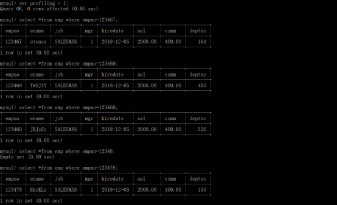

执行需要分析的sql语句（自动记录该sql的时间）

（2）查看记录sql语句的执行时间：

show profiles;


注意：不需要分析时，最好将其关闭。

set profiling=0;

# <a name="_toc484361277"></a><a name="_toc531881605"></a>**四、索引讲解**
## <a name="_toc484361278"></a><a name="_toc531881606"></a>**1、索引的基本介绍**
利用关键字，就是记录的部分数据（某个字段，某些字段，某个字段的一部分），建立与记录位置的对应关系，就是索引。

索引的作用：是用于快速定位实际数据位置的一种机制。

例如：

字典的   检索

写字楼   导航

索引在mysql中，是独立于数据的一种特殊的数据结构。

索引一定有顺序（排好序的快速查找结构），记录则不一定。

画图说明

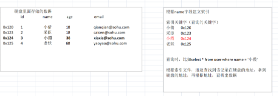

测试添加索引前后，对比执行时间。

## <a name="_toc484361279"></a><a name="_toc531881607"></a>**2、索引的类型：**
4种类型：主键索引，唯一索引，普通索引，全文索引。

无论任何类型，都是通过建立**关键字**与**位置**的对应的关系来实现的。

- 以上类型的差异，是对关键字的要求不同。
  - 关键字：记录的部分数据（某个字段，某些字段，某个字段的一部分）

**1. 普通索引**：对关键字没有要求。

**2. 唯一索引**：要求关键字不能重复，一个表里可以有多个唯一（如你的邮箱手机号都属于唯一索引），同时增加唯一约束。(指定唯一键时自动创建唯一索引)

**3. 主键索引**：要求关键字不能重复（一个表只能有一个主键），也不能为NULL。同时增加主键约束（指定主键时自动创建主键索引）。

**4. 全文索引**：关键字的来源不是所有字段的数据，而是从字段中提取的特别关键词。

        关键词的来源：可以是某个字段，也可以是某些字段（复合索引）。如果一个索引通过在多个字段上提取的关键字，称之为复合索引。

比如：`alter table emp add   index (field1,field2)`

## <a name="_toc484361280"></a><a name="_toc531881608"></a>**3、索引管理语法**

### <a name="_toc484361281"></a><a name="_toc531881609"></a>**（1）创建索引：**
**建表时：**

注意：索引可以起名字，但是主索引不能起名字，因为一个表仅仅可以有一个主键索引，其他索引可以出现多个。名字可以省略，mysql会默认生成，通常使用字段名来充当。

show create table index1;

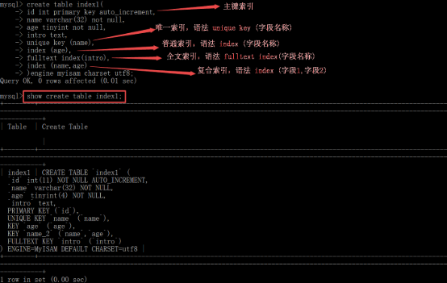

**更新表结构**

`alter table index2 add unique key (name),add index(age),add fulltext index(intro),add index(name,age);`

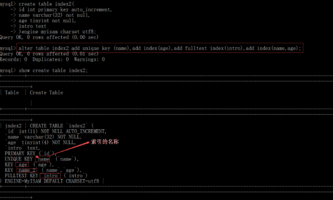

注意：

第一点：如果表中存在数据，数据符合唯一或主键约束才可能创建成功。

第二点：auto\_increment属性，依赖于一个KEY（主键或唯一）。

### <a name="_toc484361282"></a><a name="_toc531881610"></a>**（2）删除索引**
修改表结构时完成：

1. 删除主键索引：alter table  table\_name drop primary key 

主键索引的删除，如果没有auto\_increment 属性则使用 alter table  表名 drop primary key

如果在删除主键索引时，该字段中有auto\_increment则先去掉该属性再删除。

去除主键的auto\_inrement属性：

alter table 表名 modify id int unsigned not null comment '主键'

如有主键中有auto\_incrments属性时，删除主键索引，则报如图提示。

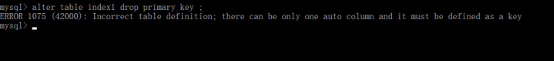

去除主键的auto\_inrement属性：

alter table index1 modify id int unsigned;

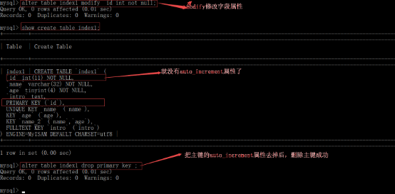

2. 删除普通索引，唯一索引，全文索引，复合索引；

语法：

alter table 表名  drop index 索引的名称；

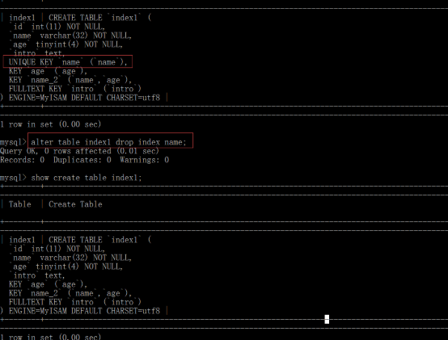

如果没有指定索引名，则可以通过查看索引的方法得到索引名（一般依赖于索引字段的名字）
### <a name="_toc484361283"></a><a name="_toc531881611"></a>**（3）查看索引**
```js
show indexes from table_name;

show index from table_name;

show create table table_name;

show keys from table_name;

desc table_name;
```
key_name就是索引名

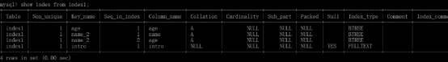
### <a name="_toc484361284"></a><a name="_toc531881612"></a>**（4）创建索引注意事项：**

第一：**较频繁的作为查询条件字段**应该创建索引

`	`select \* from emp where empno = 1

第二：唯一性太差的字段不适合单独创建索引，即使频繁作为查询条件(如男女性别这个字段，唯一性太差)

`	`select \* from emp where sex = '男‘

第三：更新非常频繁的字段不适合创建索引（索引文件也会经常变化浪费性能）

`	`select \* from emp where logincount = 1

第四：不会出现在WHERE子句中字段不该创建索引


-------建表时，主键即主键索引一般是一定要有的


# <a name="_toc484361285"></a><a name="_toc531881613"></a>**五、执行计划**

主要用于分析sql语句的执行情况（并不执行sql语句），一般包含sql语句**是否**使用了**索引**，使用了**哪些索引**。 

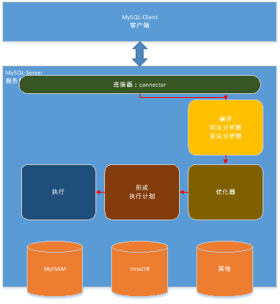

----- 上图mysql执行原理流程中的执行计划，就是我们本节要单独拿到的执行计划，进行分析，看执行效果效率怎么样

语法：explain  sql语句\G 或 desc sql语句 

对已有索引的语句进行分析执行情况：


删除索引后，在看执行计划

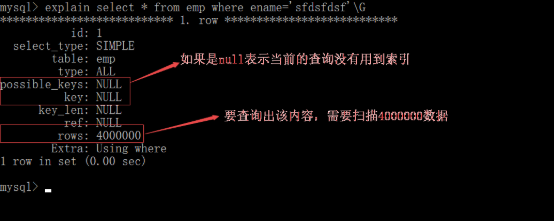
# <a name="_toc484361286"></a><a name="_toc531881614"></a>**六、索引的数据结构**
查看索引的类型：

show index from 表名;


1. B-tree索引结构：结构类似一棵 “平衡的多叉树”，可以快速定位数据位置

## <a name="_toc484361287"></a><a name="_toc531881615"></a>**1、myisam的存储引擎索引结构：**
索引的节点中存储的是数据的物理地址（磁道和扇区）

myisam中数据和索引是分开存储的两个文件中的。

在查找数据时，查找到索引后，根据索引节点中记录的物理地址，查找到具体的数据内容。

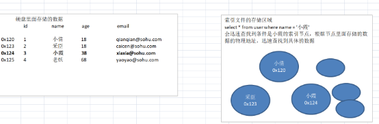
## <a name="_toc484361288"></a><a name="_toc531881616"></a>**2、innodb的存储引擎的索引结构**

innodb中数据和索引是存储在一个文件区域的，数据文件的后缀是 .ibd


- 存储结构中：默认都有主键索引的，每个区域存的是主键id和该行的数据（主键id是一部分，该行的记录是一部分）
  - 也就解释了它插入数据时为什么要对主键进行排序进行存储
- innodb的主键索引文件上 直接存放该行数据,也称为**聚簇索引**
  - 当创建1个普通索引时也叫非主索引，都全部指向对主键的引用（非主键索引的节点存储是主键的id）------- key是普通索引名字，value是主键id的引用，再下一步通过主键id插到主键索引，拿到对应记录数据
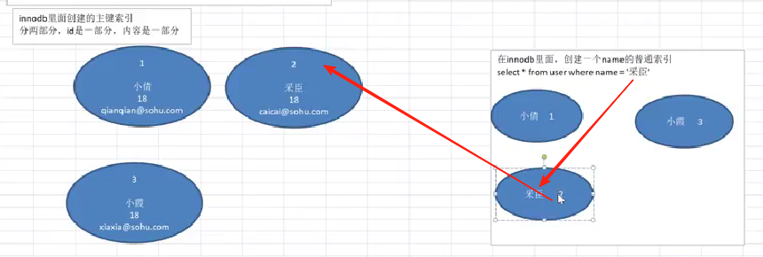
    ---------上图，比如要通过nam创建的索引，查询name=’采臣’的,先根据name建立的索引，找出该条记录的主键id，再根据主键的id通过主键索引找出该条记录。

区别：

innodb的主索引文件上 直接存放该行数据,称为聚簇索引,非主索引指向对主键的引用

myisam中, 主索引和非主索引,都指向物理行地址(磁盘位置).

**注意: innodb来说,：**

1: 主键索引 既存储索引值,又在叶子中存储行的数据

2: 如果没有主键（如果你表里不建主键）, 则会Unique key做主键 

3: 如果没有unique,则系统生成一个内部的rowid做主键.

4: 像innodb中,主键的索引结构中,既存储了主键值,又存储了行数据,这种结构称为”聚簇索引”

### 聚簇索引： 

优势: 根据主键查询条目比较少时,不用回行(数据就在主键节点下)

劣势: 如果碰到不规则数据插入时,造成频繁的页分裂（索引的节点移动）.

    如你的主键不规则时，会导致页分裂，影响性能。

1. 为什么主键不规则会加剧页分裂？
   1. 聚簇索引的叶子节点按主键顺序存储数据（类似字典按拼音排序）。
   2. 如果主键是自增的（如 1,2,3,4...），新数据永远插在最后一个节点，只有当最后一个节点满了才会分裂，且分裂后两个节点依然有序，效率高。
   3. 如果主键是不规则的（如随机生成的 UUID、乱序数字），新数据可能需要插入到中间某个节点：
   4. 比如已有节点存储 (10,20,30,40)，要插入 25，而节点已满，就必须拆分这个节点为 (10,20) 和 (25,30,40)，同时还要更新父节点的指针指向这两个新节点。
2. 页分裂的影响：
   1. 性能损耗：拆分节点、移动数据、更新父节点指针都需要额外的 IO 操作，插入速度变慢。
   2. 空间浪费：分裂后的节点可能不会完全填满（比如原来 10 条数据的节点拆成 5+5），导致索引占用更多磁盘空间。
   3. 索引碎片：频繁分裂会让索引结构变得松散，查询时需要遍历更多节点，影响查询效率

# <a name="_toc484361289"></a><a name="_toc531881617"></a>**七、索引覆盖**
索引覆盖是指：如果查询的列恰好是索引的一部分，那么查询只需要在索引区上进行，不需要到数据区再找数据，这种查询速度非常快，称为“索引覆盖”

索引覆盖就是，我要在书里 查找一个内容，由于目录写的很详细，我在目录中就获取到了，不需要再翻到该页查看。

先分析一下使用场景，为什么使用索引覆盖，有什么好处？

准备两张表来测试使用；


案例1，比如给id建立了主键索引，使用id查询数据。----下面用desc执行计划分析语句是否用到了索引

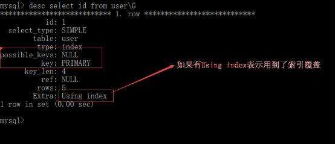


在user表里面，给name字段添加索引，查询name,就用到了索引覆盖。

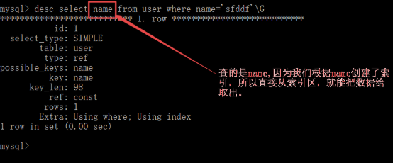

索引使用的场合如下，在没有条件时，直接查询建立索引的字段时，

案例2：比如给id和name 建立了复合索引，使用name作为条件查询。

没有创建索引时，

给id和name创建复合索引。

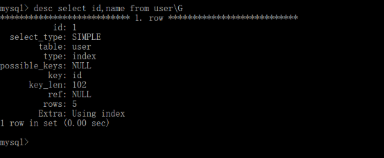

**1、使用索引覆盖的典型场景如下：**
```js
学生表：

共30个字段。但是查询时，查询了id,name,height,gender这4个字段的频率非常高，可以给他们通过建立复合索引 实现索引覆盖。


Select id, name, height,gender from student where name=’XXX’;

建立索引：

Alter table student add index (name);

Alter table student add index (name, id, height, gender, class\_id);

select name, id, height, gender, class\_id from student

**负面影响，增加了索引的尺寸。**

**保证该索引的使用率尽可能高，索引覆盖才有意义。**
```
# <a name="_toc484361290"></a><a name="_toc531881618"></a>**八、索引的使用原则**
## <a name="_toc484361291"></a><a name="_toc531881619"></a>**1、列独立**
只有参与条件表达式的字段独立在关系运算符的一侧，该字段才可能使用到索引。

“独立的列”是指索引列不能是表达式的一部分，也不能是函数的参数。

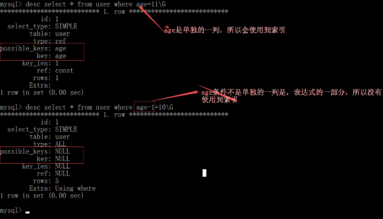

下面的都可以

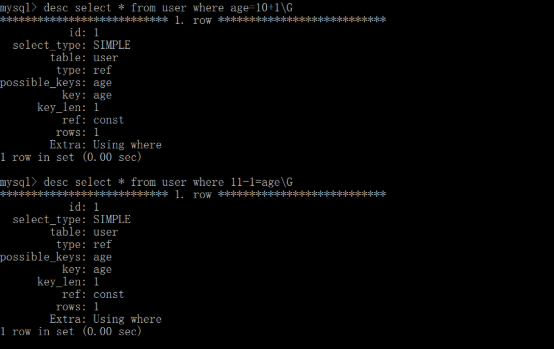
## <a name="_toc484361292"></a><a name="_toc531881620"></a>**2、like查询**
在使用like(模糊匹配)的时候，在左边没有通配符的情况下，才可以使用索引。

在mysql里，以%开头的like查询，用不到索引。

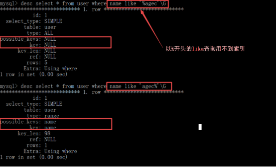


注意，如果select的字段正好就是索引，那么会用到索引即索引覆盖。

    为什么？因为主键索引是聚簇索引，主键索引的叶子节点存储的是数据行，所以可以直接返回数据行。


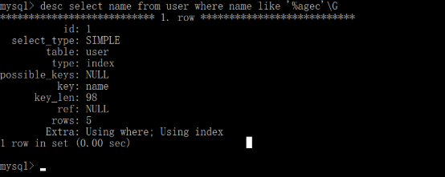

如果该表改为innodb引擎，因为非主键索引中存储的是id,select的字段是id因此用到了索引覆盖。

比如如下把表改成了 innodb的引擎，对name建立了索引，如下查询，就用到了索引覆盖。

如果是innodb的表，可以如上使用。

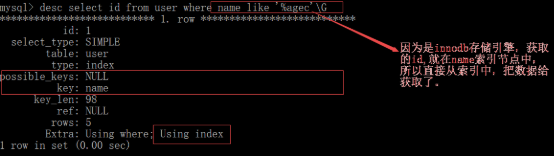

注意以下查询会用到索引；

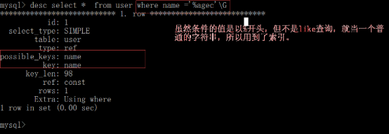
## <a name="_toc484361293"></a><a name="_toc531881621"></a>**3、OR运算都具有索引**
如果出现OR(或者)运算，要求所有参与运算的字段都存在索引，才会使用到索引。

如下：name有索引，classid没有索引

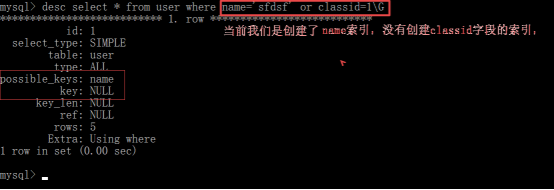

如下：id有索引，name有索引

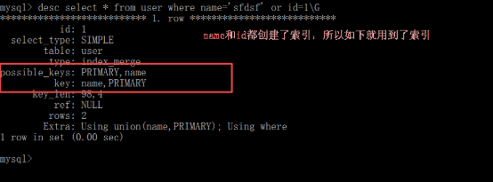

## <a name="_toc484361294"></a><a name="_toc531881622"></a>**4、复合索引使用**
当前查询环境；


最左原则：对于创建的多列(复合)索引，只要查询条件使用了最左边的列，索引一般就会被使用。 

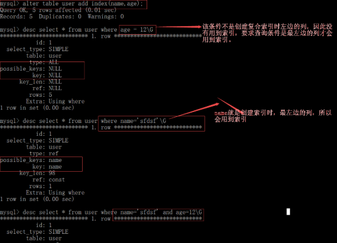

注意：在多列索引里面，如果有多个查询条件，要想查询效率比较高，比如如下建立的索引，

index(a,b,c,d)  要保证最左边的列用到索引。
## <a name="_toc484361295"></a><a name="_toc531881623"></a>**4、mysql 智能选择**
如果mysql认为，全表扫描不会慢于使用索引，则mysql会选择放弃索引，直接使用全表扫描。一般当取出的数据量超过表中数据的20%，优化器就不会使用索引，而是全表扫描。

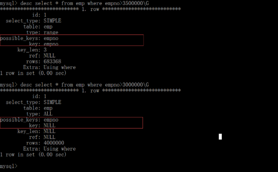

## <a name="_toc484361296"></a><a name="_toc531881624"></a>**5、优化group by语句。** 
默认情况下， mysql对所有的group by col1,col2进行排序。这与在查询中指定order by col1,col2类型，如果查询中包括group by 但用户想要避免排序结果的消耗，则可以使用order by null禁止排序。 

输出班级的id,classid

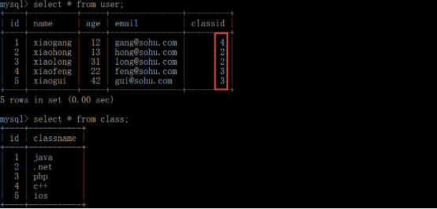

根据classid分组，自动根据classid进行 了排序，

`select classid,sum(age) from user group by classid;`

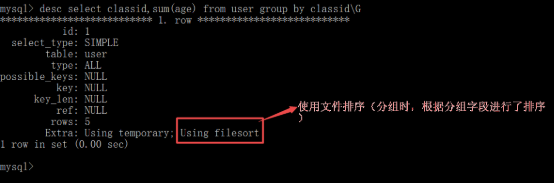

如果不想根据classid排序，则可以在后面使用order by nulll

`select classid,sum(age) from user group by classid order by null;`

通过分析语句发现：

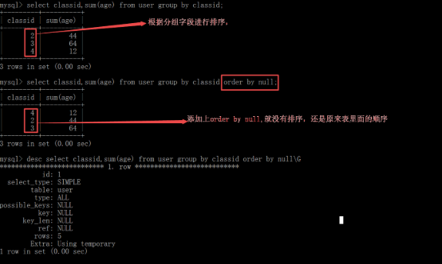
# <a name="_toc484361297"></a><a name="_toc531881625"></a>**九、mysql中锁机制**
## <a name="_toc435371840"></a><a name="_toc484361298"></a><a name="_toc531881626"></a>**1、应用场合：** 
比如有如下操作：

（1）从数据库中取出id的值(比如id=100) 

（2）把这个值-1(id=100-1)

（3）再把该值存回到数据库(id=99)

假如id=1

有两个进程（用户）同时操作，

使用锁机制来完成，

同时操作时，只有一个进程获得锁，其他进程就等待，

进程1

添加锁

id =100

id=100-1

id=99

释放锁

进程2

wating等待    

wating等待

wating等待

id =100

id=100-1

id=99
## <a name="_toc435371841"></a><a name="_toc484361299"></a><a name="_toc531881627"></a>**2、mysql里面的锁的几种形式**
**锁机制：** 

当客户端操作表（记录）时，为了保证操作的隔离性（多个客户端操作不能相互影响），通过加锁来处理。

**操作方面：** 

**读锁**：读操作时增加的锁，也叫共享锁，S-lock。特征是所有人都只可以读，只有释放锁之后才可以写。

**写锁**：写操作时增加的锁，也叫独占锁或排他锁，X-lock。特征，只有锁表的当前会话可以操作（读写）这个表，任何其他会话（包括同一用户的其他窗口）都无法读写该表，直到锁释放。


办公室开会锁上门。

**锁定粒度（范围）** 

表级锁：开销小，加锁快，发生锁冲突的概率最高，并发度最低。

myisam引擎的表支持表锁，

行级锁：开销大，加锁慢，发生锁冲突的概率最低，并发度也最高。

innodb引擎的表支持行锁与表锁。

## <a name="_toc435371842"></a><a name="_toc484361300"></a><a name="_toc531881628"></a>**3、表锁的演示，**
建立测试表，并添加测试数据：
```js
create table user(

`    `id int primary key auto\_increment,

`    `name varchar(32) not null default '',

`    `age tinyint unsigned not null default 0,

`    `email varchar(32) not null default '',

`    `classid int not null default 1

)engine myisam charset utf8;

insert into user values(null,'xiaogang',12,'gang@sohu.com',4),

(null,'xiaohong',13,'hong@sohu.com',2),

(null,'xiaolong',31,'long@sohu.com',2),

(null,'xiaofeng',22,'feng@sohu.com',3),

(null,'xiaogui',42,'gui@sohu.com',3);
```
添加锁的语法： `lock table table_name1 read|write,table_name2 read|write`

释放锁的语法：`unlock tables`

（1）添加读锁

语法：lock  table_name   read;

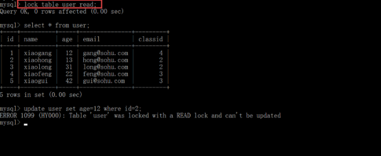

另外一个用户登录后，不能执行修改操作，可以执行查询操作。

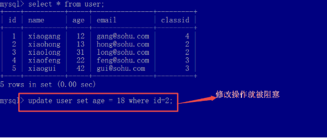

注意：添加读锁后，自己和其他的进程（用户）只能对该表查询操作，自己也不能执行修改操作。


执行释放锁，


释放锁之后，另外的一个进程，可以执行修改的操作了。


（2）添加写锁，

只有锁表的客户可以操作（读写）这个表，其他客户读都不能读。


另外的一个进程访问该表，其他的用户或进程，读都不能读，


**注意**：添加表的锁定后（不管读锁还是写锁），针对锁表的用户，只能操作锁定的表，不能操作没有锁定的其他任何表。
  - 其他用户终端可以操作没锁的表，不受影响
- 

## <a name="_toc435371843"></a><a name="_toc484361301"></a><a name="_toc531881629"></a>**4、行锁的演示**
innodb存储引擎是通过给索引上的索引项加锁来实现的，这就意味着：只有通过索引条件(主键)检索数据，innodb才会使用行级锁，否则，innodb使用表锁。

 

语法： 
```js
begin; // begin后就开启行锁了，其他用户执行该行时，会等待该锁释放。会处于阻塞状态

执行语句； 

commit; // 一提交就相当于释放该锁了
```
当前用户添加行锁，

另外的一个用户登录，进行操作。


## <a name="_toc435371844"></a><a name="_toc484361302"></a><a name="_toc531881630"></a>**5、通过php代码来实现锁机制。**

在apache里面有一个bin目录 下面有一个ab.exe工具，该工具可以模拟多个并发测试。


语法：

`ab.exe  –n 总的请求数  -c 并发数  url地址；`

具体的一个步骤：

（1）创建一个表，表里面就只有一个字段，便于我们演示。


（2）通过代码来完成，

从数据库中取出id的值(比如id=100) 

把这个值+1(id=100+1)

再把该值存回到数据库(id=101)


（3）使用ab工具模拟并发操作。


查看表里面的id的值，我们执行了代码50次，应该id的值是150才对，则说明我们请求的50个并发，有几个并发是同时执行的。


（4）添加锁机制来进行测试。

把表里面的数据， 再改为100；


修改如下代码，添加锁机制。


开始执行50个并发


测试效果如下；


### 使用mysql里面锁机制缺点：
就是阻塞，假如有一张goods表，goods表里面有一个库存的字段，当前下订单时，如果锁定了goods表，还能执行查询goods表吗？

会阻塞拖慢整个网站的速度，一但锁定goods表（添加写锁，要更改库存），则其他进程就无法查询goods表。

- 可以使用文件锁：
  - 确保同一时间只有一个进程能修改文件，避免 “脏写” 或数据覆盖问题,利用高并发时文件锁的锁定机制，间接实现表锁的效果
  - 间接解决表锁的其他进程无法查询goods表，导致其他进程查询速度慢的问题
  - 直接用表锁代价太大，工作中，一般用文件锁代替表锁


