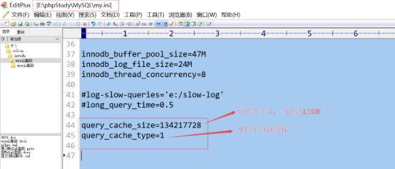
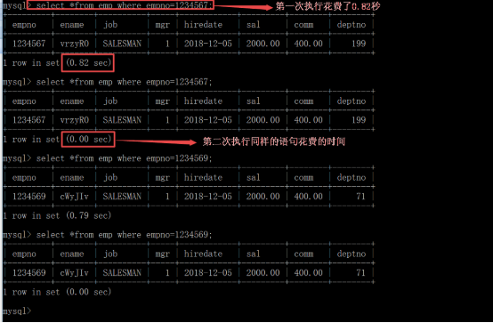
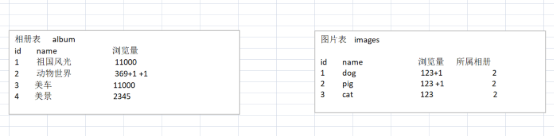
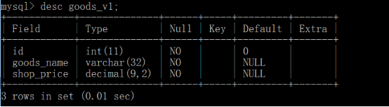
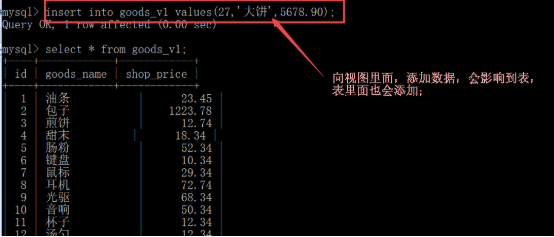
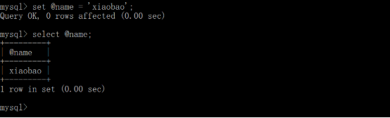

网站优化-mysql优化第二天

- [**一、查询缓存**](#一查询缓存)
  - [**1、具体使用**](#1具体使用)
  - [**2、无缓存**](#2无缓存)
    - [**（1）缓存失效**](#1缓存失效)
    - [**（2）不使用缓存**](#2不使用缓存)
    - [**（3）生成多个缓存**](#3生成多个缓存)
    - [**（4）禁用缓存**](#4禁用缓存)
  - [**3、查看缓存空间使用情况**](#3查看缓存空间使用情况)
- [**二．分区技术**](#二分区技术)
  - [**1、分区介绍**](#1分区介绍)
  - [**2、分区算法**](#2分区算法)
    - [**（1）list分区**](#1list分区)
    - [**（2）Range（范围）**](#2range范围)
    - [**（3）Hash（哈希）**](#3hash哈希)
    - [**（4）Key（键值）**](#4key键值)
  - [**3、 分区管理**](#3-分区管理)
      - [**（1）删除分区**](#1删除分区)
      - [**（2）增加分区**](#2增加分区)
        - [1）给p\_hash 增加hash分区](#1给p_hash-增加hash分区)
        - [2）增加list|range分区](#2增加listrange分区)
  - [**4、特别注意；**](#4特别注意)
- [**三、分表技术**](#三分表技术)
  - [**1. 分表设计**](#1-分表设计)
    - [水平分割](#水平分割)
  - [**2. 垂直分表（比较常用）**](#2-垂直分表比较常用)
- [**四、数据碎片与维护**](#四数据碎片与维护)
- [**五、范式讲解**](#五范式讲解)
  - [**第一范式：**](#第一范式)
    - [衍生出与非关系型数据库的区别](#衍生出与非关系型数据库的区别)
  - [**第二范式**](#第二范式)
  - [**第三范式**](#第三范式)
  - [**反三范式（逆范式）**](#反三范式逆范式)
- [**六、视图**](#六视图)
  - [**1、视图的定义**](#1视图的定义)
  - [**2、视图的作用**](#2视图的作用)
    - [**（1）可以简化查询。**](#1可以简化查询)
    - [**（2）可以进行权限控制，**](#2可以进行权限控制)
  - [**3、查询视图**](#3查询视图)
  - [**4、修改视图**](#4修改视图)
  - [**5、删除视图**](#5删除视图)
  - [**6、查看视图结构**](#6查看视图结构)
  - [**7、查看所有视图**](#7查看所有视图)
  - [**8、视图与表的关系**](#8视图与表的关系)
- [**七、SQL 编程**](#七sql-编程)
  - [**1、变量声明**](#1变量声明)
    - [**（1）会话变量**](#1会话变量)
    - [**（2）普通变量**](#2普通变量)
    - [**（3）变量赋值形式**](#3变量赋值形式)
  - [**2、运算符**](#2运算符)
  - [**3、语句块包含符**](#3语句块包含符)
  - [**4、if判断**](#4if判断)
  - [**5、case判断**](#5case判断)
  - [**6、循环**](#6循环)
- [**八、存储过程**](#八存储过程)
  - [**1、概念**](#1概念)
  - [**2、存储过程的优点**](#2存储过程的优点)
  - [**3、创建存储过程**](#3创建存储过程)
  - [**4、调用存储过程**](#4调用存储过程)
  - [**5、存储过程的删除及权限设置**](#5存储过程的删除及权限设置)
    - [删除 drop procedure \[if exists\] 存储过程名;](#删除-drop-procedure-if-exists-存储过程名)
    - [权限](#权限)
      - [1. 授予权限（GRANT）](#1-授予权限grant)
      - [2. 回收权限（REVOKE）](#2-回收权限revoke)
      - [注意事项：](#注意事项)
  - [**6、存储过程的有效范**](#6存储过程的有效范)


# <a name="_toc484533441"></a><a name="_toc531966736"></a>**一、查询缓存**
## <a name="_toc484533442"></a><a name="_toc531966737"></a>**1、具体使用**
什么是查询缓存？

mysql服务器提供的，用于缓存select语句结果的一种内部内存缓存系统。

如果开启了查询缓存，将所有的查询结果，都缓存起来，使用同样的select语句，再次查询时，直接返回缓存的结果即可

查看缓存设置情况，并给缓存空间设置大小：

\> show variables  like ‘query\_cache%’;   //查看缓存使用情况


query\_cache\_size:缓存空间大小,单位默认字节

query\_cache\_type:是否有开启缓存

如何开启查询缓存，并设置缓存空间大小？

在my.ini中对上边的两个变量进行配置：




query\_cache\_size=134217728

query\_cache\_type=1

配置完成，之后需要重启mysql，


查看缓存开启成功：show  variables like ‘query\_cache%’;


sql语句第一次执行没有缓存，之后就有缓存了：


## <a name="_toc484533443"></a><a name="_toc531966738"></a>**2、无缓存**
### <a name="_toc484533444"></a><a name="_toc531966739"></a>**（1）缓存失效**
数据表的数据(数据有修改)有变化 或者 数据表结构(字段的增、减)有变化，则会清空全部的缓存数据，即缓存失效。

update emp set job=’123456’ where empno=123456;


上图，执行了一个update语句，导致之前存在缓存(empno=1234567)被清空了
### <a name="_toc484533445"></a><a name="_toc531966740"></a>**（2）不使用缓存**
sql语句有变化表达式，则不会生成/使用缓存。

例如有 时间信息、随机数等

select ename,job,now() from emp where empno=123456;


上图，在sql语句中有“时间”变化的表达式，则不使用缓存

select \* from emp order by rand() limit 4;


上图，sql语句中有“随机数”的表达式，不给使用缓存
### <a name="_toc484533446"></a><a name="_toc531966741"></a>**（3）生成多个缓存**
生成缓存的sql语句对“空格”、“大小写”比较敏感

相同结果的sql语句，由于空格、大小写问题就会分别生成多个缓存。


注意：相同结果的sql语句，由于大小写问题会分别生成缓存：

### <a name="_toc484533447"></a><a name="_toc531966742"></a>**（4）禁用缓存**
sql\_no\_cache 不进行缓存

select  sql\_no\_cache  \* from emp where empno=123456;

意思是当前查询结果不使用查询缓存；


## <a name="_toc484533448"></a><a name="_toc531966743"></a>**3、查看缓存空间使用情况**
\> show status like ‘Qcache%’;  //查看缓存使用情况


如下图，再次使用一个缓存，并读取一次，发现缓存相关参数有变化：


# <a name="_toc484533450"></a><a name="_toc531966744"></a>**二．分区技术**

分区技术用的少了，现在都借助NoSql数据库，比如MongoDB、Redis等来作缓存层处理了。


## <a name="_toc484533451"></a><a name="_toc531966745"></a>**1、分区介绍**
基本概念，把一个表，从逻辑上分成多个区域，便于存储数据。

采用分区的前提，数据量非常大。

如果数据表的记录非常多，比如达到上亿条，数据表的活性就大大降低，数据表的运行速度就比较慢、效率低下，影响mysql数据库的整体性能，就可以采用分区解决，分区是mysql本身就支持的技术。--------- 分区的就是解决数据量过大查询整表太慢，就是要你查询时，数据量缩小范围


查看当前mysql软件是否支持分区；

show variables like '%partition%';


以上的结构，在创建（修改）表时，可以指定表，可以被分成几个区域。

利用表选项：partition 完成。 
```js
create table  table\_name(

`	`字段信息，

`    `索引，

)engine myisam charser utf8

partition by 分区算法（分区字段）（

`	`分区选项

）；
```
分区算法：

条件分区：list (列表) range(范围)  取模轮询（hash,key）
## <a name="_toc484533452"></a><a name="_toc531966746"></a>**2、分区算法**
### <a name="_toc484533453"></a><a name="_toc531966747"></a>**（1）list分区**
**list :条件值为一个数据列表。**

通过预定义的列表的值来对数据进行分割

例子：假如你创建一个如下的一个表，该表保存有全国20家分公司的职员记录，这20家分公司的编号从1到20.而这20家分公司分布在全国4个区域，如下表所示：
```js
职员表：emp

id |  name |  store\_id(分公司的id)

12 |  小宝 |    1

14 |  二宝 |    6

// 事先设计好分公司的区域，再将规划好的内容写入到sql分区中
北部    1,4,5,6,17,18

南部    2,7,9,10,11,13

东部    3,12,19,20

西部    8,14,15,16

insert into emp values(12,’xiaobao’,14)

insert into emp values(15,’二bao’,17)


create table p_list(

`    `id int,

`    `name varchar(32),

`    `store_id int

)engine myisam charset utf8

partition by list (store_id/*分区字段*/)(
      // p_north 设置分区的名字

`    `partition p_north values in(1,4,5,6,17,18),

`    `partition p_east values in(2,7,9,10,11,13),

`    `partition p_south values in(3,12,19,20),

`    `partition p_west values in(8,14,15,16)

);
```


创建分区表后查看文件，


添加几条数据，测试是否用到了分区：


`explain partitions select * from p_list where store_id=20\G`

// 命令：分析分区表p_list的查询执行计划 

**注意：在使用分区时，where后面的字段必须是分区字段，才能使用到分区。**


如下查询，没有分区条件，则会到所有的分区里面去查找，即便如此，查询效率要比单表查询慢。

不使用 WHERE 条件的全表查询中，分区表（List/Range）的效率低于或等于不分区表，因为分区表需要扫描更多文件并处理额外的分区逻辑。

假设有一张 1000 万行的表：

不分区表：全表扫描只需读取 1 个数据文件，耗时约 10 秒。
分为 10 个分区的表：全表扫描需读取 10 个分区文件，加上分区管理开销，可能耗时 12-15 秒

因此，分区表的优势仅体现在带分区键的查询（能通过 WHERE 条件过滤掉大部分分区），而全表扫描场景是分区表的劣势


### <a name="_toc484533454"></a><a name="_toc531966748"></a>**（2）Range（范围）**
这种模式允许将数据划分不同范围。例如可以将一个表通过月份划分成若干个分区
```js
create table p\_range(

`    `id int,

`    `name varchar(32),

`    `birthday date

)engine myisam charset utf8

partition by range (month(birthday))(

`    `partition p_1 values less than (4),

`    `partition p_2 values less than(7),

`    `partition p_3 values less than(10),

`    `partition p_4 values less than MAXVALUE

);

less than   小于;

MAXVALUE 可能的最大值 
```


insert into p\_range values(1,’xiaobao’,’2016-09-09’);

insert into p\_range values(1,’xiaobao’,’2016-11-09’);

插入的数据如下；


分区的效果如下；


### <a name="_toc484533455"></a><a name="_toc531966749"></a>**（3）Hash（哈希）**
这种模式允许通过对指定列（或表达式）计算哈希值，将数据均匀分配到预定义数量的分区中。

create table  p\_hash(

`	`id  int,

`	`name varchar(20),

`	`birthday date

)engine myisam charset utf8 

partition by hash(month(birthday)) partitions 5;

- 核心逻辑：
  - 分区依据：通过 month(birthday) 提取生日的月份（1-12），再对这个值计算哈希值。
  - 分区数量：PARTITIONS 5 表示创建 5 个分区（编号 p0 到 p4）。
  - 数据分配：MySQL 会根据 哈希值 % 5 的结果（0-4），将数据分配到对应的分区（p0-p4）

分区效果如下；


哈希分区的特点：

优点：
自动均匀分配数据，适合数据量庞大且无明显范围特征的表（如随机生成的 ID）。
插入 / 查询时无需手动指定分区，MySQL 自动计算分区位置。

缺点：
不支持范围查询优化：例如查询 “3 月份数据” 时，无法像范围分区那样只扫描单个分区，仍需扫描所有 5 个分区（因为不同月份可能哈希到同一分区）。
分区数量固定：创建后若要增减分区，需重建表（ALTER TABLE ... REORGANIZE PARTITION），成本较高。

适用场景：
数据无明显范围规律（如用户 ID 是随机字符串），需要均匀分布到多个分区以分散 IO 压力。
主要操作是单条记录的增删改查（通过哈希键精准定位分区），而非范围查询

### <a name="_toc484533456"></a><a name="_toc531966750"></a>**（4）Key（键值）**
上面Hash模式的一种延伸，这里的Hash Key是MySQL系统产生的。

在 MySQL 的 KEY 分区中不能使用表达式（如 month(birthday)），只能只能直接指定列名（如 id、birthday 等）。这是 KEY 分区与普通 HASH 分区的核心区别之一，，更主要的区别就是hash算法的不同


- 两者的核心差异在于哈希函数的实现：
  - HASH 分区：使用 MySQL 预定义的简单哈希算法（对整数直接取模，对字符串按特定规则转换后取模），算法固定且公开。
  - KEY 分区：使用 MySQL 内置的优化哈希算法（不同版本可能调整，通常是更复杂的哈希函数，如针对字符串的 PASSWORD() 类似算法），目的是让数据分布更均匀，尤其是对非整数类型（如字符串、日期）


create table p\_key(

`    `id int,

`    `name varchar(32),

`    `birthday date

)engine myisam charset utf8

partition by key (id) partitions 5;
## <a name="_toc484533457"></a><a name="_toc531966751"></a>**3、 分区管理**
具体就是对已经存在的分区进行增加、减少操作。
#### **（1）删除分区**
删除分区： 

① 在key/hash领域不会造成数据丢失(删除分区后数据会重新整合到剩余的分区去)

② 在range/list领域会造成数据丢失

求余方式(key/hash):

\>alter table 表名 coalesce partition 数量;

范围方式(range/list):

\>alter table 表名 drop partition 分区名称;

1）删除hash类型分区

删除分区之前，数据如下


执行删除分区的操作：alter table p\_hash  coalesce partition 4


上图，把5个分表中的4个都删除，只剩下一个

剩余一个分表效果：


并且，数据没有减少：

剩余唯一一个分区的时候，就禁止删除了，但是可以drop掉整个数据表，如下图：

alter table p\_hash  coalesce  partition 1;


2）删除list类型分表(数据有对应丢失)

alter table p\_list drop partition   p\_north;


Range|list 分区的本质是将表的数据按规则物理拆分到不同的分区文件中（每个分区对应独立的数据文件和索引文件）。

MySQL 会直接删除该分区对应的物理文件，而该分区内的所有数据都存储在这些文件中，因此数据会被彻底删除且无法恢复

#### **（2）增加分区**
求余方式： key/hash

\> alter table 表名  add  partition partitions  数量;

范围方式： range/list

\>  alter table 表名 add partition(

`           `partition 名称 values  less than (常量)

`           `或

`           `partition 名称 values  in (n,n,n)

`       `);

#####  1）给p_hash 增加hash分区

alter table p\_hash  add partition partitions 6;


增加后，一共有7个分表体现：


上图，分表增加好后，又把数据平均地分配给各个分表存储。


##### 2）增加list|range分区
在 MySQL 中，为 Range 分区或 List 分区新增分区时，已存在的数据不会自动分配到新分区，新分区仅会存储新增的数据（符合新分区规则的数据）

## <a name="_toc484533458"></a><a name="_toc531966752"></a>**4、特别注意；**
create table p\_range2(

`    `id int primary key auto\_increment,

`    `name varchar(32),

`    `birthday date

)engine myisam charset utf8

partition by range (month(birthday))(

`    `partition p\_1 values less than (4),

`    `partition p\_2 values less than(7),

`    `partition p\_3 values less than(10),

`    `partition p\_4 values less than MAXVALUE

);


**注意：创建分区的字段必须是主键或唯一索引的一部分，前面创建范围分区时啥都没有是可以的，但是有主键或唯一索引时，分区字段必须是主键或唯一索引的一部分**


```js
create table p\_range2(

`	`id  int auto\_increment,

`	`name varchar(32),

`	`birthday date,

`	`primary key(id,birthday)

)engine myisam charset utf8

partition by range (month(birthday))(

`	`partition p\_1 values less than (4),

`	`partition p\_2 values less than (7),

`	`partition p\_3 values less than(10),

`	`partition p\_4 values less than MAXVALUE

);
```


create table p\_range3(

`	`id  int auto\_increment,

`	`name varchar(32),

`	`birthday date,

`	`unique key(id,birthday)

)engine myisam charset utf8

partition by range (month(birthday))(

`	`partition p\_1 values less than (3),

`	`partition p\_2 values less than (6),

`	`partition p\_3 values less than(9),

`	`partition p\_4 values less than MAXVALUE

);


# <a name="_toc484533459"></a><a name="_toc531966753"></a>**三、分表技术**
## <a name="_toc484533460"></a><a name="_toc531966754"></a>**1. 分表设计**
物理方式分表设计

自己手动创建多个数据表出来

php程序需要考虑分表算法：数据往哪个表写，从哪个表读  


### 水平分割

QQ的登录表。假设QQ的用户有10亿，如果只有一张表，每个用户登录的时候数据库都要从这10亿中查找，会很慢很慢。如果将这一张表分成100份，每张表有1000万条，就小了很多，比如qq0,qq1,qq1...qq99表。

用户登录的时候，可以将用户的id%100，那么会得到0-99的数，查询表的时候，将表名qq跟取模的数连接起来，就构建了表名。比如123456789用户，取模的89，那么就到qq89表查询，查询的时间将会大大缩短。

1. 注册时，如何存储到多张表里面？
```js
注册时

$user\_id = $redis->incr(‘user\_id’);

表单提交过来的内容；

$username = ‘大宝’;

假如我们要分四张表来存储；

$user\_id%4 = 获取余数   

假如$user\_id=8了  余数是0，那我们就存储到user\_0表里面了，

user\_0表里面的字段  id   $user\_id    ‘大宝’

// 用单独的一个表来单独记录userid与username的对应关系
// 用于后面登录时，能通过username算出userid，再取模算法知道去哪张表里查具体数据
$redis->set($username\_register\_name,$user\_id)
```
2. 登录时，如何知道查询那张表？
```js
登录时，我们用名称来登录；

$username = ‘大宝’,如何知道该名称在那张表里面呢？  

$username->user\_id->通过user\_id算出存储的表；
```

------ 上面案例属于水平分割

## <a name="_toc484533461"></a><a name="_toc531966755"></a>**2. 垂直分表（比较常用）**
水平分表：是把一个表的全部记录信息分别存储到不同的分表之中。

垂直分表：是把一个表的全部字段分别存储到不同的表里边。

有的时候，一个数据表设计好了，里边有许多字段，但是这些字段有的是经常使用的，有的是不常用的。在进行正常数据表操作的时候，不常用的字段也会占据一定的资源，对整体操作的性能造成一定的干扰、影响。

为了减少资源的开销、提升运行效率，就可以把不常用的字段给创建到一个专门的辅表中去。------ 分离冷热数据，减少查询冗余减少IO开销

同一个业务表的不同字段分别存储到不同数据表的过程就是“垂直分表”。

例如：  

会员数据表有如下字段：

会员表： user\_id  登录名  密码  邮箱  手机号码  ：常用】【不常用：身高  体重  性别  家庭地址  身份证号码

以上表，红色左边是常用的，蓝色右边的是不常用的

为了使得常用字段运行速度更快、效率更高，把常用字段给调出来,因此数据表做以下垂直分表设计：

会员表(主)user字段：user\_id  登录名  密码  邮箱  手机号码

会员表(辅)user\_fu字段：user\_id  身高  体重  性别  家庭地址  身份证号码

以上把会员表根据字段是否常用给分为两个表的过程就是垂直分表。

存储文章

经常查询的数据     title（标题）   author（作者）    


# <a name="_toc484533462"></a><a name="_toc531966756"></a>**四、数据碎片与维护**
在长期的数据更改过程中，索引文件和数据文件，都将产生**空洞，形成碎片**，我们可以通过一个操作（不产生对数据实质影响的操作）来修改表，(空洞碎片一多，查询效率就低了)

建表语句：

```js
create table t1(id int)engine myisam;

insert into t1 values(1),(2),(3)

// 反复插入本表所有数据，制造大量数据
insert into t1 select * from t1;
```


表的原始大小：


删除了一部分数据，应该表的容量会减少一部分，但是没有减掉，


开始整理：

optimize    table  表名;


整理后的结果，容量减少了一部分。


比如你重新设置下同名引擎也会自动优化：表的引擎已经为innodb,可以再**alter table xxx engine innodb** 


**optimize table 表名，也可以修复。**

注意：修复表的数据及索引碎片，就会把所有的数据文件重新整理一遍，使之对齐，这个过程，如果表的行数比较大，也是比较耗费资源的操作，所以，不能频繁的修复。  可以在数据访问量少的时候如晚上的时候来修复或者通过定时脚本。


如果表的update，delete操作很频繁，可以按周月来修复。
# <a name="_toc484533463"></a><a name="_toc531966757"></a>**五、范式讲解**
## <a name="_toc484533464"></a><a name="_toc531966758"></a>**第一范式：**
我们的表要满足两个条件：

（1）表的属性（列）要具有原子性（不可分割）

（2）表不能有重复的列，

只要是关系型数据库，就天然的满足第一范式。

      解释：关系型数据库的列只能定义为基础数据类型（int、varchar、date 等），或基于基础类型的扩展（如 enum、json，但 json 在关系型数据库中通常被视为 “字符串容器”，是否拆分取决于设计），不允许直接存储 “可分割的复合结构”（如嵌套的键值对、数组等，这是非关系型数据库的特性）。
      
      例如，你无法在 MySQL 的一个列中直接存储 “姓名 + 年龄” 的复合值并让数据库识别为两个子属性 —— 数据库会将其视为一个字符串（整体），这从机制上保证了 “列只能存储单一值”，为原子性提供了基础


      当你创建表时，如果定义了重复的列名（如CREATE TABLE t (name varchar(10), name varchar(10))），数据库会直接报错（如Duplicate column name 'name'），不允许这种表结构存在。这种机制从根本上杜绝了 “重复列” 的可能性，是数据库自动保证的，无需开发者额外关注

关系型数据库:有行和列的概念，即为二维表格，常见的有mysql , sql server, oracle , informix ， db2, postgresql

非关系型数据库：面向对象和集合，没有行和列的概念，键值存储。

### 衍生出与非关系型数据库的区别

非关系型数据库（如文档型数据库、键值型数据库）的核心特点之一就是支持存储可分割的复合结构（如嵌套键值对、数组等），无需像关系型数据库那样将数据拆分为多个表。以下以MongoDB（文档型数据库） 为例说明：

MongoDB 存储复合结构的示例

假设我们要存储 “用户信息”，包含用户的基本信息、联系电话（可能有多个）、地址（包含省 / 市 / 区等子属性）。在 MongoDB 中，可以直接将这些信息存储在一个 “文档”（类似 JSON 的结构）中，无需拆分

```json
{
  "_id": "ObjectId(\"60d21b4667d0d8992e610c85\")",
  "name": "张三",
  "age": 30,
  "phones": ["13800138000", "13900139000"],  // 数组类型（可分割）
  "address": {  // 嵌套键值对（可分割为省、市、区）
    "province": "广东省",
    "city": "深圳市",
    "district": "南山区",
    "detail": "科技园路100号"
  },
  "hobbies": ["篮球", "阅读"]  // 数组类型
}
```
如果用 MySQL 存储上述信息，必须拆分为至少 3 个表（才能满足第一范式的原子性）所以说它更强调关系建立，对查询效率可能就不如Mongodb了：

user（id, name, age）
user_phone（id, user_id, phone）
user_address（id, user_id, province, city, district, detail）

而 MongoDB 允许将这些信息聚合在一个文档中，直接存储复合结构，这就是非关系型数据库对 “可分割复合结构” 的天然支持

------ 当然列的定义在业务上也得复合原子性，只是系统底层设计上还是不够的

## <a name="_toc484533465"></a><a name="_toc531966759"></a>**第二范式**
表要满足：不能存在完全相同的两条记录，通常是通过设置一个主键来实现，主键一般是非业务逻辑主键。
## <a name="_toc484533466"></a><a name="_toc531966760"></a>**第三范式**
表中不能存在冗余数据，表中列的值，如果可以通过推导出来，则就不应该设置该列。

病人信息表应该为：


## <a name="_toc484533467"></a><a name="_toc531966761"></a>**反三范式（逆范式）**
有的时候基于性能考虑，需要有意违反 三范式，适度的冗余，以达到提高查询效率的目的。

相册浏览次数设计案例：



# <a name="_toc459046525"></a><a name="_toc531966762"></a>**六、视图**
## <a name="_toc459046526"></a><a name="_toc531966763"></a>**1、视图的定义** 
视图的定义：

视图是由**查询结果**形成的一张**虚拟表**，是表通过某种运算得到的一个投影。

**创建视图的语法：** 

create   view   view\_name   as   select 语句

说明：

（1）**视图名跟表名是一个级别的名字，隶属于数据库；**

（2）该语句的含义可以理解为：就是将该select命名为该名字（视图名）；

（3）视图也可以设定自己的字段名，而不是select语句本身的字段名——通常不设置。

（4）视图的使用，几乎跟表一样！


## <a name="_toc459046527"></a><a name="_toc531966764"></a>**2、视图的作用**
准备测试数据；goods表和category表；


### **（1）可以简化查询。**

**案例1：查询平均价格前3高的栏目。**

传统的sql语句写法

select cat\_id,avg(shop\_price)  pj   from goods  group by cat\_id order by pj  desc limit 3;


创建一个视图

create   view   ecs\_goods\_v1  as select cat\_id,avg(shop\_price) pj from ecs\_goods group by cat\_id;


创建好了视图，**再次查询平均价格前3高的栏目时，我们就可以直接查询视图**

**select \* from ecs\_goods\_v1  order by pj desc limit 3;**

案例2:查询出商品表，以及所在的栏目名称；

传统的写法

select goods\_id,goods\_name,b.cat\_name from ecs\_goods a left join ecs\_category b on a.cat\_id=b.cat\_id;


创建一个视图

create view  ecs\_goods\_v2  as  select goods\_id,goods\_name,b.cat\_name from ecs\_goods a left join ecs\_category b on a.cat\_id=b.cat\_id;

查询视图；

select \* from ecs\_goods\_v2;


### **（2）可以进行权限控制，**

- 视图的核心权限围绕 “查询、修改视图定义、通过视图修改数据” 等场景，常用权限包括：
  - SELECT：允许查询视图（最基础的权限）。
  - ALTER：允许修改视图的定义（如 ALTER VIEW）。
  - DROP：允许删除视图。
  - INSERT/UPDATE/DELETE：允许通过视图向底层表插入、更新、删除数据（前提是视图本身支持这些操作）。
  - ALL PRIVILEGES：所有权限

- 语法：
  - 授予视图权限（GRANT）：`GRANT 权限列表 ON 数据库名.视图名 TO '用户名'@'主机名';`
    -如： `GRANT ALTER, UPDATE ON testdb.v_orders TO 'user2'@'%';`
  - 撤销视图权限（REVOKE）:`REVOKE 权限列表 ON 数据库名.视图名 FROM '用户名'@'主机名';`
    - 如：`REVOKE ALTER ON testdb.v_orders FROM 'user2'@'%';`


把表的权限封闭，但是开放相应的视图权限，视图里只开放部分数据，比如某张表，用户表为例，2个网站搞合作，可以查询对方网站的用户，需要向对方开放用户表的权限，但是呢，又不想开放用户表中的密码字段。

再比如一个goods表，两个网站搞合作，可以相互查询对方的商品表，比如进货价格字段不能让对方查看。

案例：

（1）创建一个goods表，添加几条数据

给测试的goods表添加一个in\_price(进货价格)字段；


（2）创建一个视图

create view  goods\_v1 as select id,goods\_name,shop\_price from goods;


（3）授权一个账号

grant  权限  on 数据库名称.视图名或表名  to  ‘用户名称’@’%’  identified by ‘密码’’

grant  select  on php.goods\_v1  to  ‘xiaolei’@’%’  identified by ‘1234’’


以上语句，表示创建了一个 dahei的用户，密码是123456，权限时再php69库下面的goods\_v1视图具有查询的权限；

（4）案例测试；


## <a name="_toc459046528"></a><a name="_toc531966765"></a>**3、查询视图** 
语法：select \* from 视图名 [where 条件] 

视图和表一样，可以添加where 条件


## <a name="_toc459046529"></a><a name="_toc531966766"></a>**4、修改视图** 
alter   view   view\_name  as   select   XXXX 

## <a name="_toc459046530"></a><a name="_toc531966767"></a>**5、删除视图** 
drop  view  视图名称

## <a name="_toc459046531"></a><a name="_toc531966768"></a>**6、查看视图结构** 
和表一样的，语法，desc 视图名称


## <a name="_toc459046532"></a><a name="_toc531966769"></a>**7、查看所有视图** 
和表一样，语法：show   tables;

注意：没有show views语句；


## <a name="_toc459046533"></a><a name="_toc531966770"></a>**8、视图与表的关系** 
视图是表的查询结果，自然表的数据改变了，影响视图的结果。


（1）视图的数据与表的数据一一对应时，可以修改。


（2）视图增删该也会影响表，但是视图并不是总是能增删该的。

create view lmj as select cat\_id,max(shop\_price) as lmj from goods group by cat\_id; 

mysql> update lmj set lmj=1000 where cat\_id=4; 

ERROR 1288 (HY000): The target table lmj of the UPDATE is not updatable 


（3）对于视图insert还应注意，视图必须包含表中没有默认值的列。




注意：向视图里面插入数据时，视图必须包含表中没有默认值的列，才能插入成功，否则就插入失败。

**注意：在实际的开发中，不要对视图进行增删改。**
# <a name="_toc459046535"></a><a name="_toc531966771"></a>**七、SQL 编程** 
## <a name="_toc459046536"></a><a name="_toc531966772"></a>**1、变量声明** 
### <a name="_toc459046537"></a><a name="_toc531966773"></a>**（1）会话变量**
定义形式：

set   @变量名  =  值；

说明：

1，跟php类似，第一次给其赋值，就算定义了

2，它可以在编程环境和非编程环境中使用！

3，使用的任何场合也都带该“@”符号。 


### <a name="_toc459046538"></a><a name="_toc531966774"></a>**（2）普通变量**
定义形式：

declare  变量名   类型   【default  默认值】；

说明：

1、它必须先声明（即定义），此时也可以赋值；

2、赋值跟会话变量一样：  set  变量名 = 值；

3、它只能在编程环境中使用！！！

说明：什么是编程环境？


**编程环境是指  （1）存储过程 （2）函数 （3）触发器**。

**非编程环境   是指终端的黑窗口**
### <a name="_toc459046539"></a><a name="_toc531966775"></a>**（3）变量赋值形式** 
语法1：

set 变量名 = 表达式;#此语法中的变量必须先使用declare声明，在编程环境中使用

语法2：

set @变量名=表达式；

#此方式可以无需declare语法声明，而是直接赋值，类似php定义变量并赋值。


语法3：

select @变量名:=表达式；

#此语句会给该变量赋值，同时还会作为一个select语句输出‘结果集’。 


语法4：

select 表达式 into @变量名;#此语句虽然看起来是select语句，但其实并不输出‘结果集’，而是给变量赋值。


## <a name="_toc459046540"></a><a name="_toc531966776"></a>**2、运算符** 
（1）算术运算符

+、-、\*、/、% 

**注意：mysql没有++和—运算符** 

（2）关系运算符

\>、>=、<、<=、=（等于）、<>（不等于） !=（不等于）

（3）逻辑运算符

and（与）、or（或）、not（非）
## <a name="_toc459046541"></a><a name="_toc531966777"></a>**3、语句块包含符** 
所谓语句块包含符，在js或php中，以及绝大部分的其他语言中，都是大括号：{} 

它用在很多场合：if， switch,  for,  function 

而mysql编程中的语句块包含符是begin   end结构。


## <a name="_toc459046542"></a><a name="_toc531966778"></a>**4、if判断** 
MySQL支持两种判断，第一个是if判断，第二个 case判断 

**if语法** 

单分支

if 条件 then 

`	`//代码

end if; 

双分支

if 条件 then 

`	`代码1 

else 

`	`代码2 

end if; 

多分支

if 条件 then 

`	`代码1 

elseif 条件 then 

`	`代码2 

else 

`	`代码3

end if; 

通过存储过程 来体验 if语句的结构 ，

创建存储过程语法：
```SQL

create procedure 存储过程名(参数1,参数2,…) 

begin 

`	`//代码;

end 
```

案例：接收4个数字，

如果输入1则输出春天，2=》夏天 3=》秋天  4 =》冬天 其他数字=》出错

**<H3>注意啊！:</H3>通常情况下，“；“表示SQL语句结束，同时向服务器提交并执行。但是在存储过程编程<span style="color:red;">环境中有很多SQL语句，每一句都要以必须分号隔开</span>，这时候我们就需要使用其他符号来代替向服务器提交的命令。通过delimiter命令更改语句结束符。** 


```sql
create procedure  p1(num int)

begin

     if num=1 then

     select '春天' as '季节';

     elseif num=2 then

    select '夏天' as '季节';

     elseif num=3 then

     select '秋天' as '季节';

     elseif num=4 then

     select '冬天' as  '季节';

   else

     select '无法无天' as '季节';

   end if;

end$
```


## <a name="_toc459046543"></a><a name="_toc531966779"></a>**5、case判断** 
语法：
```sql
case  变量

when 值  then     语句; 

when 值  then     语句; 

else  语句; 

end case ;
``` 

案例：接收4个数字，

如果输入1则输出春天，2=》夏天 3=》秋天  4 =》冬天 其他数字=》出错
```SQL
create procedure  p2(num int)

begin

`	`case num

`	`when 1 then  select '春天' as '季节';

`	`when 2 then  select '夏天' as '季节';

`	`when 3 then  select '秋天' as '季节';

`	`when 4 then  select '冬天' as '季节';

`	`else  select '无法无天' as '季节';

`	`end case;

end$
```

## <a name="_toc459046544"></a><a name="_toc531966780"></a>**6、循环** 
MySQL支持的循环有loop、while、repeat循环

（1）loop循环 

语法：

标签名:loop 

`	`leave 标签名    --退出循环

end loop; 

#案例：创建一个存储过程，完成计算1到n的和。
```SQL
create procedure  p3(n int)

begin

`	`declare i int default 1;

`	`declare s int default 0;

`	`aa:loop

`		`set s=s+i;

`		`set i=i+1;

`		`if i>n then

`			`leave aa;

`		`end if;

`	`end loop;

`	`select s;

end$
```


（2）while循环
```SQL
` `[标签:]while 条件 do 

`	`//代码

end while; 

#案例：创建一个存储过程，完成计算1到n的和。

create procedure  p4(n int)

begin

`	`declare i int default 1;

`	`declare s int default 0;

`	`while  i<=n  do 

`		`set s=s+i;

`		`set i=i+1;

`	`end while;

`	`select s;

end$
```

# <a name="_toc459046545"></a><a name="_toc531966781"></a>**八、存储过程**
## <a name="_toc459046546"></a><a name="_toc531966782"></a>**1、概念** 
存储过程(procedure) 

概念类似于函数，就是把一段代码封装起来，当要执行这一段代码的时候，可以通过调用该存储过程来实现。在封装的语句体里面，可以同if/else ,case,while等控制结构。

可以进行sql编程。

查看现有的存储过程。

show procedure status 


## <a name="_toc459046547"></a><a name="_toc531966783"></a>**2、存储过程的优点**
存储过程（Stored Procedure）是在大型[数据库系统](http://baike.baidu.com/view/7809.htm)中，一组为了完成特定功能的SQL 语句集，存储在数据库中，经过第一次编译后再次调用不需要再次编译，用户通过指定存储过程的名字并给出参数（如果该存储过程带有参数）来执行它。存储过程是数据库中的一个重要对象，任何一个设计良好的数据库应用程序都应该用到存储过程。

（1）存储过程只在创造时进行编译，以后每次执行存储过程都不需再重新编译，而一般SQL语句每执行一次就编译一次,所以使用存储过程可**提高数据库执行速度**。

（2）当对数据库进行复杂操作时(**如对多个表进行Update,Insert,Query,Delete时**)，可将此复杂操作用存储过程**封装起来**与数据库提供的事务处理结合一起使用。

（3）存储过程可以**重复使用**,可减少数据库开发人员的工作量

（4）安全性高,可设定只有某些用户才具有对指定存储过程的使用权

## <a name="_toc459046548"></a><a name="_toc531966784"></a>**3、创建存储过程** 
语法：
```SQL
create procedure 存储过程名(参数1,参数2,…) 

begin 

`	`//代码

end 

参数的类型：

in（输入参数）： 表示该形参只能接受实参的数据——这是默认值，不写就是in

out（输出参数）：表示该形参其实是用于将内部的数据“传出”到外部给实参；

inout（输入输出参数）：具有上述2个功能。


【案例1】：使用in参数

-- 修改分隔符为$，避免与SQL语句中的;冲突
DELIMITER $

-- 创建存储过程：根据商品ID查询商品信息
CREATE PROCEDURE p6(IN goods_id INT)  -- IN可省略，默认就是IN类型
BEGIN
    -- 使用输入参数goods_id进行条件查询
    SELECT * FROM goods WHERE id = goods_id;
END$

-- 恢复默认分隔符
DELIMITER ;

-- 调用存储过程（传入具体商品ID）
CALL p6(1001);  -- 查询ID为1001的商品信息

【案例2】：使用out参数

DELIMITER $

-- 创建存储过程：查询商品总数并通过OUT参数返回
CREATE PROCEDURE get_goods_count(OUT total INT)
BEGIN
    SELECT COUNT(*) INTO total FROM goods;  -- 将查询结果存入OUT参数
END$

DELIMITER ;

-- 调用带OUT参数的存储过程
SET @count = 0;  -- 定义变量接收结果
CALL get_goods_count(@count);  -- 传入变量
SELECT @count AS goods_total;  -- 查看结果

【案例3】：查询一个表里面某些语句 

create procedure p6(goods_id int)

begin

`	`select * from goods;

end$

call p6()

【案例4】：使用inout参数

-- 修改分隔符
DELIMITER $

-- 创建存储过程：计算数值的平方（使用INOUT参数）
CREATE PROCEDURE calculate_square(INOUT num INT)
BEGIN
    -- 1. 使用传入的num（体现IN的作用）
    -- 2. 计算平方后赋值给num（体现OUT的作用）
    SET num = num * num;
END$

-- 恢复分隔符
DELIMITER ;

-- 调用存储过程
SET @number = 5;  -- 定义变量并赋值（初始值5）
CALL calculate_square(@number);  -- 传入变量（既作为输入，也作为输出容器）
SELECT @number AS result;  -- 查看结果：输出25（5的平方）


```


案例2：第二个存储过程体会参数，使用参数
```SQL

比如我们取出某个id的数据

create procedure p8(price float)

begin

select * from goods where shop_price>price;

end$
```


说明：

（1）存储过程中，可有各种编程元素：变量，流程控制，函数调用；

（2）还可以有：增删改查等各种mysql语句；

（3）其中select（或show，或desc）会作为存储过程执行后的“结果集”返回；

（4）形参可以设定数据的“进出方向”：

**（5）存储过程是属于数据库，在哪个数据库里面定义的，就在哪个数据库里面调用。**

**如下图，在别的数据库里面调用其他数据库里面定义的存储过程时，会报如下提示。**


## <a name="_toc459046549"></a><a name="_toc531966785"></a>**4、调用存储过程** 
语法：
```SQL

call 存储过程名称(参数)

在php里面如何调用，

mysql_query('call p7(5)');
```

## <a name="_toc459046550"></a><a name="_toc531966786"></a>**5、存储过程的删除及权限设置** 

### 删除 drop procedure [if exists] 存储过程名;

`DROP PROCEDURE IF EXISTS p6;`

`DROP PROCEDURE get_goods_count;`

### 权限

- MySQL 中通过 GRANT 和 REVOKE 管理存储过程的权限，常用权限包括：
  - EXECUTE：允许调用存储过程。
  - ALTER ROUTINE：允许修改或删除存储过程。
  - CREATE ROUTINE：允许创建存储过程。
  - ALL PRIVILEGES：所有权限。


#### 1. 授予权限（GRANT）
语法：
`GRANT 权限列表 ON 数据库名.存储过程名 TO '用户名'@'主机名';`

示例：

允许 user1 从本地（localhost）调用 testdb 数据库中的 p6 存储过程：

GRANT EXECUTE ON testdb.p6 TO 'user1'@'localhost';

允许 user2 从任意主机（%）修改 testdb 数据库中的所有存储过程：

GRANT ALTER ROUTINE ON testdb.* TO 'user2'@'%';

授予 user3 在 testdb 数据库中创建存储过程的权限：

GRANT CREATE ROUTINE ON testdb.* TO 'user3'@'192.168.1.%';

#### 2. 回收权限（REVOKE）
语法：
`REVOKE 权限列表 ON 数据库名.存储过程名 FROM '用户名'@'主机名';`


示例：

回收 user1 调用 testdb.p6 的权限：

REVOKE EXECUTE ON testdb.p6 FROM 'user1'@'localhost';


回收 user2 对 testdb 中所有存储过程的修改权限：

REVOKE ALTER ROUTINE ON testdb.* FROM 'user2'@'%';


#### 注意事项：
权限生效：授予或回收权限后，需执行 FLUSH PRIVILEGES; 刷新权限表（部分版本自动生效，建议手动执行）。
范围控制：*.* 表示所有数据库的所有对象，数据库名.* 表示指定数据库的所有对象。
查看权限：通过 SHOW GRANTS FOR '用户名'@'主机名'; 查看用户当前拥有的权限。


## <a name="_toc459046550"></a><a name="_toc531966786"></a>**6、存储过程的有效范** 

存储过程属于数据库对象，一旦创建成功，会被持久化存储在数据库中（与表、视图等对象类似），其生命周期与数据库本身绑定，而非依赖于某个会话（连接）。

只要数据库服务未被删除该存储过程，无论使用哪个客户端（终端、Navicat、Python 连接等）、哪个会话连接到数据库，都能调用或查看这个存储过程。
只有通过 DROP PROCEDURE 存储过程名; 语句主动删除，或者数据库本身被删除 / 损坏，存储过程才会消失
