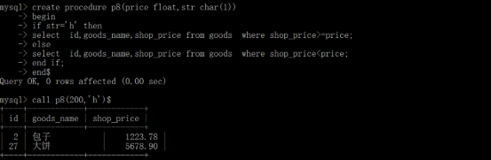

- [**一、存储过程补充**](#一存储过程补充)
  - [**7、创建复杂的存储过程**](#7创建复杂的存储过程)
- [**三、存储函数**](#三存储函数)
  - [**1、自定义函数**](#1自定义函数)
    - [**（1）定义语法**](#1定义语法)
    - [**（2）调用**](#2调用)
  - [**2、系统函数**](#2系统函数)
- [**五、触发器**](#五触发器)
  - [**1、简介**](#1简介)
  - [**2、触发器四要素**](#2触发器四要素)
  - [**3、创建触发器**](#3创建触发器)
    - [综合update案例](#综合update案例)
  - [**4、删除触发器**](#4删除触发器)
  - [**5、查看触发器**](#5查看触发器)
  - [**6、before和after的区别**](#6before和after的区别)
- [**六、事务操作**](#六事务操作)
- [**七、读写分离（主从复制）**](#七读写分离主从复制)
  - [**1、什么是主从复制**](#1什么是主从复制)
  - [**2、实现原理**](#2实现原理)
  - [**3、账号(用户)管理**](#3账号用户管理)
    - [**（1）添加账号（用户）**](#1添加账号用户)
    - [**（2）删除账号**](#2删除账号)
  - [**4、bin-log开启操作**](#4bin-log开启操作)
    - [**（1）开启bin-log日志，**](#1开启bin-log日志)
    - [**（2）与log-bin日志相关的函数，**](#2与log-bin日志相关的函数)
    - [**（3）查看log-bin日志里面的内容**](#3查看log-bin日志里面的内容)
- [**七、具体的配置步骤**](#七具体的配置步骤)
  - [**1、配置主服务器**](#1配置主服务器)
  - [**2、配置从服务器**](#2配置从服务器)
  - [**3、测试主从复制**](#3测试主从复制)
  - [**4、撤销从服务器**](#4撤销从服务器)
- [**三、实现读写分离**](#三实现读写分离)
  - [**1、通过业务逻辑来实现读写分离**](#1通过业务逻辑来实现读写分离)
  - [**2、TP框架里面实现读写分离**](#2tp框架里面实现读写分离)


# <a name="_toc459046545"></a><a name="_toc532138746"></a>**一、存储过程补充**
...
## <a name="_toc459046551"></a><a name="_toc532138751"></a>**7、创建复杂的存储过程** 
案例1，体会“控制结构”;

定义一个存储过程，有两个参数，第一个参数是价格，第二个参数是一个字符串，

如果该字符串等于’h’ 则就取出大于该价格（第一个参数）商品数据，其他则输出小于该价格的商品；
```sql
create procedure p8(price float,str char(1))

begin

`	`if str='h' then

`	`select  id,goods\_name,shop\_price from goods  where shop\_price>=price;

`	`else

`	`select  id,goods\_name,shop\_price from goods  where shop\_price<price;

`	`end if;

end$
```




**案例2：带有输出参数的存储过程**
```sql
create procedure p9(in num int,out res int)

begin

`	`set  res = num*num;

end$
```
注意：在调用具有输出参数的存储过程时，要使用一个变量来接收。


```sql
call p9(8,@res);select @res;
```


案例3：**带有输入输出参数的存储过程**
```sql
create procedure p10(inout num int)

begin

`	`set   num=num\*num;

end$

注意：在调用时先创建一个变量，调用存储过程时，使用该变量接收。

set @a = 10;call p10(@a);select @a$
```


# <a name="_toc459046554"></a><a name="_toc532138753"></a>**三、存储函数**
存储函数就是函数
## <a name="_toc459046555"></a><a name="_toc532138754"></a>**1、自定义函数** 
### <a name="_toc532138755"></a>**（1）定义语法** 
```sql
create function 函数名(参数) returns 返回值类型

begin 

`	`//代码

end 
```


说明：

（1）函数内部可以有各种编程语言的元素：变量，流程控制，函数调用；

（2）函数内部可以有增删改等语句！

**（3）但：函数内部不可以有select（或show或desc）这种返回结果集的语句！**
### <a name="_toc459046556"></a><a name="_toc532138756"></a>**（2）调用** 
跟系统函数调用一样：任何需要数据的位置，都可以调用该函数。

案例1：返回两个数的和
```sql
create function sumhe(num1 int,num2 int) returns int

begin

`	`return num1+num2;

end$
```


案例2：定义一个函数，返回1到n的和。
```sql
create function nhe(n int)  returns int

begin

`	`declare i int default 1;

`	`declare s int default 0;

`	`while i<=n do 

`		`set s=s+i;

`		`set i=i+1;

`	`end while;

`	`return s;

end$
```


注意点：创建的函数，是隶属于数据库的，只能在创建函数的数据库中使用。

`select nhe(345)$`
## <a name="_toc459046557"></a><a name="_toc532138757"></a>**2、系统函数** 
（1）数字类

mysql> select rand();//返回0到1间的随机数

mysql>select \* from it\_goods  **order by rand()** limit 2;//随机取出2件商品

    --- order by rand() 代表随机排序 --含2步：1. 先给每行记录增加个随机数列 2. 然后根据这个每行的随机数进行排序 （默认ASC从小到大）


mysql>select  floor(3.9)//输出3 

mysql>select  ceil(3.1)//输出4 

mysql>select  round(3.5)//输出4四舍五入

select goods\_name,round(shop\_price) from goods limit 10;


（2）大小写转换

mysql> select ucase('I am a boy!') //    --转成大写

mysql> select lcase('I am a boy!') //    --转成小写


3）截取字符串

mysql> select left('abcde',3)//			--从左边截取

mysql> select right('abcde',3) //        --从右边截取

mysql> select substring('abcde',2,3)//   --从第二个位置开始，截取3个，位置从1开始

select left(goods\_name,1),round(shop\_price) from goods limit 10


**mysql> select concat(10,':锄禾日当午')//**   --字符串相连


select concat(left(goods\_name,1),'...'),round(shop\_price) from goods limit 10;

mysql> select coalesce(null,123); 

**coalesce(str1,str2)：如果第str1为null，就显示str2** 

select goods\_name,coalesce(goods\_thumb,'无图')from goods limit 10;


mysql> select length('锄禾日当午') //   输出10   显示字节的个数

mysql> select char\_length('锄禾日当午') // 输出5   显示字符的个数

mysql> select length(trim('  abc  ')) //  trim用来去字符串两边空格

mysql> select replace('abc','bc','pache')//   将bc替换成pache 


（4）时间类

mysql> select unix\_timestamp()//      --时间戳


mysql> select from\_unixtime(unix\_timestamp()) //  --将时间戳转成日期格式 

from\_unixtime(unix\_timestamp(),'%Y-%m-%d-%h-%i-%d')


mysql>select  curdate();返回今天的时间日期： 

mysql> select now()//					--取出当前时间


案例1：比如一个电影网站，求出今天添加的电影；在添加电影时，有一个添加的时间戳。

select  id,title  from dede\_archives where   (from\_unixtime(添加时间,'%Y-%m-%d')=curdate());


案例2：比如一个电影网站，求出**昨天**添加的电影；在添加电影时，有一个添加的时间戳。

扩展，如何取出昨天或者指定某个时间的电影：

date\_sub

基本用法：

date\_sub(时间日期时间,interval 数字  时间单位) 

说明：

（1）时间单位：可以是year month day hour minute second 

（2）数字：可以是正数和负数。

比如：取出昨天的日期：

**mysql> select date\_sub(curdate(),interval 1 day);**

比如：取出上一个月日期：

**mysql> select date\_sub(curdate(),interval 1 month);**

如下案例是：求出前第2天添加的电影数据

select  id,title,from\_unixtime(add\_time,'%Y-%m-%d') from movie where   (from\_unixtime(add\_time,'%Y-%m-%d'))=date\_sub(curdate(),interval 2 day);


# <a name="_toc459046558"></a><a name="_toc532138758"></a>**五、触发器**
## <a name="_toc459046559"></a><a name="_toc532138759"></a>**1、简介** 
（1）触发器是一个特殊的存储过程，它是MySQL在insert、update、delete的时候自动执行的代码块。

（2）触发器必须定义在特定的表上。

（3）自动执行，不能直接调用，

**作用：监视某种情况并触发某种操作。** 

触发器的思路：

监视it\_order表，如果it\_order表里面有增删改的操作，则自动触发it\_goods里面里面增删该的操作。

比如新添加一个订单，则it\_goods表，就自动减少对应商品的库存。

比如取消一个订单，则it\_goods表，就自动增加对应商品的库存减少的库存。


## <a name="_toc459046560"></a><a name="_toc532138760"></a>**2、触发器四要素**


监视地点：就是设置监视的表

监视事件；设置监视的那张表的insert ,update,delete操作；

触发时间：设置触发时间，监视表的操作之前，还是之后；

触发事件：满足条件了，设置的触发的操作；

准备测试数据；


## <a name="_toc459046561"></a><a name="_toc532138761"></a>**3、创建触发器** 
创建触发器的语法：
```sql
create  trigger  trigger\_name 

after/before  insert /update/delete  on   表名

for each row 

begin 

sql语句：（触发的语句一句或多句）

end 
```
**案例1：第一个触发器，购买一头猪，减少1个库存。** 

分析：

监视地点：it\_order表

监视事件：it\_order表的insert 操作；

触发时间：it\_order表的insert 操作之后

触发事件：it\_goods表猪的库存减1操作；
```sql
create  trigger  t1

after   insert  on  it\_order

for each row

begin

update it\_goods set goods\_number=goods\_number-1 where id=1;

end$
```


注意：以上触发器是有问题的， 无论买谁，都是减少的猪的数量，而且数量是1，

案例2：购买商品，减少对应库存 
```sql
create  trigger  t1

after   insert  on it\_order

for each row

begin

update it\_goods set goods\_number=goods\_number-new.much where id=new.goods\_id;

end$
```
注意：如果在触发器中引用行的值。

对于insert 而言，新增的行用new来表示，行中的每一列的值，用  new.列名 来表示。


测试结果


特别注意：


**案例3：**取消订单时，减掉的库存要添加回来 

分析：

监视地点：it\_order表

监视事件：it\_order表的delete操作；

触发时间：it\_order表的delete操作之后

触发事件：it\_goods表减掉库存再加回来；

注意：

对于delete而言，it\_order表删除的行用old来表示，行中的每一列的值，用 old.列名 来表示。
```sql
create  trigger  t2

after   delete  on  it\_order

for each row

begin

update it\_goods set goods\_number=goods\_number+old.much where id=old.goods\_id;

end$
```


案例4：修改订单时，库存也要做对应修改(修改的数据，有商品的数量，类型)

分析：

注意：

对于update而言：

**old就是对同一个订单id 修改之前的旧数据，new就是对该订单修改之后的新数据，-------所以只要你修改数据，一定会是同一个修改的订单id对应old和new两类值**

思路：如何完成修改订单，触发it\_goods表的操作，

（1）取消订单

（2）重新下单
```sql
create  trigger  t3

after   update  on  it\_order

for each row

begin
-- old就是对某一条订单 修改之前的旧数据，new就是对该订单修改之后的新数据

update it\_goods set goods\_number=goods\_number+old.much where id=old.goods\_id;

update it\_goods set goods\_number=goods\_number-new.much where id=new.goods\_id;

end$
```


### 综合update案例

```SQL
-- 创建触发器：当订单被修改后，同步调整库存
DELIMITER $
CREATE TRIGGER after_order_update
AFTER UPDATE ON it_orders
FOR EACH ROW  -- 每一行修改都触发
BEGIN
  -- 情况1：如果修改的同一个商品id即订单id对应的商品id没变，只调整数量
  IF OLD.goods_type = NEW.goods_type THEN
    -- 库存调整量 = 原数量 - 新数量（正数为库存增加，负数为减少）
    UPDATE it_goods
    -- 其实这种写法与下面的old与new单独写成2行，是一样的效果
    SET stock = stock + (OLD.num - NEW.num)
    WHERE goods_id = NEW.goods_id AND goods_type = NEW.goods_type;
  
  -- 情况2：如果修改的不是同一个商品id即调整了该订单对应的商品id，先退回原类型库存，再扣减新类型库存


  ELSE
    -- 1. 原类型库存增加（退回原数量）
    UPDATE it_goods
    SET stock = stock + OLD.num
    WHERE goods_id = OLD.goods_id AND goods_type = OLD.goods_type;
    
    -- 2. 新类型库存减少（扣减新数量）
    UPDATE it_goods
    SET stock = stock - NEW.num
    WHERE goods_id = NEW.goods_id AND goods_type = NEW.goods_type;
  END IF;
END $
DELIMITER ;
```

## <a name="_toc459046562"></a><a name="_toc532138762"></a>**4、删除触发器** 
语法：drop trigger 触发器的名称
## <a name="_toc459046563"></a><a name="_toc532138763"></a>**5、查看触发器** 
语法： show triggers 


## <a name="_toc459046564"></a><a name="_toc532138764"></a>**6、before和after的区别** 
after是先完成数据的增删改，再触发，触发器中的语句晚于监视的增删改，无法影响前面的增删该动作。

就类似于先吃饭，再付钱。

before是先完成触发，再增删改，触发的语句先于监视的增删改发生，我们有机会判断修改即将发生的操作。

就类似于先付钱，再吃饭

**before的典型案例**：对于已下的订单，进行判断，如果订单的数量>5，就认为是恶意订单，强制把所定的商品数量改成5 

分析：

监视的表 :it\_order

监视的事件：it\_order表的insert操作

触发的时间：it\_order表的insert操作之前

触发的事件：如果订单数量大于5，则改成5
```sql
create  trigger  t4

before   insert  on  it\_order

for each row

begin

`	`if new.much>5 then

`	`set new.much=5;

`	`end if;

end$
```

# <a name="_toc532138765"></a>**六、事务操作**

MySQL 事务主要用于处理操作量大，复杂度高的数据。比如说，在人员管理系统中，你删除一个人员，你即需要删除人员的基本资料，也要删除和该人员相关的信息，如信箱，文章等等，这样，这些数据库操作语句就构成一个事务！

在 MySQL 中只有使用了 Innodb 数据库引擎的数据库或表才支持事务。

事务处理可以用来维护数据库的完整性，保证成批的 SQL 语句要么全部执行，要么全部不执行。

事务用来管理 insert,update,delete 语句

事务特点：

**（1）原子性：**一个事务（transaction）中的所有操作，要么全部完成，要么全部不完成，不会结束在中间某个环节。事务在执行过程中发生错误，会被回滚（Rollback）到事务开始前的状态，就像这个事务从来没有执行过一样。

**（2）一致性**：在事务开始之前和事务结束以后，数据库的完整性没有被破坏。

**（3）隔离性：**数据库允许多个并发事务同时对其数据进行读写和修改的能力，隔离性可以防止多个事务并发执行时由于交叉执行而导致数据的不一致。

**（4）持久性：**事务处理结束后，对数据的修改就是永久的，即便系统故障也不会丢失。

语法：

BEGIN 开始一个事务

ROLLBACK 事务回滚

COMMIT 事务确认

$pdo  = new PDO('mysql:host=localhost;dbname=php70','xiaolong','123456');

$pdo->exec('set names utf8');

测试数据如下；


```php
$pdo->beginTransaction();//启动事务

$pdo->commit()提交事务

$pdo->rollback()回滚事务

$pdo  = new PDO('mysql:host=localhost;dbname=php69','root','root');

$pdo->exec('set names utf8');

$pdo->beginTransaction();

$res1 = $pdo->exec("insert into user values(null,'name3',12,'email1',1)");

$res2 = $pdo->exec("insert into user values(null,'name4',12,'email2',2))");

if(!$res1 || !$res2 ){

`	`$pdo->rollback();

}else {

`	`$pdo->commit();

}

echo 'ok';
```

# <a name="_toc477016872"></a><a name="_toc532138766"></a>**七、读写分离（主从复制）**
## <a name="_toc451441600"></a><a name="_toc477016873"></a><a name="_toc532138767"></a>**1、什么是主从复制**
至少两台数据库服务器，可以分别设置主服务器和从服务器，对主服务器的任何操作都会同步到从服务器上。


主要作用：

（1）分担压力

（2）备份数据
## <a name="_toc451441601"></a><a name="_toc477016874"></a><a name="_toc532138768"></a>**2、实现原理**
mysql中有一种日志，叫做bin日志（二进制日志），会记录下所有修改过数据库的sql语句。主从复制的原理实际是多台服务器都开启bin日志，然后主服务器会把执行过的sql语句记录到bin日志中，之后从服务器读取该日志，在从服务器再把bin日志中记录的sql语句同样的执行一遍。这样从服务器上的数据就和主服务器相同了。


实现读写分离使用的知识点

**（1）主从都要开启bin日志**

**（2）主服务器需要授权用户**

（3）具体的配置过程；
## <a name="_toc451441602"></a><a name="_toc477016875"></a><a name="_toc532138769"></a>**3、账号(用户)管理**
### <a name="_toc451441603"></a><a name="_toc477016876"></a><a name="_toc532138770"></a>**（1）添加账号（用户）**
语法：grant  权限  on 数据库.数据表  to  ‘用户名’@’ip地址’   identified  by ‘密码’

比如：

grant  all  on   \*.\*   to ‘xiaohei’@’%’  identified  by ‘1234’

注意：创建的用户信息，是保存在mysql库下面的user表里面的。

select user,host from mysql.user;


案例：

第一步：在window的虚拟主机里面，添加一个账号如下；


注意：mysql里面用户信息是存储到mysql库下面user表中，


第二步：在linu中里面使用window中新建的用户(xiaoqian)登录window中 mysql服务器。

mysql  -h192.168.1.10 –uxiaomei –p123456
### <a name="_toc451441604"></a><a name="_toc477016877"></a><a name="_toc532138771"></a>**（2）删除账号**
语法：drop  user  ‘用户名’@’ip地址’;


## <a name="_toc451441605"></a><a name="_toc477016878"></a><a name="_toc532138772"></a>**4、bin-log开启操作**
### <a name="_toc451441606"></a><a name="_toc477016879"></a><a name="_toc532138773"></a>**（1）开启bin-log日志，**
打开mysql的配置文件，

window下面    my.ini

linux下面      my.cnf

log-bin=mysql-bin

server-id=1

注意：修改完成mysql的配置后，要重启mysql服务，切记不需要重启apache,

注意：mysql里面数据表的存储位置，要看配置文件，


开启配置后，产生的二进制日志文件如下；


### <a name="_toc451441607"></a><a name="_toc477016880"></a><a name="_toc532138774"></a>**（2）与log-bin日志相关的函数，**
**flush logs**

执行该命令，就会产生一个新的log-bin日志


产生的文件如下；


**reset master;**

清空所有的log-bin日志，并产生一个新的log-bin日志


**show master status**

查看最后（新）的一个log-bin日志 


### <a name="_toc451441608"></a><a name="_toc477016881"></a><a name="_toc532138775"></a>**（3）查看log-bin日志里面的内容** 
新建一张表，测试log-bin日志是否记录增删改的sql语句


注意：使用mysql安装目录下面的bin目录下面**mysqlbinlog**命令，来查看日志内容。


语法：mysqlbinlog    --no-defaults     二进制日志的名称（全路径）

MySQL中二进制文件所在目录

/var/lib/mysql


注意：end\_log\_pos的理解，用于记录上一个 sql语句的结束，下一个sql语句 的开始位置


通过show master status命令，能查看到二进制文件里面最后一个pos位置。


# <a name="_toc451441609"></a><a name="_toc477016882"></a><a name="_toc532138776"></a>**七、具体的配置步骤**
实验规划，需要两台主机

第一台主机：ip地址  192.168.1.69      配置为master服务器

第二台主机：ip地址  192.168.1.70      配置为slave 服务器
## <a name="_toc451441610"></a><a name="_toc477016883"></a><a name="_toc532138777"></a>**1、配置主服务器**
（1）开启二进制日志。

（2）要设置一个server-id（作为一个服务器的编号，是唯一）  该值不能和从服务器相同。


**注意：在my.cnf配置文件里面，配置的区域在[mysqld]与[mysql]之间配置；**

**注意：配置完成后，要重启mysql服务**

（3）授权一个账号，让从服务器通过该账号读取log-bin日志里面的内容

grant  replication slave  on \*.\*  to 'xiongda'@'%' identified by '123456'

    --- 授予用户 replication slave 权限（这是 MySQL 主从复制中从库连接主库必需的权限，仅允许读取 binlog 用于同步，没有其他操作权限（如修改数据、删除表等），保证了安全性）


赋予从库权限账号，允许用户在主库上读取日志，也就是Slave机器读取File权限，

    ---- 只有当主库上存在涉及服务器文件操作的 SQL 语句，并且这些语句需要被从库同步执行时，从库连接主库的用户（如 xiongda）才需要 FILE 权限。
         典型场景包括：
         主库执行了 LOAD DATA INFILE 'xxx.txt' INTO TABLE ...（从服务器文件导入数据到表中）
         
         主库执行了 SELECT ... INTO OUTFILE 'xxx.txt'（将表数据导出到服务器文件）这些语句会被记录到主库的 binlog 中，
         
         当从库同步时，需要执行相同的文件操作，此时就要求从库连接用户具备 FILE 权限，否则会同步失败（报错 ERROR 1045 (28000): Access denied）。

grant FILE on \*.\* to 'xiongda'@'%' identified by '123456';


（4）记录主服务器里面的最新的二进制的名称和pos位置


注意：此时，就禁止对主服务器执行增删改的操作，一直到从服务器配置成功。
## <a name="_toc451441611"></a><a name="_toc477016884"></a><a name="_toc532138778"></a>**2、配置从服务器**
（1）开启二进制日志。

（2）要设置一个server-id  该值不能和主服务器的相同。


注意：配置好配置文件后，要重启mysql服务器；

（3）停止主从复制进程

执行，stop   slave  指令即可。

      --- STOP SLAVE 是 MySQL 中用于停止主从复制进程的指令，主要作用是暂停从库（Slave）对主库（Master）的数据同步操作

      开启从库的两个核心线程（IO 线程和 SQL 线程）


（4）开始配置: 用于告诉从库 “如何找到主库、用什么账号连接、从哪个位置开始同步数据”

配置的语法：
```SQL
change master to master_host=“主服务器的ip地址”,master_user=”授权用户的名称”,master_password=”授权用户的密码”,master_log_file=”二进制日志文件的名称”,master_log\_pos=记录的pos位置；

change master to master_host=”192.168.1.10”,master_user=’xiaogang’,master_password=’123456’,master_log_file=”mysql-bin.000001”,master_log_pos=611
```


（5）开启从服务器

执行start slave指令即可。


开启从库的两个核心线程（IO 线程和 SQL 线程）

（6）查看是否配置成功

执行show slave status;


Slave\_IO\_Running:Yes 

此进程负责从服务器从主服务器上读取binlog 日志，并写入从服务器上的中继日志。 

Slave\_SQL\_Running:Yes 

此进程负责读取并且执行中继日志中的binlog日志， 

注：以上两个都为yes则表明成功，只要其中一个进程的状态是no，则表示复制进程停止，错误原因可以从”last\_error”字段的值中看到。

## <a name="_toc451441612"></a><a name="_toc477016885"></a><a name="_toc532138779"></a>**3、测试主从复制**
在主服务器创建一个新库，并添加一张新表，并插入新数据，


在从服务器上面查看是否有该库，该表，该记录。


## <a name="_toc451441613"></a><a name="_toc477016886"></a><a name="_toc532138780"></a>**4、撤销从服务器**
在**从服务器**上执行如下两个指令。

（1）stop slave:（临时暂停）暂停从库的两个核心线程（IO 线程和 SQL 线程），但保留所有复制配置信息和中继日志。

（2）reset slave all：（完全重置）不仅停止复制进程，还会彻底清除从库的所有复制相关配置和状态信息（MySQL 5.7+ 新增，替代旧版本的 reset slave）。


# <a name="_toc451441614"></a><a name="_toc477016887"></a><a name="_toc532138781"></a>**三、实现读写分离**
## <a name="_toc451441615"></a><a name="_toc477016888"></a><a name="_toc532138782"></a>**1、通过业务逻辑来实现读写分离**
```PHP
class  mysql{

`	`$dbm=主服务器 

`	`$dbs1=从服务器 

`	`$dbs2=从服务器 

`	`public function query(){

`	   `在query里面进行语句判断，分析连接不同的mysql服务器。 

`	`}

} 
```
## <a name="_toc451441616"></a><a name="_toc477016889"></a><a name="_toc532138783"></a>**2、TP框架里面实现读写分离**
具体的步骤：

（1）通过mysql授权账号，

注意：授权的账号，是给php代码连接的。

主服务器：192.168.1.69的主机授权账号如下：


从服务器：192.168.1.70的主机授权账号如下：


（2）步骤TP框架里面配置文件


（3）在TP里面，测试读写分离的配置，

db()->query('select \* from user');

db()->execute('insert into user values(3,"xiaolong")')


