# 品优购电商项目02

- [品优购电商项目02](#品优购电商项目02)
- [六、RBAC权限管理](#六rbac权限管理)
  - [1、RBAC概念和原理](#1rbac概念和原理)
  - [2、数据表设计](#2数据表设计)
  - [3、表之间的关系](#3表之间的关系)
  - [4、模拟数据](#4模拟数据)
  - [5、创建模型](#5创建模型)
- [七、权限管理](#七权限管理)
  - [1、权限列表](#1权限列表)
    - [1.1 无限级分类列表](#11-无限级分类列表)
    - [1.2 父子级树状列表](#12-父子级树状列表)
  - [2、权限详情](#2权限详情)
  - [3、权限新增](#3权限新增)
  - [4、权限修改](#4权限修改)
  - [5、权限删除](#5权限删除)
  - [6、菜单权限列表](#6菜单权限列表)
- [八、角色管理](#八角色管理)
  - [1、角色列表](#1角色列表)
  - [2、角色详情](#2角色详情)
  - [3、角色新增](#3角色新增)
  - [4、角色修改](#4角色修改)
  - [5、角色删除](#5角色删除)


# 六、RBAC权限管理

## 1、RBAC概念和原理

RBAC：全称叫做Role-Based Access Control，中文翻译叫做基于角色的访问控制。其主要的作用是实现项目的权限控制。

效果：让不同的管理员，能够访问的页面不一样。比如运营人员 只能看到运营相关模块。财务人员只能看到财务相关模块。

传统权限管理：

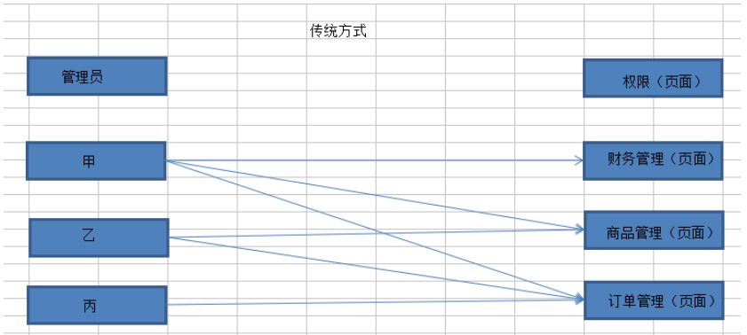

RBAC权限管理：

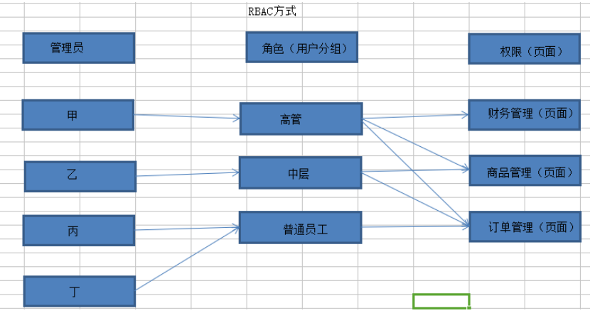

RBAC权限管理：

权限的管理相对规范，角色拥有的权限可以按照一定标准定义好。

新增管理员，只需要指定角色，即可拥有对应的权限。


## 2、数据表设计

基本数据表：管理员表、角色表、权限表，共3种表

- 关系分析：
  - 管理员和角色的关系，市面上有2种做法，第1种是（多对1：1个管理员就只属于1个角色，1个角色有多个管理员的）。第2种是 （多对多：1个管理员可以对应多个角色，1个角色也可以对应多个管理员）。
    - 一般常见的都是一个管理员只能对应一个角色，如极库云你只能是开发者，或者是运营人员或测试人员。---- 多对1的关系
  - 角色和权限：多对多的关系
- 限定关系：管理员与角色是多对1，角色与权限是多对多。
- 对应关系的表维护分2种：
  - 第一种：三表结构，在管理员表增加角色id字段，在角色表增加权限ids字段，最终三张表。
    - 是增加字段，存多值方法，简单但查询效率低，特点是权限角色每列多值的（当查该权限多少人需要解析字段进行遍历麻烦）
  - 第二种：五表结构，新增一张管理员角色关联表，新增一张角色权限关联表。最终五张表。
    - 新增关联表，查询效率高，特点是权限角色一定都是每列单值的。

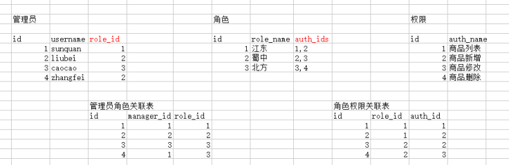  

RBAC常用的表结构：3表结构和5表结构，我们选择用3表结构实现限定的表关系。这里以三表结构为例：

- 查询一个管理员拥有的权限步骤：
  - 先查询管理员表，获取到角色id
  - 再查询角色表，获取到拥有的权限ids
  - 最后根据权限ids查询权限表，where id in（1,2,3）

 

特殊情况：超级管理员 拥有所有的权限。

设置 超级管理员的角色id为1，超级管理员拥有的权限，直接查询权限表所有的数据。

## 3、表之间的关系

管理员表pyg_admin 中的role_id 字段  对应  角色表pyg_role表主键id字段

角色表pyg_role中的role_auth_ids字段  对应 权限表pyg_auth表主键id字段多个值

 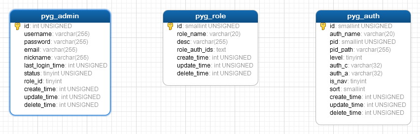 

## 4、模拟数据

管理员表、角色表和权限表都有一些默认的模拟数据

- 权限字段
| id        | 权限id                              |
| auth_name | 权限名称                            |
| pid       | 父id                                |
| pid_path  | 家族图谱（祖先id_父id）,示例：0_1_2 |
| auth_c    | 控制器名称                          |
| auth_a    | 方法名称                            |
| is_nav    | 是否菜单权限 1是  0否     （：将菜单权限与功能权限都写在一起了，用is_nav区分）          |
| level     | 级别 0 1 2 3 ， 0为最顶级           |
| son       | 子权限数据集  

## 5、创建模型

- 共创建3张表，3表结构

```php
php think make:model common/Role
php think make:model common/Auth
php think make:model common/Admin
```

#  七、权限管理

> 前置信息了解见：`../资料/接口文档.md`

下面都是直接创建接口的一些步骤

## 1、权限列表

- 权限列有3种格式：普通列表，无限极分类，父子级嵌套结构
  - 根据参数返回2种不同的层级格式
    - type为tree时：返回父子层级嵌套树结构（如用于角色的管理curd：增删改角色时勾选权限时的树列表呈现）
    - 否则返回无限极分类扁平层级结构：用于权限的管理curd：权限增删改列表展示
- 创建权限接口，及对应控制器

### 1.1 无限级分类列表


1.1.1 步骤：

定义路由

创建控制器方法

接收参数

查询数据

无限级分类列表

返回数据

1.1.2 实现：

定义路由

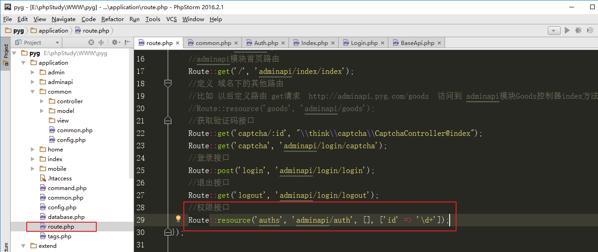

创建控制器方法

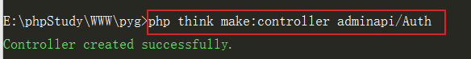 

接收参数

查询数据

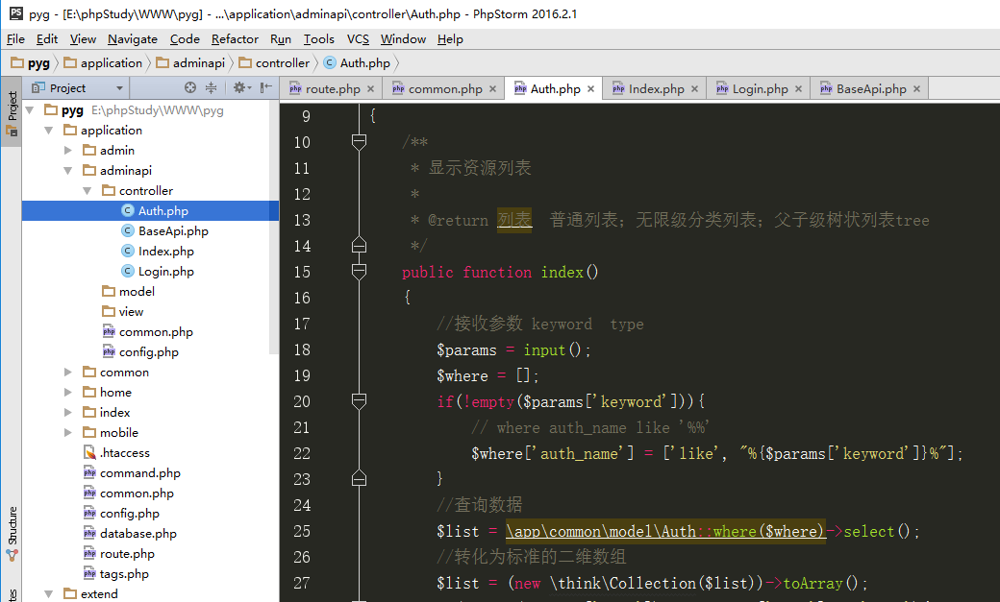

无限级分类列表

返回数据

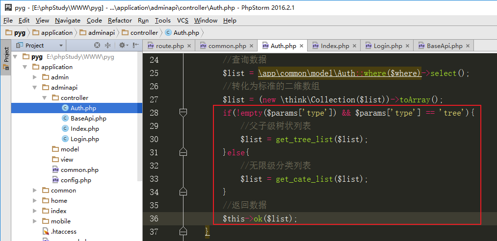

### 1.2 父子级树状列表

见1.1 中 对$params['type']的判断


## 2、权限详情

步骤：

定义路由（已定义资源路由）

创建控制器方法

查询数据

返回数据


实现：

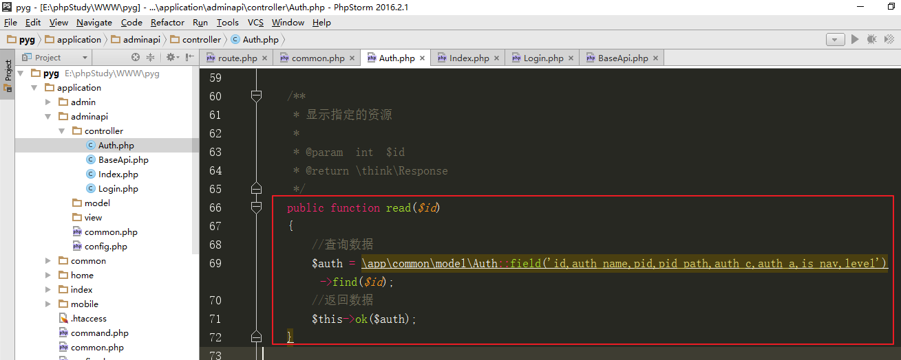

## 3、权限新增

步骤：

定义路由（已定义资源路由）

创建控制器方法

接收数据

参数检测

添加数据（是否顶级，级别和pid_path处理）

返回数据

实现：

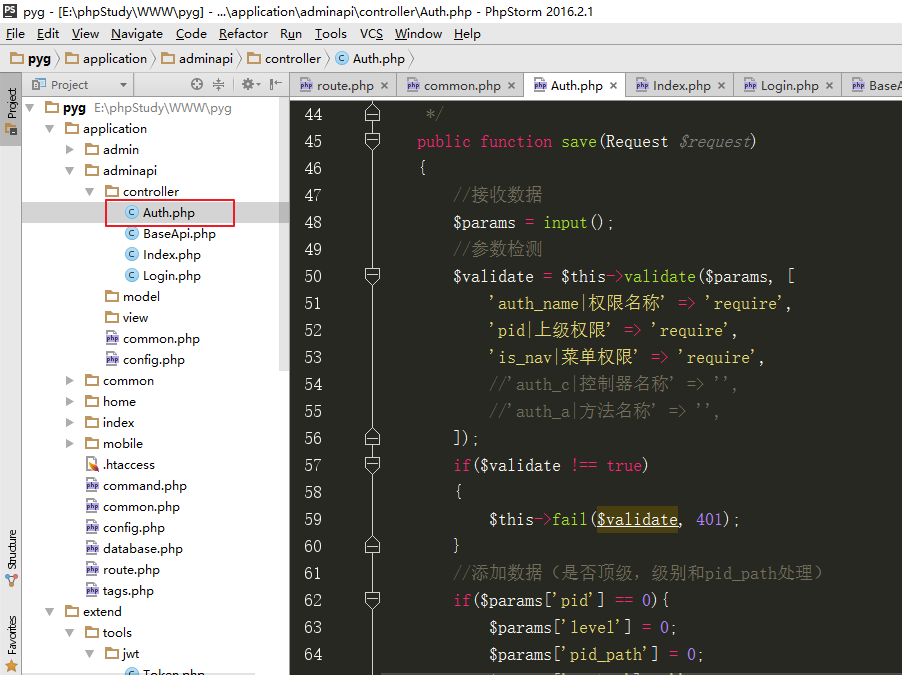

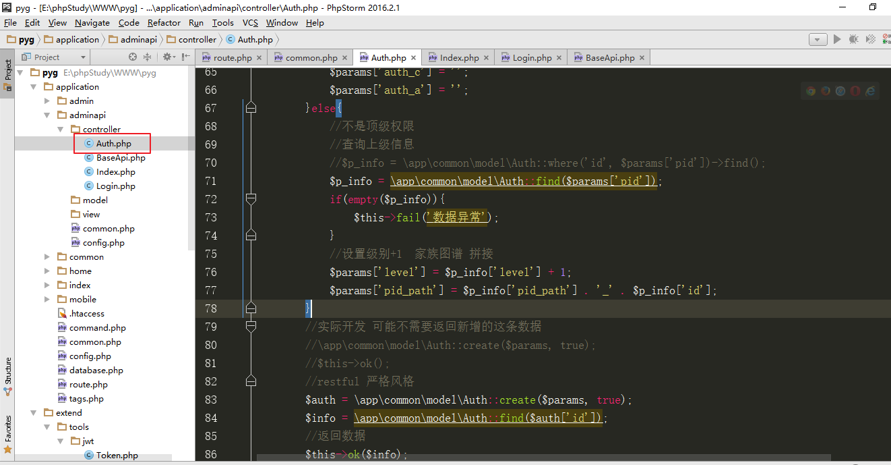

##  4、权限修改

定义路由（已定义资源路由）

创建控制器方法

接收数据

参数检测

修改数据（是否顶级，级别和pid_path处理）

返回数据


实现：

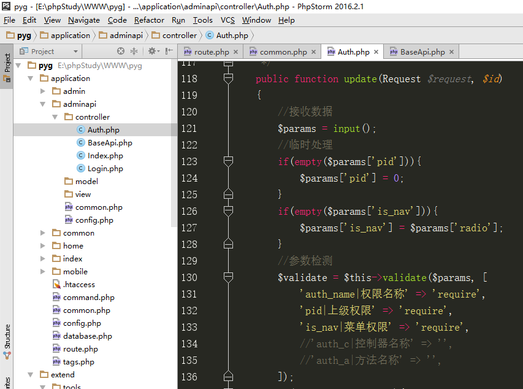

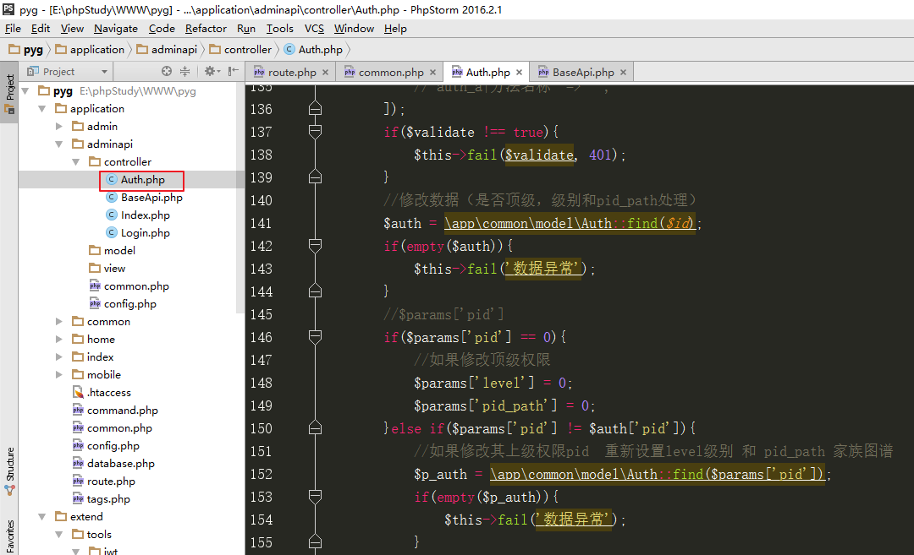

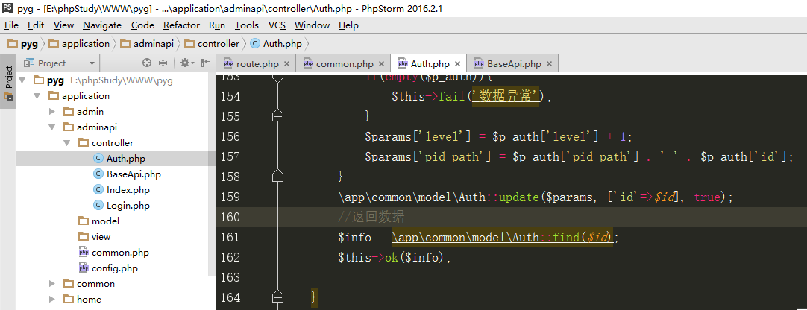

## 5、权限删除

定义路由（已定义资源路由）

创建控制器方法

权限下是否有子权限

删除数据

返回数据


实现：

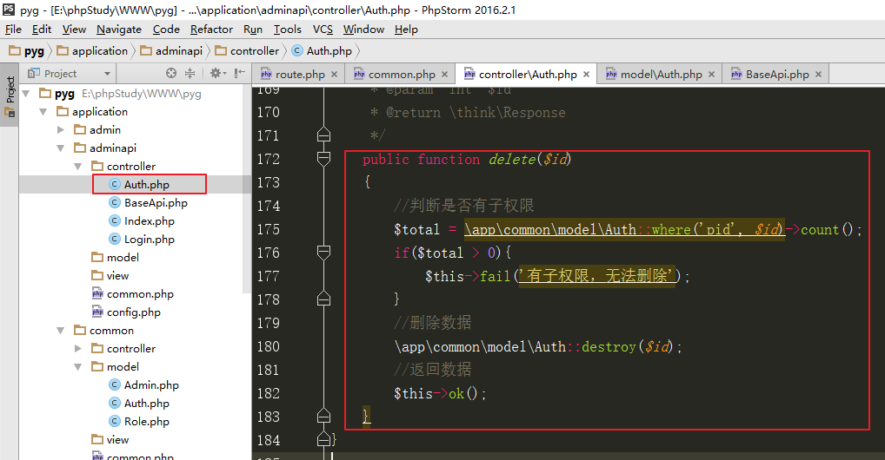

## 6、菜单权限列表

定义路由

创建控制器方法

获取当前管理员的角色id

查询权限:

超级管理员： role_id == 1 ，直接查询权限表

普通管理员： role_id !=1,  查询角色表，获取role_auth_ids字段，根据role_auth_ids值，查询权限表，使用where id in (1,2,3)条件

菜单权限： is_nav = 1

父子级树状列表

返回数据


实现：

定义路由

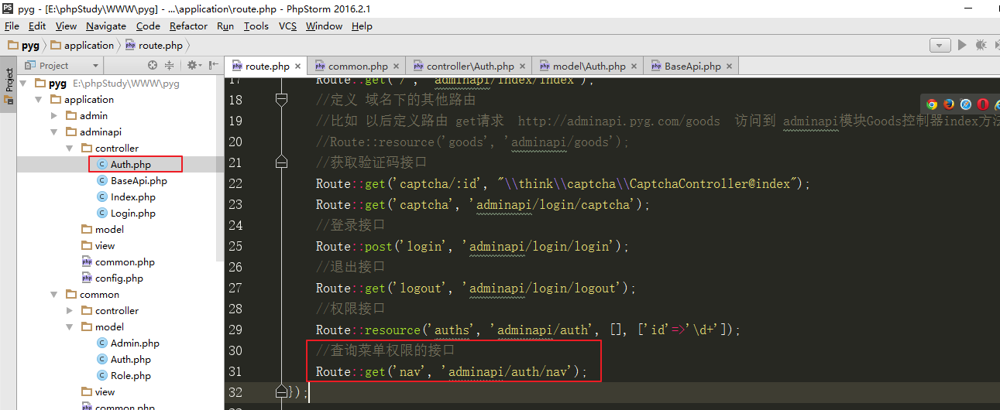

创建控制器方法

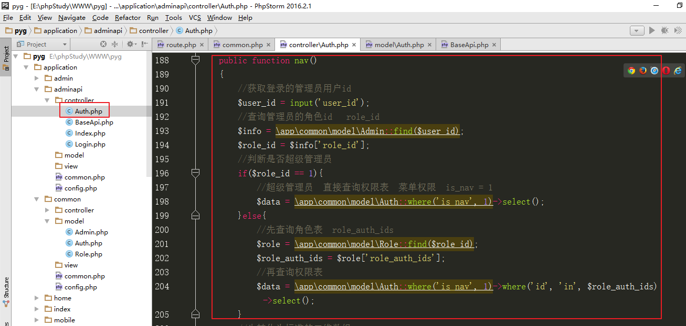

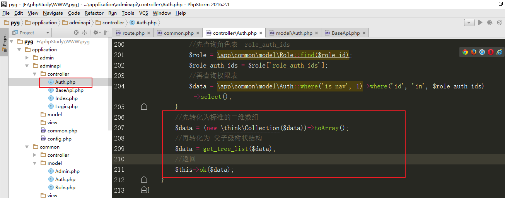

# 八、角色管理

## 1、角色列表

定义路由

创建控制器方法

查询数据

返回数据


实现：

定义路由

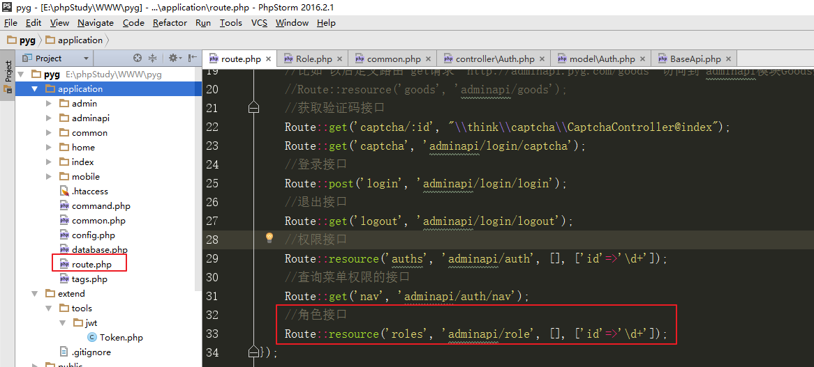

创建控制器方法

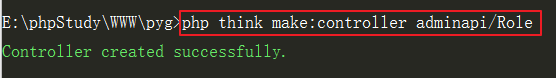 

查询数据

返回数据

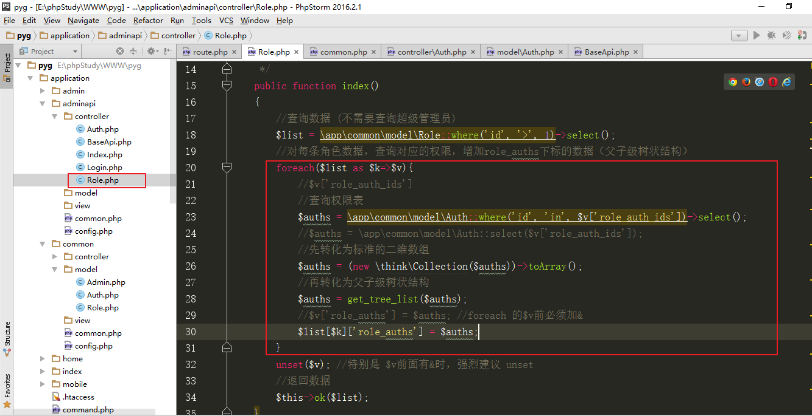

## 2、角色详情

定义路由（已定义）

创建控制器方法（已创建）

查询数据

返回数据


实现：

查询数据

返回数据

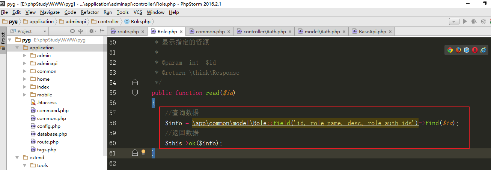

## 3、角色新增

定义路由（已定义）

创建控制器方法（已创建）

接收数据

参数检测

添加数据

返回数据

实现：

接收数据、参数检测、添加数据、返回数据

参数检测

添加数据

返回数据


## 4、角色修改

定义路由（已定义）

创建控制器方法（已创建）

接收数据

参数检测

修改数据

返回数据

实现：

接收数据、参数检测、修改数据、返回数据

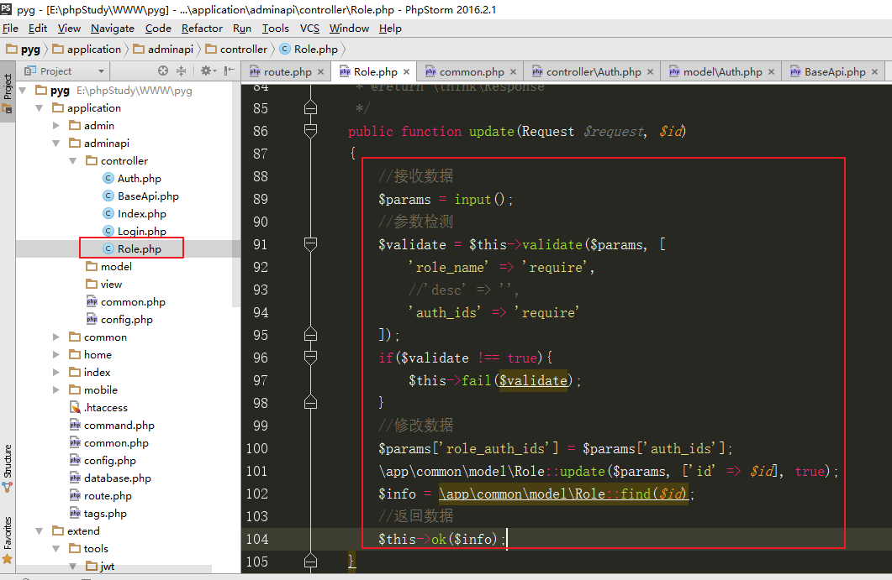

## 5、角色删除

定义路由（已定义）

创建控制器方法（已创建）

删除数据

返回数据

实现：删除数据、返回数据

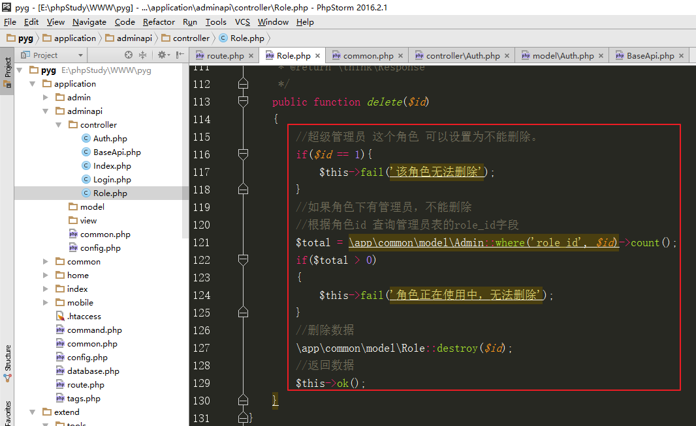