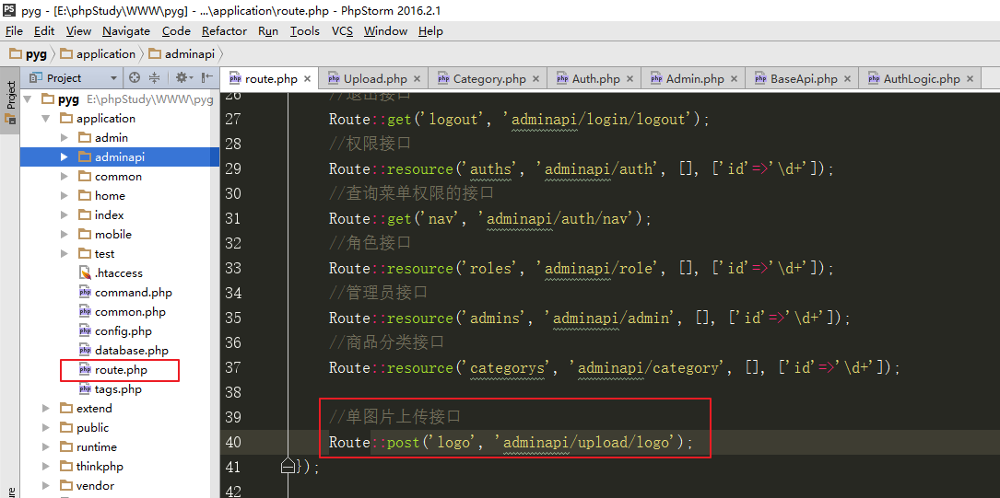

- [九、管理员管理](#九管理员管理)
  - [1、管理员列表](#1管理员列表)
  - [2、管理员详情](#2管理员详情)
  - [3、管理员新增](#3管理员新增)
  - [4、管理员修改](#4管理员修改)
  - [5、管理员删除](#5管理员删除)
- [十、权限检测](#十权限检测)
- [十一、商品相关数据表](#十一商品相关数据表)
  - [1、商品分类、商品品牌、商品、商品相册](#1商品分类商品品牌商品商品相册)
  - [2、商品、商品模型、商品属性](#2商品商品模型商品属性)
  - [3、商品、商品模型、商品SKU](#3商品商品模型商品sku)
  - [4、商品相关整体](#4商品相关整体)
- [十二、商品分类管理](#十二商品分类管理)
  - [1、商品分类列表](#1商品分类列表)
  - [2、商品分类详情](#2商品分类详情)
  - [3、商品分类新增](#3商品分类新增)
  - [4、商品分类修改](#4商品分类修改)
  - [5、商品分类删除](#5商品分类删除)
- [十三、文件上传](#十三文件上传)
  - [1、单图片上传](#1单图片上传)

#  九、管理员管理

## 1、管理员列表

定义路由

创建控制器方法

查询数据

返回数据

实现：

定义路由

创建控制器 继承BaseApi

 

 

查询数据

  

角色名称处理：连表查询

## 2、管理员详情

定义路由

创建控制器方法

查询数据

返回数据

 

## 3、管理员新增

定义路由

创建控制器方法

接收数据

参数检测

- require|unique:admin：唯一性验证，检查 admin 表中 username 字段是否已存在

添加数据

返回数据

实现：

## 4、管理员修改

定义路由

创建控制器方法

接收数据

参数检测

修改数据

返回数据

实现：

基本信息修改

重置密码： 修改以上的代码如下：

## 5、管理员删除

删除数据

返回数据

实现：不能删除超级管理员，不能删除自己

 

# 十、权限检测

管理员登陆后，访问每个页面时，需要进行权限检测：

判断当前管理员是否拥有当前访问页面的权限。

 

原理：

查询当前管理员所拥有的权限 role_auth_ids

查询到当前访问页面对应的权限id( 控制器名称和方法名称为条件)

判断权限id  和 role_auth_ids ，是否拥有当前页面访问权限

 

特殊情况：

超级管理员不需要检测；

所有管理员 都可以访问的页面，不需要检测(比如首页)。

 

思路：

判断是否特殊页面（比如首页，不需要检测）

获取到管理员的角色id

判断是否超级管理员（超级管理员不需要检测）

查询当前管理员所拥有的权限ids（从角色表查询对应的role_auth_ids）

根据当前访问的控制器、方法查询到具体的权限id

判断当前权限id是否在role_auth_ids范围中。

实现：

将权限检测的逻逻辑 封装到 application/adminapi/logic/AuthLogic.php 中

有权限访问，返回true，没有权限 返回false

 

在application/adminapi/controller/BaseApi.php中 登录之后 调用权限检测方法

 

封装的权限检测逻辑方法：

# 十一、商品相关数据表

所有数据表的关系设计首先都是基于需求场景和前端页面模块划分的,下面每个方块都是一张表

- 前端页面模块参考`./品优购商城项目操作指南.md`

## 1、商品分类、商品品牌、商品、商品相册

> 以商品表为入口分析,对应前端的商品列表页和商品搜索导航条

## 2、商品、商品模型、商品属性

> 以商品表为入口分析,对应前端的商品详情加购物车页面

- 上图中的商品属性即下图是商品属性：不支持选择的，不影响价格,在创建商品模型时就被确定下来了.

- 模型在后台页面中对应模型菜单,创建模型时包含规格名称和属性和对应规格值的3表和模型表值就确定下来了
  - 创建这个模型后,规格名单独存到规格名表pyg_spec,规格值单独存到规格值表pyg_spec_value,属性名单独存到pyg_attribute属性表,属性值默认不写,应该在创建商品spu时输入属性值(然后属性值直接存到商品spu表的goods_attr字段里)

## 3、商品、商品模型、商品SKU

对应前端的商品详情加购物车页面

> 以商品表为入口分析,整个后台系统的最复杂的一圈关系.

SPU： 最小产品单元，包含多种可选规格的某种商品的集合。iphone 6 就是一个SPU

SKU：最小库存单元，不可再拆分的产品。 32G的黑色的iphone6就是一个SKU

- 下图逻辑: 首先看商品spu表,创建一个商品spu时就会先选择对应商品模型表的id的,商品模型表对应id页面就会显示出规格名称的选择和属性的属性值输入框()
  - 当为当前商品选择具体的规格名后,下方自动算出该商品spu下可组合的所有sku记录
  - 对应(创建一个商品模型会包含规格名表和属性表.规格名表的type_id对应模型表的id),规格名会添加对应的规格值,规格值specid对应规格名表id.SKU规格商品表goodsid对应商品表id,sku规格商品表的valueids对应多个规格值的id.
  - 如一个商品详情页时,默认列出规格名称,当你选择具体规格后准备加到购物车,此时sku就含对应规格值
- 创建一个商品spu保存后,对应的下属的sku规格商品sku表就都自动创建好了
  - 后面购物车下单时你选择什么型号及什么具体价格其实都对应的是sku表的查询展示

## 4、商品相关整体

- 共9张表,完成商品相关的整体数据关系

# 十二、商品分类管理

## 1、商品分类列表

定义路由

创建控制器方法

查询数据

返回数据（无限级分类列表、普通列表）

type:list  普通模式
否则:无限极分类列表

实现：

列表1：无限级分类列表

定义路由

创建控制器方法

 

创建模型

 

查询数据、返回数据

列表2 : 普通列表

## 2、商品分类详情

定义路由

创建控制器方法

查询数据

返回数据

## 3、商品分类新增

定义路由

创建控制器方法

接收数据

参数检测

添加数据

返回数据

实现：

## 4、商品分类修改

定义路由

创建控制器方法

接收数据

参数检测

修改数据

返回数据

实现：

## 5、商品分类删除

删除数据

返回数据

实现： 分类下有子分类，不能删除

# 十三、文件上传

## 1、单图片上传

定义路由

创建控制器方法

图片上传

返回数据

实现：

定义路由

创建控制器方法 继承BaseApi

 

 

上传功能

创建保存图片的目录

 

上传代码

总结：

管理员 增删改查接口

权限检测

能够说清RBAC究竟是什么回事儿

商品相关数据表介绍

商品分类 增删改查（三级分类）

单图片上传接口