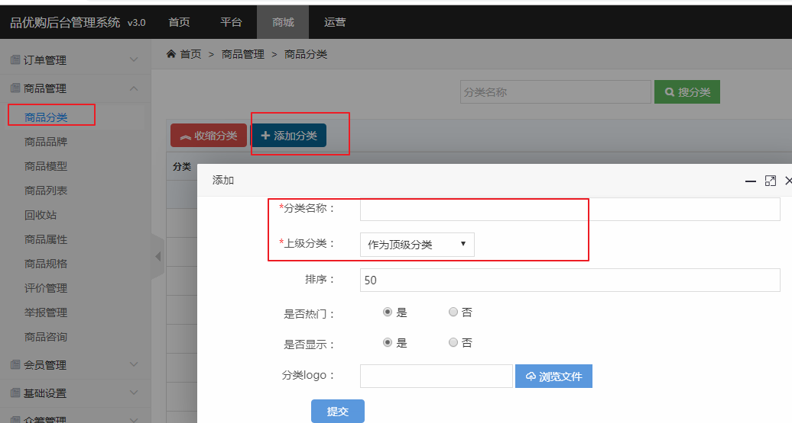

# 品优购商城项目后台操作指南

# 一、后台商品部分

添加分类（或使用已有测试数据）

添加品牌

添加模型（添加属性、规格）

添加商品（基本信息、选择分类、选择品牌、选择模型、关联属性值、关联规格值）

 

# 二、后台RBAC权限部分

添加权限

添加角色（或修改角色权限）

添加管理员（或修改管理员所属角色）

以后每增加一个权限，都需要重新给角色分配权限。否则除了超级管理员，其他 管理员无法访问刚新增的权限

