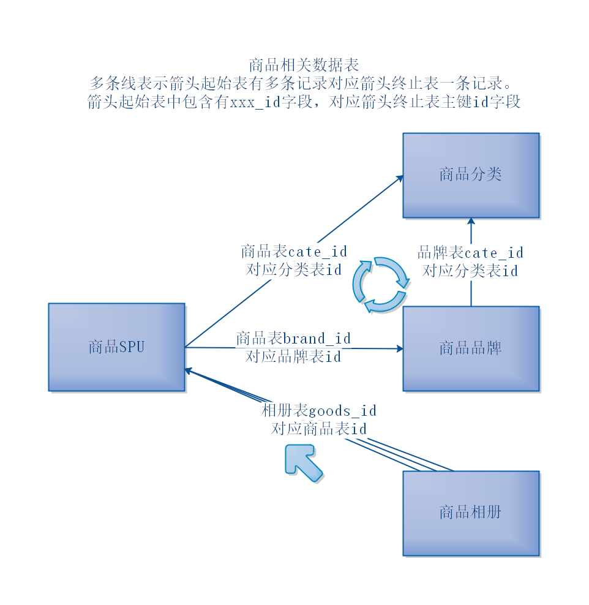
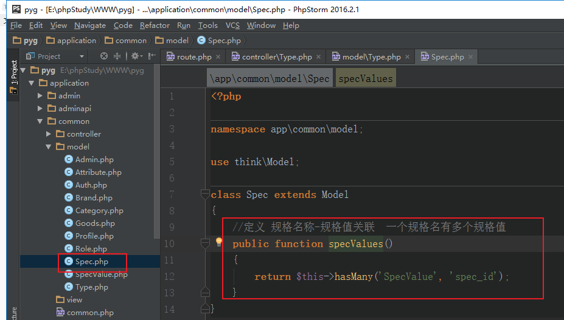

# 品优购电商项目04

- [品优购电商项目04](#品优购电商项目04)
- [商品相关数据表](#商品相关数据表)
  - [1、商品分类、商品品牌、商品、商品相册](#1商品分类商品品牌商品商品相册)
  - [2、商品、商品模型、商品属性](#2商品商品模型商品属性)
  - [3、商品、商品模型、商品SKU](#3商品商品模型商品sku)
  - [4、商品相关整体](#4商品相关整体)
- [十三、文件上传](#十三文件上传)
  - [2、多图片上传](#2多图片上传)
- [十四、商品品牌管理](#十四商品品牌管理)
  - [1、商品品牌列表](#1商品品牌列表)
  - [2、商品品牌详情](#2商品品牌详情)
  - [3、商品品牌新增](#3商品品牌新增)
  - [4、商品品牌修改](#4商品品牌修改)
  - [5、商品品牌删除](#5商品品牌删除)
- [十五、连表查询与关联模型](#十五连表查询与关联模型)
  - [1、连表查询join](#1连表查询join)
  - [2、一对一关联](#2一对一关联)
    - [1）1对1关联查询](#11对1关联查询)
    - [2）定义1对1的相互对应](#2定义1对1的相互对应)
  - [3、一对多关联](#3一对多关联)
    - [1）关联查询](#1关联查询)
    - [2）定义相对的关联](#2定义相对的关联)
  - [4、绑定属性到父模型](#4绑定属性到父模型)
- [十六、商品模型（类型）管理](#十六商品模型类型管理)
  - [1、商品模型列表](#1商品模型列表)
  - [2、商品模型详情](#2商品模型详情)
  - [3、商品模型删除](#3商品模型删除)
  - [4、商品模型修改（暂时不讲）](#4商品模型修改暂时不讲)
  - [5、商品模型新增（下一天讲）](#5商品模型新增下一天讲)


# 商品相关数据表

## 1、商品分类、商品品牌、商品、商品相册



## 2、商品、商品模型、商品属性


## 3、商品、商品模型、商品SKU

SPU： 最小产品单元，包含多种可选规格的某种商品的集合。iphone 6 就是一个SPU

SKU：最小库存单元，不可再拆分的产品。 32G的黑色的iphone6就是一个SKU


## 4、商品相关整体


| 表名             | 备注                |
| ---------------- | ------------------- |
| pyg_admin        | 后台管理员表        |
| pyg_role         | 后台角色表          |
| pyg_auth         | 后台权限表          |
| pyg_category     | 商品分类表          |
| pyg_brand        | 商品品牌表          |
| pyg_goods        | 商品表（SPU表）     |
| pyg_goods_images | 商品相册表          |
| pyg_attribute    | 商品属性表          |
| pyg_spec         | 商品规格名称表      |
| pyg_spec_value   | 商品规格值表        |
| pyg_spec_goods   | 规格商品表（SKU表） |
| pyg_cart         | 购物车表            |
| pyg_order        | 订单表              |
| pyg_order_goods  | 订单商品表          |
| pyg_pay_log      | 支付记录表          |
| pyg_user         | 前台用户表          |
| pyg_type         | 商品模型表          |
| pyg_address      | 收货地址表          |

# 十三、文件上传

## 2、多图片上传

定义路由

创建控制器方法

图片上传

返回数据

实现：

定义路由


创建控制器方法，上传图片


测试：


# 十四、商品品牌管理

修改数据表： 在mysql中执行以下命令，对品牌表的desc字段设置可以为空。

```mysql
ALTER TABLE `pyg_brand`
MODIFY COLUMN `desc`  text CHARACTER SET utf8 COLLATE utf8_general_ci NULL COMMENT '品牌描述' AFTER `logo`;
```

## 1、商品品牌列表

定义路由

创建控制器方法

查询数据

返回数据（分页+搜索列表、分类下的品牌列表）

实现：

定义路由


创建控制器方法

 

创建模型

 

分类下品牌、分页+搜索品牌列表


## 2、商品品牌详情

定义路由

创建控制器方法

查询数据

返回数据

实现：


## 3、商品品牌新增

定义路由

创建控制器方法

接收数据

参数检测

添加数据

返回数据

实现：

 


将商品分类新增接口中 也进行生成缩略图的处理。


## 4、商品品牌修改

定义路由

创建控制器方法

接收数据

参数检测

修改数据

返回数据

实现：

 


## 5、商品品牌删除

删除数据

返回数据

实现：品牌下有商品 则不让删除


# 十五、连表查询与关联模型

关联模型 见手册 - 模型 - 关联 （一对一关联，一对多关联，关联预载入）

## 1、连表查询join

需求：查询所有商品品牌信息及其所属的分类名称

```mysql
连表查询一个品牌以及分类名称
SELECT t1.*,t2.cate_name FROM `pyg_brand` t1 left join pyg_category t2 on t1.cate_id = t2.id where t1.id = 1;
连表查询所有品牌以及对应的分类名称
SELECT t1.*,t2.cate_name FROM `pyg_brand` t1 left join pyg_category t2 on t1.cate_id = t2.id;

```

对应框架中的代码：

```php
连表查询一个品牌以及分类名称
$info = \app\common\model\Brand::alias('t1')
            ->join('pyg_category t2', 't1.cate_id=t2.id', 'left')
            ->field('t1.*, t2.cate_name')
            ->where('t1.id', 1)
            ->find();
连表查询所有品牌以及对应的分类名称
$list = \app\common\model\Brand::alias('t1')
                ->join('pyg_category t2', 't1.cate_id=t2.id', 'left')
                ->field('t1.*, t2.cate_name')
                ->select();
```

转化为数组形式的结果：

```
$info = ['id' => 1, 'name' => '华为',..., 'cate_name'=>'手机']；

$list = [
 	['id' => 1, 'name' => '华为',..., 'cate_name'=>'手机']；
  	['id' => 2, 'name' => '小米',..., 'cate_name'=>'手机']；
];
```

**所有关联关系的查询都可以通过该章节的`连表查询join`去查询**

**如果你嫌麻烦代码过多,可以用下面章节是框架的模型提供了关联语句可以方便查**

- ThinkPHP 支持多种模型关联方式，比如：
  - hasOne（一对一
  - belongsTo（反向一对一）
  - hasMany（一对多）
  - belongsToMany（多对多）
  - 嵌套关联: 就是在这些基础上，继续加载关联模型中的关联。

## 2、一对一关联

新增管理员档案表pyg_profile，保存每个管理员的详细信息(身份证号、银行卡号)。

> 应用场景: 一般都放在一个表中字段过多一个管理员的基础信息,银行卡信息等,都是1个管理员都有自己独立对应的银行卡等字段,都是1对1对应,可以垂直分割拆成2个表
> 解法: 所有关联关系的查询都可以通过前面的`## 1、连表查询join`章节去查询,不过框架提供了关联语句

```mysql
CREATE TABLE `pyg_profile` (
  `id` int(11) unsigned NOT NULL AUTO_INCREMENT,
  `uid` int(11) NOT NULL DEFAULT '0' COMMENT '用户id',
  `idnum` varchar(30) DEFAULT NULL COMMENT '身份证号',
  `card` varchar(255) DEFAULT NULL COMMENT '银行卡号',
  `create_time` int(11) DEFAULT NULL,
  `update_time` int(11) DEFAULT NULL,
  `delete_time` int(11) DEFAULT NULL,
  PRIMARY KEY (`id`)
) ENGINE=InnoDB DEFAULT CHARSET=utf8;
```

添加测试数据

```mysql
INSERT INTO `pyg`.`pyg_profile` (`id`, `uid`, `idnum`, `card`, `create_time`, `update_time`, `delete_time`) VALUES ('1', '1', '232332198008083321', '421656421254789', '1520408547', '1520408547', NULL);
INSERT INTO `pyg`.`pyg_profile` (`id`, `uid`, `idnum`, `card`, `create_time`, `update_time`, `delete_time`) VALUES ('2', '2', '435332198108083312', '521656421254777', '1520408547', '1520408547', NULL);
INSERT INTO `pyg`.`pyg_profile` (`id`, `uid`, `idnum`, `card`, `create_time`, `update_time`, `delete_time`) VALUES ('3', '3', '655332198108083357', '681656421254787', '1520408547', '1520408547', NULL);
INSERT INTO `pyg`.`pyg_profile` (`id`, `uid`, `idnum`, `card`, `create_time`, `update_time`, `delete_time`) VALUES ('4', '4', '987067198208083734', '843123421257829', '1520408547', '1520408547', NULL);
INSERT INTO `pyg`.`pyg_profile` (`id`, `uid`, `idnum`, `card`, `create_time`, `update_time`, `delete_time`) VALUES ('5', '5', '657067198408083256', '753623421259523', '1520408547', '1520408547', NULL);
INSERT INTO `pyg`.`pyg_profile` (`id`, `uid`, `idnum`, `card`, `create_time`, `update_time`, `delete_time`) VALUES ('6', '6', '746067198608089463', '534623421259125', '1520408547', '1520408547', NULL);
INSERT INTO `pyg`.`pyg_profile` (`id`, `uid`, `idnum`, `card`, `create_time`, `update_time`, `delete_time`) VALUES ('7', '7', '745367198708089414', '514623426449165', '1520408547', '1520408547', NULL);

```

创建模型

```
php think make:model common/Profile
```

### 1）1对1关联查询

需求：查询管理员信息及其档案信息

(其实也可以直接用join连表查询)

①定义关联关系

档案表pyg_profile中的uid对应于管理员表中的id,管理员表为主表,档案表为从表.

以管理员表为主，一个管理员有一个档案，管理员模型中定义1对1关联关系：

```php
//定义管理员-档案关联关系
// 当前管理员表中
public function profile()
{
	return $this->hasOne('Profile', 'uid', 'id');
}
```

注：方法名，一般和关联的模型名对应，采用首字母小写的驼峰命名法。

方法表示:当前模型（Admin）有一个对应的 Profile 档案。Profile 表中有一个字段 uid，用于指向 Admin 表键 id

```Sql
// 框架中定义 一对一关系 的方法: 表示当前模型（比如 Admin）与 Profile 模型之间存在 一对一关系
return $this->hasOne(关联model，关联model的联系键，本model的联系键);
```

第二个参数，可选，默认为 本模型名_id

第三个参数，可选，默认为id


②查询数据

需求：查询管理员数据时，也要查询档案数据

控制器中

```php
$info = \app\common\model\Admin::with('profile')->find(1);
dump($info);
// object(app\common\model\Admin) {
//    'id' => 1,
//    'username' => 'admin',
//    'password' => '********',
//    'status' => 1,
//    'profile' => object(app\common\model\Profile) {
//        'id' => 1,
//        'admin_id' => 1,
//        'realname' => '张三',
//        'gender' => '男',
//        'age' => 28
//     }
// }
$data = \app\common\model\Admin::with('profile')->select();
dump($data);

// with('profile') 是 ThinkPHP 的 预载入关联（Eager Loading），用于避免 N+1 查询问题。它会在查询 admin 表的同时，把对应的 profile 数据也查出来，避免在循环中多次查询数据库。

// Bind处理: 让 profile 的字段直接出现在 Admin 对象上（如 $admin->realname），你可以使用 bind()
public function profile()
{
    return $this->hasOne('Profile')->bind(['realname', 'gender']);
}
```


1. $info->profile->idnum这是属性调用的方式,属性调用时会再次查表得到数据 
2. with带着profile表一起查出来


### 2）定义1对1的相互对应

Mysql中不支持1对1表之间的相互对应,只支持从表的外键对应,但可以通过left join实现类似效果,框架的相互对应应该也是这种原理

需求：支持反向查询,查询档案信息时顺带查出对应的管理员信息

档案表pyg_profile中的uid对应于管理员表中的id

以档案表为主，一个管理员有一个档案，管理员模型中定义关联关系：

```php
//定义管理员-档案关联关系
public function admin()
{
	return $this->belongsTo('Admin', 'uid', 'id');
}
```

注：方法名，一般和关联的模型名对应，采用首字母小写的驼峰命名法。

```
return $this->belongsTo(关联model，关联外键，关联主键);
```

第二个参数，可选，默认为 模型名_id

第三个参数，可选，默认为id


②查询数据

需求：查询档案数据时，也要查询管理员数据

控制器中

```php
$info = \app\common\model\Profile::with('admin')->find(1);
dump($info);
$data = \app\common\model\Profile::with('admin')->select();
dump($data);
```


## 3、一对多关联

### 1）关联查询

需求：查询商品分类及其下的商品品牌信息

①定义关联关系

品牌表中的cate_id对应于分类表中的id,分类表为主表,品牌表为从表.

以分类表为主，一个分类下有多个品牌,每个品牌只能对应一个分类，分类模型中定义关联关系：

```php
//定义分类-品牌关联关系
// 当前分类表中定义
public function brands()
{
	return $this->hasMany('Brand', 'cate_id', 'id');
}
```

注：方法名，一般和关联的模型名对应，采用首字母小写的驼峰命名法，取复数形式。

```
return $this->hasMany(关联model，关联外键，关联主键);
```

第二个参数，可选，默认为 模型名_id

第三个参数，可选，默认为id


②查询数据

需求：查询分类数据时，也要查询其下的品牌数据

控制器中

```php
$info = \app\common\model\Category::with('brands')->find(72);
dump($info);
$data = \app\common\model\Category::with('brands')->select();
dump($data);
```


### 2）定义相对的关联

需求：反向查询,查询商品品牌及其所属的商品分类信息

品牌表中的cate_id对应于分类表中的id

以品牌表为主，一个品牌属于一个分类，品牌模型中定义关联关系：（和一对一的相对关联，语法一模一样）

```php
//定义品牌-分类关联关系
public function category()
{
	return $this->BelongsTo('Category', 'cate_id', 'id');
}
```

注：方法名，一般和关联的模型名对应，采用首字母小写的驼峰命名法。

```
return $this->BelongsTo(关联model，关联外键，关联主键);
```

第二个参数，可选，默认为 模型名_id

第三个参数，可选，默认为id


②查询数据

需求：查询查询商品品牌信息时，也要查询及其所属的商品分类数据

控制器中

```php
$info = \app\common\model\Brand::with('category')->find(1);
dump($info);
$data = \app\common\model\Brand::with('category')->select();
dump($data);
```


## 4、绑定属性到父模型

hasOne() 和belongsTo方法后面，调用bind方法，可将属性绑定到父模型中。

- hasOne用在1对多的主表中:分类表
- belongsTo用在1对多的从表中:品牌表

注：hasMany方法后不能调用bind方法,因为hasMany返回的是一个集合,集合中的每个元素都是一个对象,对象中包含了完整的分类记录,所以不能扁平化的直接绑定到1维对象里去。

比如,品牌模型中：将分类名称cate_name绑定到品牌模型数据中

```php
// 品牌模型中
class Brand extends Model{
  public function category()
  {
    // 品牌一方:belongsTo是反向关联到多方:分类表即主表
    // 默认是在brand表查询时中新增个category字段,字段值包含完整的分类记录,要是使用bind字段,直接就绑定到一维结果里,不会有category字段嵌套
    return $this->BelongsTo('Category', 'cate_id')->bind('cate_name');
  }
}

// 当你查询品牌（Brand）时，通过关联自动把分类（Category）的某些字段（如 cate_name）也加载进来，并可以直接通过品牌对象访问这些字段，就像它们是品牌自己的字段一样,用于扁平化关联查询
```

控制器中

```php
$info = \app\common\model\Brand::with('category')->find(1)->toArray();
dump($info);
```

结果结构如下： cate_name和品牌信息属于同一级

```php
$info = ['id'=>1, 'name'=>'华为', 'cate_name'=>'手机'];
```

对比绑定之前：

```php
$info = ['id'=>1, 'name'=>'华为', 'category'=>['cate_name'=>'手机']];
```


# 十六、商品模型（类型）管理

## 1、商品模型列表

定义路由

创建控制器方法

查询数据

返回数据

实现：

定义路由


创建控制器方法，继承BaseApi

 

 

创建模型

 

查询数据

 

## 2、商品模型详情

定义路由

创建控制器方法

查询数据

返回数据

实现：

创建模型（规格名称模型、规格值模型、属性模型）

 

定义关联模型

 



查询数据


## 3、商品模型删除

> 一个action方法涉及连环的一组操作时,需要使用事务进行操作,避免一组中某个操作失败,导致数据不一致的问题

删除数据

返回数据

注：事务操作 见手册-数据库-事务操作


实现：

某个商品模型下有商品，则不能删除

删除了商品模型，模型下的规格名、规格值、属性都可以删除了。

(thinkphp中的实体关系只是方便查询和管理,并没有实际的数据库外键约束)

普通的删除：


使用事务操作进行删除：


## 4、商品模型修改（暂时不讲）

定义路由

创建控制器方法

接收数据

参数检测

修改数据

返回数据

## 5、商品模型新增（下一天讲）

定义路由

创建控制器方法

接收数据

参数检测

添加数据

返回数据

