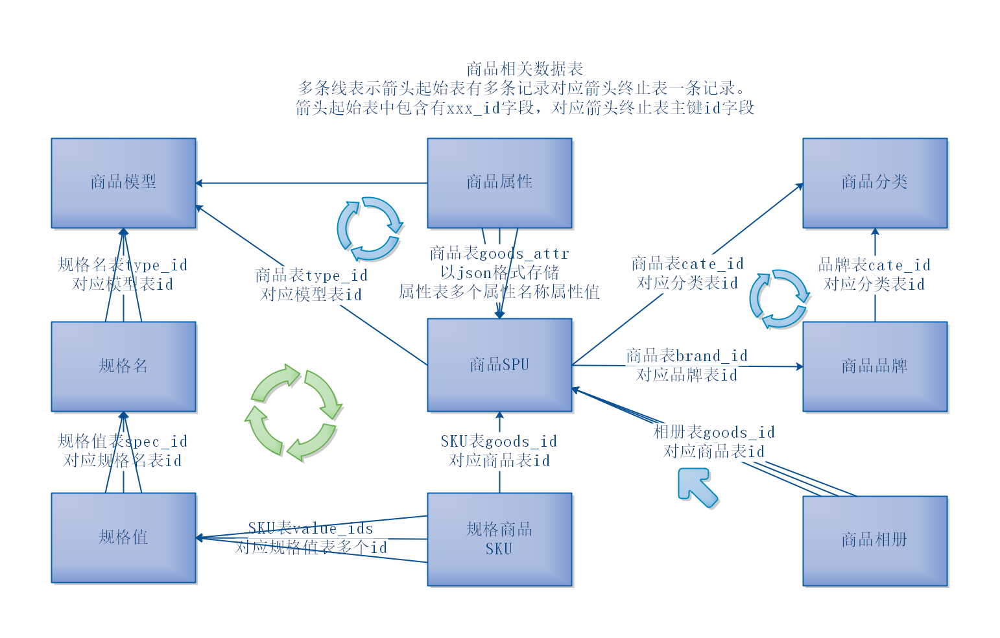
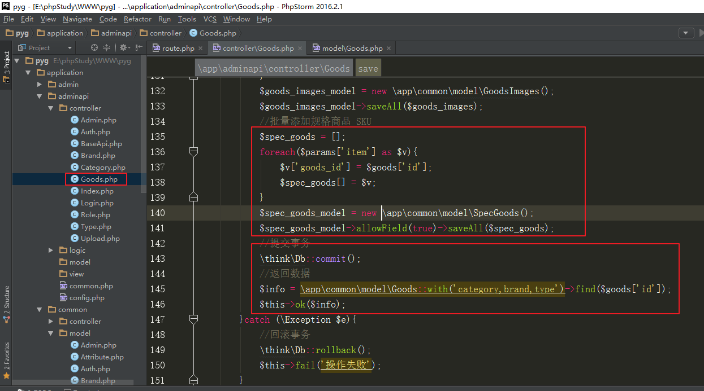

# 品优购电商项目05

- [品优购电商项目05](#品优购电商项目05)
- [大小写问题](#大小写问题)
- [商品相关数据表](#商品相关数据表)
  - [1、商品分类、商品品牌、商品、商品相册](#1商品分类商品品牌商品商品相册)
  - [2、商品、商品模型、商品属性](#2商品商品模型商品属性)
  - [3、商品、商品模型、商品SKU](#3商品商品模型商品sku)
  - [4、商品相关整体](#4商品相关整体)
- [十六、商品模型（类型）管理](#十六商品模型类型管理)
  - [1、商品模型列表](#1商品模型列表)
  - [2、商品模型详情](#2商品模型详情)
  - [3、商品模型删除](#3商品模型删除)
  - [4、商品模型新增](#4商品模型新增)
  - [5、商品模型修改](#5商品模型修改)
- [十七、商品管理](#十七商品管理)
  - [1、商品列表](#1商品列表)
  - [2、商品新增](#2商品新增)
  - [3、商品详情](#3商品详情)
  - [4、商品删除](#4商品删除)
  - [5、商品修改页面接口](#5商品修改页面接口)
  - [6、商品修改](#6商品修改)
  - [7、商品相册删除](#7商品相册删除)


# 大小写问题


| 规范                 | 具体场景                                                     | 实际举例                                                     |
| -------------------- | ------------------------------------------------------------ | ------------------------------------------------------------ |
| 小写+下划线          | 目录名、除了类文件之外的其他文件、函数名、配置名称、数据表名和字段名、路由url、请求参数名 | （控制器名称两个单词）视图目录、模板文件、默认访问url中控制器名；（关联模型）with方法参数 |
| 大写 + 下划线        | 常量                                                         | 常量                                                         |
| 大驼峰（首字母大写） | 类名、类文件名                                               | 控制器类、模型类、其他自定义类                               |
| 小驼峰（首字母小写） | 类的方法、类的属性                                           | 关联模型方法是小驼峰                                         |


# 商品相关数据表

## 1、商品分类、商品品牌、商品、商品相册


## 2、商品、商品模型、商品属性


## 3、商品、商品模型、商品SKU

SPU： 最小产品单元，包含多种可选规格的某种商品的集合。iphone 6 就是一个SPU

SKU：最小库存单元，不可再拆分的产品。 32G的黑色的iphone6就是一个SKU


## 4、商品相关整体



| 表名             | 备注                |
| ---------------- | ------------------- |
| pyg_admin        | 后台管理员表        |
| pyg_role         | 后台角色表          |
| pyg_auth         | 后台权限表          |
| pyg_category     | 商品分类表          |
| pyg_brand        | 商品品牌表          |
| pyg_goods        | 商品表（SPU表）     |
| pyg_goods_images | 商品相册表          |
| pyg_attribute    | 商品属性表          |
| pyg_spec         | 商品规格名称表      |
| pyg_spec_value   | 商品规格值表        |
| pyg_spec_goods   | 规格商品表（SKU表） |
| pyg_cart         | 购物车表            |
| pyg_order        | 订单表              |
| pyg_order_goods  | 订单商品表          |
| pyg_pay_log      | 支付记录表          |
| pyg_user         | 前台用户表          |
| pyg_type         | 商品模型表          |
| pyg_address      | 收货地址表          |


# 十六、商品模型（类型）管理

## 1、商品模型列表

定义路由

创建控制器方法

查询数据

返回数据

实现：

定义路由


创建控制器方法，继承BaseApi

 

 

创建模型

 

查询数据

 

## 2、商品模型详情

定义路由

创建控制器方法

查询数据

返回数据

实现：

创建模型（规格名称模型、规格值模型、属性模型）

 

定义关联模型

 


查询数据


## 3、商品模型删除

删除数据

返回数据

注：事务操作 见手册-数据库-事务操作


实现：

商品类型下有商品，则不能删除

删除了商品类型，类型下的规格名、规格值、属性都可以删除了。

普通的删除：


使用事务操作进行删除：


## 4、商品模型新增

定义路由,创建控制器方法,接收数据,参数检测

添加数据：

添加模型数据

添加规格名称（去除空的规格值，去除没有规格值的规格名）

添加规格值

添加属性数据（去除空的属性值）
   -- 属性数据中的属性名必填,属性值为可选值,如毛重没有固定的值,由创建商品时,再填写;产地的话有固定的可选项,就可以在商品模型中填写.

返回数据

```html
<!--参考html表单-->
<form>
    <label>模型名：</label>
    <input type="text" name="type_name" value="">
    <label>规格：</label>
    <input type="text" name="spec[0][name]" value="">
    <input type="text" name="spec[0][sort]" value="">
    <input type="text" name="spec[0][vlaue][]" value="">
    <input type="text" name="spec[0][value][]" value="">
    <input type="text" name="spec[0][value][]" value="">
    <input type="text" name="spec[1][name]" value="">
    <input type="text" name="spec[1][sort]" value="">
    <input type="text" name="spec[1][value][]" value="">
    <input type="text" name="spec[1][value][]" value="">
    <input type="text" name="spec[1][value][]" value="">
    <label>属性：</label>
    <input type="text" name="attr[0][name]" value="">
    <input type="text" name="attr[0][sort]" value="">
    <input type="text" name="attr[0][value][]" value="">
    <input type="text" name="attr[1][name]" value="">
    <input type="text" name="attr[1][sort]" value="">
    <input type="text" name="attr[1][vlaue][]" value="">
    <input type="text" name="attr[1][value][]" value="">
</form>
```


```php
//参数数组参考：
$params = [
    'type_name' => '手机',
    'spec' => [
        ['name' => '颜色', 'sort' => 50, 'value'=>['黑色', '白色', '金色']],
        ['name' => '内存', 'sort' => 50, 'value'=>['64G', '128G', '256G']],
    ],
    'attr' => [
        ['name' => '毛重', 'sort'=>50, 'value' => []],
        ['name' => '产地', 'sort'=>50, 'value' => ['进口', '国产']],
    ]
]
```

实现：

接收参数、检测参数

 

开启事务

 

添加商品类型


去除空的值


批量添加规格名


批量添加规格值


去除空的属性值


批量添加商品属性


测试：postman


## 5、商品模型修改

定义路由

创建控制器方法

接收数据

参数检测

修改模型数据

修改规格名称（去除空的规格值，去除没有规格值的规格名，删除原规格名称，添加新规格名称）

修改规格值（删除原规格值，添加新规格值）

修改属性数据（去除空的属性值，删除原属性，添加新属性）

返回数据

实现：

接收数据、检测数据

 

开启事务

 

修改模型名称


去除空的规格名称规格值


删除原来的规格名，批量添加新的规格名


删除原来的规格值，批量添加新的规格值


去除空的属性名称属性值


删除原来的属性，批量添加新的属性


 

# 十七、商品管理

修改商品表

supplier_id 供货商字段 可为空

```mysql
ALTER TABLE `pyg_goods`
MODIFY COLUMN `suppliers_id`  smallint(4) NULL COMMENT '供货商' AFTER `sort`;
```


## 1、商品列表

定义路由

创建控制器方法

查询数据（分页+搜索）（关联查询）

返回数据

实现：

定义路由

创建控制器方法，继承BaseApi

创建模型

查询数据

实现：

定义路由


创建控制器方法

 

设置关联模型


查询数据（分页+搜索）（关联查询）

返回数据


## 2、商品新增

定义路由

创建控制器方法

接收数据

参数检测

添加数据：

商品logo及缩略图

处理商品属性值字段

商品相册图片及缩略图

添加规格商品SKU

返回数据

```html
<!--参考html表单-->
<form>
    <!--商品基本信息(部分省略)-->
    <input type="text" name="goods_name" value="">
    <input type="text" name="goods_price" value="">
    <!--商品描述-->
    <input type="text" name="goods_introduce" value="">
    <!--商品logo图片-->
    <input type="hidden" name="goods_logo" value="">
    <!--商品相册图片-->
    <input type="hidden" name="goods_images[]" value="">
    <input type="hidden" name="goods_images[]" value="">
    <input type="hidden" name="goods_images[]" value="">
    <!--商品分类-->
    <input type="text" name="cate_id" value="">
    <!--商品品牌-->
    <input type="text" name="brand_id" value="">
    <!--商品模型（类型）-->
    <input type="text" name="type_id" value="">
    <!--商品规格-->
    <input type="text" name="item[18_21]['price']" value="">
    <input type="text" name="item[18_21]['value_ids']" value="">
    <input type="text" name="item[18_21]['value_names']" value="">
    <input type="text" name="item[18_21]['cost_price']" value="">
    <input type="text" name="item[18_21]['store_count']" value="">
    <input type="text" name="item[18_22]['price']" value="">
    <input type="text" name="item[18_22]['value_ids']" value="">
    <input type="text" name="item[18_22]['value_names']" value="">
    <input type="text" name="item[18_22]['cost_price']" value="">
    <input type="text" name="item[18_22]['store_count']" value="">
    <!--商品属性-->
    <input type="text" name="attr[7]['id']" value="">
    <input type="text" name="attr[7]['attr_name']" value="">
    <input type="text" name="attr[7]['attr_value']" value="">
    <input type="text" name="attr[8]['id']" value="">
    <input type="text" name="attr[8]['attr_name']" value="">
    <input type="text" name="attr[8]['attr_value']" value="">
</form>
```


```php
//参数数组参考：(部分省略)
$params = [
    'goods_name' => 'iphone X',
    'goods_price' => '8900',
    'goods_introduce' => 'iphone iphonex',
    'goods_logo' => '/uploads/goods/20190101/afdngrijskfsfa.jpg',
    'goods_images' => [
        '/uploads/goods/20190101/dfsssadsadsada.jpg',
        '/uploads/goods/20190101/adsafasdadsads.jpg',
        '/uploads/goods/20190101/dsafadsadsaasd.jpg',
    ],
    'cate_id' => '72',
    'brand_id' => '3',
    'type_id' => '16',
    'item' => [
        '18_21' => [
            'value_ids'=>'18_21', 
            'value_names'=>'颜色：黑色；内存：64G', 
            'price'=>'8900.00', 
            'cost_price'=>'5000.00', 
            'store_count'=>100
        ],
        '18_22' => [
            'value_ids'=>'18_22', 
            'value_names'=>'颜色：黑色；内存：128G', 
            'price'=>'9000.00', 
            'cost_price'=>'5000.00', 
            'store_count'=>50
        ]
    ],
    'attr' => [
        '7' => ['id'=>'7', 'attr_name'=>'毛重', 'attr_value'=>'150g'],
        '8' => ['id'=>'8', 'attr_name'=>'产地', 'attr_value'=>'国产'],
    ]
]
```

实现：

接收数据、参数检测


开启事务

 


添加商品数据：

商品logo及缩略图

处理商品属性值字段


商品相册图片及缩略图


添加规格商品SKU

返回数据




## 3、商品详情

定义路由

创建控制器方法

查询数据

返回数据

实现：

## 4、商品删除

删除数据

返回数据

实现：


## 5、商品修改页面接口

修改页面所需原始数据太多，故专门提供此业务接口。

定义路由

创建控制器方法

查询商品信息:

商品基本信息

商品所属分类（id  cate_name  pid_path）

商品相册图片集合（id  goods_id  pics_big  pics_sma）

规格商品集合-SKU（）

所属模型信息（id  type_name attrs  specs   specs.spec_values）


查询分类信息：（id  cate_name）

所有一级分类

商品所属一级分类下的所有二级分类

商品所属二级分类下的所有三级分类


查询所有商品模型信息：（id type_name）


返回数据


## 6、商品修改

定义路由

创建控制器方法

接收数据

参数检测

修改数据

返回数据

## 7、商品相册删除

定义路由

创建控制器方法

接收数据

参数检测

修改数据

返回数据

