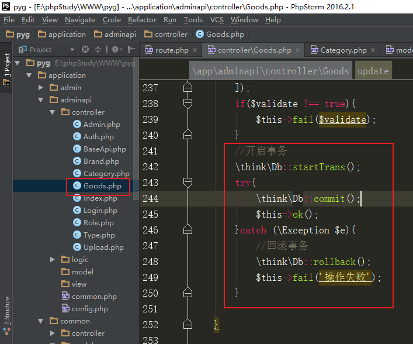

# 品优购电商项目06

- [品优购电商项目06](#品优购电商项目06)
- [商品相关数据表](#商品相关数据表)
  - [1、商品分类、商品品牌、商品、商品相册](#1商品分类商品品牌商品商品相册)
  - [2、商品、商品模型、商品属性](#2商品商品模型商品属性)
  - [3、商品、商品模型、商品SKU](#3商品商品模型商品sku)
  - [4、商品相关整体](#4商品相关整体)
- [十七、商品管理](#十七商品管理)
  - [1、商品列表](#1商品列表)
  - [2、商品新增](#2商品新增)
  - [3、商品详情](#3商品详情)
    - [嵌套with查询的用法](#嵌套with查询的用法)
  - [4、商品删除](#4商品删除)
  - [5、商品修改页面接口](#5商品修改页面接口)
  - [6、商品修改](#6商品修改)
  - [7、商品相册删除](#7商品相册删除)
- [十八、XSS攻击](#十八xss攻击)
  - [1、什么是XSS攻击](#1什么是xss攻击)
  - [2、转化的思想防范xss攻击](#2转化的思想防范xss攻击)
  - [3、过滤的思想防范xss攻击](#3过滤的思想防范xss攻击)
  - [4、转化与过滤结合防范xss攻击](#4转化与过滤结合防范xss攻击)
- [十九、添加完整商品数据](#十九添加完整商品数据)


# 商品相关数据表

## 1、商品分类、商品品牌、商品、商品相册


## 2、商品、商品模型、商品属性


## 3、商品、商品模型、商品SKU

SPU： 最小产品单元，包含多种可选规格的某种商品的集合。iphone 6 就是一个SPU

SKU：最小库存单元，不可再拆分的产品。 32G的黑色的iphone6就是一个SKU


## 4、商品相关整体


| 表名             | 备注                |
| ---------------- | ------------------- |
| pyg_admin        | 后台管理员表        |
| pyg_role         | 后台角色表          |
| pyg_auth         | 后台权限表          |
| pyg_category     | 商品分类表          |
| pyg_brand        | 商品品牌表          |
| pyg_goods        | 商品表（SPU表）     |
| pyg_goods_images | 商品相册表          |
| pyg_attribute    | 商品属性表          |
| pyg_spec         | 商品规格名称表      |
| pyg_spec_value   | 商品规格值表        |
| pyg_spec_goods   | 规格商品表（SKU表） |
| pyg_cart         | 购物车表            |
| pyg_order        | 订单表              |
| pyg_order_goods  | 订单商品表          |
| pyg_pay_log      | 支付记录表          |
| pyg_user         | 前台用户表          |
| pyg_type         | 商品模型表          |
| pyg_address      | 收货地址表          |

# 十七、商品管理

修改商品表

supplier_id 供货商字段 可为空

```mysql
ALTER TABLE `pyg_goods`
MODIFY COLUMN `suppliers_id`  smallint(4) NULL COMMENT '供货商' AFTER `sort`;
```


## 1、商品列表

定义路由

创建控制器方法

查询数据（分页+搜索）（关联查询）

返回数据

实现：

定义路由

创建控制器方法，继承BaseApi

创建模型

查询数据

实现：

定义路由


创建控制器方法

 

设置关联模型


查询数据（分页+搜索）（关联查询）

返回数据


## 2、商品新增

定义路由

创建控制器方法

接收数据

参数检测

添加数据：

商品logo及缩略图

处理商品属性值字段

商品相册图片及缩略图

添加规格商品SKU

返回数据

```html
<!--参考html表单-->
<form>
    <!--商品基本信息(部分省略)-->
    <input type="text" name="goods_name" value="">
    <input type="text" name="goods_price" value="">
    <!--商品描述-->
    <input type="text" name="goods_introduce" value="">
    <!--商品logo图片-->
    <input type="hidden" name="goods_logo" value="">
    <!--商品相册图片-->
    <input type="hidden" name="goods_images[]" value="">
    <input type="hidden" name="goods_images[]" value="">
    <input type="hidden" name="goods_images[]" value="">
    <!--商品分类-->
    <input type="text" name="cate_id" value="">
    <!--商品品牌-->
    <input type="text" name="brand_id" value="">
    <!--商品模型（类型）-->
    <input type="text" name="type_id" value="">
    <!--商品规格-->
    <input type="text" name="item[18_21]['price']" value="">
    <input type="text" name="item[18_21]['value_ids']" value="">
    <input type="text" name="item[18_21]['value_names']" value="">
    <input type="text" name="item[18_21]['cost_price']" value="">
    <input type="text" name="item[18_21]['store_count']" value="">
    <input type="text" name="item[18_22]['price']" value="">
    <input type="text" name="item[18_22]['value_ids']" value="">
    <input type="text" name="item[18_22]['value_names']" value="">
    <input type="text" name="item[18_22]['cost_price']" value="">
    <input type="text" name="item[18_22]['store_count']" value="">
    <!--商品属性-->
    <input type="text" name="attr[7]['id']" value="">
    <input type="text" name="attr[7]['attr_name']" value="">
    <input type="text" name="attr[7]['attr_value']" value="">
    <input type="text" name="attr[8]['id']" value="">
    <input type="text" name="attr[8]['attr_name']" value="">
    <input type="text" name="attr[8]['attr_value']" value="">
</form>
```


```php
//参数数组参考：(部分省略)
$params = [
    'goods_name' => 'iphone X',
    'goods_price' => '8900',
    'goods_introduce' => 'iphone iphonex',
    'goods_logo' => '/uploads/goods/20190101/afdngrijskfsfa.jpg',
    'goods_images' => [
        '/uploads/goods/20190101/dfsssadsadsada.jpg',
        '/uploads/goods/20190101/adsafasdadsads.jpg',
        '/uploads/goods/20190101/dsafadsadsaasd.jpg',
    ],
    'cate_id' => '72',
    'brand_id' => '3',
    'type_id' => '16',
    'item' => [
        '18_21' => [
            'value_ids'=>'18_21', 
            'value_names'=>'颜色：黑色；内存：64G', 
            'price'=>'8900.00', 
            'cost_price'=>'5000.00', 
            'store_count'=>100
        ],
        '18_22' => [
            'value_ids'=>'18_22', 
            'value_names'=>'颜色：黑色；内存：128G', 
            'price'=>'9000.00', 
            'cost_price'=>'5000.00', 
            'store_count'=>50
        ]
    ],
    'attr' => [
        '7' => ['id'=>'7', 'attr_name'=>'毛重', 'attr_value'=>'150g'],
        '8' => ['id'=>'8', 'attr_name'=>'产地', 'attr_value'=>'国产'],
    ]
]
```

实现：

接收数据、参数检测


开启事务

 


添加商品数据：

商品logo及缩略图

处理商品属性值字段


商品相册图片及缩略图


添加规格商品SKU

返回数据


## 3、商品详情

定义路由

创建控制器方法

查询数据

返回数据

实现：

定义关联关系


```js
// 在这定义categoryRow()方法，不绑定字段,查询Goods表时直接嵌套展示在category_row字段上对应个对象, 由于接口文档中要展示为category字段名,需要到时候把row删掉
public function categoryRow()
{
    return $this->belongsTo('Category', 'cate_id', 'id');
}
```


- 查询数据
  - 直接用with的多个关联查询,就是在结果对象中加多个关联的字段对象对应,类中方法名对应这里小写字母下划线对应


### 嵌套with查询的用法

注：关联查询 with方法

1. 多个嵌套关联，只有最后一个生效。比如with('type, type.attrs, type.specs') 生效的是type和type.specs。其中的type.attrs无效
   1. 不是完全失效，而是 ThinkPHP 的关联预载入机制对同名前缀的嵌套路径做了“覆盖”处理
   2. 推荐使用 数组结构 写法，避免歧义

```php
class Product extends Model
{
    public function category()
    {
        return $this->belongsTo('Category');
    }
}

class Category extends Model
{
    public function attrs()
    {
        return $this->hasMany('Attr');
    }

    public function specs()
    {
        return $this->hasMany('Spec');
    }
}
// 嵌套查询
$product = Product::with([
    'category' => [
        'attrs',
        'specs'
    ]
])->find(1);
// 结果
echo '商品名：' . $product->name;
echo '分类名：' . $product->category->name;

foreach ($product->category->attrs as $attr) {
    echo '属性：' . $attr->name . '<br>';
}

foreach ($product->category->specs as $spec) {
    echo '规格：' . $spec->name . '<br>';
}
```

## 4、商品删除

删除数据

返回数据

实现：


## 5、商品修改页面接口

这是编辑商品时的数据展示接口, 不是编辑保存的接口.修改页面所需原始数据太多，故专门提供此业务接口。


定义路由

创建控制器方法

查询商品信息:

商品基本信息

商品所属分类（id  cate_name  pid_path brands） 查询所属分类下所有的品牌信息

商品相册图片集合（id  goods_id  pics_big  pics_sma）

规格商品集合-SKU

所属模型信息（id  type_name attrs  specs   specs.spec_values）

所属品牌信息


查询分类信息：（id  cate_name）

所有一级分类

商品所属一级分类下的所有二级分类

商品所属二级分类下的所有三级分类


查询所有商品模型信息：（id type_name）

返回数据


实现：

查询商品信息


查询分类信息


查询类型信息


## 6、商品修改

定义路由

创建控制器方法

接收数据

参数检测

修改数据：

商品logo及缩略图

处理商品属性值字段

商品相册图片及缩略图

删除原规格商品SKU

添加新规格商品SKU

返回数据

实现：

接收数据、参数检测


开启事务

 

修改商品表


相册表添加数据


删除原来的规格商品SKU

添加新的规格商品SKU


## 7、商品相册删除

定义路由

创建控制器方法

删除数据

返回数据

实现：

定义路由


创建控制器方法,删除数据


# 十八、XSS攻击

## 1、什么是XSS攻击

跨站脚本攻击(Cross Site Scripting)，攻击者往Web页面里插入恶意Script代码，当用户浏览该页之时，嵌入其中Web里面的Script代码会被执行，从而达到恶意攻击用户的目的。

模拟过程：

添加功能中，请求参数值包含script标签js代码


添加成功之后，数据表中：
 

访问新增的这条数据，js代码会被浏览器解析并执行。

Xss攻击严重影响了正常用户对网站的访问。

## 2、转化的思想防范xss攻击

转化的思想：将输入内容中的<>转化为html实体字符。

原生php中对xss攻击进行防范，使用htmlspecialchars函数，将用户输入的字符串中的特殊字符，比如<> 转化为html实体字符。

TP框架中，可以设置在获取输入变量时，使用htmlspecialchars函数对输入进行处理。

设置方法：修改application/config.php

注意：在框架配置文件中，配置的函数名称，如果写错，页面不会报错，只是所有接收的数据都是null.

```php
'default_filter' => 'htmlspecialchars',
```


删除之前模拟过程中添加的数据，重新进行模拟。

以添加商品分类为例（注意控制器中的对字段长度的限制）


数据表中：

 

特殊字符<> 已经被转化为html实体字符。

展示刚添加的数据，js被原封不动展示，不会执行。

 

## 3、过滤的思想防范xss攻击

过滤的思想：将输入内容中的script标签js代码过滤掉。

特别在富文本编辑器中，输入的内容源代码中，包含html标签是正常的。不能使用htmlspecialchars进行处理。如果用户直接在源代码界面输入js代码，也会引起xss攻击。

通常使用htmlpurifier插件进行过滤。

使用步骤：

①使用composer执行命令，安装 ezyang/htmlpurifier 扩展类库

项目目录下>   composer require ezyang/htmlpurifier 

或者

手动下载插件包，

将htmlpurifier插件包解压，将其中的library目录移动到项目中public/plugins目录，改名为htmlpurifier

 

②在application/common.php中定义remove_xss函数（当天文件function.php中有）

```php
if (!function_exists('remove_xss')) {
    //使用htmlpurifier防范xss攻击
    function remove_xss($string){
        //相对index.php入口文件，引入HTMLPurifier.auto.php核心文件
        //require_once './plugins/htmlpurifier/HTMLPurifier.auto.php';
        // 生成配置对象
        $cfg = HTMLPurifier_Config::createDefault();
        // 以下就是配置：
        $cfg -> set('Core.Encoding', 'UTF-8');
        // 设置允许使用的HTML标签
        $cfg -> set('HTML.Allowed','div,b,strong,i,em,a[href|title],ul,ol,li,br,p[style],span[style],img[width|height|alt|src]');
        // 设置允许出现的CSS样式属性
        $cfg -> set('CSS.AllowedProperties', 'font,font-size,font-weight,font-style,font-family,text-decoration,padding-left,color,background-color,text-align');
        // 设置a标签上是否允许使用target="_blank"
        $cfg -> set('HTML.TargetBlank', TRUE);
        // 使用配置生成过滤用的对象
        $obj = new HTMLPurifier($cfg);
        // 过滤字符串
        return $obj -> purify($string);
    }
} 
```

说明：htmlpurifier插件，会过滤掉script标签以及标签包含的js代码。

设置全局过滤方法为封装的remove_xss函数：

修改application/config.php

```php
'default_filter' => 'remove_xss',
```

重新测试，输入的内容中的script标签被过滤。

 

##  4、转化与过滤结合防范xss攻击

普通输入内容，使用转化的思想进行处理。

设置全局过滤方法为封装的htmlspecialchars函数：

修改application/config.php

```php
'default_filter' => 'htmlspecialchars',
```

富文本编辑器内容，使用过滤的思想进行处理。

比如商品描述字段，处理如下：

```php
//商品添加或修改功能中
$params = input();
//单独处理商品描述字段 goods_introduce
$params['goods_desc'] = input('goods_desc', '', 'remove_xss');
```


# 十九、添加完整商品数据

使用后台管理系统，添加完整商品数据。用于测试及前台页面展示。

添加三级商品分类（一般有现成的测试数据）

添加品牌（在一个三级分类下添加至少一个品牌）

添加商品类型（商品模型）（至少两个规格，每个规格至少两个规格值。至少两个属性）


添加商品（选择分类、选择品牌、上传logo图片、上传相册图片、选择商品类型、每种规格至少选择两个规格值）

