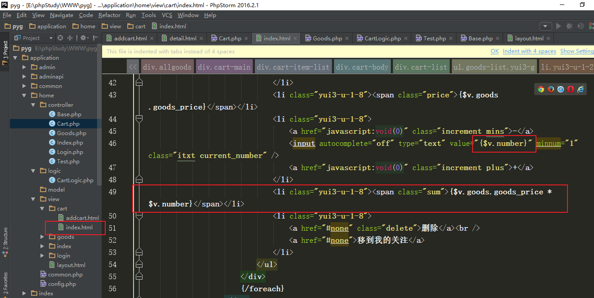
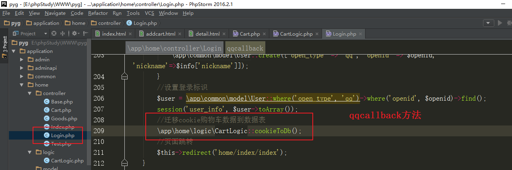
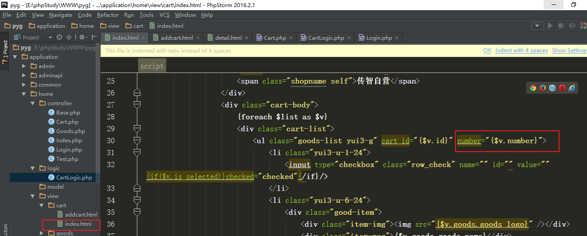
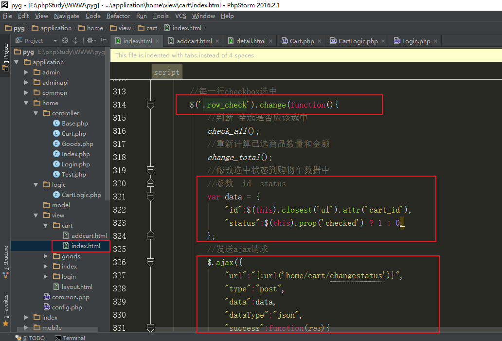

# 品优购商城-09

- [品优购商城-09](#品优购商城-09)
- [零、商品相关页面显示](#零商品相关页面显示)
  - [1、商品分类展示](#1商品分类展示)
  - [2、商品列表展示](#2商品列表展示)
  - [3、商品详情页](#3商品详情页)
  - [4、商品详情页-规格值选中效果](#4商品详情页-规格值选中效果)
- [一、购物流程概述](#一购物流程概述)
- [二、购物车原理](#二购物车原理)
  - [1、购物车数据的保存位置](#1购物车数据的保存位置)
  - [2、把购物车数据存储到数据库](#2把购物车数据存储到数据库)
  - [3、把购物车数据存储到cookie](#3把购物车数据存储到cookie)
- [三、加入购物车](#三加入购物车)
  - [1、商品详情页面-提交表单](#1商品详情页面-提交表单)
  - [2、控制器方法，处理表单](#2控制器方法处理表单)
  - [3、封装一个方法，添加购物车数据](#3封装一个方法添加购物车数据)
  - [4、加入成功页面显示](#4加入成功页面显示)
  - [5、测试](#5测试)
- [四、购物车列表显示](#四购物车列表显示)
  - [1、购物记录信息展示](#1购物记录信息展示)
  - [2、全选效果](#2全选效果)
  - [3、计算已选商品数量和金额](#3计算已选商品数量和金额)
  - [4、加减号修改购买数量-页面效果](#4加减号修改购买数量-页面效果)
- [五、登录时迁移cookie购物数据到数据表](#五登录时迁移cookie购物数据到数据表)
- [六、修改购物车商品数量](#六修改购物车商品数量)
  - [1、前端页面发送ajax请求](#1前端页面发送ajax请求)
  - [2、控制器中处理ajax请求](#2控制器中处理ajax请求)
  - [3、封装方法修改购买数量](#3封装方法修改购买数量)
  - [4、页面优化（数量错误时，恢复原状）](#4页面优化数量错误时恢复原状)
  - [5、修改数量后，重新计算小计金额](#5修改数量后重新计算小计金额)
- [七、删除购物车记录](#七删除购物车记录)
  - [1、前端页面发送ajax请求](#1前端页面发送ajax请求-1)
  - [2、控制器中处理ajax请求](#2控制器中处理ajax请求-1)
  - [3、封装方法删除购物记录](#3封装方法删除购物记录)
- [八、修改选中状态](#八修改选中状态)


# 零、商品相关页面显示

## 1、商品分类展示

两个概念：

商品类型(商品模型)：用于后台，管理商品规格属性的，只有一级。

商品分类：用于前台，展示商品的，有多级（三级）。

 

如果尚未创建Category商品分类模型，则执行以下命令创建Category模型

```
php think make:model common/Category
```

 

商品分类在前台展示：（商品分类属于公共头部代码）

1）父子级分类树结构：（最终读取数据时，遍历次数少）

查询到所有分类数据后，先将数组转化为分类树结构，方便页面展示

树结构示例：

  

需要用到封装的处理函数application/common.php中的get_tree_list函数


2）功能实现

①在前台模块创建Base控制器，在其构造方法，查询商品分类数据并转化为树结构

```
php think make:controller home/Base --plain
```

 


②所有其他控制器（Login控制器除外），继承Base控制器

比如 Index控制器，继承Base

 

③修改view/layout.html, 展示商品分类数据

 展示一级分类

展示二级、三级分类


## 2、商品列表展示

如果尚未创建商品模型，则执行以下命令创建商品模型：

```
php think make:model common/Goods 
```

商品列表，展示某个分类下的商品。比如分类id为187的 “手机” 分类

页面整合（略）：Home模块Goods控制器index方法  list.html -> index.html

创建Goods控制器，需要继承Base控制器

```
php think make:controller home/Goods --plain
```

 

①在Goods控制器index方法，查询分类下的商品数据以及分类名称

 

②在view/goods/index.html，展示分类下的商品

遍历展示商品列表：

 


展示分页栏：


③当前分类名称展示

  

## 3、商品详情页

整合页面（略）：  Home模块 Goods控制器 detail方法，item.html ->detail.html

1）分析商品详情页需要的数据。

①商品基本信息，查询商品表pyg_goods表，以goods_id为条件  主键id

②商品相册图片，查询商品相册表pyg_goods_images表，以goods_id为条件

③规格商品SKU，查询规格商品表pyg_spec_goods表，根据goods_id条件

④根据规格商品信息，查询对应规格名称规格值信息

2）如果尚未创建模型，则创建GoodsImages、SpecGoods、Spec、SpecValue模型

3）商品信息展示：

①基本信息展示：

Goods控制器detail方法，查询商品基本信息

 

home/view/goods/detail.html，展示商品基本信息

 商品名称、商品价格

商品属性、商品详情


②商品相册信息展示

home/view/goods/detail.html 展示商品相册图片


③商品SKU（规格商品）展示

Goods控制器detail方法，查询商品SKU、查询对应规格名称规格值

转化数组结构： 取出所有相关的规格值ids


查询规格值规格名称信息，组装数组结构


home/view/goods/detail.html展示商品SKU


## 4、商品详情页-规格值选中效果

view/goods/detail.html中，规格值选中效果


Goods控制器detail方法中，组装数组，描述 规格值组合对应的规格商品SKU的id 的映射关系

将映射关系数组 转化为json字符串


view/goods/detail.html 中  给规格值a标签，添加自定义属性spec_value_id 保存规格值id， 用于js中获取


在规格值的点击事件中，根据选中的规格值的组合，在页面显示对应的价格。


页面默认显示 商品的第一个SKU的价格


view/goods/detail.html 中 给“加入购物车”  加id属性，禁用href属性


加入购物车，绑定点击事件，获取选中的规格商品id值。


# 一、购物流程概述

购物车作用：存放想要购买的商品，最后一次性结算。

电商网站购物流程：

  

# 二、购物车原理

## 1、购物车数据的保存位置

Cookie：存储在浏览器，可以长时间存储，直到过期或者被用户清除。

Session：存储在服务器，无法长久存储，关闭网站或浏览器，数据被清空。

数据表：存储在服务器，可以永久保存。

缓存：存储在服务器，可以长时间存储，直到过期。

 

未登录：可以将购物车数据存储在cookie。

登录后：将购物车数据存储在数据表，并和用户关联。

在用户登录时，将cookie中的购物车数据迁移到数据表。

## 2、把购物车数据存储到数据库

需要存储哪些数据？

哪个用户？ 购买的哪个商品？ 购买多少？选中的SKU（规格值组合）是什么？

商品id SKU的id  购买数量   用户id

24  	 120			10		1

数据表pyg_cart表

```mysql
CREATE TABLE `pyg_cart` (
  `id` int(11) unsigned NOT NULL AUTO_INCREMENT,
  `user_id` int(11) NOT NULL DEFAULT '0' COMMENT '用户id',
  `goods_id` int(11) NOT NULL DEFAULT '0' COMMENT '商品id',
  `number` int(11) NOT NULL DEFAULT '0' COMMENT '购买数量',
  `spec_goods_id` int(11) NOT NULL COMMENT '规格商品id',
  `is_selected` tinyint(1) NOT NULL DEFAULT '1' COMMENT '购物车选中状态',
  `create_time` int(11) unsigned DEFAULT NULL,
  `update_time` int(11) unsigned DEFAULT NULL,
  `delete_time` int(11) unsigned DEFAULT NULL,
  PRIMARY KEY (`id`)
) ENGINE=InnoDB AUTO_INCREMENT=22 DEFAULT CHARSET=utf8;
```


## 3、把购物车数据存储到cookie

需要存储哪些数据？

商品id   SKU的id  购买数量  

25  	   130			20

Cookie中存储字符串。

PHP中处理数据，数组最方便。

将数组转化为字符串格式：json_encode、json_decode函数，serialize、unserialize函数序列化

TP框架的cookie函数，支持直接存数组（自动转化为字符串）

实际对cookie中购物车数据的操作：数组转化为字符串，存储字符串，取出字符串，转化为数组，

修改删除数组中的键值对，将数组转化字符串，重新存储；


cookie中存储购物车数据，分析：

 

获取所有数据


添加一条数据


修改一条数据


删除一条数据


# 三、加入购物车


## 1、商品详情页面-提交表单

点击“加入购物车”，需要发送请求并携带参数

①页面加一个隐藏的form表单，用于点击“加入购物车”后发送请求

 

②给 购买数量 input输入框加id属性，给“加入购物车”加id属性,

给“加入购物车” 禁用href，用于在js中进行DOM操作

 

③给“加入购物车”绑定点击事件，获取购买数量等参数，放到表单中并提交表单


## 2、控制器方法，处理表单

创建Cart控制器，继承Base控制器

 

基本思路：Cart控制器addcart方法，接收数据，调用封装的方法（下一步才封装），添加购物车数据。


添加成功后，查询商品信息用于页面展示, 见 4.加入成功页面展示

 

## 3、封装一个方法，添加购物车数据

思路：

①已登录，则添加数据到数据表；未登录，则添加数据到cookie中。

②以前添加过相同的购买记录，则累加购买数量，否则添加新纪录

已登录：添加到数据表

创建Cart模型：

  

在home模块下 创建logic目录，在logic目录下 创建CartLogic类文件，封装静态的addCart方法


注意：判断登录，需要根据自己情况，使用登录时设置的登录标识


已登录：添加到数据表


未登录，添加到cookie

注意：下图中的else 是 未登录的else


## 4、加入成功页面显示

Cart控制器addcart方法，查询商品信息

 

Goods模型中封装方法


整合模板，修改view/cart/addcart.html,展示商品信息 （模板文件原名称 success-cart.html）

 

## 5、测试

可以分别在未登录和已登录两种状态下进行“加入购物车”的测试。

已登录：添加购物车数据后，查看数据表即可

 

未登录：添加购物车数据后，查看cookie，可通过代码取出cookie数据并打印

用代码方式清除cookie购物数据 ： cookie(‘cart’, null);


# 四、购物车列表显示

## 1、购物记录信息展示

①（整合模板）访问地址：Cart控制器index方法，cart.html  => index.html页面

 

②封装方法，获取购物车数据

已登录，查询数据表，得到二维数组格式

未登录，查询cookie，得到二维数组格式


③在Cart控制器index方法中，查询购物车列表的数据，包含商品基本信息

 

④在view/cart/index.html中，遍历展示数据

 




## 2、全选效果

① 全选 状态 影响每一行checkbox的状态。

给全选绑定onchange事件

获取到全选的选中状态（checked属性值）

给每一行的checkbox 设置checked属性值，保持和全选的状态一致


②每一行checkbox状态 影响全选的状态

给每一行的checkbox绑定onchange事件

获取所有行数（所有的单个的checkbox）

获取选中的行数（每一行选中的checkbox数量）

判断所有的行数和选中的行数是否相等

根据判断结果，设置全选的checked属性

 

## 3、计算已选商品数量和金额

application/home/view/cart/index.html

思路：

给每一行的checkbox绑定onchange事件中

给全选checkbox绑定onchange事件中

 

计算的过程：可以封装为一个函数，需要时调用即可

获取到所有选中行的checkbox

循环，取到每一个选中的行的checkbox

根据这个checkbox获取到当前行的数量（input的value值），小计金额（标签的innerHTML）

对数量和小计金额分别进行累加，得到总数量和金额

将计算的总数量和金额，显示到页面上（修改span的innerHTML值，修改i标签的innerHTML）

封装的函数change_total

 

全选和每一行的checkbox的change事件中，调用change_total函数


 页面刷新时，直接调用一次change_total()


## 4、加减号修改购买数量-页面效果


# 五、登录时迁移cookie购物数据到数据表

思路：从cookie中取出所有的购物车数据，逐条添加到数据表。

封装cookieToDb方法，用于登录时将cookie中的购物车数据迁移到数据表。

 

在Login控制器dologin方法中，登录成功并设置登录标识后，进行购物车数据的迁移。

 

在Login控制器qqcallback方法中

 

# 六、修改购物车商品数量

## 1、前端页面发送ajax请求

需求：

可以通过点击每一行的+ -号，或者直接在input输入框中，修改购买数量。

购买数量的修改，最终需要在保存的购物车数据中修改，并不是只改页面展示。

分析：

需要发送ajax请求，由于参数一致(id, number)，成功后的处理都一样，

可以在js中封装一个change_num函数，用于发送ajax请求修改购买数量

 

实现：

修改view/cart/index.html

在每一行的ul标签添加自定义的属性cart_id，存储id值

 

封装函数changenum

 

ajax成功后的处理

 

在js中，给+号和-号分别绑定点击事件，重新计算新的数量，调用change_num函数发送ajax

 

给input输入框绑定change事件，当输入框的值发生变化（失去焦点之后）则触发。

 

## 2、控制器中处理ajax请求

修改Cart控制器，增加一个changenum方法，用于ajax请求。

 

## 3、封装方法修改购买数量

思路：已登录，修改数据表；未登录，修改cookie

 

## 4、页面优化（数量错误时，恢复原状）

如果购买数量格式不对，提示之后，将页面上的数量恢复原状。

需要：在每一行的ul标签 增加一个number属性，记录原始的数量



每次发送ajax修改数量后，需要更新number属性的值。

 

input输入框的change事件中修改如下

  

## 5、修改数量后，重新计算小计金额


# 七、删除购物车记录

## 1、前端页面发送ajax请求

给页面上”删除”绑定点击事件，发送ajax请求删除数据

禁用a标签的href属性

 

绑定事件，发送ajax请求

 

ajax成功后的处理

 

## 2、控制器中处理ajax请求

在Cart控制器增加delcart方法，用于ajax请求

 

## 3、封装方法删除购物记录

思路：已登录，删除数据表记录；未登录，删除cookie中的记录。

 

 

# 八、修改选中状态

点击checkbox 修改对应记录的选中状态

每一个行的选中




全选选中


控制器方法中


封装逻辑方法


总结：

1、加入购物车（提交隐藏表单、控制器方法、封装逻辑方法、成功页面展示、封装查询商品和sku数据方法）

2、购物车列表（封装查询数据的逻辑方法、查询对应的商品和sku、遍历展示数据、js选中效果、加减号效果）

3、登录迁移购物车数据（封装逻辑方法、登录后调用方法）

4、修改购买数量（绑定3个事件、发送ajax请求-封装、成功后的处理；控制器方法、封装逻辑方法）

5、删除购物记录（发送ajax请求、成功后的处理、控制器方法、封装逻辑方法）。

6、修改选中状态