# 聚合支付解决方案

- [聚合支付解决方案](#聚合支付解决方案)
  - [1.解决方案介绍](#1解决方案介绍)
  - [2.开通聚合支付服务](#2开通聚合支付服务)
    - [2.1 注册账号](#21-注册账号)
    - [2.2 开发信息配置](#22-开发信息配置)
      - [2.2.1 Test 和 Live 环境](#221-test-和-live-环境)
      - [2.2.2 获取 Test Key 和 Live Key](#222-获取-test-key-和-live-key)
      - [2.2.3 获取 App ID](#223-获取-app-id)
      - [2.2.4 获取 Ping++ 公钥](#224-获取-ping-公钥)
      - [2.2.5 webhooks异步通知](#225-webhooks异步通知)
    - [2.3 扫码支付](#23-扫码支付)
  - [3.项目集成聚合支付](#3项目集成聚合支付)
    - [3.1 数据库设计](#31-数据库设计)
      - [3.1.1 支付记录表](#311-支付记录表)
      - [3.1.2  创建模型](#312--创建模型)
    - [3.2 聚合支付](#32-聚合支付)
      - [3.2.1 服务器环境部署](#321-服务器环境部署)
      - [3.2.2  生成支付二维码](#322--生成支付二维码)
      - [3.2.3 ping++信息配置](#323-ping信息配置)
      - [3.2.4 扫码支付功能](#324-扫码支付功能)
      - [3.2.5 异步通知](#325-异步通知)
      - [3.2.5 支付结果轮询](#325-支付结果轮询)
    - [3.3 支付流程演示](#33-支付流程演示)
  - [4.总结](#4总结)


## 1.解决方案介绍

聚合支付，是融合了多方支付通道的平台，相对于支付宝、微信等第三方支付平台而言，聚合支付属于在第三方支付平台基础上，进行了技术融合的第四方平台。

本解决方案，是基于PC网站，集成聚合支付中的扫码支付方式，实现支付宝、微信同码的一种基础方案。

聚合支付原理图：

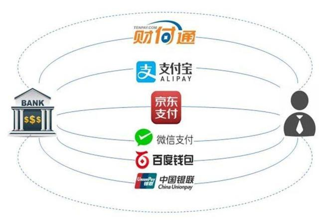

## 2.开通聚合支付服务

很多平台都提供了聚合支付服务，以下使用ping++聚合支付。

### 2.1 注册账号

访问 [Ping++官网](https://www.pingxx.com)，注册账号并登录。

提交注册申请后，请前往注册邮箱，在邮件中点击注册链接，创建密码后进入管理平台。

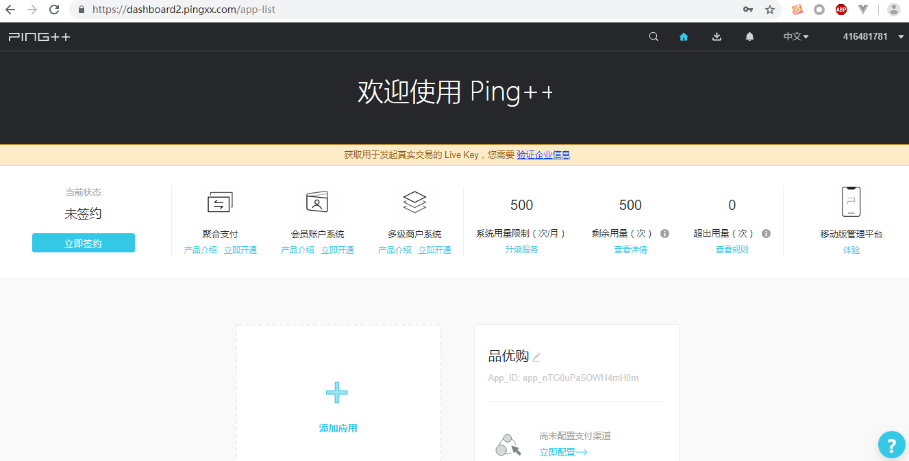


### 2.2 开发信息配置

参见官方文档：<https://www.pingxx.com/docs/overview/config>

#### 2.2.1 Test 和 Live 环境

为了提高接入效率，Ping++ 提供了 Live 和 Test 两个工作模式供开发者接入时使用，两个环境均需要设置 AppID，两个环境的变更可以通过代码中的 Live Key 和 Test Key 的切换。

**Test 环境**

调用 Test 环境只需要注册 Ping++ 账户， Test 环境便于商户在没有申请下来渠道参数时先跑通支付流程，Test 开发中支付页面是 Ping++ 提供的模拟页面，不需要输入密码，直接点击支付即完成模拟付款。

**Live 环境**

调用 Live 环境需要商户已经和 Ping++ 签约并且成功完成渠道申请，将渠道参数填写在 Ping++ 管理平台上对应的渠道。 在 Live 环境下可以调用第三方渠道控件完成真实的付款。（参见 管理平台使用指南<https://www.pingxx.com/docs/overview/dashboard>）


#### 2.2.2 获取 Test Key 和 Live Key

Test 和 Live 环境的 Key 均需要登录 Ping++ 管理平台获得

使用Live环境需要进行企业信息认证。

具体获取路径：点击管理平台右上角公司名称->企业面板->开发参数->基本密钥

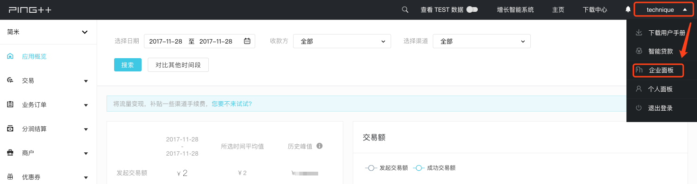

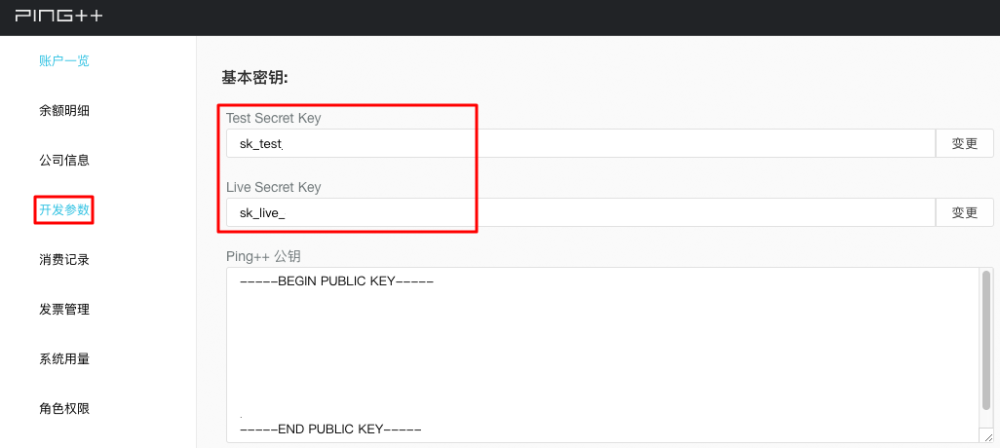

#### 2.2.3 获取 App ID

App ID 是你在 Ping++ 平台上创建的应用标识，平台默认提供一个应用，完善企业信息后可添加新应用。

具体获取路径：登陆管理平台->点击「主页」按钮->对应的应用名称下方会显示 App_ID

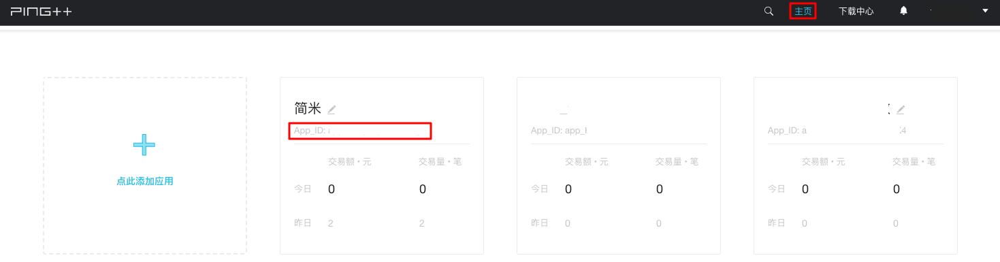

#### 2.2.4 获取 Ping++ 公钥

Ping++ 公钥用于 Webhooks 真实性验证，验证该异步通知是否来自于 Ping++ 。 Ping++ 公钥具体获取路径：点击管理平台右上角公司名称->企业面板->开发参数->基本密钥


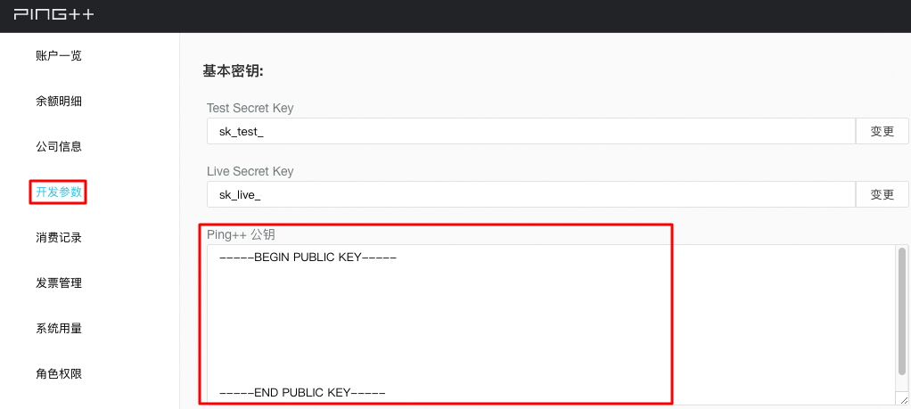

其中，RSA密钥设置，见<https://help.pingxx.com/article/123161>

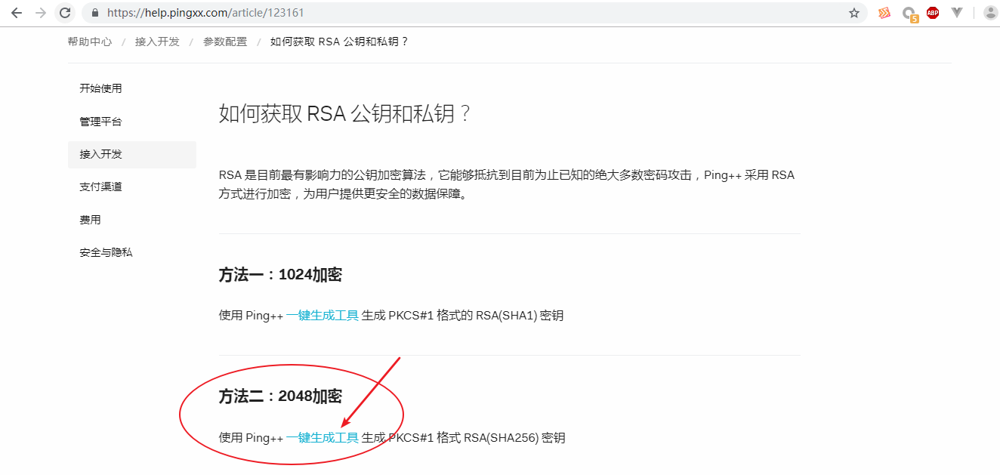

通过一键生成工具 生成商户私钥和公钥

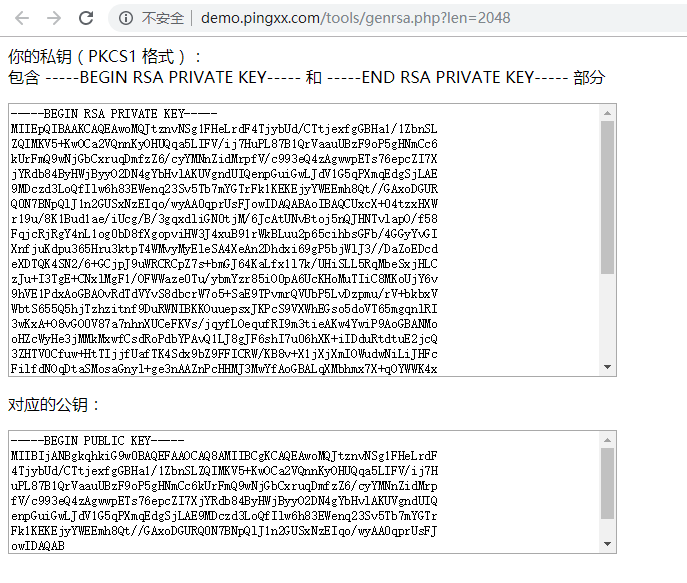

**将商户私钥、商户公钥、Ping++公钥 分别复制保存在文件中备用。**

#### 2.2.5 webhooks异步通知

点击应用名称，进入应用详情页

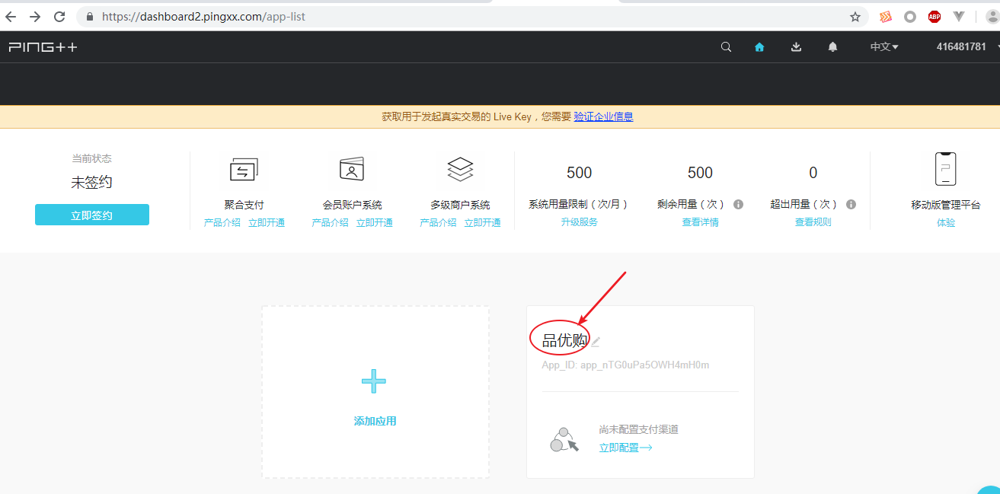

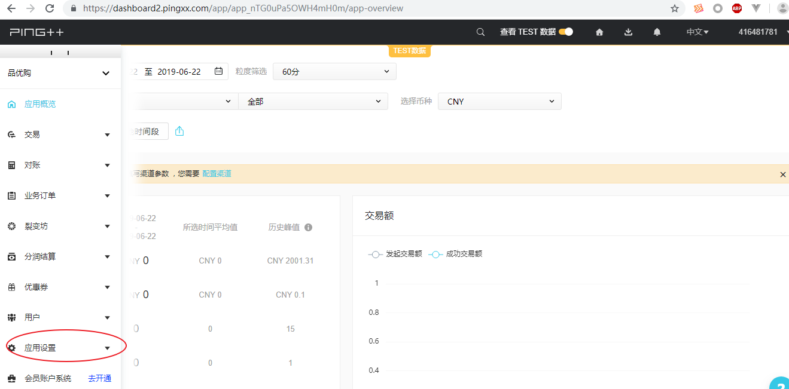

展开左侧菜单，找到应用设置-》webhooks

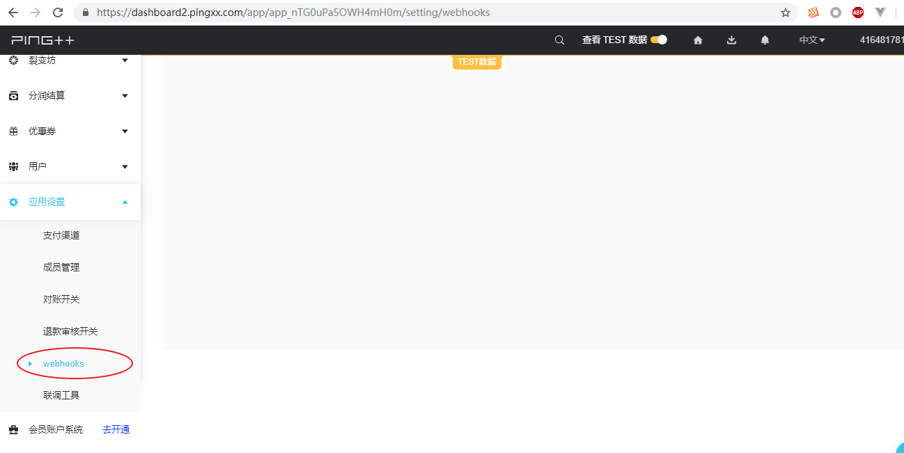

进入webhooks页面，点击右上角添加，添加通知地址

注：此地址，需要是外网可访问地址，否则异步通知会失败。

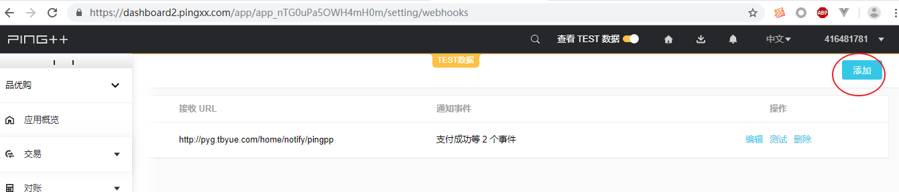

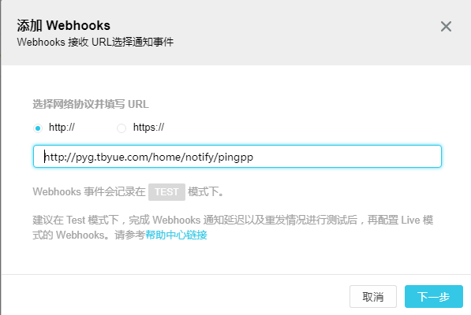

### 2.3 扫码支付

参见扫码支付

概述和流程<https://www.pingxx.com/docs/overview/basic_transaction/charge_refunds/qr?basic_transaction=true>

Server端接入<<https://www.pingxx.com/docs/server/basic_transaction/charge_refunds/qr?basic_transaction=true>>

扫码支付分为  **用户主扫** 和 **用户被扫** 两种支付场景，用户主扫 又分为 **动态码** 和 **固定码** 两种方式。

本解决方案，基于 **用户主扫** 场景的 **动态码** 方式，实现了微信、支付宝同码的扫码支付功能。

流程参考：

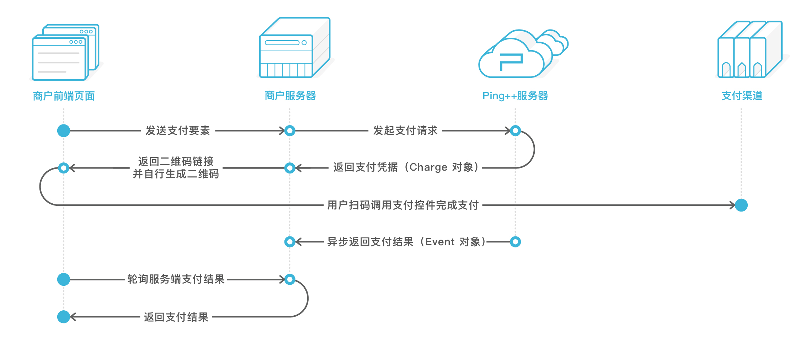

## 3.项目集成聚合支付

### 3.1 数据库设计

基于现有PC网站订单相关数据表，新增 **支付记录表** （仅实现支付功能，未考虑退款等功能）。

#### 3.1.1 支付记录表

```mysql
CREATE TABLE `pyg_pay_log` (
  `id` int(11) unsigned NOT NULL AUTO_INCREMENT,
  `order_sn` varchar(255) DEFAULT NULL COMMENT '订单编号',
  `json` text COMMENT '通知数据',
  `create_time` int(11) DEFAULT NULL,
  `update_time` int(11) DEFAULT NULL,
  `delete_time` int(11) DEFAULT NULL,
  PRIMARY KEY (`id`)
) ENGINE=InnoDB DEFAULT CHARSET=utf8;
```

#### 3.1.2  创建模型

```
项目目录>  php think make:model common\PayLog;
```

### 3.2 聚合支付

参见api文档：https://www.pingxx.com/api

基础交易 -- Charges支付

Webhooks回调

附录--支付渠道属性值

...

#### 3.2.1 服务器环境部署

项目目录下，执行以下命令，安装ping++功能包，用于聚合支付

```php
composer require pingplusplus/pingpp-php
```

ping++功能说明地址：<https://github.com/PingPlusPlus/pingpp-php>

项目目录下，执行以下命令，安装qr-code功能包，用于生产二维码

```
composer require endroid/qr-code
```

二维码功能地址：<https://github.com/endroid/qr-code>

#### 3.2.2  生成支付二维码

控制器文件 application/home/controller/Order.php 中 save 方法

创建订单成功后，展示支付方式页面之前，定义扫码支付链接，生成二维码图片，用于支付页面展示

```php
public function save()
{
	//创建订单代码开始
	//...
	//创建订单代码结束
	
	//二维码图片中的支付链接（本地项目自定义链接，传递订单id参数）
    //$url = url('/home/order/qrpay', ['id'=>$order->order_sn], true, true);
    //用于测试的线上项目域名 http://pyg.tbyue.com
    $url = url('/home/order/qrpay', ['id'=>$order->order_sn, 'debug'=>'true'], true, "http://pyg.tbyue.com");
    //生成支付二维码
    $qrCode = new \Endroid\QrCode\QrCode($url);
    //二维码图片保存路径（请先将对应目录结构创建出来，需要具有写权限）
    $qr_path = '/uploads/qrcode/'.uniqid(mt_rand(100000,999999), true).'.png';
    //将二维码图片信息保存到文件中
    $qrCode->writeFile('.' . $qr_path);
    $this->assign('qr_path', $qr_path);
    
    //展示支付页面
    //...
}

```

视图文件 application/home/view/order/pay.html中

在 <div class="checkout py-container  pay">  标签内部，增加以下**需增加代码**部分

```html
<div class="checkout py-container  pay">
	<!--其他代码-->
	<!--需增加的代码开始-->
    <div class="qrpay">
        <div class="step-tit">
            <h5>扫码付(支持支付宝、微信)</h5>
        </div>
        <div class="step-cont">
            
        </div>
    </div>
    <!--需增加的代码结束-->
    <!--其他代码-->
</div>
```

#### 3.2.3 ping++信息配置

将商户私钥文件(比如命名为 pingpp_rsa_private_key.pem )，移动到项目public目录下

配置文件 application/config.php中，新增以下配置项

- 异步通知的回调地址是填写在平台上，不是支付宝那样写在配置里

```php
	//ping++聚合支付
    'pingpp' => [
        'api_key' => 'sk_test_KOGmH8SSuzrDOmLiDCzX9eX9',//test_key 或 live_key
        'app_id' => 'app_nTG0uPa5OWH4mH0m',// 应用app_id
        'private_key_path' => './pingpp_rsa_private_key.pem' //商户私钥文件路径
    ],
```


#### 3.2.4 扫码支付功能

控制器文件 application/home/controller/Order.php中

创建qrpay方法，完成扫码支付功能（对应于支付二维码中的链接地址）

```php
	//扫码支付
    public function qrpay()
    {
        // 获取客户端的 User-Agent 字符串，用于判断用户使用的浏览器或应用环境
        $agent = request()->server('HTTP_USER_AGENT');
        //判断扫码支付方式
        if ( strpos($agent, 'MicroMessenger') !== false ) {
            // 微信内置浏览器：微信扫码
            $pay_code = 'wx_pub_qr';
        }else if (strpos($agent, 'AlipayClient') !== false) {
            //支付宝内置浏览器：支付宝扫码
            $pay_code = 'alipay_qr';
        }else{
            //支付宝内置浏览器：默认为支付宝扫码支付
            $pay_code = 'alipay_qr';
        }
        //接收订单id参数
        $order_sn = input('id');
        //创建支付请求
        $this->pingpp($order_sn,$pay_code);
    }
```

创建pingpp方法，用于发起支付请求到ping++

```php
	//发起ping++支付请求
    public function pingpp($order_sn,$pay_code)
    {
        //查询订单信息
        $order = \app\common\model\Order::where('order_sn', $order_sn)->find();
        //ping++聚合支付
        \Pingpp\Pingpp::setApiKey(config('pingpp.api_key'));// 设置 API Key
        \Pingpp\Pingpp::setPrivateKeyPath(config('pingpp.private_key_path'));// 设置私钥
        \Pingpp\Pingpp::setAppId(config('pingpp.app_id'));
        $params = [
            'order_no'  => $order['order_sn'],
            'app'       => ['id' => config('pingpp.app_id')],
            'channel'   => $pay_code,
            'amount'    => $order['order_amount'],
            'client_ip' => '127.0.0.1',
            'currency'  => 'cny',
            'subject'   => 'Your Subject',//自定义标题
            'body'      => 'Your Body',//自定义内容
            'extra'     => [],
        ];
        if($pay_code == 'wx_pub_qr'){
            $params['extra']['product_id'] = $order['id'];
        }
        //创建Charge对象
        $ch = \Pingpp\Charge::create($params);
        //跳转到对应第三方支付链接
        $this->redirect($ch->credential->$pay_code);die;
    }
```

#### 3.2.5 异步通知

根据 2.2.5 添加的异步通知地址，创建对应控制器方法，

比如Notify控制器(application/home/controller/Notify.php)， pingpp方法

思路：

接收参数，验证签名

验签成功，则修改订单状态，记录通知信息到支付记录表，返回响应成功码

验签失败，返回响应失败码

```php
<?php

namespace app\home\controller;

use think\Controller;

class Notify extends Controller
{
    //ping++异步通知 (webhooks)
    public function pingpp()
    {
        try{
            //请求体为JSON格式的字符串，需要使用file_get_contents("php://input") 接收参数
            $params = file_get_contents("php://input");
            //获取请求头信息，用于获取签名
            $headers = \Pingpp\Util\Util::getRequestHeaders();
            // 签名在头部信息的 x-pingplusplus-signature 字段
            $signature = isset($headers['X-Pingplusplus-Signature']) ? $headers['X-Pingplusplus-Signature'] : null;
            //获取ping++公钥用于签名
            $pub_key_path = "./pingpp_rsa_public_key.pem";
            $pub_key_contents = file_get_contents($pub_key_path);
            //验证签名
            $result = openssl_verify($params, base64_decode($signature), $pub_key_contents, 'sha256');
            if ($result === 1) {
                // 验证通过
                $event = json_decode($params, true);
                // 对异步通知做处理
                if (!isset($event['type'])) {
                    header($_SERVER['SERVER_PROTOCOL'] . ' 400 Bad Request');
                    exit("fail");
                }
                switch ($event['type']) {
                    case "charge.succeeded":
                        // 开发者在此处加入对支付异步通知的处理代码
                        //修改订单状态
                        $order_sn = $event['data']['object']['order_no'];
                        $order = \app\common\model\Order::where('order_sn', $order_sn)->find();
                        if(empty($order)){
                            header($_SERVER['SERVER_PROTOCOL'] . ' 404 Not Found');
                            exit("fail");
                        }
                        $order->order_status = 1;//已付款、待发货
                        $order->pay_code = $event['data']['object']['channel'];
                        $order->pay_name = $event['data']['object']['channel'] == 'wx_pub_qr' ? '微信支付' : '支付宝';
                        $order->save();
                        \app\common\model\PayLog::create(['order_sn' => $order_sn, 'json' => $params]);
                        header($_SERVER['SERVER_PROTOCOL'] . ' 200 OK');
                        break;
                    case "refund.succeeded":
                        // 开发者在此处加入对退款异步通知的处理代码
                        header($_SERVER['SERVER_PROTOCOL'] . ' 200 OK');
                        break;
                    default:
                        header($_SERVER['SERVER_PROTOCOL'] . ' 400 Bad Request');
                        break;
                }
            } elseif ($result === 0) {
                http_response_code(400);
                echo 'verification failed';
                exit;
            } else {
                http_response_code(400);
                echo 'verification error';
                exit;
            }
        }catch (\Exception $e){
            $msg = $e->getMessage();
            http_response_code(500);
            echo $msg;
            exit;
        }
    }
}

```

#### 3.2.5 支付结果轮询

控制器文件 application/home/controller/Order.php 中新增status 方法

用于查询订单状态

```php
	//查询订单状态
    public function status()
    {
        //接收订单编号
        $order_sn = input('order_sn');
        //查询订单状态
        /*$order_status = \app\common\model\Order::where('order_sn', $order_sn)->value('order_status');
        return json(['code' => 200, 'msg' => 'success', 'data'=>$order_status]);*/
        //通过线上测试
        $res = curl_request("http://pyg.tbyue.com/home/order/status/order_sn/{$order_sn}");
        echo $res;die;
    }
```

视图页面application/home/view/order/pay.html 新增js代码

用于轮询订单状态

```html
<script>
		$(function(){
			//轮询， 查询支付状态
			var order_sn = "{$order_sn}";
			var timer = setInterval(function(){
				$.ajax({
					"url":"{:url('home/order/status')}",
					"type":"post",
					"data":"order_sn=" + order_sn,
					"dataType":"json",
					"success":function(res){
						if(res.code == 200 && res.data == 1){
							clearInterval(timer);
							location.href = "{:url('home/order/payresult')}?order_sn=" + order_sn;
						}
					}
				});
			}, 1000);
		})
	</script>
```

支付结果页面 Order控制器

```php
public function payresult()
    {
        $order_sn = input('order_sn');
        $order = \app\common\model\Order::where('order_sn', $order_sn)->find();
        if(empty($order)){
            return view('payfail', ['msg' => '订单编号错误']);
        }else{
            return view('paysuccess', ['pay_name' => $order->pay_name, 'order_amount'=>$order['order_amount'], 'order' => $order]);
        }
    }
```


### 3.3 支付流程演示

订单提交成功，支付页面显示支付二维码

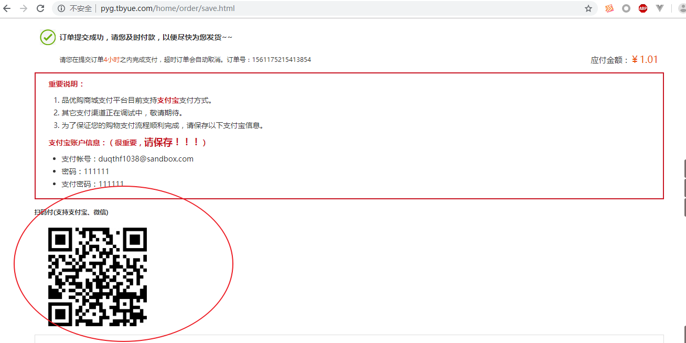

打开手机支付宝或者手机微信扫一扫，扫描图中二维码

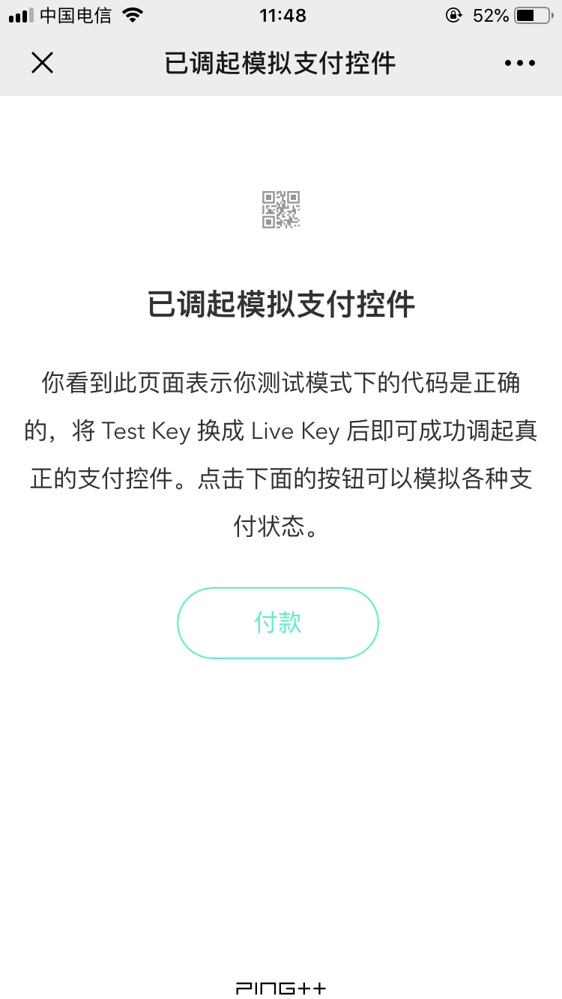


点击 **付款** ，模拟 **付款成功** 状态， ping++平台会调用项目的webhooks异步通知接口。

 

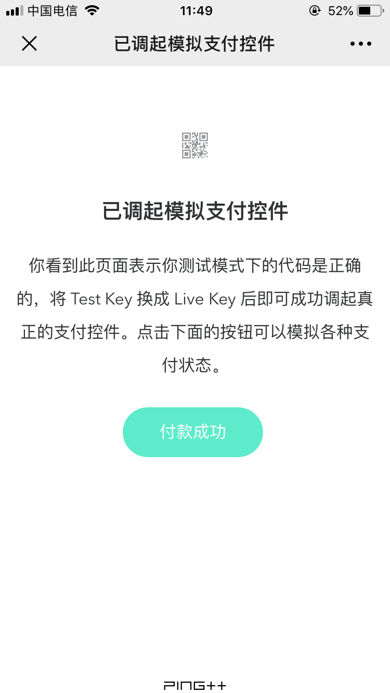

订单表数据： 订单状态order_status 为1，表示支付成功。

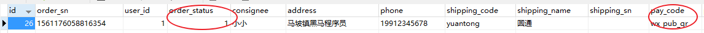

支付记录表：新增了订单对应支付记录

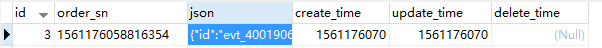

PC浏览器页面 跳转到 支付结果 页面


## 4.总结

聚合支付，是融合了多方支付通道的平台，相对于支付宝、微信等第三方支付平台而言，聚合支付属于在第三方支付平台基础上，进行了技术融合的第四方平台。

本解决方案，是基于PC网站，集成聚合支付中的扫码支付方式，实现支付宝、微信同码的一种基础方案。

主要实现步骤为：开通聚合支付服务（真实环境需要开通第三方支付渠道），配置开发信息，项目集成。

项目集成又包含：生成支付二维码，扫码支付请求ping++的创建change对象接口、处理异步通知、支付结果轮询等。

