# 分布式全文搜索解决方案

- [分布式全文搜索解决方案](#分布式全文搜索解决方案)
  - [1.解决方案介绍](#1解决方案介绍)
    - [1.1 三大数据系统](#11-三大数据系统)
      - [1.1.1 **关系型数据库**](#111-关系型数据库)
      - [1.1.2 **hadoop生态**](#112-hadoop生态)
      - [1.1.3 **搜索引擎**](#113-搜索引擎)
    - [1.2 基于ES的分布式搜索技术架构](#12-基于es的分布式搜索技术架构)
  - [2.软件安装](#2软件安装)
    - [2.1 安装JDK](#21-安装jdk)
      - [2.1.1 下载安装JDK](#211-下载安装jdk)
      - [2.1.2 配置环境变量](#212-配置环境变量)
      - [2.1.3 测试-查看JDK版本](#213-测试-查看jdk版本)
    - [2.2 安装Elasticsearch](#22-安装elasticsearch)
      - [2.2.1 下载安装](#221-下载安装)
      - [2.2.2 配置Path环境变量](#222-配置path环境变量)
      - [2.2.3 启动elasticsearch](#223-启动elasticsearch)
      - [2.2.4 目录解读](#224-目录解读)
      - [2.2.5（选装）安装Elasticsearch-Head](#225选装安装elasticsearch-head)
    - [2.3 安装Elasticsearch-php](#23-安装elasticsearch-php)
    - [2.4 配置php.ini](#24-配置phpini)
  - [3.ElasticSearch基本使用](#3elasticsearch基本使用)
    - [3.1 基本概念](#31-基本概念)
      - [3.1.1 节点与集群](#311-节点与集群)
      - [3.1.2 索引](#312-索引)
    - [3.2 基本使用](#32-基本使用)
      - [3.2.1 创建索引](#321-创建索引)
      - [3.2.2 添加文档（索引文档）](#322-添加文档索引文档)
      - [3.2.3 修改文档](#323-修改文档)
      - [3.2.4 删除文档](#324-删除文档)
    - [3.3 封装工具类](#33-封装工具类)
  - [4.商品搜索功能](#4商品搜索功能)
    - [4.1 搜索规则](#41-搜索规则)
    - [4.2 创建商品全量索引](#42-创建商品全量索引)
    - [4.3 搜索](#43-搜索)
      - [4.3.1 页面部分](#431-页面部分)
      - [4.3.2 控制器部分](#432-控制器部分)
      - [4.3.3 搜索逻辑部分](#433-搜索逻辑部分)
      - [4.3.4 ES分页类](#434-es分页类)
    - [4.4 商品文档维护](#44-商品文档维护)
  - [5.总结](#5总结)


## 1.解决方案介绍

ElasticSearch是一个基于RESTful web接口的分布式全文搜索引擎。

本解决方案是基于Mysql数据库 、 Hadoop生态（可选）、 ElasticSearch搜索引擎三大数据系统实现一个分布式全文搜索系统。

主要包括数据接入、数据索引和全文搜索3个模块。适用于各种项目的各种搜索场景。

### 1.1 三大数据系统

####  1.1.1 **关系型数据库**

用于对商品，用户等各种数据进行结构化存储。 关系型数据库对于事务性非常高的OLTP[^1]操作(比如订单，结算等)支持良好。

[^1]: On-Line Transaction Processing联机事务处理，也称为面向交易的处理

主选：mysql数据库

#### 1.1.2 **hadoop生态**

> hadoop详细历史背景介绍了解：https://zhuanlan.zhihu.com/p/54994736
> > 讲解了hadoop与lucene的区别  

[Hadoop](https://baike.baidu.com/item/Hadoop)是一个由Apache基金会所开发的[分布式系统](https://baike.baidu.com/item/分布式系统/4905336)基础架构。

Hadoop实现了一个[分布式文件系统](https://baike.baidu.com/item/分布式文件系统/1250388)（Hadoop Distributed File System），简称HDFS。

Hadoop的框架最核心的设计就是：HDFS和MapReduce。HDFS为海量的数据提供存储，而MapReduce是一个基于HDFS的上层分布式计算框架则为海量的数据提供计算。


hadoop是数据仓库主要的载体，除了备份关系型数据库的所有版本，还存储用户行为，点击，曝光，互动等海量日志数据，hadoop对于数据分析，数据挖掘等OLAP[^2]操作支持比关系型数据库更加具有扩展性和稳定性。

[^2]:On-Line Analytical Processing联机分析处理


Hive，基于Hadoop的一个[数据仓库](https://baike.baidu.com/item/数据仓库/381916)工具，可以将结构化的数据文件映射为一张数据库表，并提供简单的sql查询功能。

HBase，Hadoop的一个子项目，是一个分布式的、面向列的开源数据库。

Spark：也是一种计算框架，内存型的，比MapReduce快100倍，专为大规模数据处理而设计的快速通用的计算引擎，可以在 Hadoop 文件系统中并行运行，作为对 Hadoop 的补充。


#### 1.1.3 **搜索引擎**

 以elasticsearch和solr为代表。搜索引擎是获取信息最高效的途径，几乎成为各类网站，应用的基础标配设施(地位仅次于数据库)。

ElasticSearch是一个基于Lucene的搜索服务器。它提供了一个分布式多用户能力的全文搜索引擎，基于RESTful web接口。Elasticsearch是用Java开发的，并作为Apache许可条款下的开放源码发布，是当前流行的企业级搜索引擎。设计用于[云计算](https://baike.baidu.com/item/云计算/9969353)中，能够达到实时搜索，稳定，可靠，快速，安装使用方便。

- Lucene：是一个高性能的全文搜索库，是Hadoop数据系统的前身，创始人第一个项目作站内检索推广项目的。
- Lucene：是 Java 编写的全文检索引擎核心库（底层实现），提供了完整的索引和检索 API，但需要自己开发封装。Elasticsearch：基于 Lucene 的开源搜索引擎（开箱即用），是目前最流行的全文检索方案（lucene只是底层实现，es是对lucene的封装）

### 1.2 基于ES的分布式搜索技术架构

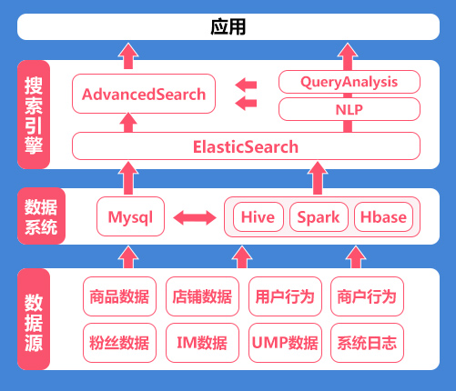 

1. 如何让 ES 和 Hadoop 协同工作？
   1. 使用 elasticsearch-hadoop 连接
      1. 让 Hive、Pig、Spark、MapReduce 等 Hadoop 工具读写 Elasticsearch 数据
      2. 实现 ES 与 HDFS 数据互通
      3. 支持 Spark SQL 直接查询 ES 中的数据
   2. 使用 Hive + ES-Hadoop 外部表
      1. 可以在 Hive 中创建一个指向 Elasticsearch 的外部表，就可以用hive的SQL查询ES数据了


## 2.软件安装

### 2.1 安装JDK

ElasticSearch是用JAVA语言开发的，其运行需要安装JDK。

JDK (Java Development Kit)  ，是整个Java的核心，包括了Java运行环境（Java Runtime Envirnment），一堆Java工具和Java基础的类库(rt.jar)。

#### 2.1.1 下载安装JDK

下载地址<https://www.oracle.com/technetwork/java/javase/downloads/index.html>

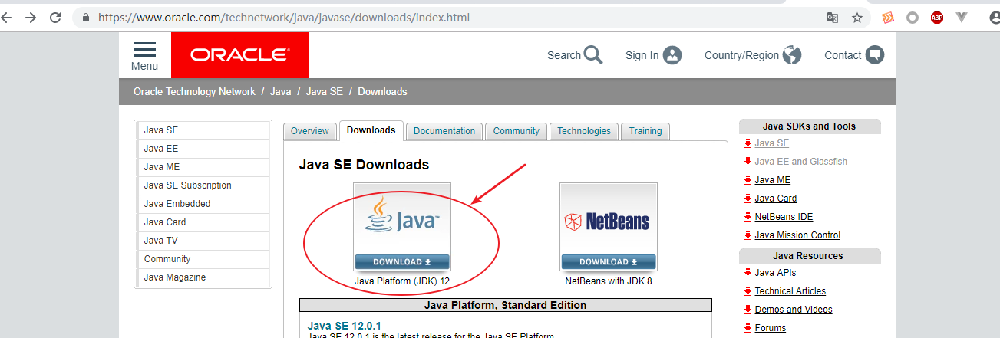

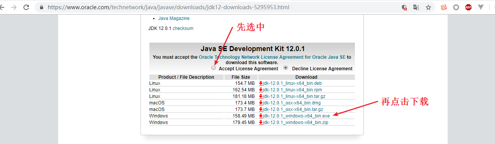

安装：双击 软件 打开安装界面

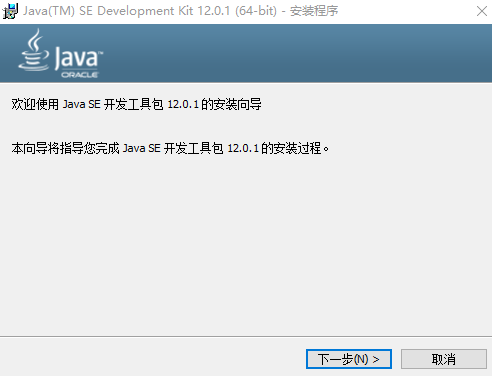 

点击下一步 进入选择安装目录界面

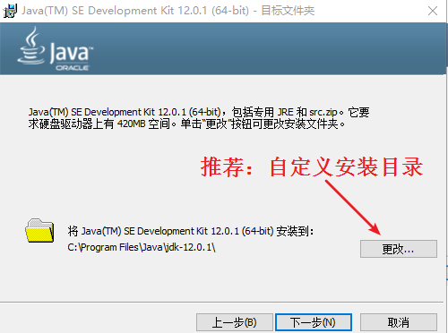 

点击更改 自定义安装目录

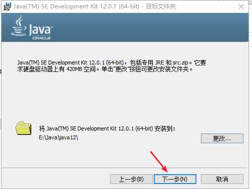 

点击 下一步  进行安装

 

等待，出现以下界面，则安装完成，点击关闭即可。

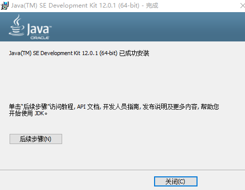 

#### 2.1.2 配置环境变量

配置 JAVA_HOME环境变量

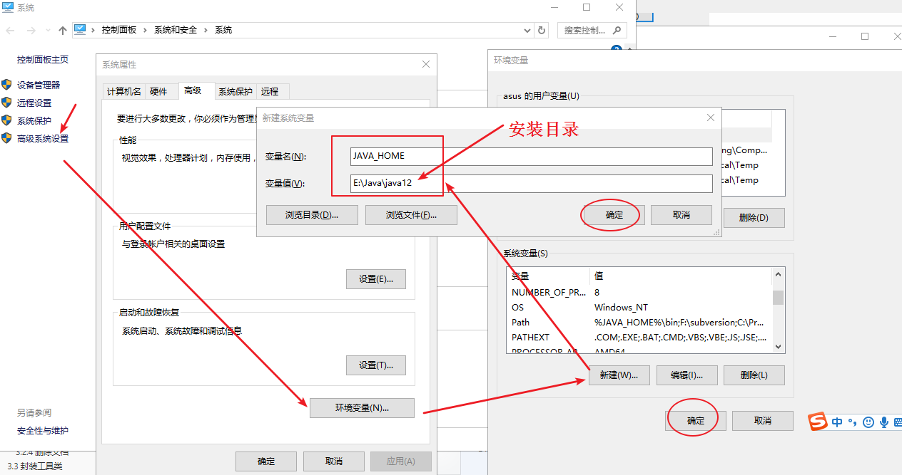


配置Path环境变量

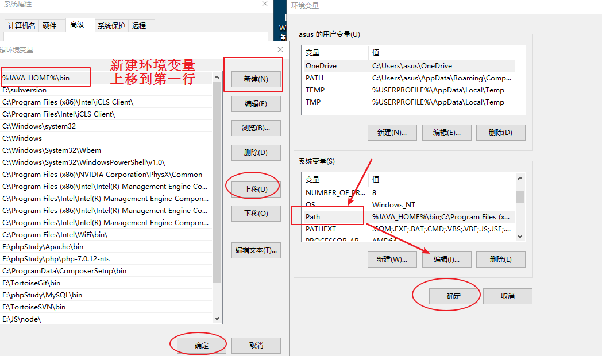

#### 2.1.3 测试-查看JDK版本

打开命令行窗口，输入`java -version`查看JDK版本

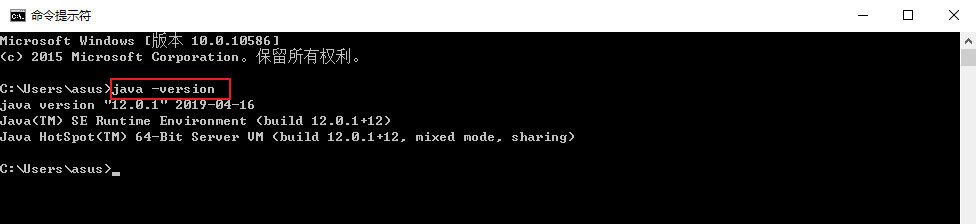


出现以上界面，说明安装成功。


### 2.2 安装Elasticsearch

权威指南<https://www.elastic.co/guide/cn/elasticsearch/guide/current/index.html>	

#### 2.2.1 下载安装

下载地址<https://www.elastic.co/downloads>

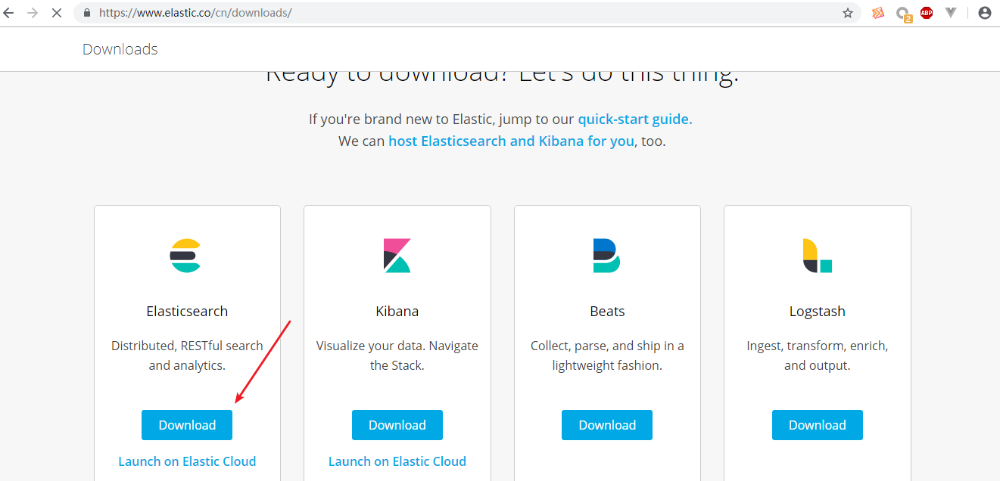


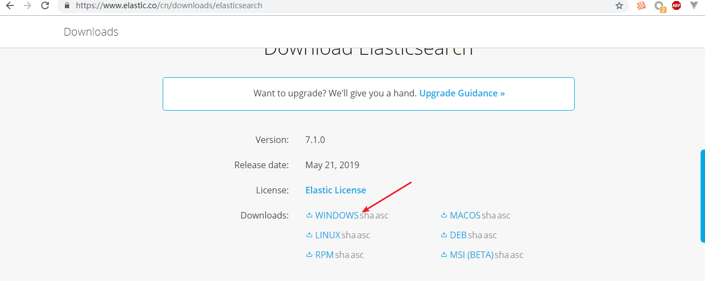

解压

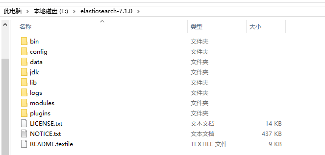 

#### 2.2.2 配置Path环境变量

(bin目录)

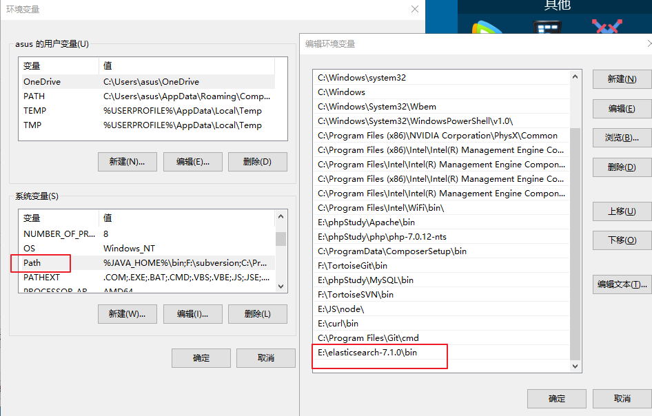

#### 2.2.3 启动elasticsearch

打开命令行窗口  执行命令 elasticsearch -d  启动elasticsearch

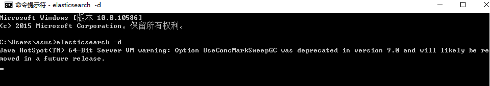

注：该命令行窗口 不要关闭。

浏览器打开 http://localhost:9200

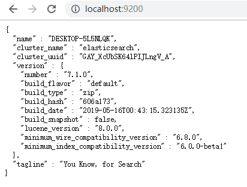  

出现以上界面，则启动成功。

#### 2.2.4 目录解读

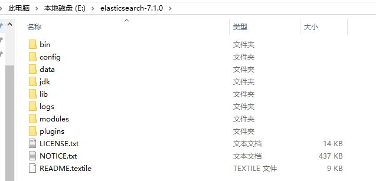 


- bin：启动文件

- config：配置文件

  - log4j2.properties：日志配置文件
  - jvm.options：java虚拟机的配置
  - elasticsearch.yml：es的配置文件

- data：索引数据目录

- lib：相关类库Jar包

- logs：日志目录

- modules：功能模块

- plugins：插件

  

#### 2.2.5（选装）安装Elasticsearch-Head

elasticsearch-head是一个用于浏览ElasticSearch集群并与其进行交互的Web前端项目，对ES集群项目进行可视化管理。

GitHub托管地址：<https://github.com/mobz/elasticsearch-head>

下载并解压：

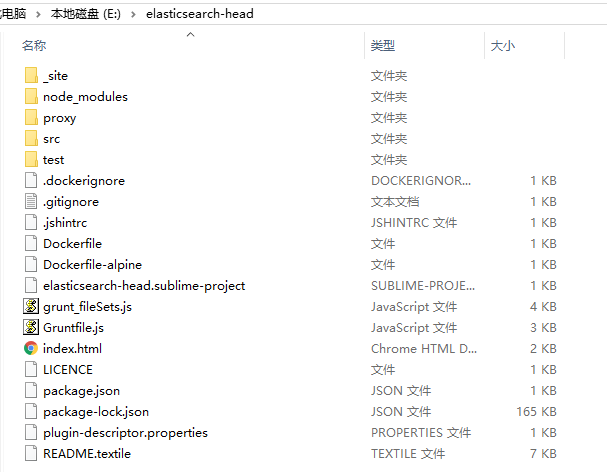 

安装：打开命令行，切换到Elasticsearch-Head目录，执行以下命令

```
npm install
```

启动：打开命令行，切换到Elasticsearch-Head目录，执行以下命令

```
npm run start
```

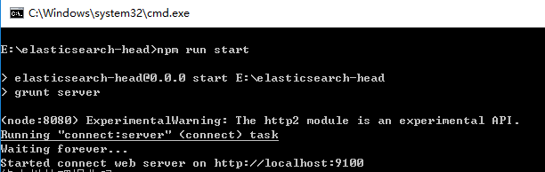 

启动成功后，可通过http://localhost:9100进行访问

由于跨域（Elasticsearch位于9200端口），需要添加配置： E:\elasticsearch-7.1.0\config\elasticsearch.yml中

```
#新添加的配置行
http.cors.enabled: true
http.cors.allow-origin: "*"
```

重新启动

访问效果：

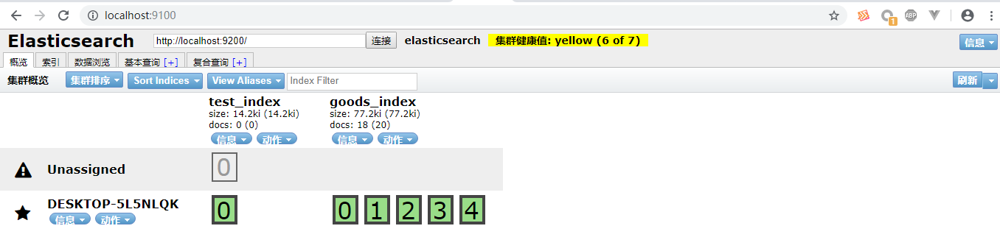


### 2.3 安装Elasticsearch-php

<https://github.com/elastic/elasticsearch-php>

使用composer安装：

在项目目录下，执行以下命令

```php
composer require elasticsearch/elasticsearch
```

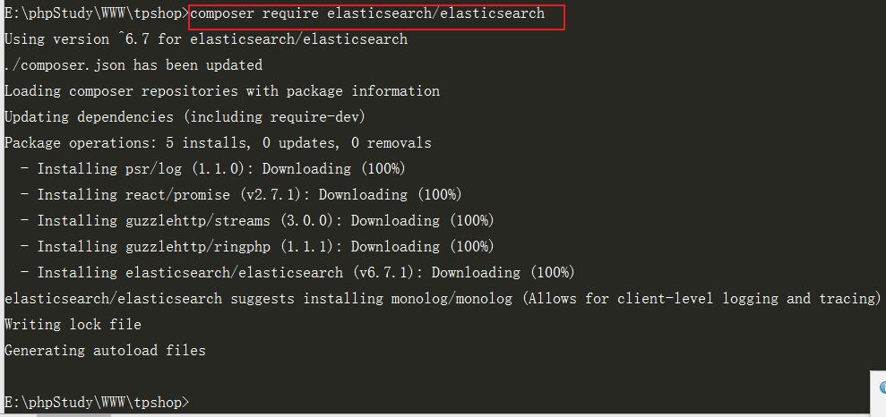

### 2.4 配置php.ini

配置php.ini的sys_temp_dir 

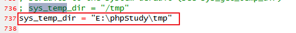 

否则，使用过程中可能会出现以下报错

 

## 3.ElasticSearch基本使用

### 3.1 基本概念

#### 3.1.1 节点与集群

Elastic 本质上是一个分布式数据库，允许多台服务器协同工作，每台服务器可以运行多个 Elastic 实例。

单个 Elastic 实例称为一个节点（node）。一组节点构成一个集群（cluster）。

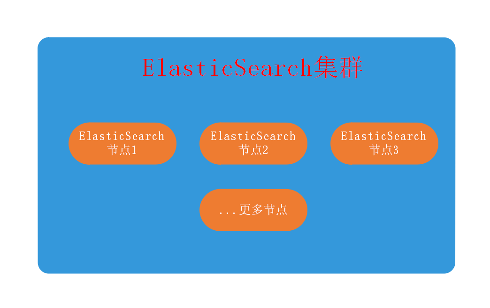

#### 3.1.2 索引

在Elasticsearch中存储数据的行为就叫做**索引(indexing)**

在Elasticsearch中，文档归属于一种**类型(type)**,而这些类型存在于**索引(index)**中

类比传统关系型数据库：

```
Relational DB -> Databases -> Tables -> Rows -> Columns
Elasticsearch -> Indices   -> Types  -> Documents -> Fields
```

Elasticsearch集群可以包含多个**索引(indices)**（数据库）

每一个索引可以包含多个**类型(types)**（表）

每一个类型包含多个**文档(documents)**（行）

然后每个文档包含多个**字段(Fields)**（列）。

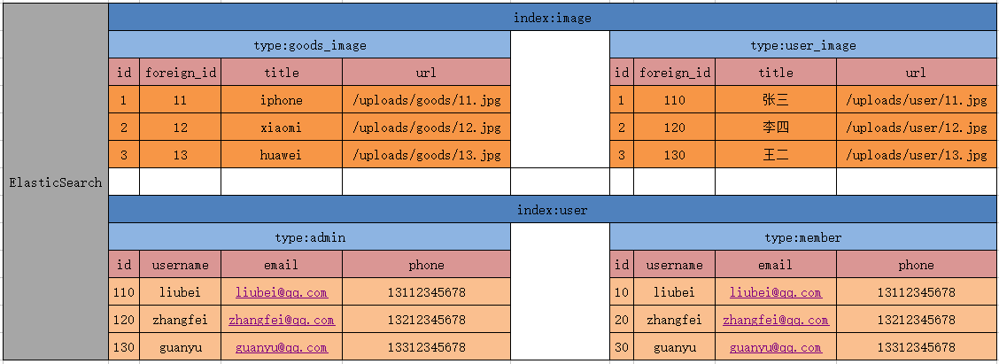


### 3.2 基本使用

#### 3.2.1 创建索引

```php
$es = \Elasticsearch\ClientBuilder::create()->setHosts(['127.0.0.1:9200'])->build();
$params = [
    'index' => 'test_index'
];
$r = $es->indices()->create($params);
dump($r);die;
```

预期结果：

```
array(3) {
  ["acknowledged"] => bool(true)
  ["shards_acknowledged"] => bool(true)
  ["index"] => string(10) "test_index"
}
```

#### 3.2.2 添加文档（索引文档）

```php
$es = \Elasticsearch\ClientBuilder::create()->setHosts(['127.0.0.1:9200'])->build();
$params = [
    'index' => 'test_index',
    'type' => 'test_type',
    'id' => 100,
    'body' => ['id'=>100, 'title'=>'PHP从入门到精通', 'author' => '张三']
];

$r = $es->index($params);
dump($r);die;
```

预期结果：

```
array(8) {
  ["_index"] => string(10) "test_index"
  ["_type"] => string(9) "test_type"
  ["_id"] => string(3) "100"
  ["_version"] => int(1)
  ["result"] => string(7) "created"
  ["_shards"] => array(3) {
    ["total"] => int(2)
    ["successful"] => int(1)
    ["failed"] => int(0)
  }
  ["_seq_no"] => int(0)
  ["_primary_term"] => int(1)
}
```

#### 3.2.3 修改文档

```php
$es = \Elasticsearch\ClientBuilder::create()->setHosts(['127.0.0.1:9200'])->build();
$params = [
    'index' => 'test_index',
    'type' => 'test_type',
    'id' => 100,
    'body' => [
        'doc' => ['id'=>100, 'title'=>'ES从入门到精通', 'author' => '张三']
    ]
];

$r = $es->update($params);
dump($r);die;
```

预期结果：

```
array(8) {
  ["_index"] => string(10) "test_index"
  ["_type"] => string(9) "test_type"
  ["_id"] => string(3) "100"
  ["_version"] => int(2)
  ["result"] => string(7) "updated"
  ["_shards"] => array(3) {
    ["total"] => int(2)
    ["successful"] => int(1)
    ["failed"] => int(0)
  }
  ["_seq_no"] => int(1)
  ["_primary_term"] => int(1)
}
```

#### 3.2.4 删除文档

```php
$es = \Elasticsearch\ClientBuilder::create()->setHosts(['127.0.0.1:9200'])->build();
$params = [
    'index' => 'test_index',
    'type' => 'test_type',
    'id' => 100,
];

$r = $es->delete($params);
dump($r);die;
```

预期结果：

```
array(8) {
  ["_index"] => string(10) "test_index"
  ["_type"] => string(9) "test_type"
  ["_id"] => string(3) "100"
  ["_version"] => int(3)
  ["result"] => string(7) "deleted"
  ["_shards"] => array(3) {
    ["total"] => int(2)
    ["successful"] => int(1)
    ["failed"] => int(0)
  }
  ["_seq_no"] => int(2)
  ["_primary_term"] => int(1)
}
```


### 3.3 封装工具类

封装操作es的工具类：项目目录/extends/tools/es/MyElasticsearch.php

```php
<?php
namespace tools\es;

use Elasticsearch\ClientBuilder;

class MyElasticsearch
{
    //ES客户端链接
    private $client;

    /**
     * 构造函数
     * MyElasticsearch constructor.
     */
    public function __construct()
    {
        $params = array(
            '127.0.0.1:9200'
        );
        $this->client = ClientBuilder::create()->setHosts($params)->build();
    }

    /**
     * 判断索引是否存在
     * @param string $index_name
     * @return bool|mixed|string
     */
    public function exists_index($index_name = 'test_ik')
    {
        $params = [
            'index' => $index_name
        ];

        try {
            return $this->client->indices()->exists($params);
        } catch (\Elasticsearch\Common\Exceptions\BadRequest400Exception $e) {
            $msg = $e->getMessage();
            $msg = json_decode($msg,true);
            return $msg;
        }
    }

    /**
     * 创建索引
     * @param string $index_name
     * @return array|mixed|string
     */
    public function create_index($index_name = 'test_ik') { // 只能创建一次
        $params = [
            'index' => $index_name,
            'body' => [
                'settings' => [
                    'number_of_shards' => 5,
                    'number_of_replicas' => 0
                ]
            ]
        ];

        try {
            return $this->client->indices()->create($params);
        } catch (\Elasticsearch\Common\Exceptions\BadRequest400Exception $e) {
            $msg = $e->getMessage();
            $msg = json_decode($msg,true);
            return $msg;
        }
    }

    /**
     * 删除索引
     * @param string $index_name
     * @return array
     */
    public function delete_index($index_name = 'test_ik') {
        $params = ['index' => $index_name];
        $response = $this->client->indices()->delete($params);
        return $response;
    }

    /**
     * 添加文档
     * @param $id
     * @param $doc ['id'=>100, 'title'=>'phone']
     * @param string $index_name
     * @param string $type_name
     * @return array
     */
    public function add_doc($id,$doc,$index_name = 'test_ik',$type_name = 'goods') {
        $params = [
            'index' => $index_name,
            'type' => $type_name,
            'id' => $id,
            'body' => $doc
        ];

        $response = $this->client->index($params);
        return $response;
    }

    /**
     * 判断文档存在
     * @param int $id
     * @param string $index_name
     * @param string $type_name
     * @return array|bool
     */
    public function exists_doc($id = 1,$index_name = 'test_ik',$type_name = 'goods') {
        $params = [
            'index' => $index_name,
            'type' => $type_name,
            'id' => $id
        ];

        $response = $this->client->exists($params);
        return $response;
    }

    /**
     * 获取文档
     * @param int $id
     * @param string $index_name
     * @param string $type_name
     * @return array
     */
    public function get_doc($id = 1,$index_name = 'test_ik',$type_name = 'goods') {
        $params = [
            'index' => $index_name,
            'type' => $type_name,
            'id' => $id
        ];

        $response = $this->client->get($params);
        return $response;
    }

    /**
     * 更新文档
     * @param int $id
     * @param string $index_name
     * @param string $type_name
     * @param array $body ['doc' => ['title' => '苹果手机iPhoneX']]
     * @return array
     */
    public function update_doc($id = 1,$index_name = 'test_ik',$type_name = 'goods', $body=[]) {
        // 可以灵活添加新字段,最好不要乱添加
        $params = [
            'index' => $index_name,
            'type' => $type_name,
            'id' => $id,
            'body' => $body
        ];

        $response = $this->client->update($params);
        return $response;
    }

    /**
     * 删除文档
     * @param int $id
     * @param string $index_name
     * @param string $type_name
     * @return array
     */
    public function delete_doc($id = 1,$index_name = 'test_ik',$type_name = 'goods') {
        $params = [
            'index' => $index_name,
            'type' => $type_name,
            'id' => $id
        ];

        $response = $this->client->delete($params);
        return $response;
    }

    /**
     * 搜索文档 (分页，排序，权重，过滤)
     * @param string $index_name
     * @param string $type_name
     * @param array $body
     * $body = [
            'query' => [
                'bool' => [
                    'should' => [
                        [
                            'match' => [
                                'cate_name' => [
                                    'query' => $keywords,
                                    'boost' => 4, // 权重大
                                ]
                            ]
                        ],
                        [
                            'match' => [
                                'goods_name' => [
                                    'query' => $keywords,
                                    'boost' => 3,
                                ]
                            ]
                        ],
                        [
                            'match' => [
                                'goods_introduce' => [
                                    'query' => $keywords,
                                    'boost' => 2,
                                ]
                            ]
                        ]
                    ],
                ],
            ],
            'sort' => ['id'=>['order'=>'desc']],
            'from' => $from,
            'size' => $size
    ];
     * @return array
     */
    public function search_doc($index_name = "test_ik",$type_name = "goods",$body=[]) {
        $params = [
            'index' => $index_name,
            'type' => $type_name,
            'body' => $body
        ];

        $results = $this->client->search($params);
        return $results;
    }

}
```


## 4.商品搜索功能

### 4.1 搜索规则

可根据**关键词**对**商品名称、商品介绍、商品分类**进行**全文搜索**

### 4.2 创建商品全量索引

项目目录/application/cli/controller/Es.php

```php
<?php

namespace app\cli\controller;

use think\Controller;
use think\Request;

class Es extends Controller
{
    /**
     * 创建商品索引并导入全部商品文档
     * cd public
     * php index.php /cli/Es/createAllGoodsDocs
     */
    public function createAllGoodsDocs()
    {
        try{
            //实例化ES工具类
            $es = new \tools\es\MyElasticsearch();
            //创建索引
            if($es->exists_index('goods_index')) $es->delete_index('goods_index');

            $es->create_index('goods_index');
            $i = 0;
            while(true){
                //查询商品数据 每次处理1000条
                $goods = \app\common\model\Goods::with('category')->field('id,goods_name,goods_desc, goods_price,goods_logo,cate_id')->limit($i, 1000)->select();
                if(empty($goods)){
                    //查询结果为空，则停止
                    break;
                }
                //添加文档
                foreach($goods as $v){
                    unset($v['cate_id']);
                    $es->add_doc($v['id'],$v, 'goods_index', 'goods_type');
                }
                $i += 1000;
            }
            die('success');
        }catch (\Exception $e){
            $msg = $e->getMessage();
            die($msg);
        }
    }

}

```

切换到public目录 执行命令

```
php index.php /cli/Es/createAllGoodsDocs
```

注：其中，使用了封装的ES工具类 ： 项目目录/extends/tools/es/MyElasticsearch.php


### 4.3 搜索

#### 4.3.1 页面部分

项目目录/application/home/view/layout.html中，修改搜索框表单如下：

```html
<form action="{:url('home/goods/index')}" method="get" class="sui-form form-inline">
    <!--searchAutoComplete-->
    <div class="input-append">
        <input type="text" id="autocomplete" class="input-error input-xxlarge" name="keywords" value="{$Request.param.keywords}" />
        <button class="sui-btn btn-xlarge btn-danger" type="submit">搜索</button>
    </div>
</form>
```

#### 4.3.2 控制器部分

项目目录/application/home/controller/Goods.php中，修改index方法如下：

```php
public function index($id=0)
    {
        //接收参数
        $keywords = input('keywords');
        if(empty($keywords)){
            //获取指定分类下商品列表
            if(!preg_match('/^\d+$/', $id)){
                $this->error('参数错误');
            }
            //查询分类下的商品
            $list = \app\common\model\Goods::where('cate_id', $id)->order('id desc')->paginate(10);
            //查询分类名称
            $category_info = \app\common\model\Category::find($id);
            $cate_name = $category_info['cate_name'];
        }else{
            try{
                //从ES中搜索
                $list = \app\home\logic\GoodsLogic::search();
                $cate_name = $keywords;
            }catch (\Exception $e){
                $this->error('服务器异常');
            }
        }
        return view('index', ['list' => $list, 'cate_name' => $cate_name]);
    }
```

#### 4.3.3 搜索逻辑部分

项目目录/application/home/logic/GoodsLogic.php中，代码如下

```php
<?php

namespace app\home\logic;

use think\Controller;

class GoodsLogic extends Controller
{
    public static function search(){
        //实例化ES工具类
        $es = new \tools\es\MyElasticsearch();
        //计算分页条件
        $keywords = input('keywords');
        $page = input('page', 1);
        $page = $page < 1 ? 1 : $page;
        $size = 10;
        $from = ($page - 1) * $size;
        //组装搜索参数体
        $body = [
            'query' => [
                'bool' => [
                    'should' => [
                        [ 'match' => [ 'cate_name' => [
                            'query' => $keywords,
                            'boost' => 4, // 权重大
                        ]]],
                        [ 'match' => [ 'goods_name' => [
                            'query' => $keywords,
                            'boost' => 3,
                        ]]],
                        [ 'match' => [ 'goods_desc' => [
                            'query' => $keywords,
                            'boost' => 2,
                        ]]],
                    ],
                ],
            ],
            'sort' => ['id'=>['order'=>'desc']],
            'from' => $from,
            'size' => $size
        ];
        //进行搜索
        $results = $es->search_doc('goods_index', 'goods_type', $body);
        //获取数据
        $data = array_column($results['hits']['hits'], '_source');
        $total = $results['hits']['total']['value'];
        //分页处理
        $list = \tools\es\EsPage::paginate($data, $size, $total);
        return $list;
    }
}
/**
 * 为什么ES取出的分页数据，还要再进行分页处理？
 * 通俗回答：
 * 1. from + size 查询 ES	厨师只端出“第3盘”菜（当前页）和total总数量
 * 2. EsPage::paginate()	服务员告诉你：“一共10盘菜，这是第3盘”，并递上菜单翻页按钮----给用户的接口展示
 */
```

#### 4.3.4 ES分页类

借鉴模型的分页查询方法，封装用于ES搜索的分页类： 项目目录/extends/tools/es/EsPage.php

```php
<?php
namespace tools\es;

use think\Config;

class EsPage
{
    // 分页处理
    // $results: 搜索结果
    // $listRows: 每页数量size
    // $simple: 总数量
    // $config: 全局的分页配置
    public static function paginate($results, $listRows = null, $simple = false, $config = [])
    {
        if (is_int($simple)) {
            $total  = $simple;
            $simple = false;
        }else{
            $total = null;
            $simple = true;
        }

        if (is_array($listRows)) {
            $config   = array_merge(Config::get('paginate'), $listRows);
            $listRows = $config['list_rows'];
        } else {
            $config   = array_merge(Config::get('paginate'), $config);
            $listRows = $listRows ?: $config['list_rows'];
        }

        /** @var Paginator $class */
        /**分页驱动器支持内置驱动器和自定义类名
         * 如：$config['type'] = 'bootstrap';  或 $config['type'] = '\my\Paginator\MyPage';
         * $config['type'] = 'Bootstrap';
         * $class = '\\think\\paginator\\driver\\Bootstrap'; 或  $class = '\my\Paginator\MyPage'
         */
        $class = false !== strpos($config['type'], '\\') ? $config['type'] : '\\think\\paginator\\driver\\' . ucwords($config['type']);
        /**
         * $config是函数形参：如果你手动传了 'page' => 3，就用你传的；
         * 否则，让当前的分页驱动类（如 Bootstrap）自己去 $_GET 中读取页码参数（比如 ?p=3 或 ?page=3）
         */
        $page  = isset($config['page']) ? (int) $config['page'] : call_user_func([
            $class,
            'getCurrentPage',
        ], $config['var_page']);

        $page = $page < 1 ? 1 : $page;

        $config['path'] = isset($config['path']) ? $config['path'] : call_user_func([$class, 'getCurrentPath']);

        return $class::make($results, $listRows, $page, $total, $simple, $config);
    }
}
```


商品列表页 商品分类展示位置

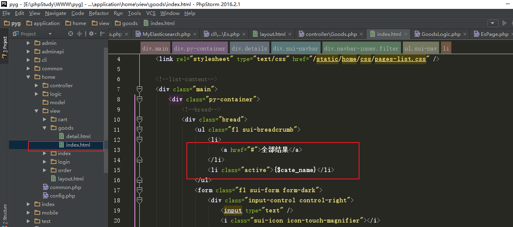

### 4.4 商品文档维护

新增商品后，在ES中添加商品文档

更新商品后，在ES中修改商品文档

删除商品后，在ES中删除商品文档


使用MVC的后台测试，则在admin/model/Goods.php中

使用前后端分离接口api测试，则写在common/model/Goods.php中


项目目录/application/admin/model/Goods.php中，init方法代码如下：

```php
protected static function init()
    {
        //实例化ES工具类
        $es = new \tools\es\MyElasticsearch();
        //设置新增回调
        self::afterInsert(function($goods)use($es){
            //添加文档
            $doc = $goods->visible(['id', 'goods_name', 'goods_desc', 'goods_price'])->toArray();
            $doc['cate_name'] = $goods->category->cate_name;
            $es->add_doc($goods->id, $doc, 'goods_index', 'goods_type');
        });
        //设置更新回调
        self::afterUpdate(function($goods)use($es){
            //修改文档
            $doc = $goods->visible(['id', 'goods_name', 'goods_desc', 'goods_price', 'cate_name'])->toArray();
            $doc['cate_name'] = $goods->category->cate_name;
            $body = ['doc' => $doc];
            $es->update_doc($goods->id, 'goods_index', 'goods_type', $body);
        });
        //设置删除回调
        self::afterDelete(function($goods)use($es){
            //删除文档
            $es->delete_doc($goods->id, 'goods_index', 'goods_type');
        });
    }
```


## 5.总结

分布式全文搜索解决方案：是基于Mysql数据库 、 Hadoop生态（可选）、 ElasticSearch搜索引擎三大数据系统实现一个分布式全文搜索系统。

Mysql数据库用于结构化存储项目数据。

Hadoop生态用于备份关系型数据库的所有版本，还存储用户行为，点击，曝光，互动等海量日志数据，用于数据分析处理。

ElasticSearch搜索引擎用于对Mysql或者Hadoop提供的数据进行索引和全文搜索。

其中核心功能，包括全量创建索引、增量创建索引、实时同步数据（文档的curd）、全文搜索等。