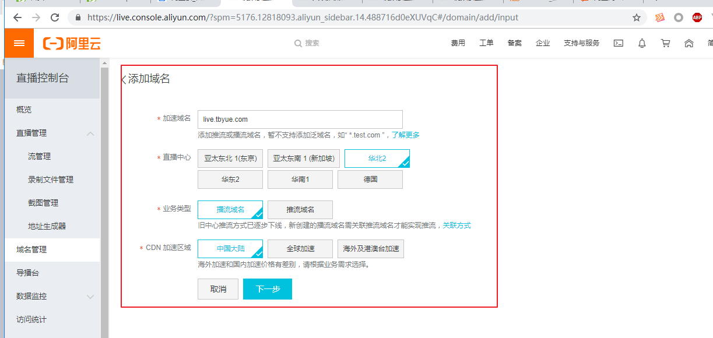
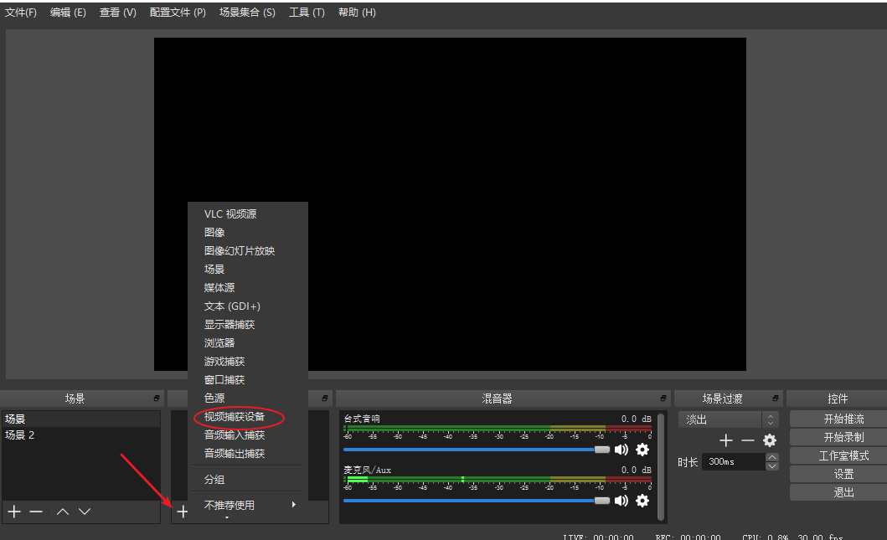

# 直播电商解决方案

- [直播电商解决方案](#直播电商解决方案)
	- [1.解决方案介绍](#1解决方案介绍)
		- [1.1 视频直播](#11-视频直播)
		- [1.2 直播电商](#12-直播电商)
	- [2.开通直播服务](#2开通直播服务)
		- [2.1 开通服务](#21-开通服务)
		- [2.2 域名配置](#22-域名配置)
			- [2.2.1 添加域名](#221-添加域名)
			- [2.2.2配置CNAME](#222配置cname)
			- [2.2.3 关联域名](#223-关联域名)
			- [2.2.4 配置鉴权](#224-配置鉴权)
		- [2.3 PC端推流与播流](#23-pc端推流与播流)
	- [3.商城项目集成直播功能](#3商城项目集成直播功能)
		- [3.1 数据库设计](#31-数据库设计)
			- [3.1.1 直播表](#311-直播表)
			- [3.1.2 直播商品表](#312-直播商品表)
			- [3.1.3 创建模型](#313-创建模型)
		- [3.2 主播的直播管理](#32-主播的直播管理)
			- [3.2.0 直播工具类](#320-直播工具类)
			- [3.2.1 直播列表](#321-直播列表)
			- [3.2.2 创建直播](#322-创建直播)
			- [3.2.3 直播详情](#323-直播详情)
			- [3.2.4 修改直播（略）](#324-修改直播略)
			- [3.2.5 删除直播（略）](#325-删除直播略)
			- [3.2.6 开始直播](#326-开始直播)
		- [3.3 粉丝观看直播](#33-粉丝观看直播)
			- [3.3.1 首页直播入口](#331-首页直播入口)
			- [3.3.2 直播房间](#332-直播房间)
	- [4.总结](#4总结)


## 1.解决方案介绍

直播电商解决方案，是基于常规电商网站，引入视频直播服务，打造新型营销模式的一种电商解决方案。

### 1.1 视频直播

视频直播服务（ApsaraVideo Live）是基于领先的内容接入、分发网络和大规模分布式实时转码技术打造的音视频直播平台，提供便捷接入、高清流畅、低延迟、高并发的音视频直播服务。

工作原理：


1. 通过采集设备将直播流推送至直播中心，推送的视频流通过CDN边缘节点进行加速保证上行传输的稳定性。移动端的推流工具可以使用提供的直播推流SDK进行开发。
2. 视频流推送至直播中心后，可按需对视频流进行转码，录制，截图，安全审核等处理。
3. 处理好的视频流通过CDN内容分发网络下发至观众的设备中进行播放。移动端的播放设备可以使用提供的播放器SDK进行开发。
4. 直播视频除了可以进行转码截图等操作外，还可以进行直播转点播的操作，将录制下来的视频转至点播系统中再进行点播播放。

### 1.2 直播电商

​		直播电商，在很大的程度上打破了消费者对货物看不见、摸不着、感受不到的现状，而相比图片和文字，视频的信息维度更丰富，使得消费者能够更为直观并且全面的了解产品及服务信息，降低试错成本，让消费者融入到购物场景中。

​		直播电商，实现了主播和消费者可以实时问答这一互动方式，除了融入一定社交属性外，还可以极大提升购物体验，并且还能引起消费者们对商品的购买兴趣，可以更好的吸引顾客前来购物。

​		由于目前直播行业的火爆，可以带来相当可观的人气流量，尤其是一些明星、网红这一类自带粉丝流量加入主播阵营，更是为商家引来大量的人气流量，可以立竿见影的实现精准营销。

## 2.开通直播服务

很多平台都提供了直播云服务，比如阿里云视频直播、七牛云视频直播等。以下使用阿里云视频直播服务。

本节内容摘抄自官方文档：<https://help.aliyun.com/product/29949.html?spm=a2c4g.11186623.6.540.260e68125y4E7p>

### 2.1 开通服务

参见官网文档：<https://help.aliyun.com/document_detail/86866.html>

1. 在[阿里云官网](https://cn.aliyun.com/?spm=a3c0i.l28958zh.692950.6.7ce9181dkV1C4B)，选择**视频服务 > 视频直播**。

   

2. 单击 **立即开通**进入开通页面。
   

3. 如果未实名认证，请您先进行实名认证。

   登录 [阿里云官网](https://cn.aliyun.com/?spm=a3c0i.l28958zh.692950.6.7ce9181dkV1C4B)，注册账号并完善个人信息和实名认证（个人或企业均可）。
   

   

   **说明** 您可以登录阿里云控制台，在 **账号管理 > 实名认证**中完成实名认证。

4. 实名认证开通后，进入直播控制台。

5. 在云产品开通页，选择计费方式按使用流量计费或按带宽峰值计费，勾选我已阅读并同意《视频直播服务协议》并单击立即开通，控制台即可使用。


   

### 2.2 域名配置

#### 2.2.1 添加域名

参见官方文档：<https://help.aliyun.com/document_detail/98296.html?spm=a2c4g.11186623.6.575.75c14b6cYoIjhc>

**前提条件**

- 如果您要进行国内的直播活动，需提供已备案的域名才可使用直播服务。
- 如果您的域名还未备案，请先将域名[备案](https://beian.aliyun.com/?spm=5176.doc25418.416540.19.8SzHLY)。


**操作步骤**

1. 登录[视频直播控制台](https://live.console.aliyun.com/#/live/domains)。

2. 单击

   **域名管理** > **添加域名**

   

   **说明** 您需要分别添加 **推流域名**和 **播流域名**。

3. 配置播流域名，并单击下一步。

   

   

   说明

   - **直播中心**：指直播中心所在地域，直播**推流域名**与**播流域名**必须在一个地域。
   - **业务类型**：指域名的加速类型，**推流域名**与**播流域名**分别对应推流加速与播流加速。
   - **CDN加速区域**：指域名可执行加速的地域。

   **播流域名**添加成功。请您重复以上步骤添加**推流域名**。

4. 单击**返回域名列表**。

5. 单击**添加域名**。

6. 配置推流域名，并单击下一步。

   **推流域名**添加成功。

   

--域名管理三步走

添加播流域名：



#### 2.2.2配置CNAME

参见官方文档：<https://help.aliyun.com/document_detail/98297.html?spm=a2c4g.11186623.6.577.40ee4689TUjVIU>

如果您想启用视频直播加速服务，需要将您的域名指向阿里云视频直播分配的CNAME地址，这样访问加速域名的请求才能转发到视频直播节点 上，达到加速效果。本文档以您的域名在阿里云解析（原万网）为例。

此外，您还可以参考DNSPod或新网配置的方法解析。

**说明** 添加域名后，您需要分别对推流域名和播流域名进行CNAME解析才可使用域名。

- CNAME记录（CNAME Record）

  CNAME( Canonical Name )即别名，可以用来把一个域名解析到另一个域名，再由另一个域名提供 IP 地址。

  例如，您有一台服务器上存放了很多资料，您使用`docs.example.com`去访问这些资源，但又希望通过`documents.example.com`也能访问到这些资源，那么您可以在您的DNS解析服务商添加一条CNAME记录，将`documents.example.com`指向`docs.example.com`，添加该条CNAME记录后，所有访问`documents.example.com`的请求都会被转到`docs.example.com`，获得相同的内容。

- CNAME域名

  接入视频直播，在阿里云控制台添加域名后，您会得到一个阿里云视频直播给您分配的CNAME域名。该CNAME域名的形式为`*.*kunlun*.com`。 您需要在您的DNS解析服务商添加一条CNAME记录，将自己的加速域名指向这个`*.*kunlun*.com`的域名。记录生效后，域名解析的工作就正式转向视频直播服务，该域名所有的请求都将转向视频直播节点，达到加速效果。

**操作步骤**

1. 登录 [视频直播控制台](https://live.console.aliyun.com/?spm=5176.2020520001.1001.56.Fcjldw#live/domains)。

2. 单击 **域名管理**。

3. 选择所需的播流域名，并复制域名对应的CNAME。

   

   

   **说明** CNAME 栏中有感叹号（！）提示的说明还没有配置CNAME信息。请您按照以下步骤配置CNAME信息。

4. 添加CNAME记录。

   1. 登录 [域名控制台](https://netcn.console.aliyun.com/core/domain/list?spm=a2c4g.11186623.2.6.6d5a596dbOJz82)。

   2. 单击 **域名列表**。

   3. 在域名列表中找到您直播域名对应的主域名，并单击 **解析**。
      

   4. 单击 **添加记录**。
      

   5. 添加CNAME记录。

       

      - 在 **记录类型** 中，选择 **CNAME**。

      - 主机记录

        即播流域名的前缀。例如：

        | 如您的加速域名为... | 主机记录为... |
        | :------------------ | :------------ |
        | testcdn.aliyun.com  | testcdn       |
        | www.aliyun.com      | www           |
        | aliyun.co           | @             |
        | *.aliyun.com        | *             |

      - **记录值** 即复制的CNAME值。

   6. 单击 **确定**，配置CNAME完毕。

5. 播流域名进行CNAME解析之后，您需要按照同样的步骤对推流域名进行CNAME解析。

   说明

   解析参数设置后，CNAME 域名解析正常会很快生效。

   - CNAME配置生效时间：新增CNAME记录会实时生效，而修改CNAME记录需要最多72小时生效时间。
   - 添加时如遇添加冲突，可考虑换一个加速域名，或参考 [解析记录互斥规则](https://help.aliyun.com/knowledge_detail/39787.html)自行调整冲突的记录。
   - 配置完CNAME后，由于状态更新约有10分钟延迟，阿里云视频直播控制台的域名列表页可能仍提示**未配置CNAME**，请忽略。

**验证CNAME配置是否已生效**

配置CNAME后，不同的DNS服务商CNAME配置生效的时间也不同。您可以 `ping`或 `dig`您所添加的加速域名，如果被转向 `*.*kunlun*.com`，即表示CNAME配置已经生效，视频直播推流域名和播流域名也已生效。


另外我们还提供域名在[DNSPod配置CNAME](https://help.aliyun.com/document_detail/101490.html#concept-t1x-pzz-ggb)和[新网配置CNAME](https://help.aliyun.com/document_detail/101493.html#concept-urd-lb1-hgb)。


#### 2.2.3 关联域名

参见官方文档：<https://help.aliyun.com/document_detail/98299.html?spm=a2c4g.11186623.6.580.5340418d3eBG6v>

推流域名与播放域名添加成功后，您需要进行域名的关联才能进行推流和播流操作。

1. 登录 [视频直播控制台](https://live.console.aliyun.com/#live/domains)。
2. 单击 **域名管理**。
3. 选择所需的 **播流域名**，并单击右侧的 **域名配置**。
   
4. 在 **基本配置 > 推流信息** 中，选择 **推流信息** 并单击 **未配置**。
   
5. 在推流域名下拉列表中，选择所需的 **推流域名** 并单击 **确定**。
   
6. 如果需要关联多个推流域名，请您单击页面下方的 **添加推流信息** 进行关联。
   


#### 2.2.4 配置鉴权

参见官方文档： <https://help.aliyun.com/document_detail/98300.html?spm=a2c4g.11186623.6.581.51685577xoL7TH>

URL 鉴权功能旨在保护用户站点的内容资源不被非法站点下载盗用。鉴权功能默认为开启状态，建议您保持默认开启状态，否则会出现直播被盗录、盗播的风险。

当鉴权功能开启时，有默认鉴权和自定义鉴权两种鉴权方式，您可按需选择默认鉴权或自定义鉴权。

- 默认鉴权

  默认鉴权中，鉴权key随机分配，有效时长 30 分钟。超过有效时间，鉴权失效。

  1. 登录 [视频直播控制台](https://home.console.aliyun.com/new#/)。

  2. 单击**直播管理** > **地址生成器** > **边缘推流**。

     **说明** 边缘推流可以把视频推流至最优 CDN 节点，以减少卡顿、拉流缓慢的问题。建议您优先选择 **边缘推流**。

  3. 选择需要鉴权的播流域名、关联的推流域名，输入相应的AppName和StreamName，并单击开始生成。

     

     

     **说明** 您可以按需对推流域名或播放域名进行鉴权。建议您对推流域名和播流域名都进行鉴权，以减少直播被盗录、盗播的风险。

     您可以获得鉴权的推流地址和播流地址。
     

- 自定义鉴权（查看鉴权信息）

  如不采用默认配置，您也可以对鉴权主KEY、副KEY、有效时长、AppName和StreamName等进行自定义，然后再生成鉴权URL进行推流。

  1. 登录视频直播控制台。

  2. 单击 **域名管理**，分别选择您想要自定义鉴权的推流域名和播流域名，并单击 **域名配置**。
     

  3. 单击访问控制，选择URL 鉴权，并单击修改配置。

      

     您还可以在 **直播管理 > 地址生成器 > 边缘推流** 中，单击 **播流域名** 和 **关联的推流域名** 下方的 **去修改** 快速进入自定义鉴权页面。
     

  4. 在URL 鉴权页面，对主KEY、副KEY、有效时长进行自定义配置，并单击确定。

      

     

     **说明** **主KEY** 是计算加密字符串的一个密钥。若 **主KEY** 执行更换，所有使用 **主KEY** 的地址会立即失效。 **副KEY** 的作用是，当 **主KEY** 需要更换时，使用 **主KEY** 的推流或播放地址不会马上中断， **副KEY** 做为更换的桥接。

  5. 在**直播管理** > **地址生成器** > **边缘推流**中，选择需要鉴权的播流域名、关联的推流域名，输入相应的AppName和StreamName，并单击开始生成。

     

     您可以获得鉴权的推流地址和播流地址。

### 2.3 PC端推流与播流

参见官方文档：<https://help.aliyun.com/document_detail/98333.html?spm=a2c4g.11186623.6.584.488a132eBFtJyb>

视频直播使用边缘推流，优先将视频推流至最优CDN节点，保证您访问的都是最佳的上行网络，减少因上行传输带来的卡顿、拉流缓慢的问题。请您按照以下步骤进行推流和播流操作。

**前提条件**

推流和播放工具

- 推流工具：下载并安装推流工具。本文以使用OBS推流工具为例说明。下载地址见 [OBS官方下载地址](https://obsproject.com/download?spm=a2c4g.11186623.2.3.FRgTS8)。
- 播放工具：下载并安装播流工具。本文以使用VLC播放器为例说明。下载地址见 [VLC media player官方下载地址](http://www.videolan.org/vlc/?spm=a2c4g.11186623.2.3.HA1ICZ)

**推流**

1. 登录 [视频直播控制台](https://live.console.aliyun.com/#/live/domains)。

2. 单击 **直播管理 > 地址生成器**。

3. 选择您创建的 **播流域名** 和关联的 **推流域名**。

4. 输入 **AppName** 和 **StreamName**。

5. 单击开始生成。

    

   您可以获得推流地址和播流地址。
   

6. 下载并安装OBS推流工具。

   关于OBS推流工具配置及使用，详情参见 [OBS推流工具](https://help.aliyun.com/document_detail/45212.html)。

   您需要将鉴权后的推流地址分两部分输入URL与流秘钥中。

   - **URL**：填写包含**AppName**前的地址，
   - **流名称**：填写包含**StreamName**后的地址。

   以推流地址

   ```
   rtmp://push.aliyunlive.com/app/stream?auth_key=1543302081-0-0-9c6e7c8190c10bdfb3c0
   ```

   为例，

   - URL：填写`rtmp://push.aliyunlive.com/app/`，
   - 流名称：填写`stream?auth_key=1543302081-0-0-9c6e7c8190c10bdfb3c0
     

   

   **说明** 以上推流地址示例由推流域名、AppName、StreamName和鉴权串组成，您需要根据实际情况，替换成您自己的AppName、StreamName和相应的鉴权串。

**播流**

1. 下载并安装VLC播放器。

   关于VLC播放器使用，参见 [VLC播放器](https://help.aliyun.com/document_detail/52142.html?spm=a2c4g.11186623.6.863.5f8d1445E3P7Eh)。

2. 打开VLC播放器。

3. 单击 **媒体 > 打开网络串流(N)。**。
   

4. 根据推流操作**步骤6** 获取播流地址。

5. 在请输入网络URL中，输入播流地址并单击播放。

   以播流地址

   ```
   rtmp://play.aliyunlive.com/app/stream?auth_key=1543300311-0-0-d47ce016332bf280cf275
   ```

   为例，将播流地址复制到URL的输入框并单击播放即可。

    

   

   **说明** 以上播流地址示例由播流域名、AppName、StreamName和鉴权串组成，您需要根据实际情况，替换成您自己的AppName、StreamName和相应的鉴权串。


## 3.商城项目集成直播功能

### 3.1 数据库设计

主播可创建直播计划，并关联直播商品。

#### 3.1.1 直播表

```mysql
CREATE TABLE `pyg_live` (
  `id` int(11) unsigned NOT NULL AUTO_INCREMENT,
  `title` varchar(255) DEFAULT NULL COMMENT '直播间主题',
  `push_url` varchar(255) DEFAULT NULL COMMENT '推流地址: 域名+appname',
  `push_key` varchar(255) DEFAULT NULL COMMENT '推流密钥：streamName+key',
  `start_time` int(11) DEFAULT NULL COMMENT '开始时间',
  `user_id` int(11) DEFAULT NULL,
  `image` varchar(255) DEFAULT NULL COMMENT '封面图',
  `live_url` varchar(255) DEFAULT '0' COMMENT '播流地址',
  `status` tinyint(2) DEFAULT '0' COMMENT '状态 0未开始 1直播中 2已结束',
  `create_time` int(11) DEFAULT NULL,
  `update_time` int(11) DEFAULT NULL,
  `delete_time` int(11) DEFAULT NULL,
  PRIMARY KEY (`id`)
) ENGINE=InnoDB AUTO_INCREMENT=24 DEFAULT CHARSET=utf8;
```

#### 3.1.2 直播商品表

```mysql
CREATE TABLE `pyg_live_goods` (
  `id` int(11) unsigned NOT NULL AUTO_INCREMENT,
  `live_id` int(11) DEFAULT NULL COMMENT '直播id',
  `goods_link` text COMMENT '商品链接',
  `goods_id` int(11) DEFAULT NULL COMMENT '商品id',
  `goods_name` varchar(255) DEFAULT NULL COMMENT '商品名称',
  `goods_price` decimal(10,2) DEFAULT NULL COMMENT '商品价格',
  `goods_logo` varchar(255) DEFAULT NULL COMMENT '商品logo图片',
  `create_time` int(11) DEFAULT NULL,
  `update_time` int(11) DEFAULT NULL,
  `delete_time` int(11) DEFAULT NULL,
  PRIMARY KEY (`id`)
) ENGINE=InnoDB AUTO_INCREMENT=11 DEFAULT CHARSET=utf8;
```

#### 3.1.3 创建模型

```
项目目录>  php think make:model common\Live;
项目目录>  php think make:model common\LiveGoods;
```

### 3.2 主播的直播管理

#### 3.2.0 直播工具类

封装直播工具类extend/tools/live/Live.php，用于生成直播推流地址和播流地址。

```php
<?php
namespace tools\live;

class Live
{
    private static $_config = [
        'push_key' => 'XbRqF1xns4',//推流鉴权key
        'live_key' => 'VjsnDLXexT',//播流鉴权key
        'push_domain' => 'rtmp://push.tbyue.com',//推流域名
        'live_domain' => 'http://live.tbyue.com',//播流域名
        'app_name' => 'pyg_live',//自定义应用名称
        'stream_name' => '0',//自定义流名称
        'expire' => 1800 //有效期 秒
    ];

    public static function getUrl($user_id=0, $time=''){
        $res = [];
        self::$_config['stream_name'] = $user_id;
        if(!$time) $time = time();
        $time += self::$_config['expire'];
        $push_sstring = '/' . self::$_config['app_name'] . '/' . self::$_config['stream_name'] . '-' . $time . '-0-0-' . self::$_config['push_key'];
        $live_sstring = '/' . self::$_config['app_name'] . '/' . self::$_config['stream_name'] . '.flv-' . $time . '-0-0-' . self::$_config['live_key'];
        $push_md5 = md5($push_sstring);
        $live_md5 = md5($live_sstring);
        $res['push_url'] = self::$_config['push_domain'] . '/' . self::$_config['app_name'];
        $res['push_key'] = self::$_config['stream_name'] . '?auth_key=' . $time . '-0-0-' . $push_md5;
        $res['live_url'] = self::$_config['live_domain'] . '/' . self::$_config['app_name'] . '/' . self::$_config['stream_name'] . '.flv?auth_key=' . $time . '-0-0-' . $live_md5;
        return $res;
    }
}
```


#### 3.2.1 直播列表

创建Live控制器类

```php
项目目录> php think make:controller home\Live
```

控制器类application/home/controller/Live.php中

继承Base控制器（公共分类信息），构造方法进行登录检测

列表方法查询数据并调用模板：

```php
<?php

namespace app\home\controller;

use think\Controller;
use think\Request;

class Live extends Base
{
    public function __construct(Request $request)
    {
        parent::__construct($request);
        if(!session('?user_info')){
            $this->redirect('home/login/login');
        }
    }

    /**
     * 显示资源列表
     *
     * @return \think\Response
     */
    public function index()
    {
        $user_id = session('user_info.id');
        $list = \app\common\model\Live::where('user_id', $user_id)->order('id desc')->select();
        return view('index', ['list'=>$list]);
    }
}

```

会员中心左侧菜单application/home/view/member_left.html

```html
<!--个人中心 左侧列表-->
<div class="yui3-u-1-6 list">
    <div class="person-info">
        <div class="person-photo"></div>
        <div class="person-account">
            <span class="name">Michelle</span>
            <span class="safe">账户安全</span>
        </div>
        <div class="clearfix"></div>
    </div>
    <div class="list-items">
        <dl>
            <dt><i>·</i> 订单中心</dt>
            <dd><a href="{:url('home/member/myOrder')}">我的订单</a></dd>
            <dd><a href="javascript:;">团购订单</a></dd>
            <dd><a href="javascript:;">本地生活订单</a></dd>
            <dd><a href="javascript:;">我的预售</a></dd>
            <dd><a href="javascript:;">评价晒单</a></dd>
            <dd><a href="javascript:;">取消订单记录</a></dd>
        </dl>
        <dl>
            <dt><i>·</i> 关注中心</dt>
            <dd><a href="javascript:;">关注的商品 </a></dd>
            <dd><a href="javascript:;">关注的店铺 </a></dd>
            <dd><a href="javascript:;">关注的专辑 </a></dd>
            <dd><a href="javascript:;">关注的品牌 </a></dd>
            <dd><a href="javascript:;">关注的活动 </a></dd>
        </dl>
        <dl>
            <dt><i>·</i> 直播中心</dt>
            <dd><a href="{:url('home/live/index')}">我的直播</a></dd>
        </dl>
        <dl>
            <dt><i>·</i> 我的中心</dt>
            <dd><a href="javascript:;">我的收藏</a></dd>
            <dd><a href="javascript:;">我的足迹</a></dd>
        </dl>
        <dl>
            <dt><i>·</i> 特色业务</dt>
            <dd><a href="javascript:;">我的营业厅 </a></dd>
            <dd><a href="javascript:;">通信 </a></dd>
            <dd><a href="javascript:;">定期送 </a></dd>
            <dd><a href="javascript:;">代下单</a></dd>
            <dd><a href="javascript:;">我的回收单</a></dd>
            <dd><a href="javascript:;">节能补贴</a></dd>
            <dd><a href="javascript:;">医药服务 </a></dd>
            <dd><a href="javascript:;">流量加油站</a></dd>
            <dd><a href="javascript:;">黄金托管</a></dd>
        </dl>
        <dl>
            <dt><i>·</i> 客户服务</dt>
            <dd><a href="javascript:;">返修退换货 </a></dd>
            <dd><a href="javascript:;">价格保护 </a></dd>
            <dd><a href="javascript:;">意见建议 </a></dd>
            <dd><a href="javascript:;">购买咨询 </a></dd>
            <dd><a href="javascript:;">交易纠纷 </a></dd>
            <dd><a href="javascript:;">我的发票 </a></dd>
        </dl>
        <dl>
            <dt><i>·</i> 设置</dt>
            <dd><a href="javascript:;">个人信息 </a></dd>
            <dd><a href="{:url('myAddress')}">收货地址</a> </dd>
        </dl>
    </div>
</div>
```


创建视图目录及视图文件 application/home/view/live/index.html

```html

    <title>我的直播</title>
    <link rel="stylesheet" type="text/css" href="/static/home/css/pages-seckillOrder.css" />

    <div id="account">
        <div class="py-container">
            <div class="yui3-g collect">
                <!--左侧列表-->
				{include file="member_left"/}

                <!--右侧主内容-->
                <div class="yui3-u-5-6 goods">

                    <div class="body">
						<div class="">
							<span class="title">全部直播 </span>
							<a href="{:url('create')}" class="sui-btn  btn-info add-new">添加新直播</a>
							<span class="clearfix"></span>
						</div>
                        <div class="goods-list">
                            <ul class="yui3-g" id="goods-list">
								{foreach($list as $v)}
								<li class="yui3-u-1-4">
									<div class="list-wrap">
										<div class="p-img">
											<a href="{:url('read', ['id'=>$v.id])}"></a>
										</div>
										<div class="price">
											<strong><em>{$v.start_time}</em></strong>
										</div>
										<div class="attr">
											<em>{$v.title}</em>
										</div>
										<div class="cu">
											<em><span>惠</span>领优惠券</em>
										</div>
										<div class="operate">
											<a href="javascript:void(0);" class="sui-btn btn-bordered btn-danger">开始直播</a>
											<a href="javascript:void(0);" class="sui-btn btn-bordered">回放</a>
											<a href="javascript:void(0);" class="sui-btn btn-bordered">删除</a>
										</div>
									</div>
								</li>
								{/foreach}
                            </ul>
                        </div>
                    </div>
                </div>
            </div>
        </div>
    </div>

```


#### 3.2.2 创建直播

将资料中的静态资源目录，替换到public/static/home/目录下

页面展示：

控制器类application/home/controller/Live.php中 create方法

```php
public function create()
{
    return view();
}
```

视图目录及文件application/home/view/live/create.html

```html

    <link rel="stylesheet" type="text/css" href="/static/home/css/pages-seckillOrder.css" />

<!--header-->
<div id="account">
    <div class="py-container">
        <div class="yui3-g home">
            <!--左侧列表-->
            {include file="member_left"/}
            <!--右侧主内容-->
            <div class="yui3-u-5-6">
                <div class="body userAddress">
                    <div class="address-title">
                        <span class="title">添加新直播</span>
                        <span class="clearfix"></span>
                    </div>
                    <div class="address-detail">
                        <form action="{:url('save')}" method="post" class="sui-form form-horizontal" enctype="multipart/form-data">
                            <div class="control-group">
                                <label class="control-label">直播主题：</label>
                                <div class="controls">
                                    <input type="text" name="title" class="input-large">
                                </div>
                            </div>
                            <div class="control-group">
                                <label class="control-label">开播时间：</label>
                                <div class="controls">
                                    <input type="text" onfocus="{literal}WdatePicker({ dateFmt: 'yyyy-MM-dd HH:mm:ss' }){/literal}" id="datemin" class="input-text input-large Wdate" style="" name="start_time" value="">
                                </div>
                            </div>
                            <div class="control-group">
                                <label class="control-label">封面图：</label>
                                <div class="controls">
                                    <input type="file" name="image" class="input-large">
                                </div>
                            </div>
                            <div class="control-group">
                                <label class="control-label">[<a href="javascript:;" class="add_input">+</a>]商品链接：</label>
                                <div class="controls">
                                    <input type="text" name="goods_links[]" class="input-large">
                                </div>
                            </div>

                            <div class="control-group">
                                <label class="control-label"></label>
                                <div class="controls">
                                    <button type="submit" class="sui-btn btn-primary">提交按钮</button>
                                </div>
                            </div>
                        </form>
                    </div>
                    <!--新增地址弹出层-->

                </div>
            </div>
        </div>
    </div>
</div>
    <script type="text/javascript" src="/static/home/js/plugins/My97DatePicker/WdatePicker.js"></script>
    <script>
        $(function(){
            $('.add_input').click(function(){
                $sub = $(this).closest('.control-group').clone();
                $sub.find('a').removeClass('add_input').addClass('sub_input').text('-');
                $sub.find('input').val('');
                $(this).closest('.control-group').after($sub);
            });
            $('body').on('click', '.sub_input', function(){
                $(this).closest('.control-group').remove();
            });
        });
    </script>

```

表单提交

控制器类application/home/controller/Live.php中

 save方法保存数据

upload_logo方法上传图片

```php
public function save(Request $request)
    {
        //接收参数 name|start_time|image|goods_ids
        $params = input();
        //鉴权串
        $user_id = session('user_info.id');
        $params['user_id'] = $user_id;
        $params['start_time'] = strtotime($params['start_time']);
        $urls = \tools\live\Live::getUrl($user_id, $params['start_time']);
        $params = array_merge($params, $urls);
        $params['image'] = $this->upload_logo();
        $live = \app\common\model\Live::create($params, true);
        //关联商品
        $live_goods = [];
        foreach($params['goods_links'] as $link){
            $goods_id =Request::create($link)->param('id');
            if(empty($goods_id)){
                preg_match('/\/id\/(\d+)/', $link, $match);
                $goods_id = $match[1];
            }
            $goods = \app\common\model\Goods::find($goods_id);
            if($goods){
                $row['live_id'] = $live->id;
                $row['goods_id'] = $goods->id;
                $row['goods_name'] = $goods->goods_name;
                $row['goods_price'] = $goods->goods_price;
                $row['goods_logo'] = $goods->goods_logo;
                $row['goods_link'] = $link;
                $live_goods[] = $row;
            }
        }
        $live_goods_model = new \app\common\model\LiveGoods();
        $live_goods_model->saveAll($live_goods);
        $this->success('操作成功','home/live/index');
    }

    public function upload_logo()
    {
        //获取文件信息（对象）
        $file = request()->file('image');
        if (empty($file)) {
            //必须上传商品logo图片
            $this->error('必须上传商品logo图片');
        }
        //将文件移动到指定的目录（public 目录下  uploads目录 live目录）
        $dir = ROOT_PATH . 'public' . DS . 'uploads' . DS . 'live';
        if(!is_dir($dir)) mkdir($dir);
        $info = $file->validate(['size' => 5*1024*1024, 'ext' => ['jpg', 'png', 'gif', 'jpeg']])->move($dir);
        if (empty($info)) {
            //上传出错
            $this->error($file->getError());
        }
        //拼接图片的访问路径
        $logo = DS . "uploads" . DS . 'live' . DS . $info->getSaveName();
        \think\Image::open('.' . $logo)->thumb(200,200)->save('.'.$logo);
        return $logo;
    }
```

#### 3.2.3 直播详情

控制器类application/home/controller/Live.php中 read方法

```php
public function read($id)
    {
        $info = \app\common\model\Live::find($id);
        if($info){
            $info['goods'] = \app\common\model\LiveGoods::where('live_id', $id)->select();
        }
        return view('read', ['info' => $info]);
    }
```

视图目录及文件application/home/view/live/read.html

```html

    <title>直播详情</title>
    <link rel="stylesheet" type="text/css" href="/static/home/css/pages-seckillOrder.css" />

    <div id="account">
        <div class="py-container">
            <div class="yui3-g home">
                <!--左侧列表-->
                {include file="member_left"/}

                <!--右侧主内容-->
                <div class="yui3-u-5-6">
                    <div class="body">
                        <div class="order-detail">
                            <h4>直播详情:{$info.title}</h4>
                            <div class="order-bar">
                                
                            </div>
                            <div class="order-state">
                                <p>当前状态：<span class="red">未开始</span> <a href="javascript:void(0);" class="sui-btn btn-bordered btn-danger">开始直播</a></p>
                                <p>开始时间：<span class="red">{$info.start_time}</span></p>
                            </div>
                        </div>
                        <div class="order-info">
                            <h5>直播信息</h5>
                            <p>推流地址：{$info.push_url}</p>
                            <p>推流密钥：{$info.push_key}</p>
                            <p>播流地址：{$info.live_url}</p>
                        </div>
                        <div class="order-goods">
                            <table class="sui-table">
								<thead>
									<th class="center" >商品</th>
									<th class="center" >价格</th>
									<th class="center" >优惠</th>
								</thead>
                             
                                <tbody>
                                    {foreach $info['goods'] as $v}
                                    <tr>
                                        <td>
                                            <div class="typographic">
                                                    <span>{$v.goods_name}</span>
                                            </div>
                                        </td>
                                        <td>
                                            <ul class="unstyled">
                                                <li>¥{$v.goods_price}</li>
                                            </ul>
                                        </td>
                                        <td>无优惠</td>
                                    </tr>
                                    {/foreach}
                                </tbody>
                            </table>
                            <div class="clearfix"></div>
                        </div>
                    </div>
                </div>
            </div>
        </div>
    </div>
```

#### 3.2.4 修改直播（略）

#### 3.2.5 删除直播（略）

#### 3.2.6 开始直播

暂未向网页中集成一键直播软件，需要主播借助于PC端OBS Studio进行直播。

主播可从直播详情页面，查看推流地址和推流密钥


打开直播软件OBS Studio，在设置页面，添加推流地址到服务器栏，添加推流密钥到 串流密钥栏。

文件-》设置-》串流


在软件下方，点击来源 添加，选择视频捕获设备，即可使用摄像头进行视频采集。



点击 右下角 控件中的“开始推流”，立即进行直播。


### 3.3 粉丝观看直播

#### 3.3.1 首页直播入口

控制器application\home\controller\Index.php中index方法

查询直播间信息

```php
<?php
namespace app\home\controller;

use think\Controller;

class Index extends Base
{
    public function index()
    {
        $lives = \app\common\model\Live::order('id desc')->limit(6)->select();
        //渲染模板
         return view('index', ['lives'=>$lives]);
    }
}
```

视图页面application/home/view/index/index.html中

显示直播间信息（<!--直播-->部分和最后的script部分）

```html

	<title>品优购，优质！优质！</title>

	<link rel="stylesheet" type="text/css" href="/static/home/css/pages-JD-index.css" />
	<script type="text/javascript" src="/static/home/js/pages/index.js"></script>

	<!--列表-->
	<div class="py-container">
		<div class="yui3-g SortList">
			<div class="yui3-u Center banerArea">
				<!--banner轮播-->
				<div id="myCarousel" data-ride="carousel" data-interval="4000" class="sui-carousel slide">
					<ol class="carousel-indicators">
						<li data-target="#myCarousel" data-slide-to="0" class="active"></li>
						<li data-target="#myCarousel" data-slide-to="1"></li>
						<li data-target="#myCarousel" data-slide-to="2"></li>
					</ol>
					<div class="carousel-inner">
						<div class="active item">
							<a href="javascript:;">
					    	
					      </a>
						</div>
						<div class="item">
							<a href="javascript:;">
						
					     </a>
						</div>
						<div class="item">
							<a href="javascript:;">
						
						</a>

						</div>
					</div><a href="#myCarousel" data-slide="prev" class="carousel-control left">‹</a><a href="#myCarousel" data-slide="next" class="carousel-control right">›</a>
				</div>
			</div>
			<div class="yui3-u Right">
				<div class="news">
					<h4><em class="fl">品优购快报</em><span class="fr tip">更多 ></span></h4>
					<div class="clearix"></div>
					<ul class="news-list unstyled">
						<li>
							<span class="bold">[特惠]</span>备战开学季 全民半价购数码
						</li>
						<li>
							<span class="bold">[公告]</span>备战开学季 全民半价购数码
						</li>
						<li>
							<span class="bold">[特惠]</span>备战开学季 全民半价购数码
						</li>
						<li>
							<span class="bold">[公告]</span>备战开学季 全民半价购数码
						</li>
						<li>
							<span class="bold">[特惠]</span>备战开学季 全民半价购数码
						</li>
					</ul>
				</div>
				<ul class="yui3-g Lifeservice">
				</ul>
				<div class="ads">
					
				</div>
			</div>
		</div>
	</div>
	<!--推荐-->
	<div class="show">
	</div>
	<!-- 商品排行 -->
	<div class="py-container tabbox">
		<div class="py-container tab">
			<div class="tab-tit" style="text-align:center">
			</div>

		</div>
		<div class="content">
			<ul>
				<li style="display:block;">
				</li>
				<li>
					<div class="img-item">
						<p class="tab-pic">
							<span><a href="javascript:;"></a></span>
						</p>
						<div class="tab-info">
							<div class="info-title">
								<span><a href="javascript:;">【官网价直降1100】Apple iPhone 8 Plus 256GB 银色 移动联通电信4G手机</a></span>
							</div>
							<p class="info-price">定金：¥100.00</p>
						</div>
					</div>
				</li>
				<li>
					<div class="img-item">
						<p class="tab-pic">
							<span><a href="javascript:;"></a></span>
						</p>
						<div class="tab-info">
							<div class="info-title">
								<span><a href="javascript:;">【官网价直降1100】Apple iPhone 8 Plus 256GB 银色 移动联通电信4G手机</a></span>
							</div>
							<p class="info-price">定金：¥100.00</p>
						</div>
					</div>
					<div class="img-item">
						<p class="tab-pic">
							<span><a href="javascript:;"></a></span>
						</p>
						<div class="tab-info">
							<div class="info-title">
								<span><a href="javascript:;">【官网价直降1100】Apple iPhone 8 Plus 256GB 银色 移动联通电信4G手机</a></span>
							</div>
							<p class="info-price">定金：¥100.00</p>
						</div>
					</div>
					<div class="img-item">
						<p class="tab-pic">
							<span><a href="javascript:;"></a></span>
						</p>
						<div class="tab-info">
							<div class="info-title">
								<span><a href="javascript:;">【官网价直降1100】Apple iPhone 8 Plus 256GB 银色 移动联通电信4G手机</a></span>
							</div>
							<p class="info-price">定金：¥100.00</p>
						</div>
					</div>
					<div class="img-item">
						<p class="tab-pic">
							<span><a href="javascript:;"></a></span>
						</p>
						<div class="tab-info">
							<div class="info-title">
								<span><a href="javascript:;">【官网价直降1100】Apple iPhone 8 Plus 256GB 银色 移动联通电信4G手机</a></span>
							</div>
							<p class="info-price">定金：¥100.00</p>
						</div>
					</div>

				</li>
			</ul>
		</div>
	</div>
	<!--直播-->
	<div class="live">
		<div class="py-container">
			<div class="title">
				<h3 class="fl">直播</h3>
				<b class="border"></b>
				<!--<a href="javascript:;" class="fr tip changeBnt" id="xxlChg"><i></i>换一换</a>-->
			</div>
			<div class="bd">
				<ul class="clearfix yui3-g" id="">
					{foreach $lives as $live}
					<li class="yui3-u-1-3" data-id="{$live.id}" style="cursor:pointer;overflow: hidden;height: 250px;">
						<div class="left" style="float:left;width:250px;position: relative;">
							
							<div style="position: absolute;left:0;bottom:0;width:250px;font-size: 18px;">{$live.title}</div>
						</div>
						<div class="right" style="float:right;">
							<div class="up" style="height: 125px;">
								
							</div>
							<div class="down" style="height: 125px;">
								
							</div>
						</div>
					</li>
					{/foreach}
				</ul>
			</div>
		</div>
	</div>
	<div id="floor-2" class="floor">
		<div class="py-container">
			<div class="title floors">
				<h3 class="fl">手机通讯</h3>
				<div class="fr">
					<ul class="sui-nav nav-tabs">
						<li class="active">
							<a href="#tab8" data-toggle="tab">热门</a>
						</li>
						<li>
							<a href="#tab9" data-toggle="tab">品质优选</a>
						</li>
						<li>
							<a href="#tab10" data-toggle="tab">新机尝鲜</a>
						</li>
						<li>
							<a href="#tab11" data-toggle="tab">高性价比</a>
						</li>
						<li>
							<a href="#tab12" data-toggle="tab">合约机</a>
						</li>
						<li>
							<a href="#tab13" data-toggle="tab">手机卡</a>
						</li>
						<li>
							<a href="#tab14" data-toggle="tab">手机配件</a>
						</li>
					</ul>
				</div>
			</div>
			<div class="clearfix  tab-content floor-content">
				<div id="tab8" class="tab-pane active">
					<div class="yui3-g Floor-1">
						<div class="yui3-u Left blockgary">
							<ul class="jd-list">
								<li>节能补贴</li>
								<li>4K电视</li>
								<li>空气净化器</li>
								<li>IH电饭煲</li>
								<li>滚筒洗衣机</li>
								<li>电热水器</li>
							</ul>
							
						</div>
						<div class="yui3-u row-330 floorBanner">
							<div id="floorCarousell" data-ride="carousel" data-interval="4000" class="sui-carousel slide">
								<ol class="carousel-indicators">
									<li data-target="#floorCarousell" data-slide-to="0" class="active"></li>
									<li data-target="#floorCarousell" data-slide-to="1"></li>
									<li data-target="#floorCarousell" data-slide-to="2"></li>
								</ol>
								<div class="carousel-inner">
									<div class="active item">
										
									</div>
									<div class="item">
										
									</div>
									<div class="item">
										
									</div>
								</div>
								<a href="#floorCarousell" data-slide="prev" class="carousel-control left">‹</a>
								<a href="#floorCarousell" data-slide="next" class="carousel-control right">›</a>
							</div>
						</div>
						<div class="yui3-u row-220 split">
							<span class="floor-x-line"></span>
							<div class="floor-conver-pit">
								
							</div>
							<div class="floor-conver-pit">
								
							</div>
						</div>
						<div class="yui3-u row-218 split">
							
						</div>
						<div class="yui3-u row-220 split">
							<span class="floor-x-line"></span>
							<div class="floor-conver-pit">
								
							</div>
							<div class="floor-conver-pit">
								
							</div>
						</div>
					</div>
				</div>
				<div id="tab2" class="tab-pane">
					<p>第二个</p>
				</div>
				<div id="tab9" class="tab-pane">
					<p>第三个</p>
				</div>
				<div id="tab10" class="tab-pane">
					<p>第4个</p>
				</div>
				<div id="tab11" class="tab-pane">
					<p>第5个</p>
				</div>
				<div id="tab12" class="tab-pane">
					<p>第6个</p>
				</div>
				<div id="tab13" class="tab-pane">
					<p>第7个</p>
				</div>
				<div id="tab14" class="tab-pane">
					<p>第8个</p>
				</div>
			</div>
		</div>
	</div>
	<!--商标-->
	<div class="brand">
		<div class="py-container">
			<ul class="Brand-list blockgary">
				<li class="Brand-item">
					
				</li>
				<li class="Brand-item"></li>
				<li class="Brand-item"></li>
				<li class="Brand-item"></li>
				<li class="Brand-item"></li>
				<li class="Brand-item"></li>
				<li class="Brand-item"></li>
				<li class="Brand-item"></li>
				<li class="Brand-item"></li>
				<li class="Brand-item"></li>
			</ul>
		</div>
	</div>
	<!-- 楼层位置 -->
	<div id="floor-index" class="floor-index">
		<ul>
			<li>
				<a class="num" href="javascript:;" style="display: none;">1F</a>
				<a class="word" href="javascript;;" style="display: block;">家用电器</a>
			</li>
			<li>
				<a class="num" href="javascript:;" style="display: none;">2F</a>
				<a class="word" href="javascript;;" style="display: block;">手机通讯</a>
			</li>
			<li>
				<a class="num" href="javascript:;" style="display: none;">3F</a>
				<a class="word" href="javascript;;" style="display: block;">电脑办公</a>
			</li>
			<li>
				<a class="num" href="javascript:;" style="display: none;">4F</a>
				<a class="word" href="javascript;;" style="display: block;">家居家具</a>
			</li>
			<li>
				<a class="num" href="javascript:;" style="display: none;">5F</a>
				<a class="word" href="javascript;;" style="display: block;">运动户外</a>
			</li>
		</ul>
	</div>
<script>
	$(function(){
		$('.live li').click(function(){
			var id = $(this).attr('data-id');
			location.href = "{:url('home/room/index')}" + '?id=' + id;
		});
	});
</script>
```

#### 3.3.2 直播房间

主要实现了观看直播功能和简单的直播商品展示。

主播的回放功能和更多直播功能，暂未开发。

创建直播间控制器

- 网页中播放直播的视频播放相关插件
  - 用ckplayer插件：https://www.ckplayer.com/manual/13.html#m102
  - 前端实现直播：https://juejin.cn/post/6872709170601148423
  - 3种视频流解决方案技术介绍：https://zhuanlan.zhihu.com/p/558273712
  - RTMP协议仅支持flash插件带的浏览器，现代浏览器默认不支持，现代能播放都是通过转协议实现的


```
项目目录> php think make:controller home/Room
```

控制器application\home\controller\Room.php中index方法

```php
<?php

namespace app\home\controller;

use think\Controller;
use think\Request;

class Room extends Base
{
    /**
     * 显示资源列表
     *
     * @return \think\Response
     */
    public function index($id=0)
    {
        $live = \app\common\model\Live::find($id);
        if($live){
            $live['goods'] = \app\common\model\LiveGoods::where('live_id', $id)->select();
        }
        $this->view->engine->layout(false);
        return view('index', ['live'=>$live]);
    }

}

```

视图页面application/home/view/room/index.html中

```html
<!DOCTYPE html>
<html>

<head>
    <meta charset="utf-8" />
    <meta http-equiv="X-UA-Compatible" content="IE=EmulateIE7" />
    <title>直播</title>

    <link rel="stylesheet" type="text/css" href="__STATIC__/home/css/all.css" />

    <script type="text/javascript" src="/static/home/js/all.js"></script>


<link rel="stylesheet" type="text/css" href="/static/home/css/pages-list.css" />
<style>
    .main{
        margin:0;
    }
    .title{
        background-color: #b1191a;
        text-align: left;
        height: 60px;
        line-height: 60px;
        font-size: 30px;
        color:white;
    }
    .title span{
        margin-left:100px;
    }
    .rest {
        height: 300px;
        background: #051b28;
        line-height: 300px;
        font-size: 16px;
        color: #fff;
        text-align: center;
    }
    .live{

    }
    .main li a{
        display:block;
        padding:0 5px;
    }
</style>
</head>
<body>
<!-- 头部栏位 -->
<!--页面顶部-->
<div id="nav-bottom">
    <!--顶部-->
    <div class="nav-top">
        <div class="top">
            <div class="py-container">
                <div class="shortcut">
                    <ul class="fl">
                        <li class="f-item">品优购欢迎您！</li>
                        {if ($Think.session.user_info == null)}
                        <li class="f-item">请<a href="{:url('home/login/login')}" >登录</a>　<span><a href="{:url('home/login/register')}">免费注册</a></span></li>
                        {else /}
                        <li class="f-item">Hi,<a href="{:url('home/member/index')}" >{$Think.session.user_info.nickname}</a>　<span><a href="{:url('home/login/logout')}">退出</a></span></li>
                        {/if}


                    </ul>
                    <ul class="fr">
                        <li class="f-item">我的订单</li>
                        <li class="f-item space"></li>
                        <li class="f-item"><a href="javascript:;">我的品优购</a></li>
                        <li class="f-item space"></li>
                        <li class="f-item">品优购会员</li>
                        <li class="f-item space"></li>
                        <li class="f-item">企业采购</li>
                        <li class="f-item space"></li>
                        <li class="f-item">关注品优购</li>
                        <li class="f-item space"></li>
                        <li class="f-item" id="service">
                            <span>客户服务</span>
                            <ul class="service">
                                <li><a href="javascript:;">合作招商</a></li>
                                <li><a href="javascript:;">商家后台</a></li>
                            </ul>
                        </li>
                        <li class="f-item space"></li>
                        <li class="f-item">网站导航</li>
                    </ul>
                </div>
            </div>
        </div>
    </div>
</div>
<!--list-content-->
<div class="main">
    <div class="title"><span>品优购直播</span></div>
    <div class="py-container">
        <div class="live" style="overflow: hidden;">
            <div class="live-left fl" style="width:800px;">
                <div style="border: 1px solid #ddd;">
                    <ul style="height:40px;font-size:18px;background-color: #EAEAEA;border-bottom: 1px solid #ddd;">
                        <li class="fl" style="list-style:none;line-height: 40px;"><span>回放/直播</span><span>店铺实景直播</span></li>
                        <li class="fr" style="list-style:none;line-height: 40px;"><span> </span><span>手机看直播</span></li>
                    </ul>
                    <!--<div class="player" style="height:600px;">-->

                        <!--<video src="" controls="controls" width="500" height="600" style="margin:0 150px"></video>-->
                    <!--</div>-->
                    <div class="player video" style="height:600px;">
                    </div>
                </div>
            </div>
            <div class="live-right fr" style="width:398px;">
                <div style="border: 1px solid #ddd;">
                    <ul style="height:40px;font-size:18px;background-color: #EAEAEA;border-bottom: 1px solid #ddd;">
                        <li class="fl" style="list-style:none;line-height: 40px;"><span></span><span>全部宝贝</span></li>
                    </ul>
                    <div class="goods" style="height:600px;">
                        <table width="100%" style="">
                            {foreach $live['goods'] as $v}
                            <tr>
                                <td width="40%"><a href="{:url('home/goods/detail', ['id' => $v.goods_id])}"></a></td>
                                <td width="40%"><a href="{:url('home/goods/detail', ['id' => $v.goods_id])}">{$v.goods_name}</a></td>
                                <td width="">{$v.goods_price}</td>
                            </tr>
                            {/foreach}
                        </table>
                    </div>

                </div>

            </div>
        </div>
        <div class="replay">
            <h3>TA的回放</h3>
            <ul class="yui3-g">
                <li class="yui3-u-1-4"><a href=""></a></li>
                <li class="yui3-u-1-4"><a href=""></a></li>
                <li class="yui3-u-1-4"><a href=""></a></li>
                <li class="yui3-u-1-4"><a href=""></a></li>
            </ul>
        </div>
        <div class="more">
            <h3>更多直播</h3>
            <ul class="yui3-g">
                <li class="yui3-u-1-4"><a href=""></a></li>
                <li class="yui3-u-1-4"><a href=""></a></li>
                <li class="yui3-u-1-4"><a href=""></a></li>
                <li class="yui3-u-1-4"><a href=""></a></li>
            </ul>
        </div>
    </div>
</div>

<!-- 底部栏位 -->
<!--页面底部-->
<div class="clearfix footer">
</div>
<!--页面底部END-->
<!--侧栏面板开始-->
<div class="J-global-toolbar">
    <div class="toolbar-wrap J-wrap">
        <div class="toolbar">
            <div class="toolbar-panels J-panel">

                <!-- 购物车 -->
                <div style="visibility: hidden;" class="J-content toolbar-panel tbar-panel-cart toolbar-animate-out">
                    <h3 class="tbar-panel-header J-panel-header">
                        <a href="{:url('home/cart/index')}" class="title"><i></i><em class="title">购物车</em></a>
                        <span class="close-panel J-close" onclick="cartPanelView.tbar_panel_close('cart');" ></span>
                    </h3>
                    <div class="tbar-panel-main">
                        <div class="tbar-panel-content J-panel-content">
                            <div id="J-cart-tips" class="tbar-tipbox hide">
                                <div class="tip-inner">
                                    <span class="tip-text">还没有登录，登录后商品将被保存</span>
                                    <a href="{:url('home/login/login')}" class="tip-btn J-login">登录</a>
                                </div>
                            </div>
                            <div id="J-cart-render">
                                <!-- 列表 -->
                                <div id="cart-list" class="tbar-cart-list">
                                </div>
                            </div>
                        </div>
                    </div>
                    <!-- 小计 -->
                    <div id="cart-footer" class="tbar-panel-footer J-panel-footer">
                        <div class="tbar-checkout">
                            <div class="jtc-number"> <strong class="J-count" id="cart-number">0</strong>件商品 </div>
                            <div class="jtc-sum"> 共计：<strong class="J-total" id="cart-sum">¥0</strong> </div>
                            <a class="jtc-btn J-btn" href="{:url('home/cart/index')}">去购物车结算</a>
                        </div>
                    </div>
                </div>

                <!-- 我的关注 -->
                <div style="visibility: hidden;" data-name="follow" class="J-content toolbar-panel tbar-panel-follow">
                    <h3 class="tbar-panel-header J-panel-header">
                        <a href="javascript:;" class="title"> <i></i> <em class="title">我的关注</em> </a>
                        <span class="close-panel J-close" onclick="cartPanelView.tbar_panel_close('follow');"></span>
                    </h3>
                    <div class="tbar-panel-main">
                        <div class="tbar-panel-content J-panel-content">
                            <div class="tbar-tipbox2">
                                <div class="tip-inner"> <i class="i-loading"></i> </div>
                            </div>
                        </div>
                    </div>
                    <div class="tbar-panel-footer J-panel-footer"></div>
                </div>

                <!-- 我的足迹 -->
                <div style="visibility: hidden;" class="J-content toolbar-panel tbar-panel-history toolbar-animate-in">
                    <h3 class="tbar-panel-header J-panel-header">
                        <a href="javascript:;" class="title"> <i></i> <em class="title">我的足迹</em> </a>
                        <span class="close-panel J-close" onclick="cartPanelView.tbar_panel_close('history');"></span>
                    </h3>
                    <div class="tbar-panel-main">
                        <div class="tbar-panel-content J-panel-content">
                            <div class="jt-history-wrap">
                                <ul>
                                    <!--<li class="jth-item">
                                        <a href="javascript:;" class="img-wrap">  </a>
                                        <a class="add-cart-button" href="javascript:;" target="_blank">加入购物车</a>
                                        <a href="javascript:;" target="_blank" class="price">￥498.00</a>
                                    </li>
                                    <li class="jth-item">
                                        <a href="javascript:;" class="img-wrap"> </a>
                                        <a class="add-cart-button" href="javascript:;" target="_blank">加入购物车</a>
                                        <a href="javascript:;" target="_blank" class="price">￥498.00</a>
                                    </li>-->
                                </ul>
                                <a href="javascript:;" class="history-bottom-more">查看更多足迹商品 &gt;&gt;</a>
                            </div>
                        </div>
                    </div>
                    <div class="tbar-panel-footer J-panel-footer"></div>
                </div>

            </div>

            <div class="toolbar-header"></div>

            <!-- 侧栏按钮 -->
            <div class="toolbar-tabs J-tab">
                <div onclick="cartPanelView.tabItemClick('cart')" class="toolbar-tab tbar-tab-cart" data="购物车" tag="cart" >
                    <i class="tab-ico"></i>
                    <em class="tab-text"></em>
                    <span class="tab-sub J-count " id="tab-sub-cart-count">0</span>
                </div>
                <div onclick="cartPanelView.tabItemClick('follow')" class="toolbar-tab tbar-tab-follow" data="我的关注" tag="follow" >
                    <i class="tab-ico"></i>
                    <em class="tab-text"></em>
                    <span class="tab-sub J-count hide">0</span>
                </div>
                <div onclick="cartPanelView.tabItemClick('history')" class="toolbar-tab tbar-tab-history" data="我的足迹" tag="history" >
                    <i class="tab-ico"></i>
                    <em class="tab-text"></em>
                    <span class="tab-sub J-count hide">0</span>
                </div>
            </div>

            <div class="toolbar-footer">
                <div class="toolbar-tab tbar-tab-top" > <a href="javascript:;"> <i class="tab-ico  "></i> <em class="footer-tab-text">顶部</em> </a> </div>
                <div class="toolbar-tab tbar-tab-feedback" > <a href="javascript:;"> <i class="tab-ico"></i> <em class="footer-tab-text ">反馈</em> </a> </div>
            </div>

            <div class="toolbar-mini"></div>

        </div>

        <div id="J-toolbar-load-hook"></div>

    </div>
</div>
<!--购物车单元格 模板-->
<script type="text/template" id="tbar-cart-item-template">
    <div class="tbar-cart-item" >
        <div class="jtc-item-promo">
            <em class="promo-tag promo-mz">满赠<i class="arrow"></i></em>
            <div class="promo-text">已购满600元，您可领赠品</div>
        </div>
        <div class="jtc-item-goods">
            <span class="p-img"><a href="javascript:;"></a></span>
            <div class="p-name">
                <a href="javascript:;">{1}</a>
            </div>
            <div class="p-price"><strong>¥{3}</strong>×{4} </div>
            <a href="javascript:;" class="p-del J-del">删除</a>
        </div>
    </div>
</script>
<!--侧栏面板结束-->
<script type="text/javascript" src="/static/home/js/plugins/ckplayer/ckplayer.js"></script>
<script type="text/javascript">
    $(function(){
        var videoObject = {
            container: '.video',//“#”代表容器的ID，“.”或“”代表容器的class
            variable: 'player',//该属性必需设置，值等于下面的new chplayer()的对象
            loaded:'loadedHandler',//监听播放器加载成功
            video:'{$live.live_url}'//视频地址
        };
        var player=new ckplayer(videoObject);
        function loadedHandler(){
            //播放器加载后会调用该函数
            player.addListener('time', timeHandler); //监听播放时间,addListener是监听函数，需要传递二个参数，'time'是监听属性，这里是监听时间，timeHandler是监听接受的函数
        }
        function timeHandler(t){
            console.log('当前播放的时间：'+t);
        }
    })

</script>
</body>

</html>
```


## 4.总结

直播电商解决方案：是基于常规电商网站，引入视频直播服务，打造新型营销模式的一种解决方案。

直播电商的核心是视频直播云服务。

主要实现流程：商品平台集成视频直播云服务，主播进行直播时，推送直播流到直播中心，粉丝通过直播页，观看从直播中心拉取的直播流。