# RestFul接口设计

- [RestFul接口设计](#restful接口设计)
- [一、接口编程](#一接口编程)
  - [1、背景](#1背景)
  - [2、接口编程](#2接口编程)
- [二、RESTFul设计风格](#二restful设计风格)
  - [1、Rest与RestFul](#1rest与restful)
  - [2、API设计六要素](#2api设计六要素)
    - [1）资源路径URI](#1资源路径uri)
    - [2）HTTP动词（请求方式）](#2http动词请求方式)
    - [3）过滤信息](#3过滤信息)
    - [4）响应状态码](#4响应状态码)
    - [5）错误信息](#5错误信息)
    - [6）返回结果](#6返回结果)
  - [3、RestFul接口设计风格](#3restful接口设计风格)
- [三、RestFul实战](#三restful实战)
  - [1、TP框架中的资源路由](#1tp框架中的资源路由)
  - [2、ajax请求restful接口](#2ajax请求restful接口)
  - [3、请求伪装](#3请求伪装)
  - [4、Restful常用的资源路由](#4restful常用的资源路由)
  - [5、实际开发中的Restful](#5实际开发中的restful)
- [四、服务端CURL请求](#四服务端curl请求)
  - [1、php中发送请求](#1php中发送请求)
  - [2、CURL函数库](#2curl函数库)
  - [3、封装请求函数](#3封装请求函数)
    - [https协议证书验证](#https协议证书验证)
  - [4、本地模拟测试](#4本地模拟测试)
  - [5、curl请求错误调试](#5curl请求错误调试)
- [五、快递查询](#五快递查询)
  - [1、接口说明](#1接口说明)
  - [2、项目使用](#2项目使用)
- [六、接口文档](#六接口文档)
  - [1、接口内容](#1接口内容)
  - [2、请求参数内容](#2请求参数内容)
  - [3、响应参数内容](#3响应参数内容)
  - [4、错误码内容](#4错误码内容)
  - [5、示例](#5示例)
  - [](#)
  - [6、练习（接口文档）](#6练习接口文档)
  - [7、练习（项目搭建）](#7练习项目搭建)


# 一、接口编程

## 1、背景

随着互联网的发展, 尤其是移动互联为代表的Web3.0时代. 客户端层出不穷, 以APP、微信、PC浏览器为代表, 服务端业务逻辑是基本一致的。那么有没有一种方式可以做到”服务端一次编写, 客户端随时接入”呢?

流行的方案就是"**接口编程**"

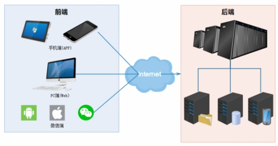 

##  2、接口编程

API（Application Programming Interface,应用程序编程接口），程序之间交互数据的一种方式。

以 浏览器和服务器之间的数据交互（ajax请求） 为例：

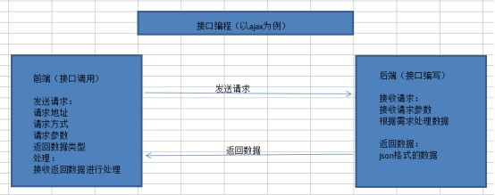 

请求方式：get方式  post方式

请求协议：http协议 https协议

返回参数格式：普通字符串、json格式、xml格式，现在通用的是**json格式**


这里的接口，不是面向对象中的interface接口。

数据交互中的接口：实际上，就是通过url请求到的地址中的代码（框架中就是一个控制器的方法）


# 二、RESTFul设计风格

## 1、Rest与RestFul

REST（英文：Representational State Transfer，简称REST），表述性状态转移，指的是一组架构原则。

Restful: 遵守了rest 原则 的web服务或web应用。

## 2、API设计六要素

资源路径(URI就是请求路径)、HTTP动词(Method)、过滤信息(query-string就是查询字符串)、状态码(Status-code)、错误信息(Error)、返回结果(Result)

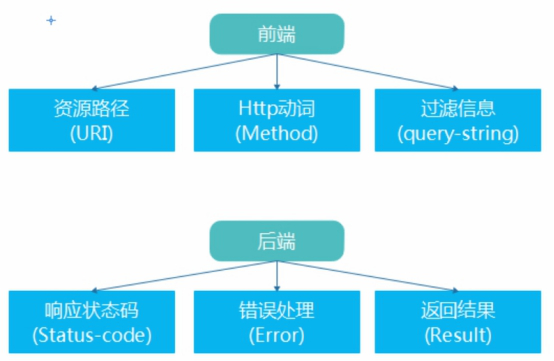 

### 1）资源路径URI

资源：所有在服务器保存的数据(如:音乐/视频/文章/个人信息...)都是服务器端资源.（项目中资源通常都是指的数据表的一条数据）

URI（Uniform Resource Identifier）：统一资源标志符，包含URL和URN。（就是一个大的统称）

URL（Uniform Resource Locator）：统一资源定位符（代表资源存放的具体的位置）

URN（Uniform Resource Name）：统一资源命名，（代表要访问的资源的名称）

 

在HTTP协议中, URI的组成如下

Schema://host[:port]/path[?query-string]

Schema: 使用的协议类型, 如http/https/ftp等 

host: 主机域名或IP 

port: 端口号(可选) 

path: 路径

query-string: 查询参数(可选)

例子:

[http://](http://api.local.com/movies)www.tpshop.com/users

[https://www.tpshop.com:8080/users?id=100](https://api.local.com:8080/articles?id=100)

### 2）HTTP动词（请求方式）

对于资源, 一般有4个操作, CURD(增/删/改/查)

GET: 从服务器获取资源(一项或多项)

POST: 在服务器新建一个资源

PUT: 在服务器更新资源, 服务器返回完整的属性

DELETE: 从服务器删除资源

### 3）过滤信息

通常也叫做请求参数或查询字符串。

### 4）响应状态码

服务端返回的信息, 用来告诉客户端操作结果。

常见状态码：

| **状态码** | **含义**    | **说明**             |
| ---------- | ----------- | -------------------- |
| 200        | OK          | 操作成功, 并返回数据 |
| 201        | CREATED     | 新建成功             |
| 204        | NO CONTENT  | 删除成功             |
| 400        | BAD REQUEST | 请求语法错误         |
| 403        | Forbidden   | 请求没有权限的资源   |
| 404        | NOT FOUND   | 没有找到请求的资源   |

GET 

200（OK） - 表示已在响应中发出 
204（无内容） - 资源有空表示 
301（Moved Permanently） - 资源的URI已被更新 
303（See Other） - 其他（如，负载均衡） 
304（not modified）- 资源未更改（缓存） 
400 （bad request）- 指代坏请求（如，参数错误） 
404 （not found）- 资源不存在 
406 （not acceptable）- 服务端不支持所需表示 
500 （internal server error）- 通用错误响应 
503 （Service Unavailable）- 服务端当前无法处理请求 

POST 
200（OK）- 如果现有资源已被更改 
201（created）- 如果新资源被创建 
202（accepted）- 已接受处理请求但尚未完成（异步处理） 
301（Moved Permanently）- 资源的URI被更新 
303（See Other）- 其他（如，负载均衡） 
400（bad request）- 指代坏请求 
404 （not found）- 资源不存在 
406 （not acceptable）- 服务端不支持所需表示 
409 （conflict）- 通用冲突 
412 （Precondition Failed）- 前置条件失败（如执行条件更新时的冲突） 
415 （unsupported media type）- 接受到的表示不受支持 
500 （internal server error）- 通用错误响应 
503 （Service Unavailable）- 服务当前无法处理请求 

PUT 
200 （OK）- 如果已存在资源被更改 
201 （created）- 如果新资源被创建 
301（Moved Permanently）- 资源的URI已更改 
303 （See Other）- 其他（如，负载均衡） 
400 （bad request）- 指代坏请求 
404 （not found）- 资源不存在 
406 （not acceptable）- 服务端不支持所需表示 
409 （conflict）- 通用冲突 
412 （Precondition Failed）- 前置条件失败（如执行条件更新时的冲突） 
415 （unsupported media type）- 接受到的表示不受支持 
500 （internal server error）- 通用错误响应 
503 （Service Unavailable）- 服务当前无法处理请求 

DELETE 
200 （OK）- 资源已被删除 
301 （Moved Permanently）- 资源的URI已更改 
303 （See Other）- 其他，如负载均衡 
400 （bad request）- 指代坏请求 
404 （not found）- 资源不存在 
409 （conflict）- 通用冲突 
500 （internal server error）- 通用错误响应 

503 （Service Unavailable）- 服务端当前无法处理请求 


- 实际项目中，不会这么严格遵守，一般都返回200左右，在返回结果中，包含自定义的状态码code、错误信息、返回数据。


### 5）错误信息

如果状态码是4xx或者5xx, 需要告诉客户端对应的错误信息. 通常以Json格式返回：

一般也放在返回结果里，状态码为200时，不返回错误信息。有错误时返回如errmsg字段。

{

“error”: “错误信息”,

}

### 6）返回结果

针对不同的操作, 服务需要返回的结果应该符合这样的规范，一般是JSON格式的数据

GET /collections -- 返回资源列表(数组)

GET /collections/:id -- 返回单个资源 eg. /collections/1

POST /collections -- 返回新生成的资源

PUT /collections/:id -- 返回资源的完整属性

DELETE /collections/:id -- 返回204状态码+空文档

 实际开发中，通常会将 状态码、错误信息、返回数据，都放到返回结果中。

比如

```js
// JSON格式的数据
{"code":200, 'msg':'success', "data":{"id":1,"goods_name":"tp"}}
```


## 3、RestFul接口设计风格

RESTFul是一种软件设计风格, 主要用于有客户端与服务端交互的软件. 

RESTFul 是目前最流行的 API 设计规范，用于 Web 数据接口的设计。

RESTFul风格的数据接口示例：

以新闻资源为例：URI及HTTP动词设计如下

（对于资源, 常用一般有4个操作5个方法, CURD(增/删/改/查1查多)）

| HTTP动词 | URI路径              | 说明               | 控制器对应方法|
| -------- | -------------------- | ------------------ | ------------- |
| GET      | http://域名/news     | 获取列表数据       | index         |
| GET      | http://域名/news/:id | 根据id获取一条数据 | read          |
| POST     | http://域名/news     | 添加一条数据       | save          |
| PUT      | http://域名/news/:id | 根据id修改一条数据 | update        |
| DELETE   | http://域名/news/:id | 根据id删除一条数据 | delete        |

#  三、RestFul实战

## 1、TP框架中的资源路由

手册-路由-资源路由、手册-控制器-资源控制器

- 资源路由就可以结合实现restful接口风格
- 控制器的每个方法就是一个接口

①创建api模块

```php
php think build --module api
```

②创建news控制器

```php
php think make:controller api/News
```

③设置路由(application/route.php)

```php
// 设置资源路由，会自动在api/news控制器创建7个方法
\think\Route::resource('news','api/news');
```

相当于分别设置了以下7个路由：

```php
\think\Route::get('news','api/news/index');// 新闻资源列表页
\think\Route::get('news/create','api/news/create');// 新闻资源创建页
\think\Route::post('news','api/news/save');// 新闻资源新增接口
\think\Route::get('news/:id','api/news/read');// 新闻资源详情接口
\think\Route::get('news/:id/edit','api/news/edit'); // 新闻资源 详情对应的编辑接口
\think\Route::put('news/:id','api/news/update');// 新闻资源的更新
\think\Route::delete('news/:id','api/news/delete');// 新闻资源的删除
```

设置后会自动注册7个路由规则，如下：

| **标识** | **请求类型** | **生成路由规则** | **对应操作方法（默认）** |
| -------- | ------------ | ---------------- | ------------------------ |
| index    | GET          | news             | index（保留）                    |
| create   | GET          | news/create      | create                   |
| save     | POST         | news             | save（保留）                     |
| read     | GET          | news/:id         | read（保留）                     |
| edit     | GET          | news/:id/edit    | edit                     |
| update   | PUT          | news/:id         | update（保留）                   |
| delete   | DELETE       | news/:id         | delete（保留）                   |

④修改News控制器，返回json格式数据

```php
<?php

namespace app\api\controller;

use think\Controller;
use think\Request;

class News extends Controller
{
    /**
     * 显示资源列表
     *
     * @return \think\Response
     */
    public function index()
    {
        // json方法是框架封装的一个方法：原生方法对应json_encode序列化
        return json(['code' => 200, 'msg' => 'success', 'data'=>'index']);
    }

    /**
     * 显示创建资源表单页.
     *
     * @return \think\Response
     */
    public function create()
    {
        return json(['code' => 200, 'msg' => 'success', 'data'=>'create']);
    }

    /**
     * 保存新建的资源
     *
     * @param  \think\Request  $request
     * @return \think\Response
     */
    public function save(Request $request)
    {
        return json(['code' => 200, 'msg' => 'success', 'data'=>'save']);
    }

    /**
     * 显示指定的资源
     *
     * @param  int  $id
     * @return \think\Response
     */
    public function read($id)
    {
        return json(['code' => 200, 'msg' => 'success', 'data'=>'read']);
    }

    /**
     * 显示编辑资源表单页.
     *
     * @param  int  $id
     * @return \think\Response
     */
    public function edit($id)
    {
        return json(['code' => 200, 'msg' => 'success', 'data'=>'edit']);
    }

    /**
     * 保存更新的资源
     *
     * @param  \think\Request  $request
     * @param  int  $id
     * @return \think\Response
     */
    public function update(Request $request, $id)
    {
        return json(['code' => 200, 'msg' => 'success', 'data'=>'update']);
    }

    /**
     * 删除指定资源
     *
     * @param  int  $id
     * @return \think\Response
     */
    public function delete($id)
    {
        return json(['code' => 200, 'msg' => 'success', 'data'=>'delete']);
    }
}

```

通过postman 分别访问以下七个地址：框架自动映射路由规则很方便，也不用手动区分请求方法类型

```php
请求方式	 请求地址
get			http://www.tpshop.com/news
get			http://www.tpshop.com/news/create
post		http://www.tpshop.com/news
get			http://www.tpshop.com/news/33
get			http://www.tpshop.com/news/33/edit
put			http://www.tpshop.com/news/33
delete		http://www.tpshop.com/news/33
```

## 2、ajax请求restful接口

public目录下，创建测试文件 api.html，

- 现在是直接在public目录下，域名一样，没有跨域问题

```php
<!DOCTYPE html>
<html lang="en">
<head>
    <meta charset="UTF-8">
    <title>ajax请求restful接口</title>
    <script src="/static/admin/js/jquery-1.8.1.min.js"></script>
</head>
<body>
<input type="button" id="index" value="index">
<input type="button" id="create" value="create">
<input type="button" id="save" value="save">
<input type="button" id="read" value="read">
<input type="button" id="edit" value="edit">
<input type="button" id="update" value="update">
<input type="button" id="delete" value="delete">
<script>
    $(function(){
        $('#index').click(function(){
            $.ajax({
                "url":"/news",
                "type":"get",
                "data":"",
                "dataType":"json",
                "success":function(res){
                    console.log(res);
                }
            });
        });
        $('#create').click(function(){
            $.ajax({
                "url":"/news/create",
                "type":"get",
                "data":"",
                "dataType":"json",
                "success":function(res){
                    console.log(res);
                }
            });
        });
        $('#save').click(function(){
            $.ajax({
                "url":"/news",
                "type":"post",
                "data":"",
                "dataType":"json",
                "success":function(res){
                    console.log(res);
                }
            });
        });
        $('#read').click(function(){
            $.ajax({
                "url":"/news/33",
                "type":"get",
                "data":"",
                "dataType":"json",
                "success":function(res){
                    console.log(res);
                }
            });
        });
        $('#edit').click(function(){
            $.ajax({
                "url":"/news/33/edit",
                "type":"get",
                "data":"",
                "dataType":"json",
                "success":function(res){
                    console.log(res);
                }
            });
        });
        $('#update').click(function(){
            $.ajax({
                "url":"/news/33",
                "type":"put",
                "data":"",
                "dataType":"json",
                "success":function(res){
                    console.log(res);
                }
            });
        });
        $('#delete').click(function(){
            $.ajax({
                "url":"/news/33",
                "type":"delete",
                "data":"",
                "dataType":"json",
                "success":function(res){
                    console.log(res);
                }
            });
        });
    });
</script>
</body>
</html>
```

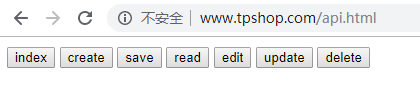   

## 3、请求伪装

部分客户端（比如低版本浏览器）可能仅支持get请求、post请求，不支持delete请求和put请求。

TP框架提供了对“请求伪装”的支持，可以使用post请求携带_method参数，伪装成其他请求。

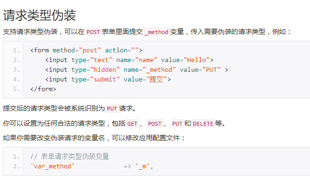 

比如 使用ajax的post请求伪装put请求

public/api.html中 添加以下代码

```html
<input type="button" id="post_to_put" value="伪装put">
<input type="button" id="post_to_delete" value="伪装delete">
<script>
    $(function(){
        $('#post_to_put').click(function(){
            $.ajax({
                "url":"/news/33",
                "type":"post",
                "data":"_method=put",
                "dataType":"json",
                "success":function(res){
                    console.log(res);
                }
            });
        });
        $('#post_to_delete').click(function(){
            $.ajax({
                "url":"/news/33",
                "type":"get",
                "data":"_method=delete",
                "dataType":"json",
                "success":function(res){
                    console.log(res);
                }
            });
        });
    })
</script>
```


## 4、Restful常用的资源路由

新增页面页面展示 create方法  和 修改页面页面展示 edit方法  一般可以不用。一般常用下面5个。

- 去掉了create和edit标识方法，因为在资源路由中，新增和修改页面的路由规则是一样的，都是news。

| 标识   | 请求类型 | 生成路由规则 | 对应操作方法（默认） | 备注                               |
| ------ | -------- | ------------ | -------------------- | ---------------------------------- |
| index  | GET      | news         | index                | 查询多条数据（列表）               |
| read   | GET      | news/:id     | read                 | 查询一条数据（详情、修改页面展示） |
| save   | POST     | news         | save                 | 新增一条数据                       |
| update | PUT      | news/:id     | update               | 修改一条数据                       |
| delete | DELETE   | news/:id     | delete               | 删除一条数据                       |

## 5、实际开发中的Restful

- Restful接口通常返回的是完整的数据模型，粒度过于“粗”（除了delete外，其他都是返回json格式的完整数据，所有字段都有-----），对客户端不友好（客户端可能只需要其中一小部分字段）。

- Restful典型使用场景：
  - 开放API（各种开放平台的数据api）。开放API之所以开放，就是因为不知道也不关心客户端需要什么返回结果，直接返回完整的数据，好处是通用。
  - restful适用于增删改查场景

实际开发中，通常都是内部接口开发，需求非常明确（这个接口就要哪些字段），所以一般都是灵活借鉴Restful中的优点，结合自己的实际情况，来设计自己的内部api，在基本的增删改查接口之外，通常会设计一些业务接口（根据业务逻辑需要，一个接口中对多个资源的数据进行整合再返回）。


# 四、服务端CURL请求

服务端与服务端之间，也存在接口编程。

比如我们网站服务端，需要发送短信、发送邮件、查询快递等，都需要调用第三方平台的接口。

## 1、php中发送请求

①file_get_contents函数 ：
    - 他是一个读取文件内容的api
    - 若传递完整的url参数  通常都是用来发get请求（发post请求很麻烦设置很多），会有返回值（地址中的输出） 

②curl请求方式（PHP的curl函数库）：php中比较规范的一种发送请求方式。

## 2、CURL函数库

Curl函数库的使用流程：

①使用curl_init初始化请求会话

②使用curl_setopt设置请求一些选项

③使用curl_exec执行，发送请求

④使用curl_close关闭请求会话

##  3、封装请求函数

封装一个函数用来发送curl请求

在application/common.php中封装一个函数curl_request

使用curl函数库的前提：

①在php.ini中开启php_curl扩展（必须开启）

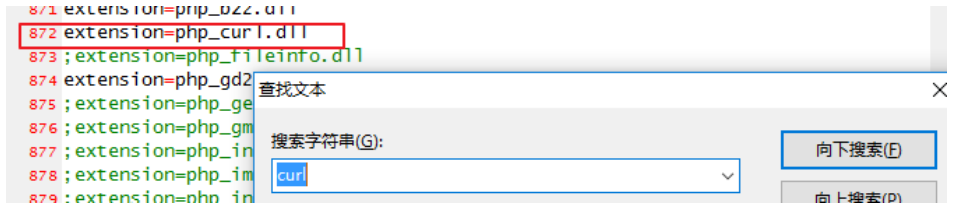 

②建议在php.ini中开启php_openssl扩展（本身不是curl必须的，是调用一些第三方接口需要的）

 

③如果以上操作重启apache后，curl还是不能使用，需要将php安装目录设置到环境变量。

代码封装：application/common.php

### https协议证书验证
   1. 单向ssl验证：普通网站、电商、API 接口都使用这种方式
      1. 场景：你访问一个 HTTPS 网站，比如 https://www.google.com
         1. 📌 流程如下：
         2. 浏览器或curl客户端向 Google 发起 HTTPS 请求；
         3. Google 服务器返回其 SSL 证书；
         4. 浏览器或客户端默认验证该证书是否合法（是否由可信 CA 签发、是否过期、域名是否匹配等）；
         5. 如果证书合法，建立加密连接；
         6. 开始传输数据
   2. 双向ssl验证：（适用于银行）
      1. 客户端向服务端发起 HTTPS 请求；服务端要求客户端提供 SSL 证书；
      2. 客户端发送自己的证书给服务端；
      3. 服务端验证客户端证书是否合法（是否由可信 CA 签发、是否过期等）；
      4. 如果验证通过，建立加密连接；
      5. 双方开始通信
1. curl请求接口时在开发阶段可以暂时关闭 SSL 验证，上线前必须开启并使用合法证书：
      1. 跳过ssl证书验证：`curl_setopt($ch, CURLOPT_SSL_VERIFYPEER, false);`
      2. 告诉 cURL这个请求方：“如果我发的是https请求，不要验证响应方即服务端返回来的 SSL 证书，即使目标服务器返的证书有问题也继续请求”

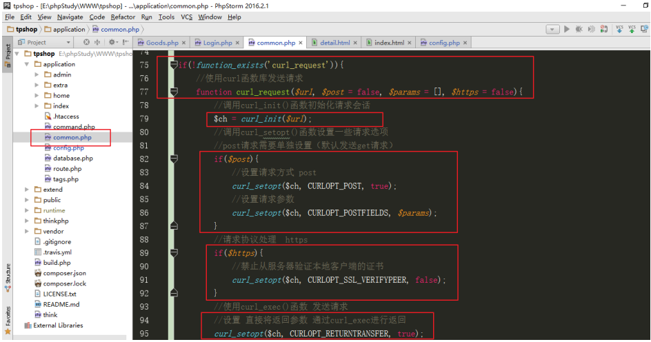

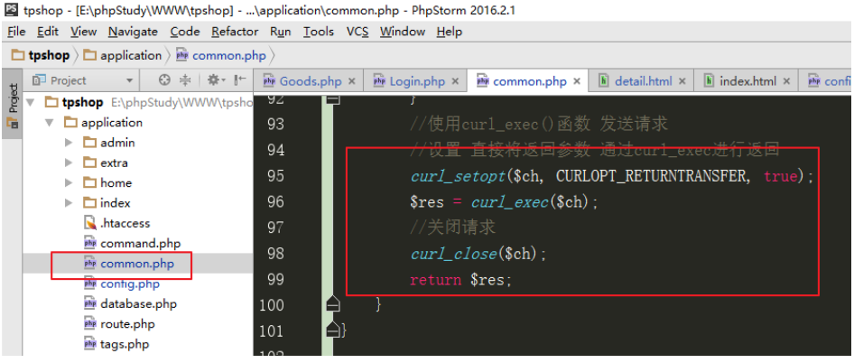 

## 4、本地模拟测试

先准备好一个接口地址：用于请求调用

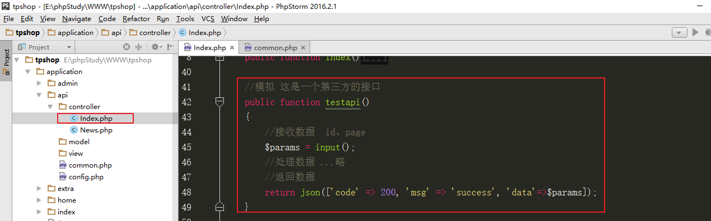

再写一个方法，发送请求，调用之前准备好的接口

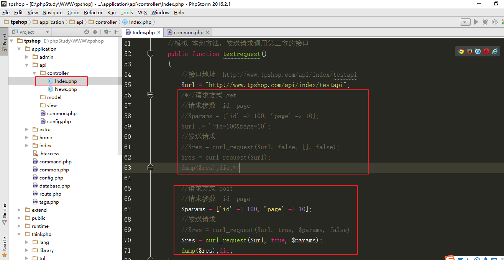


测试结果：

访问：http://www.tpshop.com/index.php/api/index/testrequest

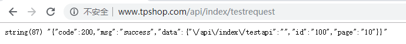

 

## 5、curl请求错误调试

curl_errno函数 返回错误码

curl_error函数 返回错误信息

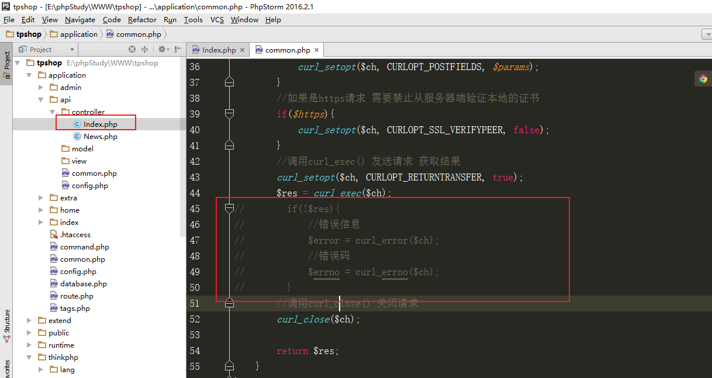

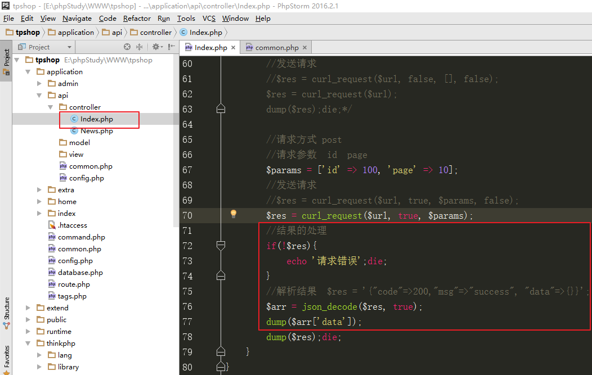

 

# 五、快递查询

## 1、接口说明

提供快递查询的第三方平台很多，比如快递100、聚合数据、百度云apistore、阿里云、腾讯云、京东万象等等。

这里以聚合数据平台为例：接口页面：<https://www.juhe.cn/docs/api/id/43>

**接口地址：**http://v.juhe.cn/exp/index

**返回格式：**json/xml     

**请求方式：**http post/get

必传请求参数： com 快递公司编号； no 快递单号； key 授权key

**请求示例：**http://v.juhe.cn/exp/index?com=zto&no=73115984252335&key=ac2dde994cc76d4f15738f7f97af7ca4

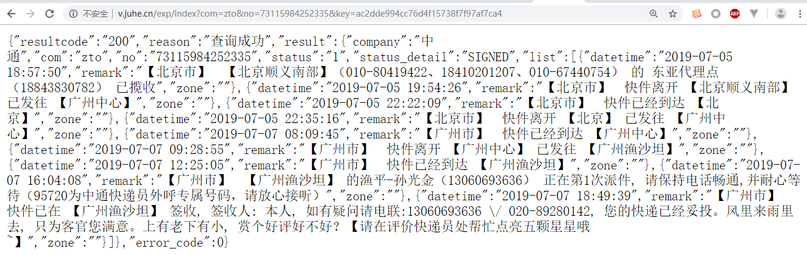

## 2、项目使用

api模块index控制器kuaidi方法

```php
public function kuaidi()
    {
        //接口地址
        $url = "http://v.juhe.cn/exp/index?com=zto&no=73115984252335&key=ac2dde994cc76d4f15738f7f97af7ca4";
        //请求方式 get post
        //请求参数
        $params = [
            'com' => 'zto',
            'no' => '73115984252335',
            'key' => 'ac2dde994cc76d4f15738f7f97af7ca4'
        ];
        //发送请求
        $res = curl_request($url, true, $params);
        if(!$res){
            echo '请求失败';die;
        }
        //解析结果
        $arr = json_decode($res, true);
        //查询失败
        if($arr['resultcode'] != 200){
            echo $arr['reason'];die;
        }
        //查询成功，展示信息
        $list = $arr['result']['list'];
        echo '时间 ------------------------ 物流信息<br>';
        foreach($list as $v){
            echo $v['datetime'], '------------------------', $v['remark'], '<br>';
        }
    }
```

展示效果：

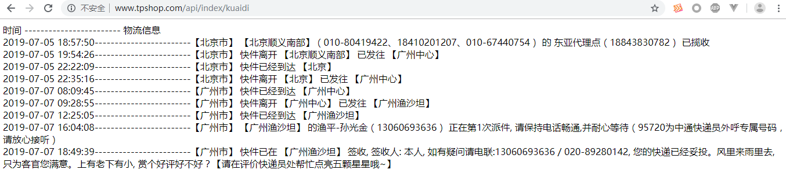

# 六、接口文档

## 1、接口内容

**接口名称**

场景说明

**接口说明**

**请求参数**

**响应参数**

错误码

## 2、请求参数内容

字段名 
是否必填 
类型 
示例值 
描述

## 3、响应参数内容

字段名称

描述

返回示例

## 4、错误码内容

名称 
描述 
原因 
解决方案

## 5、示例

## 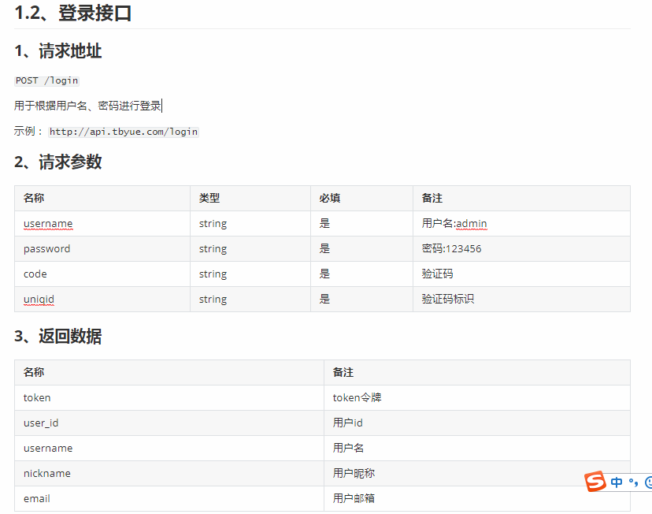

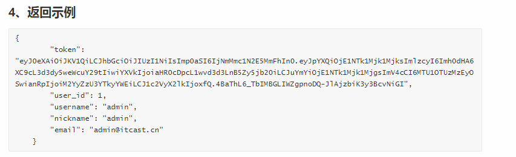 

## 6、练习（接口文档）

将admin/controller/Goods.php中  save方法 改为 接口方式

① 将Base控制器中的登录验证，注释。

② 将save方法代码 复制到 save2方法

③将save2方法中的参数验证规则修改（删除 token规则， 添加 goods_logo字段的验证）

④将\$this->error 和\$this->success部分代码，修改为 return json（）这种代码。

⑤将文件上传的方法调用 注释

⑥通过postman测试save2接口

⑦ 写接口文档


## 7、练习（项目搭建）

1、安装部署tp框架（解压压缩包、配置虚拟站点）（主域名、子域名，比如 www.pyg.com   和 adminapi.pyg.com）

2、模块划分（后台模块admin、前台模块home、后台接口模块adminapi、公共模块common）

3、admin模块、home模块、adminapi模块 有默认的控制器方法，可以访问。 common模块下只需要model模型目录

4、路由配置： adminapi模块 配置域名路由

5、尝试，对adminapi模块，创建一个Base控制器，定义ok方法和fail方法，用于快捷返回结果数据

比如：

```
失败时，以下两行代码 效果一样
return json(['code' => 401, 'msg' => '参数错误', 'data' => []]);
//$this->fail(401, '参数错误');

成功时，以下两行代码 效果一样
return json(['code' => 200, 'msg' => 'success', 'data' => $data]);
//$this->ok($data);

```

