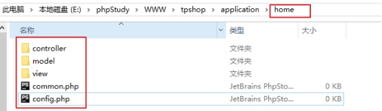
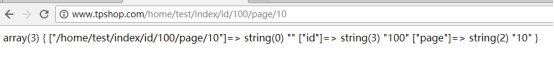
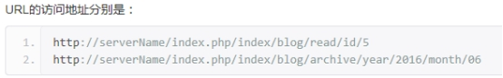
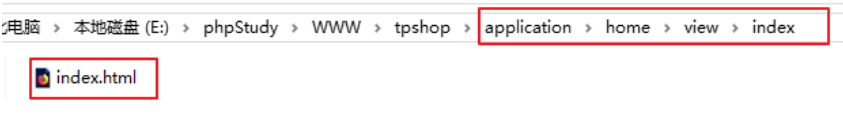
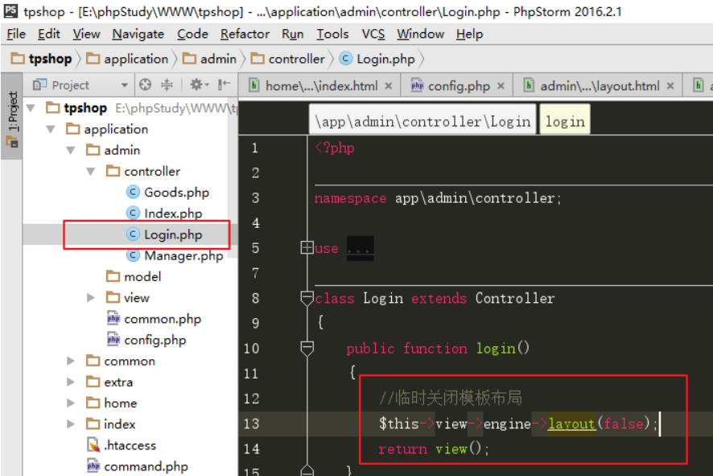

ThinkPHP框架

- [今日目标（每日任务）](#今日目标每日任务)
- [一、框架概述](#一框架概述)
  - [1、什么是框架](#1什么是框架)
  - [2、php中的主流框架](#2php中的主流框架)
- [二、ThinkPHP框架安装](#二thinkphp框架安装)
  - [**1、下载并解压框架**](#1下载并解压框架)
  - [2、配置虚拟主机](#2配置虚拟主机)
    - [自己尝试](#自己尝试)
- [三、TP框架基础](#三tp框架基础)
  - [1、目录结构（重点）](#1目录结构重点)
  - [2、配置文件（重点）](#2配置文件重点)
  - [3、函数文件](#3函数文件)
  - [4、开发规范（了解）](#4开发规范了解)
  - [5、请求的生命周期](#5请求的生命周期)
- [四、TP框架中的控制器](#四tp框架中的控制器)
  - [1、控制器的后缀](#1控制器的后缀)
  - [2、控制器的定义](#2控制器的定义)
  - [3、框架中的命名空间](#3框架中的命名空间)
  - [4、url访问](#4url访问)
  - [5、调试模式](#5调试模式)
- [五、创建模块](#五创建模块)
  - [1、创建前台和后台模块](#1创建前台和后台模块)
  - [2、设置默认访问模块](#2设置默认访问模块)
- [六、命令行创建模块目录及文件](#六命令行创建模块目录及文件)
  - [1、命令行创建模块目录](#1命令行创建模块目录)
  - [2、命令行创建控制器](#2命令行创建控制器)
  - [3、命令行创建模型](#3命令行创建模型)
- [七、Request请求类](#七request请求类)
  - [1、获取输入变量](#1获取输入变量)
  - [2、参数绑定](#2参数绑定)
  - [**3、依赖注入**](#3依赖注入)
- [八、ThinkPHP框架中的视图](#八thinkphp框架中的视图)
  - [1、视图的组成](#1视图的组成)
  - [2、模板的定义](#2模板的定义)
  - [3、模板渲染](#3模板渲染)
- [九、将后台模板与框架做结合](#九将后台模板与框架做结合)
  - [1、模板布局](#1模板布局)
  - [2、后台首页](#2后台首页)
  - [3、后台登录页](#3后台登录页)
  - [4、其他页面](#4其他页面)
- [作业](#作业)
- [总结：](#总结)


# 今日目标（每日任务）

1 能够安装ThinkPHP5框架并熟悉常用目录结构

2 能够使用ThinkPHP5框架的控制器

3 能够命令行创建模块目录和文件

4 能够使用ThinkPHP5框架的Request请求类

5 能够进行模板渲染

 

# 一、框架概述

## 1、什么是框架

框架就是一些代码类、方法（函数）、变量、常量的集合，这些代码是功能结构性的代码（并非业务代码）。业务代码其实就是具体的一些模块的增删改查逻辑代码。

使用框架开发项目，有便于代码重用、开发效率高、代码规范好、便于功能扩展等优点。

## 2、php中的主流框架

①Zend Framework 框架，PHP官方框架。

②YII框架，又叫易框架。

③Symfony 框架。

④Laravel框架，市场使用较多。

⑤Codelgniter框架，简称CI框架。

⑥ThinkPHP框架，简称TP框架，常用版本：3.2.3和 5.0.*版本。

ThinkPHP是国人自己开发的框架。有中文官网、中文帮助文档、中文社区，以及丰富的百度搜索资源。所以ThinkPHP很适合作为入门级的开发框架。

这些框架大多都基于MVC设计思想和面向对象的。

 

**mvc：**

M:模型model，处理业务数据，与数据库做交互。

V:视图view，显示html页面，用户能够看到并与之交互的页面。

C：控制器controller，接收请求，调用模型处理数据，调用视图显示页面。

整个网站应用，分为模型、视图、控制器三大部分组成。

# 二、ThinkPHP框架安装

## **1、下载并解压框架**

下载地址：[http://www.thinkphp.cn](http://www.thinkphp.cn/down.html)

 

下载后解压到工作目录

 

## 2、配置虚拟主机

①通过phpStudy的“站点域名管理”进行配置或者直接修改apache的虚拟主机配置文件，

 

将站点域名指向项目目录下的public目录

 

②域名解析，修改hosts文件

 

增加域名如下： 多个域名可以写在同一行，以空格隔开

127.0.0.1       tpshop.com [www.tpshop.com](http://www.tpshop.com)

 

③重启apache，在浏览器访问配置的虚拟站点http://www.tpshop.com

 

看到以上界面，说明框架安装成功。

apache配置参考（不要照搬）：

```
<VirtualHost *:80>
    DocumentRoot "E:\phpStudy\WWW\tpshop\public"
    ServerName www.tpshop.com
    ServerAlias tpshop.com
  	<Directory "E:\phpStudy\WWW\tpshop\public">
      	Options FollowSymLinks ExecCGI
        AllowOverride All
        Order allow,deny
        Allow from all
        Require all granted
  	</Directory>
</VirtualHost>
```

### 自己尝试

部署了成功访问：http://www.tpshop1.com 


# 三、TP框架基础

## 1、目录结构（重点）

（见手册--基础--目录结构）

```
 1.project  应用部署目录
 2.├─application           应用目录（可设置）
 3.│  ├─common             公共模块目录（可更改）
 4.│  ├─index              模块目录(可更改)
 5.│  │  ├─config.php      模块配置文件
 6.│  │  ├─common.php      模块函数文件
 7.│  │  ├─controller      控制器目录
 8.│  │  ├─model           模型目录
 9.│  │  ├─view            视图目录
10.│  │  └─ ...            更多类库目录
11.│  ├─command.php        命令行工具配置文件
12.│  ├─common.php         应用公共（函数）文件
13.│  ├─config.php         应用（公共）配置文件
14.│  ├─database.php       数据库配置文件
15.│  ├─tags.php           应用行为扩展定义文件
16.│  └─route.php          路由配置文件
17.├─extend                扩展类库目录（可定义）
18.├─public                WEB 部署目录（对外访问目录）
19.│  ├─static             静态资源存放目录(css,js,image)
20.│  ├─index.php          应用入口文件
21.│  ├─router.php         快速测试文件
22.│  └─.htaccess          用于 apache 的重写
23.├─runtime               应用的运行时目录（可写，可设置）
24.├─vendor                第三方类库目录（Composer）
25.├─thinkphp              框架系统目录
26.│  ├─lang               语言包目录
27.│  ├─library            框架核心类库目录
28.│  │  ├─think           Think 类库包目录
29.│  │  └─traits          系统 Traits 目录
30.│  ├─tpl                系统模板目录
31.│  ├─.htaccess          用于 apache 的重写
32.│  ├─.travis.yml        CI 定义文件
33.│  ├─base.php           基础定义文件
34.│  ├─composer.json      composer 定义文件
35.│  ├─console.php        控制台入口文件
36.│  ├─convention.php     惯例配置文件
37.│  ├─helper.php         助手函数文件（可选）
38.│  ├─LICENSE.txt        授权说明文件
39.│  ├─phpunit.xml        单元测试配置文件
40.│  ├─README.md          README 文件
41.│  └─start.php          框架引导文件
42.├─build.php             自动生成定义文件（参考）
43.├─composer.json         composer 定义文件
44.├─LICENSE.txt           授权说明文件
45.├─README.md             README 文件
46.├─think                 命令行入口文件
```


## 2、配置文件（重点）

（见手册--配置）

①三个层级的配置文件：

框架主配置文件（惯例配置文件） thinkphp/convention.php 

应用公共配置文件 application/config.php， application/database.php 对整个应用生效

模块配置文件 application/模块目录/config.php 对当前模块生效

 ②其他说明：

配置文件格式 return array( 键值对 );

加载顺序： 框架主配置文件 》 应用公共配置文件 》 模块配置文件

配置文件生效顺序： 后加载的生效（后加载的配置项会覆盖之前配置项）

如果要手动进行配置，一般不要修改框架本身的主配置文件，

而是在应用或者模块配置文件中进行配置。

## 3、函数文件

框架助手函数文件 thinkphp/helper.php

应用公共函数文件 application/common.php

模块函数文件 application/模块目录/common.php

 

一般不建议直接修改thinkphp/helper.php

## 4、开发规范（了解）

TP框架编码规范：见手册--基础--开发规范

 

扩展：PSR代码规范：<https://www.kancloud.cn/thinkphp/php-fig-psr/3139>

 

 

## 5、请求的生命周期

框架的生命周期，也就是请求的执行流程：

 

# 四、TP框架中的控制器

## 1、控制器的后缀

打开配置文件application/config.php，有如下配置

```php
'controller_suffix' => false,
```

表示默认情况下，控制器无特殊后缀。例如 Index控制器，文件名为Index.php

如果需要进行设置，可以设置为（我们不需要这么设置）

```php
'controller_suffix' => 'Controller',
```

表示控制器以Controller为后缀。例如Index控制器，文件名为IndexController.php

## 2、控制器的定义

（见手册--控制器--控制器定义）

1）定义位置及命名规则

定义位置：application/模块目录/controller/目录下

命名规则：控制器名称（首字母大写） + (控制器后缀，默认没有) + .php

默认：Index控制器  Index.php

  User控制器   User.php

  Test控制器    Test.php

示例：

 

2）编写控制器

①声明命名空间  namespace  app\模块目录名\controller

②引入控制器基类（可选） use think\Controller; think是命名空间 Controller是基类控制器

③定义当前控制器类，继承控制器基类（可选）

示例：定义测试控制器Test.php

 

## 3、框架中的命名空间

命名空间本身是PHP就有的，用来防止命名冲突问题的。

TP框架中的命名空间，通常和目录挂钩。

原因：TP中的自动加载机制，会将类的命名空间作为加载路径的一部分。

 

TP中命名空间使用：

①声明命名空间 使用namespace关键字

②引入指定的类 使用use关键字  命名空间\类名称

③完全限定式访问  在使用类时，\完整命名空间\类名称（继承和实例化）

如果一个类没有命名空间，使用 \类名

## 4、url访问

（见手册--架构--URL访问）

ThinkPHP5.0框架中，默认使用PATH_INFO方式的url进行访问。

示例：[http://www.tpshop.com/index.php/Index/Test/index/page/10](http://www.tpshop.com/index.php/Home/Test/index/page/10)

格式：[http://域名/入口文件/模块名/控制器名称/操作方法名称/参数名/参数值](http://域名/入口文件?m=分组名&c=控制器名称&a=操作方法名称&参数名=参数值)

 

隐藏入口文件写法：[http://域名/模块名/控制器名称/操作方法名称/参数名/参数值](http://域名/入口文件?m=分组名&c=控制器名称&a=操作方法名称&参数名=参数值)

需要对apache进行设置（手册--架构--URL访问、手册--部署--URL重写）

 

使用PHPStudy需要将 public目录的.htaccess文件中，index.php后面加上? 


使用Apapche的重写机制隐藏入口文件后，如果在整个url后面加上.html后缀, 让整个url看起来像是访问的静态页面。这叫做“伪静态”。

## 5、调试模式

（见手册--错误与调试--调试模式）

默认情况下，如果代码有误（比如控制器名拼写有误），会出现以下错误：

 

错误描述比较模糊，不方便进行错误调试。这种模式通常叫做“部署模式”（生产模式）。

开发阶段可以将框架设置为调试模式，便于进行错误调试：

修改 项目目录\application目录\config.php

 

开启调试模式后，报错信息格式如下：

 

会提示详细错误信息 和 错误位置（参考位置）。

相对于 线上环境（开发完成后的阶段），叫做 部署模式或者生产模式。

# 五、创建模块

## 1、创建前台和后台模块

一个典型的应用是由多个模块组成的（通常有前台网站模块和后台管理系统模块），这些模块通常都是应用目录下面的一个子目录，每个模块都有自己独立的配置文件、公共文件和类库文件。

我们给项目创建home（前台）和admin（后台）两个模块：

 

 

## 2、设置默认访问模块

打开配置文件application/config.php，有如下配置

```php
'default_module' => 'index',
```

表示默认访问模块为index模块

可以更改默认模块为home模块

```php
'default_module' => 'home',
```


# 六、命令行创建模块目录及文件

在 **项目根目录** 执行命令（think文件所在的目录）

## 1、命令行创建模块目录

（见手册 -- 命令行 -- 自动生成目录结构）

通常可以通过以下命令，自动生成模块目录

```
php think build --module 模块名
```

比如：创建test模块目录，执行命令 php think build --module test即可。（模块名小写）

 

## 2、命令行创建控制器

（见手册 -- 命令行 -- 创建类库文件）

通常可以通过以下命令，自动创建控制器

```php
php think make:controller 模块名/控制器名 
php think make:controller 模块名/控制器名 --plain
```

加上 --plain 参数 表示创建没有方法的空控制器类。否则控制器类中会自带一些方法。

比如：创建home模块Index控制器，执行命令 php think make:controller home/Index即可。

注意：控制器名首字母大写。

 

## 3、命令行创建模型

（见手册 -- 命令行 -- 创建类库文件）

通常可以通过以下命令，自动创建模型

```php
php think make:model 模块名/模型名
```

比如：创建home模块User模型，执行命令 php think make:model home/User即可。

注意：模型名首字母大写。

 

# 七、Request请求类

## 1、获取输入变量

（见手册--请求--输入变量）

要获取当前的请求信息，可以使用\think\Request类

$request = \think\Request::instance();

或者使用助手函数

$request = request();

 

也可以单独获取get变量或者post变量

```
Request::instance()->get();
Request::instance()->post();
input('get.');
input('post.');
```

 

代码示例：

 

浏览器访问效果：

 

特殊说明：路由变量与get变量

<http://www.tpshop.com/home/test/index/id/100?page=10>

param方法 能够获取所有参数（id, page）

get方法 只能获取?后面的请求字符串的参数（page）

route方法 只能获取到?前面的路由中的参数（id）

 

## 2、参数绑定

（见手册--请求--参数绑定）

方法参数绑定是把URL地址（或者路由地址）中的变量作为操作方法的参数直接传入。

 

 

使用示例：home模块Test控制器read方法中，声明$id参数

 

访问url中，传递id参数  <http://www.tpshop.com/home/test/read/id/100>

效果：

 

## **3、依赖注入**

（见手册--请求--依赖注入）

依赖注入：简单的说，要在一个类A中使用另一个依赖类B时，不直接在类A中实例化类B，而是先实例化类B后再以参数的形式传入类A.

 

框架中的使用：


原理分析：


补充说明：Request请求类中，封装了很多和请求相关的方法，详情见手册--请求（多看）


小结：

可以找到任何一种方法 接收请求参数

```php
//1.获取请求对象  
$request = request();
$request = \think\Request::instance();
$request = $this->request; //仅限于继承了底层控制器的情况下
public function save(Request $request)  //依赖注入
   //2. 接收请求参数 param方法
    $params = $request->param();
	$params = input();
	$params = request()->param();
	$id = $request->param('id');
	$id = input('id');
	public function edit($id)//参数绑定
```


# 八、ThinkPHP框架中的视图

## 1、视图的组成

View视图类（继承了自定义模板引擎，功能与Smarty类似）

HTML模板文件

## 2、模板的定义

（见手册--模板--模板定位）

为了对模板文件更加有效的管理，ThinkPHP对模板文件进行目录划分，默认的模板文件定义规则是：视图目录/控制器名（小写）/操作名（小写）+模板后缀

默认的视图目录是模块的view目录，框架的默认视图文件后缀是.html。

 

比如home模块 Index控制器index方法要调用的模板定义为view/index/index.html



## 3、模板渲染

（见手册--视图--模板渲染，手册--视图--模板赋值）

在控制器方法中，

第一种：使用assign方法进行模板赋值，使用fetch方法进行模板渲染。

第二种：使用助手函数view(), 进行模板渲染并赋值。

使用示例：


注：模板中输出变量值： {$模板变量名}

 

# 九、将后台模板与框架做结合

模板整合思路：

①确定页面的访问路径（模块、控制器、方法）

②新建对应的控制器方法，在方法中调用模板

③将模板页面移动到对应的视图目录下（创建子目录）

④将静态资源文件移动到public/static/admin目录下

⑤修改模板文件中静态资源路径


页面分布：

登录页  	Login控制器login方法  login.html

首页		Index控制器index方法  index.html

商品列表	Goods控制器index方法  goods_list.html  ->  index.html

商品新增	Goods控制器create方法  goods_add.html  -> create.html

商品修改	Goods控制器edit方法    goods_edit.html   -> edit.html

管理员列表	Manager控制器index方法  manager_list.html   -> index.html

管理员新增	Manager控制器create方法  manager_add.html  -> create.html

管理员修改	Manager控制器edit方法    manager_edit.html  ->edit.html

...

## 1、模板布局

（见手册--模板--模板布局）

使用模板布局，就是把多个模板页面都有的公共代码给抽取出来，放到一个公共位置开发维护

好处：相同的代码只维护一份，减少代码工作量

后台全局布局设置步骤：

①修改配置文件application/admin/config.php,加入以下设置

```
'template'  =>  [
    'layout_on'     =>  true,//开启布局
    'layout_name'   =>  'layout',//布局文件名称
]
```

 

②将静态资源文件移动到/public/static/admin目录下

 

③在application/admin/view目录下，新建layout.html

将后台页面公共的头部、底部代码提取到layout.html中，在中间位置放一个特殊字符串“{\__CONTENT__}”，表示此位置，替换为原始要访问的页面内容。

layout.html文件中， 只保留所有页面**公共** 的css和js相关代码，修改静态资源路径

注： **一定不能** 直接将所有css和js都放在layout.html中。

注：TP框架中，模板中的静态资源路径，不能使用相对路径./ ，必须使用以/开头的路径。


④临时关闭模板布局

全局布局设置，对所有页面全部生效。

特殊页面（不需要使用布局的页面），可以在控制器方法中，临时关闭模板布局。

```php
$this->view->engine->layout(false);
```

比如登录页面，不需要使用布局，见 “3、后台登录页”

## 2、后台首页

①确定页面的访问路径（模块、控制器、方法）

admin模块Index控制器index方法

②新建对应的控制器方法，在方法中调用模板

```php
<?php
namespace app\admin\controller;

use think\Controller;

class Index extends Controller
{
	public function index()
	{
		return view();
	}
}
```

③将模板页面移动到对应的视图目录下

index.html    =>     application/admin/view/index/index.html

④修改模板文件

保留页面独有的静态资源文件，以及主体部分代码

修改模板文件中静态资源路径


**注：如果页面显示效果不对，可以考虑先删除缓存 runtime目录**


## 3、后台登录页

①确定页面的访问路径（模块、控制器、方法）

admin模块 login控制器  login方法

②新建对应的控制器方法，在方法中调用模板

注：后台的登录页面，不需要使用布局




③将模板页面移动到对应的视图目录下

将login.html 移动到 application/admin/view/login/目录下


⑤修改模板文件中静态资源路径

修改application/admin/view/login/login.html

注：也可以使用\__STATIC__ 代替静态资源路径中的/static（手册--视图--输出替换）


## 4、其他页面

重复步骤①②③⑤


# 作业

整合以下模板

商品列表	Goods控制器index方法  goods_list.html  ->  index.html

商品新增	Goods控制器create方法  goods_add.html  -> create.html

商品修改	Goods控制器edit方法    goods_edit.html   -> edit.html

管理员列表	Manager控制器index方法  manager_list.html   -> index.html

管理员新增	Manager控制器create方法  manager_add.html  -> create.html

管理员修改	Manager控制器edit方法    manager_edit.html  ->edit.html


# 总结：

1.安装部署框架，熟悉目录结构（application   public）

2.控制器定义、控制器的访问（隐藏入口文件、Path_info格式url） 能够访问到指定的控制器方法

3.命令行操作（创建模块，创建控制器类）（环境变量等）

4.Request请求对象基本使用--接收参数（熟练使用一种写法）

5.模板整合（模板布局）

