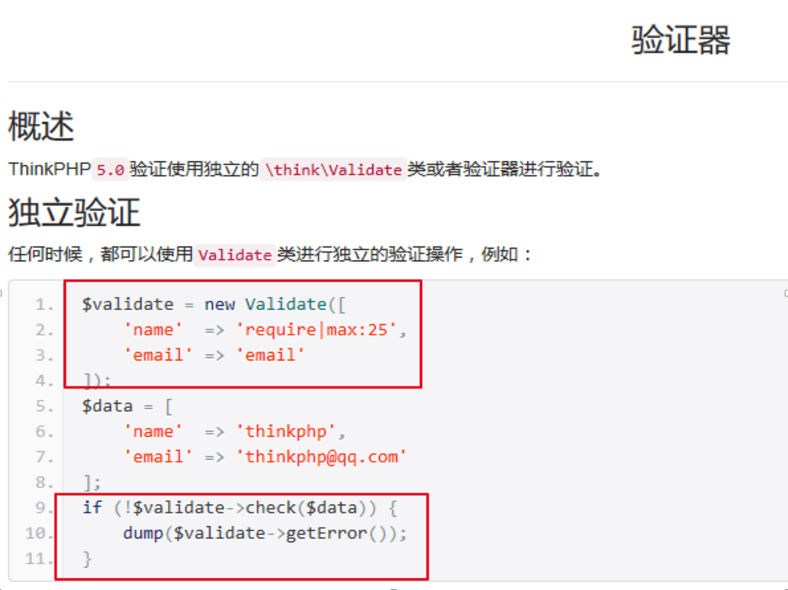

# ThinkPHP框架-2

- [ThinkPHP框架-2](#thinkphp框架-2)
- [今日目标（每日任务）](#今日目标每日任务)
- [十、ThinkPHP框架中的模型](#十thinkphp框架中的模型)
	- [1、导入数据表](#1导入数据表)
	- [2、配置数据库连接信息](#2配置数据库连接信息)
	- [3、模型的定义](#3模型的定义)
	- [4、特殊表名称的处理](#4特殊表名称的处理)
- [十一、查询多条数据（重点）](#十一查询多条数据重点)
	- [1、获取多个数据（推荐静态调用select方法）](#1获取多个数据推荐静态调用select方法)
	- [2、案例：后台商品列表展示](#2案例后台商品列表展示)
	- [3、（模板中）变量输出与数组遍历](#3模板中变量输出与数组遍历)
	- [4、URL生成](#4url生成)
- [十二、查询一条数据（重点）](#十二查询一条数据重点)
	- [1、获取一个数据（推荐静态调用find方法）](#1获取一个数据推荐静态调用find方法)
	- [2、案例：后台商品详情展示](#2案例后台商品详情展示)
- [十三、其他查询方法(重点：where方法)](#十三其他查询方法重点where方法)
	- [1、where方法（查询语法）](#1where方法查询语法)
	- [2、连贯操作（链式操作）](#2连贯操作链式操作)
	- [3、统计查询（聚合查询）](#3统计查询聚合查询)
	- [4、数据字段查询](#4数据字段查询)
	- [5、trace调试](#5trace调试)
- [十四、模板中数据的展示（了解）](#十四模板中数据的展示了解)
	- [1、条件判断标签if](#1条件判断标签if)
	- [2、范围判断标签in](#2范围判断标签in)
	- [3、使用函数](#3使用函数)
	- [4、系统变量](#4系统变量)
	- [5、使用运算符](#5使用运算符)
- [十五、数据的添加操作](#十五数据的添加操作)
	- [1、添加一条数据（save方法）](#1添加一条数据save方法)
	- [2、静态方法添加（create方法）](#2静态方法添加create方法)
	- [3、添加多条数据（saveAll方法）](#3添加多条数据saveall方法)
	- [4、过滤非数据表字段](#4过滤非数据表字段)
- [十六、案例：后台商品添加功能](#十六案例后台商品添加功能)
	- [1）功能实现](#1功能实现)
	- [2）知识点](#2知识点)
		- [1、模型的时间戳功能](#1模型的时间戳功能)
		- [2、页面跳转与重定向](#2页面跳转与重定向)
- [十七、Ueditor富文本编辑器](#十七ueditor富文本编辑器)
		- [1、Ueditor编辑器的下载](#1ueditor编辑器的下载)
		- [**2、Ueditor编辑器的使用**](#2ueditor编辑器的使用)
- [十八、表单验证](#十八表单验证)
	- [**1、验证语法**](#1验证语法)
	- [2、内置规则](#2内置规则)
	- [3、在商品添加功能中，进行表单验证（参数检测）](#3在商品添加功能中进行表单验证参数检测)
	- [4、控制器验证](#4控制器验证)


# 今日目标（每日任务）

1、能够在ThinkPHP5框架中配置数据库信息

2、能够定义ThinkPHP5框架的模型

3、能够使用模型方法查询数据

4、能够使用模型方法添加数据

5、能够使用表单验证功能


# 十、ThinkPHP框架中的模型

模型的作用：处理业务数据，与数据库进行交互。

## 1、导入数据表

新建tpshop数据库（create database tpshop character set utf8 collate utf8_general_ci）


导入数据表(source sql路径)


刷新之后，数据表如下：


说明：如果导入sql文件时，有报错，提示类似“不能使用innodb”

解决办法：

打开mysql配置文件，修改如下


重启mysql即可。

如果重启失败，找到mysql的安装目录下data目录，删除以ib开头的文件（可以先备份），再重启。


## 2、配置数据库连接信息

(见手册--数据库--连接数据库)

TP框架中，数据库的连接信息是通过配置文件来设置的。

修改application/database.php


注：框架底层使用PDO来连接数据库，从配置文件中读取相关连接信息。

 

时间戳：上述配置中，

```
'auto_timestamp'  => true    	// 自动写入时间戳字段
```

设置为true 表示数据表新增数据、修改数据的时候会自动维护对应的时间信息

字段名默认创建时间字段为create_time，更新时间字段为update_time，支持的字段类型包括timestamp/datetime/int

（见手册--模型--时间戳）


## 3、模型的定义

（见手册--模型--定义）

定义位置：application/当前分组目录/model目录下

命名规则：模型会自动对应数据表，模型类的命名规则是除去表前缀的数据表名称，采用驼峰法命名，并且首字母大写，例如：

 

| 模型名   | 约定对应数据表（假设数据库的前缀定义是 think_） |
| -------- | ----------------------------------------------- |
| User     | think_user                                      |
| UserType | think_user_type                                 |

 

可以使用命令行创建模型：

```
php think make:model 模块名/模型名
```


示例：创建后台商品模型 Goods.php

```
php think make:model admin/Goods
```


## 4、特殊表名称的处理

特殊表：没有前缀的表，或者前缀与配置项的设置不一致。

解决办法：模型中使用$table属性来设置完整数据表名称。

比如：


# 十一、查询多条数据（重点）

(见手册--模型--查询) 增删改查  (CURD  create  update  read  delete)

注意：控制器中使用模型类，必须先引入模型类。


## 1、获取多个数据（推荐静态调用select方法）

①静态调用all方法或者select方法

```php
// 获取所有数据 all 和 select

$list = User::all();

// 根据主键获取多个数据all 和 select   where id in (1,2,3)

$list = User::all('1,2,3');

$list = User::all([1,2,3]);

//或者使用数组查询(只能用all不能用select)   where status = 1

$list = User::all(['status'=>1]);
```

②动态调用all方法或者select方法

```php
$user = new User();

//查询所有数据all 和 select

$list = $user->select();

//根据主键查询多条数据all 和 select

$list = $user->select('1,2,3');

$list = $user->select([1,2,3]);

//或者使用数组查询(只能用all不能用select)

$list = $user->all(['status'=>1]);
```

注：all方法或者select方法返回的是一个包含模型对象的二维数组或者空数组

select方法和All方法的应用：[obj, obj]

 

效果：


整个返回结果数据结构 [obj,obj,obj,...]


为了打印查看方便，可以将返回的结果 转化为标准的二维数组


## 2、案例：后台商品列表展示

1）思路：

模板整合(略)

①控制器方法中，调用模型查询数据（模板变量赋值）

②数据在模板展示

2）所用知识点：

本章节之获取多个数据、变量输出与数组遍历、URL生成

3） 实现：

①修改Goods控制器index方法，查询列表页所需数据


 

②修改view/goods/index.html，遍历数组展示数据


##  3、（模板中）变量输出与数组遍历

1）变量赋值与变量输出

①模板赋值：

在控制器中，使用$this -> assign(“视图模板中的变量名”, 变量值);

使用传入参数方法：view(‘模板名’, [‘视图模板中的变量名’ => 变量值]);

②变量输出：

在模板文件中，直接输出变量  {$变量名}

输出数组中的值： 点语法 {\$变量名.键名} ； 数组语法 {$变量名[‘键名’]}

输出对象中的属性： 冒号语法 {\$变量名:属性名} ； 对象语法 {$变量名->属性名]}

③默认值设置语法： {$变量名|default=”默认值”}


2）循环输出标签volist

(见手册--模板--内置标签)

TP框架内置的遍历数组的标签: volist标签 和foreach标签。

```php
{volist name='数组变量名' key='k' id='v' offset='5' length='10' empty='nothing'}{/volist}
```

name:要遍历的数组名，不需要$符号

key:定义循环变量名，默认为i， 当前遍历的是第几个，从1开始计数，与原数组下标无关。

id:当前的循环变量，是一个变量名

offset:指定从第几个开始遍历，从0开始计数

length:指定遍历多少个元素就结束。

empty:没有数据时显示的内容

其中：如果没有定义key属性， 可以直接输出{$key}变量表示原数组的下标。

注意：这几个属性的值必须有单、双引号


 3）循环输出标签foreach

Foreach标签和volist标签类似，用法更加简单

最简单的用法：

```php
{foreach $list as $k=>$v} {/foreach}
```

也可以使用完整写法：

```php
{foreach name='数组变量名' key='k' item='v'}{/foreach}
```

name：要遍历的数组名，不需要$符号

key：定义循环变量名，原数组的下标

item：当前的循环变量，是一个变量名

其中，使用完整写法时，如果没有定义key属性， 可直接输出{$key}变量表示原数组的下标。

完整写法：


简洁写法：


## 4、URL生成

（见手册--路由--URL生成）


 

url函数的第一个参数“模块/控制器/方法”, 可以简写为“方法”，表示当前模块当前控制器的指定方法。

使用示例：商品列表页 商品新增跳转地址  可以省略模块和控制器名称，默认取当前页面所在的模块和控制器


 

# 十二、查询一条数据（重点）

## 1、获取一个数据（推荐静态调用find方法）

①静态调用get方法或者find方法

```php
//取出主键为1的数据  where id = 1

$user = \app\admin\model\User::get(1);

$user = \app\admin\model\User::find(1);

//使用数组查询(非主键字段),只能用get不能用find   where name = 'thinkphp'

$user = User::get(['name' => 'thinkphp']);

//取出第一条数据,只能用find不能用get

$user = User::find();
```

②动态调用get方法或者find方法

```php
$user = new User();

//取出主键为1的数据

$info = $user->find(1);

$info = $user->get(1);

//使用数组查询(非主键字段),只能用get不能用find

$info = $user->get(['name' => 'thinkphp']);

//取出第一条数据,只能用find不能用get

$info = $user->find();
```

注：get或者find方法返回的是当前模型的对象实例或者null

返回的模型对象，可以直接当做数组使用，也可以调用toArray() 直接转化为数组。

find方法和Get方法的应用：


 

效果：


## 2、案例：后台商品详情展示

①修改Goods控制器read方法，查询详情页所需数据


②修改view/goods/index.html，遍历数组展示数据


# 十三、其他查询方法(重点：where方法)

## 1、where方法（查询语法）

见手册--数据库--查询构造器--查询语法

```php
where('字段名','表达式','查询条件');

whereOr('字段名','表达式','查询条件');
```


| 表达式          | 含义                     |
| --------------- | ------------------------ |
| EQ、=           | 等于（=）                |
| NEQ、<>         | 不等于（<>）             |
| GT、>           | 大于（>）                |
| EGT、>=         | 大于等于（>=）           |
| LT、<           | 小于（<）                |
| ELT、<=         | 小于等于（<=）           |
| LIKE            | 模糊查询                 |
| [NOT] BETWEEN   | （不在）区间查询         |
| [NOT] IN        | （不在）IN 查询          |
| [NOT] NULL      | 查询字段是否（不）是NULL |
| [NOT] EXISTS    | EXISTS查询               |
| EXP             | 表达式查询，支持SQL语法  |
| > time          | 时间比较                 |
| < time          | 时间比较                 |
| between time    | 时间比较                 |
| notbetween time | 时间比较                 |

注：where方法中，如果比较表达式是等于，可以省略这个参数。

应用示例： 

```php
$info = User::where('id','=','1')->find();

$info = User::where('id','1')->find();

$info = User::where('name','like','%thinkphp%')->select();
```


注意：使用了where方法后，查询数据可以使用find方法和select方法，不能使用get方法和all方法。（原因：where方法返回的是Query对象，不是模型对象）


扩展：批量条件查询（手册-数据库-查询构造器-高级查询）


## 2、连贯操作（链式操作）

（见手册--数据库--查询构造器--链式操作）

原理：中间调用的方法，返回值是对象，可以继续调用对象的其他方法。

 

一条sql语句的组成可以很复杂，里边有where、order by、group by、限制查询的字段、limit、having限制条件等等，这些复杂的条件在tp框架中都有封装

注：TP框架中，中间的方法没有顺序要求，当时用于获取最终结果的find和select等方法，必须在最后。

常用链式操作方法

```php
$model = new Address();

$model->field('id,name')->select(); //指定要查询的字段，原生sql中select后面的字段

$model->order('id desc,time desc')->select(); //相当于原生sql中的order by

$model->limit(3)->select(); //相当于原生sql中的limit条件

$model->limit(0,3)->select(); 

$model->limit('0,3')->select(); 

$model->group('cate_id')->select();  //相当于原生sql中的group by

$model->having('id>3')->select();  //相当于原生sql中的having条件

$model->alias('a')->join('think_user_type t','a.id=t.user_id', 'left')->select(); //alias方法设置别名，join方法连表查询

//Address::alias('a')->join('tpshop_user u','a.user_id = u.id', 'left')->select();
```

连表查询：SELECT * FROM `tpshop_goodspics` g LEFT JOIN tpshop_goods gs on g.goods_id = gs.id;

```php
$data = \app\admin\model\Goods::where('id', '>', 32)->field('id, goods_name')->order('id desc')->limit(5)->select();
dump($data);
```


## 3、统计查询（聚合查询）

见手册--模型--聚合，或者手册--数据库--查询构造器--聚合查询

在模型中也可以调用数据库的聚合方法进行查询：

| 方法  | 说明                                     |
| ----- | ---------------------------------------- |
| count | 统计数量，参数是要统计的字段名（可选）   |
| max   | 获取最大值，参数是要统计的字段名（必须） |
| min   | 获取最小值，参数是要统计的字段名（必须） |
| avg   | 获取平均值，参数是要统计的字段名（必须） |
| sum   | 获取总分，参数是要统计的字段名（必须）   |

 

这些方法的返回值是具体的数据。在连贯操作中只能放在最后，不需要使用find和select。

count方法 相当于 select count(*) from tpshop_user;

 

 

## 4、数据字段查询

①查询一条记录的一个字段的值

```php
Goods::where(‘id’, 2)->value(‘goods_name’);
```

②查询多条记录的一个字段的值，返回一个一维索引数组

```php
Goods::where(‘id’, ‘GT’, 2)->column(‘goods_name’);
```


③查询多条记录的一个字段的值，以id字段值作为数组索引

```
Goods::where(‘id’, ‘GT’, 2)->column(‘goods_name’, ‘id’);
```


 

 

## 5、trace调试

Trace调试功能就是ThinkPHP提供给开发人员的一个用于开发调试的辅助工具。可以实时显示当前页面的操作的请求信息、运行情况、SQL执行、错误提示等

开启trace调试：

修改application/config.php , 配置以下参数：

```php
'app_trace' => true
```

 

小结练习：


 

# 十四、模板中数据的展示（了解）

## 1、条件判断标签if

TP框架中内置了if标签，用于在模板文件中进行if判断。语法如下：

```php
{if condition="($name == 1) OR ($name > 100) "} value1

{elseif condition="$name eq 2"/}value2

{else /} value3

{/if}

也可以写为以下形式：

{if ($name == 1)}value1

{/if}
```


## 2、范围判断标签in

范围判断标签包括in notin between notbetween四个标签，都用于判断变量是否中某个范围。

```php
{in name="id" value="1,2,3"} id在范围内

{/in}

{in name="id" value="$range"} id在范围内

{/in}
```

Name属性值为变量名，不带$符号

Value属性值可以是字符串范围，也可以是数组变量或者字符串变量。

相当于原生php中的  if(in_array())

## 3、使用函数

（见手册--模板--使用函数）

在模板文件中输出变量，可以对变量使用函数进行处理

语法：两种语法：

一：{$变量名称|函数名称=arg1,arg2,###}

参数中，### 表示将变量本身作为该函数的某个参数，如果变量本身就是第一个参数，可以省略。

示例：

```
//对时间格式化
{$v.goods_create_time|date='Y-m-d H:i:s', ###}
//对字符串进行md5加密
{$name|md5}
```

二：{:函数名称(参数)}

```
{:date("Y-m-d H:i:s", $v['goods_create_time'])}
```

凡是php本身的函数或者框架中定义的函数，都可以在模板中直接调用。

## 4、系统变量

（见手册--模板--系统变量）

TP框架自带了一个$Think变量，用于在模板中输出系统变量。

```
$Think.server ：相当于$_SERVER

$Think.get	：相当于$_GET

$Think.post ：相当于$_POST

$Think.request ：相当于$_REQUEST

$Think.cookie ：相当于$_COOKIE

$Think.session ：相当于$_SESSION

$Think.config.名称 ：输出配置参数

$Think.const.名称：输出常量

相当于框架帮我们做了以下事情
$Think = [
	'get' => $_GET,
	'post'=>$_POST

];
$this->assign('Think', $Think);

```

示例：url地址：<http://www.tpshop.com/index.php/Admin/Goods/index?page=10>

展示page参数值： {$Think.get.page}

 

## 5、使用运算符

在模板文件中输出变量时，可以先使用运算符进行运算。

```
+ 		{$a+$b}

- 		{$a-$b}

* 		{$a*$b}

/		{$a/$b}

%		{$a%$b}  取余或取模

++		{$a++} 或  {++$a}

--		{$a--}  或 {--$a}

```


# 十五、数据的添加操作

（见手册--模型--新增） curd :  create  update read delete

## 1、添加一条数据（save方法）

 

Save方法返回值是写入的记录数


## 2、静态方法添加（create方法）


添加数据使用示例：


## 3、添加多条数据（saveAll方法）


## 4、过滤非数据表字段

save方法：  调用save方法之前，先调用allowField方法


create方法： 给create方法传递第二个参数，true

```
User::create($_POST, true);
```

 

# 十六、案例：后台商品添加功能

需求：只添加最基本的信息（商品名称、商品价格、商品数量）

表单展示 Goods控制器create方法（整合模板）

表单提交 Goods控制器save方法

思路： 显示form表单，提交form表单，将数据接收并保存到数据表。

## 1）功能实现

①确认表单完整性，完善提交地址、name属性值等信息


②修改Goods控制器save方法，接收表单提交并保存数据。


## 2）知识点

### 1、模型的时间戳功能

（见手册--模型--时间戳）


注：自动写入时间戳字段，前提是数据表必须有对应的字段存在。

### 2、页面跳转与重定向

（见手册--控制器--跳转和重定向）

成功时跳转

```
$this -> success(“提示信息”，“跳转地址”，“返回数据”，“等待时间”，“header信息”);
```

失败时跳转

```
$this -> error(“提示信息”，“跳转地址”，“返回数据”，“等待时间”，“header信息”);
```

等待时间默认3s。  跳转地址可以不写，默认跳转回上一页。

重定向跳转：用于直接跳转，不显示提示信息。

```
$this -> redirect(“跳转地址”，“请求参数”，“http code”);
```

# 十七、Ueditor富文本编辑器

### 1、Ueditor编辑器的下载

商品的详细描述一般都是图文混合。对于图文混合的内容，需要使用富文本编辑器来实现。

Ueditor富文本编辑器的下载地址：

<http://ueditor.baidu.com/website/download.html>


下载之后：


解压：


### **2、Ueditor编辑器的使用**

使用步骤：

引入编辑器的代码到项目中

引入js文件

指定标签（携带id属性），编辑器的显示位置

在js中实例化编辑器

 

注意：使用时，富文本编辑器 分为 普通输入界面，和源代码输入界面。

如果要自己写html代码设置样式，必须点击左上角的html按钮 切换到源代码界面，输入完成后，必须至少点击一次html按钮，否则php中收不到数据的。

 

案例实现： 商品添加页面 使用ueditor富文本编辑器

将编辑器整合到项目


页面上引入编辑器（参考demo文件index.html）

①引入js文件


②在页面定义标签，id属性，name属性


③使用js代码实例化编辑器


商品描述的添加：


控制器中接收到的 商品描述字段值，是一段html代码字符串。

示例：

```
<p>test</p><p></p>

```

 

# 十八、表单验证

对接收的参数，进行格式的检测。

## **1、验证语法**

见手册--验证

TP框架提供了一个\think\Validate验证类：



也可以自定义提示信息


## 2、内置规则

见手册--验证--内置规则

## 3、在商品添加功能中，进行表单验证（参数检测）

步骤：

定义验证规则数组$rule

定义提示信息数组$msg

实例化验证类

调用check方法进行验证

代码示例：


 

## 4、控制器验证

可以在控制器中，调用validate方法，直接执行验证


 

总结：

1、配置数据库链接信息

2、定义模型（模型和数据表对应关系，命令行创建模型类）

3、查询操作方法（**find **、**select**、**where**、统计查询、连贯操作方法）

4、商品列表功能及foreach标签、使用函数语法、url生成、 商品详情页

5、添加操作及商品添加功能（save方法、saveAll方法、**静态create**、过滤非数据表字段）

6、页面跳转和重定向（success  error   redirect）

7、整合富文本编辑器到页面

8、表单验证（独立验证语法、控制器验证语法、内置规则）


重点功能（作业）： 商品列表、商品详情、商品添加、表单验证