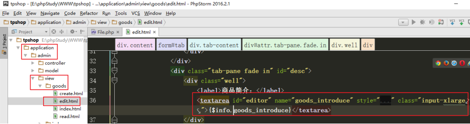
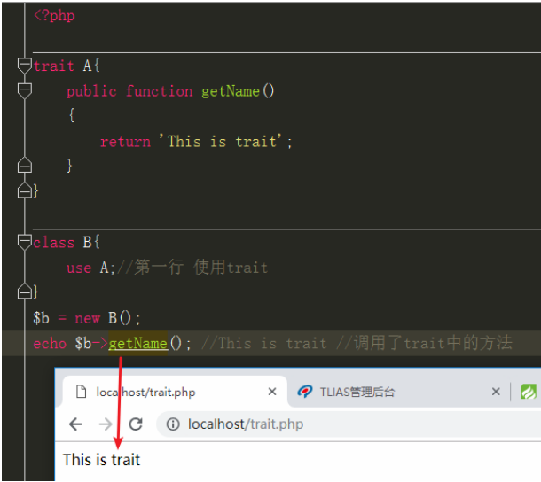
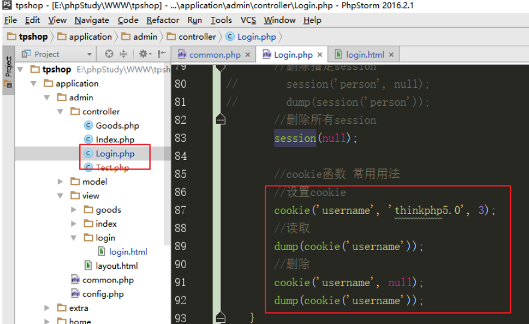
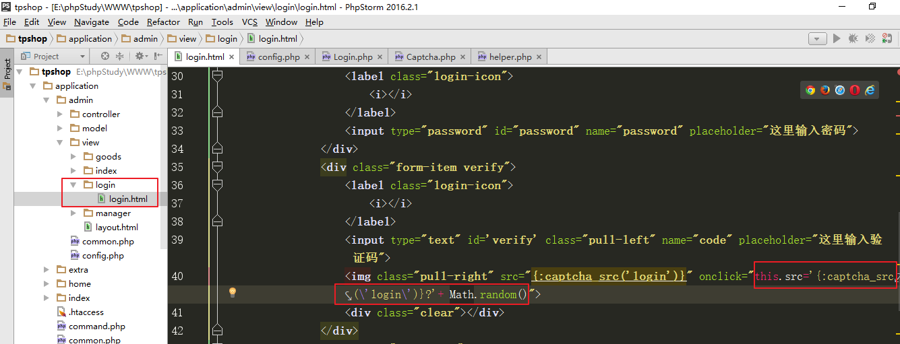

# ThinkPHP框架-03

- [ThinkPHP框架-03](#thinkphp框架-03)
- [今日目标（每日任务）](#今日目标每日任务)
- [十九、修改操作](#十九修改操作)
  - [1、更新一条数据](#1更新一条数据)
  - [2、批量更新数据](#2批量更新数据)
  - [3、静态方法更新（推荐）](#3静态方法更新推荐)
  - [4、自动识别](#4自动识别)
  - [5、课堂代码示例](#5课堂代码示例)
- [二十、案例：后台商品修改功能](#二十案例后台商品修改功能)
  - [1、页面展示](#1页面展示)
  - [2、表单提交](#2表单提交)
  - [3、ueditor富文本编辑器整合](#3ueditor富文本编辑器整合)
- [廿一、删除操作](#廿一删除操作)
  - [1、删除操作](#1删除操作)
  - [2、trait](#2trait)
  - [3、软删除](#3软删除)
- [廿二、案例完成后台的商品删除功能](#廿二案例完成后台的商品删除功能)
  - [1、设置模型的软删除](#1设置模型的软删除)
  - [2、软删除功能实现](#2软删除功能实现)
  - [3、增删改查操作小结](#3增删改查操作小结)
  - [4、id参数检测](#4id参数检测)
- [廿三、登录登出权限控制](#廿三登录登出权限控制)
  - [1、封装密码加密函数](#1封装密码加密函数)
  - [2、模板中使用请求参数](#2模板中使用请求参数)
  - [3、TP中的cookie和session](#3tp中的cookie和session)
  - [4、完成后台的登录功能](#4完成后台的登录功能)
  - [5、完成后台的登出功能](#5完成后台的登出功能)
  - [6、后台页面权限控制（越权访问--翻墙）](#6后台页面权限控制越权访问--翻墙)
- [廿四、验证码技术](#廿四验证码技术)
  - [1、使用验证码的步骤](#1使用验证码的步骤)
  - [2、TP中的验证码显示](#2tp中的验证码显示)
  - [3、验证码的校验](#3验证码的校验)
  - [4、验证码标识](#4验证码标识)
  - [](#)


# 今日目标（每日任务）

1、能够使用模型方法修改数据

2、能够使用模型方法删除数据

3、能够使用trait及实现软删除功能

4、能够使用cookie和session

5、能够使用验证码组件

 

# 十九、修改操作

（见手册--模型--更新） (CURD:  create  update  read   delete)

## 1、更新一条数据

 

 

使用示例

先查询再更新 和 直接更新 （save方法）


## 2、批量更新数据

 

以上用法通常比较少用，更多的批量更新，是使用where条件，一次更新多条数据的指定字段值。

（多条数据的同一个字段，改成同一个值）

\app\admin\model\Goods::where(‘id’, ‘GT’, 40)->update([‘goods_number’ => 100])

## 3、静态方法更新（推荐）

 

 

示例： 直接调用update方法，第三个参数 true 表示过滤非数据表字段

 

## 4、自动识别


##  	5、课堂代码示例


# 二十、案例：后台商品修改功能

表单展示 Goods控制器 edit方法（整合模板）

表单提交 Goods控制器update方法

思路：

①在表单展示 控制器方法中，查询原始的数据

②在表单页面，展示原始数据

③确认表单完整性，完善name属性和提交地址等信息，主键id隐藏域

④在表单提交的控制器方法中，接收数据

⑤参数检测（表单验证）

⑥将数据修改到数据表

⑦页面跳转。

## 1、页面展示

①修改Goods控制器edit方法，查询原始商品数据

 

②修改view/goods/edit.html ，将原始数据展示到input输入框的value上


 

## 2、表单提交

③确认表单完整性，完善提交地址和name属性值等。

 

④修改view/goods/edit.html ，添加隐藏域，保存当前商品记录的主键id值

 

⑤修改Goods控制器update方法，接收表单提交并保存数据

 

 

添加数据验证

 

 

## 3、ueditor富文本编辑器整合

①引入js文件

 

②定义标签，id属性、name属性

  

③使用js代码实例化编辑器


 

# 廿一、删除操作

（见手册--模型--删除、手册--模型--软删除）

## 1、删除操作

①先查询，再调用模型的delete方法删除

```php
$user = User::get(1);
$user ->delete();
```

②先调用where方法，再调用Query类的delete方法删除

```php
User::where(‘id’, 1)->delete();
```

③静态调用destroy方法删除（推荐）

```php
User::destroy(1);
User::destroy(‘1,2,3’);
User::destroy([1,2,3]);
User::destroy([‘status’=>1]);
```

delete方法使用示例

课堂示例


原笔记示例


a.先查询再删除

b.使用where条件，调用Query类的delete方法删除

c.静态调用destroy方法进行删除

删除效果：将指定的数据从数据表直接删除，返回值都是受影响的记录条数


## 2、trait

（见手册--架构--Traits引入）

 

1）初识trait

```php
trait A{
	public function getName()
	{
		return 'This is trait';
	}
}
```

trait的定义，和类非常相似，只需要将关键字class换成trait即可。

2）trait的使用

定义trait之后，在一个类中进行使用。

```php
class B{
	use A;
}
$b = new B();
echo $b->getName(); //This is trait
```

 

 

3）trait、类与继承

```php
trait A{
    public function getName()
    {
        return 'A-getName';
    }
    
    public function getAge()
    {
        return 'A-getAge';
    }
}

class C{
    public function getName()
    {
        return 'C-getName';
    }

    public function getAge()
    {
        return 'C-getAge';
    }

    public function getSex()
    {
        return 'C-getSex';
    }
}

class B extends C{

    //使用trait
    use A;

    public function getAge()
    {
        return 'B-getAge';
    }

    public function getSex()

    {
        return 'B-getSex';
    }
}
$b = new B();
echo $b->getSex();//B-getSex
echo $b->getName();//A-getName
echo $b->getAge();//B-getAge
```


注：有同名方法，当前类方法 会覆盖  trait的方法，trait的方法会覆盖继承类的方法。

更多使用，见**php手册**：

 

TP中的trait：

父类控制器Controller中使用了Jump这个trait，提供了页面跳转相关方法。

模型的SoftDelete这个trait，需要在自定义模型中，手动使用，提供的是软删除相关功能。

## 3、软删除

物理(硬)删除：真删除, 从数据表直接删除记录。

逻辑(软)删除：假删除（本质是修改操作），只是让数据在页面不显示，数据表中仍然保留。

原理：在数据表添加一个字段控制数据在页面的展示。点击删除操作时，修改对应字段的值。

软删除：（见手册--模型--软删除）

 


 

SoftDelete这个trait的位置：

 

 

软删除的使用示例：

在模型中进行设置

 

 

# 廿二、案例完成后台的商品删除功能

## 1、设置模型的软删除

(前面已经设置过)

  

## 2、软删除功能实现

 

 

## 3、增删改查操作小结

见admin/Curd控制器。 核心代码（15-20行）

## 4、id参数检测

 


# 廿三、登录登出权限控制

## 1、封装密码加密函数

注意：后台管理员表tpshop_manager中 初始的管理员密码

密码要自己加密一个初始密码，更新到数据表

使用自定义的密码加密函数:

  

随意找一个控制器的方法，使用加密函数对一个自定义的初始密码进行加密输出。

 

效果：

  

将此加密后的密码，复制，修改到tpshop_manager表的passwod字段。

 

## 2、模板中使用请求参数

（见手册--模板--请求参数）

  

示例：{$Request.url} 获取当前页面的url地址

 


## 3、TP中的cookie和session

（见手册--杂项--cookie，手册--杂项--session）

TP框架提供了think\Cookie类和think\Session类分别操作cookie和session.

也可以使用助手函数cookie()和session()。


session函数使用语法：

 

 


session函数基本操作

```php
session('name', 'thinkphp');  //设置
session('name');	//读取
session('name', null);	//删除单个session
session(null);	//删除所有session
```

session函数 点语法

```php
//数组用法 点语法
session('user', ['username'=>'hua', 'age'=>30]);
//使用点语法 直接操作数组中的一个键值对
session('user.email', 'hua@qq.com');
dump(session('user'));
//直接取数组中的一个键值对
dump(session('user.email'));
//删除数组中的一个值
session('user.email', null);
dump(session('user.email'));
```

cookie函数使用语法：

 

 

使用示例：

 

  

## 4、完成后台的登录功能

需要创建Manager模型：

命令行方式： php think make:model admin/Manager

思路：

①表单展示

②表单中的name属性值、提交地址

③提交的控制器方法中，接收数据

④查询用户表 验证用户名和密码

⑤用户名和密码正确，设置登录标识到session 跳转到后台首页

⑥用户名或密码错误，报错，返回登录页面

 

路径：Login控制器login方法

①确认form表单完整性，完善name属性和提交地址


 

②修改Login控制器login方法，接收表单提交并处理

判断请求方式（一个方法，处理两个业务逻辑：表单展示、表单提交）

  

表单提交post请求

 

  

登录成功，一定要设置登录标识到session。

注：where方法的使用   手册--数据库--查询构造器--高级查询

## 5、完成后台的登出功能

①在后台的Login控制器新增logout方法

  

②修改退出入口的链接地址

在view/layout.html修改对应链接地址。

 

③页面入口

 

## 6、后台页面权限控制（越权访问--翻墙）

①在Admin模块Controller目录，新增一层Base控制器

session(‘?name’)  表示 判断session中是否设置name，返回值是true和false;

 

 

②所有后台其他的控制器都需要继承Base控制器（**Login控制器例外**）

比如Index控制器、Goods控制器等

 

  

注：相同命名空间下的类，互相访问时，可以不用携带命名空间。

# 廿四、验证码技术

## 1、使用验证码的步骤

①生成验证码图片，展示在页面上

②点击图片刷新验证码功能

③提交表单后验证码的校验

## 2、TP中的验证码显示

（见手册--杂项--验证码）

 

 

 

验证码包的位置：

  

①修改配置application\config.php

 

②修改view/login/login.html 验证码图片img标签src属性

 

③点击刷新验证码图片

修改view/login/login.html，验证码图片img标签，绑定onclick事件，给src地址加随机数

 

## 3、验证码的校验

修改Login控制器login方法：表单提交后，先进行验证码校验，再查询数据表

 

##  4、验证码标识

当项目中有多个功能都需要使用验证码（比如登录页、找回密码页等），可以对验证码设置标识。

以登录页为例，可修改代码如下：

验证码标识：字符串 'login'

①验证码显示

修改view/login/login.html 验证码图片img标签src属性  给captcha_src函数传参数 ‘login’

 

②点击刷新验证码图片

修改view/login/login.html，验证码图片img标签，绑定的onclick事件  给captcha_src函数传参数 ‘login’

 

③验证码的校验

修改Login控制器login方法：表单提交后，先进行验证码校验，再查询数据表

给captcha_check函数或者captcha验证规则 传参数 ‘login’

 

## 

总结：

1、修改操作以及后台商品修改功能（save方法、saveAll方法、**静态update方法**）

2、删除操作(delete方法、**destroy方法**)与**软删除功能**、trait

3、cookie和**session**操作（助手函数）

4、登录模块功能（登录、退出、登录检测）

5、验证码（captcha_src()  captcha_img()  captcha_check()）


作业：

1、商品修改、商品删除（软删除）、登录、退出、登录检测、验证码1./2、

 2、管理员模块增删改查


注意点：

管理员列表： 不显示密码

管理员添加：用户名、密码（加密）、邮箱、昵称等

管理员修改：用户名不能修改；可以改  密码（重置别人的密码）、邮箱、昵称等

管理员删除：不能删除admin管理员

修改密码（修改自己的面）

