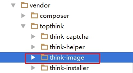

# ThinkPHP框架-04

# 今日目标（每日任务）

1、能够实现分页功能

2、能够实现文件上传和生成缩略图功能

3、能够理解DB方式操作数据库

4、能够安装并使用composer

5、能够使用路由注册功能

# 廿五、分页功能

## 1、原理

(见手册--杂项--分页）

一般在列表页数据展示时，如果数据太多，需要进行分页展示。

分页原理：核心是使用sql语句中的limit限制条件

分页的实现分为两部分：一个是分页栏链接html代码，一个是当前页数据查询。

TP中分页实现，可以使用模型的分页查询功能

  

TP框架中底层和分页相关的类文件：（**了解、不需要修改代码**）

thinkphp\library\think\Paginator.php  

 

分页驱动thinkphp\library\think\paginator\driver\bootstrap.php

 

## 2、商品列表分页展示

具体实现：

①修改Goods控制器index方法，使用模型分页查询功能查询数据

 

②修改view/goods/index.html，遍历展示数据，展示分页栏代码

遍历展示数据（**之前写好的可以不用修改**）


展示分页栏代码（**修改一行代码**）

 

③默认分页栏代码没有样式（可能会受到当前模板中的样式影响），可以自行写样式。


样式代码如下：

```css
<style type="text/css">
    .pagination li{list-style:none;float:left;margin-left:10px;
        padding:0 10px;
        background-color:#5a98de;
        border:1px solid #ccc;
        height:26px;
        line-height:26px;
        cursor:pointer;color:#fff;
    }
    .pagination li a{color:white;padding: 0;line-height: inherit;border: none;}
    .pagination li a:hover{background-color: #5a98de;}
    .pagination li.active{background-color:white;color:gray;}
    .pagination li.disabled{background-color:white;color:gray;}
</style>
```

页面效果：

 

 如果要修改 上一页 下一页 中文显示：需要修改Bootstrap.php


##  3、分页+搜索

①修改view/goods/index.html，查找功能的表单，提交地址、输入框name属性


②修改Goods控制器index方法，接收查询关键字，使用模型分页查询功能，传递第三个参数


 

# 廿六、文件上传

## 1、原理&语法

（见手册--杂项--上传,见手册--杂项--文件处理）

文件上传本身支持上传各种类型的文件，包括图片、视频、压缩包等。

比如：商城项目中商品都需要有图片展示，这些图片需要使用文件上传功能。

文件上传功能的原理：

将上传的文件保存到服务器指定位置；

将服务器上文件的访问路径保存到数据表。

①TP中的文件上传：（底层使用了\think\File类）

单文件上传

  

多文件上传：

 

上传验证：

 

上传规则：默认情况下，会在上传目录下面生成以当前日期为子目录，以微秒时间的md5编码为文件名的文件。

 

②文件上传大小限制：各个地方的限制，以最小的为准。

文件上传功能，需要在php.ini中确认允许上传的文件大小限制：可根据实际情况自行修改。

Post请求最大限制：

 

文件上传最大限制：

 

## 2、商品logo图片上传

思路：

①修改form表单：文件上传域及name值，form标签的enctype属性

②在控制器对文件进行处理，将文件保存在指定目录，将文件保存路径存到数据表

 

功能实现：

①修改view/goods/create.html ，给商品logo图片文件上传域添加name属性

确保form表单有enctype属性


 

②修改Goods控制器save方法，处理文件上传

思考：添加和修改功能都有商品logo图片上传，可以将商品logo图片的上传功能，封装成Goods控制器的一个私有upload_logo方法，需要时直接调用。

 

Goods控制器save方法中调用私有的upload_logo方法：

 

注：需要创建文件上传对应目录结构  public/uploads目录

 

Goods控制器save方法直接调用upload_logo方法

将返回值加到$data数组中即可。

 

 

注意：文件的路径写法；

在php中，凡是使用函数对文件的处理，路径要么使用./相对路径，要么使用从盘符开始的完整路径。

在html页面展示图片或者引入静态资源文件，使用/方式的路径。

## 3、商品logo图片修改

修改功能中，也有logo图片上传功能

确认表单完整性，修改view/goods/edit.html, 添加name值logo

 

在Goods控制器update方法中，调用upload_logo方法实现

需要添加一个判断：如果有图片上传，则进行图片字段的修改


 

# 廿七、缩略图生成

（见手册--杂项--图像处理）

给网站上传的图片，通常生成一张缩略图，用于前台展示。

原因：前台页面图片很多，如果图片太大，网页加载慢，服务器压力大。

在TP中提供了一个图像处理类库\think\Image，其中的包含生成缩略图的方法。

 

Image类的使用：缩略图生成：

静态调用Image类open方法打开一个图片

调用thumb方法生成缩略图

调用save保存缩略图

注意：Open方法和save方法，参数是文件的路径，要么是./方式，要么是完整路径。

代码实现：在商品logo图片上传成功后，对其生成缩略图

修改Goods控制器upload_logo方法，使用Image类生成缩略图

 

由于生成缩略图之后，原始图片没用了，所以用缩略图覆盖了原始图片。

 

# 廿八、DB方式操作数据库（了解）

（见手册--数据库--查询构造器）

TP框架中，模型是基于Db类的，最底层使用的是PDO。

TP框架中，操作数据库，除了使用模型外，还可以直接使用think\Db类。

示例：

查询数据： find方法 和select方法

 

添加数据：

 

更新数据：

 

删除数据：

 

table方法用于指定完整表名称。 name方法指定不包含前缀的表名称

使用Db类进行增删改查，示例见admin模块 Db控制器

可以使用的链式操作方法见（手册--数据库--查询构造器--链式操作）

**注意：使用Db类时，不能调用模型封装的方法，比如all方法，get方法。**

原生sql的执行：

 

示例：


 

 

# 廿九、Composer基本使用

学习目标：

①安装配置composer

②使用composer安装ThinkPHP5.0框架项目和扩展包

## 1. 介绍

官网：<https://getcomposer.org/>

中文官网：<https://www.phpcomposer.com/>

 

Composer是 PHP 用来管理依赖（dependency）关系的工具。

通俗来说，composer是PHP用来下载并自动安装外部类库文件到项目中的工具。

 

## 2. 安装


安装程序见资料目录： 

 

安装过程需要联网： 打开安装文件，一直 下一步 安装 即可（中间可能需要手动选择本地php.exe路径）。

 

 

安装完成，在命令行窗口，执行 composer命令，会出现以下提示。

 

## 3. 配置镜像

一般情况下，安装包的数据一般是从 github.com 、 packagist.org 上下载的，国外的网站连接速度很慢。“Packagist 中国全量镜像”所做的就是缓存所有安装包和元数据到国内的机房，这样就不必再去向国外的网站发起请求

镜像官网：

<https://pkg.phpcomposer.com/>

 

 

**配置方式：在命令行窗口下执行以下命令**

```
composer config -g repo.packagist composer https://packagist.phpcomposer.com
```

 

## 4. composer安装项目

可以使用composer安装ThinkPHP5.0框架项目

安装命令： composer create-project  topthink/think shop  

**create-project：**代表我们要下载项目文件(非功能包)

**topthink/think：**thinkphp5项目的名称(packagist应用市场起好的)

**shop：**		在当前目录会自动创建shop目录并存储下载下来的框架代码文件

以上命令执行完毕，就会在当前目录下创建shop目录，并把thinkphp5框架源码下载进去

示例：


 

效果：安装的是适配本地环境的最新版本tp框架

 

## 5. composer安装项目的扩展

项目中可能需要使用一些功能扩展，比如图片验证码扩展 topthink/think-captcha

项目根目录 > composer require  大名/小名  版本号

下载安装扩展(**先切换到项目根目录**)

```
项目根目录> composer require "topthink/think-captcha"  1.*
```

示例：

切换到项目根目录：

 

安装图片验证码扩展

 

扩展包安装位置：

 

## 6、基本使用-小结

①安装composer： 双击Composer-Setup.exe进行安装。

②配置镜像：执行命令

composer config -g repo.packagist composer https://packagist.phpcomposer.com

③安装项目：执行命令（以ThinkPHP5.0框架为例）

composer create-project topthink/think shop

④安装项目扩展包：项目根目录下，执行命令(以图片验证码扩展为例)

composer require topthink/think-captcha 1.*

## 7、composer的常用命令

install命令 和 update命令

 

composer install 

根据 composer.lock 文件中记录的 软件列表及版本信息 进行安装。

 

如果没有composer.lock文件， 

composer update

根据composer.json文件重新安装最新的版本。


如果要安装一个新的扩展，可以使用composer require 进行安装。

也可以 将安装包信息，添加到composer.json, 使用composer update进行安装。

 

工作中：给到大家的项目代码，通常是不包含vendor目录，只会包含composer.json和composer.lock

如果有composer.lock ，则使用composer install命令进行安装。

如果没有composer.lock, 则使用composer update 命令进行安装。

# 三十、注册路由

## 1、路由简介

什么是路由：

将用户的请求按照事先规划的方案提交给指定的控制器或者功能函数来进行处理.

 

 

## 2、路由模式

见手册--路由--路由模式

ThinkPHP5.0的路由比较灵活，并且不需要强制定义，可以总结归纳为如下三种方式：

普通模式、混合模式、强制模式。

强制模式下，系统中的每次请求都不是随意的，必须要做相关的设置，该请求才被允许，这样做的好处是系统相对比较安全、路由非常规范、有利于整体协调配置等。

配置方式：开启路由模式(application/config.php)

普通模式

```
'url_route_on'  =>  false,		//开启路由设置
'url_route_must'=>  false,		//必须使用路由
```

混合模式

```
'url_route_on'  =>  true,		//开启路由设置
'url_route_must'=>  false,		//必须使用路由
```

强制模式

```
'url_route_on'  =>  true,		//开启路由设置
'url_route_must'=>  true,		//必须使用路由
```

## 3、路由定义（路由注册）

设置路由(application/route.php)

格式：

```php
Route::rule('路由表达式','路由地址','请求类型','路由参数(数组)','变量规则(数组)');

//简化格式:

Route::get('路由表达式','路由地址','路由参数(数组)','变量规则(数组)');

Route::post('路由表达式','路由地址','路由参数(数组)','变量规则(数组)');

Route::any('路由表达式','路由地址','路由参数(数组)','变量规则(数组)');

```

参数说明：

**路由表达式**：请求地址（比如在浏览器地址栏输入的地址）

**路由地址**：表示路由表达式最终需要路由到的地址（比如模块/控制器/方法），有多种定义方式，常用的是”模块/控制器/操作?额外参数1=值1&额外参数2=值2”形式

**请求类型**：GET、POST ，大写

**路由参数**：

method:请求类型

ext:允许的后缀

deny_ext:禁止的访问后缀

domain:允许什么样的域名访问有效

https:检测是否是https请求

before_behavior:行为发生前，进行路由检查

after_behavior:行为发生后，要执行的动作

...

详情参考：手册--路由--路由参数

变量规则：检查传递的变量是否符合某个(正则)规则,规则可以通过正则定义

 

例如：

```php
Route::rule('login','home/login/login','GET',['ext'=>'html']);
访问：http://servername/index.php/login.html
路由到：http://servername/index.php/home/login/login

//路由变量
Route::rule('login/:id','home/login/login','GET',['ext'=>'html'],['id'=>'\d+']);
访问：http://servername/index.php/login/101.html
路由到：http://servername/index.php/home/login/login/id/101

Route::rule('login/:id/:name','home/login/login','GET',['ext'=>'html'],['id'=>'\d+','name'=>'[a-zA-Z]+']);
访问：http://servername/index.php/login/101/tom.html
路由到：http://servername/index.php/home/login/login/id/101/name/tom

```

使用示例：

课堂示例：


原笔记：

 

## 4、路由分组

路由分组功能允许把相同前缀的路由定义合并分组，这样可以提高路由匹配的效率，不必每次都去遍历完整的路由规则。

路由分组：

Route::group(‘分组名称’, function(){

​	//单个路由的定义

});


使用示例：


## 5、组合变量

如果路由中的变量，不想使用 /:变量名  的方式定义，可以使用 <变量名> 组合变量。

 


## 6、TP中路由与伪静态

TP5框架中，伪静态（让访问url看起来像是访问的静态html地址，实际上访问到的是php）的实现：

1、隐藏入口文件（使用apache的url重写机制）

2、伪静态后缀 .html (框架默认可以加后缀)

3、路由注册（简化路由写法）

##  7、资源路由


```
Route::resource('goods', 'admin/goods');
//对应商品的访问地址
//列表  get请求  http://域名/goods  
//添加页面  get请求  http://域名/goods/create
```

## 8、域名路由


① 配置一个虚拟站点  比如 admin.tpshop.com 还是指向项目的public目录

②修改配置文件application/config.php

```
'url_domain_deploy' => true
```

③注册域名路由  application/route.php

```
\think\Route::domain('admin', 'admin');
```


#  其他

## 1、防止表单重复提交

见手册-验证-表单令牌

场景1：网速慢的情况，表单提交按钮可以重复点击

场景2：ajax请求，发送请求按钮可以重复点击

 

解决办法：使用TP框架的表单令牌功能

原理：生成一个token字符串，session中保存一次，页面中放一个；

页面发送请求时携带token字符串，控制器中进行验证，验证成功后重置。

 

生成token两种语法：

①{:token()}  生成一个隐藏域， 存放token令牌；

得到  形似以下的代码

```html
<input type="hidden" name="__token__" value="dsargsafdsafdsagsa">
```

②{$Request.token} 生成token值

```html
<input type="hidden" name="__token__" value="{$Request.token}">
```

控制器中对token进行校验：

使用表单验证，在任何一个字段的验证规则中，加上 “token”规则

```php
$rule = ['name' => 'require|token'];
```


ajax请求   需要手动生成token, 加token参数

var data = {“\__token__”:”{$Request.token}”};

 

示例：

 


总结：

1. 分页+查找   paginate方法
2. 文件上传  （请求对象的file方法、文件对象的validate方法、move方法、getSaveName方法）
3. 缩略图生成（\think\Image::open()->thumb()->save()）
4. 了解Db方式操作数据库（执行原生sql等）
5. Composer基本使用。
6. 注册路由（路由定义、路由分组、资源路由、域名路由）
7. 防止表单重复提交（token令牌）


重点案例： 商品列表分页+查找、商品logo图片上传（新增、修改）、缩略图生成、composer基本使用

然后练习路由等内容。