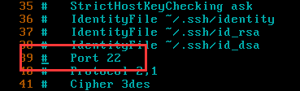

- [一、网络设置](#一网络设置)
  - [1、ip地址查看](#1ip地址查看)
  - [**2、网卡配置文件**](#2网卡配置文件)
  - [**3、网络服务操作（了解）**](#3网络服务操作了解)
- [二、ssh](#二ssh)
  - [**1、简介**](#1简介)
  - [**2、ssh的应用**](#2ssh的应用)
    - [**2.1、远程登录（重点）**](#21远程登录重点)
    - [**2.2、sftp文件传输**](#22sftp文件传输)
- [三、软件的安装方式\*\*](#三软件的安装方式)
  - [1、rpm](#1rpm)
    - [rpm示例](#rpm示例)
  - [2、yum安装（推荐）](#2yum安装推荐)
  - [3、编译安装（难点）](#3编译安装难点)
  - [小结](#小结)
- [四、计划任务（重点）](#四计划任务重点)


# 一、网络设置
## 1、ip地址查看
需要的场景：远程连接、配置相关软件时（vpn）

指令：#ifconfig（与windows的ipconfig注意区分）


得知的信息有：

1. 有2块网卡，一个叫eth0，另一个lo（本地回环网卡，本机ip）
   1) Linux中默认的第一个以太网卡就叫eth0，第二块的话就叫eth1依次类推，Io是本地回环网卡名字是不会变的
1. ip地址是 inet addr那一项
   1) 以太网卡那个inet addr就是本机ip地址外网可访问，lo是本地回环的ip地址
## <a name="_toc204933285"></a>**2、网卡配置文件**
Linux里面每一个网卡设备都会存在一个配置文件。

/etc：是专门的

位置：/etc/sysconfig/network-scripts/ifcfg-\*文件


进去之后，颜色大致有3种：

1. 蓝色的：快捷方式
1. 绿色的：具备执行权限的，都是指令脚本
1. 白色的：表示普通文件

下面主要看eth0的配置文件


ONBOOT：表示是否自动连接，是否开机启动

Ethernet：就是以太网，eth就是以太网的缩写

BOOTPROTO（COL）：网卡启动之后使用的协议，一般情况下是DHCP（动态主机分配协议-----就是咱们教室每天的ip都不一样，家里路由器也是这样的）

HWADDR：硬件地址（mac地址也叫物理地址），计算机之间的通信都是依赖于mac地址（ARP）电脑手机都会有物理地址就是mac地址

**扩展：针对像网卡配置目录层次比较深的文件，如果需要频繁更改，可以将需要的文件设置一个快捷方式，将其放在经常操作的目录，以简化后续的打开文件操作。**


**快捷方式语法：#`ln -s 原始路径 快捷方式路径`**

     -- ln是link的简写，-s是符号链接
案例：将ifcfg-eth0文件在root家目录下创建快捷方式。

#ln -s /etc/sysconfig/network-scripts/ifcfg-eth0 /root/wangka.conf

在创建快捷方式的时候`原始路径值`一定要写完整的绝对路径(就算当前在/etc/sysconfig/network-scripts目录下也不能写相对路径)，否则后期会找不到原始文件。


## <a name="_toc204933286"></a>**3、网络服务操作（了解）**
可以通过service指令来对网络的服务进行重启/停止/启动等操作。

语法：#service network start/stop/restart			(**network：指服务名：就代表所有的网卡设备，用servie操作**)


1. 因为网卡默认启动的，所以可以试下重启网络设备
2. 有4个ok，因为当前是2个网卡，所以两个网卡的重启+启动就是一个4个步骤

上述的指令还等价于：#/etc/init.d/network start/stop/restart


补充对于单个网卡的操作：

#ifdown 网卡名：				停止某个网卡

#ifup 网卡名：					启动某个网卡


**注意：上述这些操作不要随意在服务器上运行。**
# 二、ssh
## <a name="_toc204933288"></a>**1、简介**
ssh（secure shell，安全外壳协议），该协议有2个常用的作用：
  - **远程连接**
  - 远程文件传输：可以从linux上下载文件到本地，也可以上传文件

协议使用**端口**号：**默认是22。**

可以是被修改的，如果需要修改，则需要修改ssh服务的配置文件：

**#/etc/ssh/ssh_config**



端口号可以修改，但是得注意2个事项：

`	`a. 注意范围，端口范围是从0-65535；（65535是2的16次方减1）
    
    -- 端口范围为什么是65535：端口号用16位无符号二进制数表示，能提供的最大值是 2的16次方减1，即65535。

`	`b. 不能使用别的服务已经占用的端口（常见的不能使用：20，21，23，25，80，443，3389，3306，11211等等）；

**服务启动/停止/重启		｛服务名中的d全称daemon，守护进程｝**

#service sshd start/stop/restart（sshd是ssh的服务名）

#/etc/init.d/sshd start/stop/restart


Sshd服务一般默认就已经启动，不需要再去启动，可以在**修改完其配置的情况下重启**。


## <a name="_toc204933289"></a>**2、ssh的应用**
### <a name="_toc204933290"></a>**2.1、远程登录（重点）**
**终端工具**主要帮助运维人员连接远程的服务器，常见终端工具有：Xshell、secureCRT、Putty，gitbash自带ssh等。以putty为例：

- 安装使用
  - 免安装的一个exe文件，打开就可以用，可以直接放在桌面用
  - 可以放在c盘下Windows下作为环境变量，可以直接windows+R运行窗口输入文件名就自动打开

①获取服务器ip地址，可以通过ifconfig命令进行查看，然后顺手测试ip的连接相通性

#ifconfig


此处获取的ip地址地址还是192.168.254.130

测试连通性：ping 192.168.254.130


②打开putty，输入相关的信息


③在弹出key确认的时候点击“是”，以后不会再提示


④输入登录信息


之前在虚拟机的centos中全部的指令在远程终端中都是可以得到执行的。

**扩展：不借助第三方工具实现远程连接。**

`	`①打开Windows的cmd黑窗口（前提是Windows必须安装ssh服务，如果没有而需要这个功能，则自行安装openSSH）

    -- 有些电脑需要自行安装windows自带的openSSH客户端入口，在计算机应用程序管理中短则启动安装

`	`②输入“**ssh 需要登录的用户名@远程服务器的连接地址**”回车

`	`③输入密码

例如：


**小结**
1. 远程登录之后，终端中登录界面，远程机器上登录的界面两边不受影响，再次证明了windows是单用户，linux是多用户
2. init3和5在终端工具里是没有效果的，0关机和6重启的话有效果就直接断开链接了

### <a name="_toc204933291"></a>**2.2、sftp文件传输**

sftp：ssh file transfer protocol，安全的文件传输协议。

sftp工具非常多。。。。

可视化的界面传输工具：Filezilla

安装好之后可以查看到桌面图标：


①选择“文件”- “站点管理器（Ctrl + S）”


②点击“文件”菜单下方的“▽”选择需要连接的服务器，连接好之后的效果


③从本地windows上传文件到linux中方式

支持直接拖拽文件，也可以右键本地需要上传的文件，然后点选“上传”即可


④下载linux文件到本地

支持服务器文件直接拖拽到本地，也可以在右侧窗口选择需要下载的文件，右键，点选“下载”。


# 三、软件的安装方式**
在Linux CentOS系统中，软件的管理方式有三种：rpm、yum、编译方式。
## 1、rpm

linux中默认自带的rpm软件

优点：对于软件包的操作比较简单，通过简单指令即可操作

缺点：

`	`①安装时需要**自行**下载所需要的软件包

`	`②安装、卸载软件时需要考虑到**依赖关系**

  -- 如安装B时，必须要先下载A软件，因为linux是精简版系统

`	`③软件的自定义性比较差，不适合有特殊需求的场景（因为rpm包是二进制包无法自定义）

**语法：**

1. **查询**

`	`**#rpm -qa 关键词					（查询机器上是否有安装指定的软件包，只查通过二进制包的形式安装的软件，不包含编译软件与绿色软件）**

      --  绿色软件就是那种免安装的，从网上down下来解压了就能用的

`	`**选项说明：**

`		`**-q：query，查询**

`		`**-a：all，所有**

**②卸载**

`	`**#rpm -e 软件包全称 [--nodeps]	（卸载软件，包的全称需要通过①去查询）**

`	`**选项说明：**

`		`**-e：卸载**

`		`**--nodeps：忽略依赖关系**

**③安装**

`	`**#rpm -ivh 软件包路径			（软件包的下载需要自行解决，路径可以是网络路径）**

`	`**选项说明：**

`		`**-i：install，安装**

`		`**-v：显示安装过程**

`		`**-h：以“#”形式显示安装过程，类似进度条**

**④更新（了解）**

`	`**#rpm -Uvh 软件包路径			（软件包的下载、依赖关系需要自行解决，路径可以是网络路径）**

`	`**选项说明：**

`		`**-U：upgrade，升级或安装**

`		`**-v：显示安装过程**

`		`**-h：以“#”形式显示安装过程**	

**⑤查看某个文档是由哪个软件包创建的--（用户自行创建的文件是查不到的）**

`	`**#rpm -qf 需要查询的文件路径**

`	`**选项说明：**

`		`**-q：query，查询**

`		`**-f：file，指定文件**		

案例：查询、卸载、安装firefox浏览器。

查询：


卸载：


安装：

①查找FF31.1.0软件包

    1. 软件包都是以rpm格式结尾的文件
    2. 安装系统时，iso光盘镜像文件中默认的Packages目录里就是系统初始化时带的所以软件包 （iso镜像用windows资源管理器打开是个目录）
    3. 把这个光盘iso文件放到虚拟机里，虚拟机设置里使用这个镜像，点击已链接，就可以在虚拟机linux中读取这个光盘内容了
       1. windows下有盘符，linux下没有盘符它是有自己的挂载点的。
       2. `df -h`查看下这个光盘的挂载点在哪,如果没有查到的话
       3. 可以通过指令lsblk查看光盘是否挂载以及其设备文件的路径
          1. 可以看到这个光盘的MountPoint没有挂载点，即没有盘符，我们给它分个盘符（有了盘符它才能进行访问，没有盘符就访问不了这个光盘）

/media/CentOS\_6.6\_Final/Packages


通过指令lsblk查看光盘是否挂载以及其设备文件的路径。---下面是运行结果

```js
[root@localhost ~]# lsblk

NAME                        MAJ:MIN RM  SIZE RO TYPE MOUNTPOINT

sda                           8:0    0   20G  0 disk

├─sda1                        8:1    0  500M  0 part /boot

└─sda2                        8:2    0 19.5G  0 part

`  `├─VolGroup-lv\_root (dm-0) 253:0    0 17.6G  0 lvm  /

`  `└─VolGroup-lv\_swap (dm-1) 253:1    0    2G  0 lvm  [SWAP]

sr0                          11:0    1  3.8G  0 rom
```
-------进行挂载操作（即分配盘符操作）：

**指令：`mount 设备文件的路径 挂载点路径`**

**注意：设备文件都存在/dev目录下，设备文件名就是lsblk结果里前面的NAME的值**

     -- dev是设备device的简写，包括你插到电脑上的u盘，移动硬盘，光盘等

**挂载点路径自己创建空目录即可。**

\# mkdir /mnt/dvd   （不成文规定，挂载点一般都放在/mnt目录）

\# mount /dev/sr0 /mnt/dvd/


1. 开始安装


#cd /mnt/dvd/Packages

\# rpm -ivh firefox-31.1.0-5.el6.centos.i686.rpm


查询文件所属的软件包：

查询/etc/passwd文件是哪个包创建的

#rpm -qf /etc/passwd


### rpm示例

1. 安装EPEL软件包：`rpm -Uvh https://dl.fedoraproject.org/pub/epel/epel-release-latest-7.noarch.rpm`
2. 添加 Webtatic EL yum 仓库：`rpm -Uvh https://mirror.webtatic.com/yum/el7/webtatic-release.rpm`
   1. 该仓库提供了php最新版本的支持，然后就可以用yum安装最新的php版本了

## 2、yum安装（推荐）
优点：

①快速、傻瓜式的软件管理方式

②**在联网情况下**，自动从服务器上下载软件包（内、外网服务器均可）

③自动解决软件依赖关系

缺点：

`	`因其底层实为rpm操作，所以也丧失了对软件的自定义功能

**Yum常用语法：**

**①搜索/查询相关**

`	`**#yum search [all] 关键词			（根据关键词搜索远程服务器上的包资源）**

`	`**#yum list [关键词]				（列出所有的包，包含已经安装的和可供安装的）**

`	`**#yum list installed [关键词]		（列出当前已经安装的包）**

**②安装**

`	`**注意：操作指令（install）与-y选项可以颠倒，下同，-y类似于rm指令的-f选项。**

`	`**#yum [-y] install 关键词			（安装指定的软件）**

     如 `yum install httpd` -- 安装apache：其实是装httpd软件包，  然后httpd -v验证

**③卸载**

`	`**#yum [-y] remove 关键词			（卸载指定的软件）**

**④更新**

`	`**#yum [-y] update 				（更新整个系统，包含内核）**

`	`**#yum [-y] update 关键词**

测试yum指令必须先联网，过程中需要从网络下载rpm包。

## 3、编译安装（难点）

如c语言需要编译，软件包是c语言写的，写完之后得自己编译

优点：

`	`①用户可选择需要的软件功能

`	`②源码方式，有开发能力的用户，可对源码进行自定义

缺点：

`	`①需要自行解决依赖关系

`	`②编译时间较长

`	`③容易出错，一旦出错，需要重新编译安装

**编译安装步骤：**

**①下载源码包：从官网自己去下压缩的源码包**

**②解压源码包**

**③进入解压目录**

**④配置安装**

**⑤编译：i相当于编译成可执行程序**

**⑥安装**

案例：编译安装Nginx。

类似于apache，是一款开源的web服务器软件，其默认用的端口号也是80。

①下载nginx包

下载地址：<https://nginx.org/en/download.html>


复制下载地址。

需要将下载地址在终端中输入，进行下载：

#cd /usr/local/src（一般用户上传的资源，下载的资源放在src目录下）

    -- linux中，wget指令可以实现下载功能 

`#wget https://nginx.org/download/nginx-1.15.5.tar.gz`


②解压压缩包

#tar -jxvf 路径(针对.tar.bz2格式)			【记忆谐音BJ=北京】

#tar -zxvf 路径(针对.tar.gz格式)			【当前选这个】【记忆谐音GZ=广州】

`#tar -zxvf nginx-1.15.5.tar.gz`


③进入解压后的目录

#cd nginx-1.15.5

④配置安装


    -- configure是可执行文件，待会用它来执行配置安装

配置包含：指定安装的位置、需要的模块功能

**指定位置使用：--prefix选项：表明这个软件安装到什么路径去**

`	`例如：--prefix=/usr/local/nginx

`# ./configure --prefix=/usr/local/nginx`
   
    -- 一般执行文件都需要加上./，表示在当前目录下找这个文件，不要省略点。

需要安装2个依赖：

#yum install pcre-devel

#yum install zlib-devel（devel叫开发版本）

然后继续重新配置，确认没有问题会看到如下效果：


⑤编译&&完成安装

#make && make install			【&&表示连接两个指令，只有当前面的指令执行成功才会执行后面的指令】


测试NGINX的使用：

`#service httpd stop`

- 先通过`ps -ef | grep httpd`检查apache服务有没有启动，占用了80端口


注意：通过编译安装的所有软件不支持service指令进行操作，需要找到nginx的执行文件才能启动。

    -- 如不支持service nginx start


启动：/usr/local/nginx/sbin/nginx

重启：/usr/local/nginx/sbin/nginx -s reload


编译安装的软件，如果要卸载，只需要将安装目录删除掉即可。

## 小结

1. 用yum/rpm安装的软件，存放到什么地方，不是都放到1个目录里去，配置相关的放到etc目录下，扩展和安装的软件放到usr下，var下放日志类的文件。。。如php的配置文件会放到etc去，php的执行文件放到usr下，日志放到var下

# 四、计划任务（重点）
作用：操作系统不可能24小时都有人在操作，有些时候想在指定的时间点去执行任务（例如：每天夜里2点去重新启动Apache），此时不可能真有人每天夜里2点去执行命令，此时可以交给计划任务程序去执行操作。

**招行信用卡批核系统**

**15点审核完成**

**21.00 更新审核不通过的**

**5.00 更新审核通过的**

语法：`#crontab 选项`

`	`常用选项：

`		`**-l：list，列出指定用户的计划任务列表**

`		`**-e：edit，编辑指定用户的计划任务列表,执行后是个vim界面**

①列出


看到上述的提示表示root用户没有计划任务需要去做。

**②编辑计划任务（重点）**

    -- 计划任务的规则语法格式，以行为单位，一行则为一个计划：

**分 时 日 月 周 需要执行的命令**


例如：如果想要每天的0点0分执行reboot指令，则可以写成

0 0 \* \* \* reboot

**取值范围（常识）：**

**分：0~59**

**时：0~23**

**日：1~31**

**月：1~12**

**周：0~7，0和7表示星期天**

**四个符号：**

**\*：表示取值范围中的每一个数字**

**-：做连续区间表达式的，要想表示1~7，则可以写成：1-7**

**/：表示每多少个，例如：想每10分钟一次，则可以在分的位置写：\*/10**

**,：表示多个取值，比如想在1点，2点6点执行，则可以在时的位置写：1,2,6**

**分 时 日 月 周 需要执行的命令**

问题1：每月1、10、22日的4:45重启network服务

45 4 1,10,22 \* \* service network restart

问题2：每周六、周日的1:10重启network服务

10 1 \* \* 6,7 service network restart

问题3：每天18:00至23:00之间每隔30分钟重启network服务

\*/30 18-23 \* \* \* service network restart

问题4：每隔两天的上午8点到11点的第3和第15分钟执行一次重启

3,15 8-11 \*/2 \* \*  reboot

案例：真实测试案例，每1分钟往root家目录中的RT.txt中输一个1，为了看到效果使用追加输出【**输出使用echo指令，语法：#echo 输出的内容**】


执行的效果：


注意：在计划任务中，默认的最小单位就是分，不能再小了。如果需要做到秒级别的则需要配合研发相关代码。
