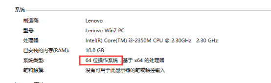
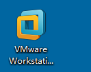
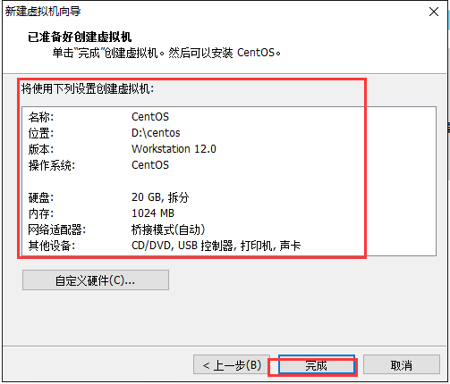
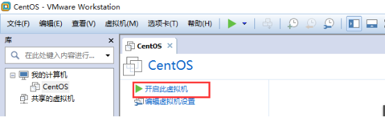

# **LAMP编程之Linux（1）**

- [**LAMP编程之Linux（1）**](#lamp编程之linux1)
- [**一、Linux介绍**](#一linux介绍)
  - [**1、常见的操作系统**](#1常见的操作系统)
    - [全面介绍](#全面介绍)
  - [**2、为什么要使用Linux操作系统**](#2为什么要使用linux操作系统)
  - [**3、Linux简介（了解）**](#3linux简介了解)
    - [**3.1、Linux操作系统**](#31linux操作系统)
    - [**3.2、开源文化**](#32开源文化)
    - [**3.3、Linux分支**](#33linux分支)
- [**二、Linux安装**](#二linux安装)
  - [**1、安装虚拟环境**](#1安装虚拟环境)
  - [**2、Linux安装**](#2linux安装)
- [**三、Linux目录介绍**](#三linux目录介绍)
- [**四、命令行(shell，壳)**](#四命令行shell壳)
- [**五、基本命令（重点）**](#五基本命令重点)
  - [**1、简单命令**](#1简单命令)
    - [**1.1、ls指令**](#11ls指令)
    - [**1.2、clear指令**](#12clear指令)
    - [**1.3、su指令**](#13su指令)
    - [**1.4、cd指令**](#14cd指令)
    - [**1.5、pwd指令**](#15pwd指令)
  - [**2、文档的操作命令**](#2文档的操作命令)
    - [**2.1、创建文件**](#21创建文件)
    - [**2.2、创建文件夹**](#22创建文件夹)
    - [**2.3、复制**](#23复制)
    - [**2.4、移动/剪切/重命名**](#24移动剪切重命名)
    - [**2.5、删除**](#25删除)
  - [**3、文档的查看指令**](#3文档的查看指令)
    - [**3.1、tail指令**](#31tail指令)
    - [**3.2、head指令**](#32head指令)
    - [**3.3、cat指令（重点）**](#33cat指令重点)
    - [**3.4、tac指令**](#34tac指令)
    - [**3.5、vim指令**](#35vim指令)
  - [**4、关机重启指令（了解，凑数）**](#4关机重启指令了解凑数)
    - [**4.1、reboot指令**](#41reboot指令)
    - [**4.2、shutdown指令**](#42shutdown指令)
    - [**4.3、halt指令**](#43halt指令)
- [**六、扩展（1）**](#六扩展1)
  - [**1、ctrl+a**](#1ctrla)
  - [**2、ctrl+e**](#2ctrle)
  - [**3、↑和↓键**](#3和键)
  - [**4、将命令执行结果保存到文件中去（重点）**](#4将命令执行结果保存到文件中去重点)
- [小结](#小结)

LAMP：Linux Apache MySQL PHP

LNMP：Linux Nginx MySQL PHP

WAMP：Windows Apache MySQL PHP

**Linux是一个操作系统。**

# **一、Linux介绍**
## **1、常见的操作系统**
- Windows

  它微软公司开发的一款桌面操作系统（闭源系统）。版本有dos、win98、win NT、win XP、win 7、win vista、win 8、win 10。服务器操作系统：win server 2003、win server 2008、win server 2012。

- Mac

  苹果公司开发的一款操作系统（闭源系统），目前最新的版本是IOS12。界面风格还是不错。对于系统底层的优化也是很好。

- Linux

  Linux是一个开源的操作系统，目前是市面上占有率极高的服务器操作系统。目前其分支有很多如：Red Hat、CentOS、Debian、Ubuntu、Fedora、SUSE、OpenSUSE、Arch Linux、Manjaro、elementary OS、Deepin、Mint、Pop OS、Zorin OS、MX Linux、Kali Linux、Tails、NetBSD、OpenBSD、FreeBSD、Haiku、GNU/Linux等。

- Unix（了解）

  Unix是Linux操作系统的前身，Unix诞生时间就是咱们常用的时间戳是指1970年1月1日0时0分0秒，1970年是Unix的时间元年，也就是Unix诞生的年份。

### 全面介绍

1. Windows 系列

描述：由微软公司开发的一系列操作系统，主要用于个人电脑和服务器。

代表产品：
Windows XP, Windows 7, Windows 8, Windows 10, Windows 11
Windows Server 系列（如 Windows Server 2019）

特点：图形用户界面友好，广泛应用于家庭、办公以及商业环境。

2. Unix 和类 Unix 操作系统

描述：Unix 是一个多用户、多任务的操作系统家族，最初由贝尔实验室在1969年开发。许多现代操作系统都是基于 Unix 或者受到它的启发。

子类别：

Unix 系统：包括原始的 Unix 版本及其直接衍生物。

代表产品：IBM AIX, HP-UX, Sun Solaris

类 Unix 系统：这些系统虽然不是直接源自 Unix，但它们的设计哲学和特性与 Unix 相似。

Linux：一个开源的操作系统内核，基于它构建了众多发行版（如 Ubuntu, Fedora, Debian）。

macOS：苹果公司的桌面操作系统，基于 Darwin 内核，Darwin 包含了一个 XNU 内核，结合了 Mach 和 BSD 的元素。

BSD：Berkeley Software Distribution，包括 FreeBSD, NetBSD, OpenBSD 等。

3. Linux 发行版

描述：Linux 不是一个单一的操作系统，而是一个内核，基于这个内核有各种各样的发行版，每个都包含不同的软件包、工具链和支持服务。

代表产品：
Ubuntu, Fedora, Debian, CentOS, Red Hat Enterprise Linux (RHEL)

特点：高度可定制化，开源社区驱动，适用于服务器、嵌入式系统及桌面环境。

## **2、为什么要使用Linux操作系统**
在线看片：<http://goto.red/ilU955>

之所以大部分的公司开发的时候都是使用Linux操作系统，取决于两个特性：

**稳定性：取决于系统的底层架构，一般情况下Linux系统能做到很长时间不关机一点也不卡顿；**

**安全性：开源系统，所有人都可以贡献自己的源代码为Linux系统打补丁；**
## **3、Linux简介（了解）**
### **3.1、Linux操作系统**
- 人  物  Linus

  Linux的开发作者，李纳斯·托瓦兹。荷兰在校大学生。

- 1991年  0.0.1版本

  李纳斯当时学校使用的就是Unix操作系统，然后其对系统的底层代码进行了修改，放到了学校为学生开放的网站上，原先他把文件命名写成了Linus’s Unix，后期网络管理发现之后觉得这个名字不好，自己手动的将名字改成Linux。随后其他同学下载之后发现这个版本还是挺好用的，随后都把自己代码贡献给李纳斯。

- 1992年  0.0.2版本
- 1994年  1.0版本
- 2003年  2.6版本

上面所说的版本是指**Linux的内核版本**，不是指分支的发行版本如centos的16版本是发行版本。
### **3.2、开源文化**
Linux是**开源**的操作系统。所谓开源就是指开放源代码。

- 人  物  Stallman	斯特曼

  开源文化的倡导人。

- 1983年  **GNU**计划	     格奴计划
- 1985年  FSF基金会
- 1990年  Emacs、**GCC（C语言编译器）**、程序库  
- 1991年	Stallman去找Linus，商谈让Linux加入其开源计划（GNU计划）
- 1992年  GNU/Linux(92年后改名了gnu下的linux)
### **3.3、Linux分支**
目前分支比较多，常见的有centos（社区企业网络操作系统）、RedHat(centos属于红帽的一个分支)、乌班图、debian等等。

具体的分支，可以查看【文件】中的Linux分支图。

# **二、Linux安装**
通常情况下安装分为真机安装、在虚拟环境中安装。

真机安装：是指将电脑上的操作系统真实的换做其他的操作系统；

1、centos镜像版本介绍参考：https://cloud.tencent.com/developer/article/2038139

**虚拟环境安装：是指通过一些特殊的软件虚拟出一个安装环境，然后在安装环境中进行安装**；（虚拟机≠虚拟主机）
## **1、安装虚拟环境**
虚拟环境可以通过特殊的软件来实现：**VMare Wrokstation（墙裂推荐）**、Virtual Box等。

32位安装：适用于32位电脑；

64位安装：是用于64位电脑；

系统的位数可以在【计算机】-【属性】中查看：

CentOS-6.6-i386-bin-DVD1.iso：镜像文件，也就是Linux的安装包

**第一步：先运行VM的安装程序，然后点击下一步**

**第二步：同意其许可协议，然后点击下一步**

**第三步：选择安装的位置**

**说明：该路径是指虚拟机软件的安装路径**。

**第四步：选择是否帮助VM公司提高软件的用户体验，可以不选。**

**第五步：勾选快捷方式**

**第六步：点击安装按钮**

**第七步：安装完成**

桌面上会有这个图标：

**要求在网卡里面要多出2个网卡**：

安装完成之后打开软件会看到下面的界面：

## **2、Linux安装**
1、创建新的虚拟机

2、安装流程

**第一步：打开软件，点击屏幕中大的“+”或者选择【文件】选项卡中的【创建新的虚拟机】创建新的虚拟机**

**第二步：在弹出的引导界面，选择【自定义（高级）】，点击【下一步】**

**第三步：在选择虚拟机兼容性界面直接点击下一步**

**第四步：选择介质来源，这个时候选择第三个【稍后安装操作系统】，然后点击【下一步】**

**第五步：选择操作系统类型，然后点击下一步**

-- 你的镜像是多少位哪个版本 就在这选哪个版本，否则会开不了机。

**第六步：设置虚拟机的名称已经其安装目录**

**说明：这个路径是指虚拟机安装的操作系统所产生的文件存放目录，不是指虚拟机的安装目录；**

**第七步：选择虚拟操作系统的cpu核心数**

**说明：此处以及后续的配置设置中设置的配置不要超过当前运行电脑的配置**。---- 参考任务管理器的逻辑处理器显示，总处理器核心数量不能超过任务管理器显示的总数量，也不要满，给windows本机留点。

**第八步：设置操作系统的内存数值，一般情况下默认即可**

**说明：**

`	`**1、设置内存的数值必须是4的倍数，最少1个g；**

`	`**2、内存的设置数值不要超过当前电脑的内存数值；**

**第九步：选择网络类型，选择【NAT】，然后点击【下一步】**

1. 网络类型详解：https://blog.csdn.net/weixin_45178128/article/details/147463488

**第十步：选择I/O控制器类型，默认即可，点击【下一步】**

**第十一步：选择磁盘类型，默认即可，点击【下一步】**

**第十二步：选择磁盘位置，选【创建新的磁盘】，然后点击【下一步】**

**第十三步：选择磁盘大小，默认20G**

--- 只要不是立即分配就行，其他选项就是用多少占多少，最大占20g

**第十四步：设置磁盘文件位置，默认即可，点击【下一步】**

**第十五步：安装向导结束，点击【完成】就可以**

安装完成看到下面这个界面：

**第十六步：选择镜像文件**

点击【编辑虚拟机设置】

选择ISO文件，然后点击【确定】：

此处iso文件不需要解压。

开启虚拟机：

**第十七步：选择【安装或更新一个已经存在的系统】，按下回车**

**小技巧：首次运行虚拟机系统的时候，我们可能把鼠标点进去，然后发现鼠标出不来了，这个时候我们可以按下键盘上的组合键【ctrl+alt】，鼠标就可以出到外面的系统了**。

**第十八步：是否检测媒体文件，不检测，通过←和→来选择选项，选择【skip】，按下回车**

**第十九步：重新引导之后选择唯一一个按钮【next】**

**第二十步：选择语言，可以选择【简体中文】，然后点击【next】**

**第二十一步：选择键盘类型，默认【美式英语】即可，点击【下一步】**

**第二十二步：选择存储设备类型，默认即可，然后点击【下一步】**

**第二十三步：设置磁盘，选择【忽略所有数据】**

**第二十四步：设置网络**

设置网卡开机自动连接

点击【应用】再点击【关闭】

最后再点击【下一步】

**第二十五步：设置时区，默认即可，直接点击【下一步】**

**第二十六步：设置密码，密码对用的用户名是root**

密码有限制：最少是6位，并且建议是大写+小写+数字的组合

设置完成之后点击【下一步】

**第二十七步：选择安装类型，这个时候选择【使用所有空间】，然后点击【下一步】**

然后选【将修改写入磁盘】

**第二十八步：选择Linux系统的安装模式，默认desktop-现在自定义-下一步**

下一步中勾选【开发】中的【开发工具】

**注意：一定要确保【开发工具】前面有一个√。**

然后再点击【下一步】

**第二十九步：等待安装完成重新引导，这个过程需要安装1160多个软件，时间大概消耗20分钟左右**

**第三十步：完成之后点击【重新引导】，系统会重新启动**

**第三十一步：在欢迎界面点击【前进】**

在许可协议界面同意协议，再点击【前进】

**第三十二步：设置新的用户（非超级管理员用户），填写好之后点击【前进】**

**第三十三步：设置时间，然后点击【前进】**

**第三十四步：设置kdump的时候会提示错误，因为没有足够的内存，所以这一步默认跳过，最后点击【完成】**

**第三十五步：重启之后的效果**

会出现一个登录框，并且显示出非root用户的帐号名，点击需要进行登录的用户名之后输入其密码即可进行登录；如果需要使用root帐号登录，则点击【其他】，然后输入root用户名和密码即可。

登录之后的显示界面：

# **三、Linux目录介绍**

默认有21个目录

/：表示的是根的意思

/bin：（binary）存放的是一些二进制文件，但是在Linux中二进制文件是可以被执行的。这个目录中的命令文件是给普通用户使用（非超级管理员用户）。

**/etc：Linux下所有的配置文件都会存放到etc目录。**

/home：是所有非root用户家目录的一个集合。相当于C盘的users

/root：root用户的家目录。

/sbin：sbin表示super bin（shell bin），里面同样也类似于bin目录，也存放了一些二进制文件，只不过这些命令只能是让超级管理员去运行。

**/usr：存放着一些用户自己下载安装，上传的软件，其实类似于windows下的Program Files目录。**

**/var：（variable可变的文件）存放着Linux下的一些日志文件，在实际开发的时候有一些公司也习惯把Apache或者nginx的站点目录也会放到这个目录中。**

/boot：存放的是引导加载程序（bootloader）的文件，在系统启动的过程中会加载这个目录下的文件。

/dev：（device设备）存放的是设备文件，在Linux中所有的设备都可以被看作是文件。光驱，硬盘

/lib：（library）存放的是一些库文件，在Linux中所有的库文件都是以.so结尾的文件。

/lost+found：万一丢了文件，丢失了再找

/proc：所有进程文件

/sys：系统文件

/tmp：临时文件，系统重启会清空，权限最低。

# **四、命令行(shell，壳)**

了解：常见的shell。

Csh、tcsh、zsh、**bash**等（linux中清一色都使用的是bash shell）

在Linux中如何打开命令行界面？

打开方式：在Linux中的任意一个空白的地方（不要点着图标），右键然后选择【在终端中打开】，会看到一个类似于下面界面的窗口：

命令行符号介绍：

关于用户身份标记说明：

**在Linux中#表示超级管理员身份，$符号表示普通用户**。

# **五、基本命令（重点）**
通用语法格式：# **指令名称 [选项]  [操作的目标]**

假设：让小明去楼下超市买清风牌的餐巾纸和农夫山泉牌矿泉水。

买东西是指令

水和餐巾纸是目标

清风和农夫山泉是选项。
## **1、简单命令**
### **1.1、ls指令**
语法1：**#ls  [路径]**		

表示列出**指定路径**下的文件夹和文件的名字，如果路径没有指定则列出当前路径下的（list）

例如：在root用户的家目录中输入ls命令，则会看到以下的效果：

要求列出/home的文档的名称。

#ls /home

1. 红色：表示的是压缩或归档文件
2. 绿色：表示的是可执行文件，文件具有执行权限，可以像程序一样运行
3. 蓝色：表示的是目录
4. 青色：代表链接文件，套接字和管道文件
5. 紫色：表示的是设备文件
7. 白色：表示的是普通文件

语法2：**#ls  -l  [路径]**	

表示**以列表的形式**列出指定路径下的文件夹和文件的名字

例如：使用ls –l的命令列出当前用户家目录中的文件夹和文件信息

语法3：**#ls -la [路径]**	

表示**以列表的形式**列出指定路径下的文件夹和文件名（**包含隐藏文件,all**）

例如：在当前用户的家目录中输入ls –la命令可以查看全部的文件夹和文件名，并且包含了隐藏文件（**特点是以“.”开头的名字**）

注意：如果一个指令拥有多个选项，**一般情况下（95%+）**对于选项的顺序没有要求，随意谁前谁后。**但是为了避免混淆建议按照笔记里的顺序来记忆。**

**在Linux下严格区分大小写。**
### **1.2、clear指令**
表示的含义：清空当前屏幕中全部的命令（**其实质是没有清空，只不过是顶到上面去了**）

**语法：#clear**

**等效于快捷键：ctrl + L**

**清除Windows的cmd指令叫做：cls**
### **1.3、su指令**
作用：切换用户（switch user）。

语法：**#su 需要切换到的用户名（用户名可以不写，则表示切换到root用户）**

例如：

1、从root用户切换到linux123用户。

#su linux123

2、从linux123用户切换到root用户。

#su root

等价于：

#su

通过上述两个命令的操作发现一个结论：

**当切换到的用户权限如果比当前用户的权限低，可以直接切换，不需要密码；反之，如果从低往高切换则要求输入被切换到的账户对应的密码（高级权限账户密码）。**

**在输入密码的时候不会有任何的输入提示，输入完毕之后按下回车即可，如果输错了，可以按回车重新输入，或者按住backspace键3秒以上，然后重新输入。**
### **1.4、cd指令**
作用：切换目录（change directory）。

**语法：#cd 需要切换到的路径（路径可以是相对路径，也可以是绝对路径）**

**路径可以写也可以不写，不写则表示切换到当前用户的家目录（一键回城）。**

例如：

1、从root用户家目录中切换到linux123用户的家目录中

#cd /home/linux123

**提示：在切换路径或者后期打开一个文件的时候可以多建议使用tab键（可以自动补全命令路径）。**

2、切换用户切换到linux123用户，然后从linux123用户的家目录使用cd切换到root的家目录

结论： **低级用户没有权限访问高级用户相关的资源（权限）**。

**关于路径：**

路径分为相对路径和绝对路径。

相对路径是相对当前路径的一种表现形式。

特点：只要不是以“/”开头的就是相对路径。

绝对路径是直接从“根”开始的一种路径形式。

特点：以“/”开头的路径称之为绝对路径。

/root/a/b/c

root/a/b/c

./root/a/b/c

../root/a/b/c

案例：从root用户家目录中切换到linux123用户的家目录中，要求以相对路径形式书写。

### **1.5、pwd指令**
**作用：打印当前的工作路径（print working directory）**。

例如：在当前用户的家目录中使用pwd命令。

## **2、文档的操作命令**
### **2.1、创建文件**
命令：touch

语法：#**touch**路径     

例如：

1、在当前路径下创建一个文件名字叫php2019.txt。

\# touch php2019.txt

2、在磁盘根目录下创建文件php2019.txt。

\# touch /php2019.txt

### **2.2、创建文件夹**
命令：mkdir		[make directory]

语法：#mkdir [-p] 文件夹路径

选项：

`	`-p表示递归创建(parent)，可同时创建多级不存在的文件夹

例如：在root的桌面上创建一个php的文件夹

#mkdir php

问题：

#mkdir index.php创建的是什么？  【文件夹】

**注意：不能以后缀来判断文档是文件还是文件夹。应该看ls -l指令的执行结果的第一个字符。d表示文件夹，-表示普通文本文件。【c：字符设备文件、b：块状设备文件、l：连接文件（快捷方式）、s：套接字文件】**

问题：

在上述的指令执行的基础上行，执行#touch index.php，创建的是什么？ 	【**没有任何效果**】

原因：因为在此之前已经产生同名的文件夹，系统不允许在同一路径下存在同名的文档，因此不执行创建文件操作。
### **2.3、复制**
命令：cp	（copy）

语法：**#cp [-r] 需要复制的文档 需要保存的位置**

选项说明：

`	`-r：表示**递归**。**如果复制的是文件夹，则-r就不是选项，是必须要加的。**

问题：文档在复制的过程中，其名称一般是否变化？ 【不变，数量变化】

案例1：需要使用root用户，将根下的php2019.txt复制到linux123用户的家目录下

案例2：将桌面上（当前目录）的php文件夹复制到linux123的家目录下

### **2.4、移动/剪切/重命名**
命令：mv	（move）【剪切+粘贴】

**语法：#mv 需要操作的文档 新的文档的位置**

案例：【移动/剪切】将linux123家目录下的php2019.txt，移动到root家目录下。

问题：移动操作会影响什么？		【**路径变化，数量不变，名称不变**】

案例2：【重命名】将root下的php2019.txt重命名为php.doc。

问题：重命名操作会影响什么？	【**名称变，路径不变，数量不变**】

### **2.5、删除**
命令：rm	（remove）

**语法：#rm [-rf] 需要删除的文档**

选项说明：

`	`-r：表示递归（**当删除的类型是文件夹的时候就加-r**）

`	`-f：force，表示强制，没有删除确认提示（删除文件夹的时候也建议带上-f选项，避免重复的询问）

案例1：删除root下的php.doc

案例2：删除桌面上的php文件夹

**面试题：**

1. 请问使用root用户“#rm -rf /”这个命令能不能执行？
   1. 不能执行，会先提示根下操作十分危险
   2. 需要添加选项：`--no-preserve-root`可以删掉

## **3、文档的查看指令**
### **3.1、tail指令**
作用：查看一个文件的末n行

语法：#tail -n 文件的路径

说明：-n可以不写，不写，默认表示10行。

案例：使用tail指令查看root/install.log文件的末5行和末10行

\# tail -5 /root/install.log

\# tail /root/install.log

### **3.2、head指令**
作用：查看文件的头n行

语法：#head -n 文件的路径

注意：如果不指定-n则默认头10行

案例：使用head指令查看root/install.log文件的头5行和头10行

\# head -5 /root/install.log

\# head /root/install.log

### **3.3、cat指令（重点）**
作用：查看某个文件的全部内容（将内容全部输出在命令行中）【正序：第一行就显示第一行】

语法：#cat 文件路径1  文件路径2  文件路径3 …

案例：使用cat指令输出install.log文件内容

#cat /root/install.log
### **3.4、tac指令**
作用：查看某个文件的全部内容（倒序的：第一行显示在最后一行）

语法：#tac 文件路径1  文件路径2  文件路径3…

案例：使用tac指令输出install.log文件内容

#tac /root/install.log
### **3.5、vim指令**
作用：打开一个文件，显示内容

语法：#vim 文件路径

例如：打开/root/install.log

#vim /root/install.log

退出输入“:q”按下回车即可。

## **4、关机重启指令（了解，凑数）**
### **4.1、reboot指令**
作用：重启计算机

语法：#reboot

注意：**部分情况下（除非自开机以来只有当前一个普通用户登录过）普通用户可以执行重启**-------其他情况普通用户无法执行reboot指令

### **4.2、shutdown指令**
作用：关机

语法：#shutdown -h 时间

时间常见的值：

`			`now：（shutdown -h now），表示立即关机

`			`+m：（m表示minutes数字），例如+5，则表示五分钟之后关机

### **4.3、halt指令**
作用：关机（通过关闭内存来关机）

语法：#halt

- 其他关机命令：
  - 关机：init 0
  - poweroff
  - 重启：init 6
# **六、扩展（1）**
## **1、ctrl+a**
在命令行中可以使用ctrl+a，来进行光标的快速定位：可以将命令行中的光标从其他的位置快速移动到行首。【ahead】
## **2、ctrl+e**
在命令行中可以使用ctrl+e，来进行光标的快速定位：可以将命令行中的光标从任意位置快速定位到行末。【end】

## **3、↑和↓键**
在命令行输入的位置可以按下↑来查看之前的执行命令历史，可以按下↓来翻到最新的命令执行历史。【即使远程终端断开连接，下次连接上依然可以使用】

## **4、将命令执行结果保存到文件中去（重点）**

> 也叫**输出重定向**: 将本身的终端里的输出，重定向到文件中去。

按照下面的语法：

#需要执行有输出结果的命令 > 需要保存到的文件路径			【覆盖写】

或者

#需要执行有输出结果的命令 >> 需要保存到的文件路径			【追加写】

- windows中自带`tree /f > 文件名` 也可以用重定向>符号。
  - 用于树状格式列出目录内容
  - -f 选项，它用于显示每个文件或目录的完整绝对路径前缀，不加f默认相对路径

# 小结
|指令|作用|选项|
| :- | :- | :- |
|ls|列出指定路径下的目录结构名称|-l、-a|
|clear|清屏（快捷键Ctrl+L）||
|su|切换用户||
` `cd		  切换当前工作路径

` `pwd	  打印当前工作路径

` `touch	  创建文件

` `mkdir	  创建文件夹					   -p（parent）

` `cp		  复制文档						   -r

` `mv		  移动/重命名

` `rm		  删除文档						   -r、-f
北京市昌平区建材城西路金燕龙办公楼一层   电话：400-618-9090
