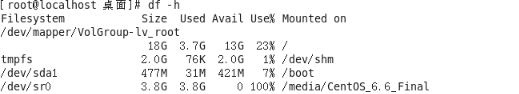
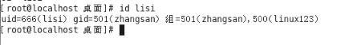
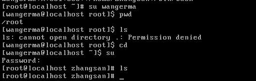
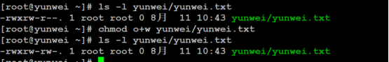

# **LAMP编程之Linux（2）**

- [**LAMP编程之Linux（2）**](#lamp编程之linux2)
- [**一、进阶指令**](#一进阶指令)
  - [**1、du指令**](#1du指令)
  - [**2、df指令**](#2df指令)
  - [**3、free指令**](#3free指令)
  - [**4、find指令（特例）**](#4find指令特例)
  - [**5、ps指令（重点）**](#5ps指令重点)
  - [**5、pkill指令**](#5pkill指令)
  - [**6、service指令**](#6service指令)
  - [**6、Systemctl语法：**](#6systemctl语法)
  - [**7、grep指令（重点）**](#7grep指令重点)
  - [**8、wc指令**](#8wc指令)
  - [**9、日期指令（重点）**](#9日期指令重点)
  - [**10、管道（重点）**](#10管道重点)
- [**二、vim编辑器**](#二vim编辑器)
  - [**1、vi介绍**](#1vi介绍)
  - [**2、三种模式**](#2三种模式)
    - [**2.1、命令模式**](#21命令模式)
      - [**2.1.1、光标移动**](#211光标移动)
      - [**2.1.2、复制操作**](#212复制操作)
      - [**2.1.3、剪切/删除**](#213剪切删除)
      - [**2.1.4、撤销/恢复**](#214撤销恢复)
    - [**2.2、模式间的切换**](#22模式间的切换)
    - [**2.3、末行模式**](#23末行模式)
    - [**2.4、编辑模式**](#24编辑模式)
  - [**3、vim其他（补充）**](#3vim其他补充)
    - [**3.1、异常退出**](#31异常退出)
    - [3.2、别名机制（意义）](#32别名机制意义)
- [**三、用户与用户组（重点）**](#三用户与用户组重点)
  - [**1、用户管理**](#1用户管理)
  - [**2、用户组管理**](#2用户组管理)
- [**四、权限管理**](#四权限管理)
  - [**1、权限介绍（重点）**](#1权限介绍重点)
  - [**2、身份介绍（重点）**](#2身份介绍重点)
    - [**Owner身份（文件所有者，默认为文档的创建者）**](#owner身份文件所有者默认为文档的创建者)
    - [**Group身份（与文件所有者同组的用户）**](#group身份与文件所有者同组的用户)
    - [**Others身份（其他人，相对于所有者与同组用户）**](#others身份其他人相对于所有者与同组用户)
    - [**Root用户（超级用户）**](#root用户超级用户)
  - [**3、Linux的权限查看**](#3linux的权限查看)
  - [**4、权限设置（重点）**](#4权限设置重点)
    - [**4.1、字母形式**](#41字母形式)
    - [**4.2、数字形式**](#42数字形式)
    - [**4.3、注意事项**](#43注意事项)
  - [**5、属主与属组**](#5属主与属组)
    - [**5.1、chown（重点）**](#51chown重点)
    - [**5.2、chgrp（了解）**](#52chgrp了解)


# **一、进阶指令**
## **1、du指令**
作用：du表示directory used，显示出目录所占的磁盘空间大小的情况。

语法：#du -sh **目录**路径

选项说明：

`	`-s：表示sumary，汇总统计

`	`-h：表示以较高可读性的形式显示

案例：使用du -sh指令统计出“/etc”的大小情况


## **2、df指令**
作用：disk free，查看磁盘的剩余空间的情况。

语法：#df -h

选项说明：

`	`-h：表示以较高可读性单位进行查看。


## **3、free指令**
作用：查看内存的使用情况

语法：#free -m

选项含义：

`		`-m：表示以mb为单位进行查看


注意：

`	`**第一行表示memory，是内存各项的数字。**

`		`**其中，如果查看可用的剩余内存（已分配后剩余），应该是3527的位置。**

`			  `**如果看的是剩余的内存（未被使用），则应该是3725的位置。**

1. Mem：是物理内存，total是系统总物理内存大小，shared表示多个进程共享的内存
   1. buffers：用于块设备 I/O（如磁盘读写）的临时缓存储，减少磁盘IO操作
   2. Cached：缓存文件系统中的数据，加速文件访问
2. -/+ buffers/cache 行：实际物理内存（计算了占用的缓存空间的）
   1. used：实际已使用的内存（不包括 buff/cache）。
      1. 计算公式：used = Mem.used - (buff + cache)
      2. 示例中为 88984 KB（约 87.8 MB）。
   2. free：系统可分配给新进程的内存（包括 free 和可回收的 buff/cache）。
   3. 计算公式：free = Mem.free + (buff + cache)
   4. 示例中为 165788 KB（约 162.8 MB）。
   5. 关键点：这是系统真正可用于新进程的内存
3. swap：交换空间
   1. total：系统总交换空间大小，used已使用的交换空间和free未使用的
   2. 当物理内存不足时，系统会将部分内存数据写入交换分区（Swap）


## **4、find指令（特例）**
作用：表示根据条件去查询文档的所在位置。

场景：当用户想找一个文档，但是只记得其部分特征，这个时候就可以使用find指令查询路径。

**指令 查找范围路径 选项 选项的值 选项 选项的值 选项 选项的值**

语法：#**find 范围路径 选项 选项的值 [选项 选项的值 ….]**

常见的选项：

`		`**-name：根据名字进行查询**

`		`**-type：根据文档的类型进行查询。[d表示文件夹，f表示普通文件，s表示套接字文件，l表示连接文件，c表示字符设备文件，b表示块状设备文件]**

`		`-user：根据所有者进行查询

`		`-group：根据所属的用户组进行查询

`		`-size：根据大小进行查询

案例：我们记不清一个文件httpd.conf所在位置，现在要求使用find指令进行查询


**补充：-name选项支持通配符（“\*”），模糊查询，表示任意长度的任意字符。**

例如：假设我需要查询磁盘中全部的.conf文件，则可以写成：#find / -name “\*.conf” -type f

## **5、ps指令（重点）**
作用：表示process show，查看进程

语法：#ps -ef				【补充语法：#ps aux，BSD格式进行输出】

选项含义：

`		`-e：等价于-A，all，表示全部

`		`-f：表示full，显示全部的列

操作效果：


## **5、pkill指令**

`pkill`：是一个通过 进程名 或 其他属性 来发送信号（默认是 SIGTERM）从而终止进程的命令

`pkill php` 会杀死所有进程名中包含 php 的进程

**UID：该进程的启动用户名；**

**PID：process id，进程的id号**

**PPID：parent process id，父级进程id号**

**C：表示的cpu的使用情况**

**STIME：start time，启动时间**

**TTY：终端的设备编号，“？”表示该进程不是由终端发起的**

**TIME：持续运行的时间**

**CMD：command，显示进程的名称或者位置**

**补充：结束进程的指令**

**#kill PID**

**补充：top指令（查资源占用情况用top）**


**退出按q即可。**
## **6、service指令**
作用：操作服务的（启动/停止/重启）

语法：#service 服务名 start/stop/restart

服务名必须要在/etc/init.d中可见。

案例：使用service指令启动apache（httpd）

#service httpd start


**注意：对于服务名是存在要求的，要求服务名必须存在于“/etc/init.d”目录下。**


除了可以用service指令操作服务，还可以通过如下语法：

**#/etc/init.d/服务名 start/stop/restart**

所以刚才apache的启动指令还可以写成：#/etc/init.d/httpd start

**扩展：在CentOS7中如何控制服务的？**

**在7中兼容service指令，但是在执行之后实际上是跳转到systemctl指令去执行的操作。**

## **6、Systemctl语法：**

systemctl 和 service 都是用于管理系统服务的命令，service比较老旧，systemctl功能更强大

**# systemctl start/stop/restart 服务名**

## **7、grep指令（重点）**
作用：搜索、过滤，主要用于对文件/内容进行筛选，选出需要的内容

语法：#**grep [选项] 关键词 文件路径/内容**

常见的选项：

`		`-v：排除，取反

**案例：使用grep筛选出ps.txt（ps执行的结果）中的gnome-session行**


案例：使用grep -v实现排除**gnome-session**所在行


**扩展用法：**

#grep -E “关键词1|关键词2|…” 文件路径或内容

`	`选项：-E表示extension，该语法表示多条件筛选可以指定多个关键词，“|”表示or

上述扩展用法等价于：用`egrep指令`实现多关键词筛选

#egrep “关键词1|关键词2|….” 文件的内容或路径
## **8、wc指令**
作用：word count，其作用是用于统计文件的各项数值（行、单词数、字节数）

语法：#wc -lwc 文档的路径

选项含义：

`		`-l：line，行数

`		`-w：word，单词数

`		`-c：byte，字节数

案例：使用wc指令分别统计文件/etc/passwd的行、单词数、字节数

#wc -lwc /etc/passwd


**注意：lwc选项的顺序，不影响其指令输出的结果的顺序，结果顺序一定是行 、 单词 、字节。**

## **9、日期指令（重点）**

> https://www.cnblogs.com/peida/archive/2012/12/13/2815687.html

做一些时间相关的处理，格式化显示或设定系统的日期与时间（自动更新也可以，不联网时有时需要手动更新系统时间）

## **10、管道（重点）**
管道严格意义上说其不是指令，其只是一个符号“|”。该符号主要起到辅助的作用，能够将多个指令合在一行上进行操作。主要用在搜索过滤等上面。

**语法：# 必须在终端中有输出内容的指令 | 有输入的指令[要求有读取文件内容的需求]**

管道的核心理解概念：**管道前面的指令的输出其实就是管道后面指令的输入**。

案例：通过ps指令查看进程，只查看httpd的进程。

\# ps -ef | grep “httpd”


课堂作业：

“/etc/passwd”文件是存储用户信息的文件，该文件中**一行即为一个用户**，要求使用所学的指令统计出当前计算机中一共有多少个用户。

\# cat /etc/passwd | wc -l


# **二、vim编辑器**
## **1、vi介绍**
Vi编辑器是所有Unix及Linux系统下标准的编辑器，类似于windows系统下的notepad（记事本）编辑器，由于在Unix及Linux系统的任何版本，Vi编辑器是完全相同的，因此可以在其他任何介绍vi的地方都能进一步了解它，Vi也是Linux中最基本的文本编辑器，学会它后，我们将在Linux的世界里畅行无阻，**尤其是在终端中**。

关于vim：

vi和vim都是Linux中的编辑器，不同的是，**vim比较高级**，可以视为vi的升级版本。vi使用于文本编辑，但是vim更适用于coding（写代码的）---vim提供了代码高亮，语法有颜色，写错了语法提示等等，。

**Vim重点是光标的移动，模式切换，删除，查找，替换，复制，粘贴，撤销命令的使用**。

**在后期使用的Linux系统中，有些可能没有初始自带vim，而自带了vi，那么vim指令是不能直接使用的，需要先安装。**

Vim被称之为编辑器之神。
## **2、三种模式**
Vim中存在三种模式（大众的认知）：**命令模式、编辑模式（输入模式）、末行模式（尾行模式）**。

**1-命令模式：在该模式下是不能对文件直接编辑，可以输入快捷键（命令）进行一些操作（删除行，复制行，移动光标，粘贴等等）【打开文件之后默认进入的模式】；**

**2-编辑模式：在该模式下可以对文件的内容进行编辑；**

**3-末行模式：可以在末行输入命令来对文件进行操作（搜索、替换、保存、退出、撤销、高亮等等）；**

--- Vim的打开/新建文件的方式：

**#vim 文件路径					作用：打开指定的文件(若不存在则会自动新建文件)**

#vim  +数字  文件的路径			作用：打开指定的文件，并且将光标移动到指定行

#vim  +/关键词  文件的路径		作用：打开指定的文件，并且高亮显示关键词（搜索）

**重点：先复制出一个/etc/passwd文件，复制当前桌面下（千万不要在etc下直接修改！！！）**


### **2.1、命令模式**
注意：该模式是打开文件的第一个看到的模式（打开文件即可进入）
#### **2.1.1、光标移动**
①光标移动到行首

按键：shift + 6 或 **^**（T字母上面的6，不要按小键盘的6）

②光标移动到行尾

按键：shift + 4 或 **$**（R字母的左上角的4，不是小键盘的4）

**③光标移动到首行行首**

按键：gg

**④光标移动到末行行首**

按键：G			[Capslk 再加 G键] / [Shift + G键]

**⑤翻屏**

向上翻屏：按键ctrl + b   （before）	或 		PgUp

向下翻屏：按键ctrl + f	   （after）		或		PgDn

**⑥快速定位到指定行**

数字G
#### **2.1.2、复制操作**
①复制光标所在行

按键：yy

**粘贴：在想要粘贴的地方按下p键【将粘贴在光标所在行的下一行】,如果想粘贴在光标所在行之前，则使用P键**

**②以光标所在行为准（包含当前行），向下复制指定的行数**

按键：数字yy

#### **2.1.3、剪切/删除**
**①剪切/删除光标所在行**

按键：dd			（删除之后下一行上移）

**注意：dd严格意义上说是剪切命令，但是如果剪切了不粘贴就是删除的效果。**

**②剪切/删除光标所在行为准（包含当前行），向下删除/剪切指定的行**

按键：数字dd		（删除之后下一行上移）

③剪切/删除光标所在的当前行（光标所在位置）之后的内容，但是删除之后下一行不上移

按键：D				（删除之后当前行会变成空白行）
#### **2.1.4、撤销/恢复**
撤销：输入“:u”（不属于命令模式）  或者   u			（undo）

恢复：ctrl + r			恢复（取消）之前的撤销操作【重做，redo】


### **2.2、模式间的切换**


**末行模式进入之后的特征：光标在最后一行上**

**编辑模式进入之后的特征：在最后一行有类似于“------插入（insert）-----”的提**

注意：**末行模式和编辑模式之间是没有办法直接切换**的，必须先走命令模式。

### **2.3、末行模式**
进入方式：由命令模式进入，按下“:”或者“/（表示查找）”即可进入

退出方式：

`		`a. 按下esc

`		`b. 连按2次esc键

`		`c. 删除末行全部输入字符     

**①保存操作（write）**

**输入：“:w”				保存文件**

输入：“:w  路径”		**另存**为 （了解） 

**②退出（quit）**

输入：“:q”				退出文件

默认情况下，退出的时候需要对已经进行修改的文件进行保存（:w），然后才能退出。

**③保存并退出**

输入：“:wq”				保存并且退出

**④强制 （!）**  

输入：“:q!”				表示强制退出，刚才做的修改操作不做保存

**⑤搜索/查找**

输入：“**/关键词**”，再按下回车		【按下/也是进入末行模式的方式之一】

例如：想在passwd文件中搜索“sbin”关键词


**在搜索结果中切换上/下一个结果：N/n		（next）**

如果需要取消高亮，则需要在末行模式中输入：“:nohl”【no highlight】

**⑥替换**

单词substitute的首字母

```js
:s/搜索的关键词/新的内容				替换光标所在行的第一处符合条件的内容(必须是光标所在行，否则报找不到匹配模式)

:s/搜索的关键词/新的内容/g			替换光标所在行的全部符合条件的内容

:%s/搜索的关键词/新的内容			替换整个文档中每行第一个符合条件的内容

:%s/搜索的关键词/新的内容/g			替换整个文档的符合条件的内容

%表示整个文件（所有行）

g表示全局（global）

案例：将测试文件中的bin关键词全部替换成xxxx
```
⑦显示行号（临时）

输入：“***:set nu***”[number]

如果想取消显示，则输入：“:set nonu”

**补充：要想永久显示行号，需要进行对vim的配置。**

建议创建文件：“~/.vimrc”（该配置是针对用户的，每个用户自己家下有一个独立.vimrc）


⑧扩展：部分命令模式操作使用末行模式实现

**了解：**

**末行模式下的复制（yy）、剪切（dd）、删除（dd）操作**

**复制语法：“:开始行号,结束行号y”，例如输入“:1,10y”**

**剪切删除语法：“:开始行号,结束行号d”，例如输入“:1,10d”**

**一步到位的复制语法——“:开始行号,结束行号 co 粘贴到的行号”**

**剪切粘贴一步到位语法——“:开始行号,结束行号 m 粘贴到的行号”**

### **2.4、编辑模式**


重点看前2个进入方式：i（insert）、a（after）。

**退出方式：按下esc键**

## **3、vim其他（补充）**
### **3.1、异常退出**
什么是异常退出：在编辑文件之后并没有正常的去wq（保存退出），而是遇到突然关闭终端或者断电的情况，则会显示下面的效果，这个情况称之为异常退出：  


**解决办法：删除“.文件名.swp”文件即可解决上述问题。**

### 3\.2、别名机制（意义）
别名机制表示允许操作者对现有的指令/脚本进行重新的命名，例如clear指令表示清屏，其在Windows下叫做cls，但是Linux不支持cls指令，我们可以通过别名机制让Linux系统支持cls指令。

目的：允许用户创建自己的指令。

案例：如上，要求用户能够使用cls实现清屏

提示一下：要想给指令起别名，需要编辑文件“~/.bashrc”


语法：alias 别名=’原始名称/路径’

保存退出之后不会立即生效，需要当前用户重新登录到系统才会生效。因此建议su一下：


作业：

创建自定义指令“cc”，要求效果：输入cc之后按下回车，直接显示当前系统中的用户数量。
# **三、用户与用户组（重点）**
Linux系统是一个**多用户多任务**的操作系统，任何一个要使用系统资源的用户，都必须首先向系统管理员申请一个账号，然后以这个账号的身份进入系统。

用户的账号一方面可以帮助系统管理员对使用系统的用户进行跟踪，并控制他们对系统资源的访问；另一方面也可以帮助用户组织文件，并为用户提供安全性保护。

每个用户账号都拥有一个唯一的用户名和各自的密码。

用户在登录时键入正确的用户名和密码后，就能够进入系统和自己的主目录。

要想实现用户账号的管理，要完成的工作主要有如下几个方面：

用户账号的添加、删除、修改以及用户密码的管理。

用户组的管理（添加、删除、修改）。

**注意三个文件：**

/etc/passwd				存储用户的关键信息

/etc/group				存储用户组的关键信息

/etc/shadow				存储用户的密码信息
## **1、用户管理**
①添加用户

**语法：#useradd 选项 用户名**

常用选项：

`	`**-g：表示指定用户的用户主（主要）组，选项的值可以是用户组的id，也可以是组名**

`	`**-G：表示指定用户的用户附加（额外）组，选项的值可以是用户组的id，也可以是组名**

`	`-u：uid，用户的id（用户的标识符），**系统默认会从500之后按顺序分配uid**，如果不想使用系统分配的，可以通过该选项自定义【类似于腾讯QQ的自选靓号情况】

`	`**-c**：comment，添加注释（选择是否添加）

`	`**-s**：指定用户登入后所使用的**shell 解释器** 【专门的接待员】

`	`-d：指定用户登入时的启始目录（家目录位置）

`	`-n：取消建立以用户名称为名的群组（了解）

案例：创建用户zhangsan，不带任何选项


验证：验证是否真的成功了。


验证是否成功：

`	`a. 验证/etc/passwd的最后一行，查看是否有zhangsan的信息；

`	`#tail -1 /etc/passwd

`	`b. 验证是否存在家目录（在Centos下创建好用户之后随之产生一个同名家目录）；

`	`c. id zhangsan 指令来进行验证

**扩展：认识passwd文件**


**用户名:密码:用户ID:用户组ID:注释:家目录:解释器shell**

**用户名：创建新用户名称，后期登录的时候需要输入；**

**密码：此密码位置一般情况都是“x”，表示密码的占位；**

**用户ID：用户的识别符；【-u】**

**用户组ID：该用户所属的主组ID；【-g】**

**注释：解释该用户是做什么用的；【-c】**

**家目录：用户登录进入系统之后默认的位置；【-d】**

**解释器shell：等待用户进入系统之后，用户输入指令之后，该解释器会收集用户输入的指令，传递给内核处理；【如果解释器是/bin/bash表示用户可以登录到系统，/sbin/nologin表示该用户不能登录到系统】【-s】**

**注意：在不添加选项的时候，执行useradd之后会执行一系列的操作**

`	`**a. 创建同名的家目录；**

`	`**b. 创建同名的用户组；**

案例：添加选项，创建用户lisi，让lisi属于501主组，**附加组500**，自选靓号666，并且要求不能登录到系统，可以写注释为“user lisi”。


验证是否创建成功：



    ---- `id lisi`查看系统中用户 lisi 的用户和组信息
    ---- `id` 默认是当前登录用户的信息  
    ---- `cat /etc/passwd`查看系统中所有用户的信息
    ---- `cat /etc/group`查看系统中所有组的信息
    ---- `cat /etc/shadow`查看系统中所有用户的密码信息
    ---- `cat /etc/shadow | grep lisi`查看系统中用户lisi的密码信息


**注意：查看用户的主组可以查看passwd文件，查看附加组可以查看group文件。**


**linux123行的含义：在linux123的组里（组id是500）有一个组内用户lisi（lisi的附加组就是500，附加组的名字是linux123）。**

**如果需要为一个用户指定多个附加组，只需要将多个附件组的id通过英文逗号“,”分割即可。**

**【主组只能有1个（类似于亲生父母只有一对），附加组可以多个，也可以没有附加组（类似于认干爹干妈，可以有也可以没有，也可以有多个）】**

**【主组必须有】**

**【文档的属组指的是主组】**

②修改用户

**语法：#usermod 选项 用户名**

Usermod：user modify，用户修改

常用选项：

`	`-g：表示指定用户的用户主组，选项的值可以是用户组的id，也可以是组名

`	`-G：表示指定用户的用户附加组，选项的值可以是用户组的id，也可以是组名

`	`-u：uid，用户的id（用户的标识符），**系统默认会从500之后按顺序分配uid**，如果不想使用系统分配的，可以通过该选项自定义【类似于腾讯QQ的自选靓号情况】

`	`**-l：修改用户名**

`	`-c<备注>：修改用户帐号的备注文字

-d<登入目录>：修改用户登入时的目录

-s<shell>：修改用户登入后所使用的shell

案例：修改zhangsan用户主组为500，附加组改为501

#usermod -g 500 -G 501 zhangsan


案例：修改zhangsan用户用户名，改为wangerma

\# usermod -l wangerma zhangsan


③设置密码

Linux不允许没有密码的用户登录到系统，因此前面创建的用户目前都处于锁定状态，需要设置密码之后才能登录计算机。

**语法：#passwd [用户名]		【如果不指定用户名则修改自己的密码】**

案例：设置wangerma用户的密码

#passwd wangerma

在设置密码的时候也是没有任何输入提示的，放心输入，确保两次输入的密码一致，按下回车即可。

也可以使用弱密码，但是不建议，否则会看到以下的提示：


设置密码之后shadow文件中的体现：能够看出lisi用户没有密码的。


在设置用户密码之后可以登录帐号，例如此处需要登录wangerma

**切换用户命令：#su [用户名]	（switch user）**

**如果用户名不指定则表示切换到root用户。**



**切换用户需要注意的事项：**

`	`**a. 从root往普通用户切换不需要密码，但是反之则需要root密码；**

`	`**b. 切换用户之后前后的工作路径是不变的；**

`	`**c. 普通用户没有办法访问root用户家目录，但是反之则可以；**

④删除用户

语法：#userdel 选项 用户名

Userdel：user delete（用户删除）

常用选项：

`	`-r：表示删除用户的同时，删除其家目录；

案例：删除wangerma用户

#userdel -r wangerma


**注意：已经登录的wangerma用户删除的时候提示删除失败，但是没有登录的lisi用户可以正常删除**。

解决办法：简单粗暴，kill对应用户的全部进程


**提示：所有跟用户操作的命令（除passwd外，只能修改自己的密码，即不指定用户名）只有root超级管理员有权限执行。**

**备注：也可以在登录需要删除的用户之后，按下快捷键“ctrl+d”进行对当前用户的注销，随后退回到上一个用户（root）此时就可以对需要删除的用户进行删除操作。**


## **2、用户组管理**
每个用户都有一个用户组，系统可以对一个用户组中的所有用户进行集中管理。不同Linux 系统对用户组的规定有所不同，如Linux下的用户属于与它同名的用户组，**这个用户组在创建用户时同时创建**。

用户组的管理涉及用户组的**添加、删除和修改**。组的增加、删除和修改实际上就是对/etc/group文件的更新。


文件结构：

**用户组名:密码:用户组ID:组内用户名[看附加组的]**

密码：X表示占位符，虽然用户组可以设置密码，但是绝大部分的情况下不设置密码；

组内用户名：表示附加组是该组的用户名称；

①用户组添加

**语法：#groupadd 选项 用户组名**

常用选项：

`	`-g：类似用户添加里的“-u”，-g表示选择自己设置一个自定义的用户组ID数字，如果自己不指定，则默认从500之后递增；

案例：使用groupadd指令创建一个新的用户组，命名为admins

#groupadd admins


②用户组编辑

**语法：#groupmod 选项 用户组名**

常用选项：

`	`-g：类似用户修改里的“-u”，-g表示选择自己设置一个自定义的用户组ID数字

`	`-n：类似于用户修改“-l”，表示设置新的用户组的名称

案例：修改admins用户组，将组ID改成520，将名称改为admin123


③用户组删除

**语法：#groupdel 用户组名**

案例：删除admin组

#groupdel admin


**注意：当如果需要删除一个组，但是这个组是某个用户的主组时，则不允许删除（附加组是可以的）；如果确实需要删除，则先从组内移出所有用户。**


**提示**

**针对用户和用户组的管理指令，除了passwd指令之外，其他指令一般情况下只有root用户可以执行。**
# **四、权限管理**
## **1、权限介绍（重点）**
在Linux中分别有**读、写、执行**权限：

**读权限：**

`	`**对于文件夹来说，读权限影响用户是否能够列出目录结构**

`	`**对于文件来说，读权限影响用户是否可以查看文件内容**

**写权限：**

`	`**对文件夹来说，写权限影响用户是否可以在文件夹下“创建/删除/复制到/移动到”文档**

`	`**对于文件来说，写权限影响用户是否可以编辑文件内容**

**执行权限：**

`	`**一般都是对于文件来说，特别脚本文件。**

`	`**对于文件来说，执行权限影响文件是否可以运行。**

`	`**对于文件夹来说，执行权限影响对应的用户是否可以在文件夹内执行指令。**

## **2、身份介绍（重点）**
### **Owner身份（文件所有者，默认为文档的创建者）**
由于Linux是多用户、多任务的操作系统，因此可能常常有多人同时在某台主机上工作，但每个人均可在主机上设置文件的权限，让其成为个人的“私密文件”，即个人所有者。因为设置了适当的文件权限，除本人（文件所有者）之外的用户无法查看文件内容。

例如某个MM给你发了一封Email情书，你将情书转为文件之后存档在自己的主文件夹中。为了不让别人看到情书的内容，你就能利用所有者的身份去设置文件的适当权限，这样，即使你的情敌想偷看你的情书内容也是做不到的。
### **Group身份（与文件所有者同组的用户）**
与文件所有者同组最有用的功能就体现在**多个团队在同一台主机上开发资源的时候**。例如主机上有A、B两个团体（用户组），A中有a1,a2,a3三个成员，B中有b1,b2两个成员，这两个团体要共同完成一份报告F。由于设置了适当的权限，A、B团体中的成员都能互相修改对方的数据，但是团体C的成员则不能修改F的内容，甚至连查看的权限都没有。同时，团体的成员也能设置自己的私密文件，让团队的其它成员也读取不了文件数据。**在Linux中，每个账户支持多个用户组。如用户a1、b1即可属于A用户组，也能属于B用户组【主组和附加组】**。

- 每个用户有且只有一个主组。一个用户可以属于零个或多个附加组

### **Others身份（其他人，相对于所有者与同组用户）**
这个是个相对概念。打个比方，大明、二明、小明一家三兄弟住在一间房，房产证上的登记者是大明（owner所有者），那么，大明一家就是一个用户组，这个组有大明、二明、小明三个成员；另外有个人叫张三，和他们三没有关系，那么这个张三就是其他人（others）了。

同时，大明、二明、小明有各自的房间，三者虽然能自由进出各自的房间，但是小明不能让大明看到自己的情书、日记等，这就是文件所有者（用户）的意义。
### **Root用户（超级用户）**
在Linux中，还有一个神一样存在的用户，这就是root用户，因为在所有用户中它拥有最大的权限 ，所以管理着普通用户。因此以后在设置文档的权限的时候不必考虑root用户。

## **3、Linux的权限查看**
要设置权限，就需要知道文件的一些基本属性和权限的分配规则。在Linux中，ls命令常用来查看文档的属性，用于显示文件的文件名和相关属性。

**#ls -l 路径		【ls -l  等价于 ll】**


标红的部分就是Linux的文档权限属性信息。

**Linux中存在用户（owner）、用户组（group）和其他人（others）概念**，各自有不同的权限，对于一个文档来说，其权限具体分配如下：


**十位字符表示含义：**

**第1位：表示文档类型，取值常见的有“d表示文件夹”、“-表示文件”、“l表示软连接”、“s表示套接字”、“c表示字符设备”、“b表示块状设备”等等；**

**第2-4位：表示文档所有者的权限情况，第2位表示读权限的情况，取值有r、-；第3位表示写权限的情况，w表示可写，-表示不可写，第4位表示执行权限的情况，取值有x、-。**

**第5-7位：表示与所有者同在一个组的用户的权限情况，第5位表示读权限的情况，取值有r、-；第6位表示写权限的情况，w表示可写，-表示不可写，第7位表示执行权限的情况，取值有x、-。**

**第8-10位：表示除了上面的前2部分的用户之外的其他用户的权限情况，第8位表示读权限的情况，取值有r、-；第9位表示写权限的情况，w表示可写，-表示不可写，第10位表示执行权限的情况，取值有x、-。**

**注意：除了权限位上的rwx以及-之外，还有一些特殊的权限代码“s”、“t”，这些不在本次考虑范围内。**

权限分配中,均是rwx的三个参数组合，**且位置顺序不会变化**。没有对应权限就用 – 代替。

## **4、权限设置（重点）**
**语法：#chmod [选项] 权限模式 文档**

注意事项：

`	`常用选项：

`			`-R：递归设置权限	（当文档类型为文件夹的时候）

`	`权限模式：就是该文档需要设置的权限信息就是写字目权限或数字权限那部分参数

`	`文档：可以是文件，也可以是文件夹，可以是相对路径也可以是绝对路径。

**注意点：如果想要给文档设置权限，操作者要么是root用户，要么就是文档的所有者。**
### **4.1、字母形式**


给谁设置：

`	`u：表示所有者身份owner（user）

`	`g：表示给所有者同组用户设置（group）

`	`o：表示others，给其他用户设置权限

`	`a：表示all，给所有人（包含ugo部分）设置权限

`		`**如果在设置权限的时候不指定给谁设置，则默认给所有用户设置**

权限字符：

`	`r：读

`	`w：写

`	`x：表示执行

`	`-：表示没有权限

权限分配方式：

`	`+：表示给具体的用户新增权限（相对当前）

`	`-：表示删除用户的权限（相对当前）

`	`=：表示将权限设置成具体的值（注重结果）【赋值】

**设置多个身份的权限时候，每个身份之间需要通过英文逗号分开。**

**例如：需要给/root/anaconda-ks.cfg文件（-rw-------.）设置权限，要求所有者拥有全部的权限，同组用户拥有读和写权限，其他用户只读权限。**

答案：

`	`所有者（u）：rwx

`	`同组用户（g）：rw

`	`其他用户（o）：r

方式1：

#chmod u=rwx,g=rw,o=r /root/anaconda-ks.cfg

方式2：

#chmod u+x,g+rw,o+r /root/anaconda-ks.cfg


**提示：当文档拥有执行权限（任意部分），则其颜色在终端中是绿色。**

**#chmod ug=rwx  形式，如果有两部分权限一样则可以合在一起写的**

**等价于：**

`	`**#chmod u=rwx,g=rwx**

**例如：如果anaconda-ks.cfg文件什么权限都没有，可以使用root用户设置所有的人都有执行权限，则可以写成**

**什么权限都没有应该是：----------**

**目标的效果：---x--x--x**

**#chmod a=x anaconda-ks.cfg**

**#chmod a+x anaconda-ks.cfg**

**#chmod u+x,g+x,o+x anaconda-ks.cfg**

**#chmod ugo=x anaconda-ks.cfg**

**#chmod ugo+x anaconda-ks.cfg**

**#chmod +x anaconda-ks.cfg**


**案例：设置文件“~/yunwei/yunwei.txt”权限，要求所有者全部权限，同组用户拥有读权限、写权限，其他人拥有读权限**

#chmod u=rwx,g=rw,o=r ~/yunwei/yunwei.txt

**更改要求：所有者全部权限，同组用户拥有读权限、写权限，其他人拥有读权限、写权限**



**练习：**

`	`**①设置文件夹/tmp/yunwei的权限（如果文件夹不存在，自行创建），要求权限为递归权限，并且所有者有全部权限，同组用户有读执行权限，其他用户只读权限；**

`	`**②设置文件/tmp/yunwei/class04.sh权限，文件如果不存在则自行创建，要求权限为所有者全部权限，同组用户读和执行权限，其他用户没有权限；**

`	`**③使用普通用户在/tmp/yunwei目录下创建test目录，设置目录权限为所有者拥有全部权限，同组用户只读，其他用户只读；**
**\

### **4.2、数字形式**
经常会在一些技术性的网页上看到类似于**#chmod  777  a.txt**  这样的一个权限，这种形式称之为数字形式权限（777）。

**读：r        4**

**写：w		 2**

**执行：x		 1**

没有任何权限（-）：0


例如：需要给anaconda-ks.cfg设置权限，权限要求所有者拥有全部权限，同组用户拥有读执行权限，其他用户只读。

**分析：**

`	`**所有者：全部权限 = 读 + 写 + 执行 = 4 + 2 + 1 = 7**

`	`**同组用户：读执行权限 = 读 + 执行 = 4 + 1 = 5**

`	`**其他用户：只读权限 = 读 = 4**  

最终得出的结果是754

#chmod 754 anaconda-ks.cfg

**面试题：用超级管理员设置文档的权限命令是#chmod -R 731 aaa，请问这个命令有没有什么不合理的地方？**

所有者 = 7 = 4 + 2 + 1 = 读 + 写 + 执行

同组用户 = 3 = 2 + 1 = 写 + 执行

其他用户 = 1 = 执行

问题在权限731中3表示写+执行权限，但是写又不必须需要能打开之后才可以写，因此必须需要具备读权限，因此权限不合理。以后建议各位在设置权限的时候不要设置这种“奇葩权限”。单独出现2、3的权限数字一般都是有问题的权限

**注意：在写权限的时候千万不要设置类似于上面的这种“奇葩权限”。如果一个权限数字中但凡出现2与3的数字，则该权限有不合理的情况。**

练习：

`	`①使用root用户设置文件夹/root/20180811的权限为：所有者全部权限，同组用户拥有读和执行权限，其他用户没有权限，请使用数字权限的形式设置，写出指令；750

`	`②请使用root用户写出设置文件/root/20180811.txt文件的权限，权限要求为：所有者拥有全部权限，同组用户要求可以读写，其他用户只读，要求使用数字形式；764

`	`③张三疯（root）收到某个MM的情书，请使用数字形式设置张三疯的Email情书权限（文件为/root/email.doc），权限要求只有所有者可以读写，除此之外任何人没有权限；600
### **4.3、注意事项**
使用root用户创建一个文件夹（/oo），权限默认，权限如下：


需要在oo目录下创建文件（oo/xx.txt），需要给777权限：


**扩展：**

`	`**在Linux系统中，创建文档的权限有一个默认值，以当前的系统为例，其创建文件夹之后的默认权限是755，创建文件之后的权限是644。**

`	`**之所以会这样是受到了系统中umask（掩码）的值的影响，其是用于指定文档创建好之后的权限，umask默认为022。**

`	`**计算方式：**

`		`**对于文件：文件的权限 = 666 – umask掩码**

`		`**对于文件夹：文件夹的权限 = 777 - umask掩码**

切换到linux123用户（不是文档所有者，也不是同组用户，属于other部分）：

问题1：linux123用户是否可以打开oo/xx.txt文件？ 

问题2：linux123用户是否可以编辑oo/xx.txt文件？ 

问题3：linux123用户是否可以删除oo/xx.txt文件？ 

**在Linux中，如果要删除一个文件，不是看文件有没有对应的权限，而是看文件所在的目录是否有写权限，如果有才可以删除**。

## **5、属主与属组**
属主：所属的用户（文件的主人），文档所有者

属组：所属的用户组（同组用户的组名称）


**前面的那个root就是属主**

**后面的那个root就是属组**

这两项信息在文档创建的时候**会使用创建者**的信息（用户名、用户所属的主组名称）。

**之所以需要设置这个：如果有时候去删除某个用户，则该用户对应的文档的属主和属组信息就需要去修改（类似离职之前的工作交接）。**
### **5.1、chown（重点）**
**作用：更改文档的所属用户（change owner）**

**语法：#chown  [-R]  新的username 文档路径**

案例：将先前设置的/oo目录的所有者设置成成linux123

#chown -R linux123 /oo


### **5.2、chgrp（了解）**
**作用：更改文档的所属用户组（change group）**

语法：#chgrp  [-R]  groupname  文档的路径

案例：将刚才oo目录的所有用户组名改为linux123

#chgrp -R linux123 /oo


**思考，如何通过一个命令实现既可以更改所属的用户，也可以修改所属的用户组呢？**

答：可以实现的，通过chown命令

`	`**语法：#chown  [-R]  username:groupname   文档路径**

-R是递归

案例：将刚才oo的文档的所属组所属用户修改为root

#chown -R root:root /oo


**问题：zhangsan用户使用自己的帐号创建文件index.html，并且当时默认的权限是644，后续管理员root将该文件的属主改成了lisi，属组改成lisi，则zhangsan对文件的操作权限有变化吗？如果有权限是多少？**   
 --- 只能读权限
