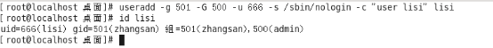

# **LAMP编程之Linux（3）**

- [**LAMP编程之Linux（3）**](#lamp编程之linux3)
- [**一、用户与用户组（重点）**](#一用户与用户组重点)
  - [**1、用户管理**](#1用户管理)
  - [**2、用户组管理**](#2用户组管理)
- [**二、权限管理**](#二权限管理)
  - [**1、权限介绍（重点）**](#1权限介绍重点)
  - [**2、身份介绍（重点）**](#2身份介绍重点)
    - [**Owner身份（文档所有者，默认为文档的创建者）**](#owner身份文档所有者默认为文档的创建者)
    - [**Group身份（与文档所有者同组的用户）**](#group身份与文档所有者同组的用户)
    - [**Others身份（其他人，相对于所有者与同组用户）**](#others身份其他人相对于所有者与同组用户)
    - [**Root用户（超级用户）**](#root用户超级用户)
  - [**3、Linux的权限查看**](#3linux的权限查看)
  - [**4、权限设置（重点）**](#4权限设置重点)
    - [**4.1、字母形式**](#41字母形式)
    - [**4.2、数字形式**](#42数字形式)
    - [**4.3、注意事项**](#43注意事项)
  - [**5、属主与属组**](#5属主与属组)
    - [**5.1、chown（重点）**](#51chown重点)
    - [**5.2、chgrp（了解，凑数）**](#52chgrp了解凑数)
  - [**6、sudo（重点）**](#6sudo重点)
- [**三、运行级别**](#三运行级别)
- [**四、网络设置**](#四网络设置)
  - [**1、ip地址查看**](#1ip地址查看)
  - [**2、网卡配置文件**](#2网卡配置文件)
  - [**3、网络服务操作（了解）**](#3网络服务操作了解)
- [**五、ssh**](#五ssh)
  - [**1、简介**](#1简介)
  - [**2、ssh的应用**](#2ssh的应用)
    - [**2.1、远程登录（重点）**](#21远程登录重点)
    - [**2.2、sftp文件传输**](#22sftp文件传输)
- [**六、软件的安装方式**](#六软件的安装方式)
  - [**1、rpm**](#1rpm)
    - [rpm示例](#rpm示例)
  - [**2、yum安装（推荐）**](#2yum安装推荐)
  - [**3、编译安装（难点）**](#3编译安装难点)
  - [小结](#小结)

# **一、用户与用户组（重点）**
Linux系统是一个**多用户、多任务**的操作系统，任何一个要使用系统资源的用户，都必须首先向系统管理员（root）申请一个账号，然后以这个账号的身份进入系统。

用户的账号一方面可以帮助系统管理员对使用系统的用户进行跟踪，并控制他们对系统资源的访问（权限）；另一方面也可以帮助用户组织文件（家目录），并为用户提供安全性保护（权限）。

每个用户账号都拥有一个唯一的用户名和各自的密码。

用户在登录时键入正确的用户名和密码后，就能够进入系统和自己的主目录。

要想实现用户账号的管理，要完成的工作主要有如下几个方面：

用户账号的添加、删除、修改以及用户密码的管理。

用户组的管理。

**注意三个文件：**

/etc/passwd				存储用户的关键信息

/etc/group				存储用户组的关键信息

/etc/shadow				存储用户的密码信息
## **1、用户管理**
①添加用户

**语法：#useradd 选项 选项的值 …. 用户名**

常用选项：

`	`**-g：表示指定用户的用户主（主要）组，选项的值可以是用户组的id，也可以是组名**

`	`**-G：表示指定用户的用户附加（额外）组，选项的值可以是用户组的id，也可以是组名**

`	`-u：uid，用户的id（用户的标识符），**系统默认会从500之后按顺序分配uid**，如果不想使用系统分配的，可以通过该选项自定义【类似于腾讯QQ的自选靓号情况】

`	`-c：comment，添加注释（选择是否添加）

`	`-s：指定用户登入后所使用的**shell 解释器** 【专门的接待员】

`	`-d：指定用户登入时的启始目录（家目录位置）

`	`-n：取消建立以用户名称为名的群组（了解）

案例：创建用户zhangsan，不带任何选项

#useradd zhangsan

验证是否成功：

`	`a. 验证/etc/passwd的最后一行，查看是否有zhangsan的信息；

`	`#tail -1 /etc/passwd

`	`b. 验证是否存在家目录（在Centos下创建好用户之后随之产生一个同名家目录）；

`	`c. id zhangsan 指令来进行验证

**扩展：认识passwd文件**

**用户名:密码:用户ID:用户组ID:注释:家目录:解释器shell**

**用户名：创建新用户名称，后期登录的时候需要输入；**

**密码：此密码位置一般情况都是“x”，表示密码的占位；**

**用户ID：用户的识别符；【-u】**

**用户组ID：该用户所属的主组ID；【-g】**

**注释：解释该用户是做什么用的；【-c】**

**家目录：用户登录进入系统之后默认的位置；【-d】**

**解释器shell：等待用户进入系统之后，用户输入指令之后，该解释器会收集用户输入的指令，传递给内核处理；【如果解释器是/bin/bash表示用户可以登录到系统，/sbin/nologin表示该用户不能登录到系统】【-s】**

**注意：在不添加选项的时候，执行useradd之后会执行一系列的操作**

`	`**a. 创建同名的家目录；**

`	`**b. 创建同名的用户组；**

案例：添加选项，创建用户lisi，让lisi属于501主组，**附加组500**，自选靓号666，并且要求不能登录到系统，可以写注释为“user lisi”。

\# useradd -g 501 -G 500 -u 666 -s /sbin/nologin -c “user lisi” lisi

验证是否创建成功：

**注意：查看用户的主组可以查看passwd文件，查看附加组可以查看group文件。**

**linux123行的含义：在linux123的组里（组id是500）有一个组内用户lisi（lisi的附加组就是500，附加组的名字是linux123）。**

**如果需要为一个用户指定多个附加组，只需要将多个附件组的id通过英文逗号“,”分割即可。**

**【主组只能有1个（类似于亲生父母只有一对），附加组可以多个，也可以没有附加组（类似于认干爹干妈，可以有也可以没有，也可以有多个）】**

**【主组必须有】**

**【文档的属组指的是主组】**

②修改用户

**语法：#usermod 选项 选项的值 …. 用户名**

Usermod：user modify，用户修改

常用选项：

`	`-g：表示指定用户的用户主组，选项的值可以是用户组的id，也可以是组名

`	`-G：表示指定用户的用户附加组，选项的值可以是用户组的id，也可以是组名

`	`-u：uid，用户的id（用户的标识符），**系统默认会从500之后按顺序分配uid**，如果不想使用系统分配的，可以通过该选项自定义【类似于腾讯QQ的自选靓号情况】

`	`**-l：修改用户名**

`	`-c<备注>：修改用户帐号的备注文字

-d<登入目录>：修改用户登入时的目录

-s<shell>：修改用户登入后所使用的shell

案例：修改zhangsan用户主组为500，附加组改为501

#usermod -g 500 -G 501 zhangsan

案例：修改zhangsan用户用户名，改为wangerma

\# usermod -l **wangerma zhangsan**

③设置密码（特殊）

**特殊点1：该指令普通用户也可以执行**

**特殊点2：只有root用户才可以指定用户名**

Linux不允许没有密码的用户登录到系统，因此前面创建的用户目前都处于锁定状态，需要设置密码之后才能登录计算机。

**语法：#passwd [用户名]		【如果不指定用户名则修改自己的密码，只有root可以指定用户名】**

案例：设置wangerma用户的密码

#passwd wangerma

在设置密码的时候也是没有任何输入提示的，放心输入，确保两次输入的密码一致，按下回车即可。

也可以使用弱密码，但是不建议，否则会看到以下的提示：

设置密码之后shadow文件中的体现：能够看出lisi用户没有密码的。

在设置用户密码之后可以登录帐号，例如此处需要登录wangerma

**切换用户命令：#su [用户名]	（switch user）**

**如果用户名不指定则表示切换到root用户。**

**切换用户需要注意的事项：**

`	`**a. 从root往普通用户切换不需要密码，但是反之则需要root密码；**

`	`**b. 切换用户之后前后的工作路径是不变的；**

`	`**c. 普通用户没有办法访问root用户家目录，但是反之则可以；**

④删除用户

语法：#userdel 选项 用户名

Userdel：user delete（用户删除）

常用选项：

`	`-r：表示删除用户的同时，删除其家目录；

案例：删除wangerma用户

#userdel -r wangerma

**注意：已经登录的wangerma用户删除的时候提示删除失败，但是没有登录的lisi用户可以正常删除**。

解决办法：简单粗暴，kill对应用户的全部进程

**提示：所有跟用户操作的命令（除passwd外，只能修改自己的密码，即不指定用户名）只有root超级管理员有权限执行。**

**备注：也可以在登录需要删除的用户之后，按下快捷键“ctrl+d”进行对当前用户的注销，随后退回到上一个用户（root）此时就可以对需要删除的用户进行删除操作。**

## **2、用户组管理**	
每个用户都有一个用户组，系统可以对一个用户组中的所有用户进行集中管理。不同Linux 系统对用户组的规定有所不同，如Linux下的用户属于与它同名的用户组，**这个用户组在创建用户时同时创建（创建用户时不指定用户组的时候情形）**。

用户组的管理涉及用户组的**添加、删除和修改**。组的增加、删除和修改实际上就是对/etc/group文件的更新。

文件结构：

**用户组名:密码:用户组ID:组内用户名[看附加组的]**

密码：X表示占位符，虽然用户组可以设置密码，但是绝大部分的情况下不设置密码；

组内用户名：表示附加组是该组的用户名称；

①用户组添加

**语法：#groupadd 选项 选项的值 …. 用户组名**

常用选项：

`	`-g：类似用户添加里的“-u”，-g表示选择自己设置一个自定义的用户组ID数字，如果自己不指定，则默认从500之后递增；

案例：使用groupadd指令创建一个新的用户组，命名为admins

#groupadd admins

②用户组编辑

**语法：#groupmod 选项 选项的值 … 用户组名**

常用选项：

`	`-g：类似用户修改里的“-u”，-g表示选择自己设置一个自定义的用户组ID数字

`	`-n：类似于用户修改“-l”，表示设置新的用户组的名称

案例：修改admins用户组，将组ID改成520，将名称改为admin123

③用户组删除

**语法：#groupdel 用户组名**

案例：删除admin123组

#groupdel admin123

再次尝试删除一个用户组，删除linux123

**注意：当如果需要删除一个组，但是这个组是某个用户的主组时，则不允许删除（附加组是可以的）；如果确实需要删除，则先从组内移出所有用户。**

**提示**

**针对用户和用户组的管理指令，除了passwd指令之外，其他指令一般情况下只有root用户可以执行。**

# **二、权限管理**
## **1、权限介绍（重点）**
在Linux中分别有**读、写、执行**权限：

**读权限：**

`	`**对于文件夹来说，读权限影响用户是否能够列出目录结构**

`	`**对于文件来说，读权限影响用户是否可以查看文件内容**

**写权限：**

`	`**对文件夹来说，写权限影响用户是否可以在文件夹下“创建/删除/复制到/移动到”文档**

`	`**对于文件来说，写权限影响用户是否可以编辑文件内容，**

**执行权限：**

`	`**一般都是对于文件来说，特别脚本文件。**

`	`**对于文件来说，执行权限影响文件是否可以运行。**

`	`**对于文件夹来说，执行权限影响对应的用户是否可以在文件夹内执行指令。**

## **2、身份介绍（重点）**
### **Owner身份（文档所有者，默认为文档的创建者）**
由于Linux是多用户、多任务的操作系统，因此可能常常有多人同时在某台主机上工作，但每个人均可在主机上设置文件的权限，让其成为个人的“私密文件”，即个人所有者。因为设置了适当的文件权限，。【**所有者可以更改文档的权限**】

例如某个MM给你发了一封Email情书，你将情书转为文件之后存档在自己的主文件夹中。为了不让别人看到情书的内容，你就能利用所有者的身份去设置文件的适当权限，这样，即使你的情敌想偷看你的情书内容也是做不到的。
### **Group身份（与文档所有者同组的用户）**
与文件所有者同组最有用的功能就体现在**多个团队在同一台主机上开发资源的时候**。例如主机上有A、B两个团体（用户组），A中有a1,a2,a3三个成员，B中有b1,b2两个成员，这两个团体要共同完成一份报告F。由于设置了适当的权限，A、B团体中的成员都能互相修改对方的数据，但是团体C的成员则不能修改F的内容，甚至连查看的权限都没有。同时，团体的成员也能设置自己的私密文件，让团队的其它成员也读取不了文件数据。**在Linux中，每个账户支持多个用户组。如用户a1、b1即可属于A用户组，也能属于B用户组【主组和附加组】**。
### **Others身份（其他人，相对于所有者与同组用户）**
这个是个相对概念。打个比方，大明、二明、小明一家三兄弟住在一间房，房产证上的登记者是大明（owner所有者），那么，大明一家就是一个用户组，这个组有大明、二明、小明三个成员；另外有个人叫张三，和他们三没有关系，那么这个张三就是其他人（others）了。

同时，大明、二明、小明有各自的房间，三者虽然能自由进出各自的房间，但是小明不能让大明看到自己的情书、日记等，这就是文件所有者（用户）的意义。
### **Root用户（超级用户）**
在Linux中，还有一个神一样存在的用户，这就是root用户，因为在所有用户中它拥有最大的权限 ，所以管理着普通用户。**因此以后在设置文档的权限的时候不必考虑root用户**。

## **3、Linux的权限查看**
要设置权限，就需要知道文件的一些基本属性和权限的分配规则。在Linux中，ls命令常用来查看文档的属性，用于显示文件的文件名和相关属性。

**#ls -l 路径		【ls -l  等价于 ll】**

标红的部分就是Linux的文档权限属性信息。

**Linux中存在用户（owner）、用户组（group）和其他人（others）概念**，各自有不同的权限，对于一个文档来说，其权限具体分配如下：

**十位字符表示含义：**

**第1位：表示文档类型，取值常见的有“d表示文件夹”、“-表示文件”、“l表示软连接”、“s表示套接字”、“c表示字符设备”、“b表示块状设备”等等；**

**第2-4位：表示文档所有者的权限情况，第2位表示读权限的情况，取值有r、-；第3位表示写权限的情况，w表示可写，-表示不可写，第4位表示执行权限的情况，取值有x、-。**

**第5-7位：表示与所有者同在一个组的用户的权限情况，第5位表示读权限的情况，取值有r、-；第6位表示写权限的情况，w表示可写，-表示不可写，第7位表示执行权限的情况，取值有x、-。**

**第8-10位：表示除了上面的前2部分的用户之外的其他用户的权限情况，第8位表示读权限的情况，取值有r、-；第9位表示写权限的情况，w表示可写，-表示不可写，第10位表示执行权限的情况，取值有x、-。**

**注意：除了权限位上的rwx以及-之外，还有一些特殊的权限代码“s”、“t”，这些不在本次考虑范围内。（黏贴位，特殊权限位）**

权限分配中,均是rwx的三个参数组合，**且位置顺序不会变化**。没有对应权限就用 – 代替。

## **4、权限设置（重点）**
**语法：#chmod  [选项] 权限模式 文档路径**

注意事项：

`	`常用选项：

`			`-R：递归设置权限	（**当文档类型为文件夹的时候**）

`	`权限模式：就是该文档需要设置的权限信息

`	`文档：可以是文件，也可以是文件夹，可以是相对路径也可以是绝对路径。

**注意点：如果想要给文档设置权限，操作者要么是root用户，要么就是文档的所有者。**
### **4.1、字母形式**

给谁设置：

`	`u：表示所有者身份owner（user）

`	`g：表示给所有者同组用户设置（group）

`	`o：表示others，给其他用户设置权限

`	`a：表示all，给所有人（包含ugo部分）设置权限

`		`**如果在设置权限的时候不指定给谁设置，则默认给所有用户设置**

什么权限-权限字符：

`	`r：读

`	`w：写

`	`x：表示执行

`	`-：表示没有权限

如何设置-权限分配方式：

`	`+：表示给具体的用户追加权限（不会修改已有的其他权限）

`	`-：表示删除用户的权限（相对当前）

`	`=：表示将权限设置成具体的值（注重结果）【赋值】

**设置多个身份的权限时候，每个身份之间需要通过英文逗号分开。**

**例如：需要给/root/anaconda-ks.cfg文件（-rw-------.）设置权限，要求所有者拥有全部的权限，同组用户拥有读和写权限，其他用户只读权限。**

答案：

`	`#chmod u+x,g+rw,o+r /root/anaconda-ks.cfg

`	`或者：

`	`#chmod u=rwx,g=rw,o=r /root/anaconda-ks.cfg

**提示：当文档拥有执行权限（任意部分），则其颜色在终端中是绿色。**

**#chmod ug=rwx  形式，如果有两部分权限一样则可以合在一起写的**

**等价于：**

`	`**#chmod u=rwx,g=rwx**

**例如：如果anaconda-ks.cfg文件什么权限都没有，可以使用root用户设置所有的人都有执行权限，则可以写成**

**什么权限都没有应该是：----------**

**目标的效果：---x--x--x**

**#chmod a=x anaconda-ks.cfg**

**#chmod a+x anaconda-ks.cfg**

**#chmod u+x,g+x,o+x anaconda-ks.cfg**

**#chmod ugo=x anaconda-ks.cfg**

**#chmod ugo+x anaconda-ks.cfg**

**#chmod +x anaconda-ks.cfg			[当不指定给谁赋予权限的是默认为“a”]**

**案例：设置文件“~/php.txt”权限，要求所有者全部权限，同组用户拥有读权限、写权限，其他人拥有读权限**

**更改要求：所有者全部权限，同组用户拥有读权限、写权限，其他人拥有读权限、写权限**

**练习：**

`	`**①设置文件夹/tmp/php的权限（如果文件夹不存在，自行创建），要求权限为递归权限，并且所有者有全部权限，同组用户有读执行权限，其他用户只读权限；**

`	`**②设置文件/tmp/php/class.sh权限，文件如果不存在则自行创建，要求权限为所有者全部权限，同组用户读和执行权限，其他用户没有权限；**

`	`**③使用普通用户在/tmp/php目录下创建test目录，设置目录权限为所有者拥有全部权限，同组用户只读，其他用户只读；** 
**\

### **4.2、数字形式**
经常会在一些技术性的网页上看到类似于**#chmod  777  a.txt**  这样的一个权限，这种形式称之为数字形式权限（777）。

**读：r        4**

**写：w		 2**

**执行：x		 1**

没有任何权限（-）：0

**组合权限数字的时候遵循，最短路径要求，并且最多只能出现一次。**

例如：需要给anaconda-ks.cfg设置权限，权限要求所有者拥有全部权限，同组用户拥有读执行权限，其他用户只读。

**分析：**

`	`**所有者（第1位）：全部权限 = 4 + 2 + 1 = 7**

`	`**同组用户（第2位）：读执行 = 4 + 1 =5**

`	`**其他用户（第3位）：读 = 4**

**组合：754**

最终得出的结果是754

#chmod 754 anaconda-ks.cfg

**面试题：用超级管理员设置文档的权限命令是#chmod 731 aaa.php，请问这个命令有没有什么不合理的地方？**

所有者 = 7 = 4 + 2 + 1 = 读 + 写 + 执行

同组用户 = 3 = 2 + 1 = 写 + 执行

其他用户 = 1 = 执行

问题在权限731中3表示写+执行权限，但是写又不必须需要能打开之后才可以写，因此必须需要具备读权限，因此权限不合理。以后建议各位在设置权限的时候不要设置这种“奇葩权限”。单独出现2、3的权限数字一般都是有问题的权限

**注意：在写权限的时候千万不要设置类似于上面的这种“奇葩权限”。如果一个权限数字中但凡出现2与3的数字，则该权限有不合理的情况。**

练习：

`	`①使用root用户设置文件夹/root/20180811的权限为：所有者全部权限，同组用户拥有读和执行权限，其他用户没有权限，请使用数字权限的形式设置，写出指令；750

`	`②请使用root用户写出设置文件/root/20180811.txt文件的权限，权限要求为：所有者拥有全部权限，同组用户要求可以读写，其他用户只读，要求使用数字形式；764

`	`③张三疯（root）收到某个MM的情书，请使用数字形式设置张三疯的Email情书权限（文件为/root/email.doc），权限要求只有所有者可以读写，除此之外任何人没有权限；600
### **4.3、注意事项**
使用root用户创建一个文件夹（/oo），权限默认，权限如下：

需要在oo目录下创建文件（oo/qq.txt），需要给777权限：

**扩展：**

`	`**在Linux系统中，创建文档的权限有一个默认值，以当前的系统为例，其创建文件夹之后的默认权限是755，创建文件之后的权限是644。**

`	`**之所以会这样是受到了系统中umask（掩码）的值的影响，其是用于指定文档创建好之后的权限，umask默认为022。**

`	`**计算方式：**

`		`**对于文件：文件的权限 = 666 – umask掩码**

`		`**对于文件夹：文件夹的权限 = 777 - umask掩码**

切换到linux123用户（不是文档所有者，也不是同组用户，属于other部分）：

问题1：linux123用户是否可以打开oo/qq.txt文件？ 

问题2：linux123用户是否可以编辑oo/qq.txt文件？ 

问题3：linux123用户是否可以删除oo/qq.txt文件？ 

**在Linux中，如果要删除一个文件，不是看文件有没有对应的权限，而是看文件所在的目录是否有写权限、执行权限，如果有才可以删除**。
## **5、属主与属组**
属主：所属的用户（文件的主人），文档所有者

属组：所属的用户组（同组用户的组名称）  

**前面的那个root就是属主**

**后面的那个root就是属组**

这两项信息在文档创建的时候**会使用创建者**的信息（用户名、用户所属的主组名称）。

**之所以需要设置这个：如果有时候去删除某个用户，则该用户对应的文档的属主和属组信息就需要去修改（类似离职之前的工作交接）。**
### **5.1、chown（重点）**
**作用：更改文档的所属用户（change owner）**

**语法：#chown  [-R]  新的username 文档路径**

**注意：修改所有者的人必须是root或者所有者自己（也可能出现没有权限的情况），其他人无权修改所有者。**

案例：将先前设置的/oo目录的所有者设置成成linux123

#chown -R linux123 /oo

### **5.2、chgrp（了解，凑数）**
**作用：更改文档的所属用户组（change group）**

语法：#chgrp  [-R]  groupname  文档的路径

案例：将刚才oo目录的所有用户组名改为linux123

#chgrp -R linux123 /oo

**思考，如何通过一个命令实现既可以更改所属的用户，也可以修改所属的用户组呢？**

答：可以实现的，通过chown命令

`	`**语法：#chown  [-R]  username:groupname   文档路径**

案例：将刚才oo的文档的所属组所属用户修改为root

#chown -R root:root /oo

补充：chown也可以只修改用户组的所属情况

**问题：zhangsan用户使用自己的帐号创建文件index.html，并且当时默认的权限是644，后续管理员root将该文件的属主改成了lisi，属组改成lisi，则zhangsan对文件的操作权限有变化吗？如果有权限是多少？**

## **6、sudo（重点）**
问题：reboot、shutdown、init、halt，在普通用户身份上都是操作不了，但是有些特殊的情况下又需要有执行权限。又不可能让root用户把自己的密码告诉普通用户，这个问题该怎么解决？

**该问题是可以被解决的，可以使用sudo（switch user do）命令来进行权限设置。Sudo可以让管理员（root）事先定义某些特殊命令谁可以执行（事先放权规则）**。

默认sudo中是没有除root之外用户的规则，要想使用则先**配置**sudo。

**Sudo配置文件：/etc/sudoers**

该文件默认只读，不允许修改，因此不能直接修改。

a. 配置sudo文件请使用“#visudo”，打开之后其使用方法和vim一致

**b. 配置普通用户的权限**

Root表示用户名，如果是用户组，则可以写成“%组名”

ALL：表示允许登录的主机（地址白名单）

(ALL)：表示以谁的身份执行，ALL表示root身份

ALL：表示当前用户可以执行的命令，多个命令可以使用“,”分割

一般需要调整的就是用户/用户组名称与可以执行的指令名。

**案例：使用linux123这个用户，赋予其添加用户权限。**

**注意：在写sudo规则的时候不建议写直接形式的命令，而是写命令的完整路径。**

**路径可以使用which（whereis亦可）命令来查看** 

**语法：#which 指令名称**

**whereis会找出一些非可执行文件，建议使用which**

在添加好对应的规则之后就可以切换用户，切换到普通用户linux123，再去执行：

此时要想使用刚才的规则，则以以下命令进行：

**#sudo 需要执行的指令（就是放权的指令名称）**

此时输入的密码是当前执行sudo指令的用户的密码，而非root密码。

**在输入sudo指令之后需要输入当前的用户密码进行确认的操作（不是root用户密码），输入之后在接下来5分钟内再次执行sudo指令不需要密码**。

补充：在普通用户下怎么查看自己具有哪些特殊权限呢？

**#sudo  -l			表示list**

最后：sudo不是任何Linux分支都有的命令，常见centos与ubuntu都存在sudo命令。

作业：使用sudo实现让普通用户具备添加、删除用户的权限。
# **三、运行级别**
运行模式也可以称之为**运行级别（Running Level）**。

在linux中存在一个进程：init （initialize，初始化），进程id是1。

查看进程：#ps -ef|grep init

该进程存在一个对应的配置文件：inittab（**系统运行级别配置文件**，位置/etc/inittab）

文件的主要内容：

根据上述的描述，可以得知，Centos6.5中存在7种运行级别/模式。

**0 — 表示关机级别（不要将默认的运行级别设置成这个值）**

**1 — 单用户模式（找回root密码的）**

**2 — 多用户模式，不带NFS（Network File Syetem）**

**3 — 多用户模式，完全的多用户模式（不带桌面的，纯命令行模式）**

**4 — 没有被使用的模式（被保留模式）**

**5 — X11，完整的图形化界面模式**

**6 — 表示重启级别（不要将默认的运行级别设置成这个值）**

与该级别相关的几个命令（**临时切换，立即生效**）：

#init 0		表示关机

#init 3		表示切换到不带桌面的模式（CLI 命令行模式）

#init 5		切换到图形界面（前提必须先确保已经安装了图形化界面）

#init 6 		重启电脑

注意：init指令需要超级管理员的权限，普通用户无法执行。

**这些命令其实都是调用的init进程，将数字（运行级别）传递给进程，进程去读配置文件执行对应的操作。**

①切换到纯命令行模式下（**临时切换，重启之后又恢复**）

#init 3

切换之后需要输入用户名和密码，在**输入密码的时候没有“\*”提示输入，只要自己确认输入的密码没有错误，按下回车即可**。

②回到桌面模式

#init 5

**③设置模式永久为命令行模式**

将/etc/inittab文件中的initdefault值设置成3，然后重启操作系统。

**切换重启之后**默认即命令行模式：

# **四、网络设置**
## **1、ip地址查看**
需要的场景：远程连接、配置相关软件时（vpn）

指令：#ifconfig

得知的信息有：

`	`①有2块网卡，一个叫eth0，另一个lo（本地回环网卡，本机ip）

`	`②ip地址是 inet addr那一项
## **2、网卡配置文件**
位置：/etc/sysconfig/network-scripts/ifcfg-\*文件

ONBOOT：表示是否自动连接

BOOTPROTO（COL）：网卡启动之后使用的协议，一般情况下是DHCP

HWADDR：硬件地址（mac地址，物理地址），计算机之间的通信都是依赖于mac地址

**扩展：针对像网卡配置目录层次比较深的文件，如果需要频繁更改，可以将需要的文件设置一个快捷方式，将其放在经常操作的目录，以简化后续的打开文件操作。**

**语法：#ln -s 原始路径 快捷方式路径**

案例：将ifcfg-eth0文件在root家目录下创建快捷方式。

#ln -s /etc/sysconfig/network-scripts/ifcfg-eth0 /root/wangka.conf

## **3、网络服务操作（了解）**
可以通过service指令来对网络的服务进行重启/停止/启动等操作。

语法：#service network start/stop/restart			(**操作所有的网卡设备**)

上述的指令还等价于：#/etc/init.d/network start/stop/restart

补充对于单个网卡的操作：

#ifdown 网卡名				停止某个网卡

#ifup 网卡名					启动某个网卡

**注意：上述这些操作不要随意在服务器上运行。**
# **五、ssh**
## **1、简介**
ssh（secure shell，安全外壳协议），该协议有2个常用的作用：**远程连接**、远程文件传输。

协议使用**端口**号：**默认是22。**

可以是被修改的，如果需要修改，则需要修改ssh服务的配置文件：

**#/etc/ssh/ssh\_config**

端口号可以修改，但是得注意2个事项：

`	`a. 注意范围，端口范围是从0-65535；

`	`b. 不能使用别的服务已经占用的端口（常见的不能使用：20，21，23，25，80，443，3389，3306，11211等等）；

**服务启动/停止/重启		｛服务名中的d全称daemon，守护进程｝**

#service sshd start/stop/restart

#/etc/init.d/sshd start/stop/restart

Sshd服务一般默认就已经启动，不需要再去启动，可以在**修改完其配置的情况下重启**。

## **2、ssh的应用**
### **2.1、远程登录（重点）**
**终端工具**主要帮助运维人员连接远程的服务器，常见终端工具有：Xshell、secureCRT、Putty等。以putty为例：

①获取服务器ip地址，可以通过ifconfig命令进行查看，然后顺手测试ip的连接相通性

#ifconfig

此处获取的ip地址地址还是192.168.254.130

测试连通性：ping 192.168.254.130

②打开putty，输入相关的信息

③在弹出key确认的时候点击“是”，以后不会再提示

④输入登录信息

之前在虚拟机的centos中全部的指令在远程终端中都是可以得到执行的。

**扩展：不借助第三方工具实现远程连接。**

`	`①打开Windows的cmd黑窗口（前提是Windows必须安装ssh服务，如果没有而需要这个功能，则自行安装openSSH）

`	`②输入“**ssh 需要登录的用户名@远程服务器的连接地址**”回车

`	`③输入密码

例如：

### **2.2、sftp文件传输**
可视化的界面传输工具：Filezilla

安装好之后可以查看到桌面图标：

①选择“文件”- “站点管理器（Ctrl + S）”

②点击“文件”菜单下方的“▽”选择需要连接的服务器，连接好之后的效果

③从本地windows上传文件到linux中方式

支持直接拖拽文件，也可以右键本地需要上传的文件，然后点选“上传”即可

④下载linux文件到本地

支持服务器文件直接拖拽到本地，也可以在右侧窗口选择需要下载的文件，右键，点选“下载”。

# **六、软件的安装方式**
在Linux CentOS系统中，软件的管理方式有三种：rpm、yum、编译方式。
## **1、rpm**
优点：对于软件包的操作比较简单，通过简单指令即可操作

缺点：

`	`①安装时需要**自行**下载软件包

`	`②安装、卸载软件时需要考虑到**依赖关系**

`	`③软件的自定义性比较差，不适合有特殊需求的场景

**语法：**

**①查询**

`	`**#rpm -qa 关键词					（查询机器上是否有安装指定的软件包）**

`	`**选项说明：**

`		`**-q：query，查询**

`		`**-a：all，所有**

**②卸载**

`	`**#rpm -e 软件包全称 [--nodeps]	（卸载软件，包的全称需要通过①去查询）**

`	`**选项说明：**

`		`**-e：卸载**

`		`**--nodeps：忽略依赖关系**

**③安装**

`	`**#rpm -ivh 软件包路径			（路径可以是https网络路径）**

`	`**选项说明：**

`		`**-i：install，安装**

`		`**-v：显示安装过程**

`		`**-h：以“#”形式显示安装过程**

**④更新（了解）**

`	`**#rpm -Uvh 软件包路径			（软件包的下载、依赖关系需要自行解决，路径可以是https网络路径）**

`	`**选项说明：**

`		`**-U：upgrade，升级或安装软件包**

`		`**-v：显示安装过程**

`		`**-h：以“#”形式显示安装过程**	

**⑤查看某个文档是由哪个软件包创建的**

`	`**#rpm -qf 需要查询的文件路径**

`	`**选项说明：**

`		`**-q：query，查询**

`		`**-f：file，指定文件**		

案例：查询、卸载、安装firefox浏览器。

查询：

卸载：

安装：

①查找FF31.1.0软件包

/media/CentOS\_6.6\_Final/Packages

②开始安装

查询文件所属的软件包：

查询/etc/passwd文件是谁创建的

#rpm -qf /etc/passwd

### rpm示例

1. 安装EPEL软件包：`rpm -Uvh https://dl.fedoraproject.org/pub/epel/epel-release-latest-7.noarch.rpm`
2. 添加 Webtatic EL yum 仓库：`rpm -Uvh https://mirror.webtatic.com/yum/el7/webtatic-release.rpm`
   1. 该仓库提供了php最新版本的支持，然后就可以用yum安装最新的php版本了

## **2、yum安装（推荐）**
优点：

①快速、傻瓜式的软件管理方式

②在联网情况下，自动从服务器上下载软件包（内、外网服务器均可）

③自动解决软件依赖关系

缺点：

`	`因其底层实为rpm操作，所以也丧失了对软件的自定义功能

**Yum常用语法：**

**①搜索/查询相关**

`	`**#yum search [all] 关键词			（根据关键词搜索服务器上的包资源）**

`	`**#yum list [关键词]				（列出所有的包，包含已经安装的和可供安装的）**

`	`**#yum list installed [关键词]		（列出当前已经安装的包）**

**②安装**

`	`**注意：操作指令（install）与-y选项可以颠倒，下同，-y类似于rm指令的-f选项。**

`	`**#yum [-y] install 关键词			（安装指定的软件）**

**③卸载**

`	`**#yum [-y] remove 关键词			（卸载指定的软件）**

**④更新**

`	`**#yum [-y] update 				（更新整个系统，包含内核）**

`	`**#yum [-y] update 关键词**

案例：使用yum方式快速安装L**AMP**环境。

建议采用PAM的安装顺序，原因是在安装php的时候，yum会顺带安装apache。

#yum install php

#yum install mysql-server

MySQL的初始化（设置root密码的）：

#service mysqld start

#mysql\_secure\_installation

启动apache

#service httpd start

安装好的apache默认站点在：/var/www/html/位置

Apache配置文件位于：/etc/httpd/conf/httpd.conf
## **3、编译安装（难点）**
优点：

`	`①用户可选择需要的软件功能

`	`②源码方式，有开发能力的用户，可对源码进行自定义

缺点：

`	`①需要自行解决依赖关系

`	`②编译时间较长

`	`③容易出错，一旦出错，需要重新编译安装

**编译安装步骤：**

**①下载源码包**

**②解压源码包**

**③进入解压目录**

**④配置安装**

**⑤编译**

**⑥安装**

案例：编译安装Nginx。

类似于apache，是一款开源的web服务器软件，其默认用的端口号也是80。

①下载nginx包

下载地址：<https://nginx.org/en/download.html>

复制下载地址。

需要将下载地址在终端中输入，进行下载：

#cd /usr/local/src

#wget <https://nginx.org/download/nginx-1.15.5.tar.gz>

②解压压缩包

#tar -jxvf 路径(针对.tar.bz2格式)

#tar -zxvf 路径(针对.tar.gz格式)			【当前选这个】

#tar -zxvf nginx-1.15.5.tar.gz

③进入解压后的目录

#cd nginx-1.15.5

④配置安装

配置包含：指定安装的位置、需要的模块功能

**指定位置使用：--prefix选项**

`	`例如：--prefix=/usr/local/nginx

\# ./configure --prefix=/usr/local/nginx

需要安装2个依赖：

#yum install pcre-devel

#yum install zlib-devel

然后继续重新配置，确认没有问题会看到如下效果：

⑤编译&&完成安装

#make && make install

测试NGINX的使用：

#service httpd stop

注意：nginx编译安装之后不支持service指令进行操作，需要找到nginx的执行文件才能启动。

启动：/usr/local/nginx/sbin/nginx

重启：/usr/local/nginx/sbin/nginx -s reload

## 小结

1. 用yum/rpm安装的软件，存放到什么地方，不是都放到1个目录里去，配置相关的放到etc目录下，扩展和安装的软件放到usr下，var下放日志类的文件。。。如php的配置文件会放到etc去，php的执行文件放到usr下，日志放到var下