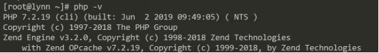

# **Linux扩展**

- [**Linux扩展**](#linux扩展)
- [**一、项目上线部署**](#一项目上线部署)
  - [**1、前言**](#1前言)
  - [**2-0、项目代码打包传输**](#2-0项目代码打包传输)
  - [**2、安装PHP7**](#2安装php7)
  - [**3、安装Apache2**](#3安装apache2)
  - [**4、安装Mariadb数据库**](#4安装mariadb数据库)
  - [**5、域名解析**](#5域名解析)
    - [常见的解析记录类型](#常见的解析记录类型)
    - [使用ping测试：域名解析是否生效](#使用ping测试域名解析是否生效)
  - [**6、解压代码导入数据库**](#6解压代码导入数据库)
  - [**7、创建虚拟主机**](#7创建虚拟主机)


# **一、项目上线部署**
## **1、前言**
**要想部署环境上线项目，先具备以下条件：服务器（ip、帐号密码、终端）、相应的软件、域名（备案、解析）、代码等。**

服务器、域名购买，以阿里云为例：<http://www.aliyun.com>

首先登录控制台，获取需要连接的主机ip地址：


获取到用于连接的公网IP后，即可使用远程终端工具连接上待操作上线的服务器。

远程工具可以使用Putty、CMD等，无限制要求。


以CentOS7.6为例，在购买好服务器并产生实例后，首次登录进系统请先执行“yum -y update”来更新整个系统，防止系统存在漏洞：


## **2-0、项目代码打包传输**

1. 项目上线具备的东西，数据库得有，项目代码得有，这两样先传到线上去
   1. 数据库就是那个导出的完整备份文件---> pyg.sql
   2. 代码先打包为zip格式(linux对zip格式友好)传到线上再解压---> pyg.zip
2. 然后打开filezillar(sftp可视化工具)连上你的阿里云买的远程服务器
3. 将数据库文件和压缩包上传到/usr/local/src目录中去  
4. 在服务器安装unzip解压软件`yum -y install unzip`(因为默认的tar命令不支持zip格式)

## **2、安装PHP7**

> yum默认下载源软件版本都比较滞后

在当前系统默认的yum下载源中，（yum安装的php版本为5.4.16，yum源软件版本都比较滞后）PHP最新的版本为5.4.16，而需要上线的项目要求最低版本为PHP7.0，此时，EPEL恰恰可以解决这的问题。

    1. EPEL：旨在为 Red Hat Enterprise Linux (RHEL) 及其衍生发行版（如 CentOS 和 AlmaLinux）提供高质量的额外软件包。这些软件包不在官方标准仓库中提供，但通过 EPEL 仓库，用户可以轻松安装和更新它们--------当你需要安装某些不在默认仓库中的应用程序时，EPEL 是一个很好的资源。例如，htop, nginx, phpMyAdmin 等等

a. 安装CentOS7适用的epel

**rpm -Uvh https://mirror.webtatic.com/yum/el7/epel-release.rpm**

    --- 测试发现资源链接已失效，参考https://www.inkiwike.com/archives/296  已进行替换为epel对应新链接

b. 获取PHP7的yum源

**rpm -Uvh https://mirror.webtatic.com/yum/el7/webtatic-release.rpm**

```js
1. 安装EPEL软件包：`rpm -Uvh https://dl.fedoraproject.org/pub/epel/epel-release-latest-7.noarch.rpm`
2. 添加 Webtatic EL yum 仓库：`rpm -Uvh https://mirror.webtatic.com/yum/el7/webtatic-release.rpm`
   1. 该仓库提供了php最新版本的支持，然后就可以用yum安装最新的php版本了
```
c. 安装PHP7.2及其常用扩展

**yum install php72w php72w-cli php72w-common php72w-devel php72w-embedded php72w-fpm php72w-gd php72w-mbstring php72w-mysqlnd php72w-opcache php72w-pdo php72w-xml**


1. 前面3个是必装的。后面是常用的php扩展
   1. php72w并非独立的php程序，而是针对Apache的模块式php即mod_php,这个包会编译出一个Apache可加php载的模块扩展文件如libphp7.so,用于让Apache直接处理php代码---- linuz中php扩展文件格式为.so
   2. 当你执行 yum install httpd 安装 Apache 后：yum 会检测到系统中已安装 php72w 包，自动触发 PHP 包中与 Apache 集成的配置脚本，将 php.conf 等配置文件释放到 Apache 的配置目录（如 /etc/httpd/conf.d/）
      1. **由于apache中php是作为apahe的模块，所以可以这样处理，nginx中php是作为独立软件，就不能这样安装了，可参考nginx-02章节课件**
2. 用yum/rpm安装的软件，存放到什么地方，不是都放到1个目录里去，配置相关的放到etc目录下，扩展和安装的软件放到usr下，var下放日志类的文件。。。如php的配置文件会放到etc去，php的执行文件放到usr下，日志放到var下

d. 测试PHP安装情况

**php -v**


## **3、安装Apache2**
a. 执行安装的yum指令：

**yum -y install httpd**


b. 设置Apache开机启动并且启动Apache：

**systemctl enable httpd && systemctl start httpd**

第一个命令：设置 httpd 服务为开机自启，它会创建必要的符号链接，使得 httpd 服务能够在系统启动时自动启动

第二个命令：启动服务ps

    --- 执行完后，  `ps -ef | grep httpd` ls查看是否启动成功 

c. 编写一个静态文件和一个php脚本测试Apache对于动、静态文件是否解析正常（测试下apache能不能正常解析php文件）

**注意：Apache的默认站点位于“/var /www/html”**

创建index.html、index.php文件，内容随意：


使用浏览器进行测试访问：


## **4、安装Mariadb数据库**
此处安装的Mariadb为MySQL的一大分支，在使用上与MySQL没有太大的差别。

centos7中下载源中没有mysql，而是只有Mariadb数据库，所以需要安装Mariadb数据库。我们要装的是Mariadb数据库服务器软件Mariadb-server，会自带安装客户端软件:Mariadb。

a. 执行安装指令

**yum -y install mariadb-server**


b. 启动Mariadb服务并且设置开机启动项

**systemctl enable mariadb && systemctl start mariadb**

用ps查看是否启动成功：

**ps -ef | grep mariadb**

c. 执行初始化Mariadb数据库指令（设置初始密码等操作）

**mysql_secure_installation**


d. 尝试使用命令行登录到Mariadb

**mysql -u root -p**


## **5、域名解析**
之前做修改hosts文件，其实就是域名解析的一种，当时只是局限于本地，现在要考虑是线上。

要做解析得登录到域名控制面板中去，解析域名之前最好先确保域名已经备案，如果没有备案的域名，则虽然解析会成功，但是会影响使用，在使用的时候会被服务商拦截。


点击添加解析记录按钮：


在弹出的弹窗界面中填写对应的记录信息：


### 常见的解析记录类型

主机记录：可以任意添加子域名，免费的。

记录类型：
- A记录：将域名指向一个IP地址
- CNAME记录：将域名指向另一个域名
- MX记录：指定域名的邮件服务器
- TXT记录：用于域名的验证和其他的文本信息
- NS记录：指定域名的权威DNS服务器
- AAAA记录：将域名指向一个IPv6地址
- SRV记录：指定域名的服务记录
- CAA记录：指定域名的证书授权机构
- 显性URL转发：将域名指向一个具体的URL
- 隐性URL转发：将域名指向一个具体的URL，但是访问时不显示URL


### 使用ping测试：域名解析是否生效


## **6、解压代码导入数据库**

**步骤1：导入sql文件到数据库中去**

进入数据库的命令行管理界面，创建出需要的数据库edu16，使用source指令导入sql文件：


**步骤2：创建站点的运行目录，将上传好的代码zip压缩包进行解压，然后将代码复制到站点运行目录中去**

a. 约定站点目录为“/var/www/html”。

**创建站点目录：**

**目录已经存在，不需要创建**

b. 复制先前上传的代码压缩包到当前站点目录下，解压压缩包，解压完毕之后可以删除

**解压语法：unzip 压缩包路径**


此时由于站点入口文件在public目录下，而当前项目的站点在/var/www/html中，缺少个public，所以此时需要修改apache的配置文件中的DocumentRoot一项。

\# vim /etc/httpd/conf/httpd.conf


同时赋予临时目录写权限：


解决伪静态的问题（不解决只能访问首页，其他页面都404）：


思路：开启当前站点根目录下的AllowOverride配置项，设置为All即可，然后重启apache。


## **7、创建虚拟主机**
目标：要求上线能够使用https协议进行访问。【提高安全性，增强用户对网站的信心】

a. 申请SSL证书

要想站点支持https协议，先得先去向CA申请服务器证书。目前有很多免费的证书可供申请，例如与阿里云合作的Sysmantec一年免费证书，一般免费的证书只能绑定一个域名。除了1年免费的，还有三个月免费的，但是不限次数，不限域名个数，甚至还支持通配符。

以阿里云为例：

<https://common-buy.aliyun.com/?spm=5176.2020520163.cas.3.267d56a7EBRcYw&commodityCode=cas#/buy>


付款完毕之后点击“待申请证书”：


等待证书签发完成，随后下载证书：


解压压缩包之后得到的证书公私玥文件：


将三个文件上传到服务器上去，并且固定保存路径，尽量不要变化。

约定，将证书公私玥文件存储在“/ssl/”


b. 安装Apache的mod\_ssl模块

**yum -y install mod\_ssl**


c. 虚拟主机的配置参考（80+443）：

**注意：yum方式安装的apache的默认主配置文件位于/etc/httpd/conf/httpd.conf**


**根据主配置文件中的配置可以看出，其引入了conf.d目录下的全部conf文件，那么可以在该目录中创建一个vhosts.conf文件，作为虚拟主机的配置文件：**

**80端口主机：**

**<VirtualHost \*:80>**

`    `**ServerAdmin cherish@cherish.pw**

`    `**DocumentRoot "PATH"**

`    `**ServerName "yourdomain.com"**

`    `**<Directory "PATH">**

`        `**Allow from all**

`        `**AllowOverride all**

`        `**Options -indexes**

`        `**Require all granted**

`    `**</Directory>**

**</VirtualHost>**

**443端口主机：**

**<VirtualHost \*:443>**

`    `**SSLEngine on**

`    `**SSLCertificateFile "公钥文件路径"**

`    `**SSLCertificateKeyFile "私钥文件路径"**

`    `**SSLCertificateChainFile "证书链文件路径"**

`    `**SSLCipherSuite "ECDHE-RSA-AES128-GCM-SHA256:ECDHE:ECDH:AES:HIGH:!NULL:!aNULL:!MD5:!ADH:!RC4:!DH:!DHE"**

`    `**SSLProtocol TLSv1.1 TLSv1.2**

`    `**Header always set Strict-Transport-Security "max-age=63072000; includeSubdomains; preload"**

`    `**DocumentRoot "PATH"**

`    `**ServerName "yourdomain.com"**

`    `**<Directory "PATH">**

`        `**Allow from all**

`        `**AllowOverride all**

`        `**Options -indexes**

`        `**Require all granted**

`    `**</Directory>**

**</VirtualHost>**


创建好之后，参考上述的框框中配置代码，进行修改，其中443端口的虚拟主机配置含义如下：


修改完毕之后保存退出，然后重启apache

**systemctl restart httpd**

d. 打开浏览器访问项目，检查https协议是否生效


**问题，生效虽然生效了，但是https协议需要用户手动去补充，在地址栏中直接输入域名访问的时候默认还是80的http协议，如何解决？**

答：使用重写的方法，强制用户在访问http的时候跳转到https。操作步骤如下，在站点根目录下的“.htaccess”文件中添加如下代码，保存退出即可：


**RewriteCond %{HTTPS} !=on**

**RewriteRule ^(.\*) https://%{SERVER\_NAME}/$1 [R,L]**

举手之劳：框架运行的时候报错了，请解决。

**错误1：权限不足**


解决办法：


**错误2：数据库连接失败**


解决办法：修改项目目录下的.env文件


处理完毕之后项目即可访问：


