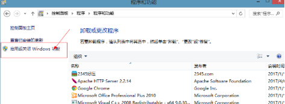
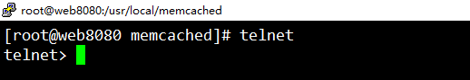
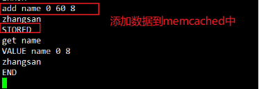
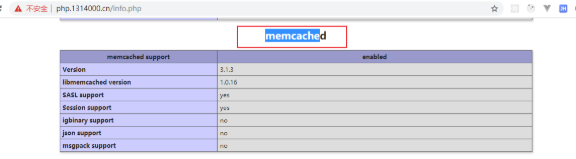
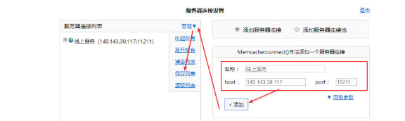

# **Memcached**

- [**Memcached**](#memcached)
- [**今日目标4**](#今日目标4)
- [**一、什么是memcached**](#一什么是memcached)
  - [**1.1、概述**](#11概述)
  - [**1.2、应用图解**](#12应用图解)
  - [**1.3、与mysql 进行比较**](#13与mysql-进行比较)
  - [**1.4、memcached中的一些参数限制**](#14memcached中的一些参数限制)
- [**二、服务安装与启动**](#二服务安装与启动)
  - [**2.1、Linux安装与启动**](#21linux安装与启动)
    - [2.1.1、安装](#211安装)
    - [2.1.2、启动](#212启动)
  - [**2.2、windows下安装与启动**](#22windows下安装与启动)
- [**三、常用命令**](#三常用命令)
  - [**3.1、连接服务**](#31连接服务)
    - [3.1.1、telnet](#311telnet)
    - [3.1.2、使用telnet连接memcached](#312使用telnet连接memcached)
  - [**3.2、获取数据**](#32获取数据)
  - [**3.3、添加设置数据**](#33添加设置数据)
  - [**3.4、自增和自减**](#34自增和自减)
  - [**3.5、删除数据**](#35删除数据)
    - [缓存穿透](#缓存穿透)
  - [**3.6、查看状态**](#36查看状态)
- [**四、php操作memcached**](#四php操作memcached)
  - [**4.1、安装扩展**](#41安装扩展)
    - [4.1.1、linux下安装扩展](#411linux下安装扩展)
    - [4.1.2、windows下安装扩展](#412windows下安装扩展)
  - [**4.2、图形工具管理memcached**](#42图形工具管理memcached)
  - [**4.3、连接memcache**](#43连接memcache)
  - [**4.4、php操作memcache**](#44php操作memcache)
  - [**4.5、集群**](#45集群)
  - [**4.6、session写入到memcached**](#46session写入到memcached)
    - [默认的文件存储或内存式存储缺陷，为什么要自定义介质](#默认的文件存储或内存式存储缺陷为什么要自定义介质)

# **今日目标4**
- 能够运用工具连接memcached服务器
- 能够使用set、get、add、delete、incr、decr命令
- 能够掌握Linux与win系统上php扩展文件的区别
- 能够实现PHP操作memcache实现缓存的添加

# **一、什么是memcached**
## **1.1、概述**
官网：<http://www.memcached.org/>

免费和开源，高性能，分布式内存对象缓存系统，旨在通过减轻数据库负载来加速动态Web应用程序。

Memcached是一个在内存中以键值(key=>value)形式进行存储数据(字符串，对象)。

Memcached简单而强大。其简单的设计促进了快速部署，易于开发，并解决了大型数据缓存面临的许多问题。其API适用于大多数流行语言。

缺点：

数据没有永久保存，不能宕机或断电也不能重启服务，它的信息全部在内存当中。一但完成上述操作，数据将全部丢失。

使用的场景：

`	`不重要且还很小很碎的数据，如登录成功后的session信息就可以存放memcached。

memcached服务，作为缓存使用，所以一般在项目中读取数据使用它可以，写入或修改数据，几乎不用它。
## **1.2、应用图解**
减少数据库访问，提高Web速度

实质：不用去请求读取mysql，减少mysql的并发量和读写量

**缓存数据。**
## **1.3、与mysql 进行比较**
- 与mysql一样是一个软件服务，需要启动服务
- mysql里面的数据，是存储到磁盘里面的，memcached里面的数据是存储到内存里面
- mysql使用表结构来存储数据，而memcached里面数据的存储是键值对(key=>value)
## **1.4、memcached中的一些参数限制**

1. memcached的key的长不超过250字节，value大小限制为1M，默认端口号为11211（尽量存小或碎的数据）

# **二、服务安装与启动**
Memcached的安装比较简单，支持Memcached的平台常见的有Linux、Windows 、FreeBSD、Mac等。
## **2.1、Linux安装与启动**
### 2\.1.1、安装
yum和源码安装两者选一个安装就可以

- yum安装memcached

安装

yum install -y memcached.x86\_64 memcached-devel.x86\_64

- 源码安装memcached

\# 安装依赖

yum install -y gcc gcc-c++ automake autoconf make cmake libevent-devel.x86\_64

\# 源码安装memcache

\# 下载源码

wget <http://www.memcached.org/files/memcached-1.5.17.tar.gz>

\# 解压

tar zxf memcached.tar.gz

cd memcached

./configure --prefix=/usr/local/memcached

make && make install

安装memcached依赖

下载源码包

<http://www.memcached.org/>

解压下载好的memcached源码

进行解压后的源码包中

安装配置

编译安装

进入到安装成功后的目录

配置检查时指定的prefix 它就是安装成功后的目录 /usr/loacal/memcached

### 2\.1.2、启动
/usr/local/memcached/bin/memcached -d -u root -m 16m -p 11211

-m 启动16兆内存   一个原则，指定的内存大小比物理内存在小

-p 默认端口11211 

-d 启动守护进程 

-u 指定用户

-c 指定连接数(并发数)不是越大越好，越大你的内存也扛不住

-l是监听的服务器IP地址  127.0.0.1(只能自己访问自己)   0.0.0.0 谁都可以访问

注：memcached默认的端口号为：11211

\### 关闭memcached

pkill memcached

- 可以用telnet链接服务测试下是否能连接上

## **2.2、windows下安装与启动**
解压下载的安装包到指定目录。

\# 切记一点 右击以超级管理员的身份来运行cmd

\# 安装

解压后软件所在的目录\memcached.exe -d install

解压后的目录不能是中文目录，或目录名之间最好不要有空格

以管理员的身份打开cmd窗口

windows10下面 win+q 输入 cmd

在cmd窗口中安装memcached

回车后，查看windows中的服务

看到上图，则表示安装成功。

检查服务是否正常启动

进行cmd窗口中

执行以下命令

netstat -ano|findstr 11211

看到有11211端口存在，表示，已经启动了memcached服务

# **三、常用命令**
## **3.1、连接服务**
### 3\.1.1、telnet
使用telnet来连接memcached服务，因telnet默认没有在windows上安装好，所以需要手动来安装一下。

**注意：telnet客户端无法使用的解决方案：**

**解决方案如下：**

- 打开控制面板，选择卸载程序

- 选择‘启用或关闭window功能’

- 在弹出的窗口中，选择telnet客户端，前面勾上对勾即可。

安装完成后，一定要把所有的cmd窗口关闭，然后重新打开，就可以有了telnet命令了。

检查是否安装成功

在命令行中输入telnet

出现如下图所示，表示安装telent成功，退出，输入 quit 退出了telnet

- Liunx下安装 telnet客户端

在linux下搜索一下软件包

yum search telnet|grep ^telnet

安装操作

yum install -y telnet.x86\_64

检查是否安装成功,在命令行中输入telent，出现如下界面，表示安装telnet成功。

退出，请输入quit退出

### 3\.1.2、使用telnet连接memcached
语法

telnet ip  port  回车

连接成功 按下 crtl+]

在linux中执行telnet命令连接memcached服务

连接成功后，退出

测试服务器是否正常

## **3.2、获取数据**
\# 获取存储在 key(键) 中的 value(数据值) ，如果 key 不存在，则返回空。

get key

## **3.3、添加设置数据**
\# 添加 add  只能添加不存在的key或过期了的key，存在的key添加则报错

add key flags exptime bytes\n

value\n

\# 设置 set  key存在则修改，不存在则添加

set key flags exptime bytes\n

value\n

参数说明如下：

key：结构中的 key，用于查找缓存值。

flags：客户机使用它存储关于键值对的额外信息(0|1|2) 

exptime：在缓存中保存键值对的时间长度（以秒为单位，0 表示永远）[时间长度(最长30天)，时间戳(时间戳可以设置很久的时间超过30天的限制)]

bytes：在缓存中存储的字节数

value：存储的值长度和bytes长度设置的一样的

输出信息说明：

STORED：保存成功后输出。

ERROR：在保存失败后输出。

add添加数据

add key存在则添加失败，不存在则添加成功。

set添加数据，key存在则修改，不存在则添加

## **3.4、自增和自减**
\# incr 与 decr 命令用于对已存在的 key(键) 的数字值进行自增或自减操作

\# incr 与 decr 命令操作的数据必须是十进制的32位无符号整数

\# 自增

\# 统计

set key 0 3600 1

value

incr key increment\_value(可以想写多少就写多少，且必须是正数)

自增和自减，一般用于统计

注：使用自增或自减第1步，要用set或add创建一个key值，后才可以使用incr或decr

例：用在聊天中在线人数，文章记录浏览量，后台在线人员。
## **3.5、删除数据**
\# delete 命令用于删除已存在的 key(键)

delete key

\# 清除所有  尽量不要去使用

flush\_all

输出信息说明：

DELETED：删除成功。

ERROR：语法错误或删除失败。

NOT\_FOUND：key 不存在。

了解一下如果删除已存在的key或清空所有，此操作可能会触发

缓存穿透或雪崩出现。

### 缓存穿透

缓存穿透是指客户端请求的数据在缓存（如 Redis、Memcached）和数据库中都不存在，导致请求每次都 “穿透” 缓存，直接落到数据库上，从而对数据库造成巨大压力的现象。
具体场景举例
假设一个系统的用户查询功能，正常流程是：

客户端查询用户 ID 为123的信息 → 先查缓存，若存在则直接返回；
缓存中没有 → 查数据库，若存在则写入缓存后返回；
若数据库中也没有（比如用户 ID123根本不存在），则返回 “不存在”。

如果有恶意请求持续查询不存在的用户 ID（如-1、9999999等），由于缓存和数据库中都没有对应数据，缓存无法 “拦截” 这些请求，所有请求都会直接打到数据库，导致数据库处理大量无效查询，严重时可能崩溃

2、如何避免缓存穿透？

缓存空值：对于查询结果为 “不存在” 的数据，在缓存中存入一个空值（如null），并设置较短的过期时间，避免相同请求反复穿透。
布隆过滤器：在缓存层之前加一层布隆过滤器，预先存储所有存在的键（如用户 ID）。请求先经过过滤器，若判断为 “不存在”，直接返回，无需查询缓存和数据库。
参数校验：对输入参数进行合法性校验（如用户 ID 必须为正整数），过滤掉明显无效的请求（如负数、超长 ID）。
限流降级：对异常请求（如短时间内大量相同的无效查询）进行限流，或返回降级结果（如默认提示），保护数据库。

## **3.6、查看状态**
\# 用于返回统计信息例如 PID(进程号)、版本号、连接数等

stats

pid：	memcache服务器进程ID

uptime：服务器已运行秒数

curr\_connections：当前连接数量

cmd\_get：get命令请求次数

cmd\_set：set命令请求次数

get\_hits：get命令命中次数

get\_misses：get命令未命中次数

命中率 get\_hits/cmd\_get  60%	 – 90%

stats

# **四、php操作memcached**
## **4.1、安装扩展**
### 4\.1.1、linux下安装扩展
PHP Memcache 扩展包下载地址：<http://pecl.php.net/package-search.php?pkg_name=memcache>，你可以下载最新稳定包(stable)。

\# 安装依赖  安装安装安装

yum install -y libmemcached.x86\_64 libmemcached-devel.x86\_64

\# 安装memcached扩展

wget http://pecl.php.net/get/memcached-3.1.3.tgz               

tar zxvf memcached-3.1.3.tgz

cd memcached-3.1.3

phpize 命令   (在扩展文件所解压目录中去执行)

./configure --with-php-config=/usr/local/php/bin/php-config

make && make install

配置php.ini

extension = memcached.so

注：windows中的扩展后缀名叫.dll  linux中的扩展的后缀名为.so

安装依赖

下载linux下PHP的memcached扩展，下载最新稳定版本

解压下载后的扩展源码

进入，生成configure检查文件

注：phpize命令是需要在yum安装php时一定要安装 php版本-dev

环境检查和配置

./configure --with-php-config=/usr/bin/php-config

编译安装memcached的扩展

编译安装成功后，查看是否有.so文件，如要有则表示，扩展安装成功。

修改php.ini文件，使用memcached扩展生效

vi /etc/php.ini

在命令行中查看是否有memcached扩展

如果是php+apache就需要重启apache服务就可以让其扩展生效。

如果是nginx+php-fpm就需要重启php-fpm让期扩展生效。

### 4\.1.2、windows下安装扩展
下载地址：<https://github.com/nono303/PHP7-memcache-dll>

在windows下面，只能使用php对应的memcache扩展，但是官方提供的扩展只到php5.6，php7.0已经在官方下载不到了。

没有php7.x以上的memcache扩展，解决在github中找一找，找到对应的windows扩展，下载对应phpinfo()函数，显示一致的扩展文件。

下载对应的文件到本机PHP目录中

修改php.ini文件，让其生效，生效还要重启apache或 php-fpm

## **4.2、图形工具管理memcached**
memcached在PHP有一个开源的管理web工具，memadmin

网址：<http://www.junopen.com/memadmin/>

下载对应源码包，解压到web目录，虚拟主机对应的目录中。

注：memadmin需要php对应memcache扩展的支持。

设置默认的账号和密码，建议生产要修改的复杂一些

通过web来访问

添加一个memcached服务管理

## **4.3、连接memcache**
文档：<http://www.php.net/memcache>

## **4.4、php操作memcache**

使用php提供检查扩展是否存在的函数来进行判断，调用对应的扩展用支持api.

## **4.5、集群**

1. Memcached 本身不内置集群能力，其集群功能是由客户端扩展（或客户端库）提供的。
   1. 所谓的 “Memcached 集群”，实际上是客户端通过以下逻辑实现的：
      1. 客户端（如 PHP 的 Memcache 扩展）维护一个节点列表（如 11211~11214）。
      2. 客户端根据预设的哈希算法（如一致性哈希），决定将某个 key 发送到哪个节点。
      3. 当节点新增、删除或故障时，客户端通过算法调整 key 的映射关系，实现集群的负载均衡和容错。

在服务器端开调4个memched服务对应的端口号为11211到11214。

修改php.ini让其支持一致性hash的集群算法

[Memcache]

; 一致性hash

memcache.hash\_strategy=consistent

这是 PHP 环境中 php.ini 文件里的设置，作用是告诉 PHP 的 Memcache 扩展（注意是小写 c 的 Memcache 扩展）在连接 Memcached 集群时，使用一致性哈希算法来分配 key 到不同节点

配置完毕后，重启web服务或php-fpm服务

PHP连接多台服务器

## **4.6、session写入到memcached**
自定义session存储介质，默认session写入到服务器文件中。

使用php提供函数来修改：通过 PHP 提供的 session_set_save_handler 函数，自定义会话（Session）的存储方式到Memcached中

\# 设置用户自定义会话存储函数

session\_set\_save\_handler

open     类似于类的构造函数， 在会话打开的时候会被调用

close    类似于类的析构函数

read     获取

write    写入

destroy  请空

gc        回收，php自动完成  默认回收时间为24分钟 == 1440秒

调用

### 默认的文件存储或内存式存储缺陷，为什么要自定义介质

PHP 默认的文件存储在单服务器、低并发场景下够用，但在复杂场景有局限：

1. 多服务器集群时，文件存储的 Session 无法共享（用户可能在 A 服务器登录，下次请求到 B 服务器就提示未登录）；
2. 高并发时，文件读写效率较低，可能成为瓶颈。
3. 可以改成用Memcached或redis