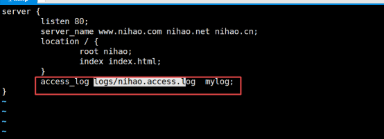
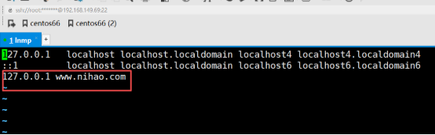
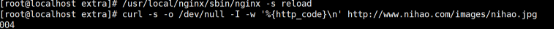

# **Nginx集群一**

- [**Nginx集群一**](#nginx集群一)
- [**一、几个基本概念**](#一几个基本概念)
  - [**（1）pv 值(page views):页面的浏览量**](#1pv-值page-views页面的浏览量)
  - [**（2）uv值(unique visitor)独立访客**](#2uv值unique-visitor独立访客)
  - [**（3）独立ip**](#3独立ip)
- [**二、解决高并发思路**](#二解决高并发思路)
    - [什么是网站并发连接？](#什么是网站并发连接)
    - [负载均衡器的实现两种方式:](#负载均衡器的实现两种方式)
    - [负载均衡的算法实现策略](#负载均衡的算法实现策略)
    - [大致架构图](#大致架构图)
- [**三、nginx的介绍**](#三nginx的介绍)
  - [**1、常用web服务器：**](#1常用web服务器)
  - [**2、nginx介绍**](#2nginx介绍)
  - [**3、nginx优点及内存分析**](#3nginx优点及内存分析)
- [**四、新建虚拟机网络配置**](#四新建虚拟机网络配置)
  - [**（1）配置ip地址**](#1配置ip地址)
  - [**（2）启动网络**](#2启动网络)
  - [**（3）本机 和 linux 互相ping通**](#3本机-和-linux-互相ping通)
- [**五、终端连接linux系统**](#五终端连接linux系统)
- [**六、光驱挂载**](#六光驱挂载)
  - [**1、挂载光驱**](#1挂载光驱)
  - [**2、配置yum源**](#2配置yum源)
  - [**3、安装gcc编译器软件**](#3安装gcc编译器软件)
  - [**4、安装lrzsz**](#4安装lrzsz)
- [**七、安装nginx软件**](#七安装nginx软件)
  - [**1、下载软件**](#1下载软件)
  - [**2、安装依赖**](#2安装依赖)
  - [**3、安装nginx软件**](#3安装nginx软件)
  - [3、nginx目录](#3nginx目录)
  - [**3、nginx的启动管理**](#3nginx的启动管理)
  - [**4、nginx的信号控制（了解）**](#4nginx的信号控制了解)
- [**六、配置文件讲解**](#六配置文件讲解)
  - [**1、配置文件介绍，**](#1配置文件介绍)
  - [**2、全局配置**](#2全局配置)
  - [**3、事件配置**](#3事件配置)
    - [关于worker\_connections并发链接数的设置](#关于worker_connections并发链接数的设置)
  - [**4、虚拟主机的配置**](#4虚拟主机的配置)
    - [**（1）基于域名server\_name的虚拟主机**](#1基于域名server_name的虚拟主机)
    - [**（2）基于端口listen的虚拟主机**](#2基于端口listen的虚拟主机)
    - [**（3）基于IP的虚拟主机配置实战**](#3基于ip的虚拟主机配置实战)
  - [**5、规范优化nginx配置文件**](#5规范优化nginx配置文件)
  - [**6、别名配置**](#6别名配置)
- [**七、日志管理**](#七日志管理)
  - [**1、用log\_format来设置日志的格式**](#1用log_format来设置日志的格式)
  - [**2、用access\_log指令指定日志文件存放路径。**](#2用access_log指令指定日志文件存放路径)
  - [**3、定时任务，完成日志分割**](#3定时任务完成日志分割)
- [**八、location语法：**](#八location语法)
  - [**1、location的作用**](#1location的作用)
  - [**2、基本语法如下：**](#2基本语法如下)
    - [匹配语法](#匹配语法)
    - [location块中语法](#location块中语法)
  - [**3、curl工具使用**](#3curl工具使用)
  - [**4、匹配实例**](#4匹配实例)
    - [**（1）精准匹配与一般匹配**](#1精准匹配与一般匹配)
    - [**（2）一般匹配长度问题**](#2一般匹配长度问题)
    - [**（3）一般匹配与正则匹配**](#3一般匹配与正则匹配)
    - [**（4）默认匹配**](#4默认匹配)


# <a name="_toc531103486"></a>**一、几个基本概念**
## <a name="_toc455763077"></a><a name="_toc531103487"></a>**（1）pv 值(page views):页面的浏览量**
概念：一个网站的所有页面，在一天内，被浏览的总次数。至少上千万的级别是大型网站。
## <a name="_toc455763078"></a><a name="_toc531103488"></a>**（2）uv值(unique visitor)独立访客**
概念：一个网站，在一天内，有多少个用户访问过我们的网站。10万以上
## <a name="_toc455763079"></a><a name="_toc531103489"></a>**（3）独立ip**
概念：一个网站，在一天内，有多少个独立的ip地址来访问我们的网站。


如果要考虑公司的局域网，uv值略大于独立ip的。

默认情况下，所有局域网内的设备对外表现为同一个公网IP地址，对内都有独立的私有ip地址


# <a name="_toc455763080"></a><a name="_toc531103490"></a>**二、解决高并发思路**
如果一个网站的uv,pv,独立ip变大，则会导致高的并发，这时要对网站分层布局架构，采用负载均衡。

### 什么是网站并发连接？

网站服务器在单位时间内能够处理的最大连接数。

并发链接数： Nginx 同时维持的 TCP 连接总数（无论是否活跃），例如 100 万个客户端同时与服务器保持连接（如长连接场景：WebSocket、直播推流），最大能百万

qps每秒请求数：指单位时间内处理的 HTTP 请求总数（活跃请求的频率），例如每秒处理 5 万次新请求，最大官方测试5万qps

### 负载均衡器的实现两种方式:

1. 硬件：立竿见影，效果非常好，价格非常昂贵，比如F5-BIGIP专业的负载均衡服务器一般20万左右
   1. 硬件级负载均衡器：专用芯片（ASIC/NP/FPGA），硬编码逻辑，效率高，但是成本高---纳米级，上限百万至千万pps
2. 软件：lvs(linux virtual server)  ，nginx(web服务器，负载均衡)，云负载均衡器等，通过在一个普通服务器上安装软件的方式解决，相当于组成一个内部局域网，web服务器不暴露在公网，web服务器间只能内网通信，用户只能通过负载均衡器来访问负责接收和响应。
   1. 软件级负载均衡器：通用 CPU + 软件代码，软模拟逻辑，依赖cpu计算，延迟高并发能力有限---微妙级，上限几十万pps
   2. lvs：Linux 内核自带的负载均衡软件，旨在提供高效的负载均衡解决方案。它允许你将多个物理服务器组成一个虚拟服务器-------
      1. 负载均衡器（Load Balancer）：LVS 的核心组件，负责接收客户端请求，并根据特定算法将这些请求分发给后端的真实服务器（Real Server）。
      2. 真实服务器（Real Server）：实际处理客户端请求的服务器。它们通常运行相同的服务，并且通过负载均衡器来分配流量
      3. 虚拟IP地址（Virtual IP, VIP）：这是客户端用来访问服务的单一入口点。对于客户端来说，看起来就像在与一台服务器通信，但实际上背后有多个服务器共同工作
   3. 使用 云负载均衡器（SLB/ELB） 代替自建 Nginx/LVS，Web 服务器部署在 VPC（虚拟私有云--vpc内的ECS） 内，无公网 IP，安全组规则限制：只允许 SLB 访问 Web 服务器的 80/443 端口
   
### 负载均衡的算法实现策略 

- 不是同时使用下面策略，而是根据实际情况选择一个合适的策略。

（1）轮询：按顺序轮流分配

负载均衡器把请求轮流转发给后面的web服务器。 

（2）ip哈希：根据客户端的 源 IP 地址 进行哈希计算，将同一个 IP 的请求始终转发到同一台后端服务器 

同一个地址的客户端，始终请求同一台主机。 

（3）最少连接 

负载均衡器把请求给负载最小的哪台服务器。 

### 大致架构图


- 问题1：上面负载过大带来的问题：使数据库服务器压力也过大了，需要也对数据库服务器进行增加。
  - 加两台mysql服务器：一个主服务器负责写，两个从服务器负责读（数据库一般是查用的多）----- 读写分离(程序角度)+主从复制(架构角度)
  - 当主服务器进行写后，应该保持3台服务器数据同步，主服务器同步给从服务器
  - 可以选择用交换机进行链接：web服务器与数据库服务器间用交换机插网线进行链接：硬件级MAC端口映射转发，通过MAC地址映射ip的方式直接在OSI模型数据链路层实

   

- 问题2：web服务器要是有1个挂了，原本每个负责1000并发，共支持3000并发，坏了1个，过来3000并发，就有可能导致另两台宕机不工作崩溃（每台最大承载 1000 并发（超过这个阈值会因 CPU / 内存 / 连接数耗尽而响应变慢甚至崩溃）
  - 架构上：可以再加个备份服务器：实时监控 + 自动切换。一般来说不工作，时刻监视web服务器是否正常，当发现1个服务器挂了，立马接替它的工作，确保服务不中断。（不差钱可以给每台服务器都做个备份）-------- 下面是常见实现方式
    - 热备份：高可用适合核心业务
    - 冷备份：低成本，适合非核心业务
- 升级3：有的架构还会在负载均衡器间与web服务器中间加个缓存服务器(如nginx缓存，redix，Memcached)，来拦截重复请求，减少服务器计算I/O开销---- 减少web服务器压力，间接提升集群并发承载能力


# <a name="_toc455763081"></a><a name="_toc531103491"></a>**三、nginx的介绍**
## <a name="_toc455763082"></a><a name="_toc531103492"></a>**1、常用web服务器：**
1. apache:功能完善，历史悠久，模块支持非常丰富，属于重量级产品，比较耗费内存。

缺点：处理每一个php比较费资源，导致如果高并发时会耗费服务器资源无法处理更多请求。-- 高并发差，不如nginx 

2. lighttpd：内存开销低，cpu占用率低，效能好，模块丰富等特点，轻量级web服务器。

3. nginx:省资源，省cpu，所以在高并发时能够处理更多的请求，高端能达到3万到5万的并发量。----- nginx不仅能作web服务器，也能作负载均衡器

## <a name="_toc531103493"></a>**2、nginx介绍**
*Nginx* (engine x) 是一个高性能的[HTTP](https://baike.baidu.com/item/HTTP)服务器，也是一个IMAP/POP3/SMTP邮件[服务器](https://baike.baidu.com/item/%E6%9C%8D%E5%8A%A1%E5%99%A8)。Nginx是由伊戈尔·赛索耶夫为[俄罗斯](https://baike.baidu.com/item/%E4%BF%84%E7%BD%97%E6%96%AF/125568)访问量第二的Rambler.ru站点（俄文：Рамблер）开发的，第一个公开版本0.1.0发布于2004年10月4日。

其将[源代码](https://baike.baidu.com/item/%E6%BA%90%E4%BB%A3%E7%A0%81)以类BSD许可证的形式发布，因它的稳定性、丰富的功能集、示例配置文件和低系统资源的消耗而[闻名](https://baike.baidu.com/item/%E9%97%BB%E5%90%8D)。2011年6月1日，nginx 1.0.4发布。

BSD (Berkeley Software Distribution，伯克利软件套件)

Nginx特点是占有内存少，[并发](https://baike.baidu.com/item/%E5%B9%B6%E5%8F%91)能力强，事实上nginx的并发能力确实在同类型的网页服务器中表现较好，中国大陆使用nginx网站用户有：百度、[京东](https://baike.baidu.com/item/%E4%BA%AC%E4%B8%9C)、[新浪](https://baike.baidu.com/item/%E6%96%B0%E6%B5%AA)、[网易](https://baike.baidu.com/item/%E7%BD%91%E6%98%93)、[腾讯](https://baike.baidu.com/item/%E8%85%BE%E8%AE%AF)、[淘宝](https://baike.baidu.com/item/%E6%B7%98%E5%AE%9D)等

## <a name="_toc455763083"></a><a name="_toc531103494"></a>**3、nginx优点及内存分析**
**（1）它可以高并发连接**，官方测试能够支撑5万并发连接，在实际生产环境中可以支撑2到4万并发连接。 

**（2）内存消耗少** 

1. TCP 连接的内存占用范围（20KB~ 数 MB）是由 内核 TCB（固定开销）、动态缓冲区（随数据量变化） 和 应用层管理结构 共同决定的：
   1. 空闲 / 轻量连接：10KB~20KB（适合基础估算）。
   2. 活跃 / 中等负载连接：40KB~100KB。
   3. 高负载 / 大数据连接：500KB~ 数 MB（需针对性优化）。

2. 内存：每个 TCP 连接会占用一定内存（约 20KB~ 数 MB，取决于连接状态和数据量）。例如：
10 万连接 ≈ 2GB 内存（按每个连接 20KB 计算）。
100 万连接 ≈ 20GB 内存（需服务器有足够内存支持）。
3. CPU：高并发连接需要 CPU 处理大量 I/O 事件（如 epoll 模型），CPU 核心数不足会导致调度延迟飙升，反而降低性能。

结论：硬件配置决定了 “实际可稳定运行的连接数”，远超硬件能力的设置会导致 OOM（内存溢出）或服务卡顿。

Nginx+php(FastCGI)服务器再3万并发连接比如活跃负载情况下，开启的10个Nginx进程消耗150MB内存，单个进程15MB，（15MB\*10=150MB）。开启的64个php-cgi进程消耗1280MB内存（20MB\*64=1280MB） 

**（3）成本低廉** 

购买F5 BIG-IP ,NetScaler等硬件负载均衡交换机需要10多万甚至几十万人民币。而Nginx为开源软件，可以免费试用，并且可用于商业用途。 

（4）配置文件非常简单：通俗易懂，即使非专业管理员也能看懂。 

（5）支持 rewrite重写规则：能根据域名、URL的不同，将HTTP请求分到不同的后端服务器群组。 

（6）内置的健康检查功能：如果nginx proxy后端的某台服务器宕机了，不会影响前端访问。 

（7）节省带宽，支持gzip压缩。 

（8）稳定性高：用于反向代理，宕机的概率微乎其微。 

（9）支持热部署。在不间断服务的情况下，对软件版本升级。


nginx在反向代理，rewrite规则，稳定性，静态化文件处理，内存消耗等方面，表现出了很强的优势，选用nginx取代传统的apache 服务器，将会获得多方面的性能提升。

（8）支持的操作系统

FreeBSD 3.x,4.x,5.x,6.x i386; FreeBSD 5.x,6.x amd64;

Linux 2.2,2.4,2.6 i386; Linux 2.6 amd64;

Solaris 8 i386; Solaris 9 i386 and sun4u; Solaris 10 i386;

MacOS X （10.4） PPC;

Windows XP，Windows Server 2003和Windows 7等。
# <a name="_toc455763084"></a><a name="_toc531103495"></a>**四、新建虚拟机网络配置**

目的就是能通过ssh主机远程链接虚拟主机就行了，下面的ip配置自动的或者下面那样配置都可以

## <a name="_toc455763085"></a><a name="_toc531103496"></a>**（1）配置ip地址**
给linux系统配置ip地址等信息，这样我们的系统就可以彼此实现通信效果（如可以实现远程链接软件ssh协议等链接上），并且也可以提供网络服务，例如apache服务、mysql服务。

通过配置文件配置虚拟机的ip地址：编辑配置文件：

\> cd  /etc/sysconfig/network-scripts

ifcfg-eth0：代表硬件的第一个网卡，eth1就是第2个，以此类推

这个文件里各个属性可以修改，包括ip地址，子网掩码，广播地址，默认网关》等》

ifcfg-eth0文件被修改之前先备份，如下

\> cp  ifcfg-eth0  ./ifcfg-eth0.bak			//修改前先备份

下边，使用vim打开ifcfg-eth0做网络配置(一共4个项目需要设置)：


之后:wq保存退出
## <a name="_toc531103497"></a>**（2）启动网络**
现在需要重启网络：

(网络文件ifcfg-eth0被修改后，都要执行如下的restart指令重启网络)

\> service  network  start/stop/restart


在linux下查看已经分配好的ip地址：

\> ifconfig


执行：service network start(restart)

## <a name="_toc531103498"></a>**（3）本机 和 linux 互相ping通**
首先需要给虚拟机做一个预配置：


linux 可以ping通  本机：


本机 也 可以ping通 linux：


问题：本机可以ping通linux，但是linux不能ping通本机？

解决：关闭本机防火墙。

临时关闭防火墙，重启后复原；service iptables stop 

永久关闭防火墙：chkconfig iptables off
# <a name="_toc531103499"></a>**五、终端连接linux系统**
服务器(Linux)

(广州)机房


服务器需要放到专业机房里边，其安全、网络带宽、温度、湿度等等都有保障。

如上图，linux服务器放置在广州机房，而在其他地方有人员想要操作，就需要通过终端软件连接并使用。
1. ## <a name="_toc531103500"></a>**Xshell连接linux**
   Xshell终端软件

   linux本身提供ssh服务

   service sshd status

   该服务走端口22，协议是ssh(类似apache走http协议，端口80)

   [SSH](http://baike.baidu.com/subview/16184/5909253.htm) 为 [Secure Shell](http://baike.baidu.com/view/2118359.htm) 的缩写

   如下图添加一个终端连接：

   

   给xshell做连接配置：


   

   上图点击“确定”后会再会话窗口增加连接的项目：

   上图选中要连接的项目，点击“连接”按钮，出现下图效果：

   现在登录linux系统成功：

   连接上linux系统后，可以给xshell终端设置显示字号大小：

# <a name="_toc531103501"></a>**六、光驱挂载**

   光驱是指虚拟机里的dvd光驱位置，把我们镜像包挂进去，想使用光驱里的提供的额外软件包，如直接从光驱里装nginx，就不用从yum从网络上下载了。

  ------自己是直接配得yum源，可以直接从网上下载安装，光驱这个章节可选-阅读--------


   ## <a name="_toc531103502"></a>**1、挂载光驱**
   在linux系统光盘中，除了操作系统外，还有许多功能包软件，这些软件在今天的学习过程中需要被安装。

   linux系统挂载类型：自动/手动.

   光驱在linux系统里边需要“手动”完成挂载动作。

   首先把光盘放到光驱里边：

   

   其次，实现挂载，在系统中找到一个普通目录，使其与光驱硬件进行联系


   光驱使用：

   


   

光驱硬件

   


   创建一个普通目录，用于与光驱挂载联系：

   > mkdir /cdrom

   光驱硬件：/dev/cdrom

   由上图可见，/dev/cdrom是一个软链接，本身是/dev/sr0(因此可以通过/dev/sr0找到光驱硬件)，我们不推荐使用sr0，因为可读性不好(cdrom的可读性好)

   具体挂载操作：

   > mount  硬件   挂载点目录(普通目录)   //挂载动作

   > mount  /dev/cdrom  /cdrom   	//把光驱挂载到rom目录

   //上下两行作用完全一样

   > mount  /dev/sr0  /cdrom   	//把光驱挂载到rom目录

   umount  硬件或挂载点         					//卸载动作

   > umount  /dev/cdrom        					//(硬件)卸载光驱

   > umount  /home/jinnan/rom   				//(挂载点)卸载光驱

   (注意，光驱正处于操作的状态是禁止卸载的)

   让光驱硬件 与 /cdrom挂载联系：

   

   挂载好后，就可以通过/cdrom目录查看到光驱的内容了：

   使得光驱卸载(/cdrom目录 与 光驱不要联系)：

   

   下载完毕，那么此时/cdrom目录又变为普通目录了(看不到光盘内容了)

   

   正在操作的光驱是不允许卸载的：

   

   上图说明正在对光盘进行操作

   卸载操作是失败的，如下图，提示设备繁忙，禁止卸载：

   

   ## <a name="_toc531103503"></a>**2、配置yum源**
   设置yum的软件源为本地光盘(/cdrom)

1) 确保光盘是挂载状态，挂载点是/cdrom

   首先把光盘dev/cdrom挂载到/cdrom下：

2) 切换到yum配置文件目录

   其次，修改yum的配置文件，设置软件源为本地光盘

   切换到yum的配置文件目录：/etc/yum.repos.d/

   

3) 修改配置文件XXX-Base.repo名字为XXX-Base.repo.bak，我们使这个默认软件源失效。。。。

   在yum配置文件目录内部有CentOS-Base.repo，其是上网使用的，并且其也会首先执行，我们要给其改名字为xxxx.bak形式，使其失效：

   

4) 给yum开启本地软件源

   CentOS-Base.repo文件失效后，那么CentOS-Media.repo就会执行，其是设置软件源的配置文件：

   打开CentOS-Media.repo，配置两个地方：软件源 和 生效开关

   baseurl=file:///cdrom/

   enabled=1

   

   之后保存退出

   现在我们的yum指令就ok了
   ## <a name="_toc531103504"></a>**3、安装gcc编译器软件**
   GNU编译器套件（GNU Compiler Collection）包括[C](https://baike.baidu.com/item/C/7252092)、[C++](https://baike.baidu.com/item/C++)、[Objective-C](https://baike.baidu.com/item/Objective-C)、[Fortran](https://baike.baidu.com/item/Fortran)、[Java](https://baike.baidu.com/item/Java/85979)、[Ada](https://baike.baidu.com/item/Ada/5606819)和[Go语言](https://baike.baidu.com/item/Go%E8%AF%AD%E8%A8%80)的前端，也包括了这些语言的库（如libstdc++、libgcj等等）

   该gcc可以实现C语言、C++语言、Java语言由源码向二进制码编译的过程，其是一个工具。

111001010101

二进制码文件

class

function

源码文件

   


   


   源码文件 通过gcc工具编译为 二进制码文件

   该gcc工具在操作系统光盘里，在Packages目录里边,查看gcc软件

   ls | grep gcc

   

   查看gcc是否安装，如果没有安装，则使用yum方式完成安装；

   yum list installed | grep gcc

   如果我们通过yum方式安装gcc软件，那么就很顺利，yum本身会自动给我们解决依赖，因此安装步骤就两个：

   > yum -y install gcc

   > yum -y install gcc-c++

   ## <a name="_toc531103505"></a>**4、安装lrzsz**
   在linux系统中有一个软件(软件包名：lrzsz),可以帮助我们实现软件的上传和下载：

   把这个软件lrzsz安装上(也在系统光盘Packages里边)：

   yum -y install lrzsz

   

   通过lrzsz实现apache相关软件上传：

   切换到某个目录下再执行如下rz指令(作用是把软件就上传到某个目录)

   > rz

   

   现在在切换到/home/hanguo目录下,相关的软件已经上传成功：

   


   # <a name="_toc455763089"></a><a name="_toc531103506"></a>**七、安装nginx软件**
   ## <a name="_toc531103507"></a>**1、下载软件**
   <http://nginx.org/en/download.html>

   <http://nginx.org/download/nginx-1.12.2.tar.gz>

   ## <a name="_toc531103508"></a>**2、安装依赖**
   挂载光盘，安装如下3个依赖软件：

   <a name="ole_link3"></a><a name="ole_link2"></a>[root@localhost ~] yum -y install pcre pcre-devel

   [root@localhost ~] yum -y install openssl openssl-devel

   [root@localhost ~] yum -y install zlib zlib-devel

   pcre 和 pcre-devel:两个软件，必须有关系，pcre是线上产品，pcre-devel(develop)是开发版本，里边有一些功能是线上产品不不具备

   pcre：		包括 [perl](https://baike.baidu.com/item/perl) 兼容的[正则表达式](https://baike.baidu.com/item/%E6%AD%A3%E5%88%99%E8%A1%A8%E8%BE%BE%E5%BC%8F)库

   openssl：	支持安全传输协议https(和财务有关系的请求会走的协议)

   zlib：		优化、压缩支持
   ## <a name="_toc455763091"></a><a name="_toc531103509"></a>**3、安装nginx软件**
   （1）上传软件解压

   [root@localhost ~] cd /home/jinnan/tar

   解压缩

   [root@localhost ~] tar zxf nginx-1.12.2.tar.gz

   （2）进入nginx解压目录

   [root@localhost ~] cd nginx-1.12.2

   （3）configure配置nginx

   [root@localhost ~] 

   ./configure --prefix=/usr/local/nginx --with-http\_ssl\_module

   	

   --with-http\_ssl\_module			//配置https安全型协议

   configure执行完毕效果如下图：

   （4）编译&安装

   [root@localhost ~] make && make install

   make && make install执行完毕效果：


   （5）启动Nginx

   [root@localhost ~] /usr/local/nginx/sbin/nginx

   查看服务

   （6）[root@localhost ~] netstat -lntp

   如果nginx配置文件有修改，可以通过如下方式测试配置文件是否正确：

   [root@localhost ~] /usr/local/nginx/sbin/nginx -t

   查看编译的模块

   [root@localhost ~] /usr/local/nginx/sbin/nginx -V


   ## 3、nginx目录

**( 0 ) nginx目录:**
   
   1. 注意：安装完成后，会有4个目录，
      1. conf  配置文件  
      2. html  网页文件，网站的根目录，就类似与apache里面的htdocs目录。
      3. logs  日志文件
         1. 访问日志：access.log：如路径/usr/local/nginx/logs/access.log
         2. 错误日志：error.log
         3. 主进程号文件：nginx.pid
      4. sbin  主要二进制程序，启动程序命令

   ## <a name="_toc455763092"></a><a name="_toc531103510"></a>**3、nginx的启动管理**
   
**( 1 ) 启动，执行/usr/local/nginx/sbin/nginx文件，完成启动。**

   参数 "-c" 指定了配置文件的路径，如果不加 "-c" 参数，Nginx 会默认加载其安装目录的 conf 子目录中的 nginx.conf 文件。

**( 2 ) 测试是否启动成功**

   lsof –i :80或netstat –tunpl |grep 80;

   

   浏览器中通过ip地址访问；

   

**( 3 ) nginx的管理**

   通过查看./nginx –h帮助命令

   

   `nginx` 启动

   `nginx  –s stop`  -s就是信号的意思，信号选项：停止nginx的服务

   `nginx  –s reload`  不停止nginx的服务，重新加载配置文件。

   `nginx -s reopen`  重读日志文件。

   `nginx -s quit`  优雅关闭

   `nginx  –t`  检测配置文件是否有错误。

   **`nginx  -V`查看Nginx编译时的参数？**

   `[root@hadoop sbin]# ./nginx -V`

   nginx version: nginx/1.8.1

   built by gcc 4.4.4 20100726 (Red Hat 4.4.4-13) (GCC)

   built with OpenSSL 1.0.0-fips 29 Mar 2010

   TLS SNI support enabled

   **configure arguments: --user=www --group=www --prefix=/usr/local/nginx --with-http\_stub\_status\_module --with-http\_ssl\_module**
   
   ## <a name="_toc531103511"></a>**4、nginx的信号控制（了解）**
   
   - 运维人员常用的管理nginx的一种方式，我们常用前面的命令控制方式也可以，都是一种方式

   信号控制，是管理nginx进程的一种方式。

   具体的用法：**kill –信号选项 nginx的主进程号**

   **https://www.nginx.com/resources/wiki/start/topics/tutorials/commandline/**

   

   **（1）比如立即关闭进程：**

   kill –INT  nginx的主进程号

   查看某个任务的进程号，可以用ps aux|grep nginx

   

   **（2）优雅的关闭进程（即等请求结束后，再关闭）**

   kill –QUIT  nginx的主进程号

   **（3）重读配置文件**

   **kill –HUP  nginx的主进程号与nginx –s reload一样**

   把配置文件中的新更新的东西加载到正在运行的nginx的进程中，接着对用户提供服务，但是nginx的进程并没有关闭。即重读配置文件。

   可以通过修改配置文件进行测试

   **（4）重读日志文件**
   ```js
   Kill  -USR1 `cat /xxx/path/log/nginx.pid`    
   ```
   重新读日志文件
   
   应用场景：当把原来的日志文件名进行改名备份后又建个新日志文件，名字与配置文件中的名字一致，想日志打到新文件名去，此时默认访问日志等还是会打到那个改名后的文件里去，--------> 这时就需要重读日志文件操作，让后面的日志打到新建的文件中去

   ---日志文件改名备份后，使用，否则仍然写入原来的日志文件。

   **（5）可以使用nginx.pid文件代替nginx的主进程号**

   1. 一般nginx配置文件中都会保存nginx的主进程号对应的缓存文件地址，配置文件中以pid字段保存对应进程号文件地址：文件一般叫nginx.pid

   2. 查看nginx.pid文件的位置，打开配置文件进行查看：
      1. `cat /xxx/path/log/nginx.pid` 文件内容就存个进程号数字。

   **即：kill  –信号控制 `cat /xxx/path/log/nginx.pid`**

   # <a name="_toc455763093"></a><a name="_toc531103512"></a>**六、配置文件讲解**
   ## <a name="_toc455763094"></a><a name="_toc531103513"></a>**1、配置文件介绍，**

   下面是去掉注释后，配置文件里面的内容；

   egrep –v “#|^$” nginx.conf

      --- ^$：空行（^ 表示行首，$ 表示行尾，中间无任何字符）

   

   通过观察，该配置文件有两段

   events {

   }

   http {

   `	`server {

   }

   }

   含全局配置的字段和events和http共3部分：每个http有很多server，每个server用来配置对应虚拟主机的
   
   注意：每一行用分号结束，内容与{之间要有空格。

   ## <a name="_toc531103514"></a>**2、全局配置**
   worker\_processes  1;配置工作进程的个数，推荐设置为cpu的个数\*核心数。（如2块cpu*单块cpu核心数4如就写成8）

   //不同错误信息存储的位置

   //全局错误日志定义类型，[ debug | info | notice | warn | error | crit ]

   #error\_log  logs/error.log;

   #error\_log  logs/error.log  notice;

   #error\_log  logs/error.log  info;

   //存储nginx进程号的文件

   #pid        logs/nginx.pid;
   ## <a name="_toc531103515"></a>**3、事件配置**
   events {

   `    `//单个cpu进程的最大并发连接数

   `    `//根据硬件调整，和前面工作进程配合起来用，尽量大，但是别把cpu跑到100%就行）

   `    `//同时要考虑，服务器并不是100%为nginx服务，还有其他工作要做，因此不能达到理论峰值

   `    `worker\_connections  1024;

   `    `//并发总数是 worker\_processes 和 worker\_connections 的乘积

   `    `//即 max\_clients = worker\_processes \* worker\_connections

   }

### 关于worker_connections并发链接数的设置

1. 每个网络连接会占用一个 文件描述符（Linux 中 “一切皆文件”，网络连接也被视为文件），而系统对单个进程的文件描述符数量有限制：
   1. 默认限制：多数 Linux 系统默认单个进程的文件描述符上限为 1024 或 4096（可通过 ulimit -n 查看）。
   2. 可调调上限：通过系统配置可提高限制，但是服务器的 内存 和 CPU 会制约实际可调整的值。

2. 最大并发连接数一般设置范围：
   1. 中小型服务器（2 核 4GB 内存）：建议 worker_connections 不超过 16384~65536，总连接数（worker_processes × 连接数）控制在 10 万以内。
   2. 高性能服务器（8 核 32GB 内存）：可设置为 65536~262144（25 万），配合 epoll 模型和调优的系统参数，可稳定承载。
   3. 超大规模场景（如大型网关，32 核 128GB + 内存）：经专业调优后，可尝试 1048576（100 万），但需严格测试稳定性（多数业务场景无需这么高）。
3. worker\_connections  1024;配置每个工作进程支持的最大连接数（一个进程的并发量）

   ## <a name="_toc455763095"></a><a name="_toc531103516"></a>**4、虚拟主机的配置**
   - 在http段里面的server段就是配置虚拟主机的，http中每一个server段就是一个虚拟主机

   - 虚拟主机就是可以让一台服务器运行多个不同域名 或 不同ip的网站
   ### <a name="_toc455763096"></a><a name="_toc531103517"></a>**（1）基于域名server_name的虚拟主机** 

   配置一个[www.abc.com](http://www.abc.com)的虚拟主机
   
   server下的server\_name就是设置虚拟主机的域名。


   第一步：打开nginx的配置文件，进行如下配置。

   

   第二步：修改完成配置文件后，要执行重写加载配置文件

   /usr/local/nginx/sbin/nginx –s reload

   

   第三步：在/usr/local/nginx/新建一个abc的目录，该目录就是[www.abc.com](http://www.abc.com)域名的根目录。

   并在里面添加一些测试文件。

   

   测试效果如下：

   在window系统hosts 文件里面做好解析；

   

   测试效果如下；

   

   也可以通过在linux主机里面本地测试

   [root@hadoop nginx]# echo "127.0.0.1 www.abc.com" >> /etc/hosts

   [root@hadoop abc]#echo 'www.abc.com' >>./index.html

   [root@hadoop abc]# curl www.abc.com

   www.abc.com
   ### <a name="_toc455763097"></a><a name="_toc531103518"></a>**（2）基于端口listen的虚拟主机** 
   在配置文件里面，如下配置，

   

   测试效果如下：

   

   ### <a name="_toc531103519"></a>**（3）基于IP的虚拟主机配置实战**
   
   - 一个服务器可以有多个网卡也可以有多个ip，一个网卡也可以配多个ip。

   主要实现方式是通过单网卡多ip的方式来实现的；通过如下命令临时在eth0网卡上增加一个不同的IP地址；

   1. `ip addr add 192.168.1.101/24 dev eth0`
      1. /24 表示子网掩码，24位1，0位255，192.168.1.0/24 表示 192.168.1.0 到 192.168.1.255 这个范围的ip地址。24就是255.255.255.0这个ip共32位转成2进制，就是表示24个1来代表的
      2. 配置ip时，都需要同步配置好对应的子网掩码
      3. dev etho：指定dev硬件设备网卡名字为eth0网卡

   2. 192\.168.1.100  

   3. 255\.255.255.0    11111111.11111111.11111111.00000000
   4. 配置完后，可以用ping通测试下，是否增加ip配置成功。


   

   虚拟主机配置如下；

   

   效果如下；

   

   注意：一般我们常用是前2种，而基于IP的虚拟主机配置在生产环境中不经常使用，一般配置在负载均衡后面的服务器上面，知道即可。
      - 一般在还没有申请域名下来，可以先用基于ip地址的虚拟主机配置。


   ## <a name="_toc455763098"></a><a name="_toc531103520"></a>**5、规范优化nginx配置文件** 
   大家如果了解apache软件，就会知道apache主配置文件包含虚拟主机子文件的方法，这里也借鉴了apache的这种包含方法，

   可以把多个虚拟主机配置成一个个单独的配置文件，仅仅和nginx的主配置文件nginx.conf分离开即可。

   这里使用语法是 include,

   （1）在conf目录下面新建一个目录，

   

   （2）进入到新建的目录（extra）新建一个文件（nihao.conf）

   在该文件里面添加虚拟主机的配置。

   

   

   （3）打开nginx的配置文件，nginx.conf,引入虚拟主机的配置文件。

   

      1. 一般引入文件可以用正则表达式。
      2. **一般我们可以直接include extra/*.conf; 自动引入extra目录下的所有配置文件**。


   （4）执行nginx的重新加载配置文件，

   

   （5）根据虚拟主机里面的配置，新建一个网站的根目录（nihao），

   

   （6）在window系统里面，配置hosts文件内容如下：

   访问效果如下：

   
   ## <a name="_toc455763099"></a><a name="_toc531103521"></a>**6、别名配置** 
   所谓虚拟主机别名，就是为虚拟主机设置除了主域名以外的一个或多个域名名字，这样就能实现用户访问的多个域名对应同一个虚拟主机网站的功能。

   语法：只需在server\_name所在行后面添加别名即可。

   比如刚才设置的[www.nihao.com](http://www.nihao.com)域名，我们添加两个别名

   

   配置window里面的hosts文件

   

   访问效果如下：

   
   # <a name="_toc455763100"></a><a name="_toc531103522"></a>**七、日志管理**
   与 nginx日志相关的指令主要有两条，一条是log\_format,用来设置日志的格式，另外一条是access\_log,用来指定日志文件的存放路径、格式和缓存大小。两条指令在nginx配置文件中的位置可以在http{}之间，也可以在虚拟主机之间，即server{}两个大括号之间。 
   ## <a name="_toc455763101"></a><a name="_toc531103523"></a>**1、用log\_format来设置日志的格式**
   log\_format   格式名称   格式样式 

   比如如下： 

   log\_format  main  '$remote\_addr - $remote\_user [$time\_local] "$request" ' 

   `                  `'$status $body\_bytes\_sent "$http\_referer" ' 

   `                `'"$http\_user\_agent" "$http\_x\_forwarded\_for"'; 

   在日志格式样式中: 

   $remote\_addr和$http\_x\_forwarded\_for用于记录IP地址

   $remote\_user用于记录远程客户端用户名称；

   $time\_local用于记录访问时间与时区；

   $request用于记录请求URL与HTTP协议；

   $status用于记录请求状态，例如成功时状态为200，页面找不到时状态为404；

   $body\_bytes\_sent用于记录发送给客户端的文件主体内容大小；

   $http\_referer用于记录是从哪个页面链接访问过来的；

   $http\_user\_agent用于记录客户端浏览器的相关信息。 
   ## <a name="_toc455763102"></a><a name="_toc531103524"></a>**2、用access\_log指令指定日志文件存放路径。**
   **Nginx允许针对不同的server做不同的Log ,(有的web服务器不支持,如lighttp)** 

   access\_log    logs/access\_8080.log      mylog;   

   声明log      log位置                log格式; 

   案例：给[www.nihao.com](http://www.nihao.com)域名配置日志记录，

   （1）在nginx.conf主配置文件里面，配置日志格式的样式。

   

   （2）在extra/nihao.conf配置文件里面，配置日志文件的存储路径。

   

   查看日志文件

   

   注意点：

   $remote\_addr和$http\_x\_forwarded\_for都用于记录IP地址，区别是什么？

   通过$remote\_addr变量拿到的将是反向代理服务器（负载均衡）的IP地址。但是，反向代理服务器（负载均衡）在转发请求的HTTP头信息中，可以增加 X-Forwarded-For信息，用以记录原有的客户端IP地址和原来客户端请求的服务器地址。这时候，就要用log\_format 指令来设置日志格式，让日志记录X-Forwarded-For信息中的IP地址，即客户的真实IP

   


   ## <a name="_toc531103525"></a>**3、定时任务，完成日志分割**
   
   我们的日志文件如果访问量很大，数据量很大，日志文件一个的化就会很大，一般需要每天都要切割备份一次，设置个定时任务，按照每天0点0分自动分隔，用日期来命名文件名

   定时任务肯定和脚本离不开，我们需要写一个脚本，脚本里面写好日志分割的命令，然后定时任务每天0点0分自动执行这个脚本，就可以完成日志分割了。

   
   **查看日期修改：**

   **date**

   **date –d yesterday** ：输出昨天的日期

   **date –s ‘2018-11-27 9:40’**

   **得到格式化的日期：**

   **date –d yesterday +%Y%m%d%H%M**

   

   **（1）在/date根目录下面建个date目录，其下新建一个脚本runlog.sh**

   **脚本文件一般用sh格式，使用vim命令创建。**

   #!/bin/bash

   

   **使用sh指令来运行脚本文件；其实脚本文件就是多个命令的集合**

   

   **（2）通过crontab –e定时执行，脚本文件。**

   **如果没有安装定时任务，可以使用**

   yum install -y vixie-cron命令进行安装；

   启动定时任务service crond start

   **查看定时任务crontab -l**

   **编辑定时任务crontab –e**

   **删除定时任务crontab -r**

   **\*/1 \* \* \* \* sh /date/runlog.sh**

   **15 15 5 12 \***

   **分 时 日 月 周 命令**

   

   **（3）查看：**

   运行效果如下；

   
   # <a name="_toc455763103"></a><a name="_toc531103526"></a>**八、location语法：**
   ## <a name="_toc531103527"></a>**1、location的作用**
   
  > 1个server下面可以配置多个location
   
   location指令的作用是根据用户请求的URL来执行不同的应用。

   在虚拟主机的配置中，是必不可少的，location可以把网站的不同部分定位到不同的处理方式上。

   比如：碰到.php 如何调用php解释器，这时就需要location.

   ## <a name="_toc531103528"></a>**2、基本语法如下：**

   ### 匹配语法
   location [=|~|~*|^~] patt {

   }


   1. =：精确匹配
规则：仅当请求的 URI 与模式完全一致时才匹配。
示例：
nginx

```js
// 仅匹配 "http://example.com/exact" 这个 URI，不匹配 "/exact/abc" 或 "/
exact123"
location = /exact {
    return 200 "精确匹配成功";
}

// 适用场景：匹配固定的、高频访问的 URI（如首页 /），性能最优。
```

2. ^~：前缀匹配（优先）

规则：匹配以模式为前缀的 URI，且一旦匹配成功，会终止后续的正则表达式匹配（优先级高于正则）。
示例：

```js
# 匹配所有以 "/static/" 开头的 URI（如 "/static/css/style.css"、"/static/js/app.js"）
# 且不会再检查后续的正则匹配（即使有更精确的正则也不生效）
location ^~ /static/ {
    root /var/www;  # 静态文件根目录
}
```
适用场景：匹配静态资源目录（如 /static/、/images/），避免被后续正则规则干扰。

3. ~：正则匹配（大小写敏感）

规则：按正则表达式匹配 URI，区分大小写，且优先级高于普通前缀匹配。
示例：
```js
# 匹配所有以 ".html" 结尾的 URI（如 "/index.html"），但不匹配 ".HTML"
location ~ \.html$ {
    return 200 "匹配 HTML 文件（大小写敏感）";
}

注意：正则表达式需符合 Perl 兼容正则（PCRE）语法，常用元字符：^（行首）、$（行尾）、\.（点）、*（任意次）等。
```

4. ~*：正则匹配（大小写不敏感）

规则：与 ~ 类似，但不区分大小写。

示例：
```js
# 匹配所有以 ".jpg" 或 ".JPG" 结尾的 URI（如 "/image.jpg"、"/photo.JPG"）
location ~* \.(jpg|jpeg|png|gif)$ {
    root /var/images;  # 图片文件根目录
}

适用场景：需要忽略大小写的 URI 匹配（如图片、视频等资源）。
```
5. 无修饰符：普通前缀匹配

规则：匹配以模式为前缀的 URI，但优先级最低（仅在没有其他更高优先级的匹配时生效）。

示例：
```js
# 匹配所有以 "/api/" 开头的 URI（如 "/api/user"、"/api/order/123"）
# 但如果有正则匹配（如 ~ /api/user），则正则优先
location /api/ {
    proxy_pass http://backend;  # 反向代理到后端服务
}
特点：模式可以是完整路径（如 /api），也可以是目录（如 /api/，注意末尾的 / 会影响子路径匹配）。
```

### location块中语法

1. Nginx 的 location 块中，return 指令用于立即终止当前请求的处理流程，并向客户端返回指定的状态码、响应内容或重定向地址。它的核心作用是快速响应请求，无需继续执行后续配置（如反向代理、读取静态文件等）
   1. `return code [text];          # 返回状态码 + 自定义响应文本`
   2. `return code URL;             # 返回状态码 + 重定向地址（URL）`
   3. `return URL;                  # 简写形式，默认返回 302 临时重定向`

```js
1- root	该 location 的根目录（覆盖 server 块的 root）	location /static/ { root /var/www; }

2- alias	替换 URI 路径为指定目录（与 root 区别：直接替换而非拼接）	location /img/ { alias /var/images/; }	

3- proxy_pass	反向代理到后端服务（如 API 服务器）	location /api/ { proxy_pass http://127.0.0.1:8080; }	

4- proxy_set_header	向后端传递自定义请求头	proxy_set_header Host $host;（传递客户端 Host）

5- proxy_set_header X-Real-IP $remote_addr;（传递客户端真实 IP）	
6- try_files	尝试访问文件 / 路径，失败则跳转	location / { try_files $uri 
$uri/ /index.php; }（静态文件不存在则交给 PHP 处理）	

7- return	直接返回状态码 / 重定向（终止请求处理）	location /old { return 301 /new; }（永久重定向）

8- rewrite	URI 重写（修改请求路径，不跳转）	rewrite ^/article/(\d+)$ /post.php?id=$1 last;（将 /article/123 改为 /post.php?id=123）	

9- expires	静态资源缓存时间（客户端缓存）	`location ~* .(jpg	css)$ {expires 7d;}`（缓存 7 天）

10- auth_basic	启用 HTTP 基础认证	auth_basic "请输入密码";

11- auth_basic_user_file /etc/nginx/.htpasswd;（密码文件路径）
```

   ## <a name="_toc531103529"></a>**3、curl工具使用**
   在Linux中curl是一个利用URL规则在命令行下工作的文件传输工具，可以说是一款很强大的http命令行工具。

   注意点：在linux下面配置的虚拟主机测试时，要在/etc/hosts文件里面做好解析；

   vim  /etc/hosts

   

   基本用法

   （1）请求页面

   curl    http://www.inux.com

   

   （2）-o保存访问的网页，是小写的o

   curl –o abc.txt http://www.abc.com

   
   
   （3）-s不输出进度: 执行普通的 curl 请求时上面那张图，会显示进度条和连接信息
   
   curl –s –o abc.txt  http://www.abc.com\
   

   （4）-I和-i

   -i是显示返回头信息和网页内容

   -I只显示返回头信息

   curl –i http://www.abc.com

   

   （5）-w 输出指定格式的内容

   输出格式由普通字符串和任意数量的变量组成，输出变量需要按照%{variable\_name}的格式

   %{http\_code}表示状态码。

   curl –s –o /dev/null –I –w “%{http\_code}\n” http://www.abc.com

   
   
   ## <a name="_toc531103530"></a>**4、匹配实例**
   ### <a name="_toc531103531"></a>**（1）精准匹配与一般匹配**
   location = /demo {

   }

   location  /demo {

   }

   注意：= 开头表示精确匹配

   

   效果如下；

   

      终端返回的值：就是1或2，前面俩0不足3位补余

   ### <a name="_toc531103532"></a>**（2）一般匹配长度问题**
   location /demo{}

   location /demo/abc {}

   

   效果如下；

   域名/demo/abc/nihao

   

   
   - 总结：都是一般匹配的情况下，访问的路径中，如果有多个location都符合，则匹配到最长字符串（location）优先；

   ### <a name="_toc531103533"></a>**（3）一般匹配与正则匹配**
   location   /images/ {

   `	`config D

   }

   location ~\* \.(gif|jpg|jpeg)$ {

   `	`config E

   }

   注意：如下

   ~ 开头表示区分大小写的正则匹配

   ~* 开头表示不区分大小写的正则匹配

   

   域名/images/abc.jpg

   

   总结：如果常规字符串，与正则都匹配，则优先匹配正则

   注意：也可以通过再字符串规则前设置^~   表示匹配到常规字符串，不做正则匹配检查

   location ^~ /image {}

   location ~\* \.(gif|jpg|png|js|css)${}

   

   
   ### <a name="_toc531103534"></a>**（4）默认匹配**
   location   / {

   `	`具体配置

   }

   /为默认匹配，即如果没有匹配上其他的location，则最后匹配‘默认匹配’部分； 

   总结：location的命中过程是这样的；

   （1）先判断精准匹配，如果匹配成功，立即返回结果并结束解析过程

   （2）判断一般匹配，如果有多个匹配成功，记录下来最长的匹配规则，

   （3）继续判断正则匹配，按匹配里的正则表达式顺序为准，由上到下开始匹配，一旦匹配成功一个，立即返回结果，结束解析过程。

   注意：一般匹配中，顺序无所谓，只看匹配长度---长度优先顺序无关；正则匹配中，顺序有所谓，因为是从前向后匹配的---顺序优先长度无关。

   不同URL及特殊字符组合匹配的顺序说明

   |顺序|不同URL及特殊字符组合匹配|匹配说明|
   | - | - | - |
   |1|` `Location =/{|精确匹配|
   |2|` `Location ^~ {|匹配常规字符串，不做正则匹配检查|
   |3|Location ~\* \.(gif|jpg)||正则匹配|
   |4|` `Location /demo/|匹配常规字符串，如果有正则，则优先匹配正则|
   |5|` `Location / {|所有location都不能匹配后的默认匹配|

   监控站点可用性\
   curl -o /dev/null -s -w %{http\_code} "http://www.kklinux.com"
