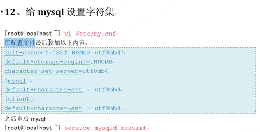

# nginx 02课程

- [nginx 02课程](#nginx-02课程)
  - [定时任务补充](#定时任务补充)
  - [重写规则（rewrite）](#重写规则rewrite)
    - [范例](#范例)
  - [gzip压缩](#gzip压缩)
  - [LNMP环境装Mysql](#lnmp环境装mysql)
    - [安装过程](#安装过程)
    - [启动mysql](#启动mysql)
    - [查看Mysql登录密码并登录](#查看mysql登录密码并登录)
    - [修改密码](#修改密码)
    - [控制mysql服务](#控制mysql服务)
    - [设置字符集](#设置字符集)
  - [LNMP环境安装php](#lnmp环境安装php)
    - [需要在ngnix中设置php相关解析的配置](#需要在ngnix中设置php相关解析的配置)
  - [运行nginx与php整合](#运行nginx与php整合)
  - [部署TP框架](#部署tp框架)
  - [部署dede项目](#部署dede项目)
  - [负载均衡的配置](#负载均衡的配置)
    - [upstream其他配置](#upstream其他配置)
  - [301和302重定向](#301和302重定向)


## 定时任务补充


1. crontab -e中 可以写很多个任务，不止写1个

## 重写规则（rewrite）

类似于apche中的伪静态概念

1. 伪静态好处：可以在自然搜索结果中作seo搜素引擎优化
   1. 假如你的网站路径是：www.baidu.com/index.php?id=1&name=jinyan，搜索引擎不喜欢你这种路径，更喜欢www.baidu.com/index/1/jinyan/或www.baidu.com/index/1/jinyan.html这种路径，这时候就可以用伪静态路径重写给优化下


```php
location /old/ {
    # 将 /old/123 重写为 /new/123，然后用 last 让新 URI 重新匹配 location
    rewrite ^/old/(.*)$ /new/$1 last;
    # 这行不会执行（last 已终止当前块的重写规则）
    rewrite ^/old/.*$ /error.html;
}

location /new/ {
    # 新 URI /new/123 会匹配到这里
    root /var/www;
}


location /old/ {
    # 将 /old/123 重写为 /new/123，然后用 break 终止所有匹配
    rewrite ^/old/(.*)$ /new/$1 break;
    # 这行不会执行（break 已终止）
    rewrite ^/old/.*$ /error.html;

    # 重写后的 /new/123 会在当前 location 内处理
    root /var/www;  # 实际访问 /var/www/new/123
}

location /new/ {
    # 不会被匹配到（break 阻止了重新匹配）
    root /var/other;
}
```

1. rewrite可以写在location中也可以写在server中和if中
### 范例


## gzip压缩

在 Nginx 中，gzip 压缩相关的配置需要放在 http 块 或 server 块 或 location 块 中，具体取决于需要生效的范围：
- http 块：全局生效（所有 server 和 location 都继承此配置）。
- server 块：仅对当前虚拟主机生效（覆盖 http 块的全局配置）。
- location 块：仅对当前匹配的 URI 路径生效（覆盖 http 和 server 块的配置）。

当浏览器请求数据时，服务端响应数据前，先把数据压缩，返给浏览器，浏览器再解压缩展示


1. 压缩级别一般常用6.范围是1到9，太高就耗费cpu资源，影响性能
2. 开启压缩，nginx自动处理，，主要针对文字类型的文件压缩


## LNMP环境装Mysql

### 安装过程

采用自行准备rpm包安装

装linux时候会默认装mysql，装mysql前先检查当前有没有装旧的


### 启动mysql


### 查看Mysql登录密码并登录

mysql启动后，会把登录密码记录在一个文件中


### 修改密码


### 控制mysql服务 


### 设置字符集

utf8mb4代替了utf8，更现代技术




## LNMP环境安装php

> 有需要看视频，不重要的先略


监昕127.0.0.1的9000端口，当ngxin 遇到 php 文件时，会把这个 php 的请求转给 9000 端

口的 php来处理，nginx本身不能处理 php.

1. apache中php模块是作为apache的模块，所以可以这样处理，nginx中php是作为独立软件的服务来集成的，所以编译安装php时，configure编译时需要多加个--enable-fpm参数表明把当前php包编译成独立服务来运行


### 需要在ngnix中设置php相关解析的配置


略。。。。。 后面自行百度即可，不浪费时间


## 运行nginx与php整合


## 部署TP框架

## 部署dede项目


## 负载均衡的配置


连接池upstream在http块中建


### upstream其他配置


## 301和302重定向


