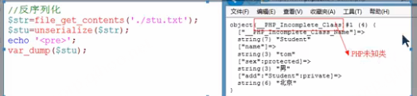

- [1.1  今日目标](#11--今日目标)
- [1.2  自动加载类](#12--自动加载类)
		- [1.2.1  类的规则](#121--类的规则)
		- [1.2.2  手动加载类](#122--手动加载类)
		- [1.2.3  自动加载类](#123--自动加载类)
		- [1.2.4  注册加载类](#124--注册加载类)
		- [1.2.5  类文件应对存储不规则的加载方法](#125--类文件应对存储不规则的加载方法)
- [1.3  clone和\_\_clone()](#13--clone和__clone)
- [1.4  设计模式](#14--设计模式)
		- [1.4.1  单例模式](#141--单例模式)
		- [1.4.2  工厂模式](#142--工厂模式)
		- [1.4.3  策略模式](#143--策略模式)
- [1.5  序列化与反序列化](#15--序列化与反序列化)
		- [1.5.1  数组的序列化与反序列化](#151--数组的序列化与反序列化)
		- [1.5.2  对象的序列化与反序列化](#152--对象的序列化与反序列化)
- [1.6  魔术方法](#16--魔术方法)
		- [1.6.1  `__tostring()、__invoke()`](#161--__tostring__invoke)
		- [1.6.2  `__set()、__get()、__isset()、__unset()`](#162--__set__get__isset__unset)
		- [1.6.3  `__call()、__callstatic()`](#163--__call__callstatic)
		- [1.6.4  `__sleep()、__wakeup()`](#164--__sleep__wakeup)
- [1.7  模拟方法重载](#17--模拟方法重载)
- [1.8  遍历对象](#18--遍历对象)
- [1.9  封装MySQL的单例](#19--封装mysql的单例)
		- [1.8.1  分析](#181--分析)
		- [1.8.2   步骤](#182---步骤)
		- [1.8.3  代码实现](#183--代码实现)


## 1.1  今日目标

1. 掌握类的自动加载原理和实际应用；
2. 了解对象的克隆意义；
3. 掌握PHP重载的意义以及具体重载的应用；
4. 了解对象的序列化和反序列化操作以及注意事项
5. 掌握foreach对对象进行遍历；
6. 掌握Mysqli的类封装以及应用；


## 1.2  自动加载类

很多框架都会有这种技术。

在项目实际开发中，因为一个文件中只能写一个类，并且在执行过程中会有很多的类参与，如果一个一个的加载很麻烦，所以，就需要一个机制实现在PHP执行过程中自动加载需要的类。 

#### 1.2.1  类的规则

1. 一个文件中只能放一个类（必须）
2. 文件名和类名同名（必须）
   1. 大小写都得同名，首字母大写
3. 类文件以.class.php结尾（不是必须）

#### 1.2.2  手动加载类

1、创建`Goods.class.php`页面

```php
<?php
//商品类
abstract class Goods {
	protected $name;
	final public function setName($name) { // 不能被重写，可以继承
		$this->name=$name;	
	}
	public abstract function getName();
}
```

2、创建Book.class.php页面

```php
<?php
//图书类
class Book extends Goods {
	public function getName() {
		echo "《{$this->name}》<br>";
	}
}
```

3、创建Phone.class.php页面

```php
<?php
//电话类
class Phone extends Goods {
	public function getName() {
		echo $this->name,'<br>';
	}
}
```

4、在PHP页面上加载类文件

```php
<?php
require './Goods.class.php';    //手动加载类文件
require './Book.class.php';		//手动加载类文件
require './Phone.class.php';	//手动加载类文件
//测试
$book=new Book();
$book->setName('面向对象编程');
$phone=new Phone();
$phone->setName('苹果6s');
$book->getName();
$phone->getName();
```

运行结果

 


#### 1.2.3  自动加载类

当缺少类的时候自动的调用`__autoload()`函数，并且将缺少的类名作为参数传递给`__autoload()`。

> __autoload()函数在PHP7.2以后就不支持了-------废弃了后面采用更先进的注册加载类的方式。

```php
<?php
/*
*作用：自动加载类
*@param $class_name string 缺少的类名
*/
function __autoload($class_name) {
	require "./{$class_name}.class.php";
}
//测试
$book=new Book();
$book->setName('面向对象编程');
$phone=new Phone();
$phone->setName('苹果6s');
$book->getName();
$phone->getName();
```

注意：__autoload()函数在PHP7.2以后就不支持了-------废弃了后面采用更先进的注册加载类的方式。


两个下划线开头的都是自动执行的。


#### 1.2.4  注册加载类

计算机内存里有个__autoload队列，通过下面可以将自定义函数注册到那个队列里。

通过spl_autoload_register()注册__autoload()函数 ，注册到队列里

```php
<?php
//方法一：
/*
//加载类函数
function loadClass($class_name) {
	require "./{$class_name}.class.php";
}
//注册加载类函数
spl_autoload_register('loadClass');
*/

//方法二：
spl_autoload_register(function($class_name){
	require "./{$class_name}.class.php";
});

//测试
$book=new Book();
$book->setName('面向对象编程');
$phone=new Phone();
$phone->setName('苹果6s');
$book->getName();
$phone->getName();
```

1、spl_autoload_register()可以注册多个自动加载函数，加到队列中

-- 为什么要注册多个？：因为是一个备选的作用，第一个加载不到，就尝试加载第二个，若第一个加载到了，就退出不加载后面的了


```php
<?php
function load1($class) {
	require "./{$class}.class.php";
}
function load2($class) {
	require "./{$class}.php";
}
function load3($class) {
	require "./{$class}.fun.php";
}
// 队列中，先进先出
spl_autoload_register('load1'); // 第一个加载不到，就尝试加载第二个
spl_autoload_register('load2');
spl_autoload_register('load3');
```

2、PHP5.1以后就开始支持此函数。


#### 1.2.5  类文件应对存储不规则的加载方法

将类名和文件地址做一个映射，组成一个关联数组。

```php
$map=array(
    //类名	=>	类文件地址
	'Goods'	=>	'./aa/Goods.class.php',
	'Book'	=>	'./bb/Book.class.php',
	'Phone'	=>	'./cc/Phone.class.php'
);
```

代码如下

```php
<?php
spl_autoload_register(function($class_name){
	//类名和文件地址映射成一个关联数组
	$map=array(
		'Goods'	=>	'./aa/Goods.class.php',
		'Book'	=>	'./bb/Book.class.php',
		'Phone'	=>	'./cc/Phone.class.php'
	);
	//在映射数组中找到就包含
	if(isset($map[$class_name]))
		require $map[$class_name];
});
//测试
$book=new Book();
$book->setName('面向对象编程');
$phone=new Phone();
$phone->setName('苹果6s');
$book->getName();
$phone->getName();
```

在项目中，绝大部分都是规则存储的，不规则的比较少。


## 1.3  clone和__clone()

思考：创建对象的方式有哪些？

```
方法一：实例化
方法二：克隆
```

例题

```php
<?php
class Student {
    //执行clone指令的时候自动执行
	public function __clone() {
		echo '正在克隆对象<br>';
	}
}
$stu1=new Student;
$stu2=clone $stu1;		//克隆对象
var_dump($stu1,$stu2);  //object(Student)#1 (0) { } object(Student)#2 (0) { } 
```

小结：

1、clone的创建对象的方法之一

2、当执行clone指令的时候，会自动的调用__clone()方法

3、将 __clone() 设为 private，可以阻止对象被克隆！`private function __clone()`


## 1.4  设计模式

#### 1.4.1  单例模式

一个类只能有一个对象

应用场景：链接数据库就应该用单例：多次请求数据库只需要一个连接对象。

实现：三私一公

```
1、私有的静态属性用来保存对象的单例
2、私有的构造方法用来阻止在类的外部实例化，但是只能可以在内部实例化
3、私有的__clone阻止在类的外部clone对象
4、公有的静态方法用来获取对象的单例
```

代码

```php
<?php
//三私一公
class DB {
	//静态的属性用来保存对象的单例
	private static $instance;
	//私有的构造方法阻止在类的外部实例化
	private function __construct() {
		
	}
	//私有的__clone()阻止在类的外部clone对象
	private function __clone() {
		
	}
	public static function getInstance() {
		//保存的值不属于DB类的类型就实例化
		// 必须用self，因为this代表的是实例对象，self代表类本身对象
		if(!self::$instance instanceof self)
			self::$instance=new self();
		return self::$instance;
	}
}
//测试
$db1=DB::getInstance();
$db2=DB::getInstance();
var_dump($db1,$db2);	//object(DB)#1 (0) { } object(DB)#1 (0) { } 
```


#### 1.4.2  工厂模式

特点：传递不同的参数获取不同的对象

```php
<?php
class ProductsA {
}
class ProductsB {	
}
//工厂模式
class ProductsFactory {
	public function create($num) {
		switch($num) {
			case 1:
				return new ProductsA;
			case 2:
				return new ProductsB;
			default:
				return null;
		}
	}
}
//测试
$factory=new ProductsFactory();
$obj1=$factory->create(1);
$obj2=$factory->create(2);
var_dump($obj1,$obj2); //object(ProductsA)#2 (0) { } object(ProductsB)#3 (0) { } 
```


#### 1.4.3  策略模式

特点：在同一个行为中传递不同的参数调用不同的策略（方法）

(不同的策略作为封装抽象的参数动态传递给相同的载体行为)

```php
<?php
class Walk {
	public function way() {
		echo '走着去<br>';
	}
}
class Bus {
	public function way() {
		echo '坐车去<br>';
	}
}
//策略模式
class Student {
	public function play($obj) {
		$obj->way();
	}
}
//测试
$stu=new Student;
$stu->play(new Walk());	//走着去
$stu->play(new Bus());	//坐车去
```


## 1.5  序列化与反序列化

在PHP中，数组和对象无法保存(如文件中保存方法file_put_contents)，如果需要保存就要将数组或对象转换成一个序列。

序列化：将数组或对象转换成一个序列（serialize）

反序列化：将序列化的字符串转换成数组或对象。(unserialize)

#### 1.5.1  数组的序列化与反序列化

```php
<?php
//数组的序列化
/*
$stu=['tom','berry','ketty'];
$str=serialize($stu);		//序列化
file_put_contents('./stu.txt',$str);
*/

//数组的反序列化
$str=file_get_contents('./stu.txt');
$stu=unserialize($str);		//反序列化
print_r($stu);	//Array ( [0] => tom [1] => berry [2] => ketty ) 
```


#### 1.5.2  对象的序列化与反序列化

注意：对象的反序列化需要有类的参与，如果没有类在反序列化时候无法确定类

 

代码

```php
<?php
class Student {
	public $name;
	protected $sex;
	private $add;
	public function __construct($name,$sex,$add) {
		$this->name=$name;
		$this->sex=$sex;
		$this->add=$add;
	}
}
/*
//测试
$stu=new Student('tom','男','北京');
//序列化
$str=serialize($stu);
file_put_contents('./stu.txt',$str);
*/

//反序列化，类的反序列化必须要有类的参与，就是得有类的定义代码存在，否则反编译时无法确定哪个类
$str=file_get_contents('./stu.txt');
$stu=unserialize($str);
echo '<pre>';
var_dump($stu);
```

把类定义代码注释：运行结果



打开类定义代码就正常反编译了。


## 1.6  魔术方法

魔术方法都是那些计算机自动执行的方法，规律都是两个下划线开头

已经学习的魔术方法

```
__construct()
__destruct()
__clone()
```


#### 1.6.1  `__tostring()、__invoke()`

`__tostring()`：将实例对象当成字符串使用的时候自动调用

`__invoke()`：将实例对象当成函数使用的时候自动调用

```php
<?php
class Student {
	//把对象当成字符串使用的时候自动执行
	public function __tostring() {// 必须用return，不能用echo
		return '这是一个对象，不是字符串<br>';
	}
	//把对象当成函数使用的时候自动执行
	public function __invoke() {
		echo '这是一个对象，不是函数<br>';
	}
}
$stu=new Student;
echo $stu;	//当成字符串使用
$stu();		//当成函数使用
```


#### 1.6.2  `__set()、__get()、__isset()、__unset()`

```php
__set($k,$v)：给无法访问的属性赋值的时候自动执行
__get($k)：获取无法访问的属性值的时候自动调用
__isset($k)：判断无法访问的属性是否存在自动调用
__unset($k)：销毁无法访问的属性的时候自动执行
	-- 正常是可以销毁类的公共属性的
```

1. 无法访问的属性就是访问无权限的属性比如访问私有属性正常就无法属性


例题

```php
<?php
class Student {
	private $name;
	private $sex;
	private $age;
	//给无法访问的属性赋值的时候自动执行
	public function __set($k,$v) {
		// 可以在这里将外部私有属性赋值不生效时，在这里直接操作实现私有属性赋值
		$this->$k=$v;
	}
	//获取无法访问的属性值的时候自动调用
	public function __get($k) {
		return $this->$k;
	}
	//判断无法访问的属性是否存在自动调用
	public function __isset($k) {
		return isset($this->$k);
	}
	//销毁无法访问的属性的时候自动执行
	public function __unset($k) {
		unset($this->$k);
	}
}
//测试
$stu=new Student;
//1、给私有属性赋值
$stu->name='tom';
$stu->sex='男';
$stu->age=22;
//2、获取私有属性的值
//echo $stu->name;
//3、判断私有属性是否存在（当无权限访问时，只会返回false）
//var_dump(isset($stu->name));
//4、销毁私有属性
unset($stu->age);
print_r($stu);
```

应用场景：设置读写属性的权限控制

```php
<?php
class Student {
	private $name;			//读写属性
	private $add='中国';	//只读属性
	private $age;			//只写属性
	
	public function __set($k,$v) {
		if(in_array($k,array('name','age')))
			$this->$k=$v;
		else
			echo "{$k}属性是只读属性<br>";
	}
	public function __get($k) {
		if(in_array($k,array('name','add')))
			return $this->$k;
		else
			echo "{$k}是只写属性<br>";
	}
}
//测试
$stu=new Student;
$stu->name='tom';
$stu->age=22;
echo '姓名：'.$stu->name,'<br>';
echo '地址：'.$stu->add,'<br>';
```


#### 1.6.3  `__call()、__callstatic()`

```php
__call()：调用无法访问的方法时自动执行   -- 普通方法
__callstatic()：调用无法访问的静态方法时自动执行  -- 静态方法 
```

例题：

```php
<?php
class Student {
	/**
	*作用：调用无法访问的方法时自动执行
	*@param $fn_name string 方法名
	*@param $fn_args array 参数数组
	*/
	public function __call($fn_name,$fn_args) {
		echo "{$fn_name}不存在<br>";
	}
	//调用无法访问的静态方法时自动执行
	public static function __callstatic($fn_name,$fn_args) {
		echo "{$fn_name}静态方法不存在<br>";	
	}
}
//测试
$stu=new Student;
$stu->show(10,20);

Student::show();
```


#### 1.6.4  `__sleep()、__wakeup()`

```php
__sleep()：当序列化的时候自动调用
__wakeup()：当反序列化的时候自动调用
```

例题

```php
<?php
class Student {
	private $name;
	private $sex;
	private $add='中国';
	public function __construct($name,$sex) {
		$this->name=$name;
		$this->sex=$sex;
	}
	/**
	*序列化的时候自动调用
	*@return array 序列化的属性名
	*/
	public function __sleep() {
		// 只序列化下面2个属性，其他的属性不序列化，不保存下来
		return array('name','sex');
	}
	//反序列化的时候自动调用
	public function __wakeup() {
		// 每次反序列化的时候都添加个type属性
		$this->type='学生';
	}
}
//测试
$stu=new Student('tom','男');
$str=serialize($stu);	//序列化
$stu=unserialize($str);	//反序列化
print_r($stu);
```


## 1.7  模拟方法重载

通过魔术方法模拟方法重载

```php
<?php
class Math {
	public function __call($fn_name,$fn_args) {
		$sum=0;
		foreach($fn_args as $v) {
			$sum+=$v;
		}
		// implode把数组用逗号链接起来
		echo implode(',',$fn_args).'的和是：'.$sum,'<br>';
	}
}
//利用魔术方法模拟方法重载
$math=new Math();
// 调用call就是没有的方法会触发到__call()方法
$math->call(10,20);
$math->call(10,20,30);
$math->call(10,20,30,40);
```


## 1.8  遍历对象

通过foreach遍历对象

```php
<?php
class Student {
	public $name='tom';
	protected $sex='男';
	private $age=22;

	public function show() {
		// 这里，能遍历出所有上面3个属性，但是show方法遍历不出来
		foreach($this as $k=>$v) {
			echo "{$k}-{$v}<br>";
		}
	}
}
//测试
$stu=new Student;
foreach($stu as $k=>$v) {
	// 只能遍历出来$name属性，其他的属性和show方法都遍历不出来
	// $stu是个变量，在堆区实例化产生的，堆区里没方法，只有属性
	echo "{$k}-{$v}<br>";
}
echo '<hr>';
$stu->show();
```

 

结论：遍历到当前位置所能访问到属性，方法内部和外部都遍历不出来


## 1.9  封装MySQL的单例

#### 1.8.1  分析

1、实现单例

2、连接数据库

3、对数据进行操作


#### 1.8.2   步骤

第一步：实现单例

第二步：初始化参数

第三步：连接数据库

第四步：操作数据

1、执行数据操作语句（增、删、改）

2、执行数据查询语句

​	a) 返回二维数组

​	b) 返回一维数组

​	c)返回一行一列


#### 1.8.3  代码实现

第一步：实现单例

```php
<?php
class MySQLDB {
	private static $instance;
	// 私有的构造方法，防止外部实例化
	private function __construct() {

	}
	// 私有的克隆方法，防止外部克隆
	private function __clone() {
		
	}
	public static function getInstance() {
		if(!self::$instance instanceof self)
			self::$instance=new self();
		return self::$instance;
	}
}
//测试
$db=MySQLDB::getInstance();
var_dump($db);
```

注意：A instanceof B，表示A是否是B的类型，返回bool值


第二步：初始化参数

```php
<?php
//封装MySQL单例
class MySQLDB {
	private $host;		//主机地址
	private $port;		//端口号
	private $user;		//用户名
	private $pwd;		//密码
	private $dbname;	//数据接名
	private $charset;	//字符集
	private $link;		//连接对象
	private static $instance;
	private function __construct($param) {
		$this->initParam($param);		
	}
	private function __clone() {
		
	}
	//获取单例
	public static function getInstance($param=array()) {
		if(!self::$instance instanceof self)
			self::$instance=new self($param);
		return self::$instance;
	}
	//初始化参数
	private function initParam($param) {
		$this->host=$param['host']??'127.0.0.1';
		$this->port=$param['port']??'3306';
		$this->user=$param['user']??'';
		$this->pwd=$param['pwd']??'';
		$this->dbname=$param['dbname']??'';
		$this->charset=$param['charset']??'utf8';
	}
}

//测试
//配置参数
$param=array(
	'user'		=>	'root',
	'pwd'		=>	'root',
	'dbname'	=>	'data'
);
//获取单例
$db=MySQLDB::getInstance($param);
var_dump($db);
```


第三步：连接数据库

```php
<?php
//封装MySQL单例
class MySQLDB {
	private $host;		//主机地址
	private $port;		//端口号
	private $user;		//用户名
	private $pwd;		//密码
	private $dbname;	//数据接名
	private $charset;	//字符集
	private $link;		//连接对象
	private static $instance;
	private function __construct($param) {
		$this->initParam($param);
		$this->initConnect();
	}
	private function __clone() {
		
	}
	//获取单例
	public static function getInstance($param=array()) {
		if(!self::$instance instanceof self)
			self::$instance=new self($param);
		return self::$instance;
	}
	//初始化参数
	private function initParam($param) {
		$this->host=$param['host']??'127.0.0.1';
		$this->port=$param['port']??'3306';
		$this->user=$param['user']??'';
		$this->pwd=$param['pwd']??'';
		$this->dbname=$param['dbname']??'';
		$this->charset=$param['charset']??'utf8';
	}
	//连接数据库
	private function initConnect() {
		$this->link=@mysqli_connect($this->host,$this->user,$this->pwd,$this->dbname);
		if(mysqli_connect_error()){
			echo '数据库连接失败<br>';
			echo '错误信息：'.mysqli_connect_error(),'<br>';
			echo '错误码：'.mysqli_connect_errno(),'<br>';
			exit;
		}
		mysqli_set_charset($this->link,$this->charset);
	}
}

//测试
//配置参数
$param=array(
	'user'		=>	'root',
	'pwd'		=>	'root',
	'dbname'	=>	'data'
);
//获取单例
$db=MySQLDB::getInstance($param);
var_dump($db);
```


第四步：数据操作的功能

1、执行增、删、改操作

```php
<?php
//封装MySQL单例
class MySQLDB {
	private $host;		//主机地址
	private $port;		//端口号
	private $user;		//用户名
	private $pwd;		//密码
	private $dbname;	//数据接名
	private $charset;	//字符集
	private $link;		//连接对象
	private static $instance;
	private function __construct($param) {
		$this->initParam($param);
		$this->initConnect();
	}
	private function __clone() {
		
	}
	//获取单例
	public static function getInstance($param=array()) {
		if(!self::$instance instanceof self)
			self::$instance=new self($param);
		return self::$instance;
	}
	//初始化参数
	private function initParam($param) {
		$this->host=$param['host']??'127.0.0.1';
		$this->port=$param['port']??'3306';
		$this->user=$param['user']??'';
		$this->pwd=$param['pwd']??'';
		$this->dbname=$param['dbname']??'';
		$this->charset=$param['charset']??'utf8';
	}
	//连接数据库
	private function initConnect() {
		$this->link=@mysqli_connect($this->host,$this->user,$this->pwd,$this->dbname);
		if(mysqli_connect_error()){
			echo '数据库连接失败<br>';
			echo '错误信息：'.mysqli_connect_error(),'<br>';
			echo '错误码：'.mysqli_connect_errno(),'<br>';
			exit;
		}
		mysqli_set_charset($this->link,$this->charset);
	}
	//执行数据库的增、删、改、查
	private function execute($sql) {
		if(!$rs=mysqli_query($this->link,$sql)){
			echo 'SQL语句执行失败<br>';
			echo '错误信息：'.mysqli_error($this->link),'<br>';
			echo '错误码：'.mysqli_errno($this->link),'<br>';
			echo '错误的SQL语句：'.$sql,'<br>';
			exit;
		}
		return $rs;
	}
	/**
	*执行增、删、改
	*@return bool 成功返回true,失败返回false
	*/
	public function exec($sql) {
		$key=substr($sql,0,6);
		if(in_array($key,array('insert','update','delete')))
			return $this->execute($sql);
		else{
			echo '非法访问<br>';
			exit;
		}

	}
	//获取自动增长的编号：表示返回当前插入后的记录数
	public function getLastInsertId() {
		return mysqli_insert_id($this->link);
	}
}

//测试
//配置参数
$param=array(
	'user'		=>	'root',
	'pwd'		=>	'root',
	'dbname'	=>	'data'
);
//获取单例
$db=MySQLDB::getInstance($param);
//更新
//$db->exec("update news set title='青草' where id=2");
//插入
if($db->exec("insert into news values (null,'aa','bb',unix_timestamp())"))
	echo '编号是：'.$db->getLastInsertId();
```

2、查询结果

```php
<?php
//封装MySQL单例
class MySQLDB {
	private $host;		//主机地址
	private $port;		//端口号
	private $user;		//用户名
	private $pwd;		//密码
	private $dbname;	//数据接名
	private $charset;	//字符集
	private $link;		//连接对象
	private static $instance;
	private function __construct($param) {
		$this->initParam($param);
		$this->initConnect();
	}
	private function __clone() {
		
	}
	//获取单例
	public static function getInstance($param=array()) {
		if(!self::$instance instanceof self)
			self::$instance=new self($param);
		return self::$instance;
	}
	//初始化参数
	private function initParam($param) {
		$this->host=$param['host']??'127.0.0.1';
		$this->port=$param['port']??'3306';
		$this->user=$param['user']??'';
		$this->pwd=$param['pwd']??'';
		$this->dbname=$param['dbname']??'';
		$this->charset=$param['charset']??'utf8';
	}
	//连接数据库
	private function initConnect() {
		$this->link=@mysqli_connect($this->host,$this->user,$this->pwd,$this->dbname);
		if(mysqli_connect_error()){
			echo '数据库连接失败<br>';
			echo '错误信息：'.mysqli_connect_error(),'<br>';
			echo '错误码：'.mysqli_connect_errno(),'<br>';
			exit;
		}
		mysqli_set_charset($this->link,$this->charset);
	}
	//执行数据库的增、删、改、查
	private function execute($sql) {
		if(!$rs=mysqli_query($this->link,$sql)){
			echo 'SQL语句执行失败<br>';
			echo '错误信息：'.mysqli_error($this->link),'<br>';
			echo '错误码：'.mysqli_errno($this->link),'<br>';
			echo '错误的SQL语句：'.$sql,'<br>';
			exit;
		}
		return $rs;
	}
	/**
	*执行增、删、改
	*@return bool 成功返回true,失败返回false
	*/
	public function exec($sql) {
		$key=substr($sql,0,6);
		if(in_array($key,array('insert','update','delete')))
			return $this->execute($sql);
		else{
			echo '非法访问<br>';
			exit;
		}

	}
	//获取自动增长的编号
	public function getLastInsertId() {
		return mysqli_insert_id($this->link);
	}

	//执行查询语句
	private function query($sql) {
		if(substr($sql,0,6)=='select' || substr($sql,0,4)=='show' || substr($sql,0,4)=='desc'){
			return $this->execute($sql);
		}else{
			echo '非法访问<br>';
			exit;
		}
	}
	/**
	*执行查询语句，返回二维数组
	*@$sql string 查询sql语句
	*@type string assoc|num|both
	*/
	public function fetchAll($sql,$type='assoc') {
		$rs=$this->query($sql);
		$type=$this->getType($type);
		return mysqli_fetch_all($rs,$type);
	}
	//匹配一维数组
	public function fetchRow($sql,$type='assoc') {
		$list=$this->fetchAll($sql,$type);
		if(!empty($list))
			return $list[0];
		return array();
	}
	//匹配一行一列
	public function fetchColumn($sql) {
		$list=$this->fetchRow($sql,'num');
		if(!empty($list))
			return $list[0];
		return null;
	}

	//获取匹配类型
	private function getType($type) {
		switch($type){
			case 'num':
				return  MYSQLI_NUM;
			case 'both':
				return  MYSQLI_BOTH;
			default:
				return  MYSQLI_ASSOC;
		}
	}
}

//测试
//配置参数
$param=array(
	'user'		=>	'root',
	'pwd'		=>	'root',
	'dbname'	=>	'data'
);
//获取单例
$db=MySQLDB::getInstance($param);
//更新
//$db->exec("update news set title='青草' where id=2");
//插入
/*
if($db->exec("insert into news values (null,'aa','bb',unix_timestamp())"))
	echo '编号是：'.$db->getLastInsertId();
*/

//查询
//$list=$db->fetchAll('select * from news','aa');
//$list=$db->fetchRow('select * from news where id=1','aa');

$list=$db->fetchColumn('select count(*) from news');

echo '<pre>';
var_dump($list);

```


小结：

1、instanceof 用来判断对象是否属于某个类

2、参数必须从外部传递到内部，不能写死到类的内部。

3、为了保证代码的可重用性，一个方法只实现一个功能，所以初始化参数和连接数据库分到两个方法中。

