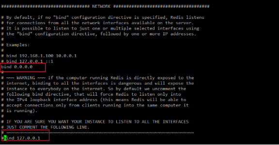
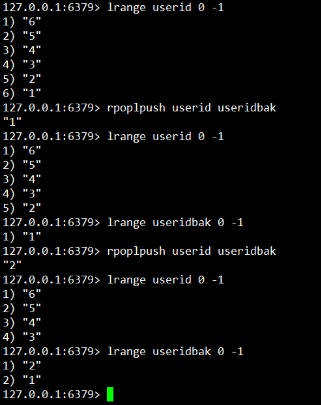
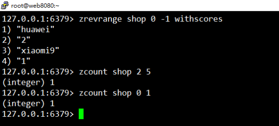
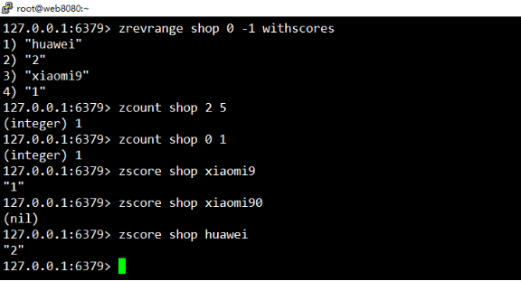

# **Redis_01**

- [**Redis\_01**](#redis_01)
- [**今日目标5**](#今日目标5)
- [**一、Redis概述**](#一redis概述)
  - [**1.1、简介**](#11简介)
  - [**1.2、Redis优势**](#12redis优势)
  - [**1.3、Redis应用场景及对比mysql**](#13redis应用场景及对比mysql)
  - [**1.4、Redis结构**](#14redis结构)
- [**二、下载与安装**](#二下载与安装)
  - [**2.1、windows安装**](#21windows安装)
    - [2.1.1、下载软件](#211下载软件)
    - [2.1.2、启动](#212启动)
    - [2.1.3、客户端连接](#213客户端连接)
  - [**2.2、Linux安装与启动**](#22linux安装与启动)
    - [2.2.1、下载](#221下载)
    - [2.2.2、安装](#222安装)
    - [2.2.3、启动与关闭](#223启动与关闭)
    - [2.2.4、客户端连接](#224客户端连接)
  - [**2.3、图形客户端工具**](#23图形客户端工具)
- [**三、数据结构类型操作**](#三数据结构类型操作)
  - [**3.1、Redis对key的操作命令【redis服务器相关】**](#31redis对key的操作命令redis服务器相关)
  - [**3.2、字符串(string)操作命令**](#32字符串string操作命令)
  - [**3.3、列表(list)操作命令**](#33列表list操作命令)
  - [**3.4、哈希(hash)操作命令**](#34哈希hash操作命令)
  - [**3.5、集合(set)操作命令**](#35集合set操作命令)
  - [**3.6、有序集合(zset)操作命令**](#36有序集合zset操作命令)


# **今日目标5**
- 能够知道redis的5种数据结构

string list hash set zset

- 能够运用set、get、del、keys命令
- 能够运用hset、hget、hmset、hmget、hgetall、hdel命令
- 能够运用lpush、lpop、rpush、rpop命令
- 能够运用sadd、zadd命令


# **一、Redis概述**
## **1.1、简介**
Redis是Remote Dictionary Server(远程词典服务)的缩写，Redis 是完全开源免费的，遵守BSD协议的NOSQL数据库，Redis使用C语言编写,它的数据模型为 key-value。

Redis是一个单进程单线程，非阻塞I/O（nodejs也是）

Redis 与其他 key - value 缓存产品有以下三个特点：

- Redis支持数据的持久化，可以将内存中的数据保存在磁盘中，重启的时候可以再次加载进行使用。
- Redis不仅支持简单的key-value(string)类型的数据，同时还提供list[列表]，set[集合]，zset[有序集合]，hash[hash]等数据结构的存储。
- Redis支持服务器主从模式[集群-高可用]。

**redis和memcache区别**：用redis比memcache更高级

- redis支持数据的持久化，而memcache不支持
- redis不但有string类型的key-value还有更多的数据结构存储，而memcache则只有string类型的key和value
- memcache的集群很弱，而redis支持主从集群的
- 端口不同 memcache 11211 redis 6379
## **1.2、Redis优势**
- 性能极高 – Redis能读的速度是110000次/s,写的速度是81000次/s 。
  - 首先redis是存储在内存中的，我的IO速度就不是瓶颈，独写速度非常快
  - 因为是单进程单线程，所以不存在线程切换的cpu消耗，它的瓶颈只会在内存中

- 丰富的数据类型 – Redis支持String, List, Hash, Set 及 Zset 数据类型操作。
- 原子性 – Redis的所有操作都是原子性的，意思就是要么成功执行要么失败完全不执行。多个操作也支持事务，通过MULTI和EXEC指令包起来。
- api支持的语言丰富，调用简单(面向对象)。

## **1.3、Redis应用场景及对比mysql**

1. redis与mysql区别及应用场景：https://blog.csdn.net/wzxue1984/article/details/132340038
   1. https://juejin.cn/post/7237663395058679864#heading-2


## **1.4、Redis结构**

1. Redis 是一款基于内存的键值（Key-Value）数据库，与传统关系型数据库（如 MySQL）的 “数据库 - 表 - 行 - 列” 结构截然不同。Redis 没有 “表” 的概念只有数据库来划分不同空间的概念，而是通过数据结构类型来组织数据，其核心结构可以理解为 “多个独立的键空间（数据库），每个键空间中存储着不同数据结构类型的键值对
   1. Mysql中：数据库 - 表 - 行 - 列” 结构
   2. Redis中：数据库 - 键值对（只能用键的命名规范来模拟对标不同的表行列结构）

2. Redis 默认包含 16 个数据库（编号 0~15），可以通过配置文件 redis.conf 中的 databases N 调整数量（默认 16）
3. Redis 没有 “表” 的概念，而是通过 5 种基础数据结构 来存储不同类型的数据，每种结构对应不同的业务场景

# **二、下载与安装**
## **2.1、windows安装**
### 2\.1.1、下载软件
下载地址：<https://github.com/MSOpenTech/redis/releases>


### 2\.1.2、启动
注意cmd所在的路径一定要redis-server.exe所在的目录>redis-server.exe redis.windows.conf

\# 注：此cmd窗口不能关闭

\# redis服务的端口号为  **6379**

注：windows下启动后，不要关闭cmd窗口，一但关闭则服务停止

 

修改端口号在redis.windows.conf文件中去修改


### 2\.1.3、客户端连接
F:\applib\wamp\Redis-x64-3.2.100>redis-cli.exe -h 127.0.0.1 -p 6379

注：如果是本机且使用默认端口号，则可以不写主机和端口参数

-h 连接服务器主机

-p 连接的端口号，默认为6379


## **2.2、Linux安装与启动**
### 2\.2.1、下载
官方网址：<https://redis.io/>


wget http://download.redis.io/releases/redis-5.0.5.tar.gz


### 2\.2.2、安装
\# 下载

wget http://download.redis.io/releases/redis-5.0.5.tar.gz

\# 解压

tar xzf redis-5.0.3.tar.gz

\# 进入解压后目录

cd redis-5.0.3

\# 编译

make 

\# 安装

make PREFIX=/usr/local/redis install

复制一个redis.conf配置文件到安装好的目录中

\# 注： PREFIX 指定安装后软件所在的位置，注意必须是大写

下载完毕后，解压redis安装源码


进入到解压后的redis安装源码目录中


编写和安装


检查redis是否安装成功，只需要看，指定的安装目录是否存在bin目录就可以


复制配置文件到安装目录对应的目录中

安装源包中的redis.conf文件，复制到安装目录中新建的etc目录中。


### 2\.2.3、启动与关闭
\# 启动

/usr/local/redis/bin/redis-server /usr/local/redis/etc/redis.conf

\# 关闭

pkill redis

使用redis-server命令和指定配置文件来启动，默认启动是占用前端命令行输入.


- 以后台运行的方式来启动redis

修改redis.conf文件 daemonize选项，改为 yes,以后台守护进程来启动。


修改完毕后，保存退出，重新启动redis此时服务就是后台运行了。


检查服务是否正常启动,一般查看端口号和进程是否存在


关闭redis服务

pkill redis 杀死进程


### 2\.2.4、客户端连接
命令行工具连接

/usr/local/redis/bin/redis-cli -h xxx -p xxx


## **2.3、图形客户端工具**

1、平时工作中常使用的redis图形工具，进行远程链接云服务器


图形工具连接阿里云远程服务器，出现连接失败


- 远程服务器防火墙拦截
- 启动服务是指定连接的IP

如果使用云服务器不能远程连接到redis服务器，则需要修改一下云安全组规则


   
   --- 云服务器安全组规则中即是防火墙添加端口号和任意ip的白名单，添加redis服务的端口号


查看服务器端，服务绑定的网卡地址：


同时在redis.conf配置文件中修改，允许所有的网卡都能访问

    --- 因为redis默认是绑定localhost127.0.0.1，所以只能本地访问，不能远程访问 ，需要给他改成 bind 0.0.0.0 即可





到此就可以远程连接到redis服务器了。


# **三、数据结构类型操作**
redis提供5种  string 字符串   list 列表  set 集合  zset 有序集合  hash

Redis 没有 “表” 的概念，而是通过 5 种基础数据结构 来存储不同类型的数据，每种结构对应不同的业务场景：
```js
数据结构	含义（类比关系型数据库）	核心命令示例	典型场景
1-String	字符串 / 数字（可视为 “单值字段”）	SET key value、GET key	缓存、计数器、分布式锁

2-Hash	哈希表（可视为 “一行记录”，包含多个字段 - 值对）	HSET key field value、HGETALL key	存储对象（如用户信息、文章摘要）

3-List	有序列表（可视为 “有序数组”，允许重复元素）	LPUSH key value、LRANGE key 0 -1	消息队列、最新列表

4-Set	无序集合（可视为 “去重的无序数组”）	SADD key member、SMEMBERS key	标签、好友关系、去重

5-ZSet	有序集合（可视为 “带分数的去重数组”，按分数排序）	ZADD key score member、ZRANGE key 0 -1	排行榜、优先级队列
```
## **3.1、Redis对key的操作命令【redis服务器相关】**
\# 查找所有符合给定模式的key

keys 查询相应的key或通配符(\*)

图片工具添加2个key


keys查看


\# 用于检查给定 key 是否存在 返回0/1 0不存在，1存在

exists key


\# 查看当前数据库中设置key的数量

dbsize


\# 清除当前数据库中的数据

flushdb


\# 切换数据库

select N


\# 清除所有数据库中的数据

flushall


注：flushdb 还是flushall 两个尽量不要用，知道就行，在开发时，可以用一用，上线一定不要用。
## **3.2、字符串(string)操作命令**
\# 用于设置给定 key 的值。如果 key 已经存储其他值， SET 就覆写旧值，且无视类型

set key value [ex 秒数]/[px 毫秒数]  [nx]/[xx]

\# 注后两个参数一般不写

ex/px 缓存有效期   ex

nx: 表示key不存在时,执行操作

xx: 表示key存在时,执行操作  默认


设置带过期时间的key


查看value类型


存在则添加失败，不存在则添加成功 nx


存在则修改，不存在则添加 xx


设置key有效期


\# 用于获取指定 key 的值。如果 key 不存在或过期，返回 nil 。如果key 储存的值不是字符串类型，返回一个错误

get key


\# 一次性设置多个键值

mset key1 value1 key2 value2 …


\# 获取多个key的值

mget key1 key2 key3 …


\# 自增与自减  直接用，key自动创建，不需要先前面那样set去设置创建key和value值，直接incr就可以

incr key   # 自增  每次自增1

decr key   # 自减  每次自减1

incrby key step # 指定步长的自增 可为负数（memchahe不支持负数）

decrby key step # 指定步长的自减


    ---- 这个自增自减用在在线客服，流量统计比较适用场景

\# 把value追加到key的原值上

append key value


\# 设置新值同步返回旧值

getset key newValue


## **3.3、列表(list)操作命令**
类似于PHP中的索引数组，列表中的值是可以重复的。可以用列表来实现简单的队列。

可以实现先进后出，还可以实现先进先出

\# 把值插入到列表的头部(左边)

lpush key value


\# 从列表右边(尾部)删除元素，并返回删除的元素值

rpop key


注：使用lpush 和 rpop 实现了 先进先出。

\# 获取列表的长度

llen key

\# 返回指定区间内的元素，下标从0开始

lrange key startIndex endIndex

注： 默认从左开始向右获取指定索引的值，从右开始负数开始，-1就是右边第1个元素。

从左边开始


从右边开始


\# 从尾部添加

rpush key value

\# 从头部删除元素并返回删除元素值

lpop key


\# 移除列表的最后一个元素，并将该元素添加到另一个列表并返回

rpoplpush mylist otherlist


## **3.4、哈希(hash)操作命令**
类似于PHP的关联数组。一般用于存储数据表中一条记录值，一个hash的keyvalue对应一条表中的记录。


1. redis的hash数据类型用于对标存储数据表所有记录的话建议遵循的规范：关于hash的key的起名称：一般和数据表关联
   1. key起名规范：`表名:主键字段名:id值  user:id:1  hash的key值`
   2. 3种类型：字符串，list，hash 综合起来能实现从redis中存储mysql中的数据表结构
      1. 字符串：用来作自增长。用来作id值
      2. list，让所有的用户信息记录，存在一个容器中即表中
      3. hash，让一条记录含的所有的字段和值，以hash的数据类型存储redis中

\# 把key中 field字段的值设置为 value，如果没有field字段,直接添加,如果有,则覆盖原field字段的值

hset key field value

\# 一次性设置多个

hmset key field1 value1 field2 value2 …

\# 获取key中指定field字段的值

hget key field

\# 一次性获取之个key中field字段的值

hmget key field1 field2 …

\# 返回key中所有字段的值

hgetall key

把数据库中用户表中id为1的用户信息存到redis中

给hash中的key值单个设置值和单个key中的字段来获取。


批量获取和添加


\# 删除key中指定的field字段

hdel key field


\# 返回key中元素的数量

hlen key


\# 判断key中有没有field字段

hexists key field


\# 把key中field字段的值自增长

hincrby key field step  步长可以为负数


\# 返回所有key对应的field字段

hkeys key

\# 返回所有key对应field字段对应的值

hvals key


## **3.5、集合(set)操作命令**
redis的set是无序集合。集合里不允许有重复的元素。

set元素最大可以包含(2的32次方-1)个元素。

场景：存放用户Id，不重复的信息   抽奖，好友关系

\# 向集合key中添加元素

sadd key value1 value2

\# 返回key集合中所有的元素

smembers key


\# 返回key集合中元素的个数

scard key


\# 删除key集合中为value1的元素

srem key value1

\# 随机删除key集合中的1个元素并返回

spop key


\# 判断value是否存在于key集合中

sismember key value


\# 把源集合中的value删除，并添加到目标集合中  【移动】

smvoe sSet dSet value


\# 求出key1,key2两个集合的交集,并返回

sinter key1 key2

\# 求出key1,key2两个集合的并集,并去重，并返回

sunion key1 key2

\# 求出key1与key2的差集  

sdiff key1 key2 以key1集合为主，求出key1中和key2不同的元素并返回


## **3.6、有序集合(zset)操作命令**
和set一样有序集合，元素不允许重复，不同的是每个元素都会关联一个分值。

可以通过它的分值来进行排序。如实现手机APP市场的软件排名等需求的实现。

\# 给key有序集合中添加元素

zadd key score(分值) value


\# 删除key有序集合中指定的元素

zrem key value1


\# 返回有序集中，指定区间位置内的成员 

zrange key startIndex endIndex [withscores]  # 从小到大排列

zrevrange key startIndex endIndex [withscores]  # 从大到小排列


\# 按照分值来删除元素，删除score在 min<=score<=max之间的

zremrangebyscore key min max


\# 返回集合元素个数

zcard key


\# 返回min <= score <= max分值区间内元素的数量

zcount key minScore maxScore



\# 返回有序集中，成员的分数值

zscore key value



\# 对有序集合中指定成员的分数加上增量 把value的分数+score值

zincrby key increment member

key：有序集合的键名

increment：要增加的分数（可以是正数或负数，负数表示减少）

member：要操作的成员

```js
// 返回结果：150（user1 的分数从 100 变为 150）
ZADD ranking 100 "user1"
ZINCRBY ranking 50 "user1"
```

