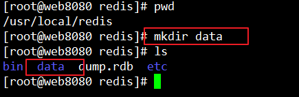
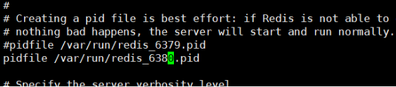
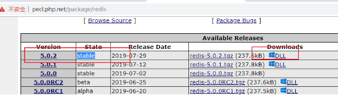
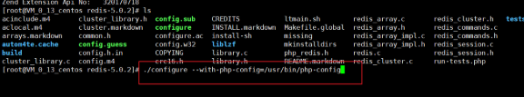

# **Redis\_02**

- [**Redis\_02**](#redis_02)
- [**今日目标4**](#今日目标4)
- [**一、发布与订阅**](#一发布与订阅)
- [**二、数据持久化操作**](#二数据持久化操作)
  - [**2.1、rdb快照**](#21rdb快照)
  - [**2.2、aof日志持久化**](#22aof日志持久化)
- [**三、Redis中的事务**](#三redis中的事务)
- [**四、Redis密码安全**](#四redis密码安全)
  - [**4.1、ip限制**](#41ip限制)
  - [**4.2、密码**](#42密码)
- [**五、Redis主从设置**](#五redis主从设置)
  - [**5.1、主服务器配置**](#51主服务器配置)
  - [**5.2、从服务器**](#52从服务器)
  - [**5.3、测试主从是否完成**](#53测试主从是否完成)
- [**六、PHP操作Redis**](#六php操作redis)
  - [**6.1、windows下安装扩展**](#61windows下安装扩展)
  - [**6.2、linux下安装redis对应php扩展**](#62linux下安装redis对应php扩展)
  - [**6.3、php操作redis**](#63php操作redis)
- [**七、文章管理**](#七文章管理)
  - [**7.1、项目需求**](#71项目需求)
  - [**7.2、用户登录与邮件发送**](#72用户登录与邮件发送)
  - [**7.3、设计文章key**](#73设计文章key)
  - [**7.4、文章列表**](#74文章列表)
    - [数据库搬到redis最难的地方](#数据库搬到redis最难的地方)
  - [**7.5、消费队列发邮件**](#75消费队列发邮件)


# **今日目标4**
- 能够了解快照(rdb)持久化与aof持久化生成文件的扩展区别
- 能够给redis设置验证密码
- 能够安装好php的redis扩展
- 能够使用php连接成功redis服务


# **一、发布与订阅**
Redis发布订阅(publish/subscribe)是一种消息通信模式，发送者(publish)发送消息，订阅者(subscribe)订阅后接受频道消息。------ 适用于聊天室，站内信，消息队列等场景。


需要用至少2个终端，一个来发布频道，一个订阅频道

订阅频道

subscribe 频道1[,频道2…]

支持通配符

psubscribe 名称\*

发布频道

publish 频道  发送消息


# **二、数据持久化操作**
数据持久化就是在服务重启或服务器重启后数据不丢失。实现持久化，就需要把数据存储到磁盘中。（memecache不管服务重启还是服务器重启都会丢失）

- 应用：持久化存储，以便下次重启后数据可以在上个恢复点进行回复，而不是从0开始

Redis的持久化有2种方式 :   

- 快照(rdb)默认就开启：效率更高，实时性较差因为是在某个时间点进行备份。
  - 重新启动Redis服务器。启动时，Redis会自动检测到配置目录下的RDB文件，并从中加载数据。如果一切正常，Redis将会从RDB文件中恢复数据并开始提供服务(在两次快照之间突然重启会丢失数据)

- aof日志方式(需要手动开启)：实时性更好，因为是把用户操作的命令全部实时记录下来。记录全部命令会对性能有一定的损耗，所以默认redis就没有开启，有条件化建议开启。
  - 它记录每个写操作的日志，并在重启时重新执行这些命令以恢复数据。AOF提供了比RDB更高的数据安全性，因为它是增量更新的，可以更频繁地同步到磁盘。你可以设置不同的fsync策略来平衡性能与数据安全之间的关系


两种的持久化的机制不相同，rdb在某一个时间点把内存中的数据整体保存下来。aof是把用户操作的命令全部记录下来。记录全部命令会对性能有一定的损耗，所以默认redis就没有开启，有条件化建议开启。

----  在工作中，一般都开启rdb和aof两种方式，采用平衡策略，取长补短，（重启时redis恢复数据时，两个都存在时，优先读rdb，读完rdb后，再去读aof查缺补漏）

## **2.1、rdb快照**
相关配置选项 vi /usr/local/redis/redis.conf

```js
// 配置文件相关参数

\#    秒    命令次数

save 900 1        # 900秒即15分种内,有1条写入,则产生快照 

save 300 10       # 300秒即5分钟内有10次写入,则产生快照

save 60 10000     # 60秒内有10000次写入,则产生快照

dbfilename dump.rdb  //导出来的rdb的默认文件名

dir ./  // 持久化文件存放路径
```

创建一个数据快照存储目录



关闭redis服务，再删除原来的dump.rdb


更改快照生成文件所在的目录路径


保存配置文件后，重启redis服务。

使用redis提供的压测命令来生成10001个key


文件查看不了是二进制文件，不易阅读。


## **2.2、aof日志持久化**
相关配置  vi /usr/local/redis/redis.conf
```js
appendonly no # 是否打开 aof日志功能 no不打开 yes打开


#appendfsync always   # 每1个命令,都立即同步到aof. 安全,速度慢

appendfsync everysec  # 推荐方案,每秒写1次

#appendfsync no        # 写入工作交给操作系统,数据同步性没有保证,同步频率低,速度快
```


进入到redis命令客户端中，执行几次set操作，就可以在指定的日志目录中查看到对应的日志文件

------ 日志文件路径与rdb路径公用一个目录


# **三、Redis中的事务**
Redis支持简单的事务，事务就是：当同一个操作需要多条命令执行，一条执行有误，其它操作将回滚到之前的状态。

例如：银行转账工作，从一个账号扣款并在另一个账户增款，要么都执行，要么都不执行。

执行的步骤：

开始事务

命令入队

执行事务

```js
// Redis事务命令实现

watch key1 key2  # 监听key的变化

multi  事务开始

    普通命令(string list hash set zset中的命令)

exec  # 执行 / discard   # 取消   exec和discard两个只能执行一个

unwatch  # 解除监听

回滚命令 discard
```


1. 手动回滚：上面的给zhnagsan 50，错写成了500，所以下面执行回滚命令，把zhnagsan的500回滚到50


2. 命令没写错只是类型错误也不会自动回滚：如果执行的命令没有错，只是业务有问题则不会自动回滚，会执行可以操作的队列中的命令   ---- 这点事务支持语法没那么严谨了，比较简单的事务功能
   1. 下图的给hello的字符串类型，自增100肯定报类型错误，没有回滚，仅成功了第一个set命令


3. 如果命令有错，则会自动回滚


事务执行操作


4. 多用户同时操作时：key的监听 watch 监听key是否有改变，如果有改变，则执行的事务将会不会成功执行。只有监听的在事务没有执行成功前没有改变，事务才能完成执行。
   1. ------**重要：在执行事务前，必须把相关的key给监听冻结，防止多端同步操作时数据异常，银行卡金额盗刷等**
   2. 监听的key在事务执行前没有改变，事务才能执行成功有变化就禁止执行。
   3. 执行exec或discard命令后，会自动解除监听 


# **四、Redis密码安全**
## **4.1、ip限制**
vi /usr/local/redis/etc/redis.conf文件来通过配置文件限制ip访问,多个ip用空格隔开------ 工作中不要0.0.0.0这样太危险


## **4.2、密码**


重启redis服务

登录测试验证密码是否生效


使用auth来进行登录操作


# **五、Redis主从设置**

> 实现读写分离

当数据量变得庞大的时候，读写分离还是很有必要的。redis提供了主从复制的机制，从服务器可以复制主服务器的数据信息，就可以实现读写分离，从而降低单台服务器的压力。


1. 我们要实现一主一从，主服务器写，从服务器读，我们作实验demo的话，没有多台服务器，我们就用多个端口来模拟
   1. 一主多从，万一主服务器挂了，其他从服务器也就没什么用了，这是缺点，后面的多主多从架构解决了这个问题
      1. 服务的稳定性，会不会经常挂，就是运维的工作职责了----
   2. 当然后面也有多主多从使用去中心化架构，但是我们这里就不展开了

2. 主服务器用6379端口，从服务器用6380端口
   1. Redis可以在同一台机器上启动多个端口的服务。每个端口实际上对应一个独立的Redis实例，通过不同的配置文件来启动。
   2. 每个Redis实例都有自己的数据库，端口号不同，但是数据库的数量是相同的。

## **5.1、主服务器配置**
开启rdb和aof日志记录,还有密码认证登录
## **5.2、从服务器**
因为是使用从端口，所以复制一个redis.conf文件


修改redis6380.conf文件中的相关记录配置

修改端口号


修改一下pid文件



修改rdb文件名称


设置从服务器中连接主服务器的IP和端口号：设置主从的配置字段


设置主服务器连接时的口令


关闭aof日志记录


启动从服务


## **5.3、测试主从是否完成**

# **六、PHP操作Redis**
## **6.1、windows下安装扩展**
下载地址：<https://pecl.php.net/package/redis>

通过phpinfo函数查看当前php所支持的对应的版本


下载最新的windows支持的扩展文件



点击dll进入，下载对应phpinfo所显示支持的链接下载


下载好后解压，复制dll文件到php安装目录中的ext目录下


修改php.ini文件，添加对应的扩展名称包括后缀名。


重启web服务器或php-fpm,通过phpinfo再次查看是否有redis字符串。


## **6.2、linux下安装redis对应php扩展**
yum安装php所支持的扩展


yum install -y php72w-pecl-redis.x86\_64

使用源码来安装，在php官网在下载对就的redis扩展源码

<http://pecl.php.net/package/redis>

wget http://pecl.php.net/get/redis-5.0.2.tgz


解压下载好的redis扩展源码包

tar zxf redis-5.0.2.tgz


生成configure文件


查找到对应PHP版本devel


yum install -y php72w-devel.x86\_64


再次执行phpize


配置php扩展安装

./configure --with-php-config=/usr/bin/php-config

make && make install



检查配置没有报错，执行编译安装


检查so文件中是否有redis的扩展文件


因为使用yum安装的php7.2版本，所以它推荐使用分文件来进行配置扩展。

复制一个名为redis.ini文件

cp /etc/php.d/zip.ini /etc/php.d/redis.ini


重启web服务器或php-fpm让扩展生效


## **6.3、php操作redis**
在线手册：<https://github.com/phpredis/phpredis/#readme>


# **七、文章管理**
## **7.1、项目需求**
后台：

`	`用户登录，登录成功后要有发送邮件功能(异常发送)

文章管理

`	`文章列表、	添加文章、	修改文章、	删除文章

前台

`	`热门文章推荐

数据保存的数据库为  redis
## **7.2、用户登录与邮件发送**
用户表key设计

`	`账号、密码

`	`用hash类型  user:username:admin  字段 id:1 username:admin password:admin888 （admin是可以用用户名作为key）


添加一条用户记录


登录和与任务到队列中


登录接受消息处理


发送邮件任务写入到list列表数据类型中


## **7.3、设计文章key**
需求：文章的列表，增删改查的一个页面

作nosql和业务需求之前，先想好都包含哪些数据类型和key的对应设计

1. 首先文章有列表，所以列表肯定得有列表类的数据类型，列表中具体存文章id值
   1. 文章id的生成用单独的string类型来存储，自增增长，列表中只是关联

   2. 可选的有list，set，zset 3种，list能重复，set不能重复，列表还有排序，筛选功能，最终zset数据类型更适合
   3. zset中存的是文章id，文章具体信息会存到hash中，分值对应列表中排序功能
   4. 实际生产环境中根据分值和排序字段的不同，可能不止有1个zset，可能会有多个zset，即每个zset代表1个排序类型-----> 分值可能变，但是值都是不变的文章id
      1. 如文章列表中zset的value存的都是文章id，但分值的不同，可能是创建时间，也可能是点击量，也可能是评论量衍生出1个列表多个zset
         1. 文章的标题也可以作排序字段的分值，可以先md5下变成唯一的字符串，再进行crc32处理，得到一个32位的数字，作为zset的分值


2. 然后列表中存的文章id（每1个文章就是记录），所以会用到hash
   1. hash的key是变化的文章id，字段是文章的具体信息

3. 每个文章得有id号，所以会用到string自增，这个是单独作为一个自增的key来存储，无法良好的达到mysql自增键那种效果
   1. 创建文章时，用string的自增方法自增作为新的文章id
      1. 然后同步插入到zset中，最后插入到hash中


```js
// 上面数据类型分析结果，最终决定以下3种类型：

列表 ->  zset

记录 -> hash

id   -> string


// 上面是用到的3个数据类型 会在redis中存对应3个key

 --------   要存的key名          --------val值-------          
（文章id号）`article:id`                                   string key

（hash记录） `article:id:${id}`  字段  `如article:id:2`  字段   hash key

（列表zset）以ID来排序 `article:zset:id` 1=>1 2=>2     zset key

// 用命名约定的方式表明：article:作为前缀，表明对标mysql中的article表

```
## **7.4、文章列表**

下面以创建文章模块为例：


文章删除的时候：
1. 先删除zset列表中的文章id
2. 再删除hash记录中的文章记录
3. 自增长id不用删除，就一直累加


### 数据库搬到redis最难的地方

最难地方就是key的设计，一定要先设计好key类型，再开发


## **7.5、消费队列发邮件**
安装发送邮件类库，phpmailer

composer require phpmailer/phpmailer


