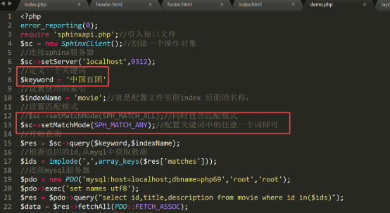
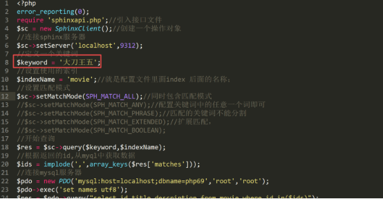

网站优化第四天

- [**一、sphinx简介**](#一sphinx简介)
  - [**1、为什么要用sphinx**](#1为什么要用sphinx)
  - [**2、sphinx介绍？**](#2sphinx介绍)
    - [选型方案](#选型方案)
  - [**3、使用原理**](#3使用原理)
- [**二、安装shpinx软件**](#二安装shpinx软件)
  - [**1、下载软件，进行解压**](#1下载软件进行解压)
  - [**2、把解压后的软件拷贝到指定位置，（便于管理要和其他的环境软件在同级目录里面）**](#2把解压后的软件拷贝到指定位置便于管理要和其他的环境软件在同级目录里面)
- [**三、具体的配置使用**](#三具体的配置使用)
  - [**1、修改sphinx配置文件，创建数据源与索引位置**](#1修改sphinx配置文件创建数据源与索引位置)
    - [**（1）配置数据源：**](#1配置数据源)
    - [**（2）配置数据源生成的索引文件存放的位置。**](#2配置数据源生成的索引文件存放的位置)
    - [**（3）配置sphinx服务器的一些配置**](#3配置sphinx服务器的一些配置)
  - [**2、对查询的数据创建索引**](#2对查询的数据创建索引)
    - [建立索引逻辑](#建立索引逻辑)
      - [什么是倒排，为什么要倒排？](#什么是倒排为什么要倒排)
  - [**3、启动sphinx的服务器，开始查询**](#3启动sphinx的服务器开始查询)
  - [**4、sphinx的查询应用**](#4sphinx的查询应用)
  - [**5、对查询到关键词进行标注显示，**](#5对查询到关键词进行标注显示)
- [**四、sphinx的匹配模式**](#四sphinx的匹配模式)
  - [**1、SPH\_MATCH\_ALL 完全匹配所有的词：【默认模式】**](#1sph_match_all-完全匹配所有的词默认模式)
  - [**2、SPH\_MATCH\_ANY: 匹配任意一个词**](#2sph_match_any-匹配任意一个词)
  - [**3、SPH\_MATCH\_PHRASE: 必须匹配整个短语，不能分割。**](#3sph_match_phrase-必须匹配整个短语不能分割)
  - [**4、SPH\_MATCH\_EXTENDED: 支持一些扩展的语法**](#4sph_match_extended-支持一些扩展的语法)
  - [**5、SPH\_MATCH\_BOOLEAN 与，或，非，分组 \&,or,!,()**](#5sph_match_boolean-与或非分组-or)
- [**五、增量索引**](#五增量索引)
- [**六、网页静态化介绍**](#六网页静态化介绍)
  - [**1、概述：**](#1概述)
  - [**2、几个重要的概念**](#2几个重要的概念)
  - [**3、真静态实现方式**](#3真静态实现方式)
  - [**4、OB基本介绍**](#4ob基本介绍)
    - [**（1）程序缓存（默认开启不能关闭）**](#1程序缓存默认开启不能关闭)
    - [**（2）ob缓存（7版本以上php默认开启，可以关闭）**](#2ob缓存7版本以上php默认开启可以关闭)
  - [**5、ob 缓存对应的函数。**](#5ob-缓存对应的函数)
  - [Ob缓存的作用及生效与失效问题](#ob缓存的作用及生效与失效问题)
    - [缓冲范围](#缓冲范围)
    - [作用](#作用)
    - [生命周期](#生命周期)
  - [**6、真静态典型案例。**](#6真静态典型案例)
  - [**7、真静态典型案例扩展**](#7真静态典型案例扩展)
  - [**8、真静态优缺点说明：**](#8真静态优缺点说明)
- [**七、伪静态**](#七伪静态)
  - [**1、实现方式**](#1实现方式)
  - [**2、如何开启**](#2如何开启)
  - [**3、具体配置：**](#3具体配置)
    - [**（1）RewriteEngine  on**](#1rewriteengine--on)
    - [**（2）RewriteCond  重写条件，**](#2rewritecond--重写条件)
    - [**（3）RewriteRule :定义重写规则**](#3rewriterule-定义重写规则)
      - [apache的分布式文件配置](#apache的分布式文件配置)
  - [**4、入门案例**](#4入门案例)
  - [**5、新闻案例，配置成伪静态**](#5新闻案例配置成伪静态)
  - [**6、使用rewrite机制完成防盗链。**](#6使用rewrite机制完成防盗链)
    - [**（1）什么是盗链，**](#1什么是盗链)
    - [**（2）如何防止被盗链：**](#2如何防止被盗链)


# <a name="_toc532226081"></a><a name="_toc437252615"></a>**一、sphinx简介**
## <a name="_toc532226082"></a><a name="_toc419972554"></a><a name="_toc437252616"></a>**1、为什么要用sphinx**
在mysql数据库中，对于如下sql语句，select \* from xxx where xxx  like  ‘%xxx’(**以%开头的like查询**)，无法使用到任何索引优化，无法利用常规的B-tree索引（B-tree 索引的匹配逻辑是 “从左到右精确匹配”），导致如果数据量非常大，查询速度会非常慢。而这种sql语句在很多功能中都要用到，如根据歌词查询歌曲，根据剧情查询电影等。如果要加快查询只能使用第三方软件：专业的全文搜索引擎：**sphinx**和**lucence/ES**。

MySQL 的常规索引（如 B-tree 索引）是按字段值的前缀顺序排序的，索引结构类似字典的目录，只能快速定位 “以某个字符开头” 的数据（如 LIKE 'xxx%' 可以用到索引）。

但 LIKE '%xxx' 表示 “任意字符开头，以 xxx 结尾”，索引无法通过有序结构定位这种 “后缀匹配” 的场景，只能逐行扫描全表判断是否符合条件 —— 这就是全表扫描，数据量超过 10 万行时会明显变慢。

- mysql中也提供了全文索引的功能，但是有两个问题：（1）只有myisam引擎支持（2）对中文支持不好。不过现在最新的mysql5.6版本中的innodb1.2的版本也同样支持全文索引。
  - MySQL 自 5.6 版本起支持全文索引，专门用于文本内容的检索，可替代部分 LIKE 场景。
  - 对中文支持较差（默认按空格分词，需配合插件如 ngram 才能支持中文分词）。功能简单，不支持复杂的检索需求（如同义词、相关性排序、高亮等）
## <a name="_toc532226083"></a><a name="_toc419972555"></a><a name="_toc437252617"></a>**2、sphinx介绍？**
中文名：**全文索引引擎。**只支持英文和俄文。

但是只要有相应的语言包也可支持任何语言。国内有一团队在sphinx基础上封装了一个带中文包的软件：coreseek。

### 选型方案

1. Sphinx 是专为数据库设计的全文检索工具，可与 MySQL 无缝集成。
   1. 性能优异，支持千万级数据的毫秒级检索。支持中文分词、模糊匹配、相关性排序。配置简单，可直接对接 MySQL
   2. 不支持分布式集群（需依赖第三方工具如 Sphinx Cluster 实现，稳定性差），无法应对亿级以上数据
   3. 自定义能力弱，分词器、评分规则等难以深度定制，无法满足复杂检索需求
   4. 功能比 Elasticsearch 简单，适合中小型场景
2. Lucene：是 Java 编写的全文检索引擎核心库（底层实现），提供了完整的索引和检索 API，但需要自己开发封装。
3. Elasticsearch：基于 Lucene 的开源搜索引擎（开箱即用），是目前最流行的全文检索方案
   1. 支持复杂的文本分析（分词、过滤、同义词扩展等）
   2. 对中文支持极佳（通过 IK 分词器等插件）。
   3. 分布式架构，可水平扩展，支持亿级数据。
   4. 提供丰富的查询语法（前缀匹配、后缀匹配、短语匹配、相关性排序等），完美覆盖 “歌词查歌曲”“剧情查电影” 等场景


------======选型

1. 简单场景（数据量小、中文需求低）：
   1. 优先用 MySQL 全文索引，无需额外依赖，适合中小项目。
2. 中等场景（数据量百万级、需中文支持）：
   1. 选择 Sphinx，配置简单，性能足够，适合快速接入现有 MySQL 系统。
3. 复杂场景（数据量大、高并发、强中文需求）：
   1. 用 Elasticsearch，支持更灵活的检索和扩展，是企业级应用的首选（如音乐 App、视频网站的搜索功能）。

## <a name="_toc437252618"></a><a name="_toc532226084"></a>**3、使用原理**
（1）先创建数据源（一张表的select查询结果），

（2）根据数据源创建索引，使用分词技术。

（3）php把查询的关键词给sphinx服务器，sphinx根据关键词查找到关键字在mysql表里面的记录的id，sphinx把id返回给php查询端

（4）php根据返回的id，查询mysql服务器，

原理图：

根据数据源创建索引，


php把关键词给sphinx的服务器，sphinx服务器返回关键词在mysql表里面的id,

php根据id再查询mysql数据库，最终返回想要的数据。


# <a name="_toc437252619"></a><a name="_toc532226085"></a>**二、安装shpinx软件**
## <a name="_toc437252620"></a><a name="_toc532226086"></a>**1、下载软件，进行解压**

## <a name="_toc437252621"></a><a name="_toc532226087"></a>**2、把解压后的软件拷贝到指定位置，（便于管理要和其他的环境软件在同级目录里面）**


# <a name="_toc437252622"></a><a name="_toc532226088"></a>**三、具体的配置使用**
**创建数据源（一张表的数据，或sql语句的执行结果）**


## <a name="_toc437252623"></a><a name="_toc532226089"></a>**1、修改sphinx配置文件，创建数据源与索引位置** 
复制etc/目录下的 csft\_mysql.conf 一份到上一级目录，并改名为：shpinx.conf 


### <a name="_toc437252624"></a><a name="_toc532226090"></a>**（1）配置数据源：**
打开sphinx.conf 的配置文件 

语法：source 数据源的名称{

`	`//具体的配置

}

要注意：一个配置文件中，可以配置多个数据源，通过数据源的名称来区分。


sql\_query\_pre = SET NAMES utf8

#主查询，其中第一个字段必须是id，并且类型为非负，非空，唯一的整数。

select id,title,description from movie
### <a name="_toc532226091"></a><a name="_toc437252625"></a>**（2）配置数据源生成的索引文件存放的位置。** 
语法：index 索引的名称 （必须与一个数据源相对应） 

就是一个数据源对应一个索引文件的配置，

语法  index 索引的名称 {

`	`//具体的配置

}


charset\_dictpath = d:/wamp/sphinx/etc/

charset\_type=zh\_cn.utf-8
### <a name="_toc437252626"></a><a name="_toc532226092"></a>**（3）配置sphinx服务器的一些配置**


## <a name="_toc437252627"></a><a name="_toc532226093"></a>**2、对查询的数据创建索引**
执行sphinx下的一个程序indexer.exe  –c配置文件 --all | 索引的名字 

注意：

--all:为配置文件中所有的索引创建索引文件。也可以使用索引的名字只为某一个索引创建索引文件 

（1）以管理员的方式打开cmd窗口,进入到sphinx 的安装目录里面的bin目录，执行indexer.exe命令

语法：indexer.exe  –c配置文件 --all | 索引的名字

indexer –c  e:/wamp/sphinx/sphinx.conf movie


（2）查看创建的索引文件


注意：若出现错误： 

原因：配置文件的编码是utf-8+的，改成：utf-8即可。


- 注意：对一个表的部分字段索引：查询关键词时，匹配逻辑是，先把关键词分词，然后遍历每个词查找索引文件是否有对应索引key，有则返回，没有则不返回。(建立索引时每个记录的所有字段都拆成索引)，所以查找结果可能包含不同的记录中的不同字段内的命中的关键词上下文
  - 默认的匹配规则中，就要求2个关键词同时出现即对应文档id必须相同，才会返回。

### 建立索引逻辑

- 原理：在全文搜索引擎（如 Sphinx、Elasticsearch、Lucene）中，为字段（如title）建立索引的核心逻辑是将文本拆分为词元（Token），再通过 “倒排索引” 记录词元与文档的映射关系，从而实现快速查询
  - 索引是按字段分别建立的，而非将所有字段的内容 “打乱混合”。每个字段的分词结果和倒排索引都是独立存储的，这是实现 “按字段精确查询”（如 @title 关键词）的基础

#### 什么是倒排，为什么要倒排？


- 倒排索引（Inverted Index）是全文检索的核心数据结构，它的设计本质是将 “文档→内容” 的正向关系，转换为 “关键词→文档” 的反向映射，从而解决 “快速从关键词定位文档” 的问题

```js
假设我们有 3 篇文档，内容如下：

文档 ID	内容（title）
1	中国足球现状
2	足球战术分析
3	中国篮球发展

如果用 “正向索引”（按文档存储内容），结构类似：

plaintext
文档1 → [中国, 足球, 现状]
文档2 → [足球, 战术, 分析]
文档3 → [中国, 篮球, 发展]


当用户查询 “足球” 时，正向索引的查询逻辑是：

遍历所有文档（1→2→3）；
检查每个文档的内容是否包含 “足球”；
找到文档 1 和文档 2。

问题：如果有 100 万篇文档，每次查询都要遍历所有文档，速度极慢（类似 MySQL 的全表扫描）。


----- 解决

倒排索引直接存储 “关键词→文档” 的映射，结构如下：

中国 → [1, 3]  // 包含“中国”的文档ID列表
足球 → [1, 2]  // 包含“足球”的文档ID列表
现状 → [1]
战术 → [2]
分析 → [2]
篮球 → [3]
发展 → [3]


三、倒排索引的其他关键价值
1. 支持复杂查询：能快速计算多个关键词的交集 / 并集：
例：查询 “中国 AND 足球” → 找 “中国” 列表[1,3]和 “足球” 列表[1,2]的交集 → [1]；
例：查询 “足球 OR 篮球” → 找两个列表的并集 → [1,2,3]。
2. 支持相关性排序：倒排索引中不仅存储文档 ID，还会记录：

关键词在文档中出现的频率（出现次数越多，相关性可能越高）；
关键词在文档中的位置（在标题中出现比在正文出现更重要）；
关键词的稀有度（越少见的词，匹配时权重越高）。
这些信息用于对查询结果排序，让最相关的文档排在前面。

3.节省存储空间
倒排索引会合并重复的关键词（如 “中国” 在文档 1 和 3 中都出现，但只存储一次 “中国” 的条目），比存储所有文档的完整内容更节省空间。
```


## <a name="_toc532226094"></a><a name="_toc437252628"></a>**3、启动sphinx的服务器，开始查询**
（1）把sphinx安装成window的一个服务。

以管理员的方式进入cmd，进入到sphinx安装文件里面的bin目录，执行

可以通过searchd  --help查看帮助


安装的语法：

searchd  -c sphinx的配置文件  --install

searchd -c e:/wamp/sphinx/sphinx.conf --install


（2）启动sphinx的服务。

net start searchd


查看是否启动成功。


## <a name="_toc437252629"></a><a name="_toc532226095"></a>**4、sphinx的查询应用**
（1）需要复制一个接口文件到项目中来。

sphinxapi.php


（2）开始执行查询的操作

$sc = new SphinxClient();

$sc->setServer(‘localhost’,9312);

$sc->query(关键词,定义索引的名称);

$keyword = “电影”

$indexName = ‘movie’

$res = $sc->query($keyword,$indexName);

array\_keys($res['matches']);//返回的是一个一维数组，


具体的代码如下；


## <a name="_toc532226096"></a><a name="_toc437252630"></a>**5、对查询到关键词进行标注显示，**
可以对关键词添加一些样式，进行显示。

使用一个方法

$sc->buildExcerpts()，给关键词添加样式显示。

foreach($data as $v){

`        `//参数1：在此处循环的一维数组

`        `//参数2：是索引的名称

`        `//参数3：是查询的关键词

`        `//参数4：是添加的样式

`        `//该函数返回的结果是一个索引数组了。

`        `$row = $sc->buildExcerpts($v,$indexName,$keyword,array(

`            `'before\_match'=>   "<font color='red'>",

`            `'after\_match'=>"</font>"

`        `));

`        `echo $row[1].'<br/>';

`        `echo $row[2].'<hr>';

}


访问效果如下；


# <a name="_toc532226097"></a><a name="_toc437252631"></a>**四、sphinx的匹配模式**

## <a name="_toc532226098"></a><a name="_toc437252632"></a>**1、SPH\_MATCH\_ALL 完全匹配所有的词：【默认模式】**

- 默认模式下，不限制在记录的哪个字段，只要你的同一个记录里同时出现了关键词，就会被匹配到，返回这个记录。所有关键词在任意字段中出现即可
  - 默认模式会找到同时包含两个词元的同一个文档id


如“冬天  的   雪”，并**不会匹配** “我爱冬天”,

但**可以匹配** “我**的**朋友，爱**冬天**，和**雪**”。

因为“冬天的雪” 被分成 “冬天”，“的”，“雪”三个词，**匹配条件是同时包含**

**这三个词，**“我爱冬天”里只包含一个“冬天”

$keyword = “中国香港”;

$indexName = ‘movie’;

$sc->setMatchMode(SPH\_MATCH\_ALL);


## <a name="_toc437252633"></a><a name="_toc532226099"></a>**2、SPH\_MATCH\_ANY: 匹配任意一个词**
如“冬天   的     雪”，并**会匹配** “我爱冬天”。

"冬天的雪“ -》 ”冬天“ ”的“ ”雪“

因为“我爱冬天”里有一个“冬天”相匹配。

$keyword = “中国百团”;

$indexName = ‘movie’;

$sc->setMatchMode(SPH\_MATCH\_ANY);



效果：


## <a name="_toc437252634"></a><a name="_toc532226100"></a>**3、SPH\_MATCH\_PHRASE: 必须匹配整个短语，不能分割。**
如“冬天的雪”，**不会匹配** “我**的**朋友，爱**冬天**，和**雪**”，虽然都包含同样的 

$keyword = “武侠电影”;

$indexName = ‘movie’;

$sc->setMatchMode(SPH\_MATCH\_PHRASE);


## <a name="_toc437252635"></a><a name="_toc532226101"></a>**4、SPH\_MATCH\_EXTENDED: 支持一些扩展的语法**
- 注意支持 @字段 查询，可指定关键词必须在一条记录中的特定字段中出现
- 如，查询title字段中必须包含 abc , content字段中 包含 bcd的：

'@title abc @content bcd'

$keyword = “@title 中国”;

$indexName = ‘’;

$sc->setMatchMode(SPH\_MATCH\_EXTENDED);


## <a name="_toc437252636"></a><a name="_toc532226102"></a>**5、SPH\_MATCH\_BOOLEAN 与，或，非，分组 &,or,!,()**
如：hello | world

查询“手机”，或“冬天”，：

$keyword = “大陆|内地”;

$indexName = ‘movie’;

$sc->setMatchMode(SPH\_MATCH\_BOOLEAN);


# <a name="_toc532226103"></a><a name="_toc437252637"></a>**五、增量索引**
可以对后来增加的数据，单独建立索引，把建立的索引再合并到主索引里面。

新增数据的索引： 

实现原理：


1、新建一张表，记录一下上次已经创建好索引的最后一条记录的id 

2、当索引时，然后从数据库中取出所有大于id的数据，这些就是新的数据然后创建一个小的索引文件。

3、把增量这部分数据生成的小的索引合并到主索引文件上去。

4、把最后一条记录的id更新到第一步创建的表中。

原理图：

步骤：

（1）创建一张表，用于存储记录最大的 id

create table a(max\_id int);

insert into a values(0);


（2）修改配置文件，movie的主索引的数据源的配置。

sql\_query = select id,title,description from movie

执行完成主查询后，执行的一个sql语句；

sql\_query\_post = update a set max\_id = (select max(id) from movie);


（3）创建增量数据源和增量数据源对应的索引配置。


sql\_query = select id,title,description from movie where id>(select max\_id from a);

（4）生成主索引，

**在重新生成主索引时，要停止sphinx服务器；**

indexer –c d:/wamp/sphinx/sphinx.conf movie


执行完毕后，a表里面，已经记录了movie表里面的最大id


（5）添加数据到数据库里面，


（6）创建增量索引

indexer –c d:/wamp/sphinx/sphinx.conf movie\_zl


创建的增量索引如下；


（7）把增量索引合并到主索引里面。

合并的语法：

indexer –c 配置文件  --merge  主索引文件  增量索引文件

indexer –c d:/wamp/sphinx/sphinx.conf --merge movie movie\_zl


（7）启动sphinx的服务器，进行查询操作




注意；如果不关闭sphinx服务器，需要在合并时添加一个参数   --rotate 强制合并的意思

indexer –c 配置文件  --merge  主索引文件  增量索引文件  --rotate
# <a name="_toc532226104"></a>**六、网页静态化介绍**
## <a name="_toc532226105"></a>**1、概述：**
就是把一个动态的页面(.php)变成一个静态页面（.html），后续用户直接访问静态页面。

页面静态化技术分为两种：真静态和伪静态。

**真静态**：把一个动态的页面，转成一个静态的页面,即.html文件

**伪静态：**所谓伪静态是从url地址上看是一个静态页面，但是实际上还是对应一个动态页面，

比如：<http://www.abc.com/news-sport-id12.html>

实际上是操作。<http://www.abc.com/news.php?type=sport&id=12>,

## <a name="_toc532226106"></a>**2、几个重要的概念**
（1）动态网址：

所谓动态网址，一般来说去查询数据库，比如:http://www.abc.com/goods.php?id=20

特点：查询数据库，速度慢；接收参数，安全性要注意（sql注入）；不利于seo搜索引擎优化。

（2）静态网址

比如：<http://www.abc.com/index.htm>这个就是一个静态网址：

特点：不查询数据库，速度快；不接收参数，安全性高；利于seo

（3）伪静态网址：

从形式上看是一个静态页面，但是实际上对应一个动态页面，

特点：本身需要查询数据库，执行速度慢；不接收参数，因此安全；利于seo
## <a name="_toc532226107"></a><a name="_toc434335443"></a>**3、真静态实现方式**
真静态：使用ob缓存技术来实现，

伪静态：使用web服务器的rewrite机制（url的重写机制）来实现。
## <a name="_toc532226108"></a>**4、OB基本介绍**
ob就是output\_buffering输出缓存，在请求一个php的过程中，我们实际上经过三个缓存，

程序缓存、ob缓存、浏览器缓存。


### <a name="_toc532226109"></a>**（1）程序缓存（默认开启不能关闭）**

**该缓存是php固有的，缓存返回到客户端的数据：响应头信息和响应主体信息这2个数据。**

- 程序缓存中只能响应头存在最前面，主体信息在后面
- 否则，php代码中先写了echo 11，再Header代码，如果没有开启OB，直接存放在程序缓存里，是要报警告错的(因为echo11时程序缓存已经默认加了响应头了)
  - 

### <a name="_toc532226110"></a>**（2）ob缓存（7版本以上php默认开启，可以关闭）**
ob缓存（output\_buffering输出缓存）又叫ob缓冲：**缓存响应主体的数据**，不能缓存响应头信息（与程序缓存不同）。


**在请求一个php文件时，实际上是经过3个缓存区，1-ob缓存（如果开启）--》2-程序缓存-》3-浏览器缓存。**

如果开辟了ob缓存，**主体数据**首先存储到ob缓存里面，**头信息要存储到程序缓存**（无论是否开启ob缓存），当代码执行完毕后，ob缓存里面的数据刷新（移动）到程序缓存，程序缓存再输出到浏览器缓存中，最后输出内容。

开启方式：

（1）通过在页面中使用函数ob_start()，如果使用该函数，则只对当前页面有效。

（2）通过php.ini配置文件来开启：全局开启。 `output\_buffering = 4096`


4096是设置ob缓存的容量，也可以不指定容量开启，使用on

output\_buffering=on|off|具体的容量


## <a name="_toc532226111"></a>**5、ob 缓存对应的函数。**

**ob\_start();**开启ob 缓存，在当前页面有效

**ob\_get\_contents();**//获取ob缓存里面的数据。


**ob\_clean();**清空ob缓存里面的数据，没有关闭ob缓存。


**ob\_end\_clean();**清空ob缓存里面的数据，并关闭ob缓存。


**ob\_flush();**//把ob缓存里面的数据，刷新（移动）到程序缓存，不关闭ob缓存。


**ob\_end\_flush();**//把ob缓存里面的数据刷新（移动，推送）到程序缓存，并关闭ob缓存。

ob\_gzhandler();函数，对数据进行压缩,依赖于浏览器所能接受的压缩格式，形成不同的压缩编码。

**ob\_start("ob\_gzhandler");**可以对ob缓存里面的数据进行压缩后返回数据。

总结：

常用的是：**ob\_start()   ob\_get\_contents()   ob\_clean()**

$content = ob\_get\_contents();

file\_put\_contents(‘index.html’,$content);

## Ob缓存的作用及生效与失效问题

### 缓冲范围

OB 缓存仅捕获输出内容（即发送到浏览器的内容），而变量赋值是 PHP 内部的内存操作，不涉及输出流，因此与 OB 缓存无关
```js
OB 缓存仅针对 “输出行为” 生效，例如：
echo、print 等输出函数的内容；
直接编写的 HTML 代码（在 PHP 标签外）；
include/require 包含文件中的输出内容；
var_dump()、print_r() 等函数的输出。
这些操作会将内容写入 PHP 的输出流（若 OB 开启，则先进入 OB 缓存）。
```
### 作用
1. 允许在输出内容后设置 HTTP 头信息
   1. HTTP 协议要求 “头信息（header()）必须在主体内容（echo输出）之前发送”。如果没有 OB 缓存，一旦执行echo，主体内容会立即发送，此时再调用header()就会报错（“头信息已发送”）。
   2. 而 OB 缓存会先把主体内容暂存起来，延迟发送，因此即使在echo之后调用header()，只要 OB 缓存未刷新，就不会报错。
2. 减少网络传输次数
   1. 如果没有 OB 缓存，echo每次输出都会立即通过 Web 服务器（如 Nginx）发送到浏览器，频繁的小数据传输会增加网络开销。
   2. OB 缓存会积累输出内容，当缓存满、脚本结束或手动刷新时，一次性发送，减少传输次数，提升效率。
3. 便于内容处理
   1. OB 缓存中的内容可以被后续代码修改（如替换字符串、压缩内容等）。例如，通过ob_get_contents()获取 OB 缓存中的 HTML，替换其中的关键词后再输出。

### 生命周期

- 在 PHP 的 OB 缓存（output_buffering）机制中，每次脚本执行时都会创建新的缓存区（如果开启），不存在传统缓存（如 Redis、浏览器缓存）的 “命中” 概念。
- 这是因为 OB 缓存的本质是 “临时缓冲区”，而非 “数据复用”

```js
OB 缓存的 “生效” 和 “释放” 是由配置和代码控制的，没有传统缓存的 “命中规则”，但可以理解为：

1. 当 OB 缓存 “生效”（内容被暂存）
默认情况：若php.ini中output_buffering = On（或设置了具体大小，如4096），则脚本启动时自动创建 OB 缓存，所有echo输出的主体内容会自动进入 OB 缓存（即 “生效”）。
手动开启：若output_buffering = Off，可通过ob_start()手动开启 OB 缓存，后续输出的内容会进入缓存。
此时，OB 缓存像一个 “临时容器”，内容不会立即发送到浏览器，而是暂时存储。

2. 当 OB 缓存 “释放”（内容被发送，类似 “失效”）
OB 缓存中的内容会在以下情况被释放并发送到 Web 服务器，之后 OB 缓存清空（或关闭）：

- 1-脚本执行结束：无论是否手动操作，脚本运行完毕后，OB 缓存会自动刷新（释放内容）并关闭。
- 2-缓存满了：当 OB 缓存中的内容大小达到php.ini中output_buffering设置的阈值（如 4096 字节），会自动刷新。
- 3-手动调用刷新函数：
ob_flush()：将 OB 缓存中的内容发送到 Web 服务器（但 OB 缓存本身不关闭，可继续写入）。
ob_end_flush()：发送 OB 缓存内容，并关闭 OB 缓存（后续输出不会再进入 OB 缓存）。
ob_clean()：清空 OB 缓存中的内容（不发送，仅清除）。
ob_end_clean()：清空内容并关闭 OB 缓存。
```

## <a name="_toc532226112"></a>**6、真静态典型案例。**

需要操作：

目标：要判断有没有生成静态页面，如果有静态页面，则直接读取静态页面里面内容，如果没有则要重新生成静态页面。

新闻列表页面：

list.php


新闻详情页面是：

shownews.php页面。
```php
$filename = ‘news_id’.$id.’.html’;

if(file\_exists($filename)){

`	`include $filename;

`	`exit;

}

$content = ob\_get\_contents();

file\_put\_contents($filename,$content);
```


## <a name="_toc532226113"></a>**7、真静态典型案例扩展**
给生成的静态页面一个缓存周期，比如缓存5分钟，过了5分钟之后，则要重新生成静态页面。

比如缓存5分钟，300秒，
```JS
判断是否在缓存周期内，

文件的最后修改时间+缓存周期  >   当前最新的时间戳。(如果小于最新时间就说明修改文件过了300秒甚至更多的时间)

filemtime — 取得文件修改时间,返回的是时间戳。

if(file\_exists($filename) && $filemtime($filename)+300>time()){

`	`include $filename;

`	`exit;

}
```


## <a name="_toc532226114"></a>**8、真静态优缺点说明：**

优点： （1）速度快 （2）安全性高 （3）利于seo 

缺点：就是占有磁盘空间., 如果过大，对磁盘响应速度有影响。

在什么情况下，建议不要使用真静态

（1）页面的数据更新频繁，最好不要使用真静态(比如股票，基金，等实时报价系统)

（2）会生成海量页面(比如大型论坛 bbs ,csdn)

（3）查询该页面一次后，以后再也不查询该页面.

（4）不愿意被搜索引擎抓取的页面.

（5）访问量小的页面.


# <a name="_toc532226115"></a>**七、伪静态**
概述：在实际开发项目中，我们的页面不适合使用真静态，但是你不仅希望页面安全性高，同时利于seo，可以考虑使用伪静态技术。

伪静态：把一个动态的地址伪装成一个静态的地址。

比如：原来的访问地址是：<http://www.abc.com/news.php?type=sport&id=2>

改成<http://www.abc.com/news-sport-id.html>
## <a name="_toc532226116"></a>**1、实现方式**
实现方式：**利用web服务器的rewrite机制。**

rewrite机制：将一个请求URL重写到另一个请求上！

**在rewrite机制中，使用正则表达式来完成重写规则。**

比如：

index.html   重写成 index.php

abc.php  重写成  123.php

news\_sport\_id12.html   重写成  news.php?type=sport&id=12

<a name="_toc409120926"></a>原理图：


## <a name="_toc409120927"></a><a name="_toc532226117"></a>**2、如何开启**
找apache服务器的配置文件httpd.conf

LoadModule rewrite\_module modules/mod\_rewrite.so


## <a name="_toc409120929"></a><a name="_toc532226118"></a>**3、具体配置：**
三个指令：

RewriteEngine on 开启重写模块，

RewriteCond   重写条件

RewriteRule   重写规则。
### <a name="_toc532226119"></a>**（1）RewriteEngine  on**  
重写引擎开关，一旦开启，所有的重写条件都生效。
### <a name="_toc532226120"></a>**（2）RewriteCond  重写条件，**
当达到什么条件时，完成重写。

语法为：

RewriteCond **判断依据**  **条件表达式** [**条件标志**]

判断依据可以使用服务器变量。服务器可以得到一些特定信息


**条件表达式**，可以为如下形式：

正则或特殊标识

-f   表示是一个文件，!-f  不是文件

-d   表示是一个目录，!-d 不是目录

正则，正则表达式字符串。

**条件标志：**必须要放在中括号内

[OR]	条件间的或者关系，当出现多个条件时，默认为并且的关系，条件应该是或者的关系下，可以使用OR来表示!

[NC]条件不区分大小写。条件匹配时不区分大小写

[OR,NC]
### <a name="_toc532226121"></a>**（3）RewriteRule :定义重写规则**
RewriteRule :定义重写规则，哪个地址应该被重写到哪个目标地址。

语法：

RewriteRule**匹配地址   目标地址** [标识]

**匹配的地址**：所请求的地址，可使用正则匹配

**目标地址**：	所重写到的地址，可以使用反向引用！$N表示正则匹配到的第N个子模式！

比如：RewriteRule   goods-id(\d+)\.html  goods.php?id=$1

**标志**：

[NC]		不区分大小写

[QSA]	查询字符串追加，在目标地址已经具有get参数时，会将真实请求的get参数追后边。
```JS
如：RewriteRule ^article/(.*)$ https://blog.example.com/$1 [R=301,L]

redirect|R：强制重定向默认302状态。301 永久重定向，302 临时重定向

forbidden|F：强制禁止访问 URL 所指的资源，立即返回状态值 403 的应答包。
gone|G：强制返回 URL 所指资源为不存在，立即返回状态值 410 的应答包。
proxy|P：强制将当前 URL 送往代理模块。必须确保substitution串是一个合法的 URI，否则会从代理模块得到一个错误。
last|L：中止重写流程，不再对当前 URL 施加更多的重写规则。
next|N：重新从第一条重写规则开始执行重写过程，新开的过程中的 URL 不应当与最初的 URL 相同。
chain|C：将当前的规则与其后续规则捆绑。当规则匹配时，处理过程与没有捆绑一样；如果规则不匹配，则捆绑在一起的后续规则也不再检查和执行。
type|T=MIME - type：强制将目标文件的 MIME - type 设为指定的 MIME 类型。
nosubreq|NS：强制重写引擎跳过为内部sub - request的重写规则。
nocase|NC：使模板匹配时不区分大小写。
qsappend|QSA：强制重写引擎为Substitution的请求串追加一部分串，而不是替换掉原来的。
noescape|NE：不对输出结果中的特殊字符进行转义处理。
passthrough|PT：强制重写引擎用filename字段的值来替换内部request_rec数据结构中uri字段的值，使后续的Alias、ScriptAlias、Redirect等指令也能正常处理RewriteRule指令的输出结果。
```


<a name="_toc409120930"></a>案例：当访问index.html页面时，重写到index.php页面

我们使用分布式文件配置来完成，.htaccess文件

步骤：

第一步：打开虚拟主机里面的配置，配置支持分布式配置。


- Options ：用于配置 Apache 对特定目录的额外行为选项，可以在虚拟主机配置的 <Directory> 标签中设置，也可以在 .htaccess 文件中生效
  - indexes：目录索引功能
  - FollowSymLinks：允许跟随符号链接
    - 若重写规则涉及符号链接（例如规则中引用了符号链接指向的文件 / 目录），则必须开启 FollowSymLinks，否则 Apache 会拒绝访问符号链接目标，导致重写失效（返回 403 错误）


第二步：在e:/amp/home目录下面新建一个.htaccess文件

通过编辑器另存为的方式建立.htaccess文件


第三步：在.htaccess文件里面进行具体的配置。

<IfModule mod\_rewrite.c>

`    `RewriteEngine on

`	`RewriteRule index.html index.php

</IfModule>


第四步：在网站的根目录下面，新建一个 index.php文件，进行测试


效果


#### apache的分布式文件配置

1. 什么是 “分布式配置文件（.htaccess）”？
   1. .htaccess 是 Apache 特有的分布式配置文件，它允许用户在网站的子目录中创建一个名为 .htaccess 的文件，并在其中编写 Apache 配置指令（如 URL 重写、权限控制、缓存设置等），以此来覆盖或补充服务器的全局配置。
   2. 与主配置文件（如 httpd.conf 或虚拟主机配置文件）相比，.htaccess 的特点是 “分布式”：无需修改服务器全局配置，只需在特定目录下放置该文件，即可对该目录及其子目录生效，适合没有服务器全局配置权限的用户（如虚拟主机用户）。
2. AllowOverride All 的具体作用：AllowOverride 用于指定：在某个目录下，.htaccess 文件可以覆盖哪些类型的 Apache 配置指令。
   1. 当设置为 AllowOverride All 时，表示：该目录及其子目录下的 .htaccess 文件可以覆盖所有允许被覆盖的 Apache 配置指令（几乎包含所有常见指令，如 RewriteRule、AuthType、Header 等）。
   2. 反之，若设置为 AllowOverride None（默认值），则表示：禁止该目录下的 .htaccess 文件生效，即使存在 .htaccess，其中的配置也会被 Apache 忽略。
   3. 此外，AllowOverride 还可以指定具体允许覆盖的指令类型（如 AllowOverride FileInfo AuthConfig），仅允许 .htaccess 中使用 FileInfo（如 URL 重写）和 AuthConfig（如权限控制）相关的指令

## <a name="_toc532226122"></a>**4、入门案例**
**如果访问的文件存在，则访问该文件，若不存在，则执行重写：**

**比如：我们访问index.html 文件，如果 index.html文件存在，则访问该文件，如果该文件不存在，则重写到请求one.php页面。**

**我们使用分布式配置.htaccess文件：通过另存为新建一个.htaccess 文件。**

RewriteEngine on

RewriteCond %{REQUEST\_FILENAME} !-f [NC]

RewriteRule index.html index.php [NC]


## <a name="_toc441161272"></a><a name="_toc532226123"></a>**5、新闻案例，配置成伪静态**
注意点：把新闻的连接改成伪静态方式：

具体在.htaccess文件里面的配置

news-info-id(\d).html      newsinfo.php?id=$1

newsinfo.php?id=$1里面的$1是一个反向引用，就是前面(\d)里面的内容；(\d)是谁,$1就表示谁，比如如下；

news-info-id4.html      newsinfo.php?id=4

news-info-id5.html      newsinfo.php?id=5

列表页面里面的内容：


.htaccess里面的配置；


效果如下；


## <a name="_toc532226124"></a>**6、使用rewrite机制完成防盗链。**
### <a name="_toc435199550"></a><a name="_toc532226125"></a>**（1）什么是盗链，**

### <a name="_toc532226126"></a><a name="_toc435199551"></a>**（2）如何防止被盗链：** 
第一：采用非技术手段，添加水印，添加自己公司的logo

第二：使用rewrite机制来，完成防盗链。

**核心思路：**判断请求的来源，在连接图片时，要判断是否本网站的页面来连接，如果是就允许连接，如果不是本网站则就拒绝。

**如何判断是自己访问还是其他网站访问图片呢？**

通过请求头信息中的referer的头信息，该头信息记录了请求的来源。

其他域名网站访问图片资源：


自己网站的页面访问图片资源：


思路：判断referer头信息里面是否有自己的域名，如果有，则是自己访问，就允许访问，如果没有就拒绝访问。


配置代码：

RewriteEngine on 

RewriteCond %{HTTP\_REFERER} !www.demo.com

RewriteRule \.(gif|jpg|bmp)$ - [F]


其他域名网站访问效果如下；

 

可以给盗链的一个网站一个提示：


RewriteRule \.(gif|jpg|bmp)$ 110.gif

其他域名网站访问效果如下：


