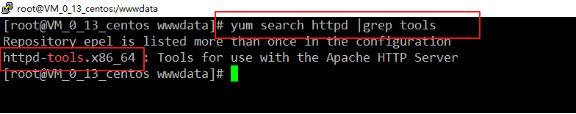
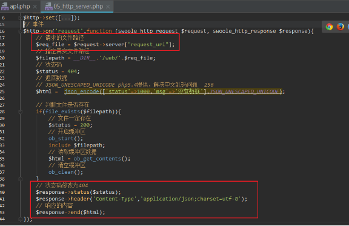
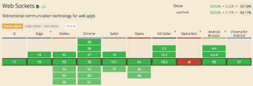
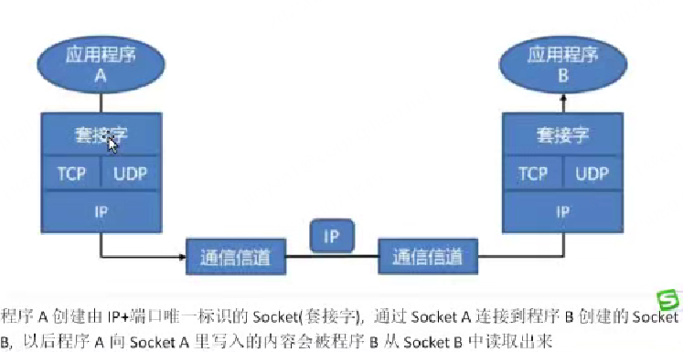
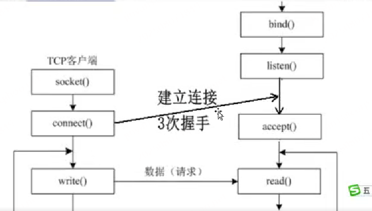
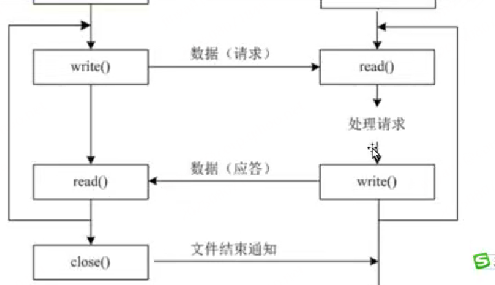

# **Swoole**

- [**Swoole**](#swoole)
- [**今日目标3**](#今日目标3)
- [**一、简介**](#一简介)
  - [解决痛点](#解决痛点)
- [**二、下载安装**](#二下载安装)
  - [**2.1、下载地址**](#21下载地址)
  - [**2.2、安装依赖环境**](#22安装依赖环境)
  - [**2.3、安装swoole**](#23安装swoole)
    - [安装步骤](#安装步骤)
    - [实际安装过程及遇到的问题](#实际安装过程及遇到的问题)
    - [常识注意点](#常识注意点)
- [**三、快速起步**](#三快速起步)
  - [**3.1、进程管理**](#31进程管理)
  - [**3.2、环境准备**](#32环境准备)
  - [**3.3、创建TCP服务器**](#33创建tcp服务器)
  - [**3.4、tcp客户端**](#34tcp客户端)
  - [**3.5、rpc**](#35rpc)
- [**四、搭建Web服务器**](#四搭建web服务器)
  - [**4.1、性能对比**](#41性能对比)
  - [**4.2、构建web服务器**](#42构建web服务器)
  - [**4.3、静态服务器**](#43静态服务器)
  - [**4.4、动态服务器**](#44动态服务器)
- [**五、搭建websocket服务**](#五搭建websocket服务)
  - [**5.1、简介**](#51简介)
  - [**5.2、浏览器支持**](#52浏览器支持)
  - [**5.3、html5中websocketApi**](#53html5中websocketapi)
  - [**5.4、swoole实现websocket服务**](#54swoole实现websocket服务)
- [**六、socket编程**](#六socket编程)
  - [套接字的组成和适配协议](#套接字的组成和适配协议)
  - [用套接字php原生实现tcp服务(模拟实现swoole)](#用套接字php原生实现tcp服务模拟实现swoole)
    - [使用select实现tcp服务器的多路IO复用](#使用select实现tcp服务器的多路io复用)


# **今日目标3**
- 能够下载swoole源码进行编译安装 
- 能够使用swoole开发http服务器
- 能够使用swoole开发websocket服务器
# **一、简介**
网址：<http://www.swoole.com/>  韩天峰 

Swoole 是一个用 C 编写的 PHP 扩展（不是框架），它让 PHP 不再局限于传统的“每个请求启动一个 PHP 进程”的模式（FPM 模式），而是可以像 Go、Node.js 一样，长期运行一个服务进程，处理大量并发连接。是一个常驻内存的框架。

Swoole：面向生产环境的 PHP 异步网络通信引擎，Swoole 使用纯 C 语言编写，Swoole是PHP一个扩展的形式。 （nodejs也是异步网络通信引擎，比nodejs效率要高，因为用c编写的）

Swoole可以使 PHP开发人员编写高性能的异步并发 TCP、UDP、Unix Socket、HTTP，WebSocket 服务。
    
    ---- 说白了可以使php编写web服务器，因为它是网络通信引擎

Swoole 可以广泛应用于互联网、移动通信、企业软件、云计算、网络游戏、物联网（IOT）、车联网、智能家居等领域。 
     
    ---- 可以大大提升api服务的qps值，支持高并发

## 解决痛点

Swoole 解决了 PHP 在处理高并发、异步 I/O 和长连接方面的多个痛点，使得 PHP 能够更好地应对现代 Web 应用的需求


1. 同步阻塞 I/O 模型

传统 PHP 痛点：传统的 PHP 运行模式（如通过 Apache 或 Nginx + PHP-FPM）是基于每个请求启动一个新的进程或线程来处理。这种方式在处理高并发时效率较低，因为每次请求都需要重新初始化环境和加载脚本。举例：传统 PHP-FPM 模型下，1000 个并发可能就需要 1000 个 PHP 进程，资源消耗大；而 Swoole 可以用一个进程 + 协程处理数千并发

Swoole 解决方案：Swoole 提供了异步非阻塞 I/O 支持，允许一个 PHP 进程可以同时处理多个请求，极大地提高了服务器的并发处理能力。

2. 缺乏常驻内存机制

传统 PHP 痛点：每次 HTTP 请求都会重新加载所有的依赖库和业务逻辑代码，这不仅浪费了大量的时间，也增加了服务器的负载。

Swoole 解决方案：通过让 PHP 应用以服务的形式运行，Swoole 实现了常驻内存，避免了每次请求都要重新加载代码的问题，从而提升了性能。

3. 难以处理 WebSocket 和其他实时通信协议

传统 PHP 痛点：传统的 PHP 架构并不适合处理需要保持长时间连接的应用场景，比如 WebSocket，因为它们的设计初衷是为了短生命周期的 HTTP 请求/响应周期。

Swoole 解决方案：Swoole 内置了对 WebSocket、TCP、UDP 等多种网络协议的支持，使得开发人员能够使用 PHP 来构建高效的实时应用。

4. 回调地狱（Callback Hell）

传统 PHP 痛点：虽然 PHP 社区也有一些库尝试引入异步编程模型，但通常会导致复杂的回调嵌套，降低了代码的可读性和维护性。

Swoole 解决方案：Swoole 引入了协程的概念，允许开发者编写看似同步但实际上异步执行的代码，简化了异步编程模型，减少了回调地狱的问题。

5. 扩展性和灵活性不足

传统 PHP 痛点：对于一些需要高性能的服务端应用，如微服务架构下的服务发现、RPC 调用等，PHP 的原生支持较弱。

Swoole 解决方案：Swoole 提供了丰富的功能模块，包括但不限于 RPC、定时器、任务队列等，增强了 PHP 在构建复杂分布式系统方面的能力。

    1. 定时器：支持毫秒级的定时触发响应，比crontab的定时器最小分钟单位更加强大


综上所述，Swoole 不仅解决了 PHP 在面对高并发、实时通信等方面的局限性，还为 PHP 开发者提供了更加现代化的编程范式，使 PHP 可以更有效地支持现代 Web 应用的发展需求。通过引入异步 I/O、协程以及常驻内存服务等特性，Swoole 显著提升了 PHP 应用程序的性能和可扩展性


# **二、下载安装**
swoole是一个PHP的扩展，所以安装的方式和安装其它的PHP扩展的方式一样。swoole不支持windows安装，没有windows扩展。 linux系统或Mac系统 Docker也是可以的
## **2.1、下载地址**
Github：<https://github.com/swoole/swoole-src/tags>

php官方扩展库：<http://pecl.php.net/package/swoole>

开源中国：<http://git.oschina.net/swoole/swoole/tags>

下载


在linux服务器中新建目录存放下载的源码

mkdir /src

cd /src

wget https://pecl.php.net/get/swoole-4.4.4.tgz


## **2.2、安装依赖环境**

安装swool的必须要求的依赖版本要求：

- 仅支持Linux，FreeBSD，MacOS，3类操作系统
- Linux内核版本2.3.32如centos必须6.6以上 uname -r


- PHP7.0以上版本 php -v


- gcc4.4以上版本  gcc --version

- cmake2.4以上版本  cmake --version

安装cmake 

yum install -y cmake


## **2.3、安装swoole**

> 选择编译安装的方式，自行下载扩展源码包

### 安装步骤

\# 下载

wget <https://pecl.php.net/get/swoole-4.3.3.tgz>

\# 解压

tar zxf swoole-4.3.3.tgz

\# 编译安装扩展

cd swoole-4.3.3 # 进入目录

    1. 编译安装需要先执行configure可执行文件，此目录默认没有configure目录，需要先用php开发包的命令phpize生成下这个目录

/usr/bin/phpize  # 执行phpize命令，产生出configure可执行文件

./configure --with-php-config=/usr/bin/php-config   # 进行配置
    
    1. ./configure 是一个脚本，用于 检测系统环境并生成 Makefile，为后续的 make 编译做准备
    2. --with-php-config告诉 configure 脚本，指定 php-config 命令的路径
       1. php-config 是一个 php-dev开发包 提供的工具，它能告诉你：PHP 的安装路径，PHP 的版本号，PHP 的包含文件目录（include path），编译 PHP 时使用的编译器和参数（如 --prefix, --includes, --ldflags 等）    

make && make install # 编译和安装

修改配置文件引入扩展（方式1）：vi /etc/php.ini

复制如下代码

extension=swoole.so

放到你所打开或新建的文件中即可，无需重启任何服务。

\# 查看扩展是否安装成功

php -m|grep swoole


### 实际安装过程及遇到的问题


解压


检查一下php开发包是否安装


如果没有安装才需要搜索，安装一下


安装

yum install -y php71w-devel.x86_64


初始化


配置安装和环境检查


编译安装


linux中php扩展文件的后缀名为： **xxxx.so**


看到此文件存在表示安装扩展成功


修改配置文件引入扩展（方式2）

注：因为服务器用的yum安装的PHP，会模块化配置的，直接在被引用的/etc/php.d目录下新建一个文件，文件内容为：extension=swoole.so,会自动关联到php.ini文件中。


检查扩展是否生效


### 常识注意点

1. 因为大多数生产环境不需要编译扩展，只需要运行 PHP 脚本。所以：
   1. 主包 php：包含运行 PHP 所需的核心文件（解释器、标准库等）
   2. 开发包 php-devel / php-dev：包含头文件（headers）、phpize、php-config 等开发工具  ------> 需要单独安装
      1. php安装扩展时，必须要使用php-dev开发包来给php安装三方扩展如swoole.
      2. phpize 是一个命令行工具，主要用于准备 PHP 扩展的构建环境会跟随系统环境动态生成configure执行文件。它属于 PHP 开发套件的一部分，通常与 php-devel 或者 php-dev 包被动的一起自动安装上，因为它是编译和安装第三方 PHP 扩展或自行开发的 PHP 扩展时不可或缺的工具。

      3. php-config：是一个 php-dev开发包 提供的工具，它能告诉你：PHP 的安装路径，PHP 的版本号，PHP 的包含文件目录（include path），编译 PHP 时使用的编译器和参数（如 --prefix, --includes, --ldflags 等
2. wondow下php的扩展文件后缀为dll，Linux下为so。
3. php -m：查看当前php安装的扩展


# **三、快速起步**
## **3.1、进程管理**


swoole是一个多进程，多线程的服务，常驻内存的框架，避免内存溢出用manager进程及时回收内存。

master主进程负责创建**多个线程Reactor**来接受和响应用户请求，同时生成一个manager进程，manager进程负责生成和管理和销毁N多个worker和taskWorker进程,worker和taskWorker进程是负责干活的（task干的是脏活累活，）

   1. manager进程及时回收内存，高效的管理进程的资源利用，及时创建销毁进程
   2. 进程与进程之间是不能通信的，如何通信？
      1. 最简单的方案：共享内存区
   3. 线程是由进程创建的，线程之间数据是共享的可以通信的。
## **3.2、环境准备**
使用ftp或sftp上传源代码,使用phpstorm提供ftp来直接保存即上传代码。

配置phpstorm支持ftp上传


前面设置完后，需要文件右键点击再上传，下面可以设置保存就上传---


----最后安装swoole开发工具：让phpstorm更好的支持swoole开发，有更好的开发提示体验

下载：<https://github.com/wudi/swoole-ide-helper>

放到项目根目录下面就可以了


## **3.3、创建TCP服务器**

> 见`../swoole/01_tcp_server.php`

- 构建Server对象

`$serv = new \Swoole\Server('0.0.0.0', 9501, SWOOLE_PROCESS, SWOOLE_SOCK_TCP);`

// 参数说明

$host参数用来指定监听的ip地址  0.0.0.0监听全部地址

$port监听的端口，如9501  0-1024之间，是系统默认保留的，所在建议从5000

$mode运行的模式 SWOOLE_PROCESS多进程模式（默认）  SWOOLE_BASE基本模式

$sock_type指定Socket的类型  支持TCP、UDP等，默认是TCP

- 设置运行时参数

$serv->set(array(

`    `'worker\_num' => 2

));

// 参数说明

worker\_num  设置启动的Worker进程数，设置完后可以用`ps -ef`查看   CPU核数的1-4倍最合理

- 注册事件回调函数

// 有新的连接进入时，在worker进程中回调

// 监听的事件
// 连接上tcp事件
// 参数1 Server对象
// 参数2 客户端的Id号
// 参数3  接受处理的线程Id号

$serv**->**on('Connect', function(swoole\_server $server, int $fd, int $reactorId){});

// 接收到数据时回调此函数，发生在worker进程中  它不能少

//$data 接受到的数据
$serv**->**on('Receive', function(swoole\_server $server, int $fd, int $reactor\_id, string $data){});

// TCP客户端连接关闭后，在worker进程中回调此函数

$serv**->**on('Close', function(swoole\_server $server, int $fd, int $reactorId){});

// 参数说明

$server 是swoole\_server对象  $serv->connections; //当前服务器的客户端连接，可使用foreach遍历所有连接

$fd 是连接的文件描述符，客户端的id号

$reactorId 来自哪个reactor线程，线程id号

$data，收到的数据内容

- 启动服务
- 最后在终端中使用php命令行执行此php文件，启动服务

$serv**->**start();


测试使用telnet命令来进行测试

\# 默认系统是没有安装telnet

yum install -y telnet

windows下，默认也是没有安装的


- 使用netstat命令验证tcp服务器和swoole所开的worker进程层级关系


- 测试tcp服务器响应：telnet 工具测试与本地主机（127.0.0.1）的 6060 端口 是否建立 TCP 连接
  - tcp本质是个长连接


回车进入，按下ctrl+]再次回车，tcp本质是个长连接，只要你输入数据回车就可以发内容，tcp启动服务那个窗口就可以实时接收消息，退出，按ctrl+] 输入 quit 退出
## **3.4、tcp客户端**

> 见`../swoole/01_tcp_client.php`

// 同步客户端连接

`$client = new \Swoole\Client(SWOOLE_SOCK_TCP);`

// 连接到服务器  ip  端口  超时时间秒

if (!$client->connect('127.0.0.1', 9501, 0.5))

{

`    `die("connect failed.");

}

// 向服务器发送数据

if (!$client->send("hello world"))

{

`    `die("send failed.");

}

//从服务器接收数据,设置最多接收 9000 字节的数据

$data = $client->recv(9000);

if (!$data)

{

`    `die("recv failed.");

}

echo $data;

//关闭连接

$client**->**close();

linux下直接使用swoole提供的客户端client：


想在windows上链接tcp服务，由于windows不支持swooler，所以原生PHP实现了tcp客户端：

> 见`../swoole/03_tcp_client.php`


## **3.5、rpc**

> rpc的介绍：参见`../资料/rpc.html`

- 最大的优点：高并发
- 缺点：部署复杂

> 代码见`../swoole/rpc_body.php|rpc_footer.php|rpc_header.php` 和 `../swoole/rpc目录`
> > 基于前面的tcp服务实现rpc的首页的body，header，footer3个微服务

rpc服务端


客户端调用


效果


集合到tp框架中

定义服务，引入tp入口文件


1. 细节：我们采用用代码的方式启动框架，不是用浏览器请求的方式
   1. 具体代码方式以thinkphp框架启动逻辑为准：`public/index.php =====> Order/thinkphp/start.php`
2. 我们在swoole/rpc目录中测试的controller是application/index/controller/index.php
3. app实例run后，直接将响应结果返回给tcp客户端即demo2.php

客户端调用


效果


# **四、搭建Web服务器**

## **4.1、性能对比**
使用apache bench工具对Nginx静态页、Golang Http程序、PHP7+Swoole Http程序进行压力测试。在同一台机器上，进行并发100用户,共100万次Http请求的基准测试中，QPS对比如下：


1. **QPS**：指的是在一秒钟内，服务可以处理的请求的数量
2. QPS数值越大，证明你的服务器越牛逼，WEB性能越好--，可以提供高并发.


## **4.2、构建web服务器**

> 代码参考： `../swoole/04_http_server.php`

Swoole1.7.7版本增加了内置Http服务器的支持，通过几行代码即可写出一个异步非阻塞多进程的Http服务器。 Http类的模块是继承了Server类

      1. 小提示：Swoole是异步非阻塞多进程的http服务器，nodejs是异步非阻塞单进程单线程的http服务器
         1. nodejs默认初衷是单进程，但是后面引入了cluster和worker_threads模块提供了多进程多线程能力

$http **=** **new** **Swoole**\**Http**\**Server**("127.0.0.1", 9501);

// 接受客户端请求事件
```php
$http**->**on('request', **function**(**swoole\_http\_request** $request, **swoole\_http\_response** $response) {

`	`// 发送到客户端浏览器

`     `$response**->**end("<h1>hello swoole</h1>");

});

$http->start();
```
// 访问操作

1- 用php命令行执行启动这个文件服务
2- 浏览器直接访问这个服务端口即可

// 参数说明

$request，Http请求信息对象，包含了header/get/post/cookie/rawContent[put/delete]等相关信息

$response，Http响应对象，支持cookie/header/status等Http操作


通过ab压测(httpd-tools工具包含ab压测包，主要用于http服务器压力测试)


yum install -y httpd-tools



压测

ab -c100 -n1000 -k url地址

-c 并发数：每次同时发起多少请求数

-n 总的请求数：决定共执行多少次


## **4.3、静态服务器**

> 代码参考： `../swoole/04_http_server.php`

1. 当前配置了静态资源服务器，会直接返回静态资源，不会解析php文件

\# 静态资源配置选项

'document\_root' => '/data/webroot', // v4.4.0以下版本, 此处必须为绝对路径

'enable\_static\_handler' => true,

注：document\_root选项一定要注册静态资源请求的时路径来设置


静态的文件


路径


## **4.4、动态服务器**

> 代码参考： `../swoole/05_http_server.php`

高性能的动态解析PHP的服务器



页面PHP文件


封装$\_get $\_post $\_files数据的获取


# **五、搭建websocket服务**
## **5.1、简介**
WebSocket 是 HTML5 开始提供的一种在单个 TCP 连接上进行全双工通讯的协议。

WebSocket 使得客户端和服务器之间的数据交换变得更加简单，允许服务端主动向客户端推送数据。在 WebSocket API 中，浏览器和服务器只需要完成一次握手，两者之间就直接可以创建持久性的连接，并进行双向数据传输。

websocket解决服务器端与客户端即时通信的问题。

协议名：ws  加密通信 wss  通信成功 状态码 101
## **5.2、浏览器支持**

## **5.3、html5中websocketApi**
var ws = new WebSocket("ws://localhost:9501");

- Websocket事件


WebSocket 方法


## **5.4、swoole实现websocket服务**
WebSocket\Server 继承自 Http\Server

$server **=** **new** **Swoole**\**WebSocket**\**Server**("0.0.0.0", 9501);

// 当WebSocket客户端与服务器建立连接并完成握手后会回调此函数

$server**->**on('open', **function** (**Swoole**\**WebSocket**\**Server** $server, **Swoole\Http\Request** $request) {

`    `echo "已连接成功\n";

});

// 当服务器收到来自客户端的数据帧时会回调此函数  此回调方法不能缺少

$server**->**on('message', **function** (**Swoole**\**WebSocket**\**Server** $server, **swoole\_websocket\_frame**  $frame) {

`     `// 服务器端主动向客户端发送消息

`    `//$frmae->data 客户端发过来的数据

`    `// 服务器端向客户端发送消息

`    `$server**->**push($frame**->**fd, "this is server");

});

// 客户端关闭连接时触发此回调函数

$server**->**on('close', **function** ($ser, $fd) {

`    `echo "client {$fd} closed\n";

});

// 启动服务

$server**->**start();


# **六、socket编程**

在类 Unix 系统（如 Linux、macOS）中，“套接字（Socket）是一种特殊的文件” 是对其本质的经典概括，这源于操作系统 “一切皆文件” 的设计哲学 —— 通过统一的 “文件接口” 抽象各种 I/O 资源（包括磁盘文件、键盘、网络连接等），让开发者可以用相同的方式（读 / 写 / 关闭）操作不同类型的资源。

Socket 就跟文件一样可以打开，读写，关闭.只是从Socket中读取的数据有可能是来自网络上的另一台电脑向Socket中写入的数据有可能会发送给网络上的另一台电脑小结:


- 共性：在类 Unix 系统中，所有 I/O 操作都通过文件描述符（File Descriptor，FD） 进行管理，这是一个非负整数（如 0、1、2 分别对应标准输入、输出、错误）。
  - 普通文件：打开磁盘文件时，操作系统会分配一个 FD，后续的 read()/write()/close() 等操作都通过这个 FD 完成。
  - 套接字：创建套接字时，操作系统也会分配一个 FD（例如调用 socket() 函数的返回值就是一个 FD），后续的 send()/recv()/close() 操作同样通过这个 FD 进行
- 差异：套接字虽然被抽象为文件，但它的 “内容” 并非磁盘上的持久化数据，而是网络连接或进程间通信的数据流


1. Socket（套接字） 是一种通信机制，Socket 的规范本质上是 “一套标准化的接口定义”，确保不同系统、不同语言能以相同的逻辑实现网络通信，同时通过绑定 TCP/UDP(没有http协议) 等协议，适配不同的传输需求
   1. 现代 Socket 编程的绝大多数实现都遵循 BSD Socket（Berkeley Software Socket） 规范，这是 1983 年由加州大学伯克利分校在 Unix 系统中提出的一套 API 标准，定义了 Socket 通信的基本接口和行为，其核心规范包括：Socket 类型与协议族+核心 API 接口+地址格式统一表示。
   2. 核心 API 接口：定义了一套标准函数，所有遵循该规范的操作系统本身（如 Linux、Windows、macOS）都需实现这些接口如 socket()：创建 Socket 端点；bind()：绑定本地 IP 和端口；listen()/accept()：TCP 服务器监听和接受连接；connect()：TCP 客户端发起连接；send()/recv()（TCP）sendto()/recvfrom()（UDP）：发送和接收数据；close()：关闭 Socket
      1. nodejs中创建tcp服务的方法内部都是间接调用的操作系统的底层提供的方法
      2. Node.js 的 http 模块是典型的 HTTP 服务实现，它基于 net 模块（TCP 套接字）构建，HTTP 服务是 **“TCP 套接字 + HTTP 协议规范” 的组合
   3. Socket 本身不实现数据传输，而是依赖底层传输协议的规范，最常用的是：
      1. TCP 协议规范：当 Socket 类型为 SOCK_STREAM 时，必须遵循 TCP 的 “三次握手” 建立连接、“四次挥手” 关闭连接、超时重传、流量控制等规范，确保数据可靠、有序传输。
      2. UDP 协议规范：当 Socket 类型为 SOCK_DGRAM 时，遵循 UDP 的无连接、不可靠传输规范，数据以 “数据报” 形式发送，不保证到达顺序，也不重传丢失的数据包
2. Socket 是 “端点”：每个连接由两个 Socket 组成（客户端一个，服务器一个）；可以把 Socket 理解为：两个设备之间通信的 “端点”—— 就像现实中打电话时，两部电话就是各自的 “套接字接口”（听筒 + 话筒+拨号定位通信对象程序），数据通过这两个端点双向传递
3. 代码中，Socket 表现为一个特殊的文件描述符（类似文件句柄），通过它可以调用系统提供的函数（如connect()、send()、recv()）完成网络通信
```js
1. 服务器端（类似 “接听电话”）：
创建 Socket：生成一个通信端点（相当于买了一部电话）；
绑定地址：将 Socket 与本机的 IP 地址和端口号绑定（相当于给电话绑定一个固定号码）；
监听连接：进入等待状态，准备接收客户端的连接请求（相当于开机并等待来电）；
接受连接：当客户端请求连接时，建立实际的通信链路（相当于接听电话，双方建立通话）；
收发数据：通过已连接的 Socket 与客户端交换数据（相当于对话）；
关闭连接：通信结束后关闭 Socket（相当于挂电话）。
1. 客户端（类似 “拨打电话”）：
创建 Socket：生成一个通信端点（同样买一部电话）；
发起连接：向服务器的 IP 地址和端口号发送连接请求（相当于拨号）；
收发数据：连接建立后，与服务器交换数据（相当于对话）；
关闭连接：通信结束后关闭 Socket（相当于挂电话）。
```







## 套接字的组成和适配协议
```js
套接字（Socket）作为网络通信的通用接口，本身并不绑定特定协议，但它通过协议族（Address Family） 和套接字类型（Type） 的组合，能够适配多种底层网络协议，覆盖从物理层到应用层的不同通信需求。

最常用的适配协议可按网络层次和功能场景分为以下几类：
一、网络层协议（地址定位）
套接字通过协议族（Address Family） 适配网络层的地址格式，核心协议包括：

IPv4（AF_INET）：最常用的网络层协议，通过 32 位 IP 地址（如 192.168.1.1）定位设备，是互联网的基础协议。
IPv6（AF_INET6）：为解决 IPv4 地址枯竭设计的下一代协议，使用 128 位地址（如 2001:0db8:85a3:0000:0000:8a2e:0370:7334），支持更大的地址空间和更多扩展功能。
本地协议（AF_UNIX/AF_LOCAL）：用于同一设备内的进程间通信（IPC），不依赖网络，通过文件系统路径（如 /tmp/socket.sock）作为 “地址”，效率极高。
二、传输层协议（数据传输）
套接字通过类型（Type） 适配传输层协议，决定数据传输的方式，核心协议包括：

TCP（SOCK_STREAM）：
面向连接的可靠传输协议，通过 “三次握手” 建立连接，“四次挥手” 关闭连接，支持重传、流量控制、拥塞控制，确保数据有序、无丢失、无重复。
适用场景：HTTP/HTTPS、FTP、邮件传输（SMTP）等需要可靠数据传输的场景。
UDP（SOCK_DGRAM）：
无连接的不可靠传输协议，数据以 “数据报” 形式发送，不保证到达顺序，也不重传丢失的数据包，但传输效率更高、延迟更低。
适用场景：实时通信（如视频通话、语音聊天）、DNS 查询、游戏数据传输等对实时性要求高于可靠性的场景。
SCTP（SOCK_SEQPACKET）：
兼具 TCP 的可靠性和 UDP 的实时性，支持多流传输和消息边界保护，主要用于电信领域（如 VoIP、视频会议）。
三、应用层协议（业务逻辑）
套接字本身不直接实现应用层协议，但所有应用层协议都基于传输层套接字实现通信，常见的有：

HTTP/HTTPS：基于 TCP 套接字（SOCK_STREAM），用于网页传输，HTTPS 在此基础上增加了 TLS/SSL 加密。
FTP：基于 TCP 套接字，用于文件传输，使用两个连接（控制连接和数据连接）。
SMTP/POP3/IMAP：基于 TCP 套接字，用于邮件的发送、接收和管理。
DNS：主要基于 UDP 套接字（SOCK_DGRAM），用于域名解析（查询通常简短，允许偶尔失败重试）。
WebSocket：基于 TCP 套接字，通过 HTTP 握手建立持久连接，支持全双工实时通信（如聊天应用）。
MQTT：基于 TCP 或 UDP 套接字，轻量级物联网通信协议，适用于设备间低带宽通信。
四、其他特殊协议
RAW 套接字（SOCK_RAW）：
允许直接操作底层协议（如 IP、ICMP），可构造自定义数据包，常用于网络诊断工具（如 ping 基于 ICMP，traceroute 基于 IP）或网络协议分析。
例：ping 命令通过 RAW 套接字发送 ICMP 回声请求包，接收回声应答来检测网络连通性。
IPX/SPX：早期 Novell 网络使用的协议族，套接字通过 AF_IPX 适配，现已基本被 TCP/IP 取代。
总结：套接字与协议的适配逻辑
套接字通过 **“协议族 + 类型”** 的组合适配不同协议，核心逻辑是：

协议族决定 “用什么地址格式定位通信对象”（如 IPv4 地址、本地文件路径）；
类型决定 “用什么传输方式传递数据”（如 TCP 的可靠流、UDP 的数据报）；
应用层协议则在传输层套接字之上，定义 “数据的具体格式和业务规则”。

这种分层设计让套接字成为通用接口，无论是简单的进程间通信，还是复杂的互联网服务，都能通过套接字快速实现。
```


## 用套接字php原生实现tcp服务(模拟实现swoole)

> 参考代码：`../swoole/06_php_tcp_server.php`

1. php中服务监听的本质就是个while死循环，保持长连接就是在接收消息时再嵌套个while死循环，共2层
2. 在 Python、C 等语言中，TCP 服务器需要显式的 while(true) 循环来持续接收连接和数据，因为它们采用阻塞式 I/O 模型 ——accept()、recv() 等操作会阻塞线程，必须通过循环不断等待新事件
3. 而 Node.js 采用事件驱动模型采用的是事件循环+非阻塞I/O模式，：无需显式循环，通过事件回调处理所有操作，非阻塞
   1. 事件循环（Event Loop）：Node.js 进程启动后，会自动进入一个内置的 “无限循环”（可理解为底层的死循环），不断检查事件队列中是否有新事件（如连接请求、数据到达）。
   2. 非阻塞 I/O：所有 I/O 操作（如监听端口、接收连接、读取数据）都是异步的，不会阻塞事件循环。当 I/O 操作完成后，对应的回调函数会被放入事件队列，等待事件循环处理

### 使用select实现tcp服务器的多路IO复用

1. apache就是基于select实现的，nginx基于epoll实现的多路复用，之所以说nginx比apache支持更大的并发量。因为以下2点
   1. nginx消耗的系统资源很少，1个nginx进程大概只消耗10-15m内存空间，是apache的1/10.
   2. 使用的epoll实例他是异步处理机制，select是同步阻塞的对用户请求的处理方式。
   3. swoole的源码就是基于epoll，所以swoole不支持windos安装。
      1. epoll 是 Linux 特有的 I/O 事件通知机制，专门为提高处理大量文件描述符（FDs）时的效率而设计。它提供了比传统的 select 和 poll 更高效的多路复用能力，特别是在高并发网络应用中表现尤为突出

2. select是一个linux底层的系统调用，一种IO多路复用机制，它可以同时监控多个文件描述符（如套接字）的状态变化，当某个文件描述符就绪（如可读、可写）时，select会返回该文件描述符，从而实现非阻塞的IO操作
3. 服务器端使用select监控监听套接字和已连接套接字，当有新连接时，accept新连接并将其加入监控列表；当有数据可读时，read数据并处理；当有数据可写时，write数据


