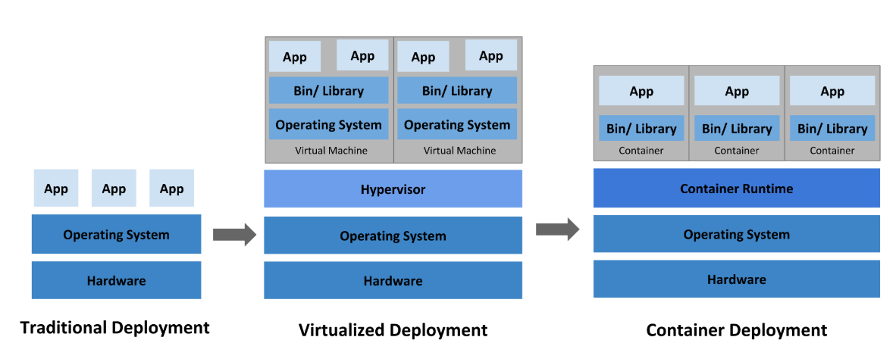

## Kubernetes基础

- [Kubernetes基础](#kubernetes基础)
  - [学习目标](#学习目标)
        - [认识k8s各个组件	`√`](#认识k8s各个组件)
        - [学会安装k8s集群	`√`](#学会安装k8s集群)
        - [学会安装kubenetes-dashboard	`√`](#学会安装kubenetes-dashboard)
  - [1、K8S是什么  (容器编排工具)](#1k8s是什么--容器编排工具)
    - [部署时代的历史回溯](#部署时代的历史回溯)
      - [**传统部署时代：**](#传统部署时代)
      - [**虚拟机部署时代：**](#虚拟机部署时代)
      - [**容器部署时代：**](#容器部署时代)
    - [kubernetes特性](#kubernetes特性)
  - [2、架构](#2架构)
    - [1. **物理概念**：下图就是整个架构的物理概念的形象比喻](#1-物理概念下图就是整个架构的物理概念的形象比喻)
    - [2. **逻辑概念部分**](#2-逻辑概念部分)
    - [概念](#概念)
    - [2.1、控制平面组件（Control Plane Components）](#21控制平面组件control-plane-components)
    - [2.2 kube-apiserver秘书组件](#22-kube-apiserver秘书组件)
    - [2.3etcd资料库](#23etcd资料库)
    - [2.4kube-scheduler调度者](#24kube-scheduler调度者)
    - [2.5kube-controller-manager决策者CEO](#25kube-controller-manager决策者ceo)
    - [2.6cloud-controller-manager外联部](#26cloud-controller-manager外联部)
    - [2.7、Node 组件](#27node-组件)
    - [kubelet厂长](#kubelet厂长)
    - [kube-proxy门卫](#kube-proxy门卫)
    - [概念理解k8s节点和pod的区别](#概念理解k8s节点和pod的区别)
    - [关键组件间的流程总结](#关键组件间的流程总结)
    - [从客户端访问请求url后的外部请求集群流程经过：](#从客户端访问请求url后的外部请求集群流程经过)
  - [3、kubeadm引导集群](#3kubeadm引导集群)
    - [安装kubeadm环境配置要求](#安装kubeadm环境配置要求)
    - [接下来初始化3个虚拟机器](#接下来初始化3个虚拟机器)
    - [1、安装Docker](#1安装docker)
    - [2、配置官网要求的基础环境](#2配置官网要求的基础环境)
    - [3、安装kubelet、kubeadm、kubectl](#3安装kubeletkubeadmkubectl)
    - [4、下载各个机器需要的镜像](#4下载各个机器需要的镜像)
    - [5、初始化主节点](#5初始化主节点)
    - [6、设置.kube/config](#6设置kubeconfig)
    - [7、安装网络组件](#7安装网络组件)
      - [解决了k8s哪些原生不具备的问题？](#解决了k8s哪些原生不具备的问题)
    - [8、worker加入node节点](#8worker加入node节点)
    - [9、验证集群](#9验证集群)
    - [10、测试k8s自我修复 -  自愈能力](#10测试k8s自我修复----自愈能力)
    - [11、测试k8s节点启动自动加入集群](#11测试k8s节点启动自动加入集群)
  - [4、部署dashboard](#4部署dashboard)
    - [1、部署](#1部署)
    - [2、设置访问端口](#2设置访问端口)
    - [3、找到端口，安全组放行端口](#3找到端口安全组放行端口)
    - [4、创建访问账号](#4创建访问账号)
    - [5、令牌访问](#5令牌访问)
    - [6、界面最终效果](#6界面最终效果)
    - [7、解决https不安全访问](#7解决https不安全访问)


### 学习目标

###### 认识k8s各个组件	`√`

###### 学会安装k8s集群	`√`

###### 学会安装kubenetes-dashboard	`√`

### 1、K8S是什么  (容器编排工具)

[Kubernetes](https://kubernetes.io/zh-cn/ )（简称K8s--因为中间8个字母，一种取名方式）是一个全新的基于容器技术（如Docker）的分布式架构方案,这个方案源于Google十几年来大规模应用容器技术的经验积累和升华的重要成果，实际上是Google一个久负盛名的内部使用的大规模集群管理系统。它是Google开源的容器集群管理系统，**主要用于自动部署、扩展和管理容器化的应用程序**，是以Docker为基础的分布式系统架构。

Kubernetes可以对分布式系统进行完美的支撑，它具备完善的集群控制能力，内建有智能的负载均衡器，拥有强大的故障发现和自我修复能力。同时还针对开发、部署测试、运维监控等提供了完善的管理工具。其核心思想是：一**切以服务为中心**，根据这一核心思想，Kubernetes可以让在其上构建的系统独立运行在物理机、虚拟机群或者云上服务器。

**k8s和SpringCloud的区别：**

> Kubernetes（简称K8s）和Spring Cloud是两个不同的技术栈，各自解决了运行和开发微服务中的不同问题。K8s是一个容器编排平台，用于自动化部署、扩展和管理容器化的应用程序，其基本功能包括容器编排、服务发现、负载均衡、自动扩缩容、滚动更新等。
> 
> 而Spring Cloud则是一个基于Spring Boot实现的微服务框架，主要提供了一系列解决方案和组件，包括服务注册与发现、配置中心、全链路监控、服务网关等，帮助开发者快速构建分布式系统的开发工具。
> 
> ------------- k8s主要再以部署层面，微服务框架在意微服务项目的实现
>
> 在具体使用时，可以结合两者的优势，借助于K8s的容器化手段使用Spring Cloud来解决服务的注册与发现，属性配置动态化等问题。这样，我们可以构建一个可扩展且具有弹性的微服务系统，甚至可以扩展到数十个或数百个服务，同时在具有广泛构建时和运行时功能的工具集的帮助下对其进行集中管理和治理。

**k8s和云原生架构的关系：**

> 云原生架构和Kubernetes（通常称为K8s）是**云计算**中两个重要的概念，它们在功能和用途上有着明显的区别。云原生架构是一种基于分布式、微服务、容器化、DevOps和持续交付理念的应用程序架构。这种架构旨在使应用程序更加敏捷、高效地开发和运营。
>
> 而Kubernetes，**是一个开源的容器编排平台**，主要的功能在于简化和自动化容器化应用程序的部署、扩展和管理。它提供了容器编排和自动化管理服务，支持微服务架构的部署和运行。
>
> 总的来说，云原生是一种全新的构建和运行应用程序的方法论，而Kubernetes则是一种具体方法论实现层面的具体技术工具，用于实现云原生应用的部署和管理。这两者共同构成了现代化的云计算架构，使得企业可以更加敏捷、高效地开发和运营。
>
> 云计算概念：
>
> 云计算的核心理念是以互联网为中心，在网站上提供快速且安全的云计算服务与数据存储，让每一个使用互联网的人都可以使用网络上的庞大计算资源与数据中心。其另一个重要理念是通过不断提高“云”的处理能力，进而减少用户终端的处理负担，最终使用户终端简化成一个单纯的输入输出设备，并能按需享受“云”的强大计算处理能力

**k8s的使用场景：**

> 用于自动部署、扩缩和管理容器化应用程序的开源系统
>
> 场景一：云原生应用：K8s可以提供自动化部署、扩展和管理容器化应用程序的能力，从而支持云原生应用的开发和部署。
>
> 场景二：微服务架构：在微服务架构中，一个应用被拆分成多个小的服务，每个服务都运行在自己的容器中。K8s可以管理和协调这些容器，确保整个系统的高可用性和伸缩性。
>
> 场景三：大规模数据处理：对于需要处理大量数据的应用，K8s能够实现自动扩展，以满足业务高峰期的需求


#### [部署时代的历史回溯](https://kubernetes.io/zh-cn/docs/concepts/overview/)




##### **传统部署时代：**

早期，各个组织是在物理服务器上运行应用程序。 由于无法限制在物理服务器中运行的应用程序资源使用，因此会导致资源分配问题。 例如，如果在同一台物理服务器上运行多个应用程序， 则可能会出现一个应用程序占用大部分资源的情况，而导致其他应用程序的性能下降。 一种解决方案是将每个应用程序都运行在不同的物理服务器上， 但是当某个应用程序资源利用率不高时，剩余资源无法被分配给其他应用程序， 而且维护许多物理服务器的成本很高。

- tomcat是java-web服务器


##### **虚拟机部署时代：**

因此，虚拟机化技术被引入了。虚拟化技术允许你在单个物理服务器的 CPU 上运行多台虚拟机（VM如VMware）。 虚拟化能使应用程序在不同 VM 之间被彼此隔离，且能提供一定程度的安全性， 因为一个应用程序的信息不能被另一应用程序随意访问。

虚拟化技术能够更好地利用物理服务器的资源，并且因为可轻松地添加或更新应用程序， 而因此可以具有更高的可扩缩性，以及降低硬件成本等等的好处。 通过虚拟化，你可以将一组物理资源呈现为可丢弃的虚拟机集群。

每个 VM 是一台完整的计算机，在虚拟化硬件之上运行所有组件，包括其自己的操作系统。

缺点：资源浪费，每个虚拟机相当于一个完整的操作系统，每新增个虚拟机都需要装个系统，有很多资源浪费，而后面出现的容器化都公用一个系统，每个容器只是一个进程，占用的资源更少


##### **容器部署时代：**

> 容器类似于 VM，但是更宽松的隔离特性，使容器之间可以共享操作系统（OS）。 

因此，容器比起 VM 被认为是更轻量级的。且与 VM 类似，每个容器都具有自己的文件系统、CPU、内存、进程空间等。 由于它们与基础架构分离，因此可以跨云和 OS 发行版本进行移植。

容器因具有许多优势而变得流行起来，例如：

- 敏捷应用程序的创建和部署：与使用 VM 镜像相比，提高了容器镜像创建的简便性和效率。
- 持续开发、集成和部署：通过快速简单的回滚（由于镜像不可变性）， 提供可靠且频繁的容器镜像构建和部署。
- 关注开发与运维的分离：在构建、发布时创建应用程序容器镜像，而不是在部署时， 从而将应用程序与基础架构分离。
- 可观察性：不仅可以显示 OS 级别的信息和指标，还可以显示应用程序的运行状况和其他指标信号。
- 跨开发、测试和生产的环境一致性：在笔记本计算机上也可以和在云中运行一样的应用程序。
- 跨云和操作系统发行版本的可移植性：可在 Ubuntu、RHEL、CoreOS、本地、 Google Kubernetes Engine 和其他任何地方运行。
- 以应用程序为中心的管理：提高抽象级别，从在虚拟硬件上运行 OS 到使用逻辑资源在 OS 上运行应用程序。
- 松散耦合、分布式、弹性、解放的微服务：应用程序被分解成较小的独立部分， 并且可以动态部署和管理 - 而不是在一台大型单机上整体运行。
- 资源隔离：可预测的应用程序性能。
- 资源利用：高效率和高密度


#### kubernetes特性

> https://kubernetes.io/zh-cn/ 
>
> Kubernetes（通常简称为K8s）是一个开源的容器编排平台，它的主要特性包括：
>
> 1. 自动调度：K8s提供了一个高级调度程序来在集群节点上启动容器，并且能够执行资源优化。
> 2. 自我修复功能：当容器失效时，K8s可以提供重新调度、替换和重新启动已失效的容器。
> 3. 自动推出和回滚：K8s支持针对容器化应用程序的所需状态进行推出和回滚。
> 4. 水平扩展和负载平衡：根据需求，K8s可以扩展和缩减应用程序，同时它还支持服务的负载均衡。
> 5. 资源利用率：K8s提供资源利用率监控和优化，确保容器有效利用其资源。
> 6. 多云和混合云支持：K8s可以部署在不同的云平台上，并跨多个云运行容器化应用程序。
> 7. 可扩展性：K8s具有很高的可扩展性，可以使用自定义插件和控制器进行扩展。


1. 自动化上线与回滚
   1. 当应用程序需要更新时，K8s 可以自动部署新的版本，而不会影响当前运行的应用程序。
   2. 如果应用程序出现问题，K8s 可以自动回滚到之前的版本。
   3. 具体原理：当一个更新后的应用容器上线时，先拦截对应服务容器的流量到新的应用，等新应用运行稳定后，再将流量切换到新应用并把之前的应用删掉，如果有问题立即切回流量回滚。

2. 存储编排
   1. 如redis数据系统不能随便删里面有数据，可以挂载到宿主机上，容器重启删掉后数据不会丢失
3. 自动装箱： 是指集群根据预设规则（如资源需求、约束条件），自动将容器化应用（Pod）调度到最合适的节点（Node） 的过程。它类似 “智能装箱”—— 把不同的 “物品”（Pod）合理分配到不同的 “箱子”（Node）中，以最大化资源利用率并满足应用需求
4. ipv46双协议栈：每个pod容器是都有自己的ip的，分配ipv46


### 2、架构

https://kubernetes.io/zh-cn/docs/concepts/overview/components/


当你部理完 K8s，使拥有了一个完整的集群。一组工作机器，称为节点，会运行容器化应用程序，每个集群至少有一个工作节点。（--------还有个主master节点主要运行控制平面组件负责运营管理，我们的项目服务一般放在工作节点里）

工作节点会托管 Pod，而 Pod 就是作为应用负载的组件。控制平面管理集群中的工作节点和 Pod，在生产环境中，控制平面通常跨多台计算机运行，一个集群通常运行多个节点，提供容错性和高可用性，

下图述了一个正常运行的Kuberneces 群所需的各种组件，分布从物理概念和逻辑概念两个角度进行说明

#### 1. **物理概念**：下图就是整个架构的物理概念的形象比喻

   - 图标含义：
      - 叠加图标：里面的如秘书那种带叠加形状的图标：都代表可以水平扩缩容，开扩多个实例并行工作的组件
   - ceo决策者：cm-就是控制器管理中心，含多个类型的控制器，负责核心管理工作
   - 资料库就是etc，一个存储数据的地方
   - 调度者：管理各个Node厂的资源利用情况，根据策略把pod分配到合适的Node上
     - 每个Node里包含多个Pod部署单元
   - 部署微服务时，秘书API就找到那个Node里的门卫-->厂长，下达指令，由各自Node的厂长负责部署微服务应用
#### 2. **逻辑概念部分**
   1. Deployment和Service是运行于控制平面的逻辑概念，需要用户手动配置，整个流程如下：
      1. 你通过 “前台接待”（API Server）告诉餐厅：“我有3家分店Node，合理安排6个奶茶师Pod（Deployment），对外公布一个订餐电话（Service）”。
         1. 不用手动指定奶茶师去哪家分店，调度者Scheduler会根据每家店的大小（资源）、忙闲程度（负载）合理分配，每家2个
         2. Deployment逻辑概念即一份声明式配置文件，共6个奶茶师就是副本6
            1. 副本数：需要运行多少个相同的Pod实例，分配在不同Node分店上，用于容错性
            2. labels：代表该Deployment创建的所有Pod及副本的统一Pod标签名
            3. 每个奶茶师Pod的容器配置：可配置一个容器应用镜像或多个关联容器应用（如应用容器+日志收集容器需要共享同一个Pod的网络和存储）
               1. 每个Pod的多个容器就好比每个奶茶师操作的多个机器--冰块机，咖啡机，奶油机
      2. “档案库”（etcd）记录下这个要求。
      3. “运营总监”（Controller Manager）和调度者Scheduler确保平衡每家店真的有 2 个奶茶师，少了就增加。
      4. 顾客打订餐电话（Service 的 ClusterIP），每个分店“大堂经理”（kube-proxy）把电话转给其中一个奶茶师（Pod）。
      5. 后来你想换奶茶师（更新Pod应用），Deployment 会平稳替换员工，而订餐电话（Service）始终不变，顾客完全没感觉
   2. 一般1个Deployment代表1个独立部署的服务配置文件，整个K8s中可以有多个Deployment
      1. 单体架构通常只需1个Deplyoment配置，微服务中想给每个服务集群化部署就需要每个服务都对应个Deployment配置（各自独立配置副本数高可用）
      2. 特殊场景：同一服务想要运行多版本（蓝绿部署，金丝雀发布，多环境生产环境测试环境）都需要各自对应
   3. Service：作用为一组Pod提供稳定的访问入口和负载均衡能力【**Service 是 Pod 的 “逻辑分组”**】
      1. 当执行`kubectl apply -f my-service.yaml`后，以下核心组件会协同工作，使 Service 生效配置文件的整个流程如下：
         1. API Server秘书: 接收 Service 配置请求,将配置信息如clusterIP,selector,存储到 etcd 中
            1. selector：选择器，用于指定哪些 Pod 会被 Service 路由到。
            2. 指定ClusterIP
         2. ControllerManager：的EndpointController端点控制器：负责通过APIServer监听Service和Pod的变化，更新Endpoints资源存下来
         3. kube-proxy：通过 API Server 监听 Service 和 Endpoints 的变化，实时更新本地的转发规则，实现流量转发和负载均衡。
            1. 规则 1：节点的 nodePort 端口 → Service 的 ClusterIP:port。
            2. 规则 2：ClusterIP:port → 转发到 Endpoints 中的 Pod IP:targetPort（负载均衡）
         4. 外部请求通过 “节点 IP:nodePort” 访问，流量经本节点的 kube-proxy 转发到后端 Pod，完成服务调用
      2. Service的clusterIP：集群内部通信用。Service 创建后，Kubernetes 会自动从用户指定的service-cidr 网段分配一个集群内部虚拟 IP（如 10.96.0.10），无需手动配置。
         1. 流程形象理解：3 家分店的奶茶师经常换（Pod 重建，IP 变化），但顾客只需记住一个统一的订餐电话（Service 的 ClusterIP），打这个电话总能找到任意一家分店的奶茶师：
            1. 电话接通后，“大堂经理”（kube-proxy）会按规则（负载均衡）分配给当前空闲的奶茶师（健康的 Pod）。
            2. 哪怕奶茶师换了一批人（Pod 全部重建），订餐电话（Service）始终不变，顾客完全不用关心具体是谁接的电话
      3. endpoints：当 selector 匹配到 Pod 后，Kubernetes 会自动创建 endpoints 资源，记录所有健康 Pod 的 IP 和端口，用户无需手动维护
      4. Services的数量：Service 的数量完全取决于集群中部署的应用架构、组件需求和访问场景—— 每个需要被 “稳定访问” 的 Pod 组（或外部服务），通常都需要对应Service
   4. Pod标签和Service选择器的流转规则：
      1. 1个Deployment 的配置文件中，标签定义在 spec.template.metadata.labels 字段，用于标识由该 Deployment 创建的所有 Pod
         1. 有了该标签的定义，决定哪些Deployment创建的Pod会被Service选择器选中
         2. 同一个 Deployment 创建的所有 Pod 副本，标签完全相同
      2. Service 的 selector 需与 Deployment 管理的 Pod 标签一致，才能将流量路由到正确的一组跨越不同Node节点Pod 上。


#### 概念

1. k8s集群就像一个宿舍大楼
2. 节点：就是指一个具体的服务器，就像宿舍楼的楼层，每个楼层有自己的空间和设施相当于服务器资源
3. pod：就是指一个容器组，一个pod可以包含多个容器（多个容器之间必须是协作关系）
   1. Pod类似一个**共享宿舍**：宿舍（Pod）里可以住 1 个人（单容器），也可以住多个关系好的人（多容器）；宿舍里的人共享宿舍的资源（比如网络 IP、存储空间），但每个人有自己的 “任务”（容器的功能）
      1. 容器就是实际的docker应用
4. 关系：pod附着在节点上
5. k8s调度器：像宿管行政前台，负责把新的宿舍单元分配到合适的楼层Node（比如哪个楼层有空位哪个楼层的设施符合需求）


#### 2.1、控制平面组件（Control Plane Components） 

1. 控制平面组件会为集群做出全局决策，比如资源的调度。 以及检测和响应集群事件，例如当不满足部署的 `replicas` 字段时， 要启动新的 [pod](https://kubernetes.io/zh-cn/docs/concepts/workloads/pods/)）。
2. 控制平面组件可以在集群中的任何节点上运行。 然而，为了简单起见，设置脚本通常会在同一个Node上启动所有控制平面组件， 并且不会在此计算机上运行用户容器。 
   1. 控制平面组件不是独立于Node之外的服务器运行，而是附着挑选在一个主Node节点上运行，其他Node节点作为工作节点，主Node节点只负责控制平面不负责用户应用运行


#### 2.2 kube-apiserver秘书组件

1. API 服务器是 Kubernetes [控制平面](https://kubernetes.io/zh-cn/docs/reference/glossary/?all=true#term-control-plane)的组件， 该组件负责公开了 Kubernetes API，负责处理接受请求的工作。 API 服务器是 Kubernetes 控制平面的前端。
2. Kubernetes API 服务器的主要实现是 [kube-apiserver](https://kubernetes.io/zh-cn/docs/reference/command-line-tools-reference/kube-apiserver/)。 `kube-apiserver` 设计上考虑了水平扩缩，
   1. 也就是说，它可通过部署多个实例来进行扩缩。 你可以运行 `kube-apiserver` 的多个实例，并在这些实例之间平衡流量-------==========------就是一个秘书不够用了，可以安排多个秘书并行处理工作
3. 负责控制平面和Node们所有API统一访问入口

#### 2.3etcd资料库

> etcd是一致且高可用的键值存储，用作 Kubernetes 所有集群数据的后台数据库。
>
> 如果你的 Kubernetes 集群使用 etcd 作为其后台数据库， 请确保你针对这些数据有一份 [备份](https://kubernetes.io/zh-cn/docs/tasks/administer-cluster/configure-upgrade-etcd/#backing-up-an-etcd-cluster)计划。
>
> 你可以在官方[文档](https://etcd.io/docs/)中找到有关 etcd 的深入知识。
>

#### 2.4kube-scheduler调度者

> `kube-scheduler` 是[控制平面](https://kubernetes.io/zh-cn/docs/reference/glossary/?all=true#term-control-plane)的组件， 负责监视新创建的、未指定运行[节点（node）](https://kubernetes.io/zh-cn/docs/concepts/architecture/nodes/)的 [Pods](https://kubernetes.io/zh-cn/docs/concepts/workloads/pods/)， 并选择节点来让 Pod 在上面运行。
>
> 调度决策考虑的因素包括单个 Pod 及 Pods 集合的资源需求、软硬件及策略约束、 亲和性及反亲和性规范、数据位置、工作负载间的干扰及最后时限。

> 比如要去调飞机，负责哪个node目前资源适合造飞机

#### 2.5kube-controller-manager决策者CEO

- 控制器

- > [kube-controller-manager](https://kubernetes.io/zh-cn/docs/reference/command-line-tools-reference/kube-controller-manager/) 是[控制平面](https://kubernetes.io/zh-cn/docs/reference/glossary/?all=true#term-control-plane)的组件， 负责运行[控制器](https://kubernetes.io/zh-cn/docs/concepts/architecture/controller/)进程。
  >
  > 从逻辑上讲， 每个[控制器](https://kubernetes.io/zh-cn/docs/concepts/architecture/controller/)都是一个单独的进程， 但是为了降低复杂性，它们都被编译到同一个可执行文件，并在同一个进程中运行。
  >
  > 有许多不同类型的控制器。以下是一些例子：
  >
  > - 节点控制器（Node Controller）：负责在节点出现故障时进行通知和响应
  > - 任务控制器（Job Controller）：监测代表一次性任务的 Job 对象，然后创建 Pods 来运行这些任务直至完成
  > - 端点分片控制器（EndpointSlice controller）：填充端点分片（EndpointSlice）对象（以提供 Service 和 Pod 之间的链接）。
  > - 服务账号控制器（ServiceAccount controller）：为新的命名空间创建默认的服务账号（ServiceAccount）。

#### 2.6cloud-controller-manager外联部
- 云控制器

> 云控制器管理器是指嵌入特定云的控制逻辑的 [控制平面](https://kubernetes.io/zh/docs/reference/glossary/?all=true#term-control-plane)组件。 云控制器管理器允许您链接集群到云提供商的应用编程接口中， 并把和该云平台交互的组件与只和您的集群交互的组件分离开。
>
> `cloud-controller-manager` 仅运行特定于云平台的控制回路。 如果你在自己的环境中运行 Kubernetes，或者在本地计算机中运行学习环境， 所部署的环境中不需要云控制器管理器。
>
> 与 `kube-controller-manager` 类似，`cloud-controller-manager` 将若干逻辑上独立的 控制回路组合到同一个可执行文件中，供你以同一进程的方式运行。 你可以对其执行水平扩容（运行不止一个副本）以提升性能或者增强容错能力。
>
> 下面的控制器都包含对云平台驱动的依赖：
>
> - 节点控制器（Node Controller）: 用于在节点终止响应后检查云提供商以确定节点是否已被删除
> - 路由控制器（Route Controller）: 用于在底层云基础架构中设置路由
> - 服务控制器（Service Controller）: 用于创建、更新和删除云提供商负载均衡器
>


#### 2.7、Node 组件 

- 我们最终的项目就是要部署在Node中，代表实体服务器

> 节点组件在每个节点上运行，维护运行的 Pod 并提供 Kubernetes 运行环境。
  
>
#### kubelet厂长
>
> `kubelet` 会在集群中每个[节点（node）](https://kubernetes.io/zh-cn/docs/concepts/architecture/nodes/)上运行。 它保证[容器（containers）](https://kubernetes.io/zh-cn/docs/concepts/overview/what-is-kubernetes/#why-containers)都运行在 [Pod](https://kubernetes.io/zh-cn/docs/concepts/workloads/pods/) 中。
>
> [kubelet](https://kubernetes.io/docs/reference/command-line-tools-reference/kubelet/) 接收一组通过各类机制提供给它的 PodSpec，确保这些 PodSpec 中描述的容器处于运行状态且健康。 kubelet 不会管理不是由 Kubernetes 创建的容器
>
#### kube-proxy门卫
>
> [kube-proxy](https://kubernetes.io/zh-cn/docs/reference/command-line-tools-reference/kube-proxy/) 是集群中每个[节点（node）](https://kubernetes.io/zh-cn/docs/concepts/architecture/nodes/)上所运行的网络代理， 实现 Kubernetes [服务（Service）](https://kubernetes.io/zh-cn/docs/concepts/services-networking/service/) 概念的一部分。
>
> kube-proxy 维护节点上的一些网络规则， 这些网络规则会允许从集群内部或外部的网络会话与 Pod 进行网络通信。
>
> kube-proxy 的核心特性：是 **“分布式同步”：所有节点上的 kube-proxy 都会通过 API Server 监听 Service 和 Endpoints（后端 Pod 列表）的变化，并在自己所在的节点上生成完全相同的转发规则 
> > 意味着：无论请求来自集群内的哪个节点（或通过哪个节点的外部入口进入），该节点上的 kube-proxy 都能根据相同的规则，将请求跨Node转发到后端 具体Pod，并实现负载均衡
>

#### 概念理解k8s节点和pod的区别

> 在Kubernetes中，Pod和节点都是非常重要的基础概念。首先，Pod是Kubernetes集群中最小的可部署单元，它可以包含一个或多个紧密关联的容器。这些容器共享相同的网络命名空间和本地网络，可以通过localhost进行通信。Pod总是运行在节点上，一个节点可以是虚拟机器或者物理机器，由Master管理。
>
> 另一方面，节点则是Kubernetes中的工作机器，可以是虚拟机或物理机，每个节点都由Master管理。一个节点可以有多个Pod，而Master会自动处理在群集中的节点上调度Pod。
>
> 总的来说，Pod是Kubernetes集群中运行应用或服务的最小单元，它封装了一个或多个紧密关联的容器，并提供了它们之间的网络通信和共享存储。而节点则是Kubernetes集群中的工作机器，可以运行多个Pod，并提供计算资源和存储资源。

#### 关键组件间的流程总结


#### 从客户端访问请求url后的外部请求集群流程经过：

**0、前置概念**：
1. 初始化k8s环境时，用户需要必选配置Deployment和Service，否则无法正常运行
   1. Deployment：
      1. 流转过程：通过 kubectl apply 创建 Deployment，发送到APIServer秘书存到etcd，核心由ControllerManager驱动管理，最终由kubelet各Node节点厂长在节点上执行容器运行
   2. Service：负责定义和管理应用的访问方式、负载均衡策略、端口映射等


**一、初始化K8s集群环境时：**
1. 集群默认没有统一ip入口的方式：默认是依赖入口方式为NodePort Service逻辑，即各Node节点分别进行外部请求入口监听
   1. 创建维护：控制平面的API server秘书组件作为所有操作的入口，负责接收和验证 NodePort Service 的创建、更新、删除请求，并将变更同步到 etcd数据库
   2. 端口分配：秘书向CM首脑请求，Controller Manager首脑 中的 Service Controller负责，从 service-cidr用户配置的网段分配 ClusterIP，从 NodePort 范围分配端口
   3. 节点监听：集群中的 所有节点（Node） 都会监听这个端口，外部请求通过 “任意节点的 IP + 节点端口”
   4. 节点接收到请求后，节点的kube-proxy门卫（每个节点上的核心组件）识别是NodePort Service类型的Service请求，然后转发到该Service对应的ClusterIP中，然后再次经过本节点的kube-proxy门卫进行拦截识别到是ClusterIP类型并作对应逻辑处理
   5. 识别后根据全局存储的配置该Service配置规则的对应Endpoints列表，负载均衡选择列表中的1个，再次转发到选中具体的Pod中，最后触发Pod中容器应用

2. 统一集群入口：需要额外安装Ingress Controller扩展，由`kubectl apply -f yaml配置文件` 进行部署安装使用功能
   1. 在浏览器输入 https://www.example.com，请求通过公网发送--属于外部请求
   2. 域名 www.example.com 被 DNS 服务器解析为 Ingress Controller 的公网 IP
   3. Ingress Controller 相当于是部署在集群内的 “反向代理”（如 Nginx Ingress Controller），本质是一个运行在Deployment-Pod 里的应用，它的核心作用是 “按规则转发请求
      1. 部署上面扩展配置时：本质是运行1个Deployment资源，指定副本数量，通过副本可运行在多个节点上
         1. 配置里封装的Ingress Kind类型，定义些Ingress规则，和nginx的location类似，哪个域名对应哪个到Service-name下
         2. 在该节点上创建IngressController Pod，自身通过监听APIServer的Ingress资源，自动更新转发规则
   4. 外部请求到达 Ingress Controller 所在的节点如Node3，检查请求的 Host 头（www.example.com）和路径（/），匹配到上述规则，确定目标是 frontend-service:80这个Service名字和对应的ClusterIP进行请求转发。
   5. 这个转发请求发生在 Node3 上，因此Node3 上的 kube-proxy 会拦截ServiceName:80请求，根据规则可跨Node节点负载均衡到合适的一个Pod地址
      1. **负载均衡的实现**：每个节点的 kube-proxy 独立但规则一致，所以每个节点的 kube-proxy 都能从APIServer获取到相同的规则(Service对应的EndPoints信息)，将请求跨Node根据资源最大利用率转发到Servie对应的一组相同Pod标签EndPoints里的分布在某个Node上的Pod，并实现负载均衡


### 3、kubeadm引导集群

```sh
systemctl stop firewalld  #停止防火墙
systemctl disable firewalld   #开机禁止防火墙
```


- kubectl：用来与集群通信的命令行工具，每个节点(楼层工厂)都必备
- kubeadm：集群安装向导，初始化集群实例，快速搭建和管理 Kubernetes 集群，每个Node必备
- 一个node就是一个服务器，每个服务器上安装集群向导进行初始化
- kubuelet厂长：在集群中的每个节点上用来启动Pod和容器等


#### [安装](https://kubernetes.io/zh-cn/docs/setup/production-environment/tools/kubeadm/install-kubeadm/)kubeadm环境配置要求

- 一台兼容的 Linux 主机。使用Centos7版本即可
- 每台机器 4GB 或更多的 RAM （如果少于这个数字将会影响你应用的运行内存)
- 2 CPU 核或更多
- 集群中的所有机器的网络彼此均能相互连接; **建议开发期间直接关闭防火墙**
- 节点之中不可以有重复的主机名、MAC 地址或 product_uuid（计算机硬件的唯一标识符）-----【都是可以在Node节点中进行更改】。请参见[这里](https://kubernetes.io/zh/docs/setup/production-environment/tools/kubeadm/install-kubeadm/#verify-mac-address)了解更多详细信息。
  - **设置不同hostname**
- 开启机器上的某些端口。请参见[这里](https://kubernetes.io/zh/docs/setup/production-environment/tools/kubeadm/install-kubeadm/#check-required-ports) 了解更多详细信息。
- 禁用交换分区。为了保证 kubelet 正常工作，你 **必须** 禁用交换分区。
  - **永久关闭**

 ~~~makefile
    交换分区是Linux系统中的一种特殊区域，主要用于存储内存中不常用的信息。当物理内存不足时，系统会将部分内存数据移至磁盘上的交换分区作为临时存储空间。
 
 禁用交换分区可以提高性能，因为磁盘的随机写速度与内存相比可能差很多。在某些高负载情况下例如k8s管理限制pod的内存时，如果不恰当地使用swap分区可能会导致效率下降
 ~~~

#### 接下来初始化3个虚拟机器


- 建了3个虚拟机后，作下面修改
- 修改静态ip：因为NAT模式下默认是DHCP动态分配的ip，为了方便远程链接管理避免每次链接时ip都不i一样，我们需要配置固定的静态IP 
  - 配置文件路径：`/etc/sysconfig/network-scripts/ifcfg-<网卡名>（如 ifcfg-ens33`
    - ens33 是linux系统（如 VMware、VirtualBox）中最常见的网卡命名之一
    - eth是以太网卡，传统命名
  ```JSON
  > BOOTPROTO="static"
  >
  > IPADDR=192.168.254.101
  // 具体下面值，需要与你的虚拟网络设置中保持一致
  > GATEWAY=192.168.254.2
  > NETMASK=255.255.255.0
  > DNS1=114.114.114.114
  ```
  - 然后重启网卡 `systemctl restart network`
 - 关闭防火墙 
    ~~~js
    # 关闭防火墙
    Systemctl status firewalld
    Systemctl stop firewalld
    Systemctl disable firewalld
    Systemctl start firewalld
    Systemctl restart firewalld
    ~~~


#### 1、安装Docker

> 为所有机器安装Docker

```sh
# 移除旧版docker
sudo yum remove docker*

# 配置docker yum源
sudo yum install -y yum-utils
sudo yum-config-manager --add-repo http://mirrors.aliyun.com/docker-ce/linux/centos/docker-ce.repo


# 安装docker
yum install -y docker-ce-20.10.7 docker-ce-cli-20.10.7  containerd.io-1.4.6

# 启动docker
# systemctl enable docker：设置 Docker 服务开机自启动。
# --now 立即启动docker服务
systemctl enable docker --now

# 配置加速
# 创建 Docker 配置目录，-p参数是自动创建父目录
sudo mkdir -p /etc/docker
# 生成配置文件 daemon.json
sudo tee /etc/docker/daemon.json <<-'EOF'
{
  "registry-mirrors": ["https://82m9ar63.mirror.aliyuncs.com"],
  "exec-opts": ["native.cgroupdriver=systemd"],
  "log-driver": "json-file",
  "log-opts": {
    "max-size": "100m"
  },
  "storage-driver": "overlay2"
}

EOF
sudo systemctl daemon-reload # 重新加载系统服务配置
sudo systemctl restart docker # 重启 Docker 服务
```


问题：缺包问题

~~~
yum provides '*/applydeltarpm'
yum install deltarpm -y
~~~


#### 2、配置官网要求的基础环境

> 所有机器执行以下操作

```bash
#各个机器设置自己的主机名称 --（分开执行命令）
hostnamectl set-hostname xxxx


# 将 SELinux 设置为 permissive 模式（相当于将其禁用）
sudo setenforce 0   # 临时关闭（选其一）
sudo sed -i 's/^SELINUX=enforcing$/SELINUX=permissive/' /etc/selinux/config # 永久关闭（选其一）
# 作用：将SELinux设置为permissive模式是一种在不完全禁用SELinux的情况下，对其进行审计和调试的方法。这种模式有助于系统管理员在不破坏系统稳定性的前提下，识别和解决可能的安全问题。


#关闭swap分区：  free -m 查看是否关闭
swapoff -a   #临时关闭（选其一）
sed -ri 's/.*swap.*/#&/' /etc/fstab #永久关闭（选其一）

# 作用：关闭swap分区可能是为了优化性能和延长存储设备的寿命。


#允许 iptables 检查桥接流量：典型的 “管道 + heredoc” 组合用法
cat <<EOF | sudo tee /etc/modules-load.d/k8s.conf
br_netfilter
EOF

cat <<EOF | sudo tee /etc/sysctl.d/k8s.conf
net.bridge.bridge-nf-call-ip6tables = 1
net.bridge.bridge-nf-call-iptables = 1
EOF

sudo sysctl --system

作用：允许 iptables 检查桥接流量的作用是让 iptables 能够对通过桥接设备的流量进行过滤和处理
```

相关概念
1. SELinux 是 Linux 中的安全增强机制，有时会对容器、服务部署产生限制（如 Kubernetes、Docker 等），因此在某些场景下需要调整其状态
2. 为什么需要关闭 swap？
   1. 以 Kubernetes 为例，其调度器基于节点的实际内存容量进行 Pod 调度。如果启用 swap，当节点内存不足时，系统会将部分内存数据交换到磁盘的 swap 分区，导致 Pod 实际使用的内存被 “隐藏”，可能引发调度不准确、性能下降（磁盘 IO 远慢于内存）等问题。因此，Kubernetes 强制要求关闭 swap。
   2. 验证是成功
      1. free -h 命令查看内存信息，若 Swap 一行的 total 和 used 均为 0，表示临时关闭成功
      2. grep swap /etc/fstab 命令查看配置，若所有包含 swap 的行都被 # 注释，则表示永久配置生效（重启后确认）


#### 3、安装kubelet、kubeadm、kubectl

> 各个组件的作用：
>
> **[kubelet](https://kubernetes.io/zh-cn/docs/reference/command-line-tools-reference/kubelet/)**
>
> kubelet主要运行在集群的所有节点上，可以被视为Kubernetes的“节点代理”。它的主要职责包括启动和管理Pod及其中的容器，维护Pod的生命周期，负责Volume和网络的管理等。具体来说，kubelet会监视分配给节点的Pods，挂载需要挂载到Pod的存储卷，下载Pod的密钥，通过docker/rkt运行pod中的容器，定期执行liveness probe以报告Pod状态和Node状态。
>
> **[kubeadm](https://kubernetes.io/zh-cn/docs/reference/setup-tools/kubeadm/)**
>
> kubeadm则是Kubernetes的初始化工具，用于快速创建和配置一个Kubernetes集群。
>
> **[kubectl](https://kubernetes.io/zh-cn/docs/reference/kubectl/introduction/)**
>
> 而kubectl则是一个命令行工具，主要负责对Kubernetes集群进行管理。通过kubectl，用户可以部署和管理应用，查看各种资源，创建、删除和更新组件等。

注意：要为所有机器安装的操作方式

需要使用WindTerm工具，连接操作各个虚拟机，选择将各个虚拟机加入同一频道，就可以在任何一个连接终端操作，各个终端实现同样的想过


```bash
注意：要为所有机器安装

cat <<EOF | sudo tee /etc/yum.repos.d/kubernetes.repo
[kubernetes]
name=Kubernetes
baseurl=http://mirrors.aliyun.com/kubernetes/yum/repos/kubernetes-el7-x86_64
enabled=1
gpgcheck=0
repo_gpgcheck=0
gpgkey=http://mirrors.aliyun.com/kubernetes/yum/doc/yum-key.gpg
   http://mirrors.aliyun.com/kubernetes/yum/doc/rpm-package-key.gpg
exclude=kubelet kubeadm kubectl
EOF


sudo yum install -y kubelet-1.20.9 kubeadm-1.20.9 kubectl-1.20.9 --disableexcludes=kubernetes

sudo systemctl enable  kubelet --now    #启动kubelet 每个机器的类似厂长
```

> kubelet 现在每隔几秒就会重启，因为它陷入了一个等待 kubeadm 指令的死循环
>
> 查看kubelet当前状态   systemctl status kubelet


#### 4、下载各个机器需要的镜像

> 主节点需要所有镜像，工作节点需要proxy镜像，也可以都下载
>
> so：为所有机器安装

```bash
# 创建脚本：用于批量拉取 Kubernetes 所需镜像的自动化脚本，通过阿里云镜像仓库获取指定版本的组件镜像，非常适合国内环境快速部署 K8s 集群
sudo tee ./images.sh <<-'EOF'
  #!/bin/bash
  images=( # 定义一个数组
    kube-apiserver:v1.20.9
    kube-proxy:v1.20.9
    kube-controller-manager:v1.20.9
    kube-scheduler:v1.20.9
    coredns:1.7.0
    etcd:3.4.13-0
    pause:3.2
  )
  # @ 是数组的通配符，表示 “数组中的所有元素”
  for imageName in ${images[@]} ; do
  docker pull registry.cn-hangzhou.aliyuncs.com/lfy_k8s_images/$imageName
  done
EOF

#分配x可执行权限
chmod +x ./images.sh
# 执行images.sh脚本
./images.sh
```


#### 5、初始化主节点

> **只在master机器 添加集群节点**

> ```java
> 这里是每个节点都执行-----
> #所有机器添加master域名映射，以下需要修改为自己的
> #主节点的IP
> echo "192.168.254.100  cluster-endpoint" >> /etc/hosts    
> 此处注意：一定要加入成功，加入后要去hosts文件中查看。 
> 
> 以下是主节点执行------    
>     
> [root@k8s-master ~]# cat /etc/hosts    
> 127.0.0.1   localhost localhost.localdomain localhost4 localhost4.localdomain4
> ::1         localhost localhost.localdomain localhost6 localhost6.localdomain6
> 192.168.254.100  cluster-endpoint（配置确实有效了才行）
> 
> 
> 
> 
> # 主节点初始化
> kubeadm init \
> --apiserver-advertise-address=192.168.254.100 \
> --control-plane-endpoint=cluster-endpoint \
> --image-repository registry.cn-hangzhou.aliyuncs.com/lfy_k8s_images \
> --kubernetes-version v1.20.9 \
> --service-cidr=10.96.0.0/16 \
> --pod-network-cidr=172.32.0.0/16
> 
> 
> 网络10.96.0.0/16的范围是从10.96.0.0到10.96.255.255
> 网络172.32.0.0/16的范围是从172.32.0.0到172.32.255.255
> 命令注释：
> 这是一个用于初始化Kubernetes集群的命令，具体参数的含义如下：
> --apiserver-advertise-address: 指定主节点的APIserver秘书角色用于与集群内其他节点通信的私有 IP 地址（通常是主节点的内网 IP）。
>         --- 作用：API Server 会绑定该 IP，其他节点（如工作节点）通过此 IP 与控制平面通信。
>
> --control-plane-endpoint: 指定控制平面节点的域名或IP地址。
>
> --image-repository: 指定镜像仓库的地址,----> 确保集群初始化时能正常拉取 K8s 组件镜像。
>
> --kubernetes-version: 指定要安装的Kubernetes版本。
> // 下面可以随便写符合规则就行，因为是内部通信的虚拟ip
> --service-cidr: 用于分配给 Kubernetes Service 资源的clusterIP虚拟 IP 地址段范围。 这些 IP 是集群内部的虚拟地址，不直接绑定到物理网卡
>
> --pod-network-cidr: 定义了Pod对象的IP地址范围。
>
> #所有网络范围不重叠
> 
> ```
>


> 初始化成功提示 -  后续按照提示继续操作

```bash
Your Kubernetes control-plane has initialized successfully!
# 1、修改当前用户的k8s命令执行权限
To start using your cluster, you need to run the following as a regular user:

  mkdir -p $HOME/.kube
  sudo cp -i /etc/kubernetes/admin.conf $HOME/.kube/config
  sudo chown $(id -u):$(id -g) $HOME/.kube/config

Alternatively, if you are the root user, you can run:

  export KUBECONFIG=/etc/kubernetes/admin.conf

You should now deploy a pod network to the cluster.
Run "kubectl apply -f [podnetwork].yaml" with one of the options listed at:
  https://kubernetes.io/docs/concepts/cluster-administration/addons/

You can now join any number of control-plane nodes by copying certificate authorities
and service account keys on each node and then running the following as root:

  kubeadm join cluster-endpoint:6443 --token 4e3drb.qko8t0i3nc84tv1k \
    --discovery-token-ca-cert-hash sha256:69d7632004ddd690cbd82d94da8cb0efd13f2b71c2cd4c67bda781b41960ca77 \
    --control-plane 

Then you can join any number of worker nodes by running the following on each as root:
# 主节点的端口号 6443 是 Kubernetes API Server 默认使用的安全端口
kubeadm join cluster-endpoint:6443 --token 4e3drb.qko8t0i3nc84tv1k \
    --discovery-token-ca-cert-hash sha256:69d7632004ddd690cbd82d94da8cb0efd13f2b71c2cd4c67bda781b41960ca77 
```

此时稍后执行：先安装网络管理组件calico

#### 6、设置.kube/config 


```shell
mkdir -p $HOME/.kube
# 复制到config文件下
sudo cp -i /etc/kubernetes/admin.conf $HOME/.kube/config
# 将文件的所有者改为当前用户:（$(id -u) 是当前用户的 UID，$(id -g) 是当前用户的 GID）
sudo chown $(id -u):$(id -g) $HOME/.kube/config
```
> master主机器操作，以后当前用户就可以在主机中使用kubectl命令终端 操作k8s集群
> > 默认在集群的其他工作机器中是不能执行操作集群的kubectl命令工具
> 
作用是将集群的管理员配置文件（admin.conf）复制到当前用户的 .kube 目录下，并设置正确的权限，确保普通用户可以使用 kubectl 操作集群

运行这些命令后，当前用户可以在主机中直接使用 kubectl 命令操作集群，例如：
```shell
kubectl get nodes  # 查看集群节点状态
kubectl get pods -n kube-system  # 查看系统命名空间下的 Pod
```

#### 7、安装网络组件

> [calico官网  ](https://docs.projectcalico.org/getting-started/kubernetes/self-managed-onprem/onpremises#install-calico-with-kubernetes-api-datastore-more-than-50-nodes)
>
> 修改calico.yaml网络
>
> 概述：
> Kubernetes 本身确实提供了基础的网络模型（如 Pod 间通信、Service 抽象等），但它的核心是定义网络规范，而非直接实现网络功能。具体的网络连接、IP 分配、跨节点通信等能力，需要依赖第三方 CNI（容器网络接口）插件 来完成。Calico 正是最主流的 CNI 插件之一，它的作用是填补 Kubernetes 网络规范与实际网络实现之间的 gap，并提供远超基础功能的增强特性
> 
> Calico是一种开源网络和网络安全解决方案，适用于容器、虚拟机和基于主机的本机工作负载。Calico支持广泛的平台，包括Kubernetes、docker、OpenStack和裸机服务。Calico后端支持多种网络，如vxLAN、IPinIP、BGP等。Calico提供了一种简单的方式来**管理和配置容器之间的网络连接**，以及控制容器之间的访问。

```bash
# -O参数下载文件到当前目录，不加O默认是不下载只输出到终端
curl https://docs.projectcalico.org/v3.20/manifests/calico.yaml -O
# 部署calico网络插件三方CNI插件
kubectl apply -f calico.yaml
```


进入calico.yaml文件中

搜索：CALICO_IPV4POOL_CIDR

注意：修改后注意yml文件的层级对应关系

##### 解决了k8s哪些原生不具备的问题？
```JS
Kubernetes 定义了以下网络规范（必须由 CNI 插件实现）：

每个 Pod 有独立的 IP 地址（Pod 内容器共享网络命名空间）。
Pod 之间无需 NAT 可直接通信（同节点、跨节点均如此）。
Pod 与节点（物理机 / 虚拟机）之间可通信。

但 Kubernetes 本身不提供具体实现，例如：

如何为 Pod 分配 IP 地址？
同节点，跨节点的 Pod通信？（底层网络如何转发数据包）？
如何限制 Pod 之间的访问（如禁止 A Pod 访问 B Pod）？

这些问题都需要 CNI 插件（如 Calico、Flannel、Weave 等）来解决

-----如果没有CNI插件，pod只能在本机通信，不能跨节点通信

```
#### 8、worker加入node节点

> 前面是初始化的master主节点的k8s基础环境，接下来所有worker机器操作


```bash
# 主节点的端口号 6443 是 Kubernetes API Server 默认使用的安全端口，确保只有授权的节点才能接入集群    ------- token和ca证书的hash值参数就是认证

kubeadm join cluster-endpoint:6443 --token xq62br.0s24rs6t3n7632db \
    --discovery-token-ca-cert-hash sha256:e23d4e91f399da8dd44517ec8601fa0ec6404002cff78211021439cf0053c46a
```

> 令牌忘记可以新创建令牌
> 		`kubeadm token create --print-join-command`
>
>   	作用是生成一个用于加入集群的命令，该命令可以用于将新节点加入到Kubernetes集群中。
>
> 生成的新令牌：（这个是结果展示，不是要执行命令）
>
> ​		`kubeadm join cluster-endpoint:6443 --token his61m.jxjq1man41yqsskg     --discovery-token-ca-cert-hash sha256:3b25368c8bee299d71ed89ae8d636b180569fbe6b2ae4f8493e696e4a004421d `

查看work节点加入集群情况：

`kubectl get nodes`

查看pod的动态实时信息

> `watch -n 1 kubectl get pod -A` 的作用是每隔1秒刷新一次，实时查看所有命名空间中Pod的状态。其中，-n 1表示每隔1秒刷新一次，kubectl get pod -A表示获取所有命名空间中的Pod信息。


#### 9、验证集群

验证集群节点状态 `kubectl get nodes`

> 该命令的作用是列出当前Kubernetes集群中所有节点的信息，包括节点的名称、状态、角色、版本、IP地址和操作系统等。这些信息可以帮助管理员了解集群的健康状况，以及确定哪些节点可以用于部署应用程序和服务。

k8s的检查节点状态：

> 在Kubernetes（K8s）中，节点有几种可能的状态。
>
> "Ready"（就绪）表示节点正常运行且已准备好接受工作负载，这是节点的正常工作状态。
>
> "NotReady"（未就绪）则表示节点无法接受新的工作负载，原因可能是网络问题、资源不足或其他故障。当节点处于"NotReady"状态时，你可以通过运行`kubectl describe node <节点名称>`命令查看更详细的节点信息，这有助于确定问题的具体原因
>
> Roles：角色


卸载集群，后续可以进行重新初始化集群命令：

~~~shell
kubeadm reset -f # 强制重置当前节点的 Kubernetes 配置，彻底清理集群相关资源
modprobe -r ipip # 移除（卸载）Linux 内核中的 ipip 网络模块（若使用过 Calico 的 IPIP 模式）
# 验证 ipip 模块是否已卸载
lsmod # 列出当前内核中已加载的所有模块（包括网络模块、设备驱动等）
rm -rf ~/.kube/
rm -rf /etc/kubernetes/
rm -rf /etc/systemd/system/kubelet.service.d
rm -rf /etc/systemd/system/kubelet.service
rm -rf /usr/bin/kube*
rm -rf /etc/cni
rm -rf /opt/cni
rm -rf /var/lib/etcd
rm -rf /var/etcd
yum clean all
yum remove kube*
~~~


#### 10、测试k8s自我修复 -  自愈能力

k8s的自动重启策略：

> 在Kubernetes（K8s）中，属性restarts表示Pod的重启次数。如果Pod中的容器因故障而停止运行，则Kubernetes将根据配置的重启策略来决定是否以及如何重新启动这些容器。
> 
> 例如，一种常见的重启策略是"Always"，即无论容器不论为何原因停止运行，Kubernetes都会尝试自动重新启动它。另外两种策略是"OnFailure"和"Never"，分别表示只在容器失败时才重启，以及从不自动重启。默认情况下，重启策略设置为"Always"，以确保应用程序在出现故障时能够持续运行。


三台机器全部关机 - 重启之后查看效果

查看pod：

> 命令一：kubectl get pod 
>
> 作用是列出当前默认命名空间中的所有Pod。
>
> 命令二：kubectl get pod -A
>
> 作用是列出所有命名空间（all namespaces）中的Pod。如果不加-A参数，则只会列出当前命名空间中的Pod。
>
> 命令三：kubectl get pod -A -o wide
>
> 作用是列出所有命名空间中的Pod，并以宽格式输出。其中，-A参数表示列出所有命名空间的Pod，-o wide参数表示以宽格式输出结果
>
> 显示的属性说明：
>
> - NAME：Pod的名称。
>- READY：Pod中的容器是否已准备好运行，"1/1"表示所有容器都准备好了，"2/3"表示有3个容器，但只有2个准备好了。
> - STATUS：Pod的状态，包括Pending（正在调度中）、Running（正在运行）、Succeeded（已成功完成）和Failed（已失败）。
> - RESTARTS：Pod重启的次数。
> - AGE：Pod已经运行的时长。
> - IP：Pod被分配的IP地址。
> - NODE：Pod所在的节点名称。


#### 11、测试k8s节点启动自动加入集群

kubectl get nodes命令： 

> kubectl get nodes命令显示的属性内容如下：
>
> - NAME：节点的名称。
>
> - STATUS：节点的状态，包括Ready（就绪）、NotReady（未就绪）、Unknown（未知）等。
>
> - ROLES：节点的角色，可以是master、node、all等。
>   - control-plane
>   - master是旧称与 control-plane 含义一致，仅命名差异，v1.24版本开始，master角色被废弃，取而代之的是control-plane角色。
>   - worker：是工作节点，负责运行用户部署的Pod，由控制平面节点调度管理
>       - `<none>` 或空（默认不显示 worker 标签，需手动添加标签标识
>
> - AGE：节点已经运行的时长。
>
> - VERSION：节点上的Kubernetes版本号。
>
> 
>
> ROLES属性说明：
>
> 在Kubernetes中，节点的角色（role）可以是多种类型，包括master、node、all等。其中，control-plane和master是两种不同的角色：
>
> - control-plane：表示该节点是Kubernetes控制平面的一部分，用于管理整个集群的组件，如kube-apiserver、kube-controller-manager、kube-scheduler等。
> - master：表示该节点是Kubernetes主节点，用于运行控制平面组件和管理其他工作节点。
>
> 因此，如果一个节点同时具有control-plane和master两个角色，那么它既是Kubernetes控制平面的一部分，也是Kubernetes主节点。
>
> 注意：如果一个Kubernetes节点的角色（role）属性值为`<none>`，则表示该节点没有分配任何角色。
>
>
> 控制平面组件是由集群管理员部署和维护的，包括API Server、etcd、Scheduler和Controller Manager等，它们共同保证平台的高可用性。同时，为了防止特权提级和降低因过多权限而导致的安全风险，应尽量赋予用户和服务账户最小的RBAC（基于角色的访问控制）权限，并且在命名空间级别尽可能分配权限。

关闭k8s-worker-01机器


重启k8s-worker-01机器


### 4、部署dashboard

#### 1、部署

> kubernetes官方提供的可视化界面
> [https://github.com/kubernetes/dashboard](https://github.com/kubernetes/dashboard)

前提：安装kubernetes官方提供的dashboard必须要下载官方提供的recommended.yaml 文件，用于安装。

```bash
方式一：可以直接应用，kubectl会直接去下载并且应用
kubectl apply -f https://raw.githubusercontent.com/kubernetes/dashboard/v2.3.1/aio/deploy/recommended.yaml
方式二：先下载，在安装应用
或者先 wget https://raw.githubusercontent.com/kubernetes/dashboard/v2.3.1/aio/deploy/recommended.yaml 文件访问不了直接打开文件 复制粘贴到自己的服务器中


vi recommended.yaml  #复制粘贴
kubectl apply -f recommended.yaml
```

```yaml
# Copyright 2017 The Kubernetes Authors.
#
# Licensed under the Apache License, Version 2.0 (the "License");
# you may not use this file except in compliance with the License.
# You may obtain a copy of the License at
#
#     http://www.apache.org/licenses/LICENSE-2.0
#
# Unless required by applicable law or agreed to in writing, software
# distributed under the License is distributed on an "AS IS" BASIS,
# WITHOUT WARRANTIES OR CONDITIONS OF ANY KIND, either express or implied.
# See the License for the specific language governing permissions and
# limitations under the License.

apiVersion: v1
kind: Namespace
metadata:
  name: kubernetes-dashboard

---

apiVersion: v1
kind: ServiceAccount
metadata:
  labels:
    k8s-app: kubernetes-dashboard
  name: kubernetes-dashboard
  namespace: kubernetes-dashboard

---

kind: Service
apiVersion: v1
metadata:
  labels:
    k8s-app: kubernetes-dashboard
  name: kubernetes-dashboard
  namespace: kubernetes-dashboard
spec:
  ports:
    - port: 443
      targetPort: 8443
  selector:
    k8s-app: kubernetes-dashboard

---

apiVersion: v1
kind: Secret
metadata:
  labels:
    k8s-app: kubernetes-dashboard
  name: kubernetes-dashboard-certs
  namespace: kubernetes-dashboard
type: Opaque

---

apiVersion: v1
kind: Secret
metadata:
  labels:
    k8s-app: kubernetes-dashboard
  name: kubernetes-dashboard-csrf
  namespace: kubernetes-dashboard
type: Opaque
data:
  csrf: ""

---

apiVersion: v1
kind: Secret
metadata:
  labels:
    k8s-app: kubernetes-dashboard
  name: kubernetes-dashboard-key-holder
  namespace: kubernetes-dashboard
type: Opaque

---

kind: ConfigMap
apiVersion: v1
metadata:
  labels:
    k8s-app: kubernetes-dashboard
  name: kubernetes-dashboard-settings
  namespace: kubernetes-dashboard

---

kind: Role
apiVersion: rbac.authorization.k8s.io/v1
metadata:
  labels:
    k8s-app: kubernetes-dashboard
  name: kubernetes-dashboard
  namespace: kubernetes-dashboard
rules:
  # Allow Dashboard to get, update and delete Dashboard exclusive secrets.
  - apiGroups: [""]
    resources: ["secrets"]
    resourceNames: ["kubernetes-dashboard-key-holder", "kubernetes-dashboard-certs", "kubernetes-dashboard-csrf"]
    verbs: ["get", "update", "delete"]
    # Allow Dashboard to get and update 'kubernetes-dashboard-settings' config map.
  - apiGroups: [""]
    resources: ["configmaps"]
    resourceNames: ["kubernetes-dashboard-settings"]
    verbs: ["get", "update"]
    # Allow Dashboard to get metrics.
  - apiGroups: [""]
    resources: ["services"]
    resourceNames: ["heapster", "dashboard-metrics-scraper"]
    verbs: ["proxy"]
  - apiGroups: [""]
    resources: ["services/proxy"]
    resourceNames: ["heapster", "http:heapster:", "https:heapster:", "dashboard-metrics-scraper", "http:dashboard-metrics-scraper"]
    verbs: ["get"]

---

kind: ClusterRole
apiVersion: rbac.authorization.k8s.io/v1
metadata:
  labels:
    k8s-app: kubernetes-dashboard
  name: kubernetes-dashboard
rules:
  # Allow Metrics Scraper to get metrics from the Metrics server
  - apiGroups: ["metrics.k8s.io"]
    resources: ["pods", "nodes"]
    verbs: ["get", "list", "watch"]

---

apiVersion: rbac.authorization.k8s.io/v1
kind: RoleBinding
metadata:
  labels:
    k8s-app: kubernetes-dashboard
  name: kubernetes-dashboard
  namespace: kubernetes-dashboard
roleRef:
  apiGroup: rbac.authorization.k8s.io
  kind: Role
  name: kubernetes-dashboard
subjects:
  - kind: ServiceAccount
    name: kubernetes-dashboard
    namespace: kubernetes-dashboard

---

apiVersion: rbac.authorization.k8s.io/v1
kind: ClusterRoleBinding
metadata:
  name: kubernetes-dashboard
roleRef:
  apiGroup: rbac.authorization.k8s.io
  kind: ClusterRole
  name: kubernetes-dashboard
subjects:
  - kind: ServiceAccount
    name: kubernetes-dashboard
    namespace: kubernetes-dashboard

---

kind: Deployment
apiVersion: apps/v1
metadata:
  labels:
    k8s-app: kubernetes-dashboard
  name: kubernetes-dashboard
  namespace: kubernetes-dashboard
spec:
  replicas: 1
  revisionHistoryLimit: 10
  selector:
    matchLabels:
      k8s-app: kubernetes-dashboard
  template:
    metadata:
      labels:
        k8s-app: kubernetes-dashboard
    spec:
      containers:
        - name: kubernetes-dashboard
          image: kubernetesui/dashboard:v2.3.1
          imagePullPolicy: Always
          ports:
            - containerPort: 8443
              protocol: TCP
          args:
            - --auto-generate-certificates
            - --namespace=kubernetes-dashboard
            # Uncomment the following line to manually specify Kubernetes API server Host
            # If not specified, Dashboard will attempt to auto discover the API server and connect
            # to it. Uncomment only if the default does not work.
            # - --apiserver-host=http://my-address:port
          volumeMounts:
            - name: kubernetes-dashboard-certs
              mountPath: /certs
              # Create on-disk volume to store exec logs
            - mountPath: /tmp
              name: tmp-volume
          livenessProbe:
            httpGet:
              scheme: HTTPS
              path: /
              port: 8443
            initialDelaySeconds: 30
            timeoutSeconds: 30
          securityContext:
            allowPrivilegeEscalation: false
            readOnlyRootFilesystem: true
            runAsUser: 1001
            runAsGroup: 2001
      volumes:
        - name: kubernetes-dashboard-certs
          secret:
            secretName: kubernetes-dashboard-certs
        - name: tmp-volume
          emptyDir: {}
      serviceAccountName: kubernetes-dashboard
      nodeSelector:
        "kubernetes.io/os": linux
      # Comment the following tolerations if Dashboard must not be deployed on master
      tolerations:
        - key: node-role.kubernetes.io/master
          effect: NoSchedule

---

kind: Service
apiVersion: v1
metadata:
  labels:
    k8s-app: dashboard-metrics-scraper
  name: dashboard-metrics-scraper
  namespace: kubernetes-dashboard
spec:
  ports:
    - port: 8000
      targetPort: 8000
  selector:
    k8s-app: dashboard-metrics-scraper

---

kind: Deployment
apiVersion: apps/v1
metadata:
  labels:
    k8s-app: dashboard-metrics-scraper
  name: dashboard-metrics-scraper
  namespace: kubernetes-dashboard
spec:
  replicas: 1
  revisionHistoryLimit: 10
  selector:
    matchLabels:
      k8s-app: dashboard-metrics-scraper
  template:
    metadata:
      labels:
        k8s-app: dashboard-metrics-scraper
      annotations:
        seccomp.security.alpha.kubernetes.io/pod: 'runtime/default'
    spec:
      containers:
        - name: dashboard-metrics-scraper
          image: kubernetesui/metrics-scraper:v1.0.6
          ports:
            - containerPort: 8000
              protocol: TCP
          livenessProbe:
            httpGet:
              scheme: HTTP
              path: /
              port: 8000
            initialDelaySeconds: 30
            timeoutSeconds: 30
          volumeMounts:
          - mountPath: /tmp
            name: tmp-volume
          securityContext:
            allowPrivilegeEscalation: false
            readOnlyRootFilesystem: true
            runAsUser: 1001
            runAsGroup: 2001
      serviceAccountName: kubernetes-dashboard
      nodeSelector:
        "kubernetes.io/os": linux
      # Comment the following tolerations if Dashboard must not be deployed on master
      tolerations:
        - key: node-role.kubernetes.io/master
          effect: NoSchedule
      volumes:
        - name: tmp-volume
          emptyDir: {}
```

`kubectl apply -f recommended.yaml 作用`

> 在 `kubectl apply -f recommended.yaml` 命令中，`-f` 参数的作用是指定要应用的文件路径。它会告诉 kubectl 读取指定的文件，并将文件中定义的资源应用到 Kubernetes 集群中。


#### 2、设置访问端口 

```bash
kubectl edit svc kubernetes-dashboard -n kubernetes-dashboard
		# 作用是编辑Kubernetes Dashboard服务的配置。这个命令会打开一个文本编辑器，让你可以修改该服务的配置，例如更改端口号、标签等。
```

**注意：type: ClusterIP 改为 type: NodePort**

> 在Kubernetes中，ClusterIP和NodePort是两种不同的服务类型，它们的主要区别如下：
>
> - ClusterIP：这是默认的服务类型，Kubernetes系统会自动为service分配一个虚拟IP，只能在集群内部进行访问。也就是说，只有集群内部的其他组件才能通过这个ClusterIP地址访问该服务。
> - NodePort：这种类型的服务会通过指定节点上的特定端口将服务暴露给外部，无论访问哪个节点的IP地址和NodePort，都将路由到ClusterIP。这样，外部客户端就可以通过节点的IP地址和NodePort来访问服务了。此外，如果用户没有明确指定NodePort的值，系统将会随机选择一个可用的端口。


#### 3、找到端口，安全组放行端口


```bash
# 查看集群中所有与 kubernetes-dashboard 相关的 Service 资源
kubectl get svc -A |grep kubernetes-dashboard

# -A 查看所有命名空间的服务


详情信息：
kubernetes-dashboard   dashboard-metrics-scraper   ClusterIP   10.96.173.26   <none>        8000/TCP                 9m19s
kubernetes-dashboard   kubernetes-dashboard        NodePort    10.96.225.29   <none>        443:30914/TCP            9m19s

- 此时看到30914端口是NodePort类型的，可以直接在集群外部环境通过节点服务器真实IP+30914端口作为用于访问dashboard面板

- 端口8000是ClusterIP的，只能在集群内部访问，是dashboard-metrics-scraper服务的端口，用于采集指标数据。


```


 kubectl get pod -A -owide：查看k8s面板安装的节点位置


在windows浏览器中测试访问各个节点：

例如： http://192.168.254.100:30982

​				http://192.168.254.102:30982

​				http://192.168.254.103:30982

   访问面板的正确路径需要使用https协议，浏览器会拦截，继续即可
------谷歌放行https可以输入指令： `thisisunsafe` 

https://192.168.254.102:30982


接下来需要进行第四步骤创建访问账号

#### 4、创建访问账号

> #创建访问账号，准备一个yaml文件； vi dash.yaml

```yaml
apiVersion: v1
kind: ServiceAccount
metadata:
  name: admin-user
  namespace: kubernetes-dashboard
---
apiVersion: rbac.authorization.k8s.io/v1
kind: ClusterRoleBinding
metadata:
  name: admin-user
roleRef:
  apiGroup: rbac.authorization.k8s.io
  kind: ClusterRole
  name: cluster-admin
subjects:
- kind: ServiceAccount
  name: admin-user
  namespace: kubernetes-dashboard
```

```bash
kubectl apply -f dash.yaml
```


#### 5、令牌访问

```bash
#获取访问令牌
kubectl -n kubernetes-dashboard get secret $(kubectl -n kubernetes-dashboard get sa/admin-user -o jsonpath="{.secrets[0].name}") -o go-template="{{.data.token | base64decode}}"
```

```json
eyJhbGciOiJSUzI1NiIsImtpZCI6ImhyTXMwOFd1Tkl4bTNXZnpoTjUwSi1LUlhTVEhtdW9ZbkFsYjVPUWxRQkEifQ.eyJpc3MiOiJrdWJlcm5ldGVzL3NlcnZpY2VhY2NvdW50Iiwia3ViZXJuZXRlcy5pby9zZXJ2aWNlYWNjb3VudC9uYW1lc3BhY2UiOiJrdWJlcm5ldGVzLWRhc2hib2FyZCIsImt1YmVybmV0ZXMuaW8vc2VydmljZWFjY291bnQvc2VjcmV0Lm5hbWUiOiJhZG1pbi11c2VyLXRva2VuLWoycHI1Iiwia3ViZXJuZXRlcy5pby9zZXJ2aWNlYWNjb3VudC9zZXJ2aWNlLWFjY291bnQubmFtZSI6ImFkbWluLXVzZXIiLCJrdWJlcm5ldGVzLmlvL3NlcnZpY2VhY2NvdW50L3NlcnZpY2UtYWNjb3VudC51aWQiOiJhZGIzMzk2Ni1kZDM1LTRkNDAtYWNkYS1iNzBkZmFmNTVmNjYiLCJzdWIiOiJzeXN0ZW06c2VydmljZWFjY291bnQ6a3ViZXJuZXRlcy1kYXNoYm9hcmQ6YWRtaW4tdXNlciJ9.SdW4d9tA-aIffGnJm83-oFFJr2M5qsGEbzXGB3ffYDDubKwgIGb7jFFF9dyVMUWUyGAy_3R3diXr9Q9cvv9j6NUTHJMvZn4NT1Vvv-WCJJpRFw-Ld04WZqQGdNK9wLOpLLYtH7QrmDHrUixeuP263y7OEdx9xsOjug8ohBo7YNX3gCRSOivi4k1VeBlfxizwcZw2AjDooRexFITDiSMQwEzEYQjPfcmed8VDvHan9-bJBjlUgeUvcQzvFyzVA-IfjAK-roQKV0cp3jLRAMh6toj_SiKs2JBoMmh-gEEDLCQS5Ow0tpPwH_tp5hM7Nyy5czFplnwdbIzbOFzCFteAWA
```


#### 6、界面最终效果   

> 访问： https://集群任意IP:端口      https://39.106.67.116:30982


#### 7、解决https不安全访问

> https://blog.csdn.net/zhuxuemin1991/article/details/106251232


解决方案：

`thisisunsafe` 

不是在浏览器地址栏，不用选择位置直接在被拦截的页面输入上述命令即可


