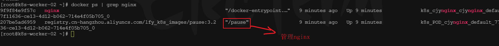
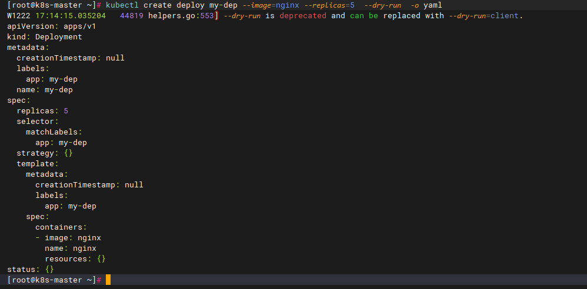
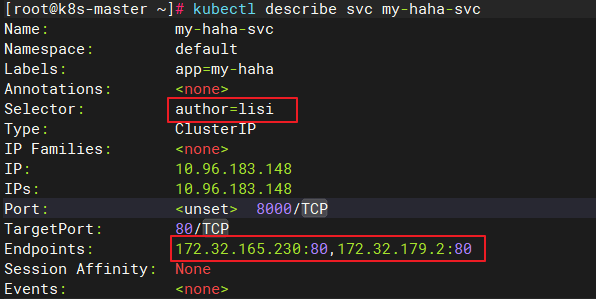

## Kubernetes核心实战

- [Kubernetes核心实战](#kubernetes核心实战)
  - [学习目标](#学习目标)
        - [掌握各种资源的使用	`√`](#掌握各种资源的使用)
  - [1、k8s之资源](#1k8s之资源)
  - [2、k8s之Namespace](#2k8s之namespace)
    - [Namespace作用](#namespace作用)
    - [创建Namespace](#创建namespace)
      - [命令行](#命令行)
      - [YAML配置方式创建](#yaml配置方式创建)
    - [删除Namespace](#删除namespace)
      - [命令行](#命令行-1)
      - [YAML](#yaml)
    - [查看名称空间资源](#查看名称空间资源)
  - [3、K8s之Pod](#3k8s之pod)
    - [Pod概念](#pod概念)
    - [容器化工具](#容器化工具)
    - [Pod里面可以运行多个容器](#pod里面可以运行多个容器)
    - [Pod命令操作](#pod命令操作)
      - [1、创建一个nginx镜像的pod应用](#1创建一个nginx镜像的pod应用)
      - [2、在cjy名称空间下面创建nginx镜像pod应用](#2在cjy名称空间下面创建nginx镜像pod应用)
      - [3、查看default名称空间的Pod](#3查看default名称空间的pod)
      - [4、查看cjy名称空间的Pod](#4查看cjy名称空间的pod)
      - [5、查看pod具体描述](#5查看pod具体描述)
      - [6、删除pod](#6删除pod)
      - [7、查看某个空间名称下的Pod运行日志, 不加-n默认找default](#7查看某个空间名称下的pod运行日志-不加-n默认找default)
      - [8、yaml创建pod单个container](#8yaml创建pod单个container)
      - [9、yaml创建pod多个container](#9yaml创建pod多个container)
      - [10、yaml删除pod](#10yaml删除pod)
      - [11、yaml文件如何生成](#11yaml文件如何生成)
      - [12、查看pod具体执行情况](#12查看pod具体执行情况)
      - [13、测试pod是否创建成功及pod互通访问能力](#13测试pod是否创建成功及pod互通访问能力)
      - [14、同一个pod不能启动相同容器（image）](#14同一个pod不能启动相同容器image)
      - [15、同一个pod启动相同容器（image）不同端口号可以不可以？](#15同一个pod启动相同容器image不同端口号可以不可以)
        - [查看资源规范：即查看资源使用手册](#查看资源规范即查看资源使用手册)
      - [16、**此时的应用还不能外部访问，只能集群内部访问这个Pod的IP**](#16此时的应用还不能外部访问只能集群内部访问这个pod的ip)
    - [pod内部原理](#pod内部原理)
  - [4、k8s之Deployment](#4k8s之deployment)
    - [记录](#记录)
    - [1、Deployment概念](#1deployment概念)
    - [2、Deployment命令操作](#2deployment命令操作)
      - [创建一次deployment部署](#创建一次deployment部署)
      - [获取部署信息](#获取部署信息)
      - [删除创建一次deployment部署](#删除创建一次deployment部署)
    - [3、自愈\&故障转移](#3自愈故障转移)
      - [删除pod发生什么](#删除pod发生什么)
    - [4、多副本](#4多副本)
    - [5、扩缩容](#5扩缩容)
      - [扩容](#扩容)
      - [缩容](#缩容)
      - [修改 replicas 进行扩缩容](#修改-replicas-进行扩缩容)
    - [6、滚动更新](#6滚动更新)
      - [Deployment命令操作实现---灰度滚动更新](#deployment命令操作实现---灰度滚动更新)
      - [也可以通过配置文件：Deployment 执行 `edit`执行更新](#也可以通过配置文件deployment-执行-edit执行更新)
    - [6、灰度发布](#6灰度发布)
      - [方案 1：上面的滚动更新（Deployment 原生支持）](#方案-1上面的滚动更新deployment-原生支持)
      - [其他方案见第七章节](#其他方案见第七章节)
    - [7、版本回退](#7版本回退)
      - [查看历史记录](#查看历史记录)
      - [查看某个历史详情](#查看某个历史详情)
      - [回滚到上一次](#回滚到上一次)
      - [回滚到指定版本](#回滚到指定版本)
      - [查看回滚状态](#查看回滚状态)
    - [8、Pod VS Deployment区别](#8pod-vs-deployment区别)
    - [9、Deployment标签语法](#9deployment标签语法)
    - [10、dashboard部署Deployment](#10dashboard部署deployment)
    - [11、其他工作负载](#11其他工作负载)
      - [StatefulSet](#statefulset)
      - [DaemonSet](#daemonset)
        - [vi  daemoSet.yaml](#vi--daemosetyaml)
        - [创建daemoSet](#创建daemoset)
        - [查看daemoSet](#查看daemoset)
        - [验证pod下线:](#验证pod下线)
      - [Job](#job)
        - [vi job.yaml](#vi-jobyaml)
      - [CronJob](#cronjob)
        - [vi cronjob.yaml](#vi-cronjobyaml)
        - [创建cronjob](#创建cronjob)
        - [报错信息](#报错信息)
  - [5、K8s之Service](#5k8s之service)
    - [Service之ClusterIP模式](#service之clusterip模式)
    - [Service之NodePort模式](#service之nodeport模式)
    - [Service之Labels使用](#service之labels使用)
  - [6、k8s之Ingress](#6k8s之ingress)
    - [1、安装](#1安装)
    - [2、使用](#2使用)
    - [测试环境](#测试环境)
    - [1、域名访问](#1域名访问)
    - [2、路径重写](#2路径重写)
    - [3、流量限制](#3流量限制)
  - [7、灰度发步](#7灰度发步)
    - [一、先明确：灰度发布的核心目标](#一先明确灰度发布的核心目标)
    - [二、Kubernetes 中 3 种主流灰度发布方案](#二kubernetes-中-3-种主流灰度发布方案)
    - [方案 1：RollingUpdate（滚动更新，Deployment 原生支持）](#方案-1rollingupdate滚动更新deployment-原生支持)
    - [方案 2：金丝雀发布（Canary，精确控制流量比例）](#方案-2金丝雀发布canary精确控制流量比例)
    - [方案 3：蓝绿部署（Blue/Green，零停机切换）](#方案-3蓝绿部署bluegreen零停机切换)


### 学习目标

###### 掌握各种资源的使用	`√`

### 1、k8s之资源

资源：Kubernetes中，所有的内容都被抽象为“资源”

> 在Kubernetes中，所有的内容都被抽象为“资源”，例如Pod、Service、Node等。这些资源在Kubernetes集群中表现为具体的实体，也被称为“对象”，它们是持久化的实体。例如，某个具体的Pod或某个具体的Node都可以被称为一个对象。
> 
> 对象的创建、删除、修改都是通过“Kubernetes API”，也就是“Api Server”组件提供的API接口进行的，这些接口是RESTful风格的Api，这与k8s的“万物皆对象”理念相符。命令行工具“kubectl”，实际上也是调用kubernetes api。
>
> 另外，Kubernetes中的资源通常可以被分类为以下三种类型：命名空间级别资源、集群级资源和元数据型资源，资源的申请、分配和使用等行为也是在k8s集群中进行管理的。
> - 命名空间资源：就是都是java学生资源，加了个班级分类隔离，每个班有每个班自己的java学生资源，就是个随着业务复杂性扩大，区分隔离性互不影响
> - 集群级资源：跨命名空间的，全局级别的使用的资源
> - 元数据型资源：就是修饰资源的资源，比如描述了该资源的一些属性特性
>   - 元数据：修饰数据的数据
>   - 元注解：修饰注解的注解


资源的创建

> #### Kubernetes中提供两种资源创建方式
>
> 第一种：
>
> ​		命令行：`kubectl create xxx`
> 
>        - 如：`kubectl create pod onePod`
>
> 第二种：**推荐**
>
> ​     YAML：`kubectl apply -f 你的yaml`： 让我们的部署创建资源的步骤持久化、可重现可回溯

kubectl create  --help

~~~
kubectl create --help 命令用于显示 kubectl create 命令的帮助信息。它提供了有关如何使用该命令创建资源对象的详细说明，包括可用选项、参数和示例等。通过查看帮助信息，用户可以更好地了解如何正确地使用 kubectl create 命令来创建所需的资源对象。
~~~


### 2、k8s之Namespace

#### Namespace作用

> 名称空间用来隔离资源
>
> 在Kubernetes中，Namespace扮演着非常关键的角色，它主要被用于实现多套环境的资源隔离或者多租户的资源隔离。默认情况下，Kubernetes集群中的所有Pod都是可以相互访问的，然而在实际环境中，可能出于安全或其他原因，不希望两个Pod之间相互访问。在这种情况下，将两个Pod划分到不同的Namespace下就成为了一种有效的解决方案。
> - 多环境：如生产环境，测试环境等
> - 多租户：如我这一套系统，给不同的业务线使用，就可以用命名空间每个业务线有自己的资源，互不干扰，业务线A与业务线B肯定不能相互访问资源，A不能查B的所属员工信息

>
> 通过将集群内部的资源分配到不同的Namespace中，Kubernetes可以实现逻辑上的隔离，以方便不同的资源进行隔离使用和管理。在不同的命名空间中，可以存在同名的资源，Namespace为资源提供了一个作用域。


- 哪些资源可以命名空间隔离？---dashboard面板里带N标识的都可以
  - 可隔离（带 N 标识）：绝大多数 “业务相关、可多实例部署” 的资源（如 Pod、Deployment、Service、ConfigMap 等），核心是按 “团队 / 环境 / 业务” 拆分资源，避免冲突。
    - 如机器资源配额也会隔离：prod环境限制使用量cpu3核3g内存，test环境限制1核1g内存
  - 不可隔离：“集群级基础设施或全局配置” 资源（如 Node、PV、CRD 等），核心是保证集群全局一致性和资源复用

#### 创建Namespace

##### 命令行

```bash
kubectl create ns cjy  #创建cjy名称空间
```

##### YAML配置方式创建

可以参考预执行方式：---其他资源都可以用这种方式生成模板内容

1. `kubectl create ns cjy-1 --dry-run -oyaml` 用该命令在终端生成标准yaml文件配置内容模板
2. `vim ns.yaml `复制内容保存在手动创建的ns.yaml文件里

```yaml
apiVersion: v1
kind: Namespace   #资源名称
metadata:
  name: cjy
  
-------


注释：
apiVersion: 指定Kubernetes API的版本号，这里使用的是v1版本。
kind: 指定要创建的资源类型，这里是Namespace。
metadata: 元数据，用于描述资源的属性信息。
name: 命名空间的名称，这里设置为"cjy"。
```

3. 最后执行命令： `kubectl apply -f namespace-cjy.yaml`
   1. -f: filename,指定要操作的配置文件

#### 删除Namespace

##### 命令行

````sh
kubectl delete ns cjy 
````

##### YAML

````bash
kubectl delete -f  ns.yaml
   # -f: filename,指定要操作的配置文件
````

#### 查看名称空间资源

````sh
kubectl get ns
````

### 3、K8s之Pod

#### Pod概念

pod不能管理不是自己创建的容器


> 运行中的`一组容器`，Pod是kubernetes中应用的最小单位.
>
> 根据Pod的设计初衷，如果你直接部署一个容器可能会更加容易，但是每个容器都有不同的配置和功能，这就需要Kubernetes对这些容器进行管理（如重启、检测等）。为了避免在容器这个实体上增加更多的属性，就产生了Pod这个概念。
>
> Pod是Kubernetes中最小的调度单元，它包含了一个或者多个紧密耦合的容器。这些容器处于同一个Pod中，共享同样的存储空间、IP地址和Port端口。Pod作为Kubernetes的基本调度单元，是Kubernetes的关键所在。
>
> Pod的主要组成部分有两个：用户程序所在的容器和Pause容器。用户程序所在的容器可以有一个或多个，用于运行具体的应用进程；而每个Pod都会有一个Pause容器，Pause容器的主要作用包括维护Pod的网络协议栈以及负责Pod及内部容器的生命周期管理
>  > - 如Pod里某个容器挂了，Pause容器负责监听重启该容器保证一直可用等
> > - 具体来说，它的生命周期与Pod的生命周期相同，即当Pod被创建时，Pause容器也会被同时创建；当Pod被删除时，Pause容器也会随之被删除。
>
> 


查看pod中包含的容器数量

`kubectl get pod -A -owide`

-A：查看所有命名空间的pod，默认只展示默认空间


- 目前显示：一个pod中只有一个容器
  - READY 列的格式是 “当前就绪的容器数/该 Pod 中总容器数”


#### 容器化工具

> 并不是只有docker能作为k8s的容器化工具


podman  最火 


> podman vs docker ：https://juejin.cn/post/7112334606430371854
>
> podman是一个开源的容器运行时项目，可以在大多数Linux平台上使用，它提供与Docker非常相似的功能。然而，与Docker不同，Podman不**需要在系统上运行任何守护进程**。这使Podman可以以非root用户身份运行容器，提高了安全性。
>
> Podman遵循OCI（开放容器倡议）规范，支持无根容器和rootless容器。无根容器是指在没有宿主机内核的情况下运行的容器，而rootless容器则是指不需要root权限就可以运行的容器。这两种特性使得Podman在安全性和资源使用上都有明显的优势。


#### Pod里面可以运行多个容器

> pod里面多个容器保持各自唯一的端口号

1. 从网络视角看，一个 Pod 就像一台 “独立的虚拟服务器”，Pod 内的多个容器相当于这台服务器上的多个进程 ---- 本质是操作系统级别的网络隔离机制
   1. 每个容器之间不能占用相同的端口号
   2. 每个pod都被分配了自己唯一的ip地址
   3. 每个pod里面的容器都可以通过localhost访问到其他容器
   4. 每个pod里面的容器都可以通过容器名访问到其他容器


2. 查看pod所有命名空间`kubectl get pod -A -o wide`


#### Pod命令操作

> 一般都是在Master主节点上操作集群相关命令，如创建Pod后，会自动分配到某个合适的工作Node节点上

##### 1、创建一个nginx镜像的pod应用

不指定名称空间，默认在default

````sh
kubectl run mynginx --image=nginx 
# mynginx是起的名称
````

1. 创建成功后，用docker查看镜像进程，有2个，1个是你的nginx容器，1个是Pod自带的Pause容器

##### 2、在cjy名称空间下面创建nginx镜像pod应用 

````sh
kubectl run mynginx --image=nginx -n cjy
````
1. 当用命令创建pod时，创建的 Pod 会由 Kubernetes 的 Scheduler（调度器） 自动分配到集群中的某个 Node（节点） 上
2. 用`kubectl get pod mynginx -n cjy -o wide`可查看具体分配在哪个Node上
3. 状态信息：ContainerCreating：Kubernetes中的Pod状
   1. ContainerCreating表示正在创建容器。当一个Pod被调度到某个节点上时，Kubernetes会为该Pod创建一个或多个容器，并启动这些容器。在这个过程中，Pod的状态就会变成ContainerCreating。
4. Pod的创建过程：`该命令查看kubectl describe pod <pod名称> -n <命名空间>`这个下图是创建Pod的过程

在ContainerCreating状态下，Kubernetes会检查容器所需的镜像是否存在，如果不存在则会拉取镜像；然后会检查容器所需的资源是否满足要求，如CPU、内存等；最后会启动容器并将它们与Pod关联起来。一旦所有容器都成功创建并启动，Pod的状态就会变成Running。
5. 查看容器的创建过程：如果在创建容器的过程中出现了错误，Pod的状态可能会变成Error或者CrashLoopBackOff等其他状态。在这种情况下，需要查看Pod的事件和日志来了解具体的错误原因并进行相应的处理。
   1. 查看日志命令： `kubectl logs -f pod名称`
   2. 

TODO－－－－－－

##### 3、查看default名称空间的Pod

````
kubectl get pod
````


##### 4、查看cjy名称空间的Pod

````
kubectl get pod -n cjy
````


##### 5、查看pod具体描述

`kubectl describe pod <pod名称> -n <命名空间>`

````
NAME      READY   STATUS    RESTARTS   AGE
mynginx   1/1     Running   0          2m51s

这是一个Kubernetes中Pod的状态信息，表示名为mynginx的Pod已经运行了2分51秒，状态为Running。
````
1. 这个下图是创建Pod的过程

2. 我想查看内部创建容器的过程


帮助命令：

kubectl run --help

~~~
kubectl run命令用于在Kubernetes集群中创建并运行Pod。以下是该命令的常用选项和参数：

--help：显示帮助信息，包括可用选项和参数的描述。
--name=<pod_name>：指定要创建的Pod的名称。
--image=<image_name>：指定要使用的容器镜像名称。
--restart=<restart_policy>：指定容器重启策略，可选值为"Always"、"OnFailure"或"Never"。
--port=<port>：指定容器监听的端口号。
--env=<key>=<value>：设置环境变量，例如--env=MY_VARIABLE=my_value。
--volume=<volume_name>：将本地文件或目录挂载到容器中，例如--volume=/path/to/local/file:/container/path。
--command=<command>：在容器启动时执行的命令，例如--command="echo Hello, World!"。
--dry-run：模拟运行命令，但不实际执行。
~~~


##### 6、删除pod

> 最好指定名称空间，防止误删

````
kubectl delete pod Pod名字 -n 名称空间

例如：
kubectl delete pod mynginx -n cjy
注意：可以实现批量删除，使用空格间隔即可
````

##### 7、查看某个空间名称下的Pod运行日志, 不加-n默认找default

````
kubectl logs Pod名字  -n 空间名称

````

##### 8、yaml创建pod单个container

可以根据命令行创建的方式，收集yaml编写的方式

kubectl run myapp --image=nginx -n hello --dry-run -oyaml

```yaml
vim pod.yaml

apiVersion: v1
kind: Pod
metadata:
  #labels:
    #run: cjy-nginx
  name: cjy-nginx
#  namespace: default
spec:
  containers:
  - image: nginx
    name: cjy-nginx

kubectl apply -f pod.yaml

属性说明：
apiVersion: 指定Kubernetes API的版本号，这里使用的是v1版本。
kind: 指定资源类型，这里是Pod。
metadata: 元数据，用于描述资源的属性信息。
   - labels: 标签，给当前Pod添加标签，方便查询和管理

name: Pod的名称，这里设置为cjy-nginx。
spec: Pod的详细配置信息。
containers: Pod中包含的容器列表。
image: 容器使用的镜像名称，这里使用的是nginx。
name: 容器的名称，这里也设置为cjy-nginx。

ClusterFirst意味着当Pod尝试解析DNS名称时，会优先使用集群内部的DNS服务（如kube-dns或CoreDNS）进行解析
```


##### 9、yaml创建pod多个container

```yaml
apiVersion: v1
kind: Pod
metadata:
  labels:
    run: myapp
  name: myapp
spec:
  containers:
  - image: nginx
    name: nginx
  - image: tomcat:8.5.68
    name: tomcat
```


##### 10、yaml删除pod

````
kubectl delete -f yaml文件
````


##### 11、yaml文件如何生成

````sh
kubectl run cjynginx --image=nginx  -n cjy  --dry-run -o yaml  #生成yaml文件

这是一个使用kubectl命令行工具运行名为cjynginx的Pod的命令，其中使用了nginx镜像，命名空间为cjy，并使用dry-run模式进行测试。输出结果将以YAML格式显示。

解析：
    使用kubectl run命令创建名为myapp的Pod。
    使用--image参数指定镜像为nginx。
    使用-n参数指定命名空间为hello。
    使用--dry-run参数进行测试，不实际执行操作。
    使用-oyaml参数将输出结果以YAML格式显示。
````


##### 12、查看pod具体执行情况

````sh
kubectl describe pod 你自己的Pod名字
````


> Kubernetes创建Pod的执行流程如下：
>
> 1. 用户通过kubectl或其他API客户端提交一个创建Pod的请求。
> 2. API服务器接收到请求后，将请求转发给调度器（Scheduler）。
> 3. 调度器根据预定义的策略（如资源需求、亲和性规则等）选择一个可用的节点来运行Pod。
> 4. 调度器将Pod的信息（如容器镜像、环境变量等）发送给Kubelet厂长（运行在选定节点上的组件）。
> 5. Kubelet接收到Pod信息后，会检查本地是否存在与Pod匹配的容器镜像。如果不存在，Kubelet会向Docker或其他容器运行时拉取镜像。
> 6. Kubelet为Pod创建一个容器就叫Pod容器，Pod容器里有很多docker容器应用，并将容器运行在选定的节点上。同时，Kubelet（calico）还会为Pod分配一个唯一的IP地址，以便其他容器可以通过这个IP地址访问Pod中的服务，每个Pod容器像一个模拟的独立服务器一样，有自己的IP地址等。

> 7. 当所有容器都启动并运行成功后，Kubelet会向API服务器报告Pod的状态。
> 8. API服务器更新集群状态，并将结果返回给用户。至此，Pod创建成功。

##### 13、测试pod是否创建成功及pod互通访问能力


- 集群中的任意一个机器Node节点以及任意的pod里的容器应用都能通过Pod分配的ip来访问这个Pod
- 每个node有自己物理服务器ip，node里的每个pod都有自己的独立ip，同节点的pod或跨节点的pod可以直接通过pod的ip相互访问，不用理会node的ip
- 同一个pod内的应用之间可以通过localhost 回环地址访问

````sh
# 查看pod分配到哪个node
kubectl get pod -owide
显示结果：查看IP
[root@k8s-master ~]# kubectl get pod -owide
NAME      READY   STATUS    RESTARTS   AGE   IP               NODE     NOMINATED NODE   READINESS GATES
mynginx   1/1     Running   0          98m   192.168.169.136   k8s-03   <none>           <none>

# 使用Pod的ip+pod里面运行容器的端口
curl 192.168.169.136:80
````


同一个pod可以通过localhost 回环地址访问


##### 14、同一个pod不能启动相同容器（image）

简单理解：一个pod分配一个唯一的IP,拥有一个唯一的IP，就像是一台计算机，如果默认安装相同的容器，就会出现端口冲突的问题，当然如果同一个容器用不同的端口，**理论上**是可以实现的。

````sh
apiVersion: v1
kind: Pod
metadata:
  labels:
    run: cjy-nginx
  name: cjy-nginx

spec:
  containers:
  - image: nginx
    name: cjy-nginx
  - image: nginx
    name: cjy-nginx1
````

查看pod具体信息

````sh
kubectl describe pod cjy-nginx
````


````sh
kubectl get pod  -o wide
````


##### 15、同一个pod启动相同容器（image）不同端口号可以不可以？

> 首先是肯定 不能有相同端口，下面看下不同端口可不可以
>
> 在同一个Pod中，可以使用相同的镜像运行不同的容器并监听不同的端口号。这是Kubernetes支持的多容器部署模型，其中每个容器可以通过localhost地址进行交互。
>
> 例如，在一个Pod中可以同时运行两个nginx容器，分别监听80端口和8080端口。这在微服务架构中有时非常有用，例如，你可能有一个前端应用运行在80端口，一个后端应用运行在8080端口，这两个应用可以放在同一个Pod中，通过各自的端口提供服务。
>
> 此外，这些容器共享同一个网络命名空间和IP地址，因此它们之间的通信可以通过localhost直接进行。如果需要将Pod中的多个容器的服务暴露给外部访问，可以通过在一个服务中暴露多个端口来实现。

###### <font color = red>查看资源规范：即查看资源使用手册</font>

````sh
# 查看pod或pods
kubectl explain pod/pods
# 查看pod下的spec下的containers的属性用法手册

kubectl explain pod.spec.containers
````


`但是目前创建Pod中相同镜像不同端口号的时候遇到了问题：kubectl apply -f mynginx.yaml`

````
apiVersion: v1
kind: Pod
metadata:
  labels:
    run: cjy-nginx
  name: cjy-nginx
spec:
  containers:
  - image: nginx
    name: cjy-nginx
    ports:
    - hostPort: 88
      containerPort: 80
  - image: nginx
    name: cjy-nginx1
    ports:
    - hostPort: 80
      containerPort: 89
      
- containerPort是指容器内部应用程序监听的端口，这是容器化应用程序对外提供服务时所暴露的端口

- hostPort则是将宿主机上的特定端口映射到运行在Pod内部容器的端口
````

`运行命令查看，发现创建失败了：**kubectl describe pod cjy-nginx**`


****

查看pod日志

kubectl logs -f pod命令

查看 指定pod中容器日志

kubectl logs pod名称 -c 容器名称-n 名称空间名称

例如：kubectl logs cjy-nginx -c cjy-nginx1

**最终结论**

**·----【测试结果最终发现】：即使上面2组ports相同镜像nginx的containerPort和hostPort都不相同，实际创建Pod还是会失败，因为

1. containerPort：核心作用是告诉 K8s 和开发者 “这个容器的应用在内部监听哪个端口”（比如 Nginx 监听 80，MySQL 监听 3306
   1. 该字段只是声明作用（类似docker配置文件那样），它不直接控制容器内的应用（应用实际监听的端口由自身配置决定，比如 Nginx 的配置文件
   2. `要想一个Pod内相同容器不同端口号生效，还得具体修改容器nginx里的配置文件才可以，修改实际监听的端口号`
2. hostPort：把容器端口 “暴露到宿主机Node节点，由Pod网络栈到Node节点的网络协议栈”，**本质上是端口映射**

**-----`后面我们想要搭建集群时，记住修改具体配置文件的方式也是不推荐的，后面推荐通过多个Pod来实现`**


##### 16、**此时的应用还不能外部访问，只能集群内部访问这个Pod的IP** 

> http://47.94.250.230:80


#### pod内部原理





- 案例演示：如果手动删除Pod里的docker容器-->pause管理docker-->重新自我恢复，只能去通过修改Pod的启动配置文件间接让容器删除
  - 保存退出Pod配置文件编辑器，K8s 会自动更新 Pod，删除目标容器。


简而言之，Pod是一个相对大的单位，它包含了一组紧密关联的应用容器；而pause容器是为了保证Pod中容器间通信的特殊容器

pod的访问结论：

~~~
所有pod默认在集群内部互通，每一个pod都有一个唯一的IP,都是有Calico网络组件的IP池分配的

情况一：pod之间访问，根据pod的IP
例如：curl curl 172.32.165.196:8080
情况二：pod内部访问，使用localhost
例如：curl curl localhost:8080
~~~


### 4、k8s之Deployment

> 就是来创建集群部署的，https://kubernetes.io/zh-cn/docs/concepts/workloads/controllers/deployment/
>
> Deployment是Kubernetes中的一个重要组件，它是一个定义及管理多副本应用（即多个副本 Pod）的新一代对象 ，Deployment控制器并不直接管理pod，而是通过管理replicaset来间接管理pod，即：deployment管理replicaset，replicaset管理pod。
>

#### 记录

1. Deployment适合搭建集群，单纯的Pod不适合
2. Deployment是用来创建集群的，通过副本，创建一模一样的Pod的集群的，指定replicase为3，就知道你要创建集群，创建3个一模一样的Pod集群在不同的节点上
   1. 而且负责管理这跨不同Node的3个Pod的生命周期，确保它们的数量和状态与Deployment对象的定义一致。要是有Pod挂了自动新建1个（与Pod的Pause管理类似）
   2. 


#### 1、Deployment概念

> 控制Pod，使Pod拥有多副本，自愈，扩缩容等能力， 线上完成真正的部署
>
> Deployment实现管理Pod的具体思路如下：
>
> 1. 用户通过YAML文件定义了一个Deployment对象，包括Pod的模板、副本数等信息。
> 2. Controller Manager控制器管理中心中的Deployment控制器会将该YAML文件解析成一个Deployment对象，并将其存储在ETCD中。
> 3. Deployment控制器会定期检查Deployment对象的状态，如果发现有新的Pod副本需要创建或已有的Pod副本需要删除，则会创建一个ReplicaSet对象来管理这些Pod副本。
> 4. ReplicaSet对象会根据Deployment对象中的副本数信息，控制Pod副本的数量，并确保每个Pod副本都处于运行状态。
> 5. 如果某个Pod副本出现故障或被删除，ReplicaSet对象会自动创建一个新的Pod副本来替代它，以保证Deployment对象中指定的副本数始终得到满足。
> 6. 如果用户修改了Deployment对象的定义（例如增加了副本数），则Deployment控制器会重新创建一个ReplicaSet对象，并根据新的副本数信息更新Pod副本数量。
> 7. 如果用户需要回滚到之前的版本，可以通过修改Deployment对象的版本号来实现。Deployment控制器会停止当前正在运行的Pod副本，并根据旧版本的配置创建新的Pod副本，从而实现版本的滚动更新和版本回退。


#### 2、Deployment命令操作

##### 创建一次deployment部署

````sh
kubectl create deployment mytomcat --image=tomcat:8.5.68


具体解释如下：

kubectl：是Kubernetes的命令行工具，用于与Kubernetes集群进行交互。
create：表示要执行的操作是创建一个新的资源。
deployment：是要创建的资源类型，即部署。deploy
mytomcat：是部署的名称。
--image=tomcat:8.5.68：是部署使用的镜像及其版本号。这里使用的是名为tomcat的镜像，版本号为8.5.68。
````


##### 获取部署信息

````sh
kubectl get deploy

kubectl get deploy命令获取的信息包括以下内容：
名称（Name）：部署的名称。
命名空间（Namespace）：部署所在的命名空间。
副本数（Replicas）：部署中运行的Pod副本数量。
标签选择器（Label Selector）：用于选择要部署的Pod的标签。
创建时间（Created）：部署创建的时间。
更新时间（Updated）：部署最后一次更新的时间。
状态（Status）：部署的状态，包括是否正在运行、是否有错误等。
描述（Description）：部署的描述信息。
````


##### 删除创建一次deployment部署

````
kubectl delete deploy mytomcat


具体解释如下：
kubectl：是Kubernetes的命令行工具，用于与Kubernetes集群进行交互。
delete：表示要执行的操作是删除一个资源。
deployment：是要删除的资源类型，即部署。
mytomcat：是要删除的部署的名称。
````

#### 3、自愈&故障转移

- 停机
- 删除Pod
- 容器崩溃
- ....

> Deployment的自愈和故障转移是Kubernetes中的重要特性，它们可以确保应用程序的高可用性和稳定性。
>
> 自愈是指当Pod发生故障或被删除时，Deployment控制器会自动创建新的Pod来替代它，以保证Deployment对象中指定的副本数始终得到满足。如果某个Pod副本无法正常启动或崩溃了，Deployment控制器会检测到这个问题并尝试重新启动该Pod。如果重启失败，则会重新创建一个新的Pod副本来替代它。
>
> 故障转移是指当某个节点上的Pod发生故障或被删除时，Deployment控制器会自动将该Pod迁移到其他可用节点上运行。这可以通过修改Pod的标签来实现，让Deployment控制器知道哪些节点是可用的。如果某个节点上的Pod数量不足，Deployment控制器会在其他节点上创建新的Pod副本来满足需求。
>
> 总之，Deployment的自愈和故障转移机制可以帮助我们自动处理应用程序中的故障和问题，提高应用程序的稳定性和可靠性。


##### 删除pod发生什么

* deploy会不会删除？
* pod会不会删除？
* docker容器会不会删除？

````sh
#执行删除pod中的tomcat容器
kubectl delete pod mytomcat-58b8488d44-xgv59
#删除后，执行监控pod
watch -n 1 kubectl get pod
#结论：此处删除是模拟某个容器因为一些不可预计的原因导致容器崩溃，通过监控的得知，删除deployment会重新重建新的容器提供服务
````


````sh
kubectl delete deploy mytomcat
````


#### 4、多副本

> 查看命令帮助  kubectl create deployment --help
>
> Deployment的多副本是指将应用程序部署到多个Pod中，以提高应用程序的可用性和可靠性。
>
> 在Kubernetes中，一个Deployment对象可以管理多个Pod副本，每个副本都是独立的，并且它们之间没有任何共享状态或数据。当Deployment控制器创建新的Pod副本时，它会使用相同的镜像和配置来启动这些Pod，确保它们具有相同的状态和行为。
>
> 通过将应用程序部署到多个Pod副本中，我们可以实现以下功能：
>
> 1. 高可用性：如果某个Pod副本发生故障或被删除，Deployment控制器会自动创建新的Pod副本来替代它，保证应用程序始终处于运行状态。
> 2. 负载均衡：当有多个Pod副本运行时，Kubernetes会将流量自动分发到这些Pod上，以实现负载均衡。这可以提高应用程序的性能和吞吐量。
> 3. 容错性：如果某个Pod副本出现错误或崩溃了，其他Pod副本仍然可以继续提供服务，从而保证应用程序的稳定性和可靠性。
> 4. 扩展性：通过增加Pod副本的数量，我们可以提高应用程序的处理能力，以满足不断增长的负载需求。

```bash
kubectl create deployment my-dep --image=nginx --replicas=3
```


```yaml
apiVersion: apps/v1
kind: Deployment
metadata:
  labels:
    app: my-dep
  name: my-dep
spec:
  replicas: 3
  selector:
    matchLabels:
      app: my-dep
  template:
    metadata:
      labels:
        app: my-dep
    spec:
      containers:
      - image: nginx
        name: nginx
        
        


     
配置说明：
这是一个Kubernetes的Deployment配置文件，用于部署一个名为"my-dep"的应用程序。下面是各个属性的解释：
apiVersion: 指定了Kubernetes API的版本，这里是"apps/v1"，表示使用的是Kubernetes的应用API版本。
kind: 指定了资源的类型，这里是"Deployment"，表示要创建的资源是一个Deployment对象。
metadata: 包含了关于Deployment对象的元数据信息。
labels: 定义了Deployment对象的标签，这里只有一个标签"app: my-dep"。
name: 指定了Deployment对象的名称，这里是"my-dep"。
spec: 包含了Deployment对象的具体配置信息。
replicas: 指定了Deployment对象中副本的数量，这里是3个。
selector: 定义了如何选择要管理的Pod对象。
matchLabels: 指定了要匹配的标签，这里只有一个标签"app: my-dep"。
template: 定义了Pod对象的模板。
metadata: 包含了Pod对象的元数据信息。
labels: 定义了Pod对象的标签，这里只有一个标签"app: my-dep"。
spec: 包含了Pod对象的具体配置信息。
containers: 定义了容器的配置信息。
image: 指定了容器使用的镜像，这里是"nginx"。
name: 指定了容器的名称，这里是"nginx"。
```


#### 5、扩缩容

> kubectl scale --help
>
> 在Kubernetes中，可以使用Deployment对象来管理应用程序的扩缩容。
>
> **扩容**：当需要增加应用程序的处理能力时，可以通过修改Deployment对象的`replicas`属性来实现扩容。例如，将`replicas`的值从3增加到5，则Kubernetes会自动创建2个新的Pod副本来满足需求。
>
> **缩容**：当不需要那么多的Pod副本时，可以通过修改Deployment对象的`replicas`属性来实现缩容。例如，将`replicas`的值从5减少到3，则Kubernetes会自动删除2个旧的Pod副本来达到缩容的目的。
>
> 需要注意的是，在进行扩缩容操作时，Kubernetes会根据Deployment对象的配置信息自动创建或删除Pod副本，并确保新的Pod副本与旧的Pod副本具有相同的状态和行为

--- 进行扩缩容的应用必须是无状态的，有状态的应用不能进行扩缩容（如张三访问这个服务器时有些交互的相互记录着状态数据，下次换了其他服务器数据就丢失了）


#####  扩容

```bash
#调整副本数量到5
kubectl scale --replicas=5 deployment/my-dep 

kubectl scale 命令用于调整Kubernetes中Deployment资源对象的副本数量。
以下是 kubectl scale 命令的常用选项：
--replicas=<number>：指定要创建或删除的Pod副本数量。
--current-replicas=<number>：指定当前存在的Pod副本数量。
--min=<number>：指定最小副本数量。
--max=<number>：指定最大副本数量。
--cpu-percent=<percentage>：指定CPU使用率百分比，当达到该值时，Kubernetes会自动扩展Pod副本的数量。
--memory-percent=<percentage>：指定内存使用率百分比，当达到该值时，Kubernetes会自动扩展Pod副本的数量。
```


##### 缩容

````sh
kubectl scale --replicas=2 deployment/my-dep 
````


##### 修改 replicas 进行扩缩容

```bash
kubectl edit deployment my-dep

命令用于编辑名为my-dep的部署对象。通过该命令，可以对部署的配置进行修改，例如更改镜像、更新容器规格等。
```


结论：通过配置修改的方式，修改保存后可以直接生效


#### 6、滚动更新

- 场景：当线上运行了应用的版本v1时，这时候有需求迭代增加了新功能，需要升级到v2新功能版本，这时候不能瞬间停掉所有线上v1的服务再换新v2服务，因为同时会面临线上用户请求 ------> 就需要使用滚动更新


滚动更新是Kubernetes中的一种更新策略，用于逐步替换旧的Pod副本，而不是一次性替换所有副本。这样可以确保在更新过程中应用程序的稳定性和可用性。

使用滚动更新时，需要指定以下参数：

- `--update-period`：更新间隔时间，单位为秒。默认值为120秒。
- `--timeout`：更新超时时间，单位为秒。默认值为600秒。
- `--strategy`：更新策略，可选值为"RollingUpdate"、"Recreate"或"RollingRestart"。默认值为"RollingUpdate"。
  1. RollingUpdate：滚动更新策略，会逐步替换旧的Pod副本，直到所有副本都更新完毕。这种策略可以保证在更新过程中应用程序的稳定性和可用性。
     1. 更新 Pod 模板（如镜像版本、环境变量等）并替换旧 Pod
     2. 应用版本升级、配置永久变更等 “换版本” 场景
     3. 直接修改 Deployment 模板（如 kubectl set image），Pod配置更新了
  2. Recreate：重建策略，会删除所有旧的Pod副本，然后创建新的Pod副本。这种策略可能会导致短暂的服务中断，但可以确保应用程序的状态保持一致。
  3. RollingRestart：滚动重启策略，会逐步重启旧的Pod副本，直到所有副本都重启完毕。这种策略可以在不影响应用程序性能的情况下，快速地重启Pod副本。
     1. 重启现有 Pod，新 Pod 与旧 Pod 完全一致（仅进程重启）       
     2. 刷新配置、清理缓存、修复临时故障等 “不换版本” 场景 
     3. kubectl rollout restart deployment/<名称>                 

##### Deployment命令操作实现---灰度滚动更新

 ````sh
kubectl set image deployment/my-dep nginx=nginx:1.16.1 --record

这个命令用于更新名为my-dep的部署中的nginx容器镜像为nginx:1.16.1，并记录更新历史。

属性说明：
deployment/my-dep：指定要更新的部署名称为my-dep。
nginx=nginx:1.16.1：指定要更新的容器镜像为nginx:1.16.1。
--record：将更新操作记录到Kubernetes API服务器中，以便跟踪和管理。
 ````


#####  也可以通过配置文件：Deployment 执行 `edit`执行更新

```bash
kubectl edit deployment/my-dep

``` 


#### 6、灰度发布

> 灰度发布是一种将新版本的应用程序逐步推向生产环境的策略，以便在不影响整个系统稳定性的情况下进行测试和验证。在Kubernetes中，可以使用Deployment对象的RollingUpdate策略来实现灰度发布。
>
> 灰度发布（又称 “渐进式发布”）的核心是 **“流量逐步切换”**：让新版本应用先接收少量流量，验证无问题后再逐步扩大范围，最终全量切换，以此将故障影响控制在最小范围。
K8s 中实现这一目标的核心工具是 “标签（Label）+ 标签选择器（Selector）”—— 通过动态调整标签与选择器的匹配关系，控制流量流向（旧版本 / 新版本 Pod）。

一、Kubernetes 中 3 种主流灰度发布方案

##### 方案 1：上面的滚动更新（Deployment 原生支持）

这是 K8s 最基础的灰度方式，通过逐步替换旧版本 Pod 实现更新，适用于对流量中断不敏感的场景。

原理：
  - 旧 Deployment 会逐步删除旧 Pod，同时创建新 Pod（基于新镜像 / 配置）；
  - 过程中通过 maxSurge（最多可超出期望副本数的比例，默认 25%）和 maxUnavailable（更新过程中最多不可用的比例，默认 25%）控制更新速度。
    - 通过控制 “替换速度” 实现 “新版本流量占比逐步提升” 的灰度效果

操作步骤：
```YAML
# 初始 Deployment（v1 版本）:deployment-v1.yaml
apiVersion: apps/v1
kind: Deployment
metadata:
  name: my-app
spec:
  replicas: 4  # 共4个副本
  selector:
    matchLabels:
      app: my-app
  strategy:
    type: RollingUpdate  # 滚动更新策略（默认）
    rollingUpdate:
      maxSurge: 1        # 最多可多创建1个Pod（4+1=5）
      maxUnavailable: 0  # 更新过程中不允许有不可用Pod（更严格）----就是加上版本和旧版本共存的，始终维持可用的是4个
  template:
    metadata:
      labels: # 标签是键值对类的配置
        app: my-app
        version: v1  # 版本标签
    spec:
      containers:
      - name: my-app
        image: my-app:v1  # 旧版本镜像
        ports:
        - containerPort: 80
``` 
- 直接修改 Deployment配置文件，K8s 会自动触发滚动更新
  - `kubectl edit deployment nginx-deploy`
    - 改新镜像
    - 改版本标签，仅作标签标识
- `kubectl rollout undo deployment/my-app`  # 若出现问题-回滚到上一版本

优缺点
1. 原生支持，无需额外工具，操作简单
2. 流量切换比例固定（由副本数决定），无法精确控制（如仅让 10% 流量到新版本）
   1. 是自动灰度的，无法手动控制流量切换比例

##### 其他方案见第七章节

如用金丝雀方案的新旧版本Deployment同时部署手动精确调整各自的副本占比，实现灰度发布

#### 7、版本回退

> Deployment的版本回退是指将部署的应用程序从当前版本回退到之前的版本。这通常在以下情况下使用：
>
> 1. 发现新版本存在问题：当部署了新版本的应用程序后，发现该版本存在严重的bug或者功能异常时，需要将其回退到之前的版本以保持系统的正常运行。
> 2. 进行紧急修复：当发现当前版本的应用程序存在漏洞或者安全风险时，需要立即回退到之前的版本以修复问题。
> 3. 测试新功能：在部署新版本的应用程序之前，可能需要先在测试环境中进行验证和测试。如果测试不通过，需要将应用程序回退到之前的版本。
>
> 总之，Deployment的版本回退可以帮助管理员快速恢复到之前的稳定版本，以确保系统的稳定性和安全性。

##### 查看历史记录


````sh
kubectl rollout history deployment/my-dep
````


##### 查看某个历史详情


````sh
kubectl rollout history deployment/my-dep --revision=2


详情内容如下：
Labels: 定义了Deployment对象的标签，这里只有一个标签app=my-dep。
Pod Template: 定义了Deployment对象的Pod模板，包括容器镜像、端口等信息。
Containers: 定义了Pod模板中的容器，这里只有一个容器nginx。
Image: 指定了容器使用的镜像为nginx。
Port: 指定了容器使用的端口为，表示容器不会监听任何端口。
Host Port: 指定了容器使用的主机端口为，表示容器不会将容器内的端口映射到主机上的端口。
Environment: 指定了容器的环境变量为，表示容器内没有环境变量。
Mounts: 指定了容器的挂载点为，表示容器内没有挂载点。
Volumes: 指定了容器的卷为，表示容器内没有卷。
根据这个配置文件，可以创建一个名为my-dep的Deployment对象，其中包含一个使用nginx镜像的容器。
````


##### 回滚到上一次

````
kubectl rollout undo deployment/my-dep

属性说明：
kubectl: Kubernetes命令行工具，用于与Kubernetes集群进行交互。
rollout: 子命令，用于管理部署的滚动更新操作。
undo: 指定撤销部署的操作。
deployment/my-dep: 要撤销的部署的名称。
````


##### 回滚到指定版本

````sh
kubectl rollout undo deployment/my-dep --to-revision=2
````


##### 查看回滚状态

```bash
kubectl rollout status deployment/my-dep
```


#### 8、Pod VS Deployment区别

> Pod和Deployment都是Kubernetes中的核心概念，它们在部署和管理应用程序方面扮演着不同的角色。
>
> Pod是Kubernetes的最小调度单位，它可以**包含一个或多个紧密关联的容器**。这些容器共享网络和存储资源，因此Pod提供了一个抽象层，用于将多个容器组织在一起，以便它们可以一起运行在同一节点上。Pod的主要特点包括：
>
> 1. **共享资源**：Pod内的容器可以共享相同的网络和存储资源，这使得它们能够更好地协同工作。
> 2. **生命周期管理**：Pod有自己的生命周期，可以通过定义控制器来管理其创建、启动、停止和删除等操作。
> 3. **自治性**：Pod内的容器通常是相同应用的不同实例，它们可以独立地进行扩展、更新和恢复。
>
> Deployment则是**用于管理Pod的**高级对象。它提供了一种声明式的方法来描述所需的Pod状态，并负责实现这些状态的实际部署过程。Deployment的主要特点包括： ---------------- 【Deployment用来创建集群，创建多个一模一样的副本进行集群化部署】
>
> 1. **版本控制**：Deployment支持多个版本的Pod，可以根据需要进行升级和回滚操作。每个版本都有一个唯一的标识符，以便进行区分和管理。
> 2. **滚动更新**：Deployment支持滚动更新，即在更新Pod时逐步替换旧版本的Pod，以确保系统的稳定性和可用性。
> 3. **自动扩缩容**：Deployment可以根据指定的指标自动扩展或缩小Pod的数量，以满足应用程序的性能需求。
> 4. **回滚策略**：如果新的部署出现问题，可以使用Deployment提供的回滚功能将系统恢复到之前的版本。
>
> 总的来说，Pod是一个基本的构建块，用于组织和管理容器的集合，而Deployment是一种更高级别的抽象，用于描述和管理Pod的生命周期和版本控制。在实际使用中，通常使用Deployment来描述应用程序的期望状态，并由Kubernetes负责确保该状态的实际实现。
>
> **结论**：以后部署全部使用Deployment


#### 9、Deployment标签语法


语法指令一：kubectl get deploy,pod -o wide


语法指令二：kubectl create deploy my-dep --image=nginx --replicas=5  --dry-run  -o yaml （预执行）

--dry-run:预执行

-o yaml:将创建deploy的构造结构详情输入为yaml格式


~~~yaml
apiVersion: apps/v1
kind: Deployment   # 资源类型
metadata: # 元数据
  labels: # 给自己打标签，目的是上层建筑可以选择对应标签的deployment
    app: my-dep
  name: my-dep
spec: # 规格
  replicas: 3 # 副本
  selector: # 选择器，对下级的选择
    matchLabels: # 选择下级Pod的标签（创建Pod本身默认也是有标签的）
      app: my-tomcat
  template:
    metadata:
      labels:
        app: my-dep
    spec:
      containers:
      - image: nginx
        name: nginx


~~~


- `**任何资源都可以打标签**`


标签语法实现：

 第一步：vim创建.yaml文件

第二步：编辑如下内容

第三部：kubectl apply -f 文件名

````yaml
apiVersion: apps/v1
kind: Deployment
metadata:
  creationTimestamp: null
  labels: # 自身标签
    app: my-dep
  name: my-dep
spec:
  replicas: 2
  selector:
    matchLabels: # 选择的下级标签
      app: my-dep
  strategy: {}
  template:
    metadata:
      creationTimestamp: null
      labels:
        app: my-dep
    spec:
      containers:
      - image: nginx
        name: nginx
        resources: {}
status: {}

apiVersion: apps/v1：指定了API的版本为apps/v1，这是Kubernetes中用于管理应用程序的API版本。
kind: Deployment：指定了要创建的资源类型为Deployment，即部署。
metadata:：包含了关于该资源的元数据信息。
creationTimestamp: null：表示该资源尚未创建。
labels:：定义了资源的标签，这里使用了app: my-dep作为标签，用于标识这个部署属于哪个应用程序。
name: my-dep：指定了资源的名称为"my-dep"。
spec:：包含了部署的配置信息。
replicas: 5：指定了需要运行的副本数量为5。
selector:：定义了选择器，用于选择哪些Pod应该被这个部署管理。
matchLabels:：匹配具有相同标签的Pod。
app: my-dep：要求Pod的标签中包含app: my-dep。
strategy: {}：指定了更新策略，这里没有指定任何策略，因此默认使用滚动更新）策略。
template:：定义了Pod的模板。
metadata:：包含了Pod的元数据信息。
creationTimestamp: null：表示该Pod尚未创建。
labels:：定义了Pod的标签，这里使用了app: my-dep作为标签，用于标识这个Pod属于哪个应用程序。
spec:：包含了Pod的配置信息。
containers:：定义了容器列表。
- image: nginx：指定了容器使用的镜像为nginx。
name: nginx：指定了容器的名称为"nginx"。
resources: {}：指定了容器的资源限制和请求，这里没有指定任何限制或请求。
status: {}：包含了有关该资源状态的信息。在这个例子中，状态为空，因为没有实际的Pod被创建。
````


#### 10、dashboard部署Deployment


#### 11、其他工作负载

- deployment的特点就是通过副本控制Pod，其他类型的控制器都是不同方式控制Pod的（deployment只是工作负载的一种）

> 在 Kubernetes 中，工作负载（Workload）是在集群上运行的应用程序。这些应用程序可以是单个组件，也可以是由多个一同工作的组件构成。工作负载在 Kubernetes 中由一组 Pod 表示，而 Pod 则是集群上处于运行状态的一组容器的集合。
>
> 工作负载的主要类型包括：
>
> - **无状态应用**: 无状态应用是指不需要保持任何状态信息的应用程序。无状态应用通常使用 ReplicaSet 进行管理，ReplicaSet 用于解决 pod 的扩容和缩容问题。
> - **有状态应用**: 有状态应用需要保持状态信息，例如数据库等。有状态应用通常使用 StatefulSet 进行管理，StatefulSet 可以保证有状态应用的稳定运行和有序扩展。
>
> 更多：
> 除了Deployment，k8s还有 `StatefulSet` 、`DaemonSet` 、`Job`  等 类型资源。我们都称为 `工作负载`。
> 有状态应用使用  `StatefulSet`  部署，无状态应用使用 `Deployment` 部署
> [https://kubernetes.io/zh/docs/concepts/workloads/controllers/](https://kubernetes.io/zh/docs/concepts/workloads/controllers/)
>
> 详细说明：
>
> `StatefulSet`、`DaemonSet`和`Job`是Kubernetes中常用的控制器，每个控制器都有其特定的功能和使用场景。
>
> - `StatefulSet`：类似于`ReplicaSet`，但为了处理有状态应用，它为每个Pod维护了一个稳定的、唯一的网络标识符和持久化的存储。其主要特点包括有序的、优雅的部署和缩放，有序的、优雅的删除和终止，以及有序的、自动滚动更新。这使得`StatefulSet`特别适合有状态应用，如数据库集群，确保即使在更新或扩展时，每个实例都有唯一的标识符和稳定的网络标识。
> - `DaemonSet`：确保在所有的节点上都运行一个Pod的副本，不论这些节点上是否已经运行了其他Pod。这对于一些需要在所有节点上运行的服务，如日志收集或监控服务，非常有用。DaemonSet会忽略Node的unschedulable状态，并支持通过nodeSelector、nodeAffinity和podAffinity来指定Pod只运行在指定的Node节点上。
> - `Job`：用于执行一次性任务，如批处理计算。与常驻型的应用不同，Job一旦完成就会自动终止，不会持续运行。
>
> **有状态应用和无状态应用说明**：
>
> 有状态应用和无状态应用的主要区别在于交互状态的记录时长以及该信息所需的存储方式。
>
> - 有状态应用：mysql,redis 这类应用需要在服务器端保存用户的状态信息，以便在后续请求中能够访问和使用这些信息。例如，当用户登录时，将session或者token传给应用服务器管理，应用服务器里持有用户的上下文信息，这时应用服务器是有状态的。因此，有状态应用的数据非常重要，因为其需要依赖存储数据卷上对每个Pod的状态进行建模与存储。一旦有状态应用的某个实例崩溃或停止，可能会导致数据的丢失或不一致。
> - 无状态应用：这类应用的每次请求都是独立的，不依赖于之前的请求或响应。无状态进程或应用可以理解为孤立的，关于它的既往事务，我们一无所知，没有任何参考。每项事务处理似乎都是从头开始。无状态应用只提供一项服务或功能，并使用内容交付网络（CDN）、Web 或打印服务器来处理这些短期请求。这种类型的应用通常更容易扩展和部署，因为它们不需要在多个实例之间共享任何状态信息。此外，由于请求可以提交到服务端的任意副本节点上，处理结果都是完全一样的。


##### StatefulSet

> StatefulSet，作为Kubernetes中控制器的一种，是专门用于管理有状态应用的。在1.9版本之后才正式加入Kubernetes控制器家族，为了解决有状态服务的问题，比如数据库集群、文件系统等。
>
> StatefulSet的主要特性包括：
>
> - 拓扑状态：保证应用的多个实例之间存在非完全对等的关系。这些应用实例需要按照一定顺序启动，例如主节点要先于从节点启动。如果删除了这些节点，再次创建时也必须严格遵守该顺序。新的Pod网络标识必须与原Pod相同，以便原来的访问者能继续访问这个新的Pod。
> - 存储状态：每个应用实例都会绑定特定的存储数据。

- 有持久化存储到独立的地方共享pod间共享，新增删除Pod，数据也不会丢失

> 除此之外，StatefulSet和Deployment相似，都基于一个Pod模板来管理Pod。但是StatefulSet最大的区别在于其会为每个Pod分配一个唯一的、有序增长的ID，并且始终将一系列固定的名字分配给其Pod。这使得StatefulSet在处理有状态应用时更为稳定和安全。
> > 删除再增加时，id不会变，因为要关联到存储卷，而deployment删除再增加Pod时，Pod的id会变化


创建statefulset

vim statefulset.yaml

~~~yaml
apiVersion: v1
kind: Service
metadata:
  name: nginx
  labels:
    app: nginx
spec:
  ports:
  - port: 80
    name: web
  clusterIP: None
  selector:
    app: nginx
---    
apiVersion: apps/v1
kind: StatefulSet
metadata:
  name: web
spec:
  selector:
    matchLabels:
      app: nginx # 必须匹配 .spec.template.metadata.labels
  serviceName: "nginx"
  replicas: 3 # 默认值是 1
  template:
    metadata:
      labels:
        app: nginx # 必须匹配 .spec.selector.matchLabels
    spec:
      terminationGracePeriodSeconds: 10
      containers:
      - name: nginx
        image: registry.k8s.io/nginx-slim:0.8
        ports:
        - containerPort: 80
          name: web
        volumeMounts: # 数据挂载的卷
        - name: www
          mountPath: /usr/share/nginx/html # 挂载位置
  volumeClaimTemplates:
  - metadata:
      name: www
    spec:
      accessModes: [ "ReadWriteOnce" ]
      storageClassName: "my-storage-class"
      resources:
        requests:
          storage: 1Gi
     
---- 这个案例你直接是跑不起来的，你需要自己提前申请好存储类配置，有了卷，才能跑起来

属性说明：
在Kubernetes中，StatefulSet是一种控制器，它用于管理有状态的应用程序。与Deployment不同，StatefulSet确保Pod的名称和网络标识符在整个生命周期中都是唯一的。这使得它们非常适合需要稳定网络标识符和有序部署的应用，如数据库。

apiVersion: apps/v1表示Kubernetes API的版本号；
kind: StatefulSet表示这是一个StatefulSet资源；
metadata是元数据，包含了StatefulSet的名称等信息；
spec是StatefulSet的详细描述，包括选择器、服务名称、副本数、就绪时间等；
selector是用于选择目标Pod的标签选择器；
serviceName是关联的Service的名称；
replicas是StatefulSet中的Pod副本数量；
minReadySeconds是就绪的Pod必须达到的最小数量才能被视为可用的时间；
template定义了Pod的基本结构，包括元数据、规范等；
volumeClaimTemplates定义了Persistent Volume Claim（PVC）模板，用于为每个Pod提供持久化存储；
terminationGracePeriodSeconds是Pod终止前的等待时间；
containers定义了Pod中的容器列表；
image是容器使用的镜像；
ports定义了容器暴露的端口列表；

volumeMounts定义了容器中挂载的卷的位置；
accessModes定义了PVC的访问模式；
storageClassName定义了PVC使用的存储类；
resources.requests.storage定义了PVC请求的存储大小。
~~~


##### DaemonSet

收集日志 -  每台机器启动一个守护进程

> DaemonSet是Kubernetes中的一种控制器，它的主要功能是在Kubernetes集群中运行一个Daemon Pod。这种控制器只管理Pod对象，并通过nodeAffinity和Toleration这两个调度器参数，确保每个节点上都运行且只有一个Pod。
>
> 在具体的特性上，DaemonSet表现出以下鲜明的特征：首先，每个节点上只会运行一个Daemon Pod实例。其次，当有新的节点加入到Kubernetes集群时，系统会自动在新加入的节点上创建对应的Pod。同样，当旧节点被删除或从集群中移除时，这些节点上的Pod也会相应地被回收掉。此外，如果删除了DaemonSet，那么它所创建的所有Pod也会被一并删除。
>
> DaemonSet主要适用于一些特定的应用场景，比如在每个节点上运行集群守护进程、日志收集守护进程或者监控守护进程等。例如，你可以使用DaemonSet来为每种类型的守护进程在所有的节点上都启动一个Pod，或者为同一种守护进程部署多个DaemonSet；每个具有不同的标志，并且对不同硬件类型具有不同的内存、CPU要求。

- 为啥不可以用Deployment等替代呢？
  - 它专门用于在集群的 “每个符合条件的节点上运行且仅运行一个 Pod副本”，而这一特性是 Deployment 无法实现的。
    - 典型的服务类型包括：日志收集（如 Fluentd）、监控代理（如 Prometheus Node Exporter）、网络插件（如 Calico），每个节点运行集群守护进程等
  - 由 K8s 调度器根据资源情况衡量随机分配到节点，无法保证 “每个节点都有”


###### vi  daemoSet.yaml

````yaml
apiVersion: apps/v1
kind: DaemonSet
metadata:
  name: fluentd-elasticsearch # DaemonSet 本身的名称
  namespace: kube-system
  labels:
    k8s-app: fluentd-logging
spec:
  selector:
    matchLabels: # 匹配有此标签的被DaemontSet管理的Pod
      name: fluentd-elasticsearch
  template:
    metadata:
      labels:
        name: fluentd-elasticsearch # DaemonSet 创建的 Pod的标签
    spec:
      tolerations:
      # 这些容忍度设置是为了让该守护进程集在控制平面节点上运行
      # 如果你不希望自己的控制平面节点运行 Pod，可以删除它们
      - key: node-role.kubernetes.io/control-plane
        operator: Exists
        effect: NoSchedule
      - key: node-role.kubernetes.io/master
        operator: Exists
        effect: NoSchedule
      containers:
      - name: fluentd-elasticsearch # Pod 内的容器名字
        image: quay.io/fluentd_elasticsearch/fluentd:v2.5.2
        resources:
          limits:
            memory: 200Mi
          requests:
            cpu: 100m
            memory: 200Mi
        volumeMounts:
        - name: varlog
          mountPath: /var/log
      # 可能需要设置较高的优先级类以确保 DaemonSet Pod 可以抢占正在运行的 Pod
      # priorityClassName: important
      terminationGracePeriodSeconds: 30
      volumes:
      - name: varlog
        hostPath:
          path: /var/log
属性说明：
这是一个Kubernetes的DaemonSet配置文件，用于部署名为"fluentd-elasticsearch"的守护进程集。
apiVersion: API版本，这里是apps/v1。
kind: 资源类型，这里是DaemonSet。
metadata: 元数据，包括名称、命名空间和标签。
spec: 规格，包括选择器、模板等。
selector: 选择器，用于选择要运行的Pod。
template: 模板，包含Pod的配置信息。
metadata: 模板中的元数据，包括标签。
spec: 模板中的规格，包括容忍度、容器、资源限制、请求、卷挂载、终止优雅期、优先级类和卷等。
tolerations: 容忍度设置，用于指定Pod在哪些节点上运行。
containers: 容器配置，包括名称、镜像、资源限制、请求、卷挂载等。
resources: 资源限制，包括内存和CPU。
volumeMounts: 卷挂载，用于将主机上的目录挂载到容器中。
terminationGracePeriodSeconds: 终止优雅期，用于指定Pod在被删除前等待多少秒以便完成清理工作。
volumes: 卷配置，包括名称和主机路径。
````


###### 创建daemoSet

````sh
kubectl apply -f daemoSet.yaml
````


###### 查看daemoSet

````sh
kubectl get daemonset -A
kubectl get pod -n kube-system -o wide
````


###### 验证pod下线:


````sh
#删除指定节点的pod 后跟的是pod的名字
# DaemonSet 生成的 Pod 名称 fluentd-elasticsearch-d4k7v 是由 Kubernetes 自#动生成的，遵循固定的命名规则，由三部分组成：[DaemonSet 名称]-[随机字符串]
kubectl delete pod fluentd-elasticsearch-d4k7v -n kube-system  #删除daemonSet的pod

#查看原来删除pod的节点是否是否还有新的pod
kubectl get pod -n kube-system -o wide

结论：即使手动删除了某个节点上的 DaemonSet Pod，它也会自动在该节点上重建新的 Pod，维持节点级覆盖

体现了 DaemonSet 的自愈能力，确保节点级服务（如你示例中的 fluentd-elasticsearch 日志收集器）不会因为 Pod 意外删除而中断在该节点的工作。
相比之下，如果是 Deployment 管理的 Pod，删除后虽然也会重建，但新 Pod 可能被调度到其他节点（而非原节点），这正是 DaemonSet 与 Deployment 在节点绑定逻辑上的核心差异
````


#####  Job

> 一次性任务 -  修复问题
>
> Kubernetes中的Job是用于执行一次性任务的API对象。它可以用来运行一个或多个Pod，直到完成指定的工作为止。
>
> Job通常用于以下场景：
>
> 1. 批处理作业：例如，将大量数据从一种格式转换为另一种格式。
> 2. 系统维护：例如，备份数据库、清理日志文件等。
> 3. 测试和验证：例如，运行单元测试、集成测试等。
>
> Job的主要特点包括：
>
> 1. 一次只能运行一个实例。
> 2. 可以指定重启策略，如无、失败、成功等。
> 3. 可以指定并行运行的Pod数量。
> 4. 可以查看Job的状态和进度。
> 5. 可以查看每个Pod的日志。
> 6. 可以设置Job的超时时间。
> 7. 可以设置Job的成功条件和失败条件。


###### vi job.yaml

````yaml
apiVersion: batch/v1
kind: Job
metadata:
  name: pi
spec:
  template:
    spec:
      containers:
      - name: pi
        image: perl:5.34.0 # 就定义一个一次性计算派的小数点任务
        command: ["perl",  "-Mbignum=bpi", "-wle", "print bpi(2000)"]
      restartPolicy: Never
  backoffLimit: 4

属性说明：
apiVersion: 指定Kubernetes API的版本，这里是batch/v1。
kind: 指定资源类型，这里是Job。
metadata: 元数据，包括名称、标签等。
name: Job的名称，这里是pi。
spec: 规格，包括模板、并行度、完成次数、退避限制等。
template: Pod的模板，用于定义要运行的容器和其配置。
spec: Pod的规格，包括容器、重启策略等。
containers: 容器列表，每个容器都是一个Pod。
name: 容器名称，这里是pi。
image: 容器使用的镜像，这里是perl:5.34.0。
command: 容器启动时要执行的命令，这里是["perl", "-Mbignum=bpi", "-wle", "print bpi(2000)"]。
restartPolicy: 容器重启策略，这里是Never，表示一旦容器退出就永不重启。
backoffLimit: 退避重试次数上限，这里是4次。如果达到此限制，则认为任务失败。

任务说明：
"perl", "-Mbignum=bpi", "-wle", "print bpi(2000)" 是一个命令行指令，用于在Perl环境中计算圆周率π的值。
"perl" 是Perl解释器的可执行文件路径；
"-Mbignum=bpi" 是一个模块加载选项，用于加载名为"bignum"的模块，并将其别名设置为"bpi"；
"-wle" 是一个选项，表示使用while循环和eval函数来执行指定的代码；
"print bpi(2000)" 是要执行的代码，用于计算并打印出圆周率π的前2000位数字。
````


创建job

```shell
#创建执行任务
kubectl apply -f job.yaml

# 查看任务
kubectl get job,pod

#查看任务pod日志
kubectl logs pod/pod名称
```

- 默认只有1个节点只运行一次结束状态，，而非覆盖所有节点，如失败重试时，可能调度到同一个节点或其他节点（根据资源情况衡量）
- Job对Pod的调度逻辑：完成任务即可，不绑定节点
- 特殊情况：如何让Job在每个节点跑一次
  - 可以通过 Job + nodeAffinity（节点亲和性） 批量配置，或使用 Kubernetes 扩展资源 JobSet（Kubernetes 1.26+ 稳定）来实现


##### CronJob

> 定时任务  --  cronjob

###### vi cronjob.yaml

````yaml

apiVersion: batch/v1
kind: CronJob
metadata:
  name: hello
spec:
  schedule: "* * * * *" # 共5位，分别表示分、时、日、月、周
  jobTemplate:
    spec:
      template:
        spec:
          containers:
          - name: hello
            image: busybox:1.28
            imagePullPolicy: IfNotPresent
            command:
            - /bin/sh
            - -c
            - date; echo Hello from the Kubernetes cluster
          restartPolicy: OnFailure
          
          
这是一个Kubernetes的CronJob配置，用于定时执行一个任务。下面是各个属性的解释：
apiVersion: 指定了API的版本，这里是batch/v1。
kind: 指定了资源的类型，这里是CronJob。
metadata: 包含了关于CronJob的元数据信息。
name: CronJob的名称，这里是"hello"。
spec: 定义了CronJob的具体规格。
schedule: 定义了CronJob的调度规则，这里是每分钟执行一次。
jobTemplate: 定义了CronJob要执行的任务模板。
spec: 定义了任务模板的具体规格。
template: 定义了任务模板的具体容器规格。
spec: 定义了容器的具体规格。
containers: 定义了容器列表。
name: 容器的名称，这里是"hello"。
image: 容器使用的镜像，这里是busybox:1.28。
imagePullPolicy: 定义了镜像拉取的策略，这里是IfNotPresent，表示如果本地没有该镜像则尝试从远程仓库拉取。
command: 定义了容器启动时要执行的命令。这里是一个shell命令，先打印当前时间，然后输出"Hello from the Kubernetes cluster"。
restartPolicy: 定义了容器失败后的重启策略，这里是OnFailure，表示如果容器退出状态不是0          
````


###### 创建cronjob

````sh
kubectl apply -f cronjob.yaml
````


###### 报错信息

> 因为不同版本k8s编排内容可能发生变化


解决：版本修改为 VERSION:  batch/v1beta1


vim cronjob.yaml


最终效果

> watch -n 1 kubectl get cronjob,job,pod


查看日志

> kubectl logs pod/hello-1702569960-cjqg9


**总结：**

1. cronjob的本质就是job的定时触发器，节点调度规则完全继承自 Job，由 Job 控制器管理，调度器根据节点资源等条件动态选择。

2. kubectl apply -f cronjob.yaml 不会覆盖所有节点：每次触发仅在 1 个节点上运行 1 个 Pod（默认）；
3. 默认无固定执行节点：Pod 由调度器根据节点资源等条件动态选择；
4. 若需指定节点：在 CronJob 的 jobTemplate.spec.template.spec 中添加 nodeSelector 或节点亲和性配置即可。

### 5、K8s之Service


> Pod的服务发现（实现暴漏当前管理如Deployment的动态变化的服务暴漏在集群外部，公网可访问）与负载均衡（上图中只要访问8000端口，内部就能负载均衡访问到任意一个80端口的服务）
>   > Service暴漏操作单元是deployment，暴漏里面的Pod服务
>
> Service是K8s中的一个核心组件，它负责暴露一个或多个Pod，使得其他应用程序可以通过Service访问这些Pod提供的服务。
>
> Service的主要功能如下：
>
> 1. 负载均衡：Service可以根据配置的负载均衡策略（如轮询、随机、最小连接数等）将流量分发到后端的Pod。这使得我们可以在不直接访问Pod的情况下，实现对多个Pod的统一访问和管理。
> 2. 服务发现：Service会自动维护一个可用Pod的列表，当有新的Pod加入或者已有Pod退出时，Service会自动更新这个列表。其他应用程序可以通过查询Service获取到可用的Pod地址，从而实现对服务的自动发现。
> 3. 服务代理：Service支持以不同的方式代理到后端的Pod，如直接代理、负载均衡代理等。这使得我们可以灵活地选择适合自己应用场景的服务代理方式。
> 4. 服务注册与发现：Service支持通过DNS名称或者自定义的标签进行服务注册和发现。这使得我们可以方便地实现跨集群、跨地域的服务访问和通信。
>
> Service的类型主要有以下几种：
>
> 1. ClusterIP：默认类型，Service只在集群内部可访问，无法从集群外部访问。这种类型的Service适用于集群内部的服务发现和负载均衡。
> 2. NodePort：在每个节点上开放一个端口，通过该端口可以访问到后端的Pod。这种类型的Service适用于需要从集群外部访问的场景。


#### Service之ClusterIP模式

> 集群内访问
>
> 在Kubernetes中，Service的ClusterIP模式是默认的服务类型。在这种模式下，系统会自动为Service分配一个虚拟IP（clusterIP），只能在集群内部进行访问。
>
> 这是通过在Service的yaml配置文件中设置type字段为ClusterIP来实现的。

```bash
方式一：命令方式指定和开启
#开放端口
kubectl expose deployment my-dep --port=8000 --target-port=80 --type=ClusterIP

说明：
这个命令的作用是将名为my-dep的部署暴露给业务集群外部，使用8000端口作为入口端口，将流量转发到目标Pod的80端口上，并设置Service类型为ClusterIP。-----ClusterIp表明也只能是集群内部访问的ip

# 查看当前的service资源
kubectl get svc
```


```yaml
方式二：yaml文件方式指定和开启
apiVersion: v1
kind: Service
metadata:
  labels:
    app: my-dep
  name: my-dep
spec:
  ports:
  - port: 8000
    protocol: TCP
    targetPort: 80
  selector:
    app: my-dep
  type: ClusterIP
```


问题：目前不能实现外部访问。


#### Service之NodePort模式


> 集群内外都能访问
>
> 在Kubernetes中，Service的NodePort模式能够使外部访问集群中的服务。在这种模式下，系统会在每个节点上打开一个特定的端口，并将所有发送到该端口的流量路由到后端的Pod。这种方式会为Service分配一个内部集群IP地址，同时可以在集群外部通过任意一个节点的IP地址和指定的端口号访问到服务。
>
> 要配置NodePort模式，需要在创建Service时设置type字段为NodePort，并指定对外暴露的端口号

```bash
#方式一：命令开发访问服务
kubectl expose deployment my-dep --port=8000 --target-port=80 --type=NodePort
```

```yaml
#方式二：yaml方式开放访问服务
apiVersion: v1
kind: Service
metadata:
  labels:
    app: my-dep
  name: my-dep
spec:
  ports:
  - port: 8000
    protocol: TCP
    targetPort: 80
  selector:
    app: my-dep # 选择标签为app=my-dep的Deployment含的所有pod服务

  type: NodePort
  
```

查询结果

~~~shell
[root@k8s-master ~]# kubectl get service -owide
NAME         TYPE        CLUSTER-IP      EXTERNAL-IP   PORT(S)          AGE     SELECTOR
kubernetes   ClusterIP   10.96.0.1       <none>        443/TCP          6d21h   <none>
my-dep       NodePort    10.96.170.221   <none>        8000:30593/TCP   3m      app=my-dep
nginx        ClusterIP   None  
~~~

内部访问端口：10.96.170.221：8000

外部访问端口：192.168.254.100：30593  （集群中任意节点**必须是节点IP，不是podip**+开发的外部端口号30593）


可以使用指令修改  ClusterIP -->NodePort

kubectl edit svc 服务名称 -n名称空间            

指定端口： （30000-32767）

 - nodePort: 32765

#### Service之Labels使用

> 在Kubernetes中，Service的Labels是一种用于标识和选择Service的方式。每个Service都可以有一个或多个Label，这些Label可以用于将Service与其他资源进行关联和筛选。
>
> 例如，您可以使用Label来标识一个Service所属的应用程序、版本号、部署环境等信息。然后，您可以通过这些Label来选择特定的Service，并执行一些操作，如监控、日志记录等。

测试选中观察标签

创建3pod.yaml

~~~yaml
apiVersion: v1
kind: Pod
metadata:
  name: haha-1
  labels:
    author: lisi # 标签
spec:
  containers:
    - image: nginx
      name: nginx
  restartPolicy: Always
---
apiVersion: v1
kind: Pod
metadata:
  name: haha-2
  labels:
    author: lisi # 标签
spec:
  containers:
    - image: nginx
      name: nginx
  restartPolicy: Always
---
apiVersion: v1
kind: Pod
metadata:
  name: haha-3
  labels:
    author: zhangsan # 标签
spec:
  containers:
    - image: nginx
      name: nginx
  restartPolicy: Always

~~~

创建应用

kubectl apply -f 3pod.yaml

查看pod并显示标签

kubectl get pod --show-labels -owide


暴露pod服务

~~~yaml
# 文件名：haha-svc.yaml
apiVersion: v1
kind: Service
metadata:
  labels:
    app: my-haha
  name: my-haha-svc
  namespace: default
spec:
  ports:
  - port: 8000
    protocol: TCP
    targetPort: 80
  selector:
    author: lisi # 拥有lisi标签的我都要选中
  sessionAffinity: None
  type: ClusterIP

~~~

#应用暴露服务service

kubectl apply -f haha-svc.yaml


#测试访问暴露端口

curl 10.96.183.148:8000

#查看暴露详情

kubectl describe svc my-haha-svc




创建新的pod，标签取名为：author:lisi

~~~yaml
# 文件名：pod4.yaml
apiVersion: v1
kind: Pod
metadata:
  labels:
    author: lisi
  name: myapp-11
spec:
  containers:
  - image: nginx
    name: nginx
~~~

#创建

kubectl apply-f pod4.yaml

#查看service管理情况

kubectl describe svc my-haha-svc

- 发现会自动加入到service的Endpoints列表中


#测试访问查看是否加入到集群


### 6、k8s之Ingress

通过京东的例子看到，它每个模块是不同的微服务，每个微服务都有自己的service，而ingress是用来暴露这些service的，所以ingress的作用是将外部流量路由到内部的service。

我们需要一个统一网关入口，作为入口校验，下面介绍Ingress（**K8s中的Ingress只是实现网关的一种，其他类似方案如gateway，Zuul**）


> Kubernetes（K8s）的Ingress是一种API对象，它提供了HTTP和HTTPS路由到集群中服务的机制。Ingress可以配置负载均衡、SSL终止、名称虚拟主机等，并且支持基于名称、路径、主机名和URL前缀的请求路由。
>
> Ingress通常与Service一起使用，以将外部流量路由到集群内部中的服务。Ingress控制器是实现Ingress规则的软件，它可以管理Ingress资源并处理传入的请求
>  > 真正实际处理请求的不是Ingress不是Service不是Deployment，最终还是Pod里的容器应用
>
> 作用:
>
> Ingress在K8s集群中扮演着重要的角色，作为整个集群流量的入口。它的主要功能是暴露服务，将外部流量路由到内部集群服务。Ingress资源对象可以实现暴露多个service，即当外部客户端向一个ingress发送连接请求时，ingress会根据请求的主机和路径来决定将请求转发给对应的service。
>
> 然而，在一个集群中，可能需要使用不同的 Ingress 控制器来满足不同的需求，而每个控制器都需要使用不同的配置和规则。这就是 IngressClass 的作用。此外，Ingress的简写为ing，想要使用ingress，首先必须先创建 ingress-controller ，即 ingress控制器 ，ingress控制器有很多种，目前k8s官方的ingress控制器是 ingress-nginx-controller ，由此可见ingress其实也是使用了nginx的7层反向代理来实现的。
>
> 因此，要使用Ingress，不仅需要安装相应的Ingress Controller，还需要了解和配置IngressClass以适应不同的需求。同时，由于K8S集群拥有强大的副本控制能力，Pod随时可能从一个节点上被驱逐到另一个节点上，或者直接销毁再来一个新的，这也使得Ingress的使用变得更为复杂和必要。

#### 1、安装

```bash
wget https://raw.githubusercontent.com/kubernetes/ingress-nginx/controller-v0.47.0/deploy/static/provider/baremetal/deploy.yaml

#修改镜像
vi deploy.yaml
#将image的值改为如下值：
registry.cn-hangzhou.aliyuncs.com/lfy_k8s_images/ingress-nginx-controller:v0.46.0

# 检查安装的结果
kubectl get pod,svc -n ingress-nginx
# 安装
kubectl apply -f deploy.yaml
# 最后别忘记把svc暴露的端口要放行
```


- 在常见的 Ingress-NGINX 部署中，会创建一个 NodePort 类型的 Service。Kubernetes 会为 NodePort 类型的 Service 在每个节点上分配一个端口号，端口号范围默认是 30000-32767。
  - 通过 “节点 IP:NodePort” 的方式，就可以从集群外部访问 Service，进而访问到 Ingress 所管理的服务，进一步通过ingress的域名映射规则，将任意域名绑定到任意1个机器ip都能触发到ingress服务
  - 所以上图中可以用任意的机器IP访问Ingress暴漏的端口：如果http访问，暴漏的是30098，若是https访问则暴漏的是30973
- 安装后，就新增扩展了ingress控制器，就相当于新增了一种ingress资源类型
  - 如`kubectl get ingress` 查看ingress资源实例

#### 2、使用

> 官网地址：[https://kubernetes.github.io/ingress-nginx/](https://kubernetes.github.io/ingress-nginx/)
> > Ingress的网关原理就是基于nginx实现的


> HTTPS端口：[https://139.198.163.211:32401/](https://139.198.163.211:32401/)
> Http端口：[http://139.198.163.211:31405/](https://139.198.163.211:32401/)


#### 测试环境

> 应用如下yaml，准备好测试环境，构建好Service，Deployment, Pod,
> 自测验证，集群内部访问是成功的

下列配置文件的效果：
```yaml
apiVersion: apps/v1
kind: Deployment
metadata:
  name: hello-server
  
spec:
  replicas: 2
  selector:
    matchLabels:
      app: hello-server
  template:
    metadata:
      labels:
        app: hello-server
    spec:
      containers:
      - name: hello-server
        image: registry.cn-hangzhou.aliyuncs.com/lfy_k8s_images/hello-server
        ports:
        - containerPort: 9000
---
apiVersion: apps/v1
kind: Deployment
metadata:
  labels:
    app: nginx-demo
  name: nginx-demo
spec:
  replicas: 2
  selector:
    matchLabels:
      app: nginx-demo
  template:
    metadata:
      labels:
        app: nginx-demo
    spec:
      containers:
      - image: nginx
        name: nginx
---
apiVersion: v1
kind: Service
metadata:
  labels:
    app: nginx-demo
  name: nginx-demo
spec:
  selector:
    app: nginx-demo
  ports:
  - port: 8000
    protocol: TCP
    targetPort: 80
---
apiVersion: v1
kind: Service
metadata:
  labels:
    app: hello-server
  name: hello-server
spec:
  selector:
    app: hello-server
  ports:
  - port: 8000
    protocol: TCP
    targetPort: 9000

# Service没写就是默认用的ClusterIP
```

#### 1、域名访问

- 先看看当前有没有同名的ingress服务 `kubectl get ingress`再新建


```yaml
apiVersion: networking.k8s.io/v1
kind: Ingress  
metadata:
  name: ingress-host-bar
spec:
  ingressClassName: nginx
  rules:
  - host: "hello.atguigu.com"
    http:
      paths:
      - pathType: Prefix
        path: "/"
        backend:
          service:
            name: hello-server
            port:
              number: 8000
  - host: "demo.atguigu.com"
    http:
      paths:
      - pathType: Prefix
        path: "/"  # 把请求会转给下面的服务，下面的服务一定要能处理这个路径，不能处理就是404
        backend:
          service:
            name: nginx-demo  ## java，比如使用路径重写，去掉前缀nginx
            port:
              number: 8000
```
```SHELL
# 运行
kubectl apply -f ingress.yaml
```


> 问题： path: "/nginx" 与  path: "/" 为什么会有不同的效果？

配置windows的hosts文件

~~~
192.168.254.100 hello.atguigu.com
192.168.254.100 demo.atguigu.com
~~~

测试访问：使用ingress配置的域名加安装ingress时提供的端口号

http://demo.atguigu.com:30997/

http://hello.atguigu.com:30997/


访问三种方式：

http://192.168.254.100:30997/

访问的ingress实现的nginx响应内容

http://demo.atguigu.com:30997/haha

根据域名路由到hello-server

http://demo.atguigu.com:30997/

根据域名路由到demo-nginx

#### 2、路径重写

重写场景：

前端开发时，方便区分路径，一般情况下，会将请求的路径中添加一些可以跟后端不匹配的路径作为接口标识如`/api/`，如果按照前端的路径直接请求到后端，根据具体接口的映射路径无法匹配，就会导致访问失败，所以，在路径匹配到ingress时，会将路径进行重写，对进入的路径修改，使其匹配后端接口的映射路径


```yaml
apiVersion: networking.k8s.io/v1
kind: Ingress  
metadata:
  annotations: # 配置路径重写，这个是全局作用范围，也可以在rule下paths中配置仅对当前rule生效范围
    nginx.ingress.kubernetes.io/rewrite-target: /$2
  name: ingress-host-bar
spec:
  ingressClassName: nginx
  rules:
  - host: "hello.atguigu.com"
    http:
      paths:
      - pathType: Prefix
        path: "/"
        backend:
          service:
            name: hello-server
            port:
              number: 8000
  - host: "demo.atguigu.com"
    http:
      paths:
      - pathType: Prefix
        path: "/api(/|$)(.*)"  # $1 匹配(/|$)，$2 匹配(.*) 
        backend:
          service:
            name: nginx-demo  ## java，比如使用路径重写，去掉前缀nginx
            port:
              number: 8000
```


测试：http://demo.atguigu.com:31676/api/index.html

注意：需要添加api才能访问到具体资源


#### 3、流量限制

- 限流一般是在网关中限流，流量的最前面的入口，而不是在你的controller中
- 限流的作用：降级
- 熔断是 “故障后的自动保护开关”
  - 熔断中会有三种状态：Closed（关闭）、Open（打开）、Half-Open（半开）
    - Closed（关闭）：熔断器默认状态，所有请求都正常转发。
    - Open（打开）：熔断器触发，所有请求都会被拒绝，返回固定的错误响应（如 “服务繁忙”）。
    - Half-Open（半开）：一段时间后，转发少量请求如10%,若成功说明服务已恢复则切换到 Closed 状态，若失败则继续 Open 状态。
  - 举例：比如微服务 A 调用支付服务 B： 正常时：A 的请求都能到 B，完成支付。当 B 因数据库故障频繁超时（错误率 60%）：熔断器触发，进入 Open 状态；此时 A 的支付请求会被直接拦截，返回 “支付服务繁忙”，避免 A 因等待 B 超时导致自身线程耗尽；
    - 30 秒后进入 Half-Open，转发 10 个请求到 B：若 B 已恢复（10 个请求都成功），则切回 Closed，恢复正常支付；若仍失败，继续 Open 状态。
- 降级是 “资源不足时的主动取舍策略
  - 当系统指标达到阈值（如 CPU 使用率 > 90%、内存使用率 > 85%、QPS 超过峰值），触发降级
  - 举例：核心功能：“车票查询、下单、支付”；非核心功能：“购票历史查询、行程分享、候补订单详情刷新”；当流量峰值时（如放票瞬间 QPS 超 10 万），12306 会主动关闭非核心功能：用户点击 “购票历史” 时返回 “当前客流大，该功能暂不可用”；同时将数据库连接、服务器 CPU 等资源全部优先分配给 “车票查询和下单”，确保核心购票功能不崩溃

vim ingress-rules.yaml

```yaml
apiVersion: networking.k8s.io/v1
kind: Ingress
metadata:
  name: ingress-limit-rate
  annotations:
    nginx.ingress.kubernetes.io/limit-rps: "1"
spec:
  ingressClassName: nginx
  rules:
  - host: "haha.atguigu.com"
    http:
      paths:
      - pathType: Exact
        path: "/"
        backend:
          service:
            name: nginx-demo
            port:
              number: 8000
```
- 带有请求速率限制功能的 Ingress 规则，主要作用是：对访问 haha.atguigu.com 根路径 / 的请求进行限流，限制为每秒最多 1 个请求（RPS=1），超出限制的请求会被 Ingress-NGINX 拦截并返回错误。
配置解析：

- 配置windows的hosts文件

~~~
192.168.254.100 hello.atguigu.com
192.168.254.100 demo.atguigu.com
192.168.254.100 haha.atguigu.com
~~~

访问：http://haha.atguigu.com:31676/

快速刷新，查看页面显示内容


### 7、灰度发步

但 Kubernetes 中实现灰度发布的方式不止 RollingUpdate 一种，不同场景下会用到更灵活的策略（如金丝雀发布、蓝绿部署）。下面结合 K8s 核心资源（Deployment、Service、Ingress）详细拆解灰度发布的实现逻辑、操作步骤和适用场景


#### 一、先明确：灰度发布的核心目标
灰度发布（又称 “渐进式发布”）的核心是 **“流量逐步切换”**：让新版本应用先接收少量流量，验证无问题后再逐步扩大范围，最终全量切换，以此将故障影响控制在最小范围。
K8s 中实现这一目标的核心工具是 “标签（Label）+ 标签选择器（Selector）”—— 通过动态调整标签与选择器的匹配关系，控制流量流向（旧版本 / 新版本 Pod）。

#### 二、Kubernetes 中 3 种主流灰度发布方案

#### 方案 1：RollingUpdate（滚动更新，Deployment 原生支持）

这是 K8s 最基础的灰度方式，通过逐步替换旧版本 Pod 实现更新，适用于对流量中断不敏感的场景。

原理：

- 旧 Deployment 会逐步删除旧 Pod，同时创建新 Pod（基于新镜像 / 配置）；
- 过程中通过 maxSurge（最多可超出期望副本数的比例，默认 25%）和 maxUnavailable（更新过程中最多不可用的比例，默认 25%）控制更新速度。

操作步骤：

创建初始 Deployment（v1 版本）：

```yaml
# deployment-v1.yaml
apiVersion: apps/v1
kind: Deployment
metadata:
  name: my-app
spec:
  replicas: 4  # 共4个副本
  selector:
    matchLabels:
      app: my-app
  strategy:
    type: RollingUpdate  # 滚动更新策略（默认）
    rollingUpdate:
      maxSurge: 1        # 最多可多创建1个Pod（4+1=5）
      maxUnavailable: 0  # 更新过程中不允许有不可用Pod（更严格）
  template:
    metadata:
      labels: # 标签是键值对类的配置
        app: my-app
        version: v1  # 版本标签
    spec:
      containers:
      - name: my-app
        image: my-app:v1  # 旧版本镜像
        ports:
        - containerPort: 80
```
`kubectl apply -f deployment-v1.yaml`

创建 Service 关联所有版本 Pod（通过 app: my-app 标签）：

```yaml
# service.yaml
apiVersion: v1
kind: Service
metadata:
  name: my-app-service
spec:
  selector:
    app: my-app  # 匹配所有带app:my-app标签的Pod（包括v1、v2）
  ports:
  - port: 80
    targetPort: 80
```
```bash
kubectl apply -f service.yaml
```
发布新版本（v2）：
直接修改 Deployment 的镜像版本，K8s 会自动触发滚动更新：

```bash
# my-app=my-app:v2   指定要更新的容器及其新镜像，格式为 <容器名称>=<新镜像名称>
kubectl set image deployment/my-app my-app=my-app:v2 --record
```
观察更新过程：
旧 Pod 会逐个被删除，新 Pod 逐个创建，直到所有 Pod 都是 v2 版本：

```bash
kubectl get pods -l app=my-app -w  # 实时观察Pod状态
```
若出现问题，立即回滚：

```bash
kubectl rollout undo deployment/my-app  # 回滚到上一版本
```
优缺点：

优点：原生支持，无需额外工具，操作简单；
缺点：流量切换比例固定（由副本数决定），无法精确控制（如仅让 10% 流量到新版本）。

#### 方案 2：金丝雀发布（Canary，精确控制流量比例）

金丝雀发布更灵活：先创建少量新版本 Pod，通过调整 Service 或 Ingress 的标签选择器，让部分流量流向新版本，验证通过后再逐步扩容新版本、缩容旧版本。

原理：

同时存在两个 Deployment（旧版本 v1、新版本 v2），共享同一个 Service；

通过控制 v2 版本的副本数占比，间接控制流量比例（例如：v1 9 个副本 + v2 1 个副本 = 10% 流量到 v2）。

操作步骤：

已有稳定运行的 v1 Deployment（10 个副本）和 Service（同上）。
创建 v2 版本的 Deployment（仅 1 个副本，即 10% 流量）：

```yaml
# deployment-v2.yaml
apiVersion: apps/v1
kind: Deployment
metadata:
  name: my-app-v2  # 与v1不同的Deployment名称
spec:
  replicas: 1  # 初始仅1个副本（10%流量）
  selector:
    matchLabels:
      app: my-app
      version: v2  # 版本标签v2
  template:
    metadata:
      labels:
        app: my-app  # 与Service的selector匹配（app:my-app）
        version: v2
    spec:
      containers:
      - name: my-app
        image: my-app:v2  # 新版本镜像
        ports:
        - containerPort: 80
```
```bash
kubectl apply -f deployment-v2.yaml

# 修改Service，只保留app标签（同时匹配v1和v2）
kubectl patch service my-app-service -p '{"spec":{"selector":{"app":"my-app"}}}'
```
此时 Service 会同时将流量转发到 v1（10 副本）和 v2（1 副本），v2 接收约 10% 流量。
验证 v2 无问题后，逐步扩容 v2、缩容 v1：

```bash
# 扩容v2到5副本（总10+5=15，v2占33%）
kubectl scale deployment my-app-v2 --replicas=5
# 缩容v1到5副本（总5+5=10，v2占50%）
kubectl scale deployment my-app --replicas=5

# 最终全量切换：v2扩到10副本，v1缩到0
kubectl scale deployment my-app-v2 --replicas=10
kubectl scale deployment my-app --replicas=0
```
若 v2 有问题，直接删除 v2 Deployment 即可回滚：

```bash
kubectl delete deployment my-app-v2
```

进阶：若需更精确的流量控制（如基于权重、用户标签），可结合 
Ingress 控制器（如 Nginx Ingress、Traefik）的权重配置，例如 Nginx Ingress 支持通过 nginx.ingress.kubernetes.io/canary-weight 注解指定流量比例。

优缺点：

优点：流量比例可控（从 1% 到 100% 渐进），回滚简单；

缺点：需维护两个 Deployment，适合流量比例需要精细调整的场景。

#### 方案 3：蓝绿部署（Blue/Green，零停机切换）

蓝绿部署通过 “新旧版本完全隔离” 实现更新：先部署新版本（绿环境），验证通过后一次性将所有流量切换到新版本，适用于对稳定性要求极高的场景（如金融系统）。

原理：

蓝环境：旧版本 Pod（v1），接收全部流量；
绿环境：新版本 Pod（v2），部署完成后先不接收流量，仅内部验证；
验证通过后，修改 Service 的标签选择器，将流量从蓝环境（v1）切换到绿环境（v2）。

操作步骤：

蓝环境：v1 Deployment（10 副本）和 Service（绑定 v1 标签）：

```yaml
# service-blue.yaml（绑定v1）
apiVersion: v1
kind: Service
metadata:
  name: my-app-service
spec:
  selector:
    app: my-app
    version: v1  # 仅匹配v1
  ports:
  - port: 80
    targetPort: 80
```

部署绿环境：v2 Deployment（10 副本，与 v1 配置一致，仅版本标签不同）：

```yaml
# deployment-green.yaml
apiVersion: apps/v1
kind: Deployment
metadata:
  name: my-app-v2
spec:
  replicas: 10
  selector:
    matchLabels:
      app: my-app
      version: v2
  template:
    metadata:
      labels:
        app: my-app
        version: v2
    spec:
      containers:
      - name: my-app
        image: my-app:v2
        ports:
        - containerPort: 80
```
```bash
kubectl apply -f deployment-green.yaml
```
此时 v2 Pod 已运行，但 Service 不转发流量（因 selector 是 v1），可内部验证 v2 功能。

切换流量：修改 Service 的 selector 为 v2：

```bash
kubectl patch service my-app-service -p '{"spec":{"selector":{"version":"v2"}}}'
```
此时所有流量瞬间切换到 v2（零停机）。

若 v2 有问题，立即切回蓝环境：

```bash
kubectl patch service my-app-service -p '{"spec":{"selector":{"version":"v1"}}}'
```

确认 v2 稳定后，删除旧版本 Deployment：

```bash
kubectl delete deployment my-app  # 删除v1
```

优缺点：

优点：切换瞬间完成，回滚成本极低，适合核心业务；

缺点：需双倍资源（同时运行新旧版本），资源成本较高。

三、总结：如何选择合适的灰度方案？

| 方案类型	  |     核心特点	     |  适用场景  |   	工具依赖|
|------------ |  ----------------  |  ----------|  -----------|
|RollingUpdate	| 逐步替换 Pod，流量自然过渡 |	一般业务，对流量比例|无精确要求	Deployment 原生支持|
|金丝雀发布	| 流量比例精确控制（1%-100%）|	需要验证新版本在真实流量下的表现（如 A/B 测试）|	Deployment + Service/Ingress
|蓝绿部署	| 新旧环境隔离，瞬间切换	| 核心业务，零停机要求，允许双倍资源消耗	|Deployment + Service|
|------------ |  ----------------  |  ----------|  -----------|


实际生产中，中小型应用常用 RollingUpdate，核心业务常用蓝绿部署，需精细化流量控制时用金丝雀发布（结合 Ingress 权重）。核心都是通过 “标签 + 选择器” 灵活控制流量，这也是 K8s 声明式管理的典型体现。