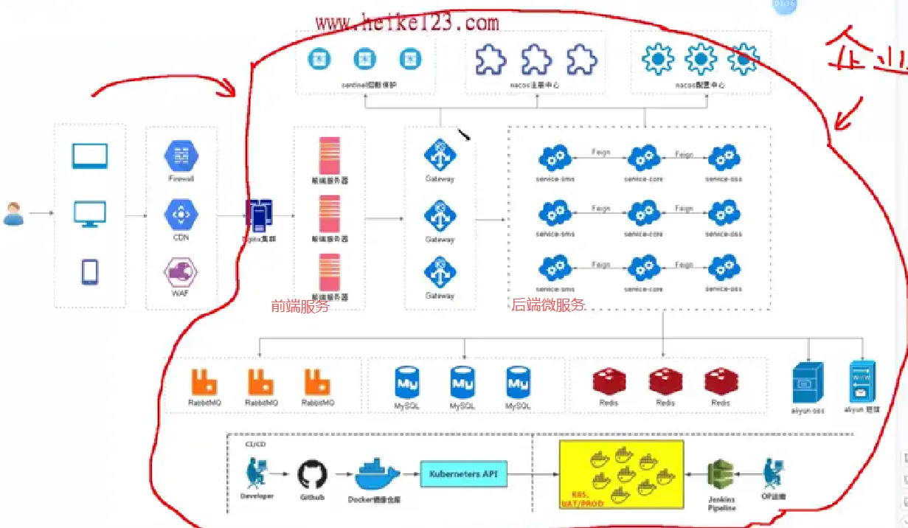
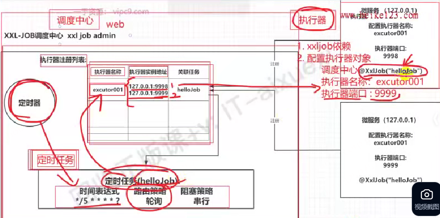
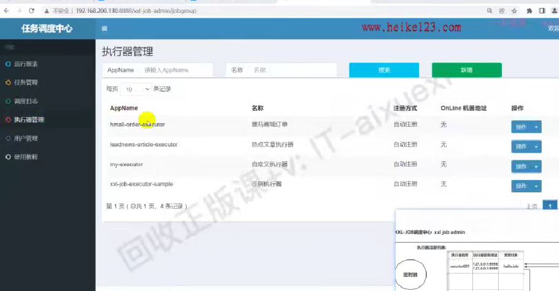

# 分布式微服务课程

1. 完整的分布式架构图：https://developer.aliyun.com/article/851937?spm=5176.26934562.main.4.14353710VOXJdW
2. 黑马课程java微服务简化版
   1. 

## 概念记录

1. 集群: 把相同的服务部署在不同的机器上
2. 分布式:把不同的服务部署在不同的机器上
3. 微服务: 一种经过良好架构设计的分布式架构方案

## XXL-JOB

> 博客链接：https://juejin.cn/post/6948397386926391333#heading-1

### 架构

1. 大体分为3部分：调度中心web界面，定时任务，执行器
2. 具体每个微服务这块才是执行器，一个执行器可以创建多个定时任务，调度中心就是维护执行器列表，维护定时任务，先创建执行器，创建任务时指定属于哪个执行器
   1. 调度中心还维护统一的定时器，负责下发任务路由到目标执行器中执行
3. 定时任务：
   1. 路由策略：根据什么样策略找到对应执行器
   2. 阻塞策略：一个执行器下多个定时任务时的执行策略

### 界面操作

