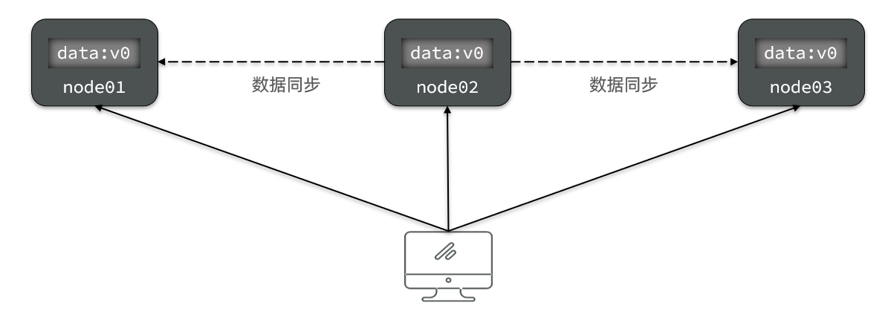
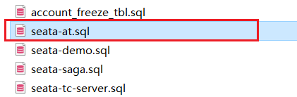

# 分布式事务

> 详细博客讲解：https://cloud.tencent.com/developer/article/1975104

- [分布式事务](#分布式事务)
- [0.学习目标](#0学习目标)
- [1.分布式事务问题](#1分布式事务问题)
  - [1.1.本地事务](#11本地事务)
  - [1.2.分布式事务](#12分布式事务)
  - [1.3.演示分布式事务问题](#13演示分布式事务问题)
  - [什么时候需要考虑分布式事务？](#什么时候需要考虑分布式事务)
- [2.理论基础](#2理论基础)
  - [2.1.CAP定理](#21cap定理)
    - [2.1.1.一致性](#211一致性)
    - [2.1.2.可用性](#212可用性)
    - [2.1.3.分区容错](#213分区容错)
    - [2.1.4.矛盾](#214矛盾)
  - [2.2.BASE理论](#22base理论)
  - [2.3.解决分布式事务的思路](#23解决分布式事务的思路)
    - [具体解法：引入第三方](#具体解法引入第三方)
- [3.初识Seata](#3初识seata)
  - [3.1.Seata的架构](#31seata的架构)
    - [Seata基于上述架构提供了四种不同的分布式事务解决方案：](#seata基于上述架构提供了四种不同的分布式事务解决方案)
  - [3.2. 安装部署seata](#32-安装部署seata)
  - [3.3.每个微服务都集成Seata](#33每个微服务都集成seata)
    - [3.3.1.引入依赖](#331引入依赖)
    - [3.3.2.每个微服务配置TC地址](#332每个微服务配置tc地址)
    - [3.3.3.其它服务](#333其它服务)
    - [测试基本效果](#测试基本效果)
- [4.动手实践](#4动手实践)
  - [4.1.XA模式](#41xa模式)
    - [4.1.1.两阶段提交](#411两阶段提交)
    - [4.1.2.Seata的XA模型](#412seata的xa模型)
    - [4.1.3.优缺点](#413优缺点)
    - [4.1.4.实现XA模式](#414实现xa模式)
  - [4.2.AT模式](#42at模式)
    - [4.2.1.Seata的AT模型](#421seata的at模型)
    - [AT工作原理架构图](#at工作原理架构图)
    - [4.2.2.流程梳理](#422流程梳理)
    - [4.2.3.AT与XA的区别](#423at与xa的区别)
    - [4.2.4.读隔离-脏读问题](#424读隔离-脏读问题)
    - [4.2.4.写隔离-脏写问题](#424写隔离-脏写问题)
    - [4.2.5.优缺点](#425优缺点)
    - [4.2.6.实现AT模式](#426实现at模式)
  - [4.3.TCC模式](#43tcc模式)
    - [4.3.1.流程分析](#431流程分析)
      - [场景示例](#场景示例)
    - [4.3.2.Seata的TCC模型](#432seata的tcc模型)
    - [4.3.3.优缺点](#433优缺点)
  - [4.4.SAGA模式](#44saga模式)
    - [4.4.1.原理](#441原理)
    - [4.4.2.优缺点](#442优缺点)
  - [4.5.四种模式对比](#45四种模式对比)


# 0.学习目标

# 1.分布式事务问题

## 1.1.本地事务

本地事务，也就是传统的**单机事务**。在传统数据库事务中，必须要满足四个原则：


1. 隔离性：并发操作时，事务与事务之间做到隔离，互不影响，涉及到mysql的隔离的4个级别
   1. 读未提交，读已提交，可重复读，串行化
   2. 隔离级别越高，性能越差，应用场景越特殊
2. 持久性


## 1.2.分布式事务

**分布式事务**，就是指不是在单个服务或单个数据库架构下，产生的事务，例如：

- 跨数据源的分布式事务
- 跨服务的分布式事务
- 综合情况


在数据库水平拆分、服务垂直拆分之后，一个业务操作通常要跨多个数据库、服务才能完成。例如电商行业中比较常见的下单付款案例，包括下面几个行为：

- 创建新订单
- 扣减商品库存
- 从用户账户余额扣除金额


完成上面的操作需要访问三个不同的微服务和三个不同的数据库。


订单的创建、库存的扣减、账户扣款在每一个服务和数据库内是一个本地事务，可以保证ACID原则。

但是当我们把三件事情看做一个"业务"，要满足保证“业务”的原子性，要么所有操作全部成功，要么全部失败，不允许出现部分成功部分失败的现象，这就是**分布式系统下的事务**了。

此时ACID难以满足，这是分布式事务要解决的问题


## 1.3.演示分布式事务问题

我们通过一个案例来演示分布式事务的问题：

1）**创建数据库，名为seata_demo，然后导入课前资料提供的SQL文件：**

 

2）**导入课前资料提供的微服务：**

 

微服务结构如下：

 

其中：

seata-demo：父工程，负责管理项目依赖

- account-service：账户服务，负责管理用户的资金账户。提供扣减余额的接口
- storage-service：库存服务，负责管理商品库存。提供扣减库存的接口
- order-service：订单服务，负责管理订单。创建订单时，需要调用account-service和storage-service


**3）启动nacos、所有微服务**

**4）测试下单功能，发出Post请求：**

请求如下：

```sh
curl --location --request POST 'http://localhost:8082/order?userId=user202103032042012&commodityCode=100202003032041&count=20&money=200'
```

如图：


测试发现，当库存不足时，如果余额已经扣减，并不会回滚，出现了分布式事务问题。

测试发现：下订单的订单服务发出后，库存服务和账户服务都加了事务注解，但是在库存服务中扣减库存时，抛出了异常，导致库存服务回滚，订单发起链路中出现了异常，订单服务也发起了回滚，但是账户微服务本身是成功的没有回滚，这就出现了分布式事务问题。

## 什么时候需要考虑分布式事务？

1. 你的业务有没有横跨多个微服务
2. 你的业务有没有含写的请求

满足上述2个条件就需要考虑分布式事务问题。


# 2.理论基础

解决分布式事务问题，需要一些分布式系统的基础知识作为理论指导。

## 2.1.CAP定理

1998年，加州大学的计算机科学家 Eric Brewer 提出，分布式系统有三个指标。

> - Consistency（一致性）
> - Availability（可用性）
> - Partition tolerance （分区容错性）


它们的第一个字母分别是 C、A、P。

Eric Brewer 说，这三个指标不可能同时做到。这个结论就叫做 CAP 定理。要不就保证CP要不就保证AP


### 2.1.1.一致性

Consistency（一致性）：用户访问分布式系统中的任意节点，得到的数据必须一致。

比如现在包含两个节点，其中的初始数据是一致的：


当我们修改其中一个节点的数据时，两者的数据产生了差异：


要想保住一致性，就必须实现node01 到 node02的数据 同步：


### 2.1.2.可用性

Availability （可用性）：用户访问集群中的任意健康节点，必须能得到响应，而不是超时或拒绝。

如图，有三个节点的集群，访问任何一个都可以及时得到响应：



当有部分节点因为网络故障或其它原因无法访问时，代表节点不可用：


### 2.1.3.分区容错

**Partition（分区）**：因为网络故障或其它原因导致分布式系统中的部分节点与其它节点失去连接，形成独立分区。


**Tolerance（容错）**：在集群出现分区时，整个系统也要持续对外提供服务


### 2.1.4.矛盾

在分布式系统中，系统间的网络不能100%保证健康，一定会有故障的时候，而服务有必须对外保证服务。因此Partition Tolerance不可避免。

当节点接收到新的数据变更时，就会出现问题了：


如果此时要保证**一致性**，就必须等待网络恢复，完成数据同步后，整个集群才对外提供服务，服务处于阻塞状态，不可用。

如果此时要保证**可用性**，就不能等待网络恢复，故障的那台剔除剩下2个健康的重新选举，那node01、node02与node03 三者之间就会出现数据不一致。

**一句话总结**：已nacos服务注册与发现举例：
1. 临时实例（AP）：“快而可能不准”—— 网络波动时可能误删实例，但服务发现调用结果永远能返回结果，优先保证业务不中断。
2. 非临时实例（CP）：“准而可能不快”—— 网络波动时可能查不到服务列表，但一旦返回结果，绝对准确，优先保证数据一致。


也就是说，在P不可避免时，一定会有容错的情况下，A和C之间只能实现一个。无法同时满足A和C


- 我们用ES集群是AP还是CP？
  - ES集群出现分区容错时，故障节点会被剔除集群，数据分片会重新分配到其它节点暂时服务不可用，保证数据一致，因此是低可用性，高一致性，属于CP
- eureka是典型的AP架构，高可用性
  - 搭建集群时，每个节点角色都是相同的，互相之间都会同步数据，当有节点故障时，会有节点被剔除，剩余其他节点会重新选举，因此是高可用性

- zookeeper是典型的CP架构，高一致性
  - 她搭建集群时，每个节点会有不同的角色，有主有从，主节点负责写，从节点负责读，当有节点故障时，必须等待重新选举leader主，此时服务暂不可用，但是数据不会丢失

- nacos：默认是AP，
  - 临时实例：AP架构
  - 非临时实例：CP架构


## 2.2.BASE理论

BASE理论是对CAP的一种解决思路，包含三个思想：

- **Basically Available** **（基本可用）**：分布式系统在出现故障时，允许损失部分可用性，即保证核心可用。
- **Soft State（软状态）：**在一定时间内，允许出现中间状态，比如临时的不一致状态。
- **Eventually Consistent（最终一致性）**：虽然无法保证强一致性，但是在软状态结束后，最终达到数据一致。

- 首字母简写为BASE
- 下面是举得美团下单，分布式扣减优惠卷的例子
  - 先得保证下单服务核心服务是可用的，允许出现优惠券暂时扣减失败，通过MQ的方式异步恢复数据的一致性
    

## 2.3.解决分布式事务的思路

分布式事务最大的问题是各个子事务的一致性问题，因此可以借鉴CAP定理和BASE理论，有两种解决思路：

- AP模式：各子事务分别执行和提交，允许出现结果不一致，然后采用弥补措施恢复数据即可，实现最终一致。

- CP模式：各个子事务执行后互相等待，同时提交，同时回滚，达成强一致。但事务等待过程中，处于弱可用状态。

### 具体解法：引入第三方

但不管是哪一种模式，都需要在子系统事务之间互相通讯，协调事务状态，也就是需要一个**事务协调者(TC)**：

- 不管哪一种都可以使用下面的解决模型


这里的子系统事务，称为**分支事务**；有关联的各个分支事务在一起称为**全局事务**。


# 3.初识Seata

Seata是 2019 年 1 月份蚂蚁金服和阿里巴巴共同开源的分布式事务解决方案。致力于提供高性能和简单易用的分布式事务服务，为用户打造一站式的分布式解决方案。

官网地址：http://seata.io/，其中的文档、播客中提供了大量的使用说明、源码分析。


## 3.1.Seata的架构

Seata事务管理中有三个重要的角色：

- **TC (Transaction Coordinator) -** **事务协调者：**维护全局和分支事务的状态，协调全局事务提交或回滚。

- **TM (Transaction Manager) -** **事务管理器：**定义全局事务的范围、开始全局事务、提交或回滚全局事务。

- **RM (Resource Manager) -** **资源管理器：**管理分支事务处理的资源，与TC交谈以注册分支事务和报告分支事务的状态，并驱动分支事务提交或回滚。


整体的架构如图：


3个角色理解：
1. 肯定服务器单独首先安装服务端软件，他是个TC的角色
2. 在分布式事务发起的那个服务的方法上加全局注解就是TM
3. 每个被调用的微服务商安装的叫RM


### Seata基于上述架构提供了四种不同的分布式事务解决方案：

- XA模式：强一致性分阶段事务模式，牺牲了一定的可用性，无业务侵入
- TCC模式：最终一致的分阶段事务模式，有业务侵入
- AT模式：最终一致的分阶段事务模式，无业务侵入，也是Seata的默认模式  （-----综合性能更好的推荐使用）
- SAGA模式：长事务模式，有业务侵入

无论哪种方案，都离不开TC，也就是事务的协调者。


## 3.2. 安装部署seata

参考课前资料提供的文档《 seata的部署和集成.md 》：


## 3.3.每个微服务都集成Seata

我们以order-service为例来演示。

### 3.3.1.引入依赖

首先，在order-service中引入依赖：

```xml
<!--seata-->
<dependency>
    <groupId>com.alibaba.cloud</groupId>
    <artifactId>spring-cloud-starter-alibaba-seata</artifactId>
    <exclusions>
        <!--版本较低，1.3.0，因此排除--> 
        <exclusion>
            <artifactId>seata-spring-boot-starter</artifactId>
            <groupId>io.seata</groupId>
        </exclusion>
    </exclusions>
</dependency>
<dependency>
    <groupId>io.seata</groupId>
    <artifactId>seata-spring-boot-starter</artifactId>
    <!--seata starter 采用1.4.2版本-->
    <version>${seata.version}</version>
</dependency>
```


### 3.3.2.每个微服务配置TC地址

在order-service中的application.yml中，配置TC服务信息，通过注册中心nacos，结合服务名称获取TC地址：

```yaml
seata:
  registry: # TC服务注册中心的配置，微服务根据这些信息去注册中心获取tc服务地址
    type: nacos # 注册中心类型 nacos
    nacos:
      server-addr: 127.0.0.1:8848 # nacos地址
      namespace: "" # namespace，默认为空
      group: DEFAULT_GROUP # 分组，默认是DEFAULT_GROUP
      application: seata-tc-server # seata服务名称
      username: nacos
      password: nacos
  tx-service-group: seata-demo # 事务组名称
  service:
    vgroup-mapping: # 事务组与cluster的映射关系
      seata-demo: SH
```


微服务如何根据这些配置寻找TC的地址呢？

我们知道注册到Nacos中的微服务，确定一个具体实例需要四个信息：

- namespace：命名空间
- group：分组
- application：服务名
- cluster：集群名


以上四个信息，在刚才的yaml文件中都能找到：


namespace为空，就是默认的public

结合起来，TC服务的信息就是：public@DEFAULT_GROUP@seata-tc-server@SH，这样就能确定TC服务集群了。然后就可以去Nacos拉取对应的实例信息了。


### 3.3.3.其它服务

其它两个微服务也都参考order-service的步骤来做，完全一样。

### 测试基本效果

1. 前面3个微服务，装依赖和配置，就都集成好了
2. 此时只需要在全局事务发起方即订单服务下订单时，把原来的@Transactional注解替换为seata提供的@GlobalTransactional全局事务注解即可。
3. 其他被调的微服务可以把之前的事务注解删掉，也不用加事务注解
4. 当再次下订单时，遇到库存扣减失败时，订单，账户，库存微服务全部都回滚成功了

---- 默认事务模式是AT模式


# 4.动手实践

下面我们就一起学习下Seata中的四种不同的事务模式。


## 4.1.XA模式

XA 规范 是 X/Open 组织定义的分布式事务处理（DTP，Distributed Transaction Processing）标准，XA 规范 描述了全局的TM与局部的RM之间的接口，几乎所有主流的数据库都对 XA 规范 提供了支持。

- mysql本身实现了该协议，就是mysql中支持的XA的一组命令
  - 如：mysql命令执行：`XA START 'local_xa_tx_123'`
- MySQL 的 XA 协议也可以实现本地事务的效果，但完全没有必要—— 因为 XA 协议设计的初衷是解决分布式事务（跨多个资源的一致性），而 MySQL 本身的本地事务（BEGIN/COMMIT/ROLLBACK）已经是实现单库内数据一致性的最优方案，XA 协议在本地事务场景下只会增加复杂度和性能损耗
  - 单库内的事务操作用本地事务
  - 跨库/跨资源的事务操作用XA事务

性能不好：
- XA 事务：从 XA START 到 XA COMMIT 期间，行锁一直持有（PREPARE 阶段不会释放锁），锁竞争更激烈，并发能力下降

### 4.1.1.两阶段提交

XA是规范，目前主流数据库都实现了这种规范，实现的原理都是基于两阶段提交。

- 该规范规定有TC和RM资源管理器2个角色

正常情况：


异常情况：


一阶段：

- 事务协调者通知每个事物参与者执行本地事务
- 本地事务执行完成后报告事务执行状态给事务协调者，此时事务不提交，继续持有数据库锁

二阶段：

- 事务协调者基于一阶段的报告来判断下一步操作
  - 如果一阶段都成功，则通知所有事务参与者，提交事务
  - 如果一阶段任意一个参与者失败，则通知所有事务参与者回滚事务


### 4.1.2.Seata的XA模型

Seata对原始的XA模式做了简单的封装和改造，以适应自己的事务模型，基本架构如图：


RM一阶段的工作：

​	① 注册分支事务到TC

​	② 执行分支业务sql但不提交

​	③ 报告执行状态到mysql外部的TC

TC二阶段的工作：

- TC检测各分支事务执行状态

  a.如果都成功，通知所有RM提交事务

  b.如果有失败，通知所有RM回滚事务

RM二阶段的工作：

- 接收TC指令，提交或回滚事务


### 4.1.3.优缺点

XA模式的优点是什么？

- 事务的强一致性，满足ACID原则。
  - XA 基于 “两阶段提交（2PC）”，通过 “准备阶段（所有资源确认可提交）” 和 “提交阶段（所有资源统一提交 / 回滚）”，确保要么所有操作都成功，要么所有操作都回滚，完全规避 “部分成功、部分失败” 的不一致状态
- 常用数据库都支持，实现简单，并且没有代码侵入
  - 开发时无需手动编写 “回滚补偿逻辑” 或 “状态校验代码”，只需通过配置声明事务（如 Spring 的 @Transactional 注解），框架会自动协调 TC（事务协调器）与 RM（数据库）完成 2PC 流程，降低开发复杂度和出错概率
  - 不仅主流关系型数据库支持，非关系型数据库也支持XA协议


XA模式的缺点是什么？

- 因为一阶段需要锁定所有相关的数据库资源，统一等待二阶段结束才释放，性能较差


**总结**

XA 模式是 “强一致性事务” 的经典方案，适合低并发、一致性优先的场景；但在高并发、多资源类型的分布式系统中，其性能瓶颈和场景局限会被放大，通常需替换为 TCC、SAGA 等更灵活的分布式事务方案


### 4.1.4.实现XA模式

Seata的starter已经完成了XA模式的自动装配，实现非常简单，步骤如下：

1）修改application.yml文件（每个参与事务的微服务），开启XA模式：

```yaml
seata:
  data-source-proxy-mode: XA
```


2）给发起全局事务的入口方法添加@GlobalTransactional注解:

本例中是OrderServiceImpl中的create方法.


3）重启服务并测试

重启order-service，再次测试，发现无论怎样，三个微服务都能成功回滚。

## 4.2.AT模式

AT模式同样是分阶段提交的事务模型，不过缺弥补了XA模型中资源锁定周期过长的缺陷。 ----- 算作AP架构

### 4.2.1.Seata的AT模型

基本流程图：


阶段一RM的工作：

- 注册分支事务
- 记录undo-log（数据快照）
  - 前镜像：修改之前的数据，后镜像：修改之后的数据，存到undo表即回滚日志里
- 执行业务sql并**立即提交**
  - 利用本地事务一起执行业务sql和undo-log的存储，保证原子性
- 报告事务状态

阶段二提交时RM的工作：

- 把这个提交请求放到异步队列里，马上返回提交成功的结果给TC
- 异步的批量删除undo-log即可

阶段二回滚时RM的工作：恢复数据到更新前

- 根据undo-log恢复数据到更新前
- 根据分支id和全局事务XID，查询undo-log，找到对应的回滚日志
- 进行数据校验：拿回滚日志的后镜像与当前数据库里数据进行比较，
  - 若不同，说明数据被全局事务之外的事务修改过，它不敢给你改回去，需要额外的策略，如反复重试策略，回滚失败
  - 若相同，则根据回滚日志的前镜像和业务sql信息，生成并执行回滚的语句
  - 举例：改金额，1000改成800，800是当时操作时存储的快照后镜像数据，要回滚到1000，必须得保证此时数据库的数据还是你当时的快照800，才能进行回滚。若不是你操作时的800，别人也操作了此时此刻成600，那你就不能把人家的数据也回滚回去


**要求**
1. 项目底层数据库必须用jdbc去操作关系型数据库，他底层是通过jdbc做的对数据库操作对象做的一个代理对象
   1. 只要你分支服务操作数据库，就能监听到创建个分支事务，也就是微服务安装seata依赖配置测试效果时，不需要代码编写，就能自动生效
2. 所有微服务数据库里必须有个undo_log表，用来记录数据快照

### AT工作原理架构图

参见 `../资料/分布式事务.jpg`

视频讲解见14节AT工作原理视频


### 4.2.2.流程梳理

我们用一个真实的业务来梳理下AT模式的原理。

比如，现在又一个数据库表，记录用户余额：

| **id** | **money** |
| ------ | --------- |
| 1      | 100       |

其中一个分支业务要执行的SQL为：

```sql
update tb_account set money = money - 10 where id = 1
```


AT模式下，当前分支事务执行流程如下：

一阶段：

1）TM发起并注册全局事务到TC

2）TM调用分支事务

3）分支事务准备执行业务SQL

4）RM拦截业务SQL，根据where条件查询原始数据，形成快照。

```json
{
    "id": 1, "money": 100
}
```

5）RM执行业务SQL，提交本地事务，释放数据库锁。此时 `money = 90`

6）RM报告本地事务状态给TC


二阶段：

1）TM通知TC事务结束

2）TC检查分支事务状态

​	 a）如果都成功，则立即删除快照

​	 b）如果有分支事务失败，需要回滚。读取快照数据（`{"id": 1, "money": 100}`），将快照恢复到数据库。此时数据库再次恢复为100


流程图：


### 4.2.3.AT与XA的区别

简述AT模式与XA模式最大的区别是什么？

- XA模式一阶段不提交事务，锁定资源；AT模式一阶段直接提交，不锁定资源。
- XA模式依赖数据库本身的XA机制实现回滚；AT模式利用数据快照生成反向SQL实现数据回滚。
- XA模式强一致；AT模式最终一致

### 4.2.4.读隔离-脏读问题

- 使用框架时会出现脏读，需要自己手动通过SELECT FOR UPDATE 避免

17
TODO

在数据库本地事务隔高级别 读已提交(Read Committed)及以上的基础上，seata(AT 模式)的默认全局隔离级别是读未提交(Read Uncommittod)

如果应用在特定场景下，必需要求全局的读已提交，目前 Seata方式是通过 SELECT FOR UPDATE 语句的代理解决的


### 4.2.4.写隔离-脏写问题

- 使用框架时不会出现脏写，因为内部机制全局锁的存在，其他事务不能修改当前数

在多线程并发访问AT模式的分布式事务时，有可能出现脏写问题，如图：


解决思路就是引入了全局锁的概念。在释放DB锁之前，先拿到全局锁。避免同一时刻有另外一个事务来操作当前数据。


**解决方案**

- 一阶段本地事务提交前，需要确保先拿到全局锁
- 拿不到全局锁，不能提交本地事务，
- 拿 全局锁 的尝试被限制在一定范围内，超出范围将放弃。并回滚本地事务，释放本地锁。

---- 该方案处理并发场景下的脏写问题时保证了最终一致性，性能会低些


### 4.2.5.优缺点

AT模式的优点：

- 一阶段完成直接提交事务，释放数据库资源，性能比较好
- 利用全局锁实现分布式事务的读写隔离，但性能会低些

- 没有代码侵入，框架自动完成回滚和提交

AT模式的缺点：

- 两阶段之间属于软状态，属于最终一致
- 框架的快照功能会影响性能，但比XA模式要好很多


### 4.2.6.实现AT模式

AT模式中的快照生成、回滚等动作都是由框架自动完成，没有任何代码侵入，因此实现非常简单。

只不过，AT模式需要一个表来记录全局锁、另一张表来记录数据快照undo_log。


1）导入数据库表，记录全局锁

导入课前资料提供的Sql文件：seata-at.sql，其中lock_table导入到TC服务关联的数据库，undo_log表导入到微服务关联的数据库：



2）修改application.yml文件，将事务模式修改为AT模式即可：

```yaml
seata:
  data-source-proxy-mode: AT # 默认就是AT
```


3）重启服务并测试


## 4.3.TCC模式

TCC模式与AT模式非常相似，每阶段都是独立事务，不同的是TCC通过人工编码来实现数据恢复。需要实现三个方法：

- Try：资源的检测和预留； 

- Confirm：完成资源操作业务；要求 Try 成功 Confirm 一定要能成功。

- Cancel：预留资源释放，可以理解为try的反向操作。


### 4.3.1.流程分析


TCC 需要一个 事务协调器（TC）（如 Seata、Hmily、ByteTCC）来管理全局事务状态，协调各服务的 Try/Confirm/Cancel 执行。完整流程如下：

1. 发起全局事务：
   1. 客户端（如订单服务）调用 TC 的 begin 方法，创建全局事务 ID（xid），标记当前事务为 “全局事务”。
2. 执行 Try 阶段：TC 协调所有参与服务（订单服务、库存服务）依次执行 Try 方法：
   1. 若所有服务 Try 成功，TC 记录全局事务状态为 “Try 成功”，进入 Confirm 阶段；
   2. 若任一服务 Try 失败，TC 记录状态为 “Try 失败”，直接进入 Cancel 阶段（撤销已 Try 成功的服务）。
3. 执行 Confirm/Cancel 阶段：
   1. Confirm 阶段：TC 协调所有服务依次执行 Confirm 方法，若全部成功，全局事务结束（状态为 “完成”）；若任一失败，TC 会重试 Confirm（直到成功）。
   2. Cancel 阶段：TC 协调所有已 Try 成功的服务执行 Cancel 方法，若全部成功，全局事务结束（状态为 “取消”）；若任一失败，TC 会重试 Cancel（直到成功）。
4. 事务状态记录：
TC 需持久化全局事务状态（如 xid、各服务状态），防止宕机后状态丢失，确保重启后能继续执行未完成的 Confirm/Cancel（即 “事务恢复”）

#### 场景示例
**第一阶段：try**
1. 订单服务（Confirm）：
   1. 将订单状态从 PENDING 改为 SUCCESS（确认订单创建成功）。
   2. SQL 示例：UPDATE orders SET status = 'SUCCESS' WHERE order_id = '123';
2. 库存服务（Confirm）：
   1. 将 Try 阶段预留的库存转为 “实际扣减”（减少实际库存，清空对应预留量）。
   2. SQL 示例`UPDATE stock SET num = num - 1, reserved_num = reserved_num - 1 WHERE goods_id = 1001;`

**第二阶段：**Confirm（确认执行）
1. 订单服务（Confirm）：
   1. 将订单状态从 PENDING 改为 SUCCESS（确认订单创建成功）。
   2. SQL 示例：UPDATE orders SET status = 'SUCCESS' WHERE order_id = '123';
2. 库存服务（Confirm）：
   1. 将 Try 阶段预留的库存转为 “实际扣减”（减少实际库存，清空对应预留量）。
   2. SQL 示例：`UPDATE stock SET num = num - 1, reserved_num = reserved_num - 1 WHERE goods_id = 1001;`

将 “待确认状态” 转为 “最终成功状态”，释放预留资源（或标记预留资源为已使用）

**第三阶段：**Cancel（取消补偿）

1. 若 Try 阶段部分服务失败，或 Confirm 阶段执行异常，对所有已完成 Try 阶段的服务，执行 “补偿逻辑”，释放预留资源，恢复到 Try 前的状态
2. 假设订单服务 Try 成功，但库存服务 Try 失败（库存不足），需对订单服务执行 Cancel：
   1. 订单服务（Cancel）：
      1. 将 “待确认订单” 改为 CANCELED（或直接删除），释放订单号资源。
      2. SQL 示例：UPDATE orders SET status = 'CANCELED' WHERE order_id = '123';

3个方法try 和confirm 和cancel：需要开发者自行实现，里面自定义的基于业务的预留和回滚逻辑，不强依赖数据库的XA事务啥的。


### 4.3.2.Seata的TCC模型

Seata中的TCC模型依然延续之前的事务架构，如图：


### 4.3.3.优缺点

TCC模式的每个阶段是做什么的？

- Try：资源检查和预留
- Confirm：业务执行和提交
- Cancel：预留资源的释放

TCC的优点是什么？

- 一阶段完成直接提交事务，释放数据库资源，性能好
- 相比AT模型，无需生成快照，无需使用全局锁，性能最强
- 不依赖数据库事务，而是依赖补偿操作，可以用于非事务型数据库

TCC的缺点是什么？

- 有代码侵入，需要人为编写try、Confirm和Cancel接口，太麻烦
- 软状态，事务是最终一致
- 需要考虑Confirm和Cancel的失败情况，做好幂等处理

----


1. 优点
   1. 资源利用率高，性能优于 XA/AT
      1. Try 阶段仅 “预占资源”（如冻结库存、锁定余额），不持有数据库长锁；Confirm/Cancel 是轻量的状态更新（无锁竞争），避免了 XA/AT 中 “一阶段锁资源到二阶段结束” 的性能瓶颈，高并发场景下更友好。
   2. 支持非关系型数据库 / 异构资源
      1. 不依赖数据库事务（如 MySQL 的 BEGIN/COMMIT），只要业务能实现 “Try-Confirm-Cancel” 三步逻辑，即可支持 Redis（缓存库存）、MongoDB（文档数据）、甚至第三方接口（如支付、物流），适配分布式系统中 “多资源类型” 的场景（这是 AT 模型的核心短板）。
   3. 一致性可控，无脏写风险
      1. Try 阶段已完成资源校验（如库存是否充足、余额是否够扣），Confirm 阶段仅 “消耗预占资源”，理论上不会失败；即使极端情况失败，Cancel 阶段可通过重试 / 补偿恢复资源，避免了 “AT 模型中可能出现的脏写”（如两个事务同时修改同一行数据）。
      2. 为何不需要全局锁就能解决脏写等并发问题？
         1. 在 TCC 模式的 Try 阶段，预占资源后其他请求无法再预占同一资源的核心原因是：预占操作通过 “业务字段标记 + 原子性校验” 实现了资源的互斥性，本质是用 “业务层的状态控制” 替代了数据库的锁机制，确保同一资源在同一时间只能被一个分布式事务预占

2. 缺点
   1. 业务侵入性极强，开发成本高
      1. 需手动为每个业务场景设计 “Try-Confirm-Cancel” 三阶段逻辑，且要处理大量异常：
         1. 重复执行问题（如 Confirm/Cancel 重试时，需保证 “幂等性”，避免重复扣库存）；
         2. 空回滚问题（如某服务 Try 没执行成功，却收到 Cancel 请求，需判断是否跳过）；
         3. 悬挂问题（如 Cancel 执行完后，Try 才超时成功，需阻止后续 Confirm）。对比 AT 模型 “零业务侵入”，TCC 对开发能力要求更高。
   2. 难以预留的资源”（如第三方服务、物理资源调度），而 TCC 的 “预留资源” 逻辑在这些场景下几乎不可行
      1. 长事务 “电商下单→支付→仓库拣货→物流配送→用户签收”：物流配送的 “运力资源”（如快递员、货车）无法预留 —— 快递员不可能被 “冻结” 几小时等待订单确认
   3. 不适合长事务（见saga的描述）


## 4.4.SAGA模式

Saga 模式是 Seata 即将开源的长事务解决方案，将由蚂蚁金服主要贡献。

其理论基础是Hector & Kenneth  在1987年发表的论文[Sagas](https://microservices.io/patterns/data/saga.html)。

Seata官网对于Saga的指南：https://seata.io/zh-cn/docs/user/saga.html

### 4.4.1.原理

在 Saga 模式下，分布式事务内有多个参与者，每一个参与者都是一个冲正补偿服务，需要用户根据业务场景实现其正向操作和逆向回滚操作。

分布式事务执行过程中，依次执行各参与者的正向操作，如果所有正向操作均执行成功，那么分布式事务提交。如果任何一个正向操作执行失败，那么分布式事务会去退回去执行前面各参与者的逆向回滚操作，回滚已提交的参与者，使分布式事务回到初始状态。


Saga也分为两个阶段：

- 一阶段：直接提交本地事务
- 二阶段：成功则什么都不做；失败则通过编写补偿业务来回滚


### 4.4.2.优缺点


优点：

- 适合长事务。事务参与者可以基于事件驱动实现异步调用，吞吐高
  - 为什么适合流程长，长事务？
    - “长事务” 的核心痛点是：执行时间长、涉及服务多、资源占用久、出错概率高—— 而 Saga 的设计恰好针对性解决这些痛点
    - 对比TCC：Try 阶段预留的资源（如冻结的余额），需等待事务全流程结束（Confirm/Cancel）才能释放，长事务会导致 “预留资源” 长期无法使用（如用户余额被冻结几小时
      - 而 Saga无锁、无预留，每个本地事务执行完立即释放资源（如扣完库存就提交，不冻结），即使事务持续几小时（如物流调度耗时久），也不会占用核心资源，不影响其他业务执行
    - 长事务往往涉及 “难以预留的资源”（如第三方服务、物理资源调度），而 TCC 的 “预留资源” 逻辑在这些场景下几乎不可行
- 一阶段直接提交事务，无锁，性能好
- 不用编写TCC中的三个阶段，实现简单，只需要编写2个方法就行

缺点：

- 软状态持续时间不确定，时效性差
  - 长事务一共20步，第一步1000改成了800，经过了5秒执行到第20步发现失败并回滚，又回滚5秒回到第一步，这个软状态持续了10秒，时效性差
- 没有锁的概念，没有事务隔离，会有脏写（参考AT模式的脏写案例）
  - 关键缺陷：无全局锁 / 分布式锁，也无跨库事务隔离性，每个本地事务提交后数据就对其他事务可见，无法阻止并发修改
    - 自行解决脏写问题：
      - 若在 Saga 执行前，先给 “用户 ID” 加一把 分布式锁（如基于 Redis 的锁），确保同一用户的并发事务只能 “串行执行”
      - 或从业务上的设计规避这种问题

-----
- 选 Saga：当你需要处理长事务、资源难预留（如物流、第三方服务），且能接受 “中间状态”，追求 “低业务侵入、高容错” 时（如电商订单全链路）；
- 选 TCC：当你需要强隔离性（如金融转账避免同一笔钱被多次使用），且资源可预留（如库存、余额），能接受 “高业务侵入” 时（如支付结算、秒杀系统）

## 4.5.四种模式对比

我们从以下几个方面来对比四种实现：

- 一致性：能否保证事务的一致性？强一致还是最终一致？
- 隔离性：事务之间的隔离性如何？
- 代码侵入：是否需要对业务代码改造？
- 性能：有无性能损耗？
- 场景：常见的业务场景


如图：


1. 实际运用中，只要一致性没那么强要求，都可以选择AT模式
2. AT依赖关系型数据库，因为要使用微服务数据库的本地事务
3. TCC：基于业务自定义方法层面的资源预隔离，避免了全局锁等消耗性能的问题

