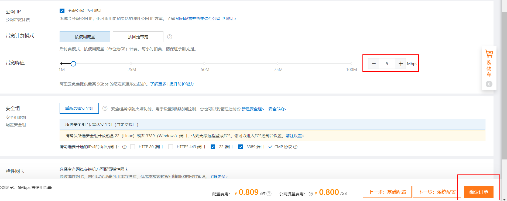
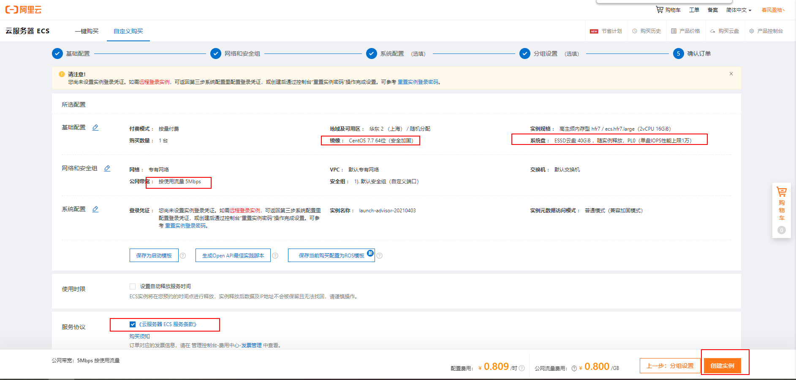
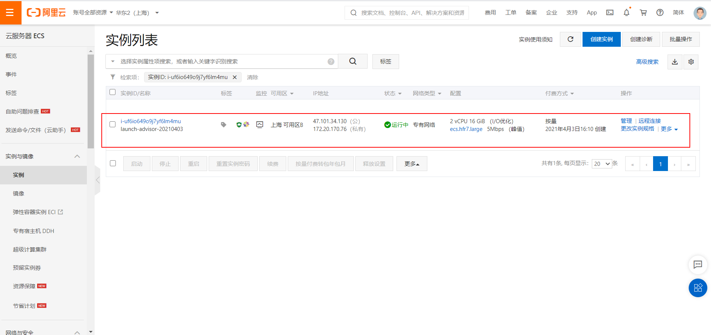
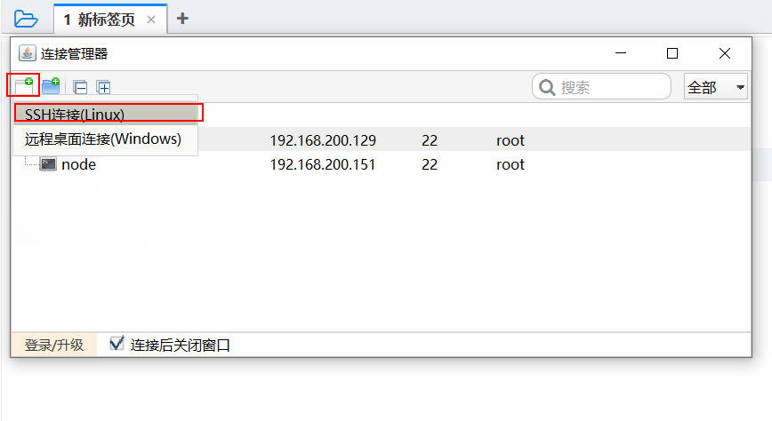
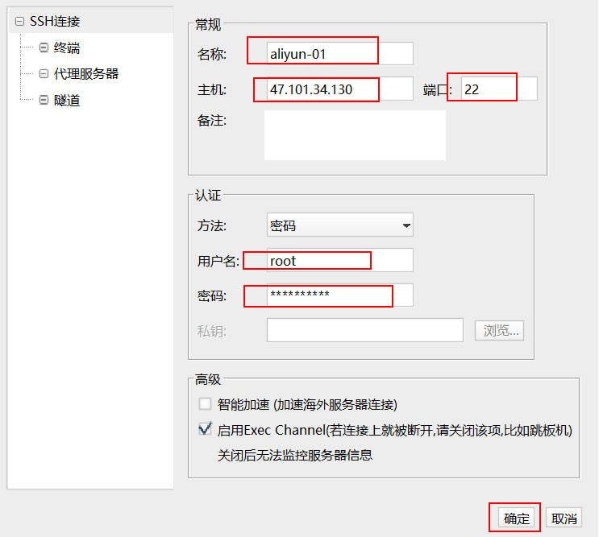
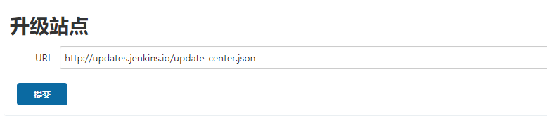

# 基于阿里云ECS服务器实战部署

- [基于阿里云ECS服务器实战部署](#基于阿里云ecs服务器实战部署)
  - [1 单架构部署方案](#1-单架构部署方案)
    - [1.1 部署流程](#11-部署流程)
  - [2 持续集成\&持续部署方案](#2-持续集成持续部署方案)
    - [2.1 持续集成](#21-持续集成)
    - [2.2 持续部署](#22-持续部署)
    - [2.3 流程说明](#23-流程说明)
  - [3 ECS服务器准备](#3-ecs服务器准备)
    - [3.1 ECS服务器购买](#31-ecs服务器购买)
    - [3.2 客户端工具连接](#32-客户端工具连接)
    - [3.3 安全组设置](#33-安全组设置)
  - [4  基础环境配置](#4--基础环境配置)
    - [4.1 配置docker环境](#41-配置docker环境)
    - [4.2 资料上传阿里云](#42-资料上传阿里云)
    - [5.1 相关软件部署](#51-相关软件部署)
    - [5.2 相关软件配置](#52-相关软件配置)
  - [6. 准备持续集成软件jenkins](#6-准备持续集成软件jenkins)
    - [6.1 Jenkins环境搭建](#61-jenkins环境搭建)
    - [6.2  Jenkins插件安装](#62--jenkins插件安装)
    - [6.3 jenkins全局配置](#63-jenkins全局配置)
  - [7 微服务持续部署](#7-微服务持续部署)
    - [7.1 基础依赖打包配置](#71-基础依赖打包配置)
    - [7.2 构建其他微服务](#72-构建其他微服务)
  - [8 部署前端工程](#8-部署前端工程)
  - [9 基于webhook实现自动构建](#9-基于webhook实现自动构建)


## 1 单架构部署方案

### 1.1 部署流程


**传统方案**


**基于docker**


## 2 持续集成&持续部署方案

随着软件开发复杂度的不断提高，团队开发成员间如何更好地协同工作以确保软件
开发的质量已经慢慢成为开发过程中不可回避的问题。互联网软件的开发和发布，已经形成了一套标准流程。

如: 在互联网企业中，每时每刻都有需求的变更，bug的修复， 为了将改动及时更新到生产服务器上，下面的图片我们需要每天执行N多次，开发人员完整代码自测后提交到git，然后需要将git中最新的代码生成镜像并部署到测试服务器，如果测试通过了还需要将最新代码部署到生产服务器。如果采用手动方式操作，那将会浪费大量的时间浪费在运维部署方面。


现在的互联网企业，基本都会采用以下方案解决:  

**持续集成（Continuous integration，简称 CI）。**

**持续部署（continuous deployment, 简称 CD）**   


### 2.1 持续集成

持续集成 （Continuous integration，简称 CI） 指的是，频繁地（一天多次）将代码集成到主干。

它的好处主要有两个。

> 1、快速发现错误。每完成一点更新，就集成到主干，可以快速发现错误，定位错误也比较容易。

> 2、防止分支大幅偏离主干。如果不是经常集成，主干又在不断更新，会导致以后集成的难度变大，甚至难以集成。

持续集成的目的，就是让产品可以快速迭代，同时还能保持高质量。它的核心措施是，代码集成到主干之前，必须通过自动化测试。只要有一个测试用例失败，就不能集成。

Martin Fowler 说过，”持续集成并不能消除 Bug，而是让它们非常容易发现和改正。”

与持续集成相关的，还有两个概念，分别是持续交付和持续部署。

### 2.2 持续部署

持续部署（continuous deployment）是持续交付的下一步，指的是代码通过评审以后，**自动部署**到生产环境。

持续部署的目标是，代码在任何时刻都是可部署的，可以进入生产阶段。

持续部署的前提是能自动化完成测试、构建、部署等步骤。

### 2.3 流程说明

为了保证团队开发人员提交代码的质量，减轻了软件发布时的压力；
持续集成中的任何一个环节都是自动完成的，无需太多的人工干预，有利于减少重复
过程以节省时间、费用和工作量；接下来我们会演示一套基本的自动化持续集成和持续部署方案，来帮助大家理解互联网企业的软件部署方案。

计划如下:


```
1. 开发人员将代码提交到 git 指定分支   如: dev

2. git仓库触发push事件，发送webhooks通知到持续集成软件

3. 持续集成软件触发构建任务，对dev分支的代码进行构建、编译、单元测试

4. 如果构建失败，发送邮件提醒代码提交人员或管理员

5. 如果构建成功，最新代码将会被构建Docker镜像并上传到注册中心

6. 构建成功触发webhooks通知容器编排软件，进行服务升级

7. 容器编排软件，触发对应的服务升级任务， 将创建对应服务的新容器替换之前的容器

8. 完成最新代码的自动构建与自动部署，全程无工作人员干预
```


## 3 ECS服务器准备

### 3.1 ECS服务器购买

购买地址: [阿里云ECS](https://ecs-buy.aliyun.com/wizard?spm=5176.13329450.0.0.42264df5YvIwaZ&accounttraceid=b4bbaacd3dcc4d01b91a78338c04d06ehymz#/postpay/cn-shanghai)

1 选择配置


1. 一台机器部署至少需要8个g
2. 选择2核的

2 选择服务和对应的操作系统


3 选择网络带宽 5M,就是上行下行默认5m

默认5m即可，当然想更快可以设置大一些，但流量是单独收费的


4 直接点击确认订单


1. 安全组: 云服务器上在互联网上为了保证安全,默认所有端口不对外开放,可以在这设置放行端口

5 点击创建实例




点击管理控制台进入服务器管理界面如下: 



其中:

公网IP: 47.103.2.34.130

私网IP: 172.20.170.76

收到短信: 发送服务器的 密码

重置密码:


接收短信后,立即重启生效.

### 3.2 客户端工具连接

推荐使用 finalshell 连接.

1 打开 finalshell 创建 ssh 连接



2 输入 阿里云的  用户名(root) 和 设置的新密码




### 3.3 安全组设置

在云服务器中，只有配置了安全规则的端口才允许被外界访问

一般默认   开启:    80 (http)   443 （https）  22 (ssh远程连接)  3389 (windows远程连接)


那如果你安装了mysql 端口是3306  ，那么外界是无法直接访问到的，需要配置一下规则


在入方向中配置安全规则:  ( 用户  访问 -->  阿里云)


如果配置端口范围:   3306/3306  那就是允许3306端口访问

但是我们的软件很多， 可以通过 `1/65535` 范围 来开放所有的端口访问**（不安全，学习阶段这么搞）**


## 4  基础环境配置

### 4.1 配置docker环境

（1）yum 包更新到最新

```
sudo yum update -y
```

（2）安装需要的软件包， yum-util 提供yum-config-manager功能，另外两个是devicemapper驱动依赖的

```shell
sudo yum install -y yum-utils device-mapper-persistent-data lvm2
```

（3）设置yum源为阿里云

```shell
sudo yum-config-manager --add-repo http://mirrors.aliyun.com/docker-ce/linux/centos/docker-ce.repo
```

（4）安装docker

```shell
sudo yum -y install docker-ce
```

（5）安装后查看docker版本

```shell
docker -v
```

（6）启动docker

```properties
systemctl start docker

#设置开机自启
systemctl enable docker
```

（7）阿里云镜像加速

阿里云开设了一个[容器开发平台](https://www.aliyun.com/product/acr?spm=5176.19720258.J_8058803260.326.57a22c4aJHmwq7)

需要注册一个属于自己的阿里云账户，登录后进入管理中心


针对Docker客户端版本大于 3.2.10.0 的用户

您可以通过修改daemon配置文件[/etc/docker/daemon.json](/etc/docker/daemon.json)来使用加速器

```shell
sudo mkdir -p /etc/docker
sudo tee /etc/docker/daemon.json <<-'EOF'
{
  "registry-mirrors": ["https://hf23ud62.mirror.aliyuncs.com"]
}
EOF
sudo systemctl daemon-reload
sudo systemctl restart docker
```

观察镜像是否生效：

```shell
docker info
```

**开启docker远程访问功能:**

- 远程访问功能开启后,我们在部署基于docker的项目时,就可以通过1个插件直接在本地编辑器远程构建镜像部署项目到云服务器,不需要再本地构建再手动上传
- 这个安全性不好,黑客可能通过docker远程访问功能,直接攻击我们的服务器


```
 vi /lib/systemd/system/docker.service
```

替换ExecStart 一行配置:

```shell
ExecStart=/usr/bin/dockerd -H tcp://0.0.0.0:2375 -H unix:///var/run/docker.sock
```


```
# 重启docker

systemctl daemon-reload
systemctl restart docker
```


### 4.2 资料上传阿里云

全部上传到阿里云的**/root目录**


### 5.1 相关软件部署

通过命令安装：

```sh
# * 如果下载慢，可以上传资料中的 docker-compose 文件到 /usr/local/bin/
cp /root/docker-compose /usr/local/bin/
# 修改权限
chmod +x /usr/local/bin/docker-compose

ln -s /usr/local/bin/docker-compose /usr/bin/docker-compose
```


**实战练习相关软件 一键脚本**

在`root`目录 创建  `docker-compose.yml` 脚本文件  拷贝下面内容

```yaml
# 通过docker命令即可启动所有软件
version: '3'
services:
  mysql:
    image: mysql:5.7
    ports:
      - "3306:3306"
    volumes:
      - "/root/mysql/conf:/etc/mysql/conf.d"
      - "/root/mysql/logs:/logs"
      - "/root/mysql/data:/var/lib/mysql"
      - "/root/mysql/init:/docker-entrypoint-initdb.d/"
    environment:
      - MYSQL_ROOT_PASSWORD=root
    restart: always
  nacos:
    image: nacos/nacos-server:1.3.2
    ports:
      - "8848:8848"
    restart: always
    environment:
      - MODE=standalone
      - JVM_XMS=512m
      - JVM_XMX=512m
      - JVM_XMN=256m
      - SPRING_DATASOURCE_PLATFORM=mysql
      - MYSQL_SERVICE_HOST=mysql
      - MYSQL_SERVICE_PORT=3306
      - MYSQL_SERVICE_USER=root
      - MYSQL_SERVICE_PASSWORD=root
      - MYSQL_SERVICE_DB_NAME=nacos_config
      - NACOS_SERVER_IP=101.132.251.26
    depends_on:
      - mysql
  xxljob:
    image: xuxueli/xxl-job-admin:2.2.0
    volumes:
      - "/tmp:/data/applogs"
    environment:
      PARAMS: "--spring.datasource.url=jdbc:mysql://101.132.251.26:3306/xxl_job?useUnicode=true&characterEncoding=UTF-8&autoReconnect=true&serverTimezone=Asia/Shanghai --spring.datasource.username=root --spring.datasource.password=root"
    ports:
      - "8888:8080"
    depends_on:
      - mysql
    restart: always
  redis:
    image: redis:6.2.5
    ports:
      - "6379:6379"
    restart: always
    command: redis-server --appendonly yes --requirepass root
  elasticsearch:
    image: elasticsearch:7.12.1
    ports:
      - "9200:9200"
      - "9300:9300"
    environment:
      - "discovery.type=single-node"
      - "ES_JAVA_OPTS=-Xms512m -Xmx512m"
    volumes:
      - "/root/elasticsearch:/usr/share/elasticsearch/plugins"
    restart: always
  kibana:
    image: kibana:7.12.1
    links:
      - elasticsearch
    environment:
      - "ELASTICSEARCH_URL=http://elasticsearch:9200"
    ports:
      - "5601:5601"
    depends_on:
      - elasticsearch
    restart: always
  mq:
    image: rabbitmq:3.8-management
    restart: always
    ports:
      - 5672:5672
      - 15672:15672
    volumes:
      - "mq-config:/plugins"
    environment:
      - "RABBITMQ_DEFAULT_USER=itcast"
      - "RABBITMQ_DEFAULT_PASS=123321"
volumes:
  mq-config: 
```

**使用步骤**

运行所有容器：

```
# 运行
docker-compose up -d
# 停止
docker-compose stop
# 停止并删除容器
docker-compose down
# 查看日志
docker-compose logs -f [service...]
# 查看命令
docker-compose --help
```


### 5.2 相关软件配置

**创建es索引库**

```json
PUT /item
{
  "settings": {
    "analysis": {
      "analyzer": {
        "text_anlyzer": {
          "tokenizer": "ik_max_word",
          "filter": "py"
        },
        "completion_analyzer": {
          "tokenizer": "keyword",
          "filter": "py"
        }
      },
      "filter": {
        "py": {
          "type": "pinyin",
          "keep_full_pinyin": false,
          "keep_joined_full_pinyin": true,
          "keep_original": true,
          "limit_first_letter_length": 16,
          "remove_duplicated_term": true,
          "none_chinese_pinyin_tokenize": false
        }
      }
    }
  },
  "mappings": {
    "properties": {
      "id":{
        "type": "keyword"
      },
      "name":{
        "type": "text",
        "analyzer": "text_anlyzer",
        "search_analyzer": "ik_smart",
        "copy_to": "all"
      },
      "image":{
        "type": "keyword",
        "index": false
      },
      "price":{
        "type": "long"
      },
      "brand":{
        "type": "keyword",
        "copy_to": "all"
      },
      "category":{
        "type": "keyword",
        "copy_to": "all"
      },
      "sold":{
        "type": "integer"
      },
      "commentCount":{
        "type": "integer"
      },
      "isAd":{
        "type": "boolean"
      },
      "all":{
        "type": "text",
        "analyzer": "text_anlyzer",
        "search_analyzer": "ik_smart"
      },
      "suggestion":{
          "type": "completion",
          "analyzer": "completion_analyzer"
      }
    }
  }
}
```

**rabbitmq安装延迟队列 (暂不需要)**

```shell
# 将mq的延迟插件拷贝至挂在目录
cp /root/rabbitmq_delayed_message_exchange-3.8.9-0199d11c.ez /var/lib/docker/volumes/root_mq-config/_data

# 进入rabbitmq容器
docker exec -it root_mq_1 bash

# 开启插件
rabbitmq-plugins enable rabbitmq_delayed_message_exchange
```


## 6. 准备持续集成软件jenkins

### 6.1 Jenkins环境搭建      

   **执行docker命令安装：**

   ```sh
docker run --name jenkins -u root -d -p 8080:8080 -p 50000:50000 -v /var/jenkins_home:/var/jenkins_home -v /var/run/docker.sock:/var/run/docker.sock jenkinsci/blueocean
   ```


管理后台初始化设置

`http://服务器IP:8080/`


第一次访问需要管理员密码: 

   ```sh
   docker exec -it jenkins bash
   
   cat /var/jenkins_home/secrets/initialAdminPassword
   ```

   

   解锁后 **选择安装推荐的插件**


   

这一步等待时间较长， 安装完成之后， 创建管理员用户：

   


**安装 maven集成插件**


**安装git插件**


### 6.2  Jenkins插件安装

在实现持续集成之前， 需要确保以下插件安装成功。

- `Maven Integration plugin`： Maven 集成管理插件。**(必装)**
- `Git`： Git 集成插件。**（必装）**
- `Gitee`： Git 集成插件。**（选装）**


**安装方法：**

1. 进入【系统管理】-【插件管理】

2. 点击标签页的【可选插件】

   在过滤框中搜索插件名称

   

3. 勾选插件， 点击直接安装即可。

> **注意，如果上面安装正常，无需配置     如果没有安装按钮，或者安装失败  需要更改配置** 
>
>
>
> 在安装插件的高级配置中，修改升级站点的连接为：http://updates.jenkins.io/update-center.json   保存
>
> 
>
> 

安装完毕后重启jenkins

```
systemctl restart jenkins
```


### 6.3 jenkins全局配置

 **配置maven环境**

```sh
上传maven 至 /var/jenkins_home 目录:

cp /root/apache-maven-3.3.9.zip  /var/jenkins_home
# 下载unzip命令
yum install -y unzip
# 将压缩包上传至 /usr/local/maven下 解压
unzip -o /var/jenkins_home/apache-maven-3.3.9.zip
```


进入【系统管理】--> 【全局工具配置】


1. MAVEN配置全局设置

   

2. 指定JDK配置

   不用指定， 前面已安装


4. 指定MAVEN 目录

点击新增maven **配置name:** maven  **配置maven地址:** /var/jenkins_home/apache-maven-3.3.9


## 7 微服务持续部署

每个微服务使用的dockerfile的方式进行构建镜像后创建容器，需要在每个微服务中添加docker相关的配置

（1）修改**需要部署微服务**的pom文件，添加部署配置

```xml
<build>
        <!--修改app.jar-->
        <finalName>app</finalName>
        <plugins>
            <plugin>
                <groupId>org.springframework.boot</groupId>
                <artifactId>spring-boot-maven-plugin</artifactId>
            </plugin>
            <!-- docker的maven插件，官网：https://github.com/spotify/docker-maven-plugin -->
            <plugin>
                <groupId>com.spotify</groupId>
                <artifactId>docker-maven-plugin</artifactId>
                <version>1.2.2</version>
                <configuration>
                    <!--镜像的名称 跳过上传到私有仓库-->
                    <imageName>139.196.153.42:5000/${project.artifactId}:${project.version}</imageName>
                    <!--上传到私有仓库-->
                    <!--<imageName>106.14.241.224:5000/${project.artifactId}:${project.version}</imageName>-->
                    <!--依赖一个基础镜像 带JDK 1.8-->
                    <baseImage>java:8-alpine</baseImage>
                    <!--java -jar app.jar -->
                    <entryPoint>["java", "-jar", "/${project.build.finalName}.jar"]</entryPoint>
                    <resources>
                        <resource>
                            <targetPath>/</targetPath>
                            <directory>${project.build.directory}</directory>
                            <include>${project.build.finalName}.jar</include>
                        </resource>
                    </resources>
                    <dockerHost>http://139.196.153.42:2375</dockerHost>
                </configuration>
            </plugin>
        </plugins>
    </build>
```
1.  docker-maven-plugin: maven的生命周期中插件实现自动化构建和推送镜像到指定的 Docker 服务
    1.  将构建好的镜像推送到远程仓库（如 Docker Hub、私有仓库）；
    2.  139.196.153.42:5000是私有仓库服务

### 7.1 基础依赖打包配置

构建基础依赖打包任务  `hmall-cloud`


点击【构建触发器】–【构建】–【增加构建步骤】–【调用顶层Maven目标】–【填写配置】–【保存】

```shell
clean install -Dmaven.test.skip=true
```


### 7.2 构建其他微服务

依次构建其它微服务  重点设置：

（1）build设置:   `clean package -DskipTests docker:build`


（2）build执行Shell脚本: 


```shell
docker rm -f item || true
# 运行139.196.153.42:5000 私有仓库下的镜像启动容器
docker run -id --name item -p 8081:8081 139.196.153.42:5000/hmall-service-item:1.0-SNAPSHOT || true

docker rmi $(docker images | grep "none" | awk '{print $3}') || true
```

删除item容器   `|| true` 如果报错继续向下执行命令

创建item容器

删除旧的镜像


## 8 部署前端工程


前端:


修改前端资源 并 上传到服务器:

修改hm-mall-admin 下 index.html页面中网关的路径 **改为服务器路径**


修改hm-mall-portal / js 下 common.js中网关的路径  **改为服务器路径**


```shell
# 创建nginx容器
docker run -id --name nginx -p 80:80 -p 9001:9001 -p 9002:9002 nginx

# 将前端资源拷贝到nginx中
docker cp hm-mall-admin nginx:/
docker cp hm-mall-portal nginx:/
docker cp nginx.conf nginx:/etc/nginx/

# 重启nginx
docker restart nginx
```


## 9 基于webhook实现自动构建


（1）  此功能需要下载gitee插件


（2） 有插件后 在构建触发器中勾选**Gitee webhook触发构建**


（3）生成构建触发密码


（4）打开Gitee仓库，设置webhooks钩子


（5）将jenkins中的**触发路径** 和 **触发密码** 写入到表单


（6）点击测试 查看jenkins任务是否触发，如果触发代表成功

