# 1 消息中间件概述

- [1 消息中间件概述](#1-消息中间件概述)
  - [1.1 消息队列简介](#11-消息队列简介)
  - [1.2 消息队列应用场景](#12-消息队列应用场景)
    - [1.2.1 系统解耦](#121-系统解耦)
    - [1.2.2 流量消锋](#122-流量消锋)
    - [1.2.3 异步数据分发](#123-异步数据分发)
  - [1.3 MQ的优缺点](#13-mq的优缺点)
    - [MQ的选择依据](#mq的选择依据)
  - [1.4 Kafka简介](#14-kafka简介)
  - [1.5 MQ产品比对](#15-mq产品比对)
- [概念学习](#概念学习)
  - [相关特性](#相关特性)
    - [消息顺序的保证](#消息顺序的保证)
    - [消费者获取消息方式](#消费者获取消息方式)
  - [进阶计划](#进阶计划)
  - [消息模型](#消息模型)
    - [Topic](#topic)
    - [Partition（分区）： Topic 的 “子文件夹”](#partition分区-topic-的-子文件夹)
      - [分区的本质](#分区的本质)
      - [分区数量的衡量](#分区数量的衡量)
    - [Producer（生产者）：发消息的人](#producer生产者发消息的人)
    - [Consumer（消费者）：收消息的人](#consumer消费者收消息的人)
      - [Consumer Group（消费组）：协作的 “团队”](#consumer-group消费组协作的-团队)
    - [Offset（偏移量）：消息的 “页码”](#offset偏移量消息的-页码)
      - [自动提交与手动提交的逻辑差异](#自动提交与手动提交的逻辑差异)
    - [一句话总结关系:](#一句话总结关系)
  - [kafka的服务器：Broker代理](#kafka的服务器broker代理)
    - [topic与Broker区别](#topic与broker区别)
      - [为啥要topic的分区要放在不同服务器里？](#为啥要topic的分区要放在不同服务器里)
  - [发送消息的角色：Producer（生产者）](#发送消息的角色producer生产者)
  - [接收消息的角色：Consumer（消费者）](#接收消息的角色consumer消费者)
- [2 Kafka环境搭建](#2-kafka环境搭建)
  - [2.0 docker搭建环境](#20-docker搭建环境)
  - [2.1 Kafka集群机制](#21-kafka集群机制)
  - [2.2 Kafka基础架构](#22-kafka基础架构)
  - [2.3 Kafka集群搭建](#23-kafka集群搭建)
  - [2.4 Kafka集群测试](#24-kafka集群测试)
    - [**进入任意一个容器：**](#进入任意一个容器)
    - [**topic操作相关命令**：](#topic操作相关命令)
      - [topic主题的describe详情信息说明：](#topic主题的describe详情信息说明)
    - [**发送以及接收消息：**](#发送以及接收消息)
      - [发送消息](#发送消息)
      - [接收消息](#接收消息)
    - [删除主题](#删除主题)
- [3 Java API入门案例](#3-java-api入门案例)
  - [3.1 发送消息](#31-发送消息)
  - [3.2 消费消息](#32-消费消息)
    - [拿到的消息结果示例](#拿到的消息结果示例)
- [4 Spring Boot集成Kafka](#4-spring-boot集成kafka)
  - [4.1 生产者](#41-生产者)
    - [4.1.1 环境搭建](#411-环境搭建)
    - [4.1.2 发送消息](#412-发送消息)
    - [4.1.3 发送方式](#413-发送方式)
      - [1、不关心发送结果](#1不关心发送结果)
      - [2、同步消息发送](#2同步消息发送)
      - [3、异步消息发送](#3异步消息发送)
    - [4.1.4 拦截器配置](#414-拦截器配置)
    - [4.1.5 使用CompletableFuture的thenAccept异步回调](#415-使用completablefuture的thenaccept异步回调)
    - [4.1.6 分区](#416-分区)
    - [4.1.7 生产者常见属性](#417-生产者常见属性)
      - [batch.size](#batchsize)
      - [linger.ms](#lingerms)
      - [buffer.memory](#buffermemory)
      - [compression.type](#compressiontype)
      - [acks](#acks)
      - [retries](#retries)
  - [4.2 消费者](#42-消费者)
    - [4.2.1 环境搭建](#421-环境搭建)
    - [4.2.2 接收消息](#422-接收消息)
    - [4.2.3 手动位移提交](#423-手动位移提交)
    - [4.2.4 消费异常处理](#424-消费异常处理)
- [5 MQ高级内容](#5-mq高级内容)
  - [5.1 消息可靠性传输](#51-消息可靠性传输)
  - [5.2 消息顺序消费问题](#52-消息顺序消费问题)
    - [一、为什么会出现顺序错乱？](#一为什么会出现顺序错乱)
    - [二、如何保证消息的顺序消费？](#二如何保证消息的顺序消费)
  - [5.3 消息重复消费问题](#53-消息重复消费问题)
    - [5.3.1 生产者重复发送消息](#531-生产者重复发送消息)
      - [原因说明](#原因说明)
      - [重试过程](#重试过程)
      - [Kafka的三种消息语义](#kafka的三种消息语义)
      - [生产者幂等性](#生产者幂等性)
        - [幂等性的局限性](#幂等性的局限性)
      - [生产者事务消息](#生产者事务消息)
    - [5.3.2 消费者重复消费消息](#532-消费者重复消费消息)
      - [常见原因](#常见原因)
      - [解决方案：](#解决方案)
      - [常见的幂等性解决方案：](#常见的幂等性解决方案)


## 1.1 消息队列简介

消息队列(message queue)简称MQ，是一种以“**先进先出**”的数据结构为基础的消息服务器。

消息：两个系统间要传输的数据

作用：实现消息的传递


原始的数据传递方式：

  

上述的数据传输方式为同步传输【作为调用方必须等待被调用方执行完毕以后，才可以继续传递消息】，同步传输存在的弊端：**传输效率较低**。


基于MQ实现消息的传输，如下图所示：

  

上述的数据的传输方式属于异步传输【作为调用方法不用等待被调用方执行完毕就可以接续传递消息】，数据传输的效率较高。


## 1.2 消息队列应用场景

首先我们先说一下消息中间件的主要的作用：

**[1]系统解耦**

**[2]流量消锋**

**[3]异步消息分发**

上面的三点是我们使用消息中间件最主要的目的。


### 1.2.1 系统解耦

系统的耦合性越高，**容错性**【是指[系统](https://baike.baidu.com/item/系统/479832)在部分组件（一个或多个）发生故障时仍能正常运作的能力】就越低。以电商应用为例，用户创建订单后，如果耦合调用库存系统、物流系统、支付系统，任何一个子系统出了故障或者因为升级等原因暂时不可用，都会造成下单操作异常，影响用户使用体验。

如下下图所示：

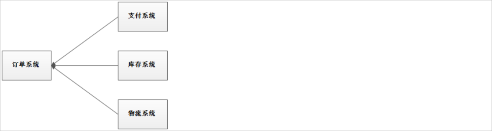 

使用消息队列以后，整个下单操作的架构如下图所示：

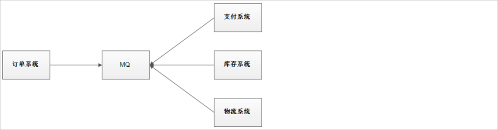 

使用消息队列解耦合，系统的耦合性就会降低了，容错性就提高了。比如物流系统发生故障，需要几分钟才能来修复，在这段时间内，物流系统要处理的数据被缓存到消息队列中，用户的下单操作正常完成。当物流系统回复后，补充处理存在消息队列中的订单消息即可，终端系统感知不到物流系统发生过几分钟故障。


### 1.2.2 流量消锋

流量消锋：消除系统中的高峰值流量(流量可以理解为就是请求)

现有一个电商系统下单初始架构如下所示：

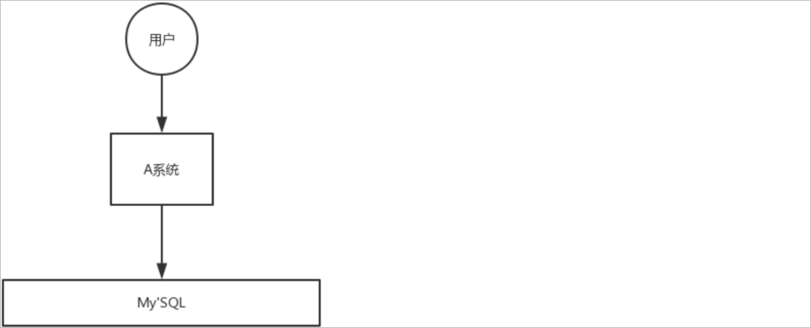 

假设用户每秒需要发送5k个请求，而我们的A系统每秒只能处理2K个请求，这样就会导致大量的下单请求失败。而且由于实际请求的数量远远超过系统的处理能力，此时也有可能导致系统宕机。

使用消息队列改进以后的架构如下所示：

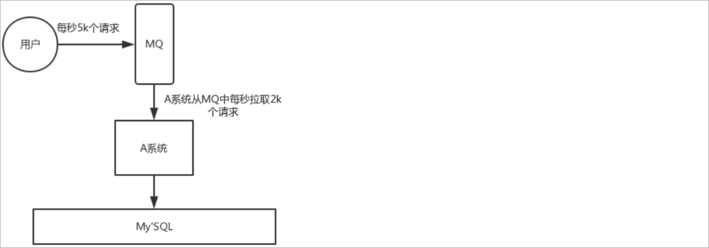 

用户每秒发送5k个请求，我们可以先将下单请求数据存储到MQ中，此时在MQ中就缓存了很多的下单请求数据，而A系统根据自己的处理能力从MQ中获取数据进行下单操作，有了MQ的缓存层以后，就可以保证每一个用户的下单请求可以得到正常的处理，并且这样可以大大提高系统的稳定性和用户体验。


### 1.2.3 异步数据分发

假设A系统进行了某一个业务操作以后，需要将这个业务操作结果通知给其他的系统，原始的架构如下所示：

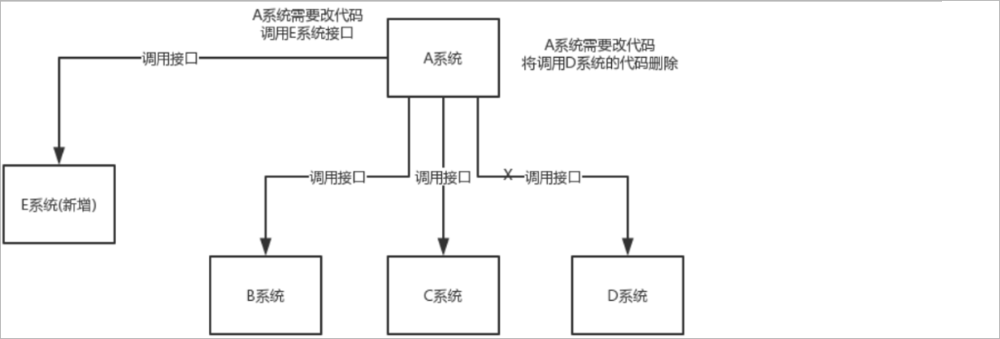 

此时B系统、C系统、D系统就需要提供对应的接口，然后让A系统进行调用。如果此时不需要通知D系统了，那么就需要更改A系统的代码，将调用D系统的代码删除掉。并且如此时项目中添加了一个新的系统E，A系统也需要将处理结果通知给E系统，那么同时也需要更改A系统的代码。这样就不利于后期的维护。

使用MQ改进以后的架构如下所示：

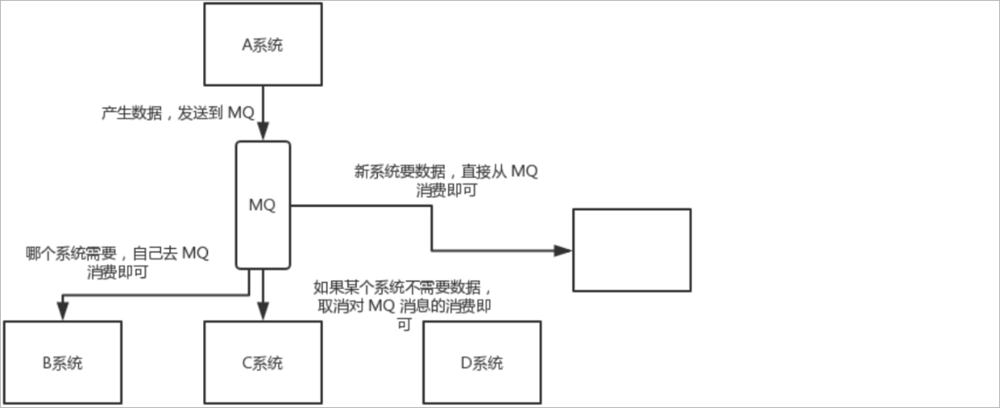 

A系统需要将业务操作结果通知给其他的系统时，A系统只需要将结果发送到MQ中。其他的系统只需要从MQ中获取结果即可，如果不需要结果了，此时只需要取消从MQ中获取结果的操作即可。并且如果新增了一个系统需要获取结果，只需要从MQ中获取结果数据就可以了，A系统的代码不需要进行改动。这样就大大的提高了系统的维护性。


## 1.3 MQ的优缺点

优点：

1、应用解耦提高了系统的容错性

2、流量消锋提高了系统的并发能力

3、异步通信提高了系统的可维护性

缺点：

1、系统可用性降低：系统引入的外部依赖越多，系统稳定性越差。一旦MQ宕机，就会对业务造成影响。

2、系统复杂度提高：MQ的加入大大增加了系统的复杂度。

### MQ的选择依据

MQ的选择依据是什么?  调用方是否需要获取到被调用方的执行结果，如果需要获取到结果，那么就需要使用同步通信，如果不需要就可以使用异步通信。

- 这是区分 “是否需要 MQ”（或选择同步通信）的基础逻辑：
  - 若需要即时获取执行结果（如 “调用支付接口后必须知道是否支付成功才能继续下单”）：
    - 更适合同步通信（如 RPC、HTTP 接口调用），因为 MQ 的异步特性无法保证 “实时响应”，可能导致业务流程阻塞或状态不一致。
  - 若不需要即时结果（如 “订单创建后，异步通知库存系统扣减库存，无需等待库存扣减结果即可返回订单成功”）：MQ 是更优选择，通过异步通信解耦系统、提升吞吐量。
    - 特殊情况：即使需要结果，也可通过 “异步回调” 实现（如被调用方处理完后，再通过 MQ 发送结果消息给调用方），此时仍可使用 MQ，但本质上是 “异步 + 结果通知”，而非同步通信
- 若存在以下情况，即使是异步场景，也可能不适合用 MQ：
  - 消息处理必须强一致：如分布式事务中，若 MQ 的 “最终一致性” 无法满足业务（如银行转账必须实时确认双方账户余额），可能需要同步通信 + 分布式锁。
  - 系统规模极小：如一个简单的内部工具，用 MQ 会增加系统复杂度（需维护 MQ 集群、处理消息丢失等问题），直接同步调用更高效。
  - 对延迟极度敏感：如高频交易系统，消息延迟可能导致业务损失，此时同步通信（如 RPC）更可靠

**总结：MQ 选择的决策框架**

先判断是否需要异步通信（是否必须获取即时结果）：需要则优先同步通信，不需要则进入 MQ 选择。
再匹配业务场景：是否需要解耦、削峰、异步通知，若需要则 MQ 是合适的。
最后筛选技术特性：根据吞吐量、延迟、可靠性、团队熟悉度等，从主流 MQ 中选择（如高吞吐选 Kafka，复杂路由选 RabbitMQ，事务消息选 RocketMQ）

## 1.4 Kafka简介

Kafka是Apache开源的一款基于zookeeper协调的分布式消息系统，具有高吞吐率、高性能、实时、高可靠等特点，可实时处理流式数据。它最初由LinkedIn公司开发，使用Scala语言编写。

Kafka历经数年的发展，从最初纯粹的消息引擎，到近几年开始在流处理平台生态圈发力，多个组织或公司发布了各种不同特性的产品。

常见产品如下：

1、<font color="red">**Apache Kafka** ：最“正统”的Kafka也是开源版，它是后面其他所有发行版的基础</font>。

2、Cloudera/Hortonworks Kafka: 集成了目前主流的大数据框架，能够帮助用户实现从分布式存储、集群调度、流处理到机器学习、实时数据库等全方位的数据理。----核心目标是将 Kafka 无缝融入 Hadoop 生态圈，成为大数据 pipeline 的关键组件，大数据领域使用较多

3、Confluent Kafka ：主要提供基于Kafka的企业级流处理解决方案，收费的。


Apache Kafka，它现在依然是开发人数最多、版本迭代速度最快的Kafka，我们使用此产品学习。我们使用版本**kafka_2.13-2.8.1**（它是用scala语言编写的所以2.13是scale版本，后面2.8.1是kafka的版本）


官网地址：https://kafka.apache.org/

下载：https://kafka.apache.org/downloads


## 1.5 MQ产品比对

市面上常见的消息队列产品：

1、ActiveMQ

2、RabbitMQ

3、RocketMQ

4、Kafka

常见特性比对：

| **特性                    ** | **ActiveMQ                **           | **RabbitMQ**                                                 | **RocketMQ**                                                 | **Kafka**                                                    |
| ---------------------------- | -------------------------------------- | ------------------------------------------------------------ | ------------------------------------------------------------ | ------------------------------------------------------------ |
| 开发语言                     | java                                   | erlang                                                       | java                                                         | scala                                                        |
| 单机吞吐量                   | 万级                                   | 万级                                                         | 10万级                                                       | 100万级                                                      |
| 时效性                       | ms                                     | us                                                           | ms                                                           | ms级以内                                                     |
| 可用性                       | 高（主从）                             | 高（主从）                                                   | 非常高（分布式）                                             | 非常高（分布式）                                             |
| 功能特性                     | 成熟的产品、较全的文档、各种协议支持好 | 并发能力强、性能好、延迟低，社区活跃度高，数据量没有那么大，优先选择功能比较完备的RabbitMQ | MQ功能比较完善，扩展性佳，可靠性要求高的金融互联网领域使用多,稳定性高，经历了多次阿里双11考验 | 只支持主要的MQ功能，大数据领域使用多，追求高吞吐量，适合产生大量数据的互联网服务的数据收集业务 |

# 概念学习

1. 核心组件：
   1. Producer（生产者）：负责将消息发送到 Kafka 集群，了解其工作原理和关键配置参数。
   2. Consumer（消费者）：从 Kafka 集群中读取消息，理解消费者组的概念和作用。
   3. Broker（代理）：Kafka 服务器，接受生产者的消息并为消费者提供消息服务，了解 Broker 在集群中的角色和职责。
   4. Cluster（集群）：多个 Broker 组成的集群，以及集群控制器的作用。
2. 消息模型：
   1. 主题（Topic）与分区（Partition）的关系，分区如何实现水平扩展和提高吞吐量。
      1. 分区的每个区就是存的最终的消息队列，里面的每一条消息message都有一个唯一的offset偏移量，用来标识消息在队列中的位置
      2. 默认创建主题时，分区数由 num.partitions 决定（默认 ≥1），必然会创建分区；
         1. 即使手动指定，也不允许设置分区数为 0，因为这违反了 Kafka 的设计逻辑（主题必须包含至少一个分区才能工作
   2. 消息的生产和消费流程，包括生产者如何选择分区发送消息，消费者如何从分区中拉取消息
3. 集群搭建：配置多个 Broker 节点，组成 Kafka 集群，理解集群中各节点的协作方式

## 相关特性

### 消息顺序的保证
1. Kafka 对消息顺序的保证是 **“分区内有序，跨分区无序”**，即：同一分区内的消息会严格按照生产者发送的顺序存储和消费，但不同分区之间的消息顺序无法保证。这一特性由 Kafka 的架构设计决定

### 消费者获取消息方式

在 Kafka 中，消费者接收消息的核心方式是 “主动拉取（Poll）”，即通过 poll() 方法从 broker 拉取消息，这是 Kafka 设计的基础模式

- Kafka 设计为消费者主动拉取消息，而非 broker 推送（Push），主要原因是：
  - 消费者可控性更高：消费者可以根据自身处理能力调整拉取频率和数量（如通过 max.poll.records 控制单次拉取的消息量），避免被 broker 推送的大量消息压垮。
  - 适应不同消费速度：不同消费者的处理能力不同（如有的快有的慢），拉取模式允许消费者自主决定何时获取消息，更灵活


## 进阶计划
1. 生产者进阶：
   1. 数据生产流程深度解析，包括消息拦截器、序列化器、分区器的作用和使用方法。
   2. 关键配置参数详解，如 acks、retries、batch.size、linger.ms 等，以及如何根据业务需求进行调整。
2. 消费者进阶：
   1. 消费方式与原理，如拉取模式的特点和优势。
   2. 分区分配策略，如 Range、Round - Robin 策略的工作原理和适用场景。
   3. 消费者组与 Offset 管理，包括自动提交和手动提交 Offset 的区别和使用场景。
3. 数据可靠性与性能优化：
   1. ISR 机制与数据可靠性，了解如何通过 ACK 级别和 ISR 同步来保证消息不丢失。
   2. 幂等性生产者和事务，解决消息重复和数据一致性问题。
   3. 性能优化方法，如合理设计分区、使用批处理和压缩等技术提高吞吐量。
4. 命令行工具使用
   1. 使用 kafka - topics.sh 命令创建、删除、查看主题。
   2. 使用 kafka - producers.sh 和 kafka - consumers.sh 命令发送和消费消息。
   3. 使用 kafka - consumer - groups.sh 命令管理消费者组
5. 实战案例
   1. 构建一个简单的实时日志收集系统，使用 Kafka 收集应用程序日志，并进行实时分析和存储。
   2. 实现一个电商订单处理系统，通过 Kafka 实现订单消息的异步处理，如库存扣减、物流通知等。
6. 监控与运维：
   1. EFAK：适合专注于 Kafka 集群本身监控的场景，尤其是中小规模集群或快速部署需求
   2. Prometheus + Grafana：通用监控平台，灵活强大，适合多系统联动和定制化需求，不限语言和系统服务类型
      1. 使用 Prometheus 和 Grafana 监控 Kafka 集群的性能指标，如吞吐量、延迟、副本状态等。
   3. 常见故障处理，如 Broker 崩溃、网络分区等情况下的应对策略
7. Kafka 生态系统：
   1. Kafka Connect：用于数据导入导出，了解其工作原理和常用连接器。
   2. Kafka Streams：Kafka 的流处理库，学习如何使用它进行实时数据处理和分析。
   3. Schema Registry：管理消息模式，确保数据的一致性和兼容性。
8. 与其他技术集成：
   1. Kafka 与 Spark、Flink 等流处理框架的集成，实现更复杂的数据分析和处理任务。
   2. Kafka 与数据库的集成，如将 Kafka 消息写入 MySQL、HBase 等数据库


## 消息模型

### Topic
可以把 Kafka 里的 Topic（主题） 理解成一个 “分类邮箱”，用来按类别存放消息。下面用生活化的例子解释相关概念：

1. Topic（主题）：消息的 “分类文件夹”
比如你有一个邮箱，里面有 “工作邮件”“朋友消息”“促销广告” 三个分类文件夹 —— 这些文件夹就相当于 Kafka 的 Topic。

发送消息时，必须指定要放进哪个 “文件夹”（Topic）；
接收消息时，只需要关注自己需要的 “文件夹”（比如只看 “工作邮件”）。

作用：给消息分类，让生产者和消费者只关注自己关心的消息类型（比如电商系统中，“订单消息”“库存消息” 会放在不同 Topic 里）。

### Partition（分区）： Topic 的 “子文件夹”

一个大的 “文件夹”（Topic）可以拆成多个 “子文件夹”（Partition）。比如 “工作邮件” 太多，拆成 “项目 A 邮件”“项目 B 邮件” 两个子文件夹。

**特点：**
1. 分区与broker服务器的关系是多对多关系
   1. Kafka 中，分区是逻辑概念（消息的存储单元），服务器（Broker）是物理节点
   2. 一个Broker可以承载多个分区，1个分区的多个副本可以分布在不同broker实现高可用
2. 每个分区里的消息是 有序 的（按发送顺序排列）；分区里就是实际的消息队列结构，每一条消息message都有一个唯一的offset偏移量，用来标识消息在队列中的位置
3. 分区可以分布在不同的 Kafka 服务器上，实现 “并行处理”（比如两个子文件夹分别由两个人处理，效率更高）。

**作用**：提升并行能力，提升高吞吐量，拆分消息，提高读写速度，支持 Kafka 水平扩展。

----默认创建主题时，分区数由 num.partitions 决定（默认 ≥1），必然会创建分区；
----即使手动指定，也不允许设置分区数为 0，因为这违反了 Kafka 的设计逻辑（主题必须包含至少一个分区才能工作


#### 分区的本质

> 分区的本质是 “有序队列”

Kafka 的主题（Topic）可以划分为多个分区（Partition），每个分区本质上是一个追加式写入的有序日志文件：

生产者发送的消息会被分配到某个分区，同一分区内的消息按发送时间顺序依次追加（Offset 递增），先发送的消息 Offset 更小，后发送的更大。

消费者消费时，会按分区内的 Offset 顺序拉取消息（从最小 Offset 到最大 Offset），因此同一分区内的消息一定会按发送顺序被消费。


- Kafka 对消息顺序的保证是 **“分区内有序，跨分区无序”**，即：同一分区内的消息会严格按照生产者发送的顺序存储和消费，但不同分区之间的消息顺序无法保证

#### 分区数量的衡量
需要结合业务吞吐量需求、消费者并行能力、集群规模、存储成本等多维度综合评估。没有固定的 “公式”，

**核心原则：** 分区的核心作用是提升吞吐量，因此单分区的性能上限是估算分区数的基础。需要先通过压测确定单分区的 “极限吞吐量”（包括生产者写入和消费者读取），再结合业务的总吞吐量需求计算


### Producer（生产者）：发消息的人
比如你写了一封工作邮件，选择放进 “工作邮件” 文件夹 —— 你就是 Producer，负责往指定 Topic 里发消息。

### Consumer（消费者）：收消息的人
比如同事专门看 “工作邮件” 文件夹里的消息 —— 同事就是 Consumer，负责从指定 Topic 里读消息。

1. 从 Kafka 消费机制的本质来说，消费者确实是 “面向分区” 接收消息的。所有消费行为最终都落实到具体分区上，消费者通过与分区绑定来获取消息，这是 Kafka 消费模型的核心设计
2. Kafka 消费者必须属于某个消费者组（通过 group.id 配置），而消费者组与分区的关系遵循一个铁律：
   1. ***一个分区只能被同一个消费者组内的一个消费者消费，但一个消费者可以消费多个分区***
      1. 目的是避免重复消费（同一分区的消息不会被组内多个消费者同时处理），同时通过 “一个消费者消费多个分区” 实现一定的并行性
   2. 例如：主题 topic-01 有 5 个分区（P0-P4），消费者组 group-01 有 2 个消费者（C1、C2）并行消费。
      1. 经过特定的分区分配策略后，分配结果可能是：C1 消费 P0、P1、P2；C2 消费 P3、P4（每个分区仅被一个消费者消费
3. 消费端的消息顺序完全由分区决定，核心规则是：
“同一分区的消息被单线程顺序消费；不同分区的消息可被多线程并行消费”


#### Consumer Group（消费组）：协作的 “团队”
如果 “工作邮件” 太多，一个人看不完，就成立一个 “工作邮件处理小组”（Consumer Group），消费组里的人分工每个人负责一个分区内的消息（看不同的子文件夹（Partition）。）

1. 消费组内消费者的分区分配策略：略~，需要再查

**消费分区的消息**：
1. Kafka 消费者组中，一个分区只能被组内一个消费者消费（避免重复消费）。因此，分区数直接决定了消费者组的最大并行消费能力：
2. 若需要 5 个消费者并行消费，则分区数至少为 5；
若分区数为 3，即使启动 5 个消费者，也只有 3 个在工作，其余 2 个空闲

### Offset（偏移量）：消息的 “页码”
> 位移提交是消费者管理消费进度的核心机制

每个消息在每个分区里都有一个唯一的 “编号”（比如第 1 条、第 2 条...），这个编号就是 Offset。

1. 位移提交的本质是消费者向 Kafka 集群声明：“我已经成功处理了位移值小于 X 的所有消息”，并将 X 作为下次消费的起点
   1. 消费者会记录自己读到了哪个编号（比如 “读到第 10 条”），下次从第 11 条开始读，不会重复读旧消息。

#### 自动提交与手动提交的逻辑差异

- 自动提交（Auto Commit）：
  - 逻辑：Kafka 客户端每隔 auto.commit.interval.ms（默认 5 秒）自动提交当前消费的最高位移。
  - 问题：若提交后消费者崩溃，已提交但未处理的消息会被重新消费；若提交间隔过长，可能因重平衡导致较大时间窗口的重复消费。
  - 适用场景：对数据一致性要求不高的日志采集等场景。
- 手动提交（Manual Commit）：
  - 逻辑：开发者需在消息处理完成后显式调用 commitSync() 或 commitAsync() 提交位移。
  - 优势：
    - 精准控制：可在事务或业务逻辑完成后提交，确保 “处理成功” 与 “位移更新” 的原子性。
    - 结合事务：通过 sendOffsetsToTransaction() 实现 Exactly Once 语义，确保消息生产与位移提交的一致性。

### 一句话总结关系:
Producer 往 Topic（含多个 Partition）里发消息；
Consumer Group 里的 Consumer 分工读取 Topic 中不同 Partition 的消息，通过 Offset 记录阅读进度。

## kafka的服务器：Broker代理

1. 什么是 Broker？
   1. Broker 就是运行 Kafka 服务的服务器即docker中对应的kafka123服务实例（可以是物理机或虚拟机），是 Kafka 的 “存储和转发节点”。
   2. 一个 Kafka 集群由 多个 Broker 组成（比如 3 台服务器，每台都是一个 Broker），避免单台机器故障导致服务崩溃
   3. docker环境搭建中的kafka123服务就是代表的broker服务

### topic与Broker区别
“Topic 是逻辑概念，Broker 是物理存储载体”，两者的关系可以用一个生活例子说清楚：

假设你要寄一批文件，按 “工作”“生活”“学习” 分类装袋：

“工作袋”“生活袋”“学习袋” 就相当于 Kafka 中的 Topic（逻辑分类，只负责区分消息类型，本身不存储具体内容）；

你把这些袋子分别放进不同的 储物柜（比如 “工作袋” 放 1 号柜，“生活袋” 放 2 号柜），这些 储物柜 就相当于 Broker（物理存储设备，负责实际保存内容）。

具体来说：

Topic 是 “逻辑容器”
它只是给消息贴了个 “标签”，告诉系统 “这些消息属于同一类”（比如 “订单消息” 都放进 order-topic）。但 Topic 本身是抽象的，不直接存储消息，就像 “工作袋” 这个标签本身不会装文件，而是需要具体的袋子（Partition）和柜子（Broker）来承载。

Broker 是 “物理仓库”
消息最终会被写入 Broker 的磁盘中。但为了高效存储和读取，Topic 会被拆分成多个 Partition（分区）（相当于 “工作袋” 里的小文件袋），每个 Partition 会被分配到某个 Broker 上。

比如：order-topic 有 3 个 Partition，分别存放在 Broker 1、Broker 2、Broker 3 上 —— 此时，消息其实是存在这三个 Broker 的磁盘文件里，而 Topic 只是这些 Partition 的 “集合名称”。

#### 为啥要topic的分区要放在不同服务器里？

一个 Topic 的消息分散存储在不同服务器（Broker）上，是 Kafka 为了实现高吞吐量、高可用性和水平扩展而设计的核心机制，背后有三个关键原因：

**1. 提高读写速度（解决单服务器性能瓶颈）**

如果一个 Topic 的所有消息都存在一台服务器上，那么：

生产者发送消息时，只能往这台服务器写，单台服务器的 CPU、内存、磁盘 IO 很快会达到上限（比如每秒最多处理 1 万条消息）；
消费者读取消息时，也只能从这台服务器读，同样会被单台服务器的性能卡住。

而分散存储后：

消息被拆分成多个 Partition，每个 Partition 存到不同 Broker 上（比如 3 个 Partition 分别在 3 台 Broker 上）；
生产者可以同时往 3 台 Broker 写消息（并行写入），消费者也可以同时从 3 台 Broker 读消息（并行读取），吞吐量直接翻倍（比如从 1 万条 / 秒提升到 3 万条 / 秒）。

类比：一个快递点每天要处理 1000 个包裹，如果只由 1 个快递员处理，可能要 10 小时；分给 3 个快递员，3 小时就能完成 —— 分散工作能突破单节点的性能上限。

**2. 实现高可用（避免单服务器故障导致数据丢失）**

如果所有消息都存在一台服务器上，这台服务器一旦宕机（比如断电、磁盘损坏），整个 Topic 的消息就会丢失，依赖这个 Topic 的业务会直接中断。

分散存储时，Kafka 会给每个 Partition 设置副本（Replica）：

每个 Partition 的主副本（Leader）存在一台 Broker 上，同时会在其他 Broker 上保存从副本（Follower）；
主副本负责处理读写请求，从副本实时同步主副本的数据；
当主副本所在的 Broker 故障时，Kafka 会自动把从副本升级为新的主副本，消息不丢失，业务不中断。

类比：重要文件不仅存在自己电脑里，还会备份到同事电脑和云端 —— 即使自己电脑坏了，还能从备份中恢复，不影响使用。

**3. 支持水平扩展（随业务增长动态扩容）**

业务增长时，消息量可能从每天 10 万条涨到 1000 万条，单台服务器的存储和性能根本不够用。

分散存储让 Kafka 可以通过增加 Broker 节点轻松扩容：

新增 Broker 后，可以把现有 Topic 的部分 Partition 迁移到新 Broker 上（比如原来 3 个 Partition 在 3 台 Broker 上，新增 2 台 Broker 后，分散到 5 台，进一步分摊压力）；
也可以给 Topic 增加更多 Partition（比如从 3 个 Partition 扩到 5 个），新 Partition 直接存到新增的 Broker 上。

类比：一个超市只有 1 个收银台，高峰期排队严重；后来新增了 4 个收银台，顾客分散结账，排队问题立刻解决 —— 通过增加节点就能应对增长的需求。

## 发送消息的角色：Producer（生产者）

生产者是发送消息到 Kafka 的应用程序（比如 Java 代码、Python 脚本等），负责把业务数据（如订单创建、用户登录）转换成 Kafka 能识别的 “消息”，并发送到指定 Topic。

## 接收消息的角色：Consumer（消费者）

消费者是从 Kafka 中读取消息的应用程序（比如数据分析程序、订单处理程序），会从指定的 Topic 中拉取消息并处理

# 2 Kafka环境搭建

## 2.0 docker搭建环境

> 直接用docker安装kafka环境，直接参考`./配置文件目录md说明`即可

安装完服务启动后，打开浏览器，输入`http://127.0.0.1:8048`，即可打开kafka的efak监控管理后台页面

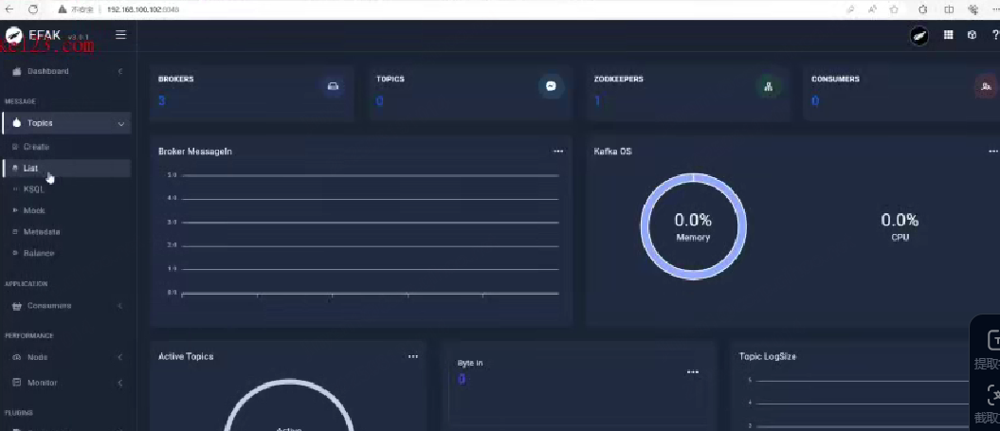


## 2.1 Kafka集群机制

集群机制说明：

1、Kafka是**天然支持集群**的，哪怕是一个节点实际上也是集群模式

2、Kafka集群依赖于zookeeper进行协调，并且在早期的Kafka版本中很多数据都是存放在Zookeeper中的

3、Kafka节点只要注册到同一个Zookeeper上就代表它们是同一个集群的

4、Kafka通过brokerId来区分集群中的不同节点


## 2.2 Kafka基础架构

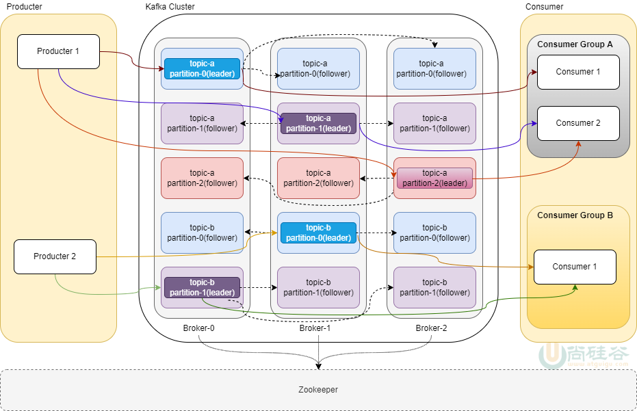

- **从水平方向看：每一行就代表一个主题下的分区，有几列就是代表副本数量**
  - 每个主题含多个分区，每个分区都有主从副本，每个分区的主副本不能都放在broker服务器里，提升容错性
- 上图就是主题b的一共有2行3列就是2个分区3个副本的可视化图，主题a的3个分区3个副本。
- 生产者发送消息流程
  - 首先生产者发送消息，只往目标主题目标分区的leader里发，对应同分区同主题的从副本们follower只负责从leader中同步数据----相当于**读写分离**
- 消费者：也是只从leader中去消费数据

Kafka的核心角色介绍：

| **角色名称                         ** | **具体含义**                                                 |
| ------------------------------------- | ------------------------------------------------------------ |
| Broker                                | Broker是一个kafka实例，简单说就是一台kafka服务器，kafkaCluster表示集群。 |
| Topic                                 | 主题 ,Kafka将**消息进行分类**，每一类的消息称之为一个主题。  |
| Producer                              | 生产者，可以向Broker topic 发布消息的客户端。                |
| Consumer                              | 消费者，从Broker topic 订阅消息的客户端。                    |
| Partition                             | Topic的分区，每个 Topic 可以有多个分区，同一个Topic 在不同分区的数据是不重复的。每个partition都由一系列有序的、不可变的消息组成，这些消息被连续的追加到partition中。**分区作用是做负载，提高 kafka 的吞吐量。** |
| Replication                           | Partition(分区)的副本。每个分区可以有多个Replication，由一个Leader和若干个Follower组成。Leader负责接收生产者push的消息和消费者poll消费消息。Follower会实时从自己的Leader中同步数据保持同步。Leader故障时,某个Follower会上位为新的Leader。**分区副本的作用是保证高可用。** |
| ConsumerGroup                         | 同一个消费者组中的多个消费者**分摊**一个topic中的消息，不同消费者组中的多个消费者**共同**消费一个topic中的相同消息 |
| In-sync Replicas（ISR）               | （ISR）已同步副本：表示存活且副本都已和Leader同步的的broker集合，是Leader所有replicas副本的子集。如果某个副本节点宕机，该副本就会从ISR集合中剔除。 |
| ZooKeeper                             | Kafka使用ZooKeeper来进行集群管理、协调和元数据存储。Kafka中的Broker、Topic、Consumer都会注册到zookeeper。 |


## 2.3 Kafka集群搭建

为了测试方便，我们选择搭建伪分布式Kafka集群，在同一台虚拟机上启动**一个zookeeper实例**，**三个Kafka实例**。并且使用docker compose进行搭建，具体的docker compose文件的内容参考课程资料: **docker-compose-kafka.yml**

访问EFAK账号和密码： admin/123456


## 2.4 Kafka集群测试

### **进入任意一个容器：**

```shell
docker exec -it kafka1 /bin/bash
```


### **topic操作相关命令**：

```shell
# 创建主题
kafka-topics.sh --create --topic hellokafka-topic --bootstrap-server 192.168.100.102:9092
kafka-topics.sh --create --topic hellokafka-topic1 --bootstrap-server 192.168.100.102:9093

# kafka-topics.sh：Kafka 提供的命令行工具，用于管理主题（创建、删除、查看配置等）。
# --create：指定操作类型为 “创建主题”。
# --topic hellokafka-topic：指定要创建的主题名称为 hellokafka-topic。
# --bootstrap-server 192.168.100.102:9092：链接 Kafka 集群的 broker 地址（这里是单机部署的 broker，IP 为 192.168.100.102，端口 9092------部署的kafka123就是broker）只是链接集群的入口，不代表仅分配这1个broker资源

# 执行后发生什么？
# 命令会连接到 192.168.100.102:9092 的 Kafka broker，发送 “创建主题” 的请求。
# Kafka 会在集群中创建 hellokafka-topic 主题，使用默认配置：
#    1-分区数：默认由 broker 配置 num.partitions 决定（通常默认是 1）。
#    2-副本数：默认由 broker 配置 default.replication.factor 决定（默认是 1，因为没有其他 broker 可作为副本，默认1的话与leader都存在同一个broker服务器里）


# 建立3个分区并给每个分区建立3个副本
kafka-topics.sh --create --topic myclustertopic --partitions 3 --replication-factor 3 --bootstrap-server 192.168.100.102:9092
# 你的命令指定了3个分区， replication-factor 3，意味着每个分区需要 3 个副本，这些副本必须分布在 3 个不同的 broker 上（Kafka 不允许同一分区的副本存放在同一个 broker，否则副本失去冗余意义）。
# 如果你的 Kafka 集群只有 1 个 broker（如单机部署），执行这条命令会失败，报错类似：
# Replication factor: 3 larger than available brokers: 1（副本数 3 大于可用 broker 数量 1）

# 执行成功后：
# 如果集群满足条件，创建后：
# 主题 myclustertopic 会有 3 个分区（Partition 0、1、2）。
# 每个分区有 3 个副本，分别分布在 3 个不同的 broker 上（例如：
# Partition 0 的主副本在 broker 0，从副本在 broker 1、2；
# Partition 1 的主副本在 broker 1，从副本在 broker 0、2；
# Partition 2 的主副本在 broker 2，从副本在 broker 0、1）。
# 这种配置能提供较高的可靠性（单个 broker 故障，其他 broker 的副本可接替工作）和吞吐量（3 个分区并行处理消息）

# 查看系统中的topic主题查看，可以尝试从其他的节点上进操作
kafka-topics.sh --list --bootstrap-server 192.168.100.102:9092
# 这是集群中某个 broker 的地址作为入口，工具会通过它获取整个集群的主题信息，并返回

# 查看topic主题的详情信息
kafka-topics.sh --describe --topic hellokafka-topic --bootstrap-server 192.168.100.102:9092     
```


#### topic主题的describe详情信息说明：
```js
Topic: hellokafka-topic	TopicId: XXXXXXXX-XXXX-XXXX-XXXX-XXXXXXXXXXXX	PartitionCount: 3	ReplicationFactor: 2	Configs: segment.bytes=1073741824
	Topic: hellokafka-topic	Partition: 0	Leader: 1	Replicas: 1,2	Isr: 1,2
	Topic: hellokafka-topic	Partition: 1	Leader: 2	Replicas: 2,0	Isr: 2,0
	Topic: hellokafka-topic	Partition: 2	Leader: 0	Replicas: 0,1	Isr: 0,1
```
- Topic: hellokafka-topic：主题名称，即你查询的主题。
- TopicId：Kafka 为主题生成的唯一标识符（UUID），用于内部区分主题。
- PartitionCount: 3：该主题包含 3 个分区（分区编号从 0 开始）。
- ReplicationFactor: 2：每个分区有 2 个副本（1 个 Leader + 1 个 Follower，确保数据冗余）。
- Configs: segment.bytes=1073741824：主题的配置参数，这里表示每个日志段的大小为 1GB（默认值）
- 下面的每一行代表1个分区
  - Partition: 0：分区编号（从 0 开始递增）。
  - Leader: 1：该分区的首领副本所在的 Broker ID（这里是 Broker 1，对应单独的kafka服务器实例）。所有生产者和消费者的请求都由 Leader 处理，确保数据一致性。
  - Replicas: 1,2：该分区的所有副本所在的 Broker 列表（顺序表示副本的优先顺序）。这里表示副本分别在 Broker 1（Leader）和 Broker 2（Follower）上。
  - Isr: 1,2：已同步的可用的副本集且没有宕机（In-Sync Replicas），即与 Leader 保持数据同步的副本所在的 Broker 列表。
    - 只有 Isr 中的副本才有资格在 Leader 故障时被选举为新的 Leader。（如果 Follower 长时间未同步数据，会被移出 Isr 列表）。

如果我创建了单机的主题，1个分区，1个副本(即默认的leader首领副本)，那么这个主题的详情信息，就应该是leader和Replicas都指向同一个broker服务器id即1个broker服务器里同时存在1个分区1个副本


### **发送以及接收消息：**

#### 发送消息

```shell
# 使用生产者脚本发送消息
kafka-console-producer.sh  --topic hellokafka-topic --bootstrap-server 192.168.100.102:9092
```
发消息时：回车后进入消息输入界面

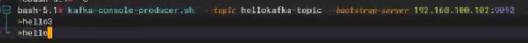

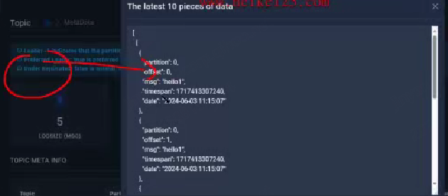

1. 生产者向 Topic 发送消息时，不需要强制指定分区。Kafka 会通过默认策略自动将消息分配到某个分区
   1. 生产者可以通过代码手动指定消息发送到哪个分区（如 partition=2），但大多数场景下不需要，依赖默认策略即可满足需求
2. Kafka 生产者的默认分区策略由 DefaultPartitioner 实现，遵循以下规则：
   1. 若消息指定了 key（如订单 ID、用户 ID）：通过哈希算法（默认 murmur2 哈希）计算 key 的哈希值；对 Topic 的分区数取模，结果即为目标分区编号：`分区编号 = hash(key) % 分区总数`
      1. 效果：相同 key 的消息会被分配到同一个分区（保证分区内消息有序）。
      2. 例：Topic 有 3 个分区，key="user123" 的哈希值为 10，10 % 3 = 1 → 消息进入分区 1；下次相同 key 仍会进入分区 1。
      3. 主题创建阶段不需要定义或创建 key，key 是消息发送时的动态属性，key 的值和格式完全由业务决定（如订单 ID、用户 ID 等），目的是控制消息的分区分配和保证局部顺序性。自定义传入一个业务含义的key，经过hash计算到不同的分区id
   2. 若消息未指定 key（key=null）：采用 轮询（Round-Robin） 策略：消息会依次分配到每个分区，确保负载均匀。
      1. 效果：消息在各分区中平均分布，提高并行处理效率。
      2. 例：Topic 有 3 个分区，消息发送顺序为：第 1 条→分区 0，第 2 条→分区 1，第 3 条→分区 2，第 4 条→分区 0，以此类推。


#### 接收消息
```shell
# 使用消费者脚本接收消息
# 从当前位置开始消费：只接收从 “当前时间点之后” 发送到主题的新消息，不会消费启动前已存在的历史消
kafka-console-consumer.sh --topic hellokafka-topic --bootstrap-server 192.168.100.102:9092

# --from-beginning: 表示从最开始的位置进行消费消费
kafka-console-consumer.sh --topic hellokafka-topic --from-beginning --bootstrap-server 192.168.100.102:9092
```

- --from-beginning 参数强制覆盖默认的 Offset 策略，无论是否有历史消费记录，都从分区的起始位置（earliest）开始消费，包括所有历史消息和后续产生的新消息


### 删除主题

- EFAK可视化界面删除主题的时候需要输入密码admin token进行权限校验
```js
// 获取admin token需要进入到容器中，查看system-config.properties配置文件进行获取。
docker exec -it eagle /bin/bash
cat conf/system-config.properties

得到如下配置：可知token是keadmin
######################################
# delete kafka topic token
# Set to delete the topic token, so that administrators can have the right to delete
######################################
efak.topic.token=keadmin
```

- 命令行删除主题
```shell
# 需确保 broker 配置 delete.topic.enable=true，默认已开启
# 删除主题
kafka-topics.sh --bootstrap-server 192.168.100.102:9092 --topic hellokafka-topic --delete
```

- 命令行删除消息
```SHELL
# Kafka 中，没有直接 “删除消息” 的命令行工具，因为 Kafka 的设计理念是通过 “日志留存策略” 自动清理过期消息，而非手动删除指定消息
kafka-configs.sh --alter \
  --topic hellokafka-topic \
  --add-config retention.ms=1 \
  --bootstrap-server 192.168.100.102:9092
```


# 3 Java API入门案例

## 3.1 发送消息

具体步骤如下所示：

1、创建一个kafka-parent父工程，删除src目录，并加入如下依赖：

```xml
<!-- 此pom.xml文件就是maven的依赖管理配置文件 -->

<!-- 父工程 ， JDK选择17 -->
<parent>
    <artifactId>spring-boot-starter-parent</artifactId>
    <groupId>org.springframework.boot</groupId>
    <version>3.0.5</version>
</parent>

<!--====== kafka客户端包依赖：kafka-clients 2023.8- -->
<dependency>
    <groupId>org.apache.kafka</groupId>
    <artifactId>kafka-clients</artifactId>
    <version>3.5.1</version>
</dependency>

<dependency>
    <groupId>org.springframework.boot</groupId>
    <artifactId>spring-boot-starter-test</artifactId>
</dependency>
```

2、在kafka-parent父工程下创建kafka-producer子工程

3、创建启动类

```java
// 生产者启动类ProducerApplication.java文件
package com.atguigu.kafka;
// 这个启动类运行时，初始化项目依赖，包括kafka环境，spring环境，日志环境等
// @SpringBootApplication 相当于正式环境NODEENV=production：----在正式环境（项目实际运行时），带有 @SpringBootTest 注解的测试类不会被执行
@SpringBootApplication
public class ProducerApplication {
    public static void main(String[] args) {
        SpringApplication.run(ProducerApplication.class , args) ;
    }

}
```
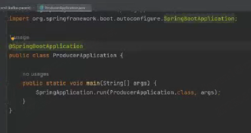

4、导入课程资料的logback-spring.xml

5、生产者代码实现：

官网示例代码：https://kafka.apache.org/35/javadoc/org/apache/kafka/clients/producer/KafkaProducer.html

测试代码：
```java
package com.atguigu.kafka; // 指定命名空间

// Kafka 生产者的核心类，负责与 Kafka 集群建立连接、发送消息，并处理消息的分区、序列化等底层逻辑
import org.apache.kafka.clients.producer.KafkaProducer;
// 配置常量类，定义了所有 Kafka 生产者的配置参数名称
import org.apache.kafka.clients.producer.ProducerConfig;
// 消息载体类，用于封装要发送到 Kafka 的消息内容
import org.apache.kafka.clients.producer.ProducerRecord;
import org.junit.jupiter.api.Test;
import org.springframework.boot.test.context.SpringBootTest;
import java.util.Properties;

// @SpringBootTest相当于NODE_ENV=development 测试环境执行到的代码

// 里面的参数是设置测试环境启动时要继承的配置类（这里复用了生产环境的启动类）---- 继承不同的配置类相当于继承了不同上下文环境配置参数方法
@SpringBootTest(classes = ProducerApplication.class)
public class ProducerDemo01 {

    // 主题名称: 可以事先不用创建主题，传输时会自动创建
    public static final String TOPIC_NAME = "hellokafka";

    @Test
    public void sendMsg() {

        // 创建生产者属性对象
        Properties properties = new Properties() ;
        /**
         * ProducerConfig.BOOTSTRAP_SERVERS_CONFIG：这是 Kafka 定义的常量，表示 “Kafka 集群地址” 配置项（底层对应字符串 "bootstrap.servers"）。
值 "192.168.100.102:9092"：是你的 Kafka 服务器的实际地址和端口（9092 是 Kafka 的默认端口）。
作用：告诉生产者 “要连接到哪台 Kafka 服务器”
         */
        properties.put(ProducerConfig.BOOTSTRAP_SERVERS_CONFIG , "192.168.100.102:9092") ;
        
        /**
         * ProducerConfig.KEY_SERIALIZER_CLASS_CONFIG：表示 “消息 Key 的序列化器” 配置项（底层对应 "key.serializer"）。
值是一个类的全路径：StringSerializer 是 Kafka 提供的字符串序列化器。
作用：Kafka 传输数据时只能发送字节（byte），所以需要把你的 Key（这里是字符串类型）转换成字节，这个类就是干这个的
         */
        properties.put(ProducerConfig.KEY_SERIALIZER_CLASS_CONFIG , "org.apache.kafka.common.serialization.StringSerializer") ;
        
        // 同样使用 StringSerializer：表示你的消息内容（Value）也是字符串类型，需要转换成字节传输
        properties.put(ProducerConfig.VALUE_SERIALIZER_CLASS_CONFIG , "org.apache.kafka.common.serialization.StringSerializer") ;

        // 创建生产者对象
        KafkaProducer kafkaProducer = new KafkaProducer(properties) ;

        // 调用send方法发送消息
        for (int i = 0; i < 10; i++) {
            // 调用send方法发送消息
            ProducerRecord producerRecord = new ProducerRecord(TOPIC_NAME , "helloKafka~" + i) ;
            // 也可以传送键值对的格式：key 是user123（字符串），value 是用户行为 JSON ---- 指定key会涉及分区策略
            // producer.send(new ProducerRecord<>("user-behavior", "user123", "{\"action\":\"click\"}"));
            kafkaProducer.send(producerRecord) ;
        }

        // 关闭资源
        kafkaProducer.close();

    }

}
```

消息发送完毕以后可以通过eagle系统查看主题消息。
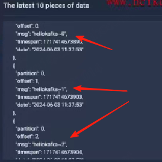


## 3.2 消费消息

具体步骤如下所示：

1、在kafka-parent父工程下创建kafka-consumer子工程

2、创建启动类

```java
package com.atguigu.kafka;

@SpringBootApplication
public class ConsumerApplication {

    public static void main(String[] args) {
        SpringApplication.run(ConsumerApplication.class , args) ;
    }

}
```

3、消费者代码实现：

官网示例代码：https://kafka.apache.org/35/javadoc/org/apache/kafka/clients/consumer/KafkaConsumer.html

测试代码：

```java
package com.atguigu.kafka;
// 消费者配置常量类，定义了所有 Kafka 消费者的配置参数名称。
import org.apache.kafka.clients.consumer.ConsumerConfig;
// 单条消息的载体类，封装了从 Kafka 拉取的一条具体消息的全部信息
import org.apache.kafka.clients.consumer.ConsumerRecord;
// 多条消息的集合类，封装了一次 poll() 调用拉取到的所有消息（可能来自多个分区
import org.apache.kafka.clients.consumer.ConsumerRecords;
// Kafka 消费者的核心类，负责与 Kafka 集群建立连接、拉取消息、提交消费偏移量（offset）等底层逻辑
import org.apache.kafka.clients.consumer.KafkaConsumer;
import org.junit.jupiter.api.Test;
import org.springframework.boot.test.context.SpringBootTest;

import java.time.Duration;
import java.util.Arrays;
import java.util.Properties;


@SpringBootTest(classes = ConsumerApplication.class)
public class ConsumerDemo01 {

    // 定义主题
    public static final String TOPIC_NAME = "hellokafka";

    @Test
    public void consumerMsg() {

        // 创建属性对象
        Properties properties = new Properties() ;
        properties.put(ConsumerConfig.BOOTSTRAP_SERVERS_CONFIG , "192.168.100.102:9092") ;
        properties.put(ConsumerConfig.GROUP_ID_CONFIG , "group01") ;
        properties.put(ConsumerConfig.KEY_DESERIALIZER_CLASS_CONFIG , "org.apache.kafka.common.serialization.StringDeserializer") ;
        properties.put(ConsumerConfig.VALUE_DESERIALIZER_CLASS_CONFIG , "org.apache.kafka.common.serialization.StringDeserializer") ;
        // earliest：最开始第一次向一个topic发消息时，如果没有消费位移，那么此时从最早（最小）偏移量开始读取消息
        // latest：最开始第一次向一个topic发消息时，如果没有消费位移，那么此时从最新（最大）偏移量开始读取消息
        // 查看消费位移的命令如下：
        // kafka-consumer-groups.sh --bootstrap-server localhost:9092 --group group01 --describe
        properties.put(ConsumerConfig.AUTO_OFFSET_RESET_CONFIG , "earliest") ;   

        // 创建消费者对象
        KafkaConsumer kafkaConsumer = new KafkaConsumer(properties) ;

        // 订阅主题：将topickName转为列表结构，可订阅多个主题
        kafkaConsumer.subscribe(Arrays.asList(TOPIC_NAME));
        while (true) {

            // 消费消息--订阅主题并持续消费消息
            // Kafka 消费者是 “主动拉取” 模式，需要不断调用 poll() 方法获取新消息
            ConsumerRecords<String , String> consumerRecords = kafkaConsumer.poll(Duration.ofMillis(100)); 
            // 参数 Duration.ofMillis(100)：表示 “拉取超时时间”—— 如果当前没有消息，消费者会等待 100 毫秒，超时后返回空集合（不会一直阻塞）。
            // 返回值 ConsumerRecords：是一个 “消息集合”，包含本次拉取到的所有消息（可能来自多个分区）
            for (ConsumerRecord<String , String> record : consumerRecords) {
                System.out.printf("offset = %d, key = %s, value = %s%n", record.offset(), record.key(), record.value());  // offset表示消费位移
            }

        }

    }

}
```

### 拿到的消息结果示例
```js
// 每条消息都是这种结构
消息偏移量	key键(可以为null)	    val值
15	        "user001"	"点击首页按钮"
```

# 4 Spring Boot集成Kafka

## 4.1 生产者

### 4.1.1 环境搭建

具体步骤如下所示：

1、创建一个spring-kafka父工程，并添加如下依赖

```xml
<parent>
    <artifactId>spring-boot-starter-parent</artifactId>
    <groupId>org.springframework.boot</groupId>
    <version>3.0.5</version>
</parent>

<dependencies>
    
    <!-- web开发起步依赖 -->
    <dependency>
        <groupId>org.springframework.boot</groupId>
        <artifactId>spring-boot-starter-web</artifactId>
    </dependency>

    <!-- lombok依赖 -->
    <dependency>
        <groupId>org.projectlombok</groupId>
        <artifactId>lombok</artifactId>
        <optional>true</optional>
    </dependency>
    
    <!-- spring boot和junit整合时候的起步依赖 -->
    <dependency>
        <groupId>org.springframework.boot</groupId>
        <artifactId>spring-boot-starter-test</artifactId>
        <scope>test</scope>
    </dependency>
    
    <!--spring-kafka-->
    <dependency>
        <groupId>org.springframework.kafka</groupId>
        <artifactId>spring-kafka</artifactId>
    </dependency>
    
    <!--hutool-->
    <dependency>
        <groupId>cn.hutool</groupId>
        <artifactId>hutool-all</artifactId>
        <version>5.8.19</version>
    </dependency>
    
</dependencies>

<build>
    <plugins>
        <plugin>
            <groupId>org.springframework.boot</groupId>
            <artifactId>spring-boot-maven-plugin</artifactId>
            <configuration>
                <excludes>
                    <exclude>
                        <groupId>org.projectlombok</groupId>
                        <artifactId>lombok</artifactId>
                    </exclude>
                </excludes>
            </configuration>
        </plugin>
    </plugins>
</build>
```

2、在spring-kafka父工程下创建spring-kafka-producer子工程

3、创建启动类

```java
package com.atguigu.kafka;

@SpringBootApplication
public class ProducerApplication {

    public static void main(String[] args) {
        SpringApplication.run(ProducerApplication.class , args) ;
    }

}
```

4、在spring-kafka-producer子工程中添加application.yml配置文件，并且添加如下配置内容

```yml
# application.yml
server:
  port: 8081

# 生产者配置
spring:
  kafka:
    bootstrap-servers: 192.168.100.102:9092,192.168.100.102:9093,192.168.100.102:9094
    producer:
      acks: -1
      retries: 0
      batch-size: 16384 # 批次大小 单位byte
      buffer-memory: 33554432
      compression-type: gzip
      key-serializer: org.apache.kafka.common.serialization.StringSerializer # key的序列化器
      value-serializer: org.apache.kafka.common.serialization.StringSerializer # value的序列化器
      properties: {
        'linger.ms': 10
      }   # 配置其他的属性
```

5、创建主题配置类

```java
package com.atguigu.kafka.config;

@Configuration
public class KafkaConfig {

    @Bean
    public NewTopic springTestTopic(){
        return TopicBuilder.name("topic-01") //主题名称
                .partitions(3) //分区数量
                .replicas(3) //副本数量
                .build();
    }
}
```

6、启动主类

7、启动程序通过eagle查看主题创建情况


### 4.1.2 发送消息

创建测试类通过**KafkaTemplate**发送消息,代码如下所示：

```java
package com.atguigu.kafka.test
    
@SpringBootTest(classes = ProducerApplication.class)
public class ProducerApplicationTest {
    // @Autowired private KafkaTemplate kafkaTemplate 注入 Spring Kafka 提供的 KafkaTemplate 工具类，它封装了 Kafka 生产者的底层逻辑，简化了消息发送操作
    @Autowired // 依赖注入：没有 @Autowired 时，需要手动 new KafkaTemplate()赋值kafkaTemplate私有属性 来创建依赖，代码耦合度高

    private KafkaTemplate kafkaTemplate ;

    @Test
    public void send() {
        kafkaTemplate.send("topic-01" , "kafka...producer...send...message...") ;
    }

}
```

执行测试代码，通过Eagle控制台可以查看到消息发送成功。


### 4.1.3 发送方式

生产者发送消息存在三种方式：

#### 1、不关心发送结果

把消息发送给服务器，但并不关心它是否正常到达。此种发送消息的方式kafka**吞吐量**最高的一种方式，生产者发送消息后，不需要等待服务器的响应。但是，此种发送消息的方式也是**最不可靠**的一种方式，因为对于发送失败的消息没有做任何处理。

```java
// 入门案例的消息发送方式就是该方式
kafkaTemplate.send("topic-01" , "kafka...producer...send...message...") ;
```

特点：性能最好，可靠性最差。


#### 2、同步消息发送

使用send()方法发送消息，它会返回一个CompletableFuture对象，**get方法会一直阻塞直到该线程的任务得到返回值，也就是broker返回发送成功。**如果业务上关心发送结果，那么可以使用同步发送的方式。

```java
// 实现通过消息发送就需要在调用完send方法以后，再次调用get方法
kafkaTemplate.send("topic-01" , "kafka...producer...send...message...").get() ;
```

特点：性能最差，可靠性较好。


#### 3、异步消息发送

调用send()方法，并指定一个回调函数，**服务器在返回响应时调用该回调函数**。

如果业务上关心发送结果，且需要异步发送，那么可以用异步+回调的方式来发送消息。

注意：由于是异步发送消息，测试的时候可以让线程休眠一会儿以等待回调函数的执行

```java
// 要实现异步消息发送就需要定义生产者监听器，在发送完毕以后就会根据具体的发送结果调用对应的函数，如下所示：
package com.atguigu.kafka.listener;

// ProducerListener 是 Spring Kafka 提供的一个接口，用于监听 Kafka 消息发送的结果（成功或失败），可以在消息发送完成后执行自定义逻辑

// 当在某个地方发送消息（无需手动调用监听器，会自动触发）kafkaTemplate.send(topic, message);
@Component
@Slf4j
public class KafkaSendResultHandler implements ProducerListener {

    /**
     * Kafka发送成功回调
     * @param producerRecord
     * @param recordMetadata
     */
    @Override
    public void onSuccess(ProducerRecord producerRecord, RecordMetadata recordMetadata) {
        String topic = producerRecord.topic();
        String value = producerRecord.value().toString();
        Integer partition = recordMetadata.partition();
        log.info("topic：{}，value：{}，partition：{}， 发送成功回调",topic,value, partition);
    }

    @Override
    public void onError(ProducerRecord producerRecord, RecordMetadata recordMetadata, Exception exception) {
        String topic = producerRecord.topic();
        String value = producerRecord.value().toString();
        log.info("topic：{}，value：{}， 发送失败，原因：{}",topic,value,exception.getMessage());
    }
}


// 其他文件地方：使用监听器
// KafkaTemplate 初始化时通过 setProducerListener() 绑定了 KafkaSendResultHandler，此后所有通过该 KafkaTemplate 发送的消息，都会触发监听器的 onSuccess 或 onError 方法
@Configuration
public class KafkaProducerConfig {

    // 注入自定义的监听器（Spring 自动扫描的 Bean）
    @Resource
    private KafkaSendResultHandler kafkaSendResultHandler;

    // 配置 KafkaTemplate，并绑定监听器
    @Bean
    public KafkaTemplate<String, Object> kafkaTemplate(ProducerFactory<String, Object> producerFactory) {
        KafkaTemplate<String, Object> kafkaTemplate = new KafkaTemplate<>(producerFactory);
        // 将自定义监听器设置到 KafkaTemplate 中
        kafkaTemplate.setProducerListener(kafkaSendResultHandler);
        return kafkaTemplate;
    }
}
```


### 4.1.4 拦截器配置

Kafka支持在发送消息之前和之后进行拦截，自定义业务逻辑。

具体使用步骤：

1、创建拦截器

```java
package com.atguigu.kafka.interceptor;

public class CustomProducerInterceptor implements ProducerInterceptor<String , String> {

    // 发送消息之前的切面拦截
    @Override
    public ProducerRecord<String, String> onSend(ProducerRecord<String, String> record) {
        System.err.println("生产者发送前置方法！");
        String value = "prefix："+ record.value();
        return new ProducerRecord(record.topic(), record.partition(), record.timestamp(), record.key(), value, record.headers());
    }

    //	发送消息之后的切面拦截
    @Override
    public void onAcknowledgement(RecordMetadata metadata, Exception exception) {
        System.err.println("生产者发送后置方法！");
    }

    // 是生产者关闭前调用的方法
    @Override
    public void close() {
        System.err.println("close方法执行了...");
    }

    // 是拦截器用于配置一些属性的方法
    @Override
    public void configure(Map<String, ?> configs) {

    }
}
```

2、配置拦截器

```yaml
spring:
  kafka:
    bootstrap-servers: 192.168.136.146:9092,192.168.136.146:9093,192.168.136.146:9094
    producer:
      acks: -1
      retries: 0
      batch-size: 16384 # 批次大小 单位byte
      compression-type: gzip
      key-serializer: org.apache.kafka.common.serialization.StringSerializer # key的序列化器
      value-serializer: org.apache.kafka.common.serialization.StringSerializer # value的序列化器
      properties: {
        'linger.ms': 10 ,
        'interceptor.classes' : "com.atguigu.kafka.interceptor.CustomProducerInterceptor" 
      }   # 配置其他的属性
```

启动测试程序进行测试。


### 4.1.5 使用CompletableFuture的thenAccept异步回调


```java
@Test
public void sendMessage() {
    CompletableFuture<SendResult<String, Object>> completableFuture = kafkaTemplate.send("topic-01", "kafka...producer...send...message...");
    //执行成功回调
    completableFuture.thenAccept(result -> {
        log.info("kafka发送消息成功");
    });
    
    //执行失败回调
    completableFuture.exceptionally(e -> {
        //发送失败，记录日志或者采取重发策略
        log.info("kafka发送消息失败");
        e.printStackTrace();
        return null;
    });
}
```


### 4.1.6 分区

1、未指定key和partition

**未指定key**：Kafka采用Sticky Partition（黏性分区）, 会随机选择一个分区，并尽可能一直使用该分区，待该分区的batch（默认16k）已满或者已完成，Kafka再随机一个分区进行使用（和上一次的分区不同）

```java
@Test
public void sendPartition01() throws ExecutionException, InterruptedException {
    for (int i = 0; i < 100; i++) {
        kafkaTemplate.send("topic-01" , "hello" + i).get() ;//get确保顺序
    }
}
```


2、指定partition

```java
@Test
public void sendPartition02() {
    kafkaTemplate.send("topic-01" , 0, null, "hello");
}
```


3、指定key

**指定key**：使用murmur2hash算法计算key的hash值与topic的partition数进行取余得到partition值

例如：key1的hash值=5， key2的hash值=6 ，topic的partition数=2，那么key1 对应的value1写入1号分区(5÷2余数1)，key2对应的value2写入0号分区(6÷2余数0)。

```java
@Test
public void sendPartition03() throws ExecutionException, InterruptedException {

    for (int i = 0; i < 5; i++) {
        kafkaTemplate.send("topic-01" , "a","hello~a~" + i).get() ;
    }
    for (int i = 0; i < 5; i++) {
        kafkaTemplate.send("topic-01" , "b","hello~b~" + i).get() ;
    }
}
```


2、指定分区器：

指定轮询分区器：

```yml
spring:
  kafka:
    bootstrap-servers: 192.168.136.146:9092,192.168.136.146:9093,192.168.136.146:9094
    producer:
      acks: -1
      retries: 0
      batch-size: 16384 # 批次大小 单位byte
      compression-type: gzip
      key-serializer: org.apache.kafka.common.serialization.StringSerializer # key的序列化器
      value-serializer: org.apache.kafka.common.serialization.StringSerializer # value的序列化器
      properties: {
        'linger.ms': 10 ,
        'interceptor.classes' : "com.atguigu.kafka.interceptor.CustomProducerInterceptor" ,
        'partitioner.class': "org.apache.kafka.clients.producer.RoundRobinPartitioner"
      }   # 配置其他的属性
```

测试：

```java
@Test
public void sendPartition04() throws ExecutionException, InterruptedException {
    for (int i = 0; i < 10; i++) {
        kafkaTemplate.send("topic-01" , "hello~" + i).get() ;
    }
}
```


3、自定义分区器

定义分区器

```java
package com.atguigu.kafka.partitioner;

public class CustomPartitioner implements Partitioner {

    @Override
    public int partition(String topic, Object key, byte[] keyBytes, Object value, byte[] valueBytes, Cluster cluster) {

        // 获取消息
        String msgValue = value.toString();


        if (msgValue.contains("atguigu")) {   // 大于1个分区,消息中包含atguigu的消息发往0号分区
            System.out.println("消息发访问0号分区....");
            return 0;
        }

        // 其他消息随机发往其他的分区
        // 获取可用的分区
        List<PartitionInfo> partitionInfos = cluster.availablePartitionsForTopic(topic);
        int partitionCount = partitionInfos.size();
        Random random = new Random() ;
        //输出一个在 1 和 partitionCount - 1 之间的随机整数（包括 1，但不包括 partitionCount）
        int index = random.nextInt(1, partitionCount);
        System.out.println("消息访问" + index +"号分区....");
        return index;
    }

    @Override
    public void close() {

    }

    @Override
    public void configure(Map<String, ?> configs) {

    }

}
```

配置：

```yaml
'partitioner.class': "com.atguigu.kafka.partitioner.CustomPartitioner"
```

测试：

```java
@Test
public void sendPartition05() throws ExecutionException, InterruptedException {

    for (int i = 0; i < 10; i++) {
        kafkaTemplate.send("topic-01" , "atguigu~" + i).get() ;
    }
    for (int i = 0; i < 10; i++) {
        kafkaTemplate.send("topic-01" , "hello~" + i).get() ;
    }
}
```


### 4.1.7 生产者常见属性

生产者还有很多可配置的参数，在 Kafka文档里都有说明，它们大部分都有合理的默认 值，所以没有必要去修改它们 。不过有几个参数在内存使用、性能和可靠性方面对生产者影响比较大，接下来我们会一一说明。

官网地址：https://kafka.apache.org/28/documentation.html#producerconfigs

#### batch.size

作用：该参数指定了一个批次(ProducerBatch)可以使用的内存大小，按照字节数计算（而不是消息个数）。当批次被填满， 批次里的所有消息会被发送出去。默认值为16384byte(16K)

#### linger.ms

作用：该参数指定了生产者在发送批次之前等待更多消息加入批次的时间 。KafkaProduce会在批次填满或linger.ms达到上限时把批次发送出去。

默认值为0：意思就是消息必须立即被发送，但这样会影响性能，一般设置10毫秒左右，就是说这个消息发送完后会进入本地的一个batch，如果10毫秒内，这个batch满了16kb就会随batch一起被发送出去。如果10毫秒内，batch没满，那么也必须把消息发送出去，不能让消息的发送延迟时间太长！

#### buffer.memory

设置发送消息的本地缓冲区，消息会先发送到本地缓冲区，可以提高消息发送性能，默认值是33554432，即32MB

#### compression.type

Kafka 的消息压缩是指将消息本身采用特定的压缩算法进行压缩并存储，待消费时再解压。提高了消息的传输效率并且降低了存储压力。

**Kafka中提供了四种压缩算法，对比如下所示：CPU资源充足，带宽资源有限时可以考虑使用压缩算法压缩消息。**

| 压缩类型 | 压缩比率 | CPU 使用率 | 压缩速度 | 带宽使用率 |
| -------- | -------- | ---------- | -------- | ---------- |
| gzip     | 高       | 高         | 慢       | 低         |
| snappy   | 一般     | 一般       | 一般     | 一般       |
| lz4      | 低       | 低         | 快       | 高         |
| zstd     | 一般     | 一般       | 一般     | 一般       |

#### acks

acks保证生产者可以将消息可靠的发送到达broker。

常见取值说明：

1、acks=0：生产者发送过来数据，就不管了，可靠性差数据会丢，效率最高

2、acks=1：生产者发送过来数据，只需要Leader确认即可返回，可靠性中等，效率中等

3、acks=-1(all)：生产者发送过来数据，Leader和ISR队列里面所有Follwer应答，可靠性高效率最低


在生产环境中选择：

1、acks=0，很少使用

2、acks=1，一般用于传输普通日志，允许丢个别数据；

3、aks=-1(all)，一般用于传输重要不能丢失的数据(例如：钱、订单、积分等)，对可靠性要求比较高的场景。

#### retries

kafka是一种分布式消息系统，常用于大规模数据的收集和分发。在生产者发送消息到kafka集群的过程中，由于多种原因（网络故障、消息格式问题等），可能会发生消息发送失败。为了提高消息传输的可靠性，kafka提供了一种重试机制，即当消息发送失败时，会自动尝试重新发送直到消息成功被写入kafka。


## 4.2 消费者

### 4.2.1 环境搭建

具体步骤如下所示：

1、在spring-kafka父工程下创建spring-kafka-consumer子工程

2、创建启动类

```java
package com.atguigu.kafka;
@SpringBootApplication
public class ConsumerApplication {

    public static void main(String[] args) {
        SpringApplication.run(ConsumerApplication.class , args) ;
    }

}
```

3、创建主题配置类

```java
package com.atguigu.kafka.config;
@Configuration
public class KafkaConfig {

    @Bean
    public NewTopic springTestTopic(){
        return TopicBuilder.name("topic-01") //主题名称, 该主题不存在直接创建，如果存在就复用
                .partitions(3) //分区数量
                .replicas(3) //副本数量
                .build();
    }
}
```

4、在application.yml文件中添加如下配置

```yml
server:
  port: 8120

# 消费者配置
spring:
  Kafka:
    bootstrap-servers: 192.168.100.102:9092,192.168.100.102:9093,192.168.100.102:9094
    consumer: # consumer消费者配置
      group-id: group03 # 默认的消费组ID
      enable-auto-commit: true # 是否进行自动offset提交
      auto-commit-interval: 5000 # 自动提交offset时间间隔5s。这期间服务异常停止时，再次重启会导致重复消费
      auto-offset-reset: earliest
      key-deserializer: org.apache.kafka.common.serialization.StringDeserializer
      value-deserializer: org.apache.kafka.common.serialization.StringDeserializer
```

### 4.2.2 接收消息

```java
package com.atguigu.kafka.listener;
@Component
public class KafkaListeners {

    /**
     * 简单消费：
     * topics：消费的主题列表
     * ConsumerRecord<String, String> record: 记录对象,封装消息记录的相关数据
     */
    @KafkaListener(topics = {"topic-01"})
    public void simpleConsumer(ConsumerRecord<String, String> record ) {
        System.out.println("进入simpleConsumer方法");
        System.out.printf(
                "分区 = %d, 偏移量 = %d, key = %s, 内容 = %s, 时间戳 = %d%n",
                record.partition(),
                record.offset(),
                record.key(),
                record.value(),
                record.timestamp()
        );
    }

}
```


### 4.2.3 手动位移提交

- “手动位移提交”（Manual Offset Commit）是指消费者主动、显式地告诉 Kafka 集群 “我已经成功处理了哪些消息”，通过记录消息在分区中的位置（offset），确保消息消费的准确性和可靠性
- 什么是 Offset（位移）？
  - Offset 是 Kafka 中消息在分区内的唯一序号（从 0 开始递增），类似数组的索引：每个分区的消息按发送顺序分配一个 offset（如 0、1、2、3...）。
  - 消费者通过记录 offset 来标记 “已经消费到哪个位置”。
    - 例如：分区中有 5 条消息（offset 0~4），若消费者提交 offset=4，说明这 5 条消息已被成功处理
- Kafka 消费者默认是自动提交 offset（每隔一段时间自动记录消费进度），但在一些场景下（如确保消息处理完成后再提交，如业务需要 “将 Kafka 消息写入数据库，确保写入成功后才算消费完成），需要手动控制提交时机：
  - 当消息被消费者接收到，但业务逻辑处理失败（如入库失败）时，若自动提交了 offset，Kafka 会认为消息已消费，导致消息丢失。
  - 手动提交则可以在确认消息处理成功后，再调用 commitAsync() 或 commitSync() 提交 offset，保证 “处理成功” 和 “记录进度” 的一致性。

```java
//消费者KafkaConfig
@Bean
public NewTopic springTestTopic2(){
    return TopicBuilder.name("topic-02") //主题名称, 该主题不存在直接创建，如果存在就复用
        .partitions(3) //分区数量
        .replicas(3) //副本数量
        .build();
}
```


4、消费者消息消费完毕以后，进行位移提交

```java
//KafkaListeners
@KafkaListener(topics = {"topic-02"})
public void simpleConsumer(ConsumerRecord<String, String> record , Consumer consumer) {
    System.out.println("进入simpleConsumer方法");
    System.out.printf(
        "主题 = %s, 分区 = %d, 偏移量 = %d, key = %s, 内容 = %s, 时间戳 = %d%n",
        record.topic(),
        record.partition(),
        record.offset(),
        record.key(),
        record.value(),
        record.timestamp()
    );

    // 调用 commitAsync() 告诉 Kafka：“我已经处理完这条消息（及之前的所有消息）以及相关的业务逻辑，请记录当前 offset 作为我的消费进度”
    consumer.commitAsync();         // 进行手动位移提交
}
```

5、生产者测试

```java
@Test
public void sendTopic02() {
    kafkaTemplate.send("topic-02" , 0, null, "hello0");
    kafkaTemplate.send("topic-02" , 1, null, "hello1");
    kafkaTemplate.send("topic-02" , 2, null, "hello2");
}
```


### 4.2.4 消费异常处理

当消费者对消息消费时，如果发生了异常当然也需要处理一下异常。一般我们在@KafkaListener中，只是监听topic中的主题并消费，如果再**try catch捕获并处理**的话，则会显得代码块非常臃肿不利于维护，kafka为我们提供了专门的异常处理器**ConsumerAwareListenerErrorHandler**，通过它我们可以处理consumer在消费时发生的异常。

具体使用步骤如下所示：

1、在spring容器中配置ConsumerAwareListenerErrorHandler

```java
package com.atguigu.kafka.config;
@Configuration
public class CustomListenerErrorHandler {

    @Bean
    public ConsumerAwareListenerErrorHandler listenerErrorHandler(){
        return (Message<?> message, ListenerExecutionFailedException exception, Consumer<?, ?> consumer) -> {
            System.out.println("--- 消费时发生异常 ---");
            return null;
        } ;
    }

}
```

2、消费者使用异常处理器

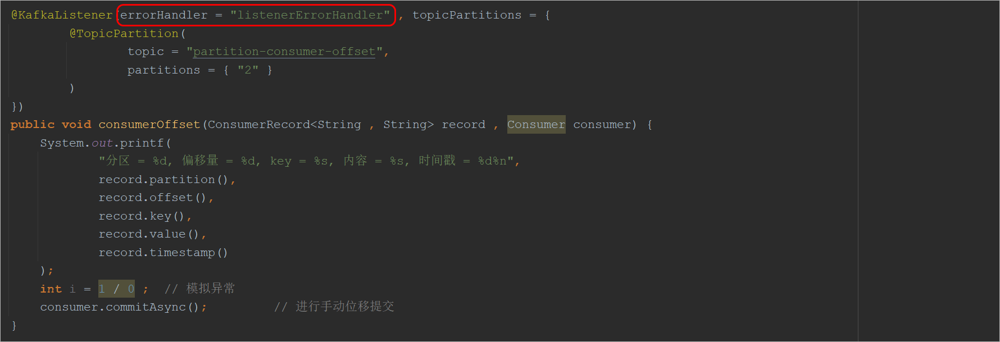 


# 5 MQ高级内容

## 5.1 消息可靠性传输

消息的可靠性传输：指消息在整个传输过程中保证消息不丢失。

消息传输过程回顾：


整个传输过程分为三个阶段：

1、生产者发生消息到MQ

2、MQ收到消息保存消息

3、消费者从MQ中获取消息进行消费

可靠性保证：

① 首先需要确保生产者是正常的将消息发给了MQ，可以将**acks的值设置为all**

② 其次要保证MQ中消息的高可用，可以针对**一个分区创建多个副本**，并且将多个副本分散存储到kafka cluster中的每一个节点上

③ 消费者可以将自动位移提交更改为**手动位移提交**


## 5.2 消息顺序消费问题

Kafka发送消息的时候，需要通过分区器对消息进行处理，然后将消息发送到指定的分区中：

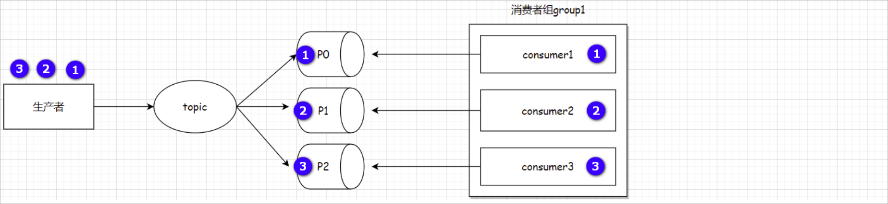 

上述生产者发送了3个消息分别是① ② ③；假设三个消息被分发到了不同的分区中，此时三个消费者分别从每一个分区中获取消息，由于每一个消费者的消费能力可能不同，因此在进行消费的时候可能会出现如下顺序：③ ① ② 就导致消息不是顺序性消费。

解决思路：将消息发送到**同一个分区**，可以保证消息的局部有序，因为**Kafka可以保证同一个分区的消息是严格有序的，然后设置retries等于0**。(如果不把retries设置为0，某批次的数据发送失败后，进行了重试，也可能出现后边的批次先于它到达的情况)


解决方案：

方案一：针对一个topic只创建一个分区

方案二：通过key将相同类型的消息发送到同一个分区中

```java
@Test
public void sendMsgOffset() throws ExecutionException, InterruptedException {
    SendResult sr1 = (SendResult) kafkaTemplate.send("partition-consumer-offset" , "order-1" , "msg03....").get() ;
    SendResult sr2 = (SendResult) kafkaTemplate.send("partition-consumer-offset" , "order-1" , "msg04....").get() ;
    System.out.println(sr1.getRecordMetadata().partition());
    System.out.println(sr2.getRecordMetadata().partition());
}

// 注意：需要使用默认的分区器
```

### 一、为什么会出现顺序错乱？
1. 分区的并行性：
   1. Kafka 的分区本质是 “并行处理单元”—— 不同分区的数据独立存储、独立被消费。生产者发送消息时，若未指定分区策略（或按 key 路由到不同分区），消息会分散到多个分区。
例：消息①到分区 0，②到分区 1，③到分区 2。
1. 消费者的独立性：
   1. 每个分区会被分配给消费者组中的一个消费者（或一个消费者的一个线程），不同消费者的处理速度完全独立（受自身资源、业务逻辑复杂度影响）。
   2. 例：消费分区 2 的消费者处理极快，先输出③；消费分区 0 的消费者稍慢，后输出①；消费分区 1 的消费者最慢，最后输出②，最终顺序变为③→①→②

### 二、如何保证消息的顺序消费？
若业务要求全局顺序（如事务步骤、流程状态变更），需从 “生产端分区路由” 和 “消费端处理机制” 两方面设计：
1. 生产端：将需顺序消费的消息路由到同一个分区
   1. Kafka 中，相同 key 的消息会被路由到同一个分区（默认分区策略：DefaultPartitioner 对 key 哈希后取模分区数）。因此，只需让 “有顺序依赖的消息” 使用相同的 key 即可
2. 消费端：确保同一个分区的消息被单线程顺序处理
   1. 即使消息在同一个分区，若消费端用多线程并行处理该分区的消息，仍可能导致顺序错乱（如线程 1 处理①，线程 2 提前处理②）。-----需保证：一个分区仅被一个消费线程处理。
   2. springkafka配置中通过 @KafkaListener 消费时，默认每个分区会被一个线程处理（concurrency 参数控制消费者线程数，需 ≤ 分区数，避免一个分区被多个线程处理

## 5.3 消息重复消费问题

导致出现消息重复消费的情况：

1、生产者重复发送消息

2、消费者重复消费消息

### 5.3.1 生产者重复发送消息

#### 原因说明

生产者发送的消息没有收到Broker正确的响应，导致生产者重试。

生产者发出一条消息，Broker落盘以后因为网络等种种原因，发送端得到一个发送失败的响应或者网络中断，然后生产者收到一个可恢复的 Exception 重试消息导致消息重复。

#### 重试过程

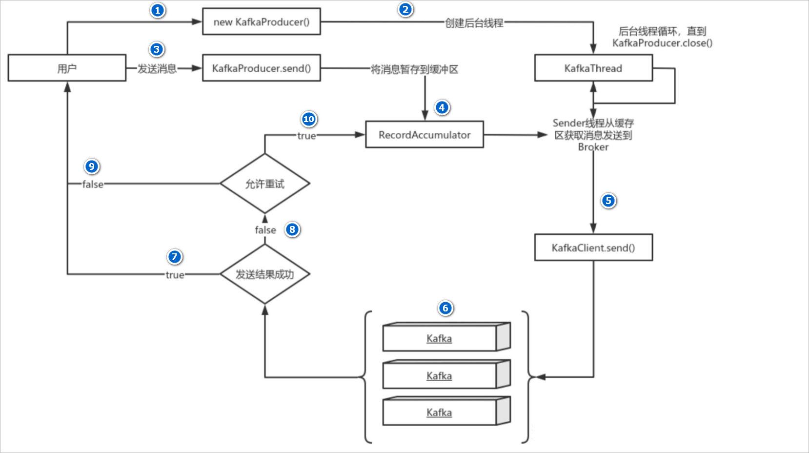 

主要流程说明：

1、new KafkaProducer() 后创建一个后台线程 KafkaThread 负责发送消息到Kafka集群

2、调用 KafkaProducer.send() 发送消息，实际上只是把消息保存到 RecordAccumulator 中；

3、RecordAccumulator 某一个批次被填满或者等待时间超过了所设定的阈值的时候，此时KafkaThread 线程就开始拉取消息，发送消息到Kafka集群

4、如果发送成功，那么返回成功；

5、如果发送失败，那么判断是否允许重试。如果不允许重试，那么返回失败的结果；如果允许重试，把消息再保存到 RecordAccumulator 中，等待后台线程 KafkaThread 再次发送。

#### Kafka的三种消息语义

在Kafka中消息存在三种语义：

1、最多一次（At most once）：消息可能会丢失，但绝不会被重复发送      ---->  Producer禁止重试

2、至少一次（At least once）：消息不会丢失，但有可能被重复发送       ---->  Producer开启了重试机制，当发送的消息没有收到Kafka集群成功的应答时会再次发送数据

3、仅有一次（Exactly once）：消息不会丢失，也不会被重复发送          ---->  Kafka通过**幂等性**和**事务**这两个机制保证了精准一次


#### 生产者幂等性

生产者幂等性就是指Producer不论向Broker发送多少次重复数据，Broker端都只会持久化一条，保证了不重复。

> 1、引入幂等性前，消息发送过程

Producer向Broker发送消息，然后Broker将消息追加到消息流中后再给Producer返回Ack信号值。

实现流程如下:

 

生产中，会出现各种不确定的因素，比如在Producer在发送给Broker的时候出现网络异常。比如以下这种异常情况的出现：

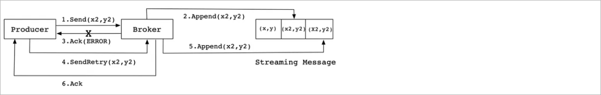 

上图这种情况，当 Producer 第一次发送消息给 Broker 时，Broker 将消息 (x2,y2) 追加到了消息流中， 但是在返回 Ack 信号给 Producer 时失败了（比如网

络异常） 。此时，Producer 端触发重试机制，将消息 (x2,y2) 重新发送给 Broker，Broker 接收到消息后，再次将该消息追加到消息流中，然后成功返回 Ack 信号给 Producer。这样下来，消息流中就被重复追加了两条相同的 (x2,y2) 的消息。

> 2、引入幂等性后，消息发送过程

Kafka为了实现幂等性，在 0.11.0 版本之后，它在底层设计架构中引入了ProducerID和SequenceNumber。

1、ProducerID：在每个新的 Producer 初始化时，会被分配一个唯一的 ProducerID，这个 ProducerID 对客户端使用者是不可见的。

2、SequenceNumber：对于每个 ProducerID的生产者向每个分区发送消息时，会为消息分配一个单调递增的序列号（从 0 开始）。
例如：向分区 P0 发送第 1 条消息序列号为 0，第 2 条为 1，以此类推

3、broker端去重逻辑
- Kafka broker 会为每个（PID, 分区）基于成功处理的消息，维护一个最新序列号。

- 当收到新消息时，broker 会检查消息的序列号：
  - 若序列号 = 最新序列号 + 1 → 正常写入，更新最新序列号。
  - 若序列号 ≤ 最新序列号 → 判定为重复消息，直接丢弃（不写入日志）。
  - 若序列号 > 最新序列号 + 1 → 判定为消息丢失（可能因生产者崩溃导致），拒绝写入并报错

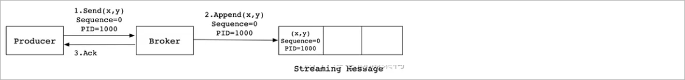 

同样，这是一种理想状态下的发送流程。实际情况下，会有很多不确定的因素，比如 Broker在发送Ack信号给Producer时出现网络异常，导致发送失败。

异常情况如下图所示：

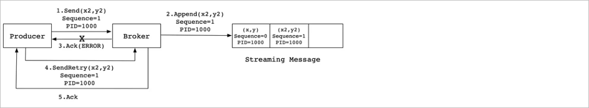 

当 Producer 发送消息 (x2,y2) 给 Broker 时，Broker 接收到消息并将其追加到消息流中。此时，Broker 返回 Ack 信号给 Producer 时，发生异常导致 

Producer 接收 Ack 信号失败。对于 Producer 来说，会触发重试机制，将消息 (x2,y2) 再次发送，但是，**由于引入了幂等性**，在每条消息中附带

PID(ProducerID) 和 SequenceNumber。相同的 PID 和 SequenceNumber 发送给 Broker，**而之前 Broker 缓存过之前发送的相同的消息**，那么在消息流中

的消息就只有一条 (x2,y2)，不会出现重复发送的情况。


幂等性配置说明：

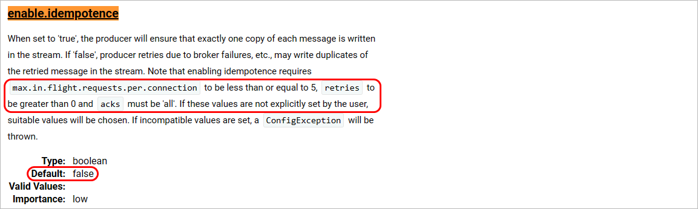 

幂等性完整配置：

```yaml
spring:
  kafka:
    bootstrap-servers: 192.168.100.102:9092,192.168.100.102:9093,192.168.100.102:9094
    producer:
      acks: -1		# 幂等性配置必须为-1
      retries: 1	# 幂等性配置要求，重试次数 > 0
      batch-size: 16384 # 批次大小 单位byte
      compression-type: gzip
      key-serializer: org.apache.kafka.common.serialization.StringSerializer # key的序列化器
      value-serializer: org.apache.kafka.common.serialization.StringSerializer # value的序列化器
      properties: {
        'linger.ms': 10 ,
        'interceptor.classes' : "com.atguigu.kafka.interceptor.CustomProducerInterceptor" ,
        'partitioner.class': "org.apache.kafka.clients.producer.internals.DefaultPartitioner" ,
        'enable.idempotence': "true",
        'max.in.flight.requests.per.connection': 5  # 幂等性配置要求该值必须小于或者等于5
      }   # 配置其他的属性
```

注意：**幂等生产者只能保证单个主题的单一分区内消息不重复**；其次，它只能实现单会话上的幂等性，不能实现跨会话的幂等性，这里的会话即可以理解为：Producer 进程的一次运行。当重启了 Producer 进程之后，则幂等性保证就失效了。如果我想实现多分区以及多会话上的消息无重复，应该怎么做呢？答案就是事务！

##### 幂等性的局限性
1. 仅保证单分区、单会话内的幂等
   1. 单分区：幂等性只对 “同一 PID + 同一分区” 的消息生效，跨分区的重复消息无法去重。
   2. 单会话：若生产者重启（PID 变更），新 PID 发送的消息与旧 PID 发送的消息无法去重（因 PID 不同）。
2. 无法解决业务层面的重复
   1. 若生产者因业务逻辑主动发送两条相同消息（如用户重复点击提交），幂等性无法去重（序列号不同）。
3. 性能损耗
   1. 幂等性需要 broker 维护序列号状态，会带来轻微的性能开销（通常可忽略）。


#### 生产者事务消息

Kafka的事务特性本质上是支持了Kafka跨分区和Topic的原子写操作。通过事务机制，KAFKA 可以实现对多个 topic 的多个 partition 的原子性的写入，即处于同一个事务内的所有消息，不管最终需要落地到哪个 topic 的哪个 partition, 最终结果都是**要么全部写成功，要么全部写失败**（Atomic multi-partition 

writes）


> 生产者事务演示

1、在配置文件中添加事务相关配置

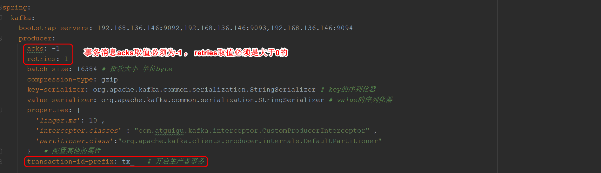 

2、代码演示

```java
// @Transactional          // 方式一需要添加该注解，但是添加该注解事务会自动回滚
@Test
public void sendMsgTransaction() throws ExecutionException, InterruptedException {

    // 方式一
    /*kafkaTemplate.send("topic-02" , 0 , null , "msg11....") ;
        int a = 1 / 0 ;
        kafkaTemplate.send("topic-02" , 1 , null , "msg12....") ;*/

    // 方式二
    kafkaTemplate.executeInTransaction(operations -> {
        operations.send("topic-02" , 0 , null , "msg09....") ;
        int a = 1 / 0 ;
        operations.send("topic-02" , 1 , null , "msg10....") ;
        return true ;
    }) ;

}
```

注意：**Kafka事务的回滚**，并不是删除已写入的数据，而是将写入数据的事务标记为 Rollback/Abort 从而在读数据时过滤该数据。


### 5.3.2 消费者重复消费消息

#### 常见原因

1. Kafka 默认开启自动位移提交（enable.auto.commit=true），按固定间隔（auto.commit.interval.ms=5000）提交位移。若在 “自动提交位移后、消息处理完成前” 消费者崩溃，会导致重复消费。
2. 若开启手动提交（enable.auto.commit=false），但未在 “消息处理完成后” 正确提交位移（如代码漏写提交逻辑、提交前消费者崩溃），会导致：
   1. 位移未更新，消费者重启后会从上次提交的位移开始消费，已处理但未提交的消息被重复拉取
3. 当消费者组发生重平衡（如消费者加入 / 退出、分区扩容）时，若消费者未及时提交位移，会导致：
   1. 分区被分配给新的消费者，新消费者会从 “该分区上次提交的位移” 开始消费（可能是更早的位置），导致中间的消息被重复消费


#### 解决方案：

1、确定成功处理消息后进行手动位移提交
2、优化重平衡机制，减少位移丢失
3、消费端做幂等性处理


#### 常见的幂等性解决方案：

A. 比如我们获取到数据操作数据库，你先根据某个字段查一下数据库，如果这数据都有了，你就别插入了，执行以下update操作

B. 比如我们消费的数据需要写Redis，那没问题了，反正每次都是set，天然幂等性。

C. 比如你不是上面两个场景，那做的稍微复杂一点，你需要让生产者发送每条数据的时候，里面加一个全局唯一的 id，类似订单 id 之类的东西，然后你这里消费到了之后，先根据这个id去比如 Redis里查一下，之前消费过吗？如果没有消费过，你就处理，然后这个id写 Redis。如果消费过了，那你就别处理了，保证别重复处理相同的消息即可。

D. 比如基于数据库的唯一键来保证重复数据不会重复插入多条。因为有唯一键约束了，重复数据插入只会报错，不会导致数据库中出现脏数据。

